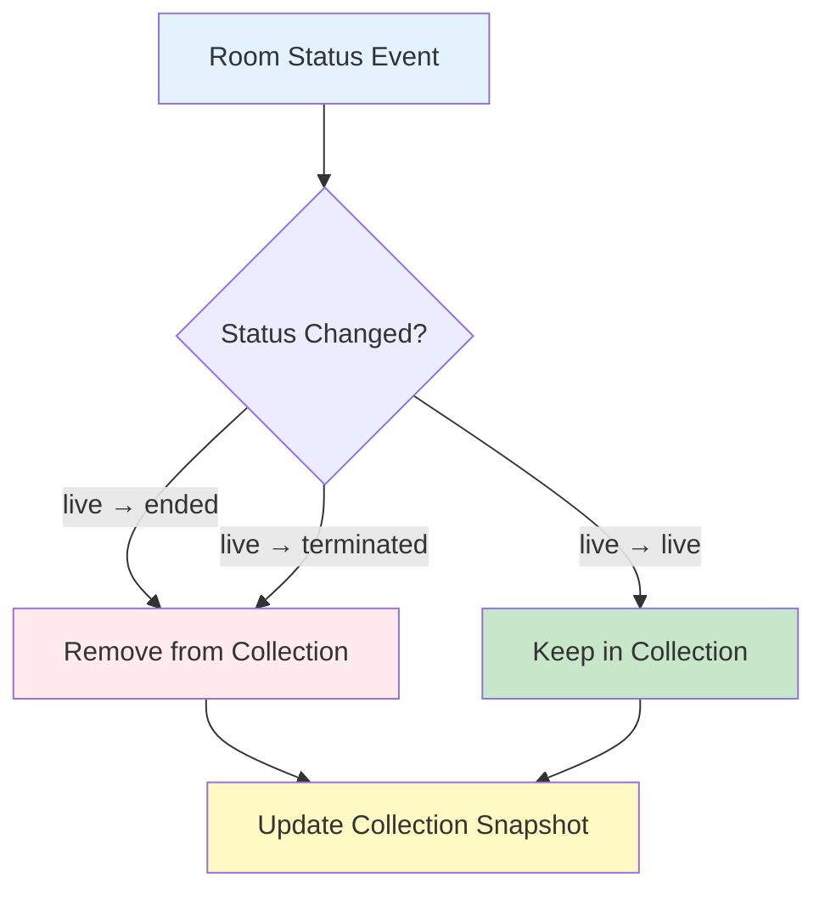

# Live Room Posts

Query currently active livestream posts to display Live Now rings, showing users which streams are broadcasting in real-time across communities and the global feed.

## Overview

The Live Room Posts feature provides specialized queries to fetch posts associated with rooms that are currently live. This powers the "Live Now rings" UI element that shows active livestreams alongside stories, helping users discover and join ongoing broadcasts.

## Key Features

<CardGroup cols={2}>
  <Card title="Global Live Rooms" icon="globe">
    **Discover live streams across all communities**
    - Query all currently live rooms
    - Fixed parameters for consistency
    - Up to 100 live room posts
    - Real-time status updates
  </Card>
  <Card title="Community Live Rooms" icon="users">
    **Community-specific live streams**
    - Filter by specific communities
    - Support single or multiple communities
    - Community-scoped discovery
    - Real-time filtering
  </Card>
  <Card title="Real-Time Updates" icon="arrows-rotate">
    **Live status synchronization**
    - Automatic status change detection
    - Remove ended streams from collection
    - Update linked room objects
    - Event-driven updates
  </Card>
  <Card title="Story Integration" icon="circle">
    **Seamless UI integration**
    - Display alongside story rings
    - Visual live indicators
    - Tap to join livestream
    - Unified discovery experience
  </Card>
</CardGroup>

## Global Live Room Posts

Query all currently live room posts across the platform:

<CodeGroup>
```swift iOS
let liveRoomPosts = AmityPostRepository.shared.getLiveRoomPosts()

liveRoomPosts.observe { posts in
    print("Live rooms: \(posts.count)")
    
    posts.forEach { post in
        if let roomPost = post.data as? AmityPostRoomData,
           let room = roomPost.room {
            print("Live: \(room.title)")
            print("Status: \(room.status)")
            print("Playback URL: \(room.livePlaybackUrl ?? "N/A")")
        }
    }
}
```

```kotlin Android
val liveRoomPosts = AmityPostRepository.getLiveRoomPosts()

liveRoomPosts.observe()
    .subscribe { posts ->
        Log.d("LiveRooms", "Live rooms: ${posts.size}")
        
        posts.forEach { post ->
            val roomData = post.data as? AmityPost.Data.ROOM
            roomData?.room?.let { room ->
                Log.d("LiveRooms", "Live: ${room.title}")
                Log.d("LiveRooms", "Status: ${room.status}")
                Log.d("LiveRooms", "Playback URL: ${room.livePlaybackUrl ?: "N/A"}")
            }
        }
    }
```

```typescript TypeScript
const liveRoomPosts = postRepository.getLiveRoomPosts();

liveRoomPosts.on("dataUpdated", (posts) => {
    console.log("Live rooms:", posts.length);
    
    posts.forEach(post => {
        if (post.dataType === "room" && post.data.room) {
            const room = post.data.room;
            console.log("Live:", room.title);
            console.log("Status:", room.status);
            console.log("Playback URL:", room.livePlaybackUrl || "N/A");
        }
    });
});
```

```dart Flutter
final liveRoomPosts = AmityPostRepository().getLiveRoomPosts();

liveRoomPosts.listen((posts) {
    print("Live rooms: ${posts.length}");
    
    for (var post in posts) {
        if (post.data is AmityPostRoomData) {
            final roomData = post.data as AmityPostRoomData;
            final room = roomData.room;
            if (room != null) {
                print("Live: ${room.title}");
                print("Status: ${room.status}");
                print("Playback URL: ${room.livePlaybackUrl ?? 'N/A'}");
            }
        }
    }
});
```
</CodeGroup>

### API Behavior

The `getLiveRoomPosts()` function:

**Fixed Parameters (handled internally by SDK):**
- `targetType`: Always `['all']`
- `limit`: Always `100`
- `sortBy`: Always `last_created`
- No pagination support

**Real-Time Filtering:**
- SDK filters to include only posts where `room.status === 'live'`
- Automatically removes posts when room status changes to `ended`, `terminated`, etc.
- Updates triggered by room status change events

<Info>
**Automatic Filtering**: The SDK handles real-time filtering based on room status. You receive only posts with currently live rooms.
</Info>

## Community Live Room Posts

Query live rooms for specific communities:

<CodeGroup>
```swift iOS
let communityLiveRooms = AmityPostRepository.shared.getCommunityLiveRoomPosts(
    communityIds: ["community-123", "community-456"]
)

communityLiveRooms.observe { posts in
    print("Community live rooms: \(posts.count)")
    
    posts.forEach { post in
        print("Target: \(post.targetId)")
        
        if let roomPost = post.data as? AmityPostRoomData,
           let room = roomPost.room {
            print("Room: \(room.title)")
        }
    }
}
```

```kotlin Android
val communityLiveRooms = AmityPostRepository.getCommunityLiveRoomPosts(
    communityIds = listOf("community-123", "community-456")
)

communityLiveRooms.observe()
    .subscribe { posts ->
        Log.d("LiveRooms", "Community live rooms: ${posts.size}")
        
        posts.forEach { post ->
            Log.d("LiveRooms", "Target: ${post.targetId}")
            
            val roomData = post.data as? AmityPost.Data.ROOM
            roomData?.room?.let { room ->
                Log.d("LiveRooms", "Room: ${room.title}")
            }
        }
    }
```

```typescript TypeScript
const communityLiveRooms = postRepository.getCommunityLiveRoomPosts(
    ["community-123", "community-456"]
);

communityLiveRooms.on("dataUpdated", (posts) => {
    console.log("Community live rooms:", posts.length);
    
    posts.forEach(post => {
        console.log("Target:", post.targetId);
        
        if (post.dataType === "room" && post.data.room) {
            console.log("Room:", post.data.room.title);
        }
    });
});
```

```dart Flutter
final communityLiveRooms = AmityPostRepository().getCommunityLiveRoomPosts(
    communityIds: ["community-123", "community-456"]
);

communityLiveRooms.listen((posts) {
    print("Community live rooms: ${posts.length}");
    
    for (var post in posts) {
        print("Target: ${post.targetId}");
        
        if (post.data is AmityPostRoomData) {
            final roomData = post.data as AmityPostRoomData;
            print("Room: ${roomData.room?.title}");
        }
    }
});
```
</CodeGroup>

### Single Community

Query live rooms for a single community:

<CodeGroup>
```swift iOS
let singleCommunityLiveRooms = AmityPostRepository.shared.getCommunityLiveRoomPosts(
    communityIds: ["community-123"]
)
```

```kotlin Android
val singleCommunityLiveRooms = AmityPostRepository.getCommunityLiveRoomPosts(
    communityIds = listOf("community-123")
)
```

```typescript TypeScript
const singleCommunityLiveRooms = postRepository.getCommunityLiveRoomPosts(
    ["community-123"]
);
```

```dart Flutter
final singleCommunityLiveRooms = AmityPostRepository().getCommunityLiveRoomPosts(
    communityIds: ["community-123"]
);
```
</CodeGroup>

### API Behavior

The `getCommunityLiveRoomPosts(communityIds)` function:

**Parameters:**
- `communityIds`: Array of community IDs to query
- Supports single or multiple communities

**Fixed Parameters (handled internally by SDK):**
- `targetType`: Always `['community']`
- `limit`: Always `100`
- `sortBy`: Always `last_created`
- No pagination support

**Real-Time Filtering:**
- SDK filters to include only posts where `room.status === 'live'`
- Scoped to specified communities via `targetIds`
- Automatically removes posts when room ends

## Data Structure

Posts returned contain room data with linked room objects:

```typescript
interface AmityPost {
  postId: string;
  dataType: "room";
  targetType: "community" | "user";
  targetId: string;
  
  data: {
    postId: string;
    roomId: string;
    room: AmityRoom; // Linked room object
  };
  
  // ... other post fields
}

// Linked room contains status and streaming details
interface AmityRoom {
  roomId: string;
  status: "live"; // Always "live" in these queries
  title: string;
  description?: string;
  livePlaybackUrl: string;
  channelId?: string;
  participants: AmityRoomParticipant[];
  // ... other room fields
}
```

## Real-Time Updates

### Status Change Events

The SDK handles room status changes automatically:



**Lifecycle Events Handled:**
1. `room.ended` → Room status changed to "ended" (removed from collection)
2. `room.terminated` → Room status changed to "terminated" (removed from collection)

<Note>
**Addition Not Supported**: When a room changes from "idle" to "live", it will NOT be automatically added to existing collections. Only removal is handled in real-time.
</Note>

### Collection Updates

```typescript
const liveRooms = postRepository.getLiveRoomPosts();

liveRooms.on("dataUpdated", (posts) => {
    // Collection automatically updated when room status changes
    // Posts with ended/terminated rooms are removed
    // No need for manual filtering
    
    displayLiveRooms(posts);
});
```

## UIKit Integration

### Global Feed Story Tab

Display Live Now rings in the global feed:

```typescript
// Live room posts appear before story targets in global feed
const liveRoomPosts = postRepository.getLiveRoomPosts();

liveRoomPosts.on("dataUpdated", (posts) => {
    if (posts.length > 0) {
        // Display live room rings
        showLiveNowRings(posts);
    } else {
        // Hide live room section if no live rooms
        hideLiveNowRings();
    }
});
```

### Community Story Tab

Display Live Now rings in community profile:

```typescript
// Live room posts appear after story targets in community feed
const communityLiveRooms = postRepository.getCommunityLiveRoomPosts([communityId]);

communityLiveRooms.on("dataUpdated", (posts) => {
    if (posts.length > 0) {
        // Display community live room rings
        showCommunityLiveRings(posts);
    } else {
        // Hide if no live rooms (or no stories + no create permission)
        hideCommunityLiveRings();
    }
});
```

## Common Use Cases

### Live Now Rings Display

```typescript
function displayLiveNowRings() {
    const liveRooms = postRepository.getLiveRoomPosts();
    
    liveRooms.on("dataUpdated", (posts) => {
        const liveRingData = posts.map(post => {
            const room = post.data.room;
            return {
                postId: post.postId,
                roomId: room.roomId,
                title: room.title,
                thumbnail: room.getThumbnail()?.fileUrl,
                isLive: room.status === "live",
                playbackUrl: room.livePlaybackUrl,
                channelId: room.channelId
            };
        });
        
        renderLiveRings(liveRingData);
    });
}
```

### Tap to Join Livestream

```typescript
function handleLiveRingTap(postId: string) {
    // Get the post to access room details
    const post = await postRepository.getPost(postId);
    
    if (post.dataType === "room" && post.data.room) {
        const room = post.data.room;
        
        // Navigate to livestream viewer
        navigateToLivestreamPlayer({
            post: post,
            roomId: room.roomId,
            playbackUrl: room.livePlaybackUrl,
            channelId: room.channelId
        });
    }
}
```

### Empty State Handling

```typescript
function handleEmptyState() {
    const liveRooms = postRepository.getLiveRoomPosts();
    const stories = storyRepository.getStories();
    
    Promise.all([
        liveRooms.getSnapshot(),
        stories.getSnapshot()
    ]).then(([liveRoomPosts, storyTargets]) => {
        const hasLiveRooms = liveRoomPosts.length > 0;
        const hasStories = storyTargets.length > 0;
        
        if (!hasLiveRooms && !hasStories) {
            // Hide entire story tab component in newsfeed
            hideStoryTabComponent();
        } else {
            // Show component
            showStoryTabComponent();
        }
    });
}
```

### Community Empty State

```typescript
function handleCommunityEmptyState(communityId: string) {
    const liveRooms = postRepository.getCommunityLiveRoomPosts([communityId]);
    const stories = storyRepository.getCommunityStories(communityId);
    const canCreateStory = await checkCreateStoryPermission(communityId);
    
    Promise.all([
        liveRooms.getSnapshot(),
        stories.getSnapshot()
    ]).then(([liveRoomPosts, storyTargets]) => {
        const hasLiveRooms = liveRoomPosts.length > 0;
        const hasStories = storyTargets.length > 0;
        
        if (!hasLiveRooms && !hasStories && !canCreateStory) {
            // Hide community live room target
            hideCommunityLiveRoomTarget();
        }
    });
}
```

## Best Practices

<AccordionGroup>
  <Accordion title="Efficient Queries" icon="gauge-high">
    Optimize live room queries:
    
    - Use appropriate query for context (global vs community)
    - Limit community IDs to relevant communities
    - Unsubscribe when view is not visible
    - Cache results for brief periods
  </Accordion>
  
  <Accordion title="UI Updates" icon="arrows-rotate">
    Handle real-time updates smoothly:
    
    - Animate ring additions/removals
    - Update UI immediately on status changes
    - Show loading states during initial fetch
    - Handle empty states gracefully
  </Accordion>
  
  <Accordion title="Performance" icon="bolt">
    Maintain good performance:
    
    - Implement virtualization for many live rooms
    - Lazy load thumbnails
    - Debounce rapid updates
    - Clean up subscriptions properly
  </Accordion>
  
  <Accordion title="User Experience" icon="user">
    Provide clear user experience:
    
    - Show visual "LIVE" indicators
    - Display viewer/participant counts
    - Provide smooth tap-to-join experience
    - Handle network issues gracefully
  </Accordion>
</AccordionGroup>

## Pagination

<Warning>
**No Pagination**: Live room post queries do not support pagination. The SDK returns up to 100 posts sorted by creation date (newest first).
</Warning>

## Limitations

1. **Maximum Results**: Up to 100 live room posts returned
2. **No Pagination**: Cannot fetch additional pages
3. **Fixed Sorting**: Always sorted by `last_created` (newest first)
4. **No Custom Filters**: Cannot add custom filters beyond community IDs
5. **Addition Not Supported**: Idle → Live transitions don't add posts to existing collections

## Integration with Rooms

Live room posts link to room objects:

```typescript
const liveRooms = postRepository.getLiveRoomPosts();

liveRooms.on("dataUpdated", (posts) => {
    posts.forEach(post => {
        const room = post.data.room;
        
        // Access room details
        console.log("Room:", room.title);
        console.log("Status:", room.status); // Always "live"
        console.log("Playback:", room.livePlaybackUrl);
        
        // Access room participants
        console.log("Participants:", room.participants.length);
        
        // Access room channel for chat
        if (room.channelId) {
            const channel = room.channel;
            console.log("Chat channel:", channel.channelId);
        }
    });
});
```

## Error Handling

<CodeGroup>
```swift iOS
liveRoomPosts.observe { result in
    switch result {
    case .success(let posts):
        displayLiveRooms(posts)
    case .failure(let error):
        print("Error loading live rooms: \(error)")
        showErrorState()
    }
}
```

```kotlin Android
liveRoomPosts.observe()
    .subscribe(
        onNext = { posts ->
            displayLiveRooms(posts)
        },
        onError = { error ->
            Log.e("LiveRooms", "Error loading", error)
            showErrorState()
        }
    )
```

```typescript TypeScript
liveRoomPosts.on("dataUpdated", (posts) => {
    displayLiveRooms(posts);
});

liveRoomPosts.on("error", (error) => {
    console.error("Error loading live rooms:", error);
    showErrorState();
});
```

```dart Flutter
liveRoomPosts.listen(
    (posts) {
        displayLiveRooms(posts);
    },
    onError: (error) {
        print("Error loading live rooms: $error");
        showErrorState();
    }
);
```
</CodeGroup>

## Related Topics

<CardGroup cols={3}>
  <Card title="Rooms Overview" href="/social-plus-sdk/video-new/broadcasting/rooms-overview" icon="book">
    Learn about room concepts
  </Card>
  <Card title="Manage Rooms" href="/social-plus-sdk/video-new/broadcasting/manage-rooms" icon="gear">
    Query and control rooms
  </Card>
  <Card title="Story Component" href="/uikit/components/social/story" icon="circle">
    UIKit story and live ring display
  </Card>
</CardGroup>
