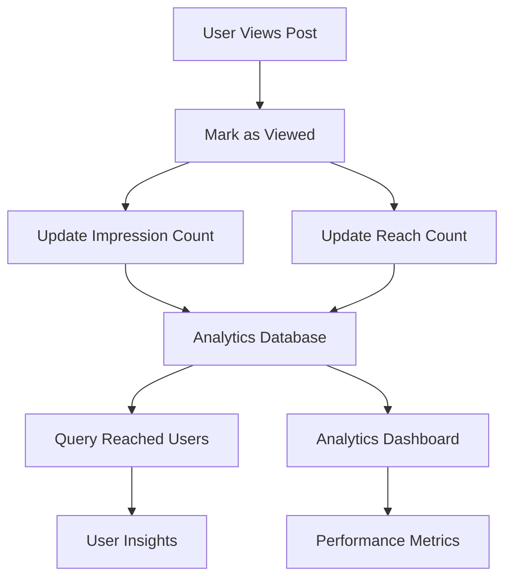

# Post Impressions

Post impressions provide powerful analytics capabilities to track how users interact with content. This feature enables content creators and community managers to gain valuable insights into post performance, user engagement patterns, and content reach across their communities.

<Info>
**Impressions** represent the total number of times a post has been viewed, while **reach** represents the number of unique users who have viewed the post. Post impression data is updated in near real-time for optimal performance.
</Info>

## Architecture Overview



## Mark Post as Viewed

When a user views a post, call the `markAsViewed()` method to increment impression and reach counts. This should typically be called when the post becomes visible in the user's viewport.

<Tabs>
  <Tab title="iOS">
    <CodeGroup>
```swift
// Basic impression tracking
func markPostAsViewed(post: AmityPost) {
    post.analytics.markAsViewed { result in
        switch result {
        case .success:
            print("Post impression recorded successfully")
            // Update UI with new impression count
            updateImpressionCount(post.impressionCount)
        case .failure(let error):
            print("Failed to record impression: \(error)")
        }
    }
}

// Advanced: Track impressions with viewport detection
func trackPostImpression(post: AmityPost, visibilityPercentage: Double) {
    // Only track if post is at least 50% visible
    guard visibilityPercentage >= 0.5 else { return }
    
    // Avoid duplicate impressions within a session
    let impressionKey = "impression_\(post.postId)"
    guard !UserDefaults.standard.bool(forKey: impressionKey) else { return }
    
    post.analytics.markAsViewed { result in
        switch result {
        case .success:
            UserDefaults.standard.set(true, forKey: impressionKey)
            NotificationCenter.default.post(
                name: .postImpressionRecorded,
                object: post
            )
        case .failure(let error):
            print("Impression tracking failed: \(error)")
        }
    }
}
```
    </CodeGroup>
  </Tab>
  <Tab title="Android">
    <CodeGroup>
```kotlin
// Basic impression tracking
fun markPostAsViewed(post: AmityPost) {
    post.analytics.markAsViewed()
        .observeOn(AndroidSchedulers.mainThread())
        .subscribe(
            {
                println("Post impression recorded successfully")
                // Update UI with new impression count
                updateImpressionCount(post.impressionCount)
            },
            { error ->
                println("Failed to record impression: ${error.message}")
            }
        )
}

// Advanced: Track impressions with RecyclerView
class PostViewHolder(itemView: View) : RecyclerView.ViewHolder(itemView) {
    private val impressedPosts = mutableSetOf<String>()
    
    fun bind(post: AmityPost) {
        // Track impression when item is bound and visible
        if (!impressedPosts.contains(post.postId)) {
            post.analytics.markAsViewed()
                .subscribe(
                    { impressedPosts.add(post.postId) },
                    { error -> Log.e("Impression", "Failed: ${error.message}") }
                )
        }
        
        // Display impression count
        impressionCountText.text = "${post.impressionCount} views"
        reachCountText.text = "${post.reachCount} unique viewers"
    }
}
```
    </CodeGroup>
  </Tab>
  <Tab title="TypeScript">
    <CodeGroup>
```typescript
// Basic impression tracking
async function markPostAsViewed(post: AmityPost): Promise<void> {
  try {
    await post.analytics.markAsViewed();
    console.log('Post impression recorded successfully');
    
    // Update UI with new counts
    updateImpressionDisplay(post.impressionCount, post.reachCount);
  } catch (error) {
    console.error('Failed to record impression:', error);
    throw error;
  }
}

// Advanced: Intersection Observer for viewport tracking
class PostImpressionTracker {
  private observer: IntersectionObserver;
  private impressedPosts = new Set<string>();
  
  constructor() {
    this.observer = new IntersectionObserver(
      this.handleIntersection.bind(this),
      { threshold: 0.5 } // Track when 50% visible
    );
  }
  
  private async handleIntersection(entries: IntersectionObserverEntry[]) {
    for (const entry of entries) {
      if (entry.isIntersecting) {
        const postElement = entry.target as HTMLElement;
        const postId = postElement.dataset.postId;
        const post = postElement.dataset.post as AmityPost;
        
        if (postId && !this.impressedPosts.has(postId)) {
          try {
            await post.analytics.markAsViewed();
            this.impressedPosts.add(postId);
            this.updateImpressionUI(postElement, post);
          } catch (error) {
            console.error('Impression tracking failed:', error);
          }
        }
      }
    }
  }
  
  trackPost(element: HTMLElement) {
    this.observer.observe(element);
  }
  
  private updateImpressionUI(element: HTMLElement, post: AmityPost) {
    const impressionEl = element.querySelector('.impression-count');
    if (impressionEl) {
      impressionEl.textContent = `${post.impressionCount} views`;
    }
  }
}
```
    </CodeGroup>
  </Tab>
  <Tab title="Flutter">
    <CodeGroup>
```dart
// Basic impression tracking
Future<void> markPostAsViewed(AmityPost post) async {
  try {
    await post.analytics.markAsViewed();
    print('Post impression recorded successfully');
    
    // Update UI with new counts
    _updateImpressionCount(post.impressionCount);
  } catch (error) {
    print('Failed to record impression: $error');
    rethrow;
  }
}

// Advanced: VisibilityDetector for viewport tracking
class PostImpressionWidget extends StatefulWidget {
  final AmityPost post;
  final Widget child;
  
  const PostImpressionWidget({
    Key? key,
    required this.post,
    required this.child,
  }) : super(key: key);
  
  @override
  State<PostImpressionWidget> createState() => _PostImpressionWidgetState();
}

class _PostImpressionWidgetState extends State<PostImpressionWidget> {
  static final Set<String> _impressedPosts = <String>{};
  
  @override
  Widget build(BuildContext context) {
    return VisibilityDetector(
      key: Key('post_${widget.post.postId}'),
      onVisibilityChanged: (info) {
        // Track impression when 50% visible
        if (info.visibleFraction >= 0.5 && 
            !_impressedPosts.contains(widget.post.postId)) {
          _trackImpression();
        }
      },
      child: widget.child,
    );
  }
  
  Future<void> _trackImpression() async {
    try {
      await widget.post.analytics.markAsViewed();
      _impressedPosts.add(widget.post.postId);
      
      // Trigger UI update
      if (mounted) {
        setState(() {});
      }
    } catch (error) {
      print('Impression tracking failed: $error');
    }
  }
}
```
    </CodeGroup>
  </Tab>
</Tabs>

## Query Reached Users

Retrieve a list of unique users who have viewed a specific post. This is valuable for understanding audience engagement and user behavior patterns.

### Parameters

| Parameter | Type | Description |
|-----------|------|-------------|
| `viewedType` | `ViewedType` | The type of content (`POST`) |
| `viewedId` | `String` | The unique identifier of the post |
| `limit` | `Number` | Maximum number of users to return (optional) |
| `before` | `String` | Pagination cursor for previous page (optional) |

<Tabs>
  <Tab title="iOS">
    <CodeGroup>
```swift
// Basic query for reached users
func queryReachedUsers(postId: String) async throws -> [AmityUser] {
    let repository = AmityUserRepository(client: client)
    let users = try await repository.queryReachedUsers(
        viewedType: .post,
        viewedId: postId
    )
    
    print("Post reached \(users.count) unique users")
    return users.object
}

// Advanced: Paginated query with analytics
func getPostReachAnalytics(postId: String) async throws -> PostReachAnalytics {
    let repository = AmityUserRepository(client: client)
    
    // Get all reached users with pagination
    var allUsers: [AmityUser] = []
    var hasMore = true
    var before: String? = nil
    
    while hasMore {
        let result = try await repository.queryReachedUsers(
            viewedType: .post,
            viewedId: postId,
            limit: 50,
            before: before
        )
        
        allUsers.append(contentsOf: result.object)
        hasMore = result.hasNext
        before = result.nextToken
    }
    
    // Analyze user engagement patterns
    let analytics = PostReachAnalytics(
        totalReach: allUsers.count,
        userDemographics: analyzeDemographics(allUsers),
        engagementScore: calculateEngagementScore(allUsers)
    )
    
    return analytics
}
```
    </CodeGroup>
  </Tab>
  <Tab title="Android">
    <CodeGroup>
```kotlin
// Basic query for reached users
fun queryReachedUsers(postId: String): Single<List<AmityUser>> {
    val repository = AmityUserRepository(client)
    return repository.queryReachedUsers(ViewedType.POST, postId)
        .observeOn(AndroidSchedulers.mainThread())
        .doOnSuccess { users ->
            println("Post reached ${users.size} unique users")
        }
}

// Advanced: Observable query with real-time updates
fun observePostReach(postId: String): Observable<PostReachData> {
    val repository = AmityUserRepository(client)
    
    return repository.queryReachedUsers(ViewedType.POST, postId)
        .toObservable()
        .map { users ->
            PostReachData(
                reachCount = users.size,
                users = users,
                demographics = analyzeDemographics(users),
                lastUpdated = System.currentTimeMillis()
            )
        }
        .distinctUntilChanged()
}

// Batch query multiple posts
fun queryMultiplePostsReach(postIds: List<String>): Single<Map<String, List<AmityUser>>> {
    val repository = AmityUserRepository(client)
    
    return Observable.fromIterable(postIds)
        .flatMap { postId ->
            repository.queryReachedUsers(ViewedType.POST, postId)
                .toObservable()
                .map { users -> postId to users }
        }
        .toMap()
}
```
    </CodeGroup>
  </Tab>
  <Tab title="TypeScript">
    <CodeGroup>
```typescript
// Basic query for reached users
async function queryReachedUsers(postId: string): Promise<AmityUser[]> {
  try {
    const userRepository = new AmityUserRepository(client);
    const users = await userRepository.queryReachedUsers('POST', postId);
    
    console.log(`Post reached ${users.length} unique users`);
    return users;
  } catch (error) {
    console.error('Failed to query reached users:', error);
    throw error;
  }
}

// Advanced: Paginated query with analytics
interface PostReachAnalytics {
  totalReach: number;
  users: AmityUser[];
  demographics: UserDemographics;
  engagementTimeline: EngagementPoint[];
}

async function getPostReachAnalytics(postId: string): Promise<PostReachAnalytics> {
  const userRepository = new AmityUserRepository(client);
  let allUsers: AmityUser[] = [];
  let hasMore = true;
  let before: string | undefined;
  
  // Fetch all reached users with pagination
  while (hasMore) {
    const { data: users, pagination } = await userRepository.queryReachedUsers(
      'POST',
      postId,
      { limit: 50, before }
    );
    
    allUsers = allUsers.concat(users);
    hasMore = pagination.hasNext;
    before = pagination.next;
  }
  
  // Generate analytics
  const analytics: PostReachAnalytics = {
    totalReach: allUsers.length,
    users: allUsers,
    demographics: analyzeDemographics(allUsers),
    engagementTimeline: generateEngagementTimeline(allUsers)
  };
  
  return analytics;
}

// Real-time reach tracking
class PostReachTracker {
  private reachCache = new Map<string, AmityUser[]>();
  
  async trackPostReach(postId: string): Promise<void> {
    const users = await this.queryReachedUsers(postId);
    this.reachCache.set(postId, users);
    
    // Emit reach update event
    this.emit('reachUpdated', { postId, users });
  }
  
  getReachData(postId: string): AmityUser[] | null {
    return this.reachCache.get(postId) || null;
  }
}
```
    </CodeGroup>
  </Tab>
  <Tab title="Flutter">
    <CodeGroup>
```dart
// Basic query for reached users
Future<List<AmityUser>> queryReachedUsers(String postId) async {
  try {
    final repository = AmityUserRepository(client);
    final users = await repository.queryReachedUsers(
      ViewedType.post,
      postId,
    );
    
    print('Post reached ${users.length} unique users');
    return users;
  } catch (error) {
    print('Failed to query reached users: $error');
    rethrow;
  }
}

// Advanced: Stream-based real-time reach tracking
class PostReachProvider extends ChangeNotifier {
  final AmityUserRepository _repository;
  final Map<String, List<AmityUser>> _reachCache = {};
  
  PostReachProvider(this._repository);
  
  Stream<List<AmityUser>> watchPostReach(String postId) {
    return Stream.periodic(const Duration(seconds: 30))
        .asyncMap((_) => _fetchReachedUsers(postId))
        .distinct();
  }
  
  Future<List<AmityUser>> _fetchReachedUsers(String postId) async {
    try {
      final users = await _repository.queryReachedUsers(
        ViewedType.post,
        postId,
      );
      
      _reachCache[postId] = users;
      notifyListeners();
      
      return users;
    } catch (error) {
      print('Error fetching reached users: $error');
      return _reachCache[postId] ?? [];
    }
  }
  
  List<AmityUser>? getCachedReach(String postId) {
    return _reachCache[postId];
  }
}

// Widget for displaying reach analytics
class PostReachWidget extends StatelessWidget {
  final String postId;
  final PostReachProvider reachProvider;
  
  const PostReachWidget({
    Key? key,
    required this.postId,
    required this.reachProvider,
  }) : super(key: key);
  
  @override
  Widget build(BuildContext context) {
    return StreamBuilder<List<AmityUser>>(
      stream: reachProvider.watchPostReach(postId),
      builder: (context, snapshot) {
        if (snapshot.hasData) {
          final users = snapshot.data!;
          return Column(
            children: [
              Text('Reached: ${users.length} users'),
              // Display user avatars or list
              Wrap(
                children: users.take(5).map((user) => 
                  CircleAvatar(
                    backgroundImage: NetworkImage(user.avatarUrl ?? ''),
                    radius: 16,
                  )
                ).toList(),
              ),
            ],
          );
        }
        return const CircularProgressIndicator();
      },
    );
  }
}
```
    </CodeGroup>
  </Tab>
</Tabs>

## Best Practices

<AccordionGroup>
  <Accordion title="Impression Tracking Optimization">
    - **Viewport Detection**: Only mark posts as viewed when they're substantially visible (≥50% viewport)
    - **Debouncing**: Avoid duplicate impressions within the same session
    - **Batch Processing**: Group impression calls to reduce API overhead
    - **Error Handling**: Implement retry logic for failed impression tracking
  </Accordion>

  <Accordion title="Performance Considerations">
    - **Caching**: Cache reached user data to minimize repeated API calls
    - **Pagination**: Use pagination for posts with high reach counts
    - **Background Processing**: Track impressions asynchronously to avoid UI blocking
    - **Memory Management**: Clear impression caches periodically to prevent memory leaks
  </Accordion>

  <Accordion title="Analytics Integration">
    - **Custom Events**: Emit custom events for impression tracking integration
    - **Demographic Analysis**: Analyze user demographics from reached user data
    - **Engagement Scoring**: Calculate engagement scores based on reach and interaction patterns
    - **Time-based Analytics**: Track impression patterns over time for insights
  </Accordion>

  <Accordion title="Privacy & Compliance">
    - **User Consent**: Ensure proper consent for analytics tracking
    - **Data Retention**: Implement appropriate data retention policies
    - **Anonymization**: Consider anonymizing impression data when possible
    - **GDPR Compliance**: Respect user rights regarding analytics data
  </Accordion>
</AccordionGroup>

## Error Handling

Common errors and solutions:

| Error | Cause | Solution |
|-------|-------|----------|
| `IMPRESSION_FAILED` | Network connectivity issues | Implement retry logic with exponential backoff |
| `INVALID_POST_ID` | Post doesn't exist or is inaccessible | Validate post existence before tracking |
| `RATE_LIMIT_EXCEEDED` | Too many impression calls | Implement client-side rate limiting |
| `PERMISSION_DENIED` | Insufficient permissions to view reach data | Check user permissions before querying |

## Real-World Use Cases

<CardGroup cols={2}>
  <Card title="Content Analytics Dashboard" icon="chart-line">
    Track post performance metrics to optimize content strategy and identify high-performing content types.
  </Card>
  
  <Card title="Audience Insights" icon="users">
    Analyze user demographics and engagement patterns to better understand your community audience.
  </Card>
  
  <Card title="A/B Testing" icon="flask">
    Compare impression rates between different post formats or content variations.
  </Card>
  
  <Card title="Engagement Scoring" icon="star">
    Calculate post engagement scores based on reach, impressions, and user interaction patterns.
  </Card>
</CardGroup>