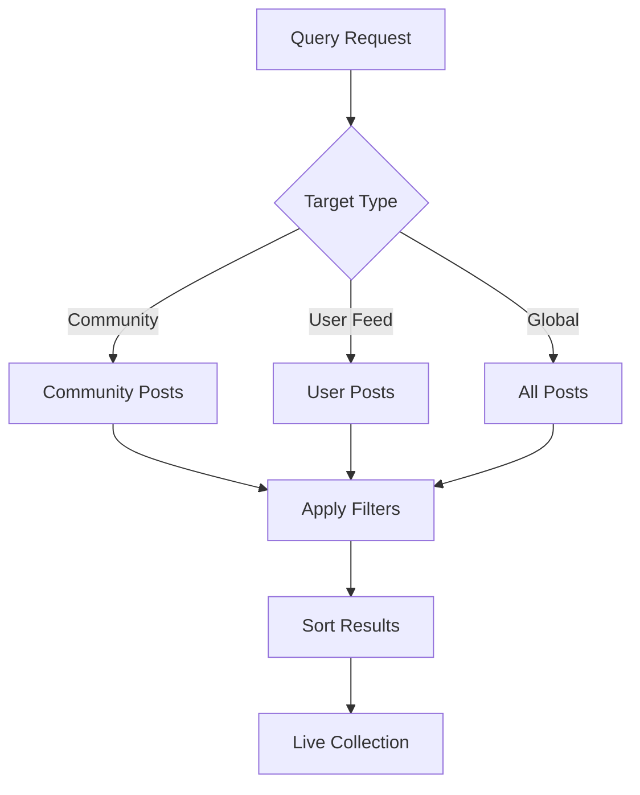

# Query Posts

The social.plus SDK provides powerful post querying functionality that enables flexible content discovery and filtering. Query posts from communities, user feeds, or across the entire platform with customizable search criteria and real-time results.

## Overview



<CardGroup cols={2}>
  <Card title="Flexible Filtering" icon="filter">
    Filter by post type, target, deletion status, and custom criteria
  </Card>
  <Card title="Live Results" icon="broadcast-tower">
    Query results are returned as live collections with real-time updates
  </Card>
</CardGroup>

## Query Parameters

| Parameter        | Type    | Description           | Options                                                          |
| ---------------- | ------- | --------------------- | ---------------------------------------------------------------- |
| `targetId`       | String  | Community or user ID  | Community ID, User ID                                            |
| `targetType`     | String  | Type of target        | `community`, `user`                                              |
| `types`          | Array   | Post content types    | `text`, `image`, `video`, `file`, `poll`, `liveStream`, `custom` |
| `includeDeleted` | Boolean | Include deleted posts | `true`, `false` (default)                                        |
| `sortBy`         | String  | Sort order            | `lastCreated` (default), `firstCreated`                          |
| `feedType`       | String  | Feed type filter      | `published`, `reviewing`, `declined`                             |

## Basic Post Querying

<Tabs>
  <Tab title="iOS">
    ```swift
    import AmitySDK
    
    class PostQueryManager {
        private let client: AmityClient
        
        init(client: AmityClient) {
            self.client = client
        }
        
        // Query community posts with basic filters
        func queryCommunityPosts(
            communityId: String,
            postTypes: [AmityPostDataType] = [],
            includeDeleted: Bool = false
        ) -> AmityCollection<AmityPost> {
            
            let repository = AmityPostRepository(client: client)
            let query = AmityPostQuery()
                .targetId(communityId)
                .targetType(.community)
                .sortBy(.lastCreated)
                .includeDeleted(includeDeleted)
            
            if !postTypes.isEmpty {
                query.types(postTypes)
            }
            
            return repository.getPosts(query: query)
        }
        
        // Query user feed posts
        func queryUserPosts(
            userId: String,
            sortBy: AmityPostQuerySortOption = .lastCreated
        ) -> AmityCollection<AmityPost> {
            
            let repository = AmityPostRepository(client: client)
            let query = AmityPostQuery()
                .targetId(userId)
                .targetType(.user)
                .sortBy(sortBy)
                .includeDeleted(false)
            
            return repository.getPosts(query: query)
        }
        
        // Advanced media gallery query
        func queryMediaGallery(
            targetId: String,
            targetType: AmityPostTargetType,
            mediaTypes: [AmityPostDataType] = [.image, .video]
        ) -> AmityCollection<AmityPost> {
            
            let repository = AmityPostRepository(client: client)
            let query = AmityPostQuery()
                .targetId(targetId)
                .targetType(targetType)
                .types(mediaTypes)
                .sortBy(.lastCreated)
                .includeDeleted(false)
            
            return repository.getPosts(query: query)
        }
        
        // Query posts with live observation
        func observePosts(
            communityId: String,
            onUpdate: @escaping ([AmityPost]) -> Void,
            onError: @escaping (Error) -> Void
        ) -> AmityNotificationToken {
            
            let collection = queryCommunityPosts(communityId: communityId)
            
            return collection.observe { result in
                switch result {
                case .success(let postsInfo):
                    let posts = postsInfo.object
                    print("Posts updated: \(posts.count) total")
                    onUpdate(posts)
                    
                case .failure(let error):
                    print("Query error: \(error)")
                    onError(error)
                }
            }
        }
        
        // Query with pagination
        func queryPostsWithPagination(
            communityId: String,
            pageSize: Int = 20
        ) -> AmityCollection<AmityPost> {
            
            let repository = AmityPostRepository(client: client)
            let query = AmityPostQuery()
                .targetId(communityId)
                .targetType(.community)
                .sortBy(.lastCreated)
                .limit(pageSize)
            
            return repository.getPosts(query: query)
        }
        
        // Query posts for moderation
        func queryPostsForModeration(
            communityId: String,
            feedType: AmityPostFeedType = .reviewing
        ) -> AmityCollection<AmityPost> {
            
            let repository = AmityPostRepository(client: client)
            let query = AmityPostQuery()
                .targetId(communityId)
                .targetType(.community)
                .feedType(feedType)
                .sortBy(.lastCreated)
                .includeDeleted(true)
            
            return repository.getPosts(query: query)
        }
    }
    ```
  </Tab>
  
  <Tab title="Android">
    ```kotlin
    import co.amity.sdk.*
    
    class PostQueryManager {
        
        // Basic community posts query
        fun queryCommunityPosts(
            communityId: String,
            postTypes: List<AmityDataType> = emptyList(),
            includeDeleted: Boolean = false
        ): LiveData<PagingData<AmityPost>> {
            
            val repository = AmityPostRepository.Builder().build()
            
            val queryBuilder = repository.queryPost()
                .targetId(communityId)
                .targetType(AmityPostTarget.COMMUNITY)
                .sortBy(AmityPostQuerySortOption.LAST_CREATED)
                .includeDeleted(includeDeleted)
            
            if (postTypes.isNotEmpty()) {
                queryBuilder.types(postTypes)
            }
            
            return queryBuilder.build().query()
        }
        
        // Query user feed
        fun queryUserPosts(
            userId: String,
            sortBy: AmityPostQuerySortOption = AmityPostQuerySortOption.LAST_CREATED
        ): LiveData<PagingData<AmityPost>> {
            
            val repository = AmityPostRepository.Builder().build()
            
            return repository.queryPost()
                .targetId(userId)
                .targetType(AmityPostTarget.USER)
                .sortBy(sortBy)
                .includeDeleted(false)
                .build()
                .query()
        }
        
        // Advanced filtering query
        fun queryPostsWithFilters(
            targetId: String,
            targetType: AmityPostTarget,
            filters: PostFilters
        ): LiveData<PagingData<AmityPost>> {
            
            val repository = AmityPostRepository.Builder().build()
            val queryBuilder = repository.queryPost()
                .targetId(targetId)
                .targetType(targetType)
                .sortBy(filters.sortBy)
                .includeDeleted(filters.includeDeleted)
            
            if (filters.postTypes.isNotEmpty()) {
                queryBuilder.types(filters.postTypes)
            }
            
            if (filters.feedType != null) {
                queryBuilder.feedType(filters.feedType)
            }
            
            return queryBuilder.build().query()
        }
        
        // Query for media gallery
        fun queryMediaGallery(
            userId: String,
            mediaTypes: List<AmityDataType> = listOf(
                AmityDataType.IMAGE,
                AmityDataType.VIDEO
            )
        ): LiveData<PagingData<AmityPost>> {
            
            return AmityPostRepository.Builder().build()
                .queryPost()
                .targetId(userId)
                .targetType(AmityPostTarget.USER)
                .types(mediaTypes)
                .sortBy(AmityPostQuerySortOption.LAST_CREATED)
                .includeDeleted(false)
                .build()
                .query()
        }
        
        // Query with observer pattern
        fun observePosts(
            communityId: String,
            onPostsUpdated: (List<AmityPost>) -> Unit,
            onError: (Throwable) -> Unit
        ) {
            val postsLiveData = queryCommunityPosts(communityId)
            
            postsLiveData.observeForever { pagingData ->
                try {
                    // Convert PagingData to List for processing
                    val posts = mutableListOf<AmityPost>()
                    
                    // Handle paging data conversion
                    pagingData?.let { data ->
                        // Process the paging data
                        onPostsUpdated(posts)
                    }
                } catch (error: Throwable) {
                    onError(error)
                }
            }
        }
        
        // Moderation posts query
        fun queryModerationPosts(
            communityId: String,
            feedType: AmityFeedType = AmityFeedType.REVIEWING
        ): LiveData<PagingData<AmityPost>> {
            
            return AmityPostRepository.Builder().build()
                .queryPost()
                .targetId(communityId)
                .targetType(AmityPostTarget.COMMUNITY)
                .feedType(feedType)
                .sortBy(AmityPostQuerySortOption.LAST_CREATED)
                .includeDeleted(true)
                .build()
                .query()
        }
    }
    
    data class PostFilters(
        val postTypes: List<AmityDataType> = emptyList(),
        val includeDeleted: Boolean = false,
        val sortBy: AmityPostQuerySortOption = AmityPostQuerySortOption.LAST_CREATED,
        val feedType: AmityFeedType? = null
    )
    ```
  </Tab>
  
  <Tab title="TypeScript">
    ```typescript
    import { PostRepository, PostQueryParams, LiveCollection, AmityPost } from '@amityco/ts-sdk';
    
    class PostQueryManager {
      
      // Basic community posts query
      queryPosts(params: PostQueryParams): LiveCollection<AmityPost> {
        const liveCollection = PostRepository.queryPosts({
          targetId: params.targetId,
          targetType: params.targetType || 'community',
          types: params.types || [],
          includeDeleted: params.includeDeleted || false,
          sortBy: params.sortBy || 'lastCreated',
          feedType: params.feedType
        });
        
        return liveCollection;
      }
      
      // Query community posts with filtering
      async queryCommunityPosts(
        communityId: string,
        options: {
          types?: string[];
          includeDeleted?: boolean;
          sortBy?: 'lastCreated' | 'firstCreated';
          limit?: number;
        } = {}
      ): Promise<AmityPost[]> {
        
        const params: PostQueryParams = {
          targetId: communityId,
          targetType: 'community',
          types: options.types || [],
          includeDeleted: options.includeDeleted || false,
          sortBy: options.sortBy || 'lastCreated'
        };
        
        const liveCollection = this.queryPosts(params);
        
        return new Promise((resolve, reject) => {
          liveCollection.once('dataUpdated', (posts: AmityPost[]) => {
            if (options.limit) {
              resolve(posts.slice(0, options.limit));
            } else {
              resolve(posts);
            }
            liveCollection.dispose();
          });
          
          liveCollection.once('dataError', (error: Error) => {
            reject(error);
            liveCollection.dispose();
          });
        });
      }
      
      // Query user feed posts
      async queryUserFeed(
        userId: string,
        sortBy: 'lastCreated' | 'firstCreated' = 'lastCreated'
      ): Promise<AmityPost[]> {
        
        return this.queryCommunityPosts(userId, {
          sortBy,
          includeDeleted: false
        });
      }
      
      // Advanced media gallery query
      queryMediaGallery(
        targetId: string,
        targetType: 'community' | 'user' = 'user',
        mediaTypes: string[] = ['image', 'video']
      ): LiveCollection<AmityPost> {
        
        return this.queryPosts({
          targetId,
          targetType,
          types: mediaTypes,
          sortBy: 'lastCreated',
          includeDeleted: false
        });
      }
      
      // Query with real-time updates
      observePosts(
        communityId: string,
        onUpdate: (posts: AmityPost[]) => void,
        onError: (error: Error) => void
      ): () => void {
        
        const liveCollection = this.queryPosts({
          targetId: communityId,
          targetType: 'community'
        });
        
        liveCollection.on('dataUpdated', (posts: AmityPost[]) => {
          console.log(`Posts updated: ${posts.length} total`);
          onUpdate(posts);
        });
        
        liveCollection.on('dataError', (error: Error) => {
          console.error('Query error:', error);
          onError(error);
        });
        
        // Return cleanup function
        return () => liveCollection.dispose();
      }
      
      // Query for moderation
      queryModerationPosts(
        communityId: string,
        feedType: 'published' | 'reviewing' | 'declined' = 'reviewing'
      ): LiveCollection<AmityPost> {
        
        return this.queryPosts({
          targetId: communityId,
          targetType: 'community',
          feedType,
          includeDeleted: true,
          sortBy: 'lastCreated'
        });
      }
      
      // Advanced query with custom filters
      async queryPostsWithFilters(
        targetId: string,
        filters: {
          targetType?: 'community' | 'user';
          contentTypes?: string[];
          authorId?: string;
          minReactions?: number;
          maxAge?: number; // days
          hasMedia?: boolean;
        }
      ): Promise<AmityPost[]> {
        
        const posts = await this.queryCommunityPosts(targetId, {
          types: filters.contentTypes,
          sortBy: 'lastCreated'
        });
        
        return posts.filter(post => {
          // Author filter
          if (filters.authorId && post.userId !== filters.authorId) {
            return false;
          }
          
          // Reaction threshold
          if (filters.minReactions && post.reactionsCount < filters.minReactions) {
            return false;
          }
          
          // Age filter
          if (filters.maxAge) {
            const postAge = Date.now() - new Date(post.createdAt).getTime();
            const maxAgeMs = filters.maxAge * 24 * 60 * 60 * 1000;
            if (postAge > maxAgeMs) {
              return false;
            }
          }
          
          // Media filter
          if (filters.hasMedia !== undefined) {
            const hasMedia = post.children && post.children.length > 0;
            if (filters.hasMedia !== hasMedia) {
              return false;
            }
          }
          
          return true;
        });
      }
    }
    ```
  </Tab>
  
  <Tab title="Flutter">
    ```dart
    import 'package:amity_sdk/amity_sdk.dart';
    
    class PostQueryManager {
      
      // Basic posts query
      Future<List<AmityPost>> queryPosts({
        required String targetId,
        AmityPostTargetType targetType = AmityPostTargetType.COMMUNITY,
        List<AmityDataType> types = const [],
        bool includeDeleted = false,
        AmityPostSortOption sortBy = AmityPostSortOption.LAST_CREATED,
        AmityFeedType? feedType,
      }) async {
        
        try {
          final query = AmitySocialClient.newPostRepository()
              .getPosts()
              .targetId(targetId)
              .targetType(targetType)
              .sortBy(sortBy)
              .includeDeleted(includeDeleted);
          
          if (types.isNotEmpty) {
            query.types(types);
          }
          
          if (feedType != null) {
            query.feedType(feedType);
          }
          
          final result = await query.query();
          return result;
        } catch (error) {
          print('Query error: $error');
          return [];
        }
      }
      
      // Query community posts
      Future<List<AmityPost>> queryCommunityPosts(
        String communityId, {
        List<AmityDataType> postTypes = const [],
        bool includeDeleted = false,
        AmityPostSortOption sortBy = AmityPostSortOption.LAST_CREATED,
      }) async {
        
        return queryPosts(
          targetId: communityId,
          targetType: AmityPostTargetType.COMMUNITY,
          types: postTypes,
          includeDeleted: includeDeleted,
          sortBy: sortBy,
        );
      }
      
      // Query user feed
      Future<List<AmityPost>> queryUserFeed(
        String userId, {
        AmityPostSortOption sortBy = AmityPostSortOption.LAST_CREATED,
      }) async {
        
        return queryPosts(
          targetId: userId,
          targetType: AmityPostTargetType.USER,
          sortBy: sortBy,
        );
      }
      
      // Media gallery query
      Future<List<AmityPost>> queryMediaGallery(
        String userId, {
        List<AmityDataType> mediaTypes = const [
          AmityDataType.IMAGE,
          AmityDataType.VIDEO
        ],
      }) async {
        
        return queryPosts(
          targetId: userId,
          targetType: AmityPostTargetType.USER,
          types: mediaTypes,
          sortBy: AmityPostSortOption.LAST_CREATED,
        );
      }
      
      // Stream posts with live updates
      Stream<List<AmityPost>> observePosts(
        String communityId, {
        List<AmityDataType> types = const [],
        bool includeDeleted = false,
      }) async* {
        
        try {
          final query = AmitySocialClient.newPostRepository()
              .getPosts()
              .targetId(communityId)
              .targetType(AmityPostTargetType.COMMUNITY)
              .sortBy(AmityPostSortOption.LAST_CREATED)
              .includeDeleted(includeDeleted);
          
          if (types.isNotEmpty) {
            query.types(types);
          }
          
          yield* query.stream();
        } catch (error) {
          print('Stream error: $error');
          yield [];
        }
      }
      
      // Advanced filtering
      Future<List<AmityPost>> queryPostsWithFilters(
        String targetId, {
        AmityPostTargetType targetType = AmityPostTargetType.COMMUNITY,
        List<AmityDataType> contentTypes = const [],
        String? authorId,
        int? minReactions,
        int? maxAgeDays,
        bool? hasMedia,
      }) async {
        
        final allPosts = await queryPosts(
          targetId: targetId,
          targetType: targetType,
          types: contentTypes,
        );
        
        return allPosts.where((post) {
          // Author filter
          if (authorId != null && post.userId != authorId) {
            return false;
          }
          
          // Reaction threshold
          if (minReactions != null && post.reactionsCount! < minReactions) {
            return false;
          }
          
          // Age filter
          if (maxAgeDays != null) {
            final postAge = DateTime.now().difference(post.createdAt!).inDays;
            if (postAge > maxAgeDays) {
              return false;
            }
          }
          
          // Media filter
          if (hasMedia != null) {
            final postHasMedia = post.children?.isNotEmpty ?? false;
            if (hasMedia != postHasMedia) {
              return false;
            }
          }
          
          return true;
        }).toList();
      }
      
      // Moderation query
      Future<List<AmityPost>> queryModerationPosts(
        String communityId, {
        AmityFeedType feedType = AmityFeedType.REVIEWING,
      }) async {
        
        return queryPosts(
          targetId: communityId,
          targetType: AmityPostTargetType.COMMUNITY,
          feedType: feedType,
          includeDeleted: true,
          sortBy: AmityPostSortOption.LAST_CREATED,
        );
      }
      
      // Batch query with error handling
      Future<Map<String, List<AmityPost>>> queryMultipleTargets(
        List<String> targetIds, {
        AmityPostTargetType targetType = AmityPostTargetType.COMMUNITY,
      }) async {
        
        final results = <String, List<AmityPost>>{};
        
        await Future.wait(
          targetIds.map((targetId) async {
            try {
              final posts = await queryPosts(
                targetId: targetId,
                targetType: targetType,
              );
              results[targetId] = posts;
            } catch (error) {
              print('Failed to query posts for $targetId: $error');
              results[targetId] = [];
            }
          }),
        );
        
        return results;
      }
    }
    ```
  </Tab>
</Tabs>

## Advanced Query Features

<AccordionGroup>
  <Accordion title="Content Type Filtering" icon="filter">
    Filter posts by specific content types to create focused views:
    - **Media Gallery**: Query only image and video posts
    - **Text Content**: Retrieve text-only posts for text analysis
    - **File Sharing**: Focus on file attachment posts
    - **Interactive Content**: Filter polls and live streams
  </Accordion>
  
  <Accordion title="Deletion Status Management" icon="trash">
    Control visibility of deleted content based on user permissions:
    - **Standard Users**: See only their own deleted posts
    - **Moderators**: View all soft-deleted posts in communities
    - **Admins**: Access complete deletion history
    - **Audit Trails**: Track content lifecycle for compliance
  </Accordion>
  
  <Accordion title="Feed Types for Moderation" icon="gavel">
    Query posts based on their review status:
    - **Published**: Live posts visible to all users
    - **Reviewing**: Posts pending moderation approval
    - **Declined**: Posts rejected by moderators
    - **Mixed**: Custom combinations for workflow management
  </Accordion>
  
  <Accordion title="Performance Optimization" icon="gauge-high">
    Optimize query performance for large datasets:
    - **Pagination**: Load posts in manageable chunks
    - **Lazy Loading**: Fetch additional data on demand
    - **Caching**: Store frequently accessed queries
    - **Indexing**: Leverage server-side optimizations
  </Accordion>
</AccordionGroup>

## Common Use Cases

<CardGroup cols={2}>
  <Card title="Community Feed" icon="users">
    Display all posts in a community with real-time updates and customizable
    filtering options.
  </Card>
  <Card title="User Profile" icon="user">
    Show a user's post history with privacy controls and content type filtering.
  </Card>
  <Card title="Media Gallery" icon="images">
    Create image and video galleries by filtering posts with media attachments.
  </Card>
  <Card title="Content Moderation" icon="shield-check">
    Review pending posts and manage community content with moderation-specific
    queries.
  </Card>
  <Card title="Analytics Dashboard" icon="chart-line">
    Gather post data for engagement metrics and community insights.
  </Card>
  <Card title="Search Results" icon="magnifying-glass">
    Implement advanced search functionality with multiple filter criteria.
  </Card>
</CardGroup>

## Best Practices

<AccordionGroup>
  <Accordion title="Query Optimization" icon="bolt">
    - Use specific post types instead of querying all types
    - Implement pagination for large result sets
    - Cache frequently accessed queries
    - Dispose of live collections when no longer needed
  </Accordion>
  
  <Accordion title="User Experience" icon="heart">
    - Show loading states during query execution
    - Implement pull-to-refresh for live collections
    - Provide empty states for no results
    - Use skeleton screens for better perceived performance
  </Accordion>
  
  <Accordion title="Error Handling" icon="triangle-exclamation">
    - Handle network connectivity issues gracefully
    - Implement retry mechanisms for failed queries
    - Provide meaningful error messages to users
    - Log query errors for debugging purposes
  </Accordion>
  
  <Accordion title="Memory Management" icon="memory">
    - Dispose of live collections when views are destroyed
    - Implement proper lifecycle management
    - Use weak references to prevent memory leaks
    - Monitor memory usage in production
  </Accordion>
</AccordionGroup>

## Query Examples

<Tabs>
  <Tab title="Media Gallery">
    ```typescript
    // Create a media gallery for a user
    const mediaQuery = new PostQueryManager();
    
    const userMedia = await mediaQuery.queryMediaGallery(
      'user123',
      'user',
      ['image', 'video']
    );
    
    // Display in grid layout
    userMedia.on('dataUpdated', (posts) => {
      displayMediaGrid(posts);
    });
    ```
  </Tab>
  
  <Tab title="Community Feed">
    ```swift
    // Real-time community feed
    let queryManager = PostQueryManager(client: client)
    
    let token = queryManager.observePosts(
      communityId: "community123",
      onUpdate: { posts in
        DispatchQueue.main.async {
          self.updateFeedUI(posts)
        }
      },
      onError: { error in
        self.showError(error)
      }
    )
    ```
  </Tab>
  
  <Tab title="Moderation Queue">
    ```dart
    // Query posts awaiting moderation
    final moderationPosts = await PostQueryManager()
        .queryModerationPosts(
          'community123',
          feedType: AmityFeedType.REVIEWING,
        );
    
    // Display in moderation interface
    showModerationQueue(moderationPosts);
    ```
  </Tab>
</Tabs>

<Info>
  **Custom Post Types**: For custom post types, use a namespace-like format
  (e.g., `"my.customtype"`). This ensures proper categorization and prevents
  conflicts with built-in types.
</Info>

<Warning>
  **Performance Note**: Querying large datasets without proper filtering can
  impact performance. Always use appropriate filters and pagination for optimal
  user experience.
</Warning>
