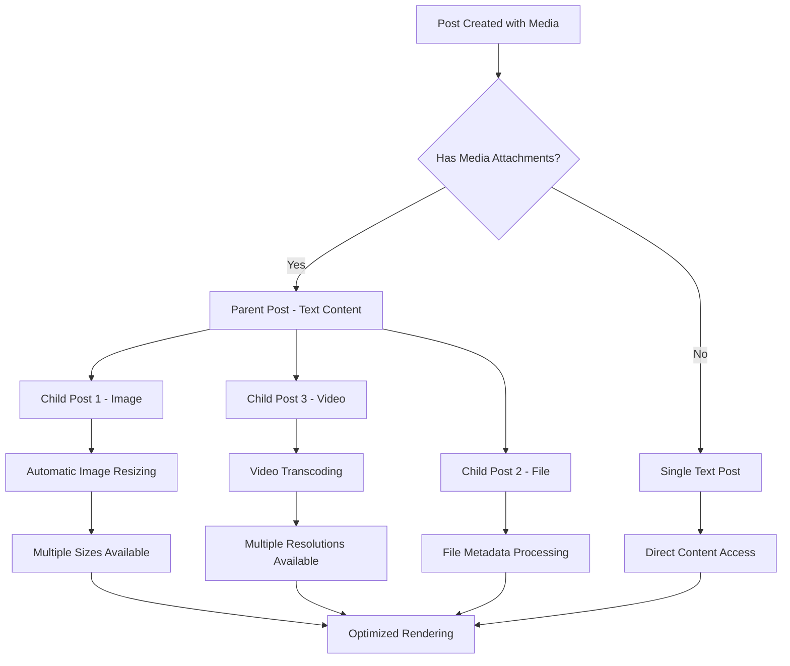
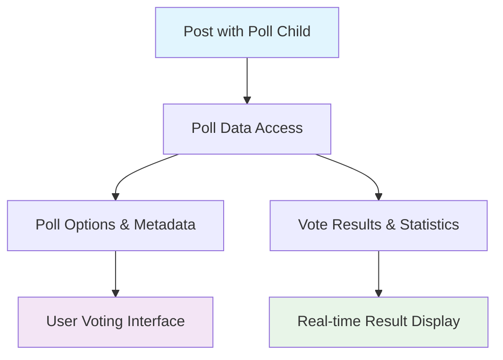

# Viewing Post Content

Post content viewing involves understanding the parent-child relationship structure and implementing efficient content rendering for different media types. This guide covers how to access, process, and display various types of post content with optimal performance.

<Info>
Posts with media attachments (images, files, videos) follow a **Parent-Child relationship** where the text content is the parent post and each media item is a separate child post. This structure enables flexible content management and efficient media handling.
</Info>

## Architecture Overview



## Post Structure & Hierarchy

Understanding the parent-child relationship is crucial for proper content rendering and efficient data access.

<Tabs>
  <Tab title="iOS">
    <CodeGroup>
```swift
// Access parent post and its children
func processPostContent(post: AmityPost) {
    // Parent post contains text content and metadata
    if let textData = post.data as? AmityTextPostData {
        print("Parent post text: \(textData.text)")
    }
    
    // Process child posts (media attachments)
    processChildPosts(post.children)
}

func processChildPosts(_ children: [AmityPost]) {
    for childPost in children {
        switch childPost.dataType {
        case .image:
            processImagePost(childPost)
        case .file:
            processFilePost(childPost)
        case .video:
            processVideoPost(childPost)
        case .liveStream:
            processLiveStreamPost(childPost)
        case .poll:
            processPollPost(childPost)
        default:
            print("Unknown post type: \(childPost.dataType)")
        }
    }
}

// Advanced: Hierarchical post processor
class PostContentProcessor {
    func processPost(_ post: AmityPost) -> ProcessedPostContent {
        let parentContent = extractParentContent(post)
        let childContents = post.children.compactMap { processChildPost($0) }
        
        return ProcessedPostContent(
            parent: parentContent,
            children: childContents,
            totalSize: calculateTotalSize(post),
            hasMediaContent: !childContents.isEmpty
        )
    }
    
    private func extractParentContent(_ post: AmityPost) -> ParentContent {
        guard let textData = post.data as? AmityTextPostData else {
            return ParentContent(text: nil, metadata: post.metadata)
        }
        
        return ParentContent(
            text: textData.text,
            metadata: post.metadata,
            mentions: textData.mentions,
            tags: post.tags
        )
    }
}
```
    </CodeGroup>
  </Tab>
  <Tab title="Android">
    <CodeGroup>
```kotlin
// Access parent post and its children
fun processPostContent(post: AmityPost) {
    // Parent post contains text content and metadata
    (post.data as? AmityTextPostData)?.let { textData ->
        println("Parent post text: ${textData.text}")
    }
    
    // Process child posts (media attachments)
    processChildPosts(post.children)
}

fun processChildPosts(children: List<AmityPost>) {
    children.forEach { childPost ->
        when (childPost.dataType) {
            AmityDataType.IMAGE -> processImagePost(childPost)
            AmityDataType.FILE -> processFilePost(childPost)
            AmityDataType.VIDEO -> processVideoPost(childPost)
            AmityDataType.LIVE_STREAM -> processLiveStreamPost(childPost)
            AmityDataType.POLL -> processPollPost(childPost)
            else -> println("Unknown post type: ${childPost.dataType}")
        }
    }
}

// Advanced: Reactive post content observer
class PostContentObserver {
    fun observePostContent(postId: String): Observable<ProcessedPostContent> {
        val repository = AmityPostRepository(client)
        
        return repository.getPost(postId)
            .build()
            .query()
            .map { post ->
                ProcessedPostContent(
                    parent = extractParentContent(post),
                    children = post.children.map { processChildPost(it) },
                    totalSize = calculateTotalSize(post),
                    hasMediaContent = post.children.isNotEmpty()
                )
            }
            .distinctUntilChanged()
    }
    
    private fun extractParentContent(post: AmityPost): ParentContent {
        val textData = post.data as? AmityTextPostData
        return ParentContent(
            text = textData?.text,
            metadata = post.metadata,
            mentions = textData?.mentions ?: emptyList(),
            tags = post.tags
        )
    }
}
```
    </CodeGroup>
  </Tab>
  <Tab title="TypeScript">
    <CodeGroup>
```typescript
// Access parent post and its children
function processPostContent(post: AmityPost): void {
  // Parent post contains text content and metadata
  if (post.dataType === 'text' && post.data) {
    const textData = post.data as AmityTextPostData;
    console.log('Parent post text:', textData.text);
  }
  
  // Process child posts (media attachments)
  processChildPosts(post.children);
}

function processChildPosts(children: AmityPost[]): void {
  children.forEach(childPost => {
    switch (childPost.dataType) {
      case 'image':
        processImagePost(childPost);
        break;
      case 'file':
        processFilePost(childPost);
        break;
      case 'video':
        processVideoPost(childPost);
        break;
      case 'liveStream':
        processLiveStreamPost(childPost);
        break;
      case 'poll':
        processPollPost(childPost);
        break;
      default:
        console.log('Unknown post type:', childPost.dataType);
    }
  });
}

// Advanced: Post content manager with caching
class PostContentManager {
  private contentCache = new Map<string, ProcessedPostContent>();
  
  async processPost(postId: string): Promise<ProcessedPostContent> {
    // Check cache first
    if (this.contentCache.has(postId)) {
      return this.contentCache.get(postId)!;
    }
    
    const repository = new AmityPostRepository(client);
    const post = await repository.getPost(postId);
    
    const processedContent: ProcessedPostContent = {
      parent: this.extractParentContent(post),
      children: await Promise.all(post.children.map(child => this.processChildPost(child))),
      totalSize: this.calculateTotalSize(post),
      hasMediaContent: post.children.length > 0
    };
    
    // Cache the processed content
    this.contentCache.set(postId, processedContent);
    
    return processedContent;
  }
  
  private extractParentContent(post: AmityPost): ParentContent {
    const textData = post.data as AmityTextPostData;
    return {
      text: textData?.text || null,
      metadata: post.metadata,
      mentions: textData?.mentions || [],
      tags: post.tags || []
    };
  }
  
  // Clear cache for memory management
  clearCache(): void {
    this.contentCache.clear();
  }
}
```
    </CodeGroup>
  </Tab>
  <Tab title="Flutter">
    <CodeGroup>
```dart
// Access parent post and its children
void processPostContent(AmityPost post) {
  // Parent post contains text content and metadata
  if (post.data is AmityTextPostData) {
    final textData = post.data as AmityTextPostData;
    print('Parent post text: ${textData.text}');
  }
  
  // Process child posts (media attachments)
  processChildPosts(post.children);
}

void processChildPosts(List<AmityPost> children) {
  for (final childPost in children) {
    switch (childPost.dataType) {
      case AmityDataType.image:
        processImagePost(childPost);
        break;
      case AmityDataType.file:
        processFilePost(childPost);
        break;
      case AmityDataType.video:
        processVideoPost(childPost);
        break;
      case AmityDataType.liveStream:
        processLiveStreamPost(childPost);
        break;
      case AmityDataType.poll:
        processPollPost(childPost);
        break;
      default:
        print('Unknown post type: ${childPost.dataType}');
    }
  }
}

// Advanced: Post content processor with state management
class PostContentProcessor extends ChangeNotifier {
  final Map<String, ProcessedPostContent> _contentCache = {};
  
  Future<ProcessedPostContent> processPost(String postId) async {
    // Check cache first
    if (_contentCache.containsKey(postId)) {
      return _contentCache[postId]!;
    }
    
    final repository = AmityPostRepository(client);
    final post = await repository.getPost(postId);
    
    final processedContent = ProcessedPostContent(
      parent: _extractParentContent(post),
      children: await Future.wait(
        post.children.map((child) => _processChildPost(child))
      ),
      totalSize: _calculateTotalSize(post),
      hasMediaContent: post.children.isNotEmpty,
    );
    
    // Cache the processed content
    _contentCache[postId] = processedContent;
    notifyListeners();
    
    return processedContent;
  }
  
  ParentContent _extractParentContent(AmityPost post) {
    final textData = post.data as AmityTextPostData?;
    return ParentContent(
      text: textData?.text,
      metadata: post.metadata,
      mentions: textData?.mentions ?? [],
      tags: post.tags ?? [],
    );
  }
  
  void clearCache() {
    _contentCache.clear();
    notifyListeners();
  }
}
```
    </CodeGroup>
  </Tab>
</Tabs>

## Image Post Content

Image posts support automatic multi-size generation for optimal performance across different display contexts. Each uploaded image is processed into four different sizes with a maximum file size of 1GB.

### Available Image Sizes

| Size | Description | Use Case |
|------|-------------|----------|
| `small` | Thumbnail size | Profile pictures, preview thumbnails |
| `medium` | Standard display | Feed previews, card layouts |
| `large` | High quality | Detailed view, modal displays |
| `full` | Original resolution | Full-screen viewing, downloads |

<Tabs>
  <Tab title="iOS">
    <CodeGroup>
```swift
// Basic image post processing
func processImagePost(_ post: AmityPost) {
    guard let imageData = post.data as? AmityImagePostData else { return }
    
    // Get image information
    let imageInfo = imageData.getImageInfo()
    print("Image size: \(imageInfo.fileSize) bytes")
    print("Dimensions: \(imageInfo.width)x\(imageInfo.height)")
    print("MIME type: \(imageInfo.mimeType)")
    
    // Load different image sizes
    loadImageWithSize(imageData, size: .medium)
}

// Advanced: Optimized image loading with caching
class ImagePostManager {
    private let fileRepository: AmityFileRepository
    private let imageCache = NSCache<NSString, UIImage>()
    
    init(client: AmityClient) {
        self.fileRepository = AmityFileRepository(client: client)
    }
    
    func loadOptimalImage(
        from imageData: AmityImagePostData,
        for displaySize: CGSize,
        completion: @escaping (UIImage?) -> Void
    ) {
        let optimalSize = determineOptimalSize(for: displaySize)
        let cacheKey = "\(imageData.fileId)_\(optimalSize.rawValue)" as NSString
        
        // Check cache first
        if let cachedImage = imageCache.object(forKey: cacheKey) {
            completion(cachedImage)
            return
        }
        
        // Download and cache image
        fileRepository.downloadImage(
            imageData.getImageInfo(),
            size: optimalSize
        ) { [weak self] result in
            switch result {
            case .success(let image):
                self?.imageCache.setObject(image, forKey: cacheKey)
                completion(image)
            case .failure(let error):
                print("Failed to load image: \(error)")
                completion(nil)
            }
        }
    }
    
    private func determineOptimalSize(for displaySize: CGSize) -> AmityImageSize {
        let maxDimension = max(displaySize.width, displaySize.height)
        
        switch maxDimension {
        case 0...150:
            return .small
        case 151...400:
            return .medium
        case 401...800:
            return .large
        default:
            return .full
        }
    }
    
    // Manual URL construction for custom implementations
    func constructImageURL(
        baseURL: String,
        size: AmityImageSize
    ) -> String {
        return "\(baseURL)?size=\(size.rawValue)"
    }
}

// Progressive image loading
func loadImageProgressively(
    imageData: AmityImagePostData,
    imageView: UIImageView
) {
    // Start with small size for quick preview
    loadImageWithSize(imageData, size: .small) { smallImage in
        DispatchQueue.main.async {
            imageView.image = smallImage
        }
        
        // Load higher quality version
        self.loadImageWithSize(imageData, size: .large) { largeImage in
            DispatchQueue.main.async {
                UIView.transition(with: imageView, duration: 0.3, options: .transitionCrossDissolve) {
                    imageView.image = largeImage
                }
            }
        }
    }
}
```
    </CodeGroup>
  </Tab>
  <Tab title="Android">
    <CodeGroup>
```kotlin
// Basic image post processing
fun processImagePost(post: AmityPost) {
    val imageData = post.data as? AmityImagePostData ?: return
    
    // Get image information
    val imageInfo = imageData.getImageInfo()
    println("Image size: ${imageInfo.fileSize} bytes")
    println("Dimensions: ${imageInfo.width}x${imageInfo.height}")
    println("MIME type: ${imageInfo.mimeType}")
    
    // Load different image sizes
    loadImageWithSize(imageData, AmityImageSize.MEDIUM)
}

// Advanced: Optimized image loading with Glide integration
class ImagePostManager(private val client: AmityClient) {
    private val fileRepository = AmityFileRepository(client)
    
    fun loadOptimalImage(
        imageData: AmityImagePostData,
        imageView: ImageView,
        displayWidth: Int,
        displayHeight: Int
    ) {
        val optimalSize = determineOptimalSize(displayWidth, displayHeight)
        val imageUrl = constructImageURL(imageData.fileUrl, optimalSize)
        
        Glide.with(imageView.context)
            .load(imageUrl)
            .placeholder(R.drawable.image_placeholder)
            .error(R.drawable.image_error)
            .diskCacheStrategy(DiskCacheStrategy.ALL)
            .into(imageView)
    }
    
    private fun determineOptimalSize(width: Int, height: Int): AmityImageSize {
        val maxDimension = maxOf(width, height)
        
        return when (maxDimension) {
            in 0..150 -> AmityImageSize.SMALL
            in 151..400 -> AmityImageSize.MEDIUM
            in 401..800 -> AmityImageSize.LARGE
            else -> AmityImageSize.FULL
        }
    }
    
    // Manual URL construction
    fun constructImageURL(baseURL: String, size: AmityImageSize): String {
        return "$baseURL?size=${size.value}"
    }
    
    // Progressive loading with smooth transitions
    fun loadImageProgressively(
        imageData: AmityImagePostData,
        imageView: ImageView
    ) {
        val smallUrl = constructImageURL(imageData.fileUrl, AmityImageSize.SMALL)
        val largeUrl = constructImageURL(imageData.fileUrl, AmityImageSize.LARGE)
        
        Glide.with(imageView.context)
            .load(largeUrl)
            .thumbnail(
                Glide.with(imageView.context)
                    .load(smallUrl)
                    .transform(CenterCrop(), RoundedCorners(8))
            )
            .transition(DrawableTransitionOptions.withCrossFade())
            .into(imageView)
    }
}

// Custom image view with loading states
class PostImageView @JvmOverloads constructor(
    context: Context,
    attrs: AttributeSet? = null,
    defStyleAttr: Int = 0
) : AppCompatImageView(context, attrs, defStyleAttr) {
    
    private var loadingProgressBar: ProgressBar? = null
    
    fun loadPostImage(imageData: AmityImagePostData) {
        showLoading()
        
        val manager = ImagePostManager(AmityClient.getInstance())
        manager.loadOptimalImage(
            imageData = imageData,
            imageView = this,
            displayWidth = width,
            displayHeight = height
        )
        
        // Hide loading when image is loaded
        Glide.with(context)
            .load(manager.constructImageURL(imageData.fileUrl, AmityImageSize.MEDIUM))
            .listener(object : RequestListener<Drawable> {
                override fun onLoadFailed(
                    e: GlideException?,
                    model: Any?,
                    target: Target<Drawable>?,
                    isFirstResource: Boolean
                ): Boolean {
                    hideLoading()
                    return false
                }
                
                override fun onResourceReady(
                    resource: Drawable?,
                    model: Any?,
                    target: Target<Drawable>?,
                    dataSource: DataSource?,
                    isFirstResource: Boolean
                ): Boolean {
                    hideLoading()
                    return false
                }
            })
            .into(this)
    }
    
    private fun showLoading() {
        loadingProgressBar?.visibility = View.VISIBLE
    }
    
    private fun hideLoading() {
        loadingProgressBar?.visibility = View.GONE
    }
}
```
    </CodeGroup>
  </Tab>
  <Tab title="TypeScript">
    <CodeGroup>
```typescript
// Basic image post processing
function processImagePost(post: AmityPost): void {
  const imageData = post.data as AmityImagePostData;
  if (!imageData) return;
  
  // Get image information
  const imageInfo = imageData.getImageInfo();
  console.log('Image size:', imageInfo.fileSize, 'bytes');
  console.log('Dimensions:', `${imageInfo.width}x${imageInfo.height}`);
  console.log('MIME type:', imageInfo.mimeType);
  
  // Load different image sizes
  loadImageWithSize(imageData, 'medium');
}

// Advanced: Optimized image loading manager
class ImagePostManager {
  private imageCache = new Map<string, HTMLImageElement>();
  private loadingPromises = new Map<string, Promise<HTMLImageElement>>();
  
  async loadOptimalImage(
    imageData: AmityImagePostData,
    displayWidth: number,
    displayHeight: number
  ): Promise<HTMLImageElement> {
    const optimalSize = this.determineOptimalSize(displayWidth, displayHeight);
    const imageUrl = this.constructImageURL(imageData.fileUrl, optimalSize);
    const cacheKey = `${imageData.fileId}_${optimalSize}`;
    
    // Check cache first
    if (this.imageCache.has(cacheKey)) {
      return this.imageCache.get(cacheKey)!;
    }
    
    // Check if already loading
    if (this.loadingPromises.has(cacheKey)) {
      return this.loadingPromises.get(cacheKey)!;
    }
    
    // Load and cache image
    const loadPromise = this.loadImage(imageUrl).then(image => {
      this.imageCache.set(cacheKey, image);
      this.loadingPromises.delete(cacheKey);
      return image;
    });
    
    this.loadingPromises.set(cacheKey, loadPromise);
    return loadPromise;
  }
  
  private determineOptimalSize(width: number, height: number): ImageSize {
    const maxDimension = Math.max(width, height);
    
    if (maxDimension <= 150) return 'small';
    if (maxDimension <= 400) return 'medium';
    if (maxDimension <= 800) return 'large';
    return 'full';
  }
  
  private constructImageURL(baseURL: string, size: ImageSize): string {
    return `${baseURL}?size=${size}`;
  }
  
  private loadImage(url: string): Promise<HTMLImageElement> {
    return new Promise((resolve, reject) => {
      const img = new Image();
      img.onload = () => resolve(img);
      img.onerror = () => reject(new Error(`Failed to load image: ${url}`));
      img.src = url;
    });
  }
  
  // Progressive loading with blur-to-sharp effect
  async loadImageProgressively(
    imageData: AmityImagePostData,
    imgElement: HTMLImageElement,
    displayWidth: number,
    displayHeight: number
  ): Promise<void> {
    // Load small version first (blurred placeholder)
    const smallUrl = this.constructImageURL(imageData.fileUrl, 'small');
    const smallImage = await this.loadImage(smallUrl);
    
    imgElement.src = smallImage.src;
    imgElement.style.filter = 'blur(5px)';
    imgElement.style.transition = 'filter 0.3s ease';
    
    // Load optimal size version
    try {
      const optimalImage = await this.loadOptimalImage(
        imageData,
        displayWidth,
        displayHeight
      );
      
      imgElement.src = optimalImage.src;
      imgElement.style.filter = 'none';
    } catch (error) {
      console.error('Failed to load high-quality image:', error);
    }
  }
}

// React component example
interface ImagePostProps {
  imageData: AmityImagePostData;
  width: number;
  height: number;
}

function ImagePost({ imageData, width, height }: ImagePostProps) {
  const [imageSrc, setImageSrc] = useState<string>('');
  const [isLoading, setIsLoading] = useState(true);
  const [hasError, setHasError] = useState(false);
  
  useEffect(() => {
    const manager = new ImagePostManager();
    
    manager.loadOptimalImage(imageData, width, height)
      .then(image => {
        setImageSrc(image.src);
        setIsLoading(false);
      })
      .catch(() => {
        setHasError(true);
        setIsLoading(false);
      });
  }, [imageData, width, height]);
  
  if (hasError) {
    return <div className="image-error">Failed to load image</div>;
  }
  
  return (
    <div className="image-container">
      {isLoading && <div className="image-skeleton">Loading...</div>}
       setIsLoading(false)}
      />
    </div>
  );
}
```
    </CodeGroup>
  </Tab>
  <Tab title="Flutter">
    <CodeGroup>
```dart
// Basic image post processing
void processImagePost(AmityPost post) {
  final imageData = post.data as AmityImagePostData?;
  if (imageData == null) return;
  
  // Get image information
  final imageInfo = imageData.getImageInfo();
  print('Image size: ${imageInfo.fileSize} bytes');
  print('Dimensions: ${imageInfo.width}x${imageInfo.height}');
  print('MIME type: ${imageInfo.mimeType}');
  
  // Load different image sizes
  loadImageWithSize(imageData, AmityImageSize.medium);
}

// Advanced: Optimized image loading with cached_network_image
class ImagePostManager {
  final Map<String, ImageProvider> _imageCache = {};
  
  Future<ImageProvider> loadOptimalImage(
    AmityImagePostData imageData,
    double displayWidth,
    double displayHeight,
  ) async {
    final optimalSize = _determineOptimalSize(displayWidth, displayHeight);
    final imageUrl = _constructImageURL(imageData.fileUrl, optimalSize);
    final cacheKey = '${imageData.fileId}_${optimalSize.name}';
    
    if (_imageCache.containsKey(cacheKey)) {
      return _imageCache[cacheKey]!;
    }
    
    final imageProvider = CachedNetworkImageProvider(imageUrl);
    _imageCache[cacheKey] = imageProvider;
    
    return imageProvider;
  }
  
  AmityImageSize _determineOptimalSize(double width, double height) {
    final maxDimension = math.max(width, height);
    
    if (maxDimension <= 150) return AmityImageSize.small;
    if (maxDimension <= 400) return AmityImageSize.medium;
    if (maxDimension <= 800) return AmityImageSize.large;
    return AmityImageSize.full;
  }
  
  String _constructImageURL(String baseURL, AmityImageSize size) {
    return '$baseURL?size=${size.name}';
  }
  
  void clearCache() {
    _imageCache.clear();
  }
}

// Progressive image widget with blur effect
class ProgressiveImageWidget extends StatefulWidget {
  final AmityImagePostData imageData;
  final double width;
  final double height;
  final BorderRadius borderRadius;
  
  const ProgressiveImageWidget({
    Key? key,
    required this.imageData,
    required this.width,
    required this.height,
    this.borderRadius = BorderRadius.zero,
  }) : super(key: key);
  
  @override
  State<ProgressiveImageWidget> createState() => _ProgressiveImageWidgetState();
}

class _ProgressiveImageWidgetState extends State<ProgressiveImageWidget> {
  final ImagePostManager _manager = ImagePostManager();
  
  @override
  Widget build(BuildContext context) {
    return ClipRRect(
      borderRadius: widget.borderRadius,
      child: SizedBox(
        width: widget.width,
        height: widget.height,
        child: Stack(
          fit: StackFit.expand,
          children: [
            // Low quality placeholder (blurred)
            CachedNetworkImage(
              imageUrl: _manager._constructImageURL(
                widget.imageData.fileUrl,
                AmityImageSize.small,
              ),
              fit: BoxFit.cover,
              imageBuilder: (context, imageProvider) => Container(
                decoration: BoxDecoration(
                  image: DecorationImage(
                    image: imageProvider,
                    fit: BoxFit.cover,
                  ),
                ),
                child: BackdropFilter(
                  filter: ImageFilter.blur(sigmaX: 5, sigmaY: 5),
                  child: Container(color: Colors.transparent),
                ),
              ),
            ),
            // High quality image
            FutureBuilder<ImageProvider>(
              future: _manager.loadOptimalImage(
                widget.imageData,
                widget.width,
                widget.height,
              ),
              builder: (context, snapshot) {
                if (snapshot.hasData) {
                  return AnimatedOpacity(
                    duration: const Duration(milliseconds: 300),
                    opacity: 1.0,
                    child: Image(
                      image: snapshot.data!,
                      fit: BoxFit.cover,
                      loadingBuilder: (context, child, loadingProgress) {
                        if (loadingProgress == null) return child;
                        return const Center(
                          child: CircularProgressIndicator(),
                        );
                      },
                      errorBuilder: (context, error, stackTrace) {
                        return const Center(
                          child: Icon(
                            Icons.error_outline,
                            color: Colors.red,
                            size: 32,
                          ),
                        );
                      },
                    ),
                  );
                }
                return const SizedBox.shrink();
              },
            ),
          ],
        ),
      ),
    );
  }
}

// Post image widget with zoom functionality
class PostImageWidget extends StatelessWidget {
  final AmityImagePostData imageData;
  final VoidCallback? onTap;
  
  const PostImageWidget({
    Key? key,
    required this.imageData,
    this.onTap,
  }) : super(key: key);
  
  @override
  Widget build(BuildContext context) {
    return LayoutBuilder(
      builder: (context, constraints) {
        return GestureDetector(
          onTap: onTap ?? () => _showFullScreenImage(context),
          child: ProgressiveImageWidget(
            imageData: imageData,
            width: constraints.maxWidth,
            height: constraints.maxWidth * 0.75, // 4:3 aspect ratio
            borderRadius: BorderRadius.circular(8),
          ),
        );
      },
    );
  }
  
  void _showFullScreenImage(BuildContext context) {
    Navigator.of(context).push(
      PageRouteBuilder(
        opaque: false,
        barrierDismissible: true,
        pageBuilder: (context, animation, _) {
          return FadeTransition(
            opacity: animation,
            child: Scaffold(
              backgroundColor: Colors.black87,
              body: SafeArea(
                child: PhotoView(
                  imageProvider: CachedNetworkImageProvider(
                    ImagePostManager()._constructImageURL(
                      imageData.fileUrl,
                      AmityImageSize.full,
                    ),
                  ),
                  minScale: PhotoViewComputedScale.contained,
                  maxScale: PhotoViewComputedScale.covered * 3,
                  heroAttributes: PhotoViewHeroAttributes(
                    tag: imageData.fileId,
                  ),
                ),
              ),
            ),
          );
        },
      ),
    );
  }
}
```
    </CodeGroup>
  </Tab>
</Tabs>

### URL Construction for Custom Implementations

For custom image loading implementations, you can construct image URLs manually by appending the `size` query parameter:

```
// Base URL
https://my-image-download-link-from-amity/123/456

// With size parameter
https://my-image-download-link-from-amity/123/456?size=medium
```

<Note>
Valid size parameters: `small`, `medium`, `large`, `full`
</Note>

## File Post Content

File posts support various document types including PDFs, Word documents, spreadsheets, and more. Each file attachment maintains its original metadata and provides secure download capabilities with a maximum file size of 1GB.

### Supported File Types

<CardGroup cols={3}>
  <Card title="Documents" icon="file-text">
    PDF, DOC, DOCX, TXT, RTF
  </Card>
  <Card title="Spreadsheets" icon="table">
    XLS, XLSX, CSV, ODS
  </Card>
  <Card title="Presentations" icon="presentation-chart-line">
    PPT, PPTX, ODP
  </Card>
  <Card title="Archives" icon="file-zipper">
    ZIP, RAR, 7Z, TAR
  </Card>
  <Card title="Code Files" icon="code">
    JS, TS, PY, JAVA, CPP
  </Card>
  <Card title="Others" icon="file">
    Any file type up to 1GB
  </Card>
</CardGroup>

<Tabs>
  <Tab title="iOS">
    <CodeGroup>
```swift
// Basic file post processing
func processFilePost(_ post: AmityPost) {
    guard let fileData = post.data as? AmityFilePostData else { return }
    
    // Get file information
    let fileInfo = fileData.getFileInfo()
    print("File name: \(fileInfo.fileName)")
    print("File size: \(fileInfo.fileSize) bytes")
    print("MIME type: \(fileInfo.mimeType)")
    print("File extension: \(fileInfo.fileExtension)")
    
    // Download file
    downloadFile(fileData: fileData)
}

// Advanced: File manager with download progress
class FilePostManager {
    private let fileRepository: AmityFileRepository
    private var downloadTasks: [String: URLSessionDownloadTask] = [:]
    
    init(client: AmityClient) {
        self.fileRepository = AmityFileRepository(client: client)
    }
    
    func downloadFile(
        fileData: AmityFilePostData,
        progressHandler: @escaping (Double) -> Void,
        completion: @escaping (Result<URL, Error>) -> Void
    ) {
        let fileInfo = fileData.getFileInfo()
        let taskId = fileInfo.fileId
        
        // Cancel existing download if any
        downloadTasks[taskId]?.cancel()
        
        fileRepository.downloadFile(fileInfo) { progress in
            DispatchQueue.main.async {
                progressHandler(progress)
            }
        } completion: { [weak self] result in
            DispatchQueue.main.async {
                self?.downloadTasks.removeValue(forKey: taskId)
                
                switch result {
                case .success(let localURL):
                    completion(.success(localURL))
                case .failure(let error):
                    completion(.failure(error))
                }
            }
        }
    }
    
    func cancelDownload(fileId: String) {
        downloadTasks[fileId]?.cancel()
        downloadTasks.removeValue(forKey: fileId)
    }
    
    // Get file icon based on type
    func getFileIcon(for mimeType: String) -> UIImage? {
        switch mimeType {
        case let type where type.hasPrefix("application/pdf"):
            return UIImage(systemName: "doc.fill")
        case let type where type.hasPrefix("application/msword"),
             let type where type.contains("wordprocessingml"):
            return UIImage(systemName: "doc.text.fill")
        case let type where type.contains("spreadsheetml"),
             let type where type.hasPrefix("application/vnd.ms-excel"):
            return UIImage(systemName: "tablecells.fill")
        case let type where type.contains("presentationml"),
             let type where type.hasPrefix("application/vnd.ms-powerpoint"):
            return UIImage(systemName: "rectangle.fill.on.rectangle.fill")
        case let type where type.hasPrefix("application/zip"),
             let type where type.hasPrefix("application/x-rar"):
            return UIImage(systemName: "archivebox.fill")
        case let type where type.hasPrefix("image/"):
            return UIImage(systemName: "photo.fill")
        default:
            return UIImage(systemName: "doc.fill")
        }
    }
    
    // Format file size for display
    func formatFileSize(_ bytes: Int64) -> String {
        let formatter = ByteCountFormatter()
        formatter.countStyle = .file
        formatter.allowedUnits = [.useKB, .useMB, .useGB]
        return formatter.string(fromByteCount: bytes)
    }
}

// Custom file view controller
class FileViewController: UIViewController {
    @IBOutlet weak var fileIconImageView: UIImageView!
    @IBOutlet weak var fileNameLabel: UILabel!
    @IBOutlet weak var fileSizeLabel: UILabel!
    @IBOutlet weak var downloadButton: UIButton!
    @IBOutlet weak var progressView: UIProgressView!
    
    private let fileManager = FilePostManager(client: AmityClient.shared)
    private var fileData: AmityFilePostData!
    
    func configure(with fileData: AmityFilePostData) {
        self.fileData = fileData
        setupUI()
    }
    
    private func setupUI() {
        let fileInfo = fileData.getFileInfo()
        
        fileNameLabel.text = fileInfo.fileName
        fileSizeLabel.text = fileManager.formatFileSize(fileInfo.fileSize)
        fileIconImageView.image = fileManager.getFileIcon(for: fileInfo.mimeType)
        
        progressView.isHidden = true
        downloadButton.setTitle("Download", for: .normal)
    }
    
    @IBAction func downloadButtonTapped(_ sender: UIButton) {
        downloadButton.isEnabled = false
        progressView.isHidden = false
        progressView.progress = 0.0
        
        fileManager.downloadFile(
            fileData: fileData,
            progressHandler: { [weak self] progress in
                self?.progressView.progress = Float(progress)
            },
            completion: { [weak self] result in
                self?.downloadButton.isEnabled = true
                self?.progressView.isHidden = true
                
                switch result {
                case .success(let localURL):
                    self?.openFile(at: localURL)
                case .failure(let error):
                    self?.showError(error)
                }
            }
        )
    }
    
    private func openFile(at url: URL) {
        let documentController = UIDocumentInteractionController(url: url)
        documentController.presentPreview(animated: true)
    }
    
    private func showError(_ error: Error) {
        let alert = UIAlertController(
            title: "Download Failed",
            message: error.localizedDescription,
            preferredStyle: .alert
        )
        alert.addAction(UIAlertAction(title: "OK", style: .default))
        present(alert, animated: true)
    }
}
```
    </CodeGroup>
  </Tab>
  <Tab title="Android">
    <CodeGroup>
```kotlin
// Basic file post processing
fun processFilePost(post: AmityPost) {
    val fileData = post.data as? AmityFilePostData ?: return
    
    // Get file information
    val fileInfo = fileData.getFileInfo()
    println("File name: ${fileInfo.fileName}")
    println("File size: ${fileInfo.fileSize} bytes")
    println("MIME type: ${fileInfo.mimeType}")
    println("File extension: ${fileInfo.fileExtension}")
    
    // Download file
    downloadFile(fileData)
}

// Advanced: File manager with download handling
class FilePostManager(private val context: Context) {
    private val fileRepository = AmityFileRepository(AmityClient.getInstance())
    private val downloadManager = context.getSystemService(Context.DOWNLOAD_SERVICE) as DownloadManager
    
    fun downloadFile(
        fileData: AmityFilePostData,
        progressCallback: ((Int) -> Unit)? = null,
        completion: (Result<Uri>) -> Unit
    ) {
        val fileInfo = fileData.getFileInfo()
        
        // Check permissions first
        if (!hasStoragePermission()) {
            completion(Result.failure(SecurityException("Storage permission required")))
            return
        }
        
        val request = DownloadManager.Request(Uri.parse(fileData.fileUrl))
            .setTitle(fileInfo.fileName)
            .setDescription("Downloading ${fileInfo.fileName}")
            .setNotificationVisibility(DownloadManager.Request.VISIBILITY_VISIBLE_NOTIFY_COMPLETED)
            .setDestinationInExternalPublicDir(
                Environment.DIRECTORY_DOWNLOADS,
                fileInfo.fileName
            )
            .setAllowedOverMetered(true)
            .setAllowedOverRoaming(true)
        
        val downloadId = downloadManager.enqueue(request)
        
        // Monitor download progress
        monitorDownload(downloadId, progressCallback, completion)
    }
    
    private fun monitorDownload(
        downloadId: Long,
        progressCallback: ((Int) -> Unit)?,
        completion: (Result<Uri>) -> Unit
    ) {
        val handler = Handler(Looper.getMainLooper())
        val runnable = object : Runnable {
            override fun run() {
                val query = DownloadManager.Query().setFilterById(downloadId)
                val cursor = downloadManager.query(query)
                
                if (cursor.moveToFirst()) {
                    val status = cursor.getInt(cursor.getColumnIndex(DownloadManager.COLUMN_STATUS))
                    val bytesDownloaded = cursor.getLong(cursor.getColumnIndex(DownloadManager.COLUMN_BYTES_DOWNLOADED_SO_FAR))
                    val bytesTotal = cursor.getLong(cursor.getColumnIndex(DownloadManager.COLUMN_TOTAL_SIZE_BYTES))
                    
                    when (status) {
                        DownloadManager.STATUS_RUNNING -> {
                            if (bytesTotal > 0) {
                                val progress = ((bytesDownloaded * 100) / bytesTotal).toInt()
                                progressCallback?.invoke(progress)
                            }
                            handler.postDelayed(this, 100)
                        }
                        DownloadManager.STATUS_SUCCESSFUL -> {
                            val uri = downloadManager.getUriForDownloadedFile(downloadId)
                            completion(Result.success(uri))
                        }
                        DownloadManager.STATUS_FAILED -> {
                            val reason = cursor.getInt(cursor.getColumnIndex(DownloadManager.COLUMN_REASON))
                            completion(Result.failure(Exception("Download failed: $reason")))
                        }
                    }
                }
                cursor.close()
            }
        }
        handler.post(runnable)
    }
    
    private fun hasStoragePermission(): Boolean {
        return ContextCompat.checkSelfPermission(
            context,
            Manifest.permission.WRITE_EXTERNAL_STORAGE
        ) == PackageManager.PERMISSION_GRANTED
    }
    
    // Get file icon resource based on MIME type
    fun getFileIconResource(mimeType: String): Int {
        return when {
            mimeType.contains("pdf") -> R.drawable.ic_pdf
            mimeType.contains("word") || mimeType.contains("document") -> R.drawable.ic_doc
            mimeType.contains("sheet") || mimeType.contains("excel") -> R.drawable.ic_excel
            mimeType.contains("presentation") || mimeType.contains("powerpoint") -> R.drawable.ic_ppt
            mimeType.contains("zip") || mimeType.contains("rar") -> R.drawable.ic_archive
            mimeType.contains("image") -> R.drawable.ic_image
            mimeType.contains("video") -> R.drawable.ic_video
            mimeType.contains("audio") -> R.drawable.ic_audio
            else -> R.drawable.ic_file
        }
    }
    
    // Format file size for display
    fun formatFileSize(bytes: Long): String {
        val units = arrayOf("B", "KB", "MB", "GB")
        var size = bytes.toDouble()
        var unitIndex = 0
        
        while (size >= 1024 && unitIndex < units.size - 1) {
            size /= 1024
            unitIndex++
        }
        
        return String.format("%.1f %s", size, units[unitIndex])
    }
    
    // Open file with appropriate app
    fun openFile(uri: Uri) {
        val intent = Intent(Intent.ACTION_VIEW).apply {
            setDataAndType(uri, getMimeType(uri))
            addFlags(Intent.FLAG_GRANT_READ_URI_PERMISSION)
        }
        
        try {
            context.startActivity(intent)
        } catch (e: ActivityNotFoundException) {
            Toast.makeText(context, "No app found to open this file", Toast.LENGTH_SHORT).show()
        }
    }
    
    private fun getMimeType(uri: Uri): String? {
        return context.contentResolver.getType(uri)
    }
}

// Custom file view for RecyclerView
class FilePostViewHolder(
    private val binding: ItemFilePostBinding,
    private val fileManager: FilePostManager
) : RecyclerView.ViewHolder(binding.root) {
    
    fun bind(fileData: AmityFilePostData) {
        val fileInfo = fileData.getFileInfo()
        
        binding.apply {
            fileNameText.text = fileInfo.fileName
            fileSizeText.text = fileManager.formatFileSize(fileInfo.fileSize)
            fileIcon.setImageResource(fileManager.getFileIconResource(fileInfo.mimeType))
            
            downloadButton.setOnClickListener {
                downloadFile(fileData)
            }
            
            // Show file type badge
            fileTypeBadge.text = fileInfo.fileExtension.uppercase()
        }
    }
    
    private fun downloadFile(fileData: AmityFilePostData) {
        binding.downloadButton.isEnabled = false
        binding.progressBar.visibility = View.VISIBLE
        
        fileManager.downloadFile(
            fileData = fileData,
            progressCallback = { progress ->
                binding.progressBar.progress = progress
            },
            completion = { result ->
                binding.downloadButton.isEnabled = true
                binding.progressBar.visibility = View.GONE
                
                result.fold(
                    onSuccess = { uri ->
                        fileManager.openFile(uri)
                        Toast.makeText(
                            binding.root.context,
                            "File downloaded successfully",
                            Toast.LENGTH_SHORT
                        ).show()
                    },
                    onFailure = { error ->
                        Toast.makeText(
                            binding.root.context,
                            "Download failed: ${error.message}",
                            Toast.LENGTH_SHORT
                        ).show()
                    }
                )
            }
        )
    }
}
```
    </CodeGroup>
  </Tab>
  <Tab title="TypeScript">
    <CodeGroup>
```typescript
// Basic file post processing
function processFilePost(post: AmityPost): void {
  const fileData = post.data as AmityFilePostData;
  if (!fileData) return;
  
  // Get file information
  const fileInfo = fileData.getFileInfo();
  console.log('File name:', fileInfo.fileName);
  console.log('File size:', fileInfo.fileSize, 'bytes');
  console.log('MIME type:', fileInfo.mimeType);
  console.log('File extension:', fileInfo.fileExtension);
  
  // Download file
  downloadFile(fileData);
}

// Advanced: File manager with download capabilities
class FilePostManager {
  private downloadQueue = new Map<string, AbortController>();
  
  async downloadFile(
    fileData: AmityFilePostData,
    progressCallback?: (progress: number) => void,
    onComplete?: (blob: Blob) => void
  ): Promise<void> {
    const fileInfo = fileData.getFileInfo();
    const fileId = fileInfo.fileId;
    
    // Cancel existing download if any
    this.cancelDownload(fileId);
    
    const abortController = new AbortController();
    this.downloadQueue.set(fileId, abortController);
    
    try {
      const response = await fetch(fileData.fileUrl, {
        signal: abortController.signal
      });
      
      if (!response.ok) {
        throw new Error(`Download failed: ${response.statusText}`);
      }
      
      const contentLength = response.headers.get('content-length');
      const total = contentLength ? parseInt(contentLength, 10) : 0;
      let loaded = 0;
      
      const reader = response.body?.getReader();
      const chunks: Uint8Array[] = [];
      
      if (!reader) {
        throw new Error('Failed to read response body');
      }
      
      while (true) {
        const { done, value } = await reader.read();
        
        if (done) break;
        
        chunks.push(value);
        loaded += value.length;
        
        if (total > 0 && progressCallback) {
          const progress = Math.round((loaded / total) * 100);
          progressCallback(progress);
        }
      }
      
      const blob = new Blob(chunks, { type: fileInfo.mimeType });
      
      if (onComplete) {
        onComplete(blob);
      } else {
        this.saveFile(blob, fileInfo.fileName);
      }
      
    } catch (error) {
      if (error instanceof Error && error.name !== 'AbortError') {
        console.error('Download error:', error);
        throw error;
      }
    } finally {
      this.downloadQueue.delete(fileId);
    }
  }
  
  private saveFile(blob: Blob, fileName: string): void {
    const url = URL.createObjectURL(blob);
    const link = document.createElement('a');
    link.href = url;
    link.download = fileName;
    document.body.appendChild(link);
    link.click();
    document.body.removeChild(link);
    URL.revokeObjectURL(url);
  }
  
  cancelDownload(fileId: string): void {
    const controller = this.downloadQueue.get(fileId);
    if (controller) {
      controller.abort();
      this.downloadQueue.delete(fileId);
    }
  }
  
  // Get file icon class based on MIME type
  getFileIconClass(mimeType: string): string {
    if (mimeType.includes('pdf')) return 'fas fa-file-pdf';
    if (mimeType.includes('word') || mimeType.includes('document')) return 'fas fa-file-word';
    if (mimeType.includes('sheet') || mimeType.includes('excel')) return 'fas fa-file-excel';
    if (mimeType.includes('presentation') || mimeType.includes('powerpoint')) return 'fas fa-file-powerpoint';
    if (mimeType.includes('zip') || mimeType.includes('rar')) return 'fas fa-file-archive';
    if (mimeType.includes('image')) return 'fas fa-file-image';
    if (mimeType.includes('video')) return 'fas fa-file-video';
    if (mimeType.includes('audio')) return 'fas fa-file-audio';
    if (mimeType.includes('text') || mimeType.includes('code')) return 'fas fa-file-code';
    return 'fas fa-file';
  }
  
  // Format file size for display
  formatFileSize(bytes: number): string {
    const units = ['B', 'KB', 'MB', 'GB'];
    let size = bytes;
    let unitIndex = 0;
    
    while (size >= 1024 && unitIndex < units.length - 1) {
      size /= 1024;
      unitIndex++;
    }
    
    return `${size.toFixed(1)} ${units[unitIndex]}`;
  }
  
  // Preview file in new tab (for supported types)
  previewFile(fileData: AmityFilePostData): void {
    const fileInfo = fileData.getFileInfo();
    const supportedTypes = ['application/pdf', 'text/plain', 'text/html'];
    
    if (supportedTypes.includes(fileInfo.mimeType)) {
      window.open(fileData.fileUrl, '_blank');
    } else {
      console.log('Preview not supported for this file type');
    }
  }
}

// React component for file post
interface FilePostProps {
  fileData: AmityFilePostData;
  className?: string;
}

function FilePost({ fileData, className = '' }: FilePostProps) {
  const [downloadProgress, setDownloadProgress] = useState(0);
  const [isDownloading, setIsDownloading] = useState(false);
  const fileManager = useMemo(() => new FilePostManager(), []);
  
  const fileInfo = fileData.getFileInfo();
  
  const handleDownload = async () => {
    setIsDownloading(true);
    setDownloadProgress(0);
    
    try {
      await fileManager.downloadFile(
        fileData,
        (progress) => setDownloadProgress(progress)
      );
    } catch (error) {
      console.error('Download failed:', error);
      alert('Download failed. Please try again.');
    } finally {
      setIsDownloading(false);
      setDownloadProgress(0);
    }
  };
  
  const handlePreview = () => {
    fileManager.previewFile(fileData);
  };
  
  return (
    <div className={`file-post ${className}`}>
      <div className="file-info">
        <i className={`file-icon ${fileManager.getFileIconClass(fileInfo.mimeType)}`} />
        <div className="file-details">
          <h4 className="file-name">{fileInfo.fileName}</h4>
          <p className="file-size">{fileManager.formatFileSize(fileInfo.fileSize)}</p>
          <span className="file-type">{fileInfo.fileExtension.toUpperCase()}</span>
        </div>
      </div>
      
      {isDownloading && (
        <div className="download-progress">
          <div className="progress-bar">
            <div 
              className="progress-fill" 
              style={{ width: `${downloadProgress}%` }}
            />
          </div>
          <span>{downloadProgress}%</span>
        </div>
      )}
      
      <div className="file-actions">
        <button 
          onClick={handleDownload}
          disabled={isDownloading}
          className="download-btn"
        >
          {isDownloading ? 'Downloading...' : 'Download'}
        </button>
        <button 
          onClick={handlePreview}
          className="preview-btn"
        >
          Preview
        </button>
      </div>
    </div>
  );
}
```
    </CodeGroup>
  </Tab>
  <Tab title="Flutter">
    <CodeGroup>
```dart
// Basic file post processing
void processFilePost(AmityPost post) {
  final fileData = post.data as AmityFilePostData?;
  if (fileData == null) return;
  
  // Get file information
  final fileInfo = fileData.getFileInfo();
  print('File name: ${fileInfo.fileName}');
  print('File size: ${fileInfo.fileSize} bytes');
  print('MIME type: ${fileInfo.mimeType}');
  print('File extension: ${fileInfo.fileExtension}');
  
  // Download file
  downloadFile(fileData);
}

// Advanced: File manager with download capabilities
class FilePostManager {
  final Dio _dio = Dio();
  final Map<String, CancelToken> _downloadTokens = {};
  
  Future<void> downloadFile(
    AmityFilePostData fileData, {
    Function(int)? onProgress,
    Function(String)? onComplete,
    Function(String)? onError,
  }) async {
    final fileInfo = fileData.getFileInfo();
    final fileName = fileInfo.fileName;
    final fileId = fileInfo.fileId;
    
    // Cancel existing download if any
    cancelDownload(fileId);
    
    try {
      // Request storage permission
      if (!await _requestStoragePermission()) {
        onError?.call('Storage permission denied');
        return;
      }
      
      final directory = await getApplicationDocumentsDirectory();
      final filePath = '${directory.path}/$fileName';
      
      final cancelToken = CancelToken();
      _downloadTokens[fileId] = cancelToken;
      
      await _dio.download(
        fileData.fileUrl,
        filePath,
        cancelToken: cancelToken,
        onReceiveProgress: (received, total) {
          if (total != -1) {
            final progress = ((received / total) * 100).round();
            onProgress?.call(progress);
          }
        },
      );
      
      _downloadTokens.remove(fileId);
      onComplete?.call(filePath);
      
    } on DioException catch (e) {
      _downloadTokens.remove(fileId);
      if (e.type != DioExceptionType.cancel) {
        onError?.call(e.message ?? 'Download failed');
      }
    } catch (e) {
      _downloadTokens.remove(fileId);
      onError?.call(e.toString());
    }
  }
  
  void cancelDownload(String fileId) {
    final token = _downloadTokens[fileId];
    if (token != null && !token.isCancelled) {
      token.cancel();
      _downloadTokens.remove(fileId);
    }
  }
  
  Future<bool> _requestStoragePermission() async {
    if (Platform.isAndroid) {
      final status = await Permission.storage.request();
      return status == PermissionStatus.granted;
    }
    return true; // iOS handles this automatically
  }
  
  // Get file icon based on MIME type
  IconData getFileIcon(String mimeType) {
    if (mimeType.contains('pdf')) return Icons.picture_as_pdf;
    if (mimeType.contains('word') || mimeType.contains('document')) return Icons.description;
    if (mimeType.contains('sheet') || mimeType.contains('excel')) return Icons.table_chart;
    if (mimeType.contains('presentation') || mimeType.contains('powerpoint')) return Icons.slideshow;
    if (mimeType.contains('zip') || mimeType.contains('rar')) return Icons.archive;
    if (mimeType.contains('image')) return Icons.image;
    if (mimeType.contains('video')) return Icons.video_file;
    if (mimeType.contains('audio')) return Icons.audio_file;
    if (mimeType.contains('text') || mimeType.contains('code')) return Icons.code;
    return Icons.insert_drive_file;
  }
  
  // Format file size for display
  String formatFileSize(int bytes) {
    const units = ['B', 'KB', 'MB', 'GB'];
    double size = bytes.toDouble();
    int unitIndex = 0;
    
    while (size >= 1024 && unitIndex < units.length - 1) {
      size /= 1024;
      unitIndex++;
    }
    
    return '${size.toStringAsFixed(1)} ${units[unitIndex]}';
  }
  
  // Open file with system app
  Future<void> openFile(String filePath) async {
    try {
      await OpenFile.open(filePath);
    } catch (e) {
      print('Failed to open file: $e');
    }
  }
  
  // Get file color based on type
  Color getFileColor(String mimeType) {
    if (mimeType.contains('pdf')) return Colors.red;
    if (mimeType.contains('word') || mimeType.contains('document')) return Colors.blue;
    if (mimeType.contains('sheet') || mimeType.contains('excel')) return Colors.green;
    if (mimeType.contains('presentation') || mimeType.contains('powerpoint')) return Colors.orange;
    if (mimeType.contains('zip') || mimeType.contains('rar')) return Colors.purple;
    if (mimeType.contains('image')) return Colors.pink;
    if (mimeType.contains('video')) return Colors.indigo;
    if (mimeType.contains('audio')) return Colors.teal;
    return Colors.grey;
  }
}

// File post widget
class FilePostWidget extends StatefulWidget {
  final AmityFilePostData fileData;
  final VoidCallback? onTap;
  
  const FilePostWidget({
    Key? key,
    required this.fileData,
    this.onTap,
  }) : super(key: key);
  
  @override
  State<FilePostWidget> createState() => _FilePostWidgetState();
}

class _FilePostWidgetState extends State<FilePostWidget> {
  final FilePostManager _fileManager = FilePostManager();
  int _downloadProgress = 0;
  bool _isDownloading = false;
  
  @override
  Widget build(BuildContext context) {
    final fileInfo = widget.fileData.getFileInfo();
    final fileColor = _fileManager.getFileColor(fileInfo.mimeType);
    
    return Card(
      margin: const EdgeInsets.symmetric(vertical: 8),
      child: Padding(
        padding: const EdgeInsets.all(16),
        child: Column(
          crossAxisAlignment: CrossAxisAlignment.start,
          children: [
            Row(
              children: [
                Container(
                  padding: const EdgeInsets.all(12),
                  decoration: BoxDecoration(
                    color: fileColor.withOpacity(0.1),
                    borderRadius: BorderRadius.circular(8),
                  ),
                  child: Icon(
                    _fileManager.getFileIcon(fileInfo.mimeType),
                    color: fileColor,
                    size: 32,
                  ),
                ),
                const SizedBox(width: 12),
                Expanded(
                  child: Column(
                    crossAxisAlignment: CrossAxisAlignment.start,
                    children: [
                      Text(
                        fileInfo.fileName,
                        style: const TextStyle(
                          fontSize: 16,
                          fontWeight: FontWeight.w600,
                        ),
                        maxLines: 2,
                        overflow: TextOverflow.ellipsis,
                      ),
                      const SizedBox(height: 4),
                      Row(
                        children: [
                          Text(
                            _fileManager.formatFileSize(fileInfo.fileSize),
                            style: TextStyle(
                              color: Colors.grey[600],
                              fontSize: 14,
                            ),
                          ),
                          const SizedBox(width: 8),
                          Container(
                            padding: const EdgeInsets.symmetric(
                              horizontal: 6,
                              vertical: 2,
                            ),
                            decoration: BoxDecoration(
                              color: fileColor.withOpacity(0.1),
                              borderRadius: BorderRadius.circular(4),
                            ),
                            child: Text(
                              fileInfo.fileExtension.toUpperCase(),
                              style: TextStyle(
                                color: fileColor,
                                fontSize: 12,
                                fontWeight: FontWeight.w600,
                              ),
                            ),
                          ),
                        ],
                      ),
                    ],
                  ),
                ),
              ],
            ),
            if (_isDownloading) ...[
              const SizedBox(height: 12),
              Column(
                children: [
                  LinearProgressIndicator(
                    value: _downloadProgress / 100,
                    backgroundColor: Colors.grey[300],
                    valueColor: AlwaysStoppedAnimation<Color>(fileColor),
                  ),
                  const SizedBox(height: 4),
                  Text('$_downloadProgress%'),
                ],
              ),
            ],
            const SizedBox(height: 12),
            Row(
              children: [
                Expanded(
                  child: ElevatedButton.icon(
                    onPressed: _isDownloading ? null : _downloadFile,
                    icon: Icon(_isDownloading ? Icons.hourglass_empty : Icons.download),
                    label: Text(_isDownloading ? 'Downloading...' : 'Download'),
                    style: ElevatedButton.styleFrom(
                      backgroundColor: fileColor,
                      foregroundColor: Colors.white,
                    ),
                  ),
                ),
                if (_isDownloading) ...[
                  const SizedBox(width: 8),
                  OutlinedButton(
                    onPressed: _cancelDownload,
                    child: const Text('Cancel'),
                  ),
                ],
              ],
            ),
          ],
        ),
      ),
    );
  }
  
  void _downloadFile() {
    setState(() {
      _isDownloading = true;
      _downloadProgress = 0;
    });
    
    _fileManager.downloadFile(
      widget.fileData,
      onProgress: (progress) {
        setState(() {
          _downloadProgress = progress;
        });
      },
      onComplete: (filePath) {
        setState(() {
          _isDownloading = false;
        });
        
        ScaffoldMessenger.of(context).showSnackBar(
          SnackBar(
            content: const Text('File downloaded successfully'),
            action: SnackBarAction(
              label: 'Open',
              onPressed: () => _fileManager.openFile(filePath),
            ),
          ),
        );
      },
      onError: (error) {
        setState(() {
          _isDownloading = false;
        });
        
        ScaffoldMessenger.of(context).showSnackBar(
          SnackBar(
            content: Text('Download failed: $error'),
            backgroundColor: Colors.red,
          ),
        );
      },
    );
  }
  
  void _cancelDownload() {
    final fileInfo = widget.fileData.getFileInfo();
    _fileManager.cancelDownload(fileInfo.fileId);
    
    setState(() {
      _isDownloading = false;
      _downloadProgress = 0;
    });
  }
}
```
    </CodeGroup>
  </Tab>
</Tabs>

### Best Practices for File Posts

<AccordionGroup>
  <Accordion title="File Security & Validation">
    - Always validate file types and sizes before processing
    - Implement virus scanning for uploaded files
    - Use secure download URLs with expiration
    - Check file permissions before download attempts
  </Accordion>
  
  <Accordion title="Performance Optimization">
    - Implement download progress indicators for better UX
    - Cache file metadata to avoid repeated API calls
    - Use background downloads for large files
    - Implement download queue management for multiple files
  </Accordion>
  
  <Accordion title="Error Handling">
    - Handle network interruptions gracefully
    - Provide retry mechanisms for failed downloads
    - Show meaningful error messages to users
    - Implement fallback mechanisms for unsupported file types
  </Accordion>
  
  <Accordion title="Storage Management">
    - Clean up temporary files after use
    - Implement storage quota management
    - Provide options to delete downloaded files
    - Monitor available storage space
  </Accordion>
</AccordionGroup>

<Note>
For detailed file handling information, refer to the [File Management Guide](/social-plus-sdk/core-concepts/content-handling/files-images-and-videos/file).
</Note>

## Video Post Content

Video posts support automatic transcoding into multiple resolutions for optimal playback across different devices and network conditions. Each uploaded video (up to 1GB) is processed into various quality levels while maintaining the original version for high-quality viewing.

### Available Video Resolutions

<CardGroup cols={2}>
  <Card title="1080p (Full HD)" icon="video">
    High quality for desktop and large screens
  </Card>
  <Card title="720p (HD)" icon="video">
    Standard quality for most devices
  </Card>
  <Card title="480p (SD)" icon="video">
    Medium quality for mobile and slower connections
  </Card>
  <Card title="360p (Low)" icon="video">
    Low quality for very slow connections
  </Card>
  <Card title="Original" icon="video">
    Original uploaded resolution (immediately available)
  </Card>
</CardGroup>

<Info>
**Transcoding Process**: While the original video is immediately available after upload, transcoded versions take time to process. Always check resolution availability before playback.
</Info>

<Tabs>
  <Tab title="iOS">
    <CodeGroup>
```swift
// Basic video post processing
func processVideoPost(_ post: AmityPost) {
    guard let videoData = post.data as? AmityVideoPostData else { return }
    
    // Get video information
    let videoInfo = videoData.getVideoInfo()
    print("Video duration: \(videoInfo.duration) seconds")
    print("Video size: \(videoInfo.fileSize) bytes")
    print("Original resolution: \(videoInfo.width)x\(videoInfo.height)")
    
    // Get available video qualities
    let availableQualities = videoData.getVideoStreams()
    for quality in availableQualities {
        print("Quality: \(quality.resolution) - Ready: \(quality.isReady)")
    }
    
    // Play video with optimal quality
    playVideoWithOptimalQuality(videoData: videoData)
}

// Advanced: Video player manager with adaptive streaming
class VideoPostManager {
    private var player: AVPlayer?
    private var playerLayer: AVPlayerLayer?
    private let networkMonitor = NWPathMonitor()
    
    func setupVideoPlayer(
        for videoData: AmityVideoPostData,
        in containerView: UIView
    ) {
        let videoURL = getOptimalVideoURL(videoData: videoData)
        
        // Create player
        player = AVPlayer(url: videoURL)
        playerLayer = AVPlayerLayer(player: player)
        playerLayer?.frame = containerView.bounds
        playerLayer?.videoGravity = .resizeAspectFit
        
        if let playerLayer = playerLayer {
            containerView.layer.addSublayer(playerLayer)
        }
        
        // Monitor network changes for adaptive streaming
        setupNetworkMonitoring(videoData: videoData)
        
        // Add playback observers
        setupPlaybackObservers()
    }
    
    private func getOptimalVideoURL(videoData: AmityVideoPostData) -> URL {
        let availableStreams = videoData.getVideoStreams()
        let networkSpeed = getCurrentNetworkSpeed()
        
        // Select quality based on network conditions
        let optimalStream: AmityVideoStream
        switch networkSpeed {
        case .high:
            optimalStream = availableStreams.first { $0.resolution == "1080p" && $0.isReady } ??
                           availableStreams.first { $0.resolution == "720p" && $0.isReady } ??
                           availableStreams.first { $0.resolution == "original" }!
        case .medium:
            optimalStream = availableStreams.first { $0.resolution == "720p" && $0.isReady } ??
                           availableStreams.first { $0.resolution == "480p" && $0.isReady } ??
                           availableStreams.first { $0.resolution == "original" }!
        case .low:
            optimalStream = availableStreams.first { $0.resolution == "360p" && $0.isReady } ??
                           availableStreams.first { $0.resolution == "480p" && $0.isReady } ??
                           availableStreams.first { $0.resolution == "original" }!
        }
        
        return URL(string: optimalStream.url)!
    }
    
    private func setupNetworkMonitoring(videoData: AmityVideoPostData) {
        networkMonitor.pathUpdateHandler = { [weak self] path in
            DispatchQueue.main.async {
                // Adapt video quality based on network changes
                if path.status == .satisfied {
                    self?.adaptVideoQuality(videoData: videoData, networkPath: path)
                }
            }
        }
        
        let queue = DispatchQueue(label: "NetworkMonitor")
        networkMonitor.start(queue: queue)
    }
    
    private func adaptVideoQuality(videoData: AmityVideoPostData, networkPath: NWPath) {
        guard let currentItem = player?.currentItem else { return }
        
        let currentTime = currentItem.currentTime()
        let newURL = getOptimalVideoURL(videoData: videoData)
        
        // Seamlessly switch video quality
        let newPlayerItem = AVPlayerItem(url: newURL)
        player?.replaceCurrentItem(with: newPlayerItem)
        player?.seek(to: currentTime)
    }
    
    private func setupPlaybackObservers() {
        // Add observers for playback events
        NotificationCenter.default.addObserver(
            self,
            selector: #selector(playerDidFinishPlaying),
            name: .AVPlayerItemDidPlayToEndTime,
            object: player?.currentItem
        )
        
        // Monitor playback status
        player?.addObserver(
            self,
            forKeyPath: "status",
            options: [.new, .initial],
            context: nil
        )
    }
    
    @objc private func playerDidFinishPlaying() {
        // Handle video completion
        player?.seek(to: .zero)
    }
    
    // Video thumbnail generation
    func generateThumbnail(
        from videoData: AmityVideoPostData,
        at time: CMTime = CMTime(seconds: 1, preferredTimescale: 60),
        completion: @escaping (UIImage?) -> Void
    ) {
        let videoURL = URL(string: videoData.getVideoInfo().url)!
        let asset = AVAsset(url: videoURL)
        let imageGenerator = AVAssetImageGenerator(asset: asset)
        imageGenerator.appliesPreferredTrackTransform = true
        
        imageGenerator.generateCGImagesAsynchronously(forTimes: [NSValue(time: time)]) { _, cgImage, _, _, _ in
            DispatchQueue.main.async {
                if let cgImage = cgImage {
                    completion(UIImage(cgImage: cgImage))
                } else {
                    completion(nil)
                }
            }
        }
    }
    
    // Playback controls
    func play() {
        player?.play()
    }
    
    func pause() {
        player?.pause()
    }
    
    func seek(to time: CMTime) {
        player?.seek(to: time)
    }
    
    func getCurrentTime() -> CMTime {
        return player?.currentTime() ?? .zero
    }
    
    func getDuration() -> CMTime {
        return player?.currentItem?.duration ?? .zero
    }
    
    deinit {
        networkMonitor.cancel()
        player?.pause()
        playerLayer?.removeFromSuperlayer()
    }
}

// Custom video player view controller
class VideoPlayerViewController: UIViewController {
    @IBOutlet weak var videoContainerView: UIView!
    @IBOutlet weak var playPauseButton: UIButton!
    @IBOutlet weak var progressSlider: UISlider!
    @IBOutlet weak var currentTimeLabel: UILabel!
    @IBOutlet weak var durationLabel: UILabel!
    @IBOutlet weak var qualityButton: UIButton!
    
    private let videoManager = VideoPostManager()
    private var videoData: AmityVideoPostData!
    private var progressTimer: Timer?
    
    func configure(with videoData: AmityVideoPostData) {
        self.videoData = videoData
    }
    
    override func viewDidLoad() {
        super.viewDidLoad()
        setupVideoPlayer()
        setupQualityMenu()
        startProgressTimer()
    }
    
    private func setupVideoPlayer() {
        videoManager.setupVideoPlayer(for: videoData, in: videoContainerView)
        
        let duration = videoManager.getDuration()
        durationLabel.text = formatTime(duration)
        progressSlider.maximumValue = Float(CMTimeGetSeconds(duration))
    }
    
    private func setupQualityMenu() {
        let availableQualities = videoData.getVideoStreams()
        let actions = availableQualities.compactMap { stream -> UIAction? in
            guard stream.isReady else { return nil }
            return UIAction(title: stream.resolution.capitalized) { _ in
                // Switch video quality
                self.switchVideoQuality(to: stream)
            }
        }
        
        let menu = UIMenu(title: "Video Quality", children: actions)
        qualityButton.menu = menu
        qualityButton.showsMenuAsPrimaryAction = true
    }
    
    private func switchVideoQuality(to stream: AmityVideoStream) {
        // Implementation for manual quality switching
        let currentTime = videoManager.getCurrentTime()
        let newURL = URL(string: stream.url)!
        
        // Create new player item and maintain playback position
        // Implementation details...
    }
    
    @IBAction func playPauseButtonTapped(_ sender: UIButton) {
        if sender.isSelected {
            videoManager.pause()
            sender.isSelected = false
        } else {
            videoManager.play()
            sender.isSelected = true
        }
    }
    
    @IBAction func progressSliderChanged(_ sender: UISlider) {
        let time = CMTime(seconds: Double(sender.value), preferredTimescale: 60)
        videoManager.seek(to: time)
    }
    
    private func startProgressTimer() {
        progressTimer = Timer.scheduledTimer(withTimeInterval: 0.5, repeats: true) { _ in
            self.updateProgress()
        }
    }
    
    private func updateProgress() {
        let currentTime = videoManager.getCurrentTime()
        let seconds = CMTimeGetSeconds(currentTime)
        
        progressSlider.value = Float(seconds)
        currentTimeLabel.text = formatTime(currentTime)
    }
    
    private func formatTime(_ time: CMTime) -> String {
        let seconds = Int(CMTimeGetSeconds(time))
        let mins = seconds / 60
        let secs = seconds % 60
        return String(format: "%02d:%02d", mins, secs)
    }
    
    deinit {
        progressTimer?.invalidate()
    }
}
```
    </CodeGroup>
  </Tab>
  <Tab title="Android">
    <CodeGroup>
```kotlin
// Basic video post processing
fun processVideoPost(post: AmityPost) {
    val videoData = post.data as? AmityVideoPostData ?: return
    
    // Get video information
    val videoInfo = videoData.getVideoInfo()
    println("Video duration: ${videoInfo.duration} seconds")
    println("Video size: ${videoInfo.fileSize} bytes")
    println("Original resolution: ${videoInfo.width}x${videoInfo.height}")
    
    // Get available video qualities
    val availableQualities = videoData.getVideoStreams()
    availableQualities.forEach { quality ->
        println("Quality: ${quality.resolution} - Ready: ${quality.isReady}")
    }
    
    // Play video with optimal quality
    playVideoWithOptimalQuality(videoData)
}

// Advanced: Video player manager with ExoPlayer
class VideoPostManager(private val context: Context) {
    private var exoPlayer: ExoPlayer? = null
    private var trackSelector: DefaultTrackSelector? = null
    private val networkMonitor = NetworkMonitor(context)
    
    fun setupVideoPlayer(
        videoData: AmityVideoPostData,
        playerView: PlayerView
    ) {
        // Initialize track selector for adaptive streaming
        trackSelector = DefaultTrackSelector(context).apply {
            setParameters(buildUponParameters().setMaxVideoSizeSd())
        }
        
        // Create ExoPlayer instance
        exoPlayer = ExoPlayer.Builder(context)
            .setTrackSelector(trackSelector!!)
            .build()
            .also { player ->
                playerView.player = player
                
                // Setup media source with multiple qualities
                val mediaSource = createAdaptiveMediaSource(videoData)
                player.setMediaSource(mediaSource)
                player.prepare()
            }
        
        // Monitor network changes
        setupNetworkMonitoring(videoData)
        
        // Add playback listeners
        setupPlaybackListeners()
    }
    
    private fun createAdaptiveMediaSource(videoData: AmityVideoPostData): MediaSource {
        val dataSourceFactory = DefaultDataSourceFactory(context, "AmityVideoPlayer")
        val availableStreams = videoData.getVideoStreams().filter { it.isReady }
        
        return if (availableStreams.size > 1) {
            // Create adaptive media source with multiple qualities
            val dashManifest = createDashManifest(availableStreams)
            DashMediaSource.Factory(dataSourceFactory)
                .createMediaSource(MediaItem.fromUri(dashManifest))
        } else {
            // Single quality source
            val videoUrl = getOptimalVideoURL(videoData)
            ProgressiveMediaSource.Factory(dataSourceFactory)
                .createMediaSource(MediaItem.fromUri(videoUrl))
        }
    }
    
    private fun getOptimalVideoURL(videoData: AmityVideoPostData): String {
        val availableStreams = videoData.getVideoStreams().filter { it.isReady }
        val networkSpeed = networkMonitor.getCurrentNetworkSpeed()
        
        val optimalStream = when (networkSpeed) {
            NetworkSpeed.HIGH -> {
                availableStreams.find { it.resolution == "1080p" }
                    ?: availableStreams.find { it.resolution == "720p" }
                    ?: availableStreams.first { it.resolution == "original" }
            }
            NetworkSpeed.MEDIUM -> {
                availableStreams.find { it.resolution == "720p" }
                    ?: availableStreams.find { it.resolution == "480p" }
                    ?: availableStreams.first { it.resolution == "original" }
            }
            NetworkSpeed.LOW -> {
                availableStreams.find { it.resolution == "360p" }
                    ?: availableStreams.find { it.resolution == "480p" }
                    ?: availableStreams.first { it.resolution == "original" }
            }
        }
        
        return optimalStream.url
    }
    
    private fun setupNetworkMonitoring(videoData: AmityVideoPostData) {
        networkMonitor.onNetworkSpeedChanged = { newSpeed ->
            adaptVideoQuality(videoData, newSpeed)
        }
    }
    
    private fun adaptVideoQuality(videoData: AmityVideoPostData, networkSpeed: NetworkSpeed) {
        trackSelector?.let { selector ->
            val parameters = selector.buildUponParameters()
            
            when (networkSpeed) {
                NetworkSpeed.HIGH -> {
                    parameters.setMaxVideoSize(1920, 1080)
                    parameters.setMaxVideoBitrate(5000000) // 5 Mbps
                }
                NetworkSpeed.MEDIUM -> {
                    parameters.setMaxVideoSize(1280, 720)
                    parameters.setMaxVideoBitrate(2500000) // 2.5 Mbps
                }
                NetworkSpeed.LOW -> {
                    parameters.setMaxVideoSize(640, 360)
                    parameters.setMaxVideoBitrate(1000000) // 1 Mbps
                }
            }
            
            selector.setParameters(parameters)
        }
    }
    
    private fun setupPlaybackListeners() {
        exoPlayer?.addListener(object : Player.Listener {
            override fun onPlaybackStateChanged(state: Int) {
                when (state) {
                    Player.STATE_BUFFERING -> {
                        // Show loading indicator
                    }
                    Player.STATE_READY -> {
                        // Hide loading indicator
                    }
                    Player.STATE_ENDED -> {
                        // Handle video completion
                    }
                }
            }
            
            override fun onPlayerError(error: PlaybackException) {
                // Handle playback errors
                handlePlaybackError(error)
            }
        })
    }
    
    private fun handlePlaybackError(error: PlaybackException) {
        when (error.errorCode) {
            PlaybackException.ERROR_CODE_IO_NETWORK_CONNECTION_FAILED -> {
                // Handle network errors
                showError("Network connection failed")
            }
            PlaybackException.ERROR_CODE_PARSING_CONTAINER_MALFORMED -> {
                // Handle video format errors
                showError("Video format not supported")
            }
            else -> {
                showError("Playback error: ${error.message}")
            }
        }
    }
    
    // Video thumbnail generation with Glide
    fun generateThumbnail(
        videoData: AmityVideoPostData,
        imageView: ImageView,
        timeUs: Long = 1000000L // 1 second
    ) {
        val videoUrl = videoData.getVideoInfo().url
        
        Glide.with(context)
            .asBitmap()
            .load(videoUrl)
            .frame(timeUs)
            .centerCrop()
            .placeholder(R.drawable.video_placeholder)
            .error(R.drawable.video_error)
            .into(imageView)
    }
    
    // Playback controls
    fun play() {
        exoPlayer?.play()
    }
    
    fun pause() {
        exoPlayer?.pause()
    }
    
    fun seekTo(positionMs: Long) {
        exoPlayer?.seekTo(positionMs)
    }
    
    fun getCurrentPosition(): Long {
        return exoPlayer?.currentPosition ?: 0L
    }
    
    fun getDuration(): Long {
        return exoPlayer?.duration ?: 0L
    }
    
    fun release() {
        exoPlayer?.release()
        networkMonitor.stopMonitoring()
    }
}

// Custom video player fragment
class VideoPlayerFragment : Fragment() {
    private var _binding: FragmentVideoPlayerBinding? = null
    private val binding get() = _binding!!
    
    private lateinit var videoManager: VideoPostManager
    private var videoData: AmityVideoPostData? = null
    private var progressUpdateRunnable: Runnable? = null
    private val handler = Handler(Looper.getMainLooper())
    
    companion object {
        fun newInstance(videoData: AmityVideoPostData): VideoPlayerFragment {
            return VideoPlayerFragment().apply {
                arguments = Bundle().apply {
                    putParcelable("video_data", videoData)
                }
            }
        }
    }
    
    override fun onCreateView(
        inflater: LayoutInflater,
        container: ViewGroup?,
        savedInstanceState: Bundle?
    ): View {
        _binding = FragmentVideoPlayerBinding.inflate(inflater, container, false)
        return binding.root
    }
    
    override fun onViewCreated(view: View, savedInstanceState: Bundle?) {
        super.onViewCreated(view, savedInstanceState)
        
        videoData = arguments?.getParcelable("video_data")
        videoData?.let { data ->
            videoManager = VideoPostManager(requireContext())
            setupVideoPlayer(data)
            setupControls()
            setupQualitySelector(data)
        }
    }
    
    private fun setupVideoPlayer(videoData: AmityVideoPostData) {
        videoManager.setupVideoPlayer(videoData, binding.playerView)
        
        // Generate and set thumbnail
        videoManager.generateThumbnail(videoData, binding.thumbnailImageView)
        
        // Update duration
        binding.durationText.text = formatDuration(videoManager.getDuration())
        
        startProgressUpdate()
    }
    
    private fun setupControls() {
        binding.playPauseButton.setOnClickListener {
            if (binding.playerView.player?.isPlaying == true) {
                videoManager.pause()
                binding.playPauseButton.setImageResource(R.drawable.ic_play)
            } else {
                videoManager.play()
                binding.playPauseButton.setImageResource(R.drawable.ic_pause)
            }
        }
        
        binding.progressSeekBar.setOnSeekBarChangeListener(object : SeekBar.OnSeekBarChangeListener {
            override fun onProgressChanged(seekBar: SeekBar?, progress: Int, fromUser: Boolean) {
                if (fromUser) {
                    val duration = videoManager.getDuration()
                    val position = (progress / 100f * duration).toLong()
                    videoManager.seekTo(position)
                }
            }
            
            override fun onStartTrackingTouch(seekBar: SeekBar?) {}
            override fun onStopTrackingTouch(seekBar: SeekBar?) {}
        })
    }
    
    private fun setupQualitySelector(videoData: AmityVideoPostData) {
        val availableQualities = videoData.getVideoStreams().filter { it.isReady }
        val qualityOptions = availableQualities.map { it.resolution.capitalize() }
        
        val adapter = ArrayAdapter(requireContext(), android.R.layout.simple_dropdown_item_1line, qualityOptions)
        binding.qualitySpinner.adapter = adapter
        
        binding.qualitySpinner.onItemSelectedListener = object : AdapterView.OnItemSelectedListener {
            override fun onItemSelected(parent: AdapterView<*>?, view: View?, position: Int, id: Long) {
                val selectedQuality = availableQualities[position]
                switchVideoQuality(selectedQuality)
            }
            
            override fun onNothingSelected(parent: AdapterView<*>?) {}
        }
    }
    
    private fun switchVideoQuality(quality: AmityVideoStream) {
        val currentPosition = videoManager.getCurrentPosition()
        // Recreate media source with new quality
        // Implementation details for quality switching...
        videoManager.seekTo(currentPosition)
    }
    
    private fun startProgressUpdate() {
        progressUpdateRunnable = object : Runnable {
            override fun run() {
                updateProgress()
                handler.postDelayed(this, 500)
            }
        }
        handler.post(progressUpdateRunnable!!)
    }
    
    private fun updateProgress() {
        val currentPosition = videoManager.getCurrentPosition()
        val duration = videoManager.getDuration()
        
        if (duration > 0) {
            val progress = (currentPosition * 100 / duration).toInt()
            binding.progressSeekBar.progress = progress
        }
        
        binding.currentTimeText.text = formatDuration(currentPosition)
    }
    
    private fun formatDuration(durationMs: Long): String {
        val seconds = (durationMs / 1000).toInt()
        val minutes = seconds / 60
        val remainingSeconds = seconds % 60
        return String.format("%02d:%02d", minutes, remainingSeconds)
    }
    
    override fun onPause() {
        super.onPause()
        videoManager.pause()
        progressUpdateRunnable?.let { handler.removeCallbacks(it) }
    }
    
    override fun onDestroyView() {
        super.onDestroyView()
        videoManager.release()
        _binding = null
    }
}
```
    </CodeGroup>
  </Tab>
  <Tab title="TypeScript">
    <CodeGroup>
```typescript
// Basic video post processing
function processVideoPost(post: AmityPost): void {
  const videoData = post.data as AmityVideoPostData;
  if (!videoData) return;
  
  // Get video information
  const videoInfo = videoData.getVideoInfo();
  console.log('Video duration:', videoInfo.duration, 'seconds');
  console.log('Video size:', videoInfo.fileSize, 'bytes');
  console.log('Original resolution:', `${videoInfo.width}x${videoInfo.height}`);
  
  // Get available video qualities
  const availableQualities = videoData.getVideoStreams();
  availableQualities.forEach(quality => {
    console.log(`Quality: ${quality.resolution} - Ready: ${quality.isReady}`);
  });
  
  // Play video with optimal quality
  playVideoWithOptimalQuality(videoData);
}

// Advanced: Video player manager with HLS support
class VideoPostManager {
  private videoElement: HTMLVideoElement | null = null;
  private hls: any = null; // HLS.js instance
  private networkMonitor: NetworkMonitor;
  private qualityLevels: Array<{resolution: string, url: string, bitrate: number}> = [];
  
  constructor() {
    this.networkMonitor = new NetworkMonitor();
    this.setupNetworkMonitoring();
  }
  
  async setupVideoPlayer(
    videoData: AmityVideoPostData,
    container: HTMLElement,
    options: VideoPlayerOptions = {}
  ): Promise<void> {
    // Create video element
    this.videoElement = document.createElement('video');
    this.videoElement.controls = options.showControls ?? true;
    this.videoElement.preload = 'metadata';
    this.videoElement.style.width = '100%';
    this.videoElement.style.height = '100%';
    
    container.appendChild(this.videoElement);
    
    // Setup video sources
    await this.setupVideoSources(videoData);
    
    // Add event listeners
    this.setupEventListeners();
    
    // Generate and set poster image
    if (options.showPoster !== false) {
      const thumbnail = await this.generateThumbnail(videoData);
      if (thumbnail) {
        this.videoElement.poster = thumbnail;
      }
    }
  }
  
  private async setupVideoSources(videoData: AmityVideoPostData): Promise<void> {
    const availableStreams = videoData.getVideoStreams().filter(stream => stream.isReady);
    this.qualityLevels = availableStreams.map(stream => ({
      resolution: stream.resolution,
      url: stream.url,
      bitrate: this.estimateBitrate(stream.resolution)
    }));
    
    if (this.supportsHLS() && availableStreams.length > 1) {
      // Use HLS for adaptive streaming
      await this.setupHLSPlayer(availableStreams);
    } else {
      // Use single source
      const optimalSource = this.getOptimalVideoSource(availableStreams);
      this.videoElement!.src = optimalSource.url;
    }
  }
  
  private async setupHLSPlayer(streams: VideoStream[]): Promise<void> {
    if (typeof window !== 'undefined' && (window as any).Hls) {
      const Hls = (window as any).Hls;
      
      if (Hls.isSupported()) {
        this.hls = new Hls({
          enableWorker: true,
          lowLatencyMode: true,
          backBufferLength: 90,
        });
        
        // Create HLS manifest from available streams
        const hlsManifest = this.createHLSManifest(streams);
        const manifestBlob = new Blob([hlsManifest], { type: 'application/vnd.apple.mpegurl' });
        const manifestUrl = URL.createObjectURL(manifestBlob);
        
        this.hls.loadSource(manifestUrl);
        this.hls.attachMedia(this.videoElement!);
        
        // Handle HLS events
        this.hls.on(Hls.Events.MANIFEST_PARSED, () => {
          console.log('HLS manifest parsed');
        });
        
        this.hls.on(Hls.Events.ERROR, (event: any, data: any) => {
          console.error('HLS error:', data);
        });
      }
    }
  }
  
  private createHLSManifest(streams: VideoStream[]): string {
    let manifest = '#EXTM3U\n#EXT-X-VERSION:3\n';
    
    streams.forEach(stream => {
      const bitrate = this.estimateBitrate(stream.resolution);
      const [width, height] = this.getResolutionDimensions(stream.resolution);
      
      manifest += `#EXT-X-STREAM-INF:BANDWIDTH=${bitrate},RESOLUTION=${width}x${height}\n`;
      manifest += `${stream.url}\n`;
    });
    
    return manifest;
  }
  
  private getOptimalVideoSource(streams: VideoStream[]): VideoStream {
    const networkSpeed = this.networkMonitor.getCurrentSpeed();
    
    switch (networkSpeed) {
      case 'high':
        return streams.find(s => s.resolution === '1080p') ||
               streams.find(s => s.resolution === '720p') ||
               streams.find(s => s.resolution === 'original') ||
               streams[0];
      case 'medium':
        return streams.find(s => s.resolution === '720p') ||
               streams.find(s => s.resolution === '480p') ||
               streams.find(s => s.resolution === 'original') ||
               streams[0];
      case 'low':
        return streams.find(s => s.resolution === '360p') ||
               streams.find(s => s.resolution === '480p') ||
               streams.find(s => s.resolution === 'original') ||
               streams[0];
      default:
        return streams[0];
    }
  }
  
  private setupNetworkMonitoring(): void {
    this.networkMonitor.onSpeedChange = (newSpeed) => {
      this.adaptToNetworkSpeed(newSpeed);
    };
  }
  
  private adaptToNetworkSpeed(speed: NetworkSpeed): void {
    if (this.hls) {
      // HLS will handle adaptation automatically
      const targetBitrate = this.getTargetBitrate(speed);
      this.hls.currentLevel = this.findLevelByBitrate(targetBitrate);
    } else if (this.videoElement) {
      // Manual quality switching for non-HLS
      const currentTime = this.videoElement.currentTime;
      const optimalSource = this.getOptimalVideoSource(this.qualityLevels);
      
      this.videoElement.src = optimalSource.url;
      this.videoElement.currentTime = currentTime;
    }
  }
  
  private setupEventListeners(): void {
    if (!this.videoElement) return;
    
    this.videoElement.addEventListener('loadstart', () => {
      console.log('Video loading started');
    });
    
    this.videoElement.addEventListener('canplay', () => {
      console.log('Video can start playing');
    });
    
    this.videoElement.addEventListener('error', (e) => {
      console.error('Video error:', e);
      this.handleVideoError(e);
    });
    
    this.videoElement.addEventListener('ended', () => {
      console.log('Video playback ended');
    });
  }
  
  private handleVideoError(error: Event): void {
    const videoError = (error.target as HTMLVideoElement).error;
    
    if (videoError) {
      switch (videoError.code) {
        case MediaError.MEDIA_ERR_NETWORK:
          console.error('Network error occurred');
          break;
        case MediaError.MEDIA_ERR_DECODE:
          console.error('Video decode error');
          break;
        case MediaError.MEDIA_ERR_SRC_NOT_SUPPORTED:
          console.error('Video format not supported');
          break;
        default:
          console.error('Unknown video error');
      }
    }
  }
  
  async generateThumbnail(
    videoData: AmityVideoPostData,
    timeInSeconds: number = 1
  ): Promise<string | null> {
    return new Promise((resolve) => {
      const video = document.createElement('video');
      video.crossOrigin = 'anonymous';
      video.currentTime = timeInSeconds;
      
      video.addEventListener('loadeddata', () => {
        const canvas = document.createElement('canvas');
        canvas.width = video.videoWidth;
        canvas.height = video.videoHeight;
        
        const ctx = canvas.getContext('2d');
        if (ctx) {
          ctx.drawImage(video, 0, 0);
          const thumbnail = canvas.toDataURL('image/jpeg', 0.8);
          resolve(thumbnail);
        } else {
          resolve(null);
        }
      });
      
      video.addEventListener('error', () => {
        resolve(null);
      });
      
      video.src = videoData.getVideoInfo().url;
    });
  }
  
  // Playback controls
  play(): void {
    this.videoElement?.play();
  }
  
  pause(): void {
    this.videoElement?.pause();
  }
  
  seekTo(timeInSeconds: number): void {
    if (this.videoElement) {
      this.videoElement.currentTime = timeInSeconds;
    }
  }
  
  getCurrentTime(): number {
    return this.videoElement?.currentTime || 0;
  }
  
  getDuration(): number {
    return this.videoElement?.duration || 0;
  }
  
  setVolume(volume: number): void {
    if (this.videoElement) {
      this.videoElement.volume = Math.max(0, Math.min(1, volume));
    }
  }
  
  // Quality controls
  getAvailableQualities(): string[] {
    return this.qualityLevels.map(level => level.resolution);
  }
  
  switchQuality(resolution: string): void {
    const targetLevel = this.qualityLevels.find(level => level.resolution === resolution);
    if (targetLevel && this.videoElement) {
      const currentTime = this.videoElement.currentTime;
      this.videoElement.src = targetLevel.url;
      this.videoElement.currentTime = currentTime;
    }
  }
  
  // Utility methods
  private estimateBitrate(resolution: string): number {
    const bitrateMap: Record<string, number> = {
      '360p': 1000000,   // 1 Mbps
      '480p': 2500000,   // 2.5 Mbps
      '720p': 5000000,   // 5 Mbps
      '1080p': 8000000,  // 8 Mbps
      'original': 10000000 // 10 Mbps
    };
    return bitrateMap[resolution] || 3000000;
  }
  
  private getResolutionDimensions(resolution: string): [number, number] {
    const dimensionMap: Record<string, [number, number]> = {
      '360p': [640, 360],
      '480p': [854, 480],
      '720p': [1280, 720],
      '1080p': [1920, 1080],
      'original': [1920, 1080] // Default
    };
    return dimensionMap[resolution] || [1280, 720];
  }
  
  destroy(): void {
    if (this.hls) {
      this.hls.destroy();
    }
    if (this.videoElement) {
      this.videoElement.pause();
      this.videoElement.src = '';
      this.videoElement.load();
    }
    this.networkMonitor.disconnect();
  }
}

// React component for video player
interface VideoPostProps {
  videoData: AmityVideoPostData;
  autoplay?: boolean;
  showControls?: boolean;
  className?: string;
}

function VideoPost({ 
  videoData, 
  autoplay = false, 
  showControls = true, 
  className = '' 
}: VideoPostProps) {
  const videoRef = useRef<HTMLDivElement>(null);
  const [videoManager, setVideoManager] = useState<VideoPostManager | null>(null);
  const [isLoading, setIsLoading] = useState(true);
  const [error, setError] = useState<string | null>(null);
  const [qualities, setQualities] = useState<string[]>([]);
  const [currentQuality, setCurrentQuality] = useState<string>('');
  
  useEffect(() => {
    if (videoRef.current) {
      const manager = new VideoPostManager();
      setVideoManager(manager);
      
      manager.setupVideoPlayer(videoData, videoRef.current, {
        showControls,
        showPoster: true
      }).then(() => {
        setIsLoading(false);
        setQualities(manager.getAvailableQualities());
        if (autoplay) {
          manager.play();
        }
      }).catch((err) => {
        setError(err.message);
        setIsLoading(false);
      });
      
      return () => {
        manager.destroy();
      };
    }
  }, [videoData, showControls, autoplay]);
  
  const handleQualityChange = (quality: string) => {
    if (videoManager) {
      videoManager.switchQuality(quality);
      setCurrentQuality(quality);
    }
  };
  
  if (error) {
    return (
      <div className={`video-post error ${className}`}>
        <div className="error-message">
          <p>Failed to load video: {error}</p>
        </div>
      </div>
    );
  }
  
  return (
    <div className={`video-post ${className}`}>
      {isLoading && (
        <div className="video-loading">
          <div className="loading-spinner"></div>
          <p>Loading video...</p>
        </div>
      )}
      
      <div 
        ref={videoRef} 
        className="video-container"
        style={{ display: isLoading ? 'none' : 'block' }}
      />
      
      {qualities.length > 1 && (
        <div className="video-controls">
          <select 
            value={currentQuality}
            onChange={(e) => handleQualityChange(e.target.value)}
            className="quality-selector"
          >
            <option value="">Auto</option>
            {qualities.map(quality => (
              <option key={quality} value={quality}>
                {quality.toUpperCase()}
              </option>
            ))}
          </select>
        </div>
      )}
    </div>
  );
}
```
    </CodeGroup>
  </Tab>
  <Tab title="Flutter">
    <CodeGroup>
```dart
// Basic video post processing
void processVideoPost(AmityPost post) {
  final videoData = post.data as AmityVideoPostData?;
  if (videoData == null) return;
  
  // Get video information
  final videoInfo = videoData.getVideoInfo();
  print('Video duration: ${videoInfo.duration} seconds');
  print('Video size: ${videoInfo.fileSize} bytes');
  print('Original resolution: ${videoInfo.width}x${videoInfo.height}');
  
  // Get available video qualities
  final availableQualities = videoData.getVideoStreams();
  for (final quality in availableQualities) {
    print('Quality: ${quality.resolution} - Ready: ${quality.isReady}');
  }
  
  // Play video with optimal quality
  playVideoWithOptimalQuality(videoData);
}

// Advanced: Video player manager with video_player package
class VideoPostManager {
  VideoPlayerController? _controller;
  final NetworkMonitor _networkMonitor = NetworkMonitor();
  List<VideoStream> _availableStreams = [];
  VideoStream? _currentStream;
  
  Future<void> setupVideoPlayer(AmityVideoPostData videoData) async {
    _availableStreams = videoData.getVideoStreams().where((s) => s.isReady).toList();
    
    // Get optimal video source
    final optimalStream = _getOptimalVideoSource();
    _currentStream = optimalStream;
    
    // Initialize video controller
    _controller = VideoPlayerController.network(optimalStream.url);
    
    try {
      await _controller!.initialize();
      
      // Setup network monitoring for adaptive streaming
      _setupNetworkMonitoring(videoData);
      
      // Add listeners
      _setupListeners();
      
    } catch (e) {
      throw VideoPlayerException('Failed to initialize video player: $e');
    }
  }
  
  VideoStream _getOptimalVideoSource() {
    final networkSpeed = _networkMonitor.getCurrentSpeed();
    
    switch (networkSpeed) {
      case NetworkSpeed.high:
        return _availableStreams.firstWhere(
          (s) => s.resolution == '1080p',
          orElse: () => _availableStreams.firstWhere(
            (s) => s.resolution == '720p',
            orElse: () => _availableStreams.firstWhere(
              (s) => s.resolution == 'original',
              orElse: () => _availableStreams.first,
            ),
          ),
        );
      case NetworkSpeed.medium:
        return _availableStreams.firstWhere(
          (s) => s.resolution == '720p',
          orElse: () => _availableStreams.firstWhere(
            (s) => s.resolution == '480p',
            orElse: () => _availableStreams.firstWhere(
              (s) => s.resolution == 'original',
              orElse: () => _availableStreams.first,
            ),
          ),
        );
      case NetworkSpeed.low:
        return _availableStreams.firstWhere(
          (s) => s.resolution == '360p',
          orElse: () => _availableStreams.firstWhere(
            (s) => s.resolution == '480p',
            orElse: () => _availableStreams.firstWhere(
              (s) => s.resolution == 'original',
              orElse: () => _availableStreams.first,
            ),
          ),
        );
    }
  }
  
  void _setupNetworkMonitoring(AmityVideoPostData videoData) {
    _networkMonitor.onSpeedChanged = (newSpeed) {
      _adaptToNetworkSpeed(newSpeed, videoData);
    };
  }
  
  Future<void> _adaptToNetworkSpeed(
    NetworkSpeed speed,
    AmityVideoPostData videoData,
  ) async {
    final newOptimalStream = _getOptimalVideoSource();
    
    // Only switch if it's a different quality
    if (newOptimalStream.resolution != _currentStream?.resolution) {
      final currentPosition = _controller?.value.position ?? Duration.zero;
      final wasPlaying = _controller?.value.isPlaying ?? false;
      
      // Dispose current controller
      await _controller?.dispose();
      
      // Create new controller with new quality
      _controller = VideoPlayerController.network(newOptimalStream.url);
      await _controller!.initialize();
      
      // Restore playback state
      await _controller!.seekTo(currentPosition);
      if (wasPlaying) {
        await _controller!.play();
      }
      
      _currentStream = newOptimalStream;
      _setupListeners();
    }
  }
  
  void _setupListeners() {
    _controller?.addListener(() {
      if (_controller!.value.hasError) {
        _handleVideoError(_controller!.value.errorDescription);
      }
    });
  }
  
  void _handleVideoError(String? error) {
    print('Video playback error: $error');
    // Implement error handling logic
  }
  
  // Generate video thumbnail
  Future<Uint8List?> generateThumbnail(
    AmityVideoPostData videoData, {
    Duration timeOffset = const Duration(seconds: 1),
    int maxWidth = 300,
    int maxHeight = 300,
  }) async {
    try {
      final thumbnail = await VideoThumbnail.thumbnailData(
        video: videoData.getVideoInfo().url,
        imageFormat: ImageFormat.JPEG,
        maxWidth: maxWidth,
        maxHeight: maxHeight,
        timeMs: timeOffset.inMilliseconds,
        quality: 75,
      );
      return thumbnail;
    } catch (e) {
      print('Failed to generate thumbnail: $e');
      return null;
    }
  }
  
  // Playback controls
  Future<void> play() async {
    await _controller?.play();
  }
  
  Future<void> pause() async {
    await _controller?.pause();
  }
  
  Future<void> seekTo(Duration position) async {
    await _controller?.seekTo(position);
  }
  
  Duration get currentPosition => _controller?.value.position ?? Duration.zero;
  Duration get duration => _controller?.value.duration ?? Duration.zero;
  bool get isPlaying => _controller?.value.isPlaying ?? false;
  bool get isBuffering => _controller?.value.isBuffering ?? false;
  
  // Quality controls
  List<String> get availableQualities => 
      _availableStreams.map((s) => s.resolution).toList();
  
  String get currentQuality => _currentStream?.resolution ?? '';
  
  Future<void> switchQuality(String resolution) async {
    final targetStream = _availableStreams.firstWhere(
      (s) => s.resolution == resolution,
      orElse: () => _availableStreams.first,
    );
    
    if (targetStream.resolution != _currentStream?.resolution) {
      final currentPosition = _controller?.value.position ?? Duration.zero;
      final wasPlaying = _controller?.value.isPlaying ?? false;
      
      await _controller?.dispose();
      
      _controller = VideoPlayerController.network(targetStream.url);
      await _controller!.initialize();
      
      await _controller!.seekTo(currentPosition);
      if (wasPlaying) {
        await _controller!.play();
      }
      
      _currentStream = targetStream;
      _setupListeners();
    }
  }
  
  // Volume and playback speed
  Future<void> setVolume(double volume) async {
    await _controller?.setVolume(volume.clamp(0.0, 1.0));
  }
  
  Future<void> setPlaybackSpeed(double speed) async {
    await _controller?.setPlaybackSpeed(speed);
  }
  
  void dispose() {
    _controller?.dispose();
    _networkMonitor.dispose();
  }
  
  VideoPlayerController? get controller => _controller;
}

// Video player widget
class VideoPostWidget extends StatefulWidget {
  final AmityVideoPostData videoData;
  final bool autoPlay;
  final bool showControls;
  final bool looping;
  final VoidCallback? onTap;
  
  const VideoPostWidget({
    Key? key,
    required this.videoData,
    this.autoPlay = false,
    this.showControls = true,
    this.looping = false,
    this.onTap,
  }) : super(key: key);
  
  @override
  State<VideoPostWidget> createState() => _VideoPostWidgetState();
}

class _VideoPostWidgetState extends State<VideoPostWidget> {
  late VideoPostManager _videoManager;
  bool _isInitialized = false;
  bool _hasError = false;
  String _errorMessage = '';
  Uint8List? _thumbnailData;
  
  @override
  void initState() {
    super.initState();
    _videoManager = VideoPostManager();
    _initializeVideo();
    _generateThumbnail();
  }
  
  Future<void> _initializeVideo() async {
    try {
      await _videoManager.setupVideoPlayer(widget.videoData);
      
      if (mounted) {
        setState(() {
          _isInitialized = true;
        });
        
        if (widget.autoPlay) {
          await _videoManager.play();
        }
      }
    } catch (e) {
      if (mounted) {
        setState(() {
          _hasError = true;
          _errorMessage = e.toString();
        });
      }
    }
  }
  
  Future<void> _generateThumbnail() async {
    final thumbnail = await _videoManager.generateThumbnail(widget.videoData);
    if (mounted && thumbnail != null) {
      setState(() {
        _thumbnailData = thumbnail;
      });
    }
  }
  
  @override
  Widget build(BuildContext context) {
    if (_hasError) {
      return _buildErrorWidget();
    }
    
    if (!_isInitialized) {
      return _buildLoadingWidget();
    }
    
    return _buildVideoPlayer();
  }
  
  Widget _buildErrorWidget() {
    return Container(
      height: 200,
      decoration: BoxDecoration(
        color: Colors.grey[300],
        borderRadius: BorderRadius.circular(8),
      ),
      child: Center(
        child: Column(
          mainAxisAlignment: MainAxisAlignment.center,
          children: [
            const Icon(
              Icons.error_outline,
              size: 48,
              color: Colors.red,
            ),
            const SizedBox(height: 8),
            const Text(
              'Failed to load video',
              style: TextStyle(
                fontSize: 16,
                fontWeight: FontWeight.w600,
              ),
            ),
            const SizedBox(height: 4),
            Text(
              _errorMessage,
              style: TextStyle(
                fontSize: 12,
                color: Colors.grey[600],
              ),
              textAlign: TextAlign.center,
            ),
          ],
        ),
      ),
    );
  }
  
  Widget _buildLoadingWidget() {
    return Container(
      height: 200,
      decoration: BoxDecoration(
        color: Colors.grey[200],
        borderRadius: BorderRadius.circular(8),
      ),
      child: Stack(
        children: [
          // Show thumbnail if available
          if (_thumbnailData != null)
            Positioned.fill(
              child: ClipRRect(
                borderRadius: BorderRadius.circular(8),
                child: Image.memory(
                  _thumbnailData!,
                  fit: BoxFit.cover,
                ),
              ),
            ),
          
          // Loading overlay
          Positioned.fill(
            child: Container(
              decoration: BoxDecoration(
                color: Colors.black.withOpacity(0.3),
                borderRadius: BorderRadius.circular(8),
              ),
              child: const Center(
                child: Column(
                  mainAxisAlignment: MainAxisAlignment.center,
                  children: [
                    CircularProgressIndicator(
                      valueColor: AlwaysStoppedAnimation<Color>(Colors.white),
                    ),
                    SizedBox(height: 8),
                    Text(
                      'Loading video...',
                      style: TextStyle(
                        color: Colors.white,
                        fontSize: 14,
                      ),
                    ),
                  ],
                ),
              ),
            ),
          ),
        ],
      ),
    );
  }
  
  Widget _buildVideoPlayer() {
    return GestureDetector(
      onTap: widget.onTap,
      child: Column(
        children: [
          ClipRRect(
            borderRadius: BorderRadius.circular(8),
            child: AspectRatio(
              aspectRatio: _videoManager.controller!.value.aspectRatio,
              child: Stack(
                children: [
                  VideoPlayer(_videoManager.controller!),
                  
                  if (widget.showControls)
                    _buildCustomControls(),
                ],
              ),
            ),
          ),
          
          if (_videoManager.availableQualities.length > 1)
            _buildQualitySelector(),
        ],
      ),
    );
  }
  
  Widget _buildCustomControls() {
    return Positioned.fill(
      child: Container(
        decoration: BoxDecoration(
          gradient: LinearGradient(
            begin: Alignment.topCenter,
            end: Alignment.bottomCenter,
            colors: [
              Colors.transparent,
              Colors.black.withOpacity(0.3),
            ],
          ),
        ),
        child: Column(
          children: [
            const Spacer(),
            
            // Progress bar and time
            Padding(
              padding: const EdgeInsets.symmetric(horizontal: 16),
              child: Column(
                children: [
                  // Progress bar
                  VideoProgressIndicator(
                    _videoManager.controller!,
                    allowScrubbing: true,
                    colors: const VideoProgressColors(
                      playedColor: Colors.blue,
                      bufferedColor: Colors.grey,
                      backgroundColor: Colors.white24,
                    ),
                  ),
                  
                  // Time display
                  Row(
                    mainAxisAlignment: MainAxisAlignment.spaceBetween,
                    children: [
                      Text(
                        _formatDuration(_videoManager.currentPosition),
                        style: const TextStyle(
                          color: Colors.white,
                          fontSize: 12,
                        ),
                      ),
                      Text(
                        _formatDuration(_videoManager.duration),
                        style: const TextStyle(
                          color: Colors.white,
                          fontSize: 12,
                        ),
                      ),
                    ],
                  ),
                ],
              ),
            ),
            
            const SizedBox(height: 8),
            
            // Play/pause button
            Row(
              mainAxisAlignment: MainAxisAlignment.center,
              children: [
                IconButton(
                  onPressed: () async {
                    if (_videoManager.isPlaying) {
                      await _videoManager.pause();
                    } else {
                      await _videoManager.play();
                    }
                    setState(() {});
                  },
                  icon: Icon(
                    _videoManager.isPlaying ? Icons.pause : Icons.play_arrow,
                    color: Colors.white,
                    size: 32,
                  ),
                ),
              ],
            ),
            
            const SizedBox(height: 16),
          ],
        ),
      ),
    );
  }
  
  Widget _buildQualitySelector() {
    return Padding(
      padding: const EdgeInsets.symmetric(vertical: 8),
      child: Row(
        children: [
          const Text('Quality: '),
          DropdownButton<String>(
            value: _videoManager.currentQuality,
            items: _videoManager.availableQualities.map((quality) {
              return DropdownMenuItem(
                value: quality,
                child: Text(quality.toUpperCase()),
              );
            }).toList(),
            onChanged: (quality) async {
              if (quality != null) {
                await _videoManager.switchQuality(quality);
                setState(() {});
              }
            },
          ),
        ],
      ),
    );
  }
  
  String _formatDuration(Duration duration) {
    final minutes = duration.inMinutes.remainder(60).toString().padLeft(2, '0');
    final seconds = duration.inSeconds.remainder(60).toString().padLeft(2, '0');
    return '$minutes:$seconds';
  }
  
  @override
  void dispose() {
    _videoManager.dispose();
    super.dispose();
  }
}
```
    </CodeGroup>
  </Tab>
</Tabs>

### Video Transcoding Status

Understanding transcoding status is crucial for providing the best user experience:

<AccordionGroup>
  <Accordion title="Immediate Availability">
    - **Original Quality**: Available immediately after upload
    - Use original quality as fallback while transcoded versions process
    - Monitor transcoding progress for quality upgrades
  </Accordion>
  
  <Accordion title="Transcoding Timeline">
    - **360p**: Usually ready within 1-2 minutes
    - **480p**: Ready within 2-3 minutes  
    - **720p**: Ready within 3-5 minutes
    - **1080p**: Ready within 5-10 minutes
    - Processing time varies with video length and complexity
  </Accordion>
  
  <Accordion title="Quality Selection Strategy">
    - Start with the highest available quality for current network
    - Implement fallback chain: preferred → available → original
    - Use adaptive streaming when multiple qualities are ready
  </Accordion>
</AccordionGroup>

### Best Practices for Video Posts

<CardGroup cols={2}>
  <Card title="Network Optimization" icon="wifi">
    - Implement adaptive bitrate streaming
    - Monitor network conditions continuously
    - Provide manual quality selection options
    - Cache video metadata for quick access
  </Card>
  <Card title="User Experience" icon="user">
    - Show loading states with thumbnails
    - Provide seek preview thumbnails
    - Implement background/foreground handling
    - Add picture-in-picture support where available
  </Card>
  <Card title="Performance" icon="gauge-high">
    - Pre-generate video thumbnails
    - Implement video preloading for better UX
    - Use efficient video codecs (H.264/H.265)
    - Monitor memory usage during playback
  </Card>
  <Card title="Error Handling" icon="triangle-exclamation">
    - Handle network interruptions gracefully
    - Provide retry mechanisms for failed streams
    - Show meaningful error messages
    - Implement fallback to lower qualities
  </Card>
</CardGroup>

<Note>
For comprehensive video handling information, refer to the [Video Handling Guide](/social-plus-sdk/core-concepts/content-handling/files-images-and-videos/video-handling).
</Note>

## Live Stream Post Content

Live stream posts enable real-time video broadcasting and interactive engagement within social feeds. These posts support live video streaming with real-time chat, viewer interactions, and automatic recording capabilities.

### Live Stream Features

<CardGroup cols={2}>
  <Card title="Real-time Broadcasting" icon="video">
    High-quality live video streaming with adaptive bitrate
  </Card>
  <Card title="Interactive Chat" icon="comments">
    Real-time messaging and audience engagement
  </Card>
  <Card title="Stream Recording" icon="record-vinyl">
    Automatic recording for post-stream playback
  </Card>
  <Card title="Viewer Analytics" icon="chart-line">
    Live viewer count and engagement metrics
  </Card>
</CardGroup>

<Tabs>
  <Tab title="iOS">
    <CodeGroup>
```swift
// Basic live stream post processing
func processLiveStreamPost(_ post: AmityPost) {
    guard let streamData = post.data as? AmityLiveStreamPostData else { return }
    
    // Get stream information
    let streamInfo = streamData.getStreamInfo()
    print("Stream ID: \(streamInfo.streamId)")
    print("Stream status: \(streamInfo.status)")
    print("Viewer count: \(streamInfo.viewerCount)")
    print("Stream URL: \(streamInfo.streamUrl)")
    
    // Check if stream is live
    if streamInfo.status == .live {
        startWatchingLiveStream(streamData: streamData)
    } else if streamInfo.status == .ended && streamInfo.recordingUrl != nil {
        playRecordedStream(recordingUrl: streamInfo.recordingUrl!)
    }
}

// Advanced: Live stream manager with WebRTC support
class LiveStreamManager: NSObject {
    private var streamRepository: AmityStreamRepository
    private var webRTCClient: WebRTCClient?
    private var streamView: UIView?
    private var chatManager: StreamChatManager
    private var analytics: StreamAnalytics
    
    init(client: AmityClient) {
        self.streamRepository = AmityStreamRepository(client: client)
        self.chatManager = StreamChatManager(client: client)
        self.analytics = StreamAnalytics()
        super.init()
    }
    
    // Start watching a live stream
    func startWatchingStream(
        streamData: AmityLiveStreamPostData,
        in containerView: UIView,
        completion: @escaping (Result<Void, Error>) -> Void
    ) {
        let streamInfo = streamData.getStreamInfo()
        
        // Verify stream is live
        guard streamInfo.status == .live else {
            completion(.failure(StreamError.streamNotLive))
            return
        }
        
        // Initialize WebRTC client for low-latency streaming
        webRTCClient = WebRTCClient()
        webRTCClient?.delegate = self
        
        // Setup stream view
        streamView = RTCEAGLVideoView(frame: containerView.bounds)
        containerView.addSubview(streamView!)
        
        // Connect to stream
        webRTCClient?.connect(to: streamInfo.streamUrl) { [weak self] result in
            DispatchQueue.main.async {
                switch result {
                case .success:
                    self?.analytics.trackStreamStart(streamId: streamInfo.streamId)
                    completion(.success(()))
                case .failure(let error):
                    completion(.failure(error))
                }
            }
        }
        
        // Start receiving chat messages
        chatManager.startReceivingMessages(for: streamInfo.streamId)
        
        // Update viewer count periodically
        startViewerCountUpdates(streamId: streamInfo.streamId)
    }
    
    // Play recorded stream (for ended streams)
    func playRecordedStream(
        recordingUrl: String,
        in containerView: UIView
    ) {
        let player = AVPlayer(url: URL(string: recordingUrl)!)
        let playerLayer = AVPlayerLayer(player: player)
        playerLayer.frame = containerView.bounds
        playerLayer.videoGravity = .resizeAspectFit
        
        containerView.layer.addSublayer(playerLayer)
        player.play()
        
        analytics.trackRecordingPlay(recordingUrl: recordingUrl)
    }
    
    // Send chat message during live stream
    func sendChatMessage(
        streamId: String,
        message: String,
        completion: @escaping (Result<Void, Error>) -> Void
    ) {
        chatManager.sendMessage(
            streamId: streamId,
            message: message,
            completion: completion
        )
    }
    
    // React to live stream (like, heart, etc.)
    func sendStreamReaction(
        streamId: String,
        reaction: StreamReaction,
        completion: @escaping (Result<Void, Error>) -> Void
    ) {
        streamRepository.sendReaction(
            streamId: streamId,
            reaction: reaction
        ) { result in
            DispatchQueue.main.async {
                completion(result)
            }
        }
    }
    
    private func startViewerCountUpdates(streamId: String) {
        Timer.scheduledTimer(withTimeInterval: 5.0, repeats: true) { [weak self] timer in
            self?.streamRepository.getViewerCount(streamId: streamId) { count in
                DispatchQueue.main.async {
                    self?.analytics.updateViewerCount(count)
                    NotificationCenter.default.post(
                        name: .streamViewerCountUpdated,
                        object: count
                    )
                }
            }
        }
    }
    
    // Get stream statistics
    func getStreamStatistics(
        streamId: String,
        completion: @escaping (StreamStatistics?) -> Void
    ) {
        streamRepository.getStreamStatistics(streamId: streamId) { stats in
            DispatchQueue.main.async {
                completion(stats)
            }
        }
    }
    
    // Stop watching stream
    func stopWatching() {
        webRTCClient?.disconnect()
        chatManager.stopReceivingMessages()
        streamView?.removeFromSuperview()
        analytics.trackStreamEnd()
    }
}

// WebRTC delegate for handling stream events
extension LiveStreamManager: WebRTCClientDelegate {
    func webRTCClient(_ client: WebRTCClient, didReceiveRemoteVideoTrack videoTrack: RTCVideoTrack) {
        DispatchQueue.main.async {
            videoTrack.add(self.streamView as! RTCVideoRenderer)
        }
    }
    
    func webRTCClient(_ client: WebRTCClient, didChangeConnectionState state: RTCIceConnectionState) {
        DispatchQueue.main.async {
            switch state {
            case .connected:
                print("Stream connected successfully")
            case .disconnected:
                print("Stream disconnected")
            case .failed:
                print("Stream connection failed")
            default:
                break
            }
        }
    }
}

// Live stream view controller
class LiveStreamViewController: UIViewController {
    @IBOutlet weak var streamContainerView: UIView!
    @IBOutlet weak var chatTableView: UITableView!
    @IBOutlet weak var messageTextField: UITextField!
    @IBOutlet weak var sendButton: UIButton!
    @IBOutlet weak var viewerCountLabel: UILabel!
    @IBOutlet weak var statusLabel: UILabel!
    @IBOutlet weak var reactionButtonsStackView: UIStackView!
    
    private let streamManager = LiveStreamManager(client: AmityClient.shared)
    private var streamData: AmityLiveStreamPostData!
    private var chatMessages: [StreamChatMessage] = []
    
    func configure(with streamData: AmityLiveStreamPostData) {
        self.streamData = streamData
    }
    
    override func viewDidLoad() {
        super.viewDidLoad()
        setupUI()
        startWatchingStream()
        setupChatObservers()
        setupReactionButtons()
    }
    
    private func setupUI() {
        let streamInfo = streamData.getStreamInfo()
        statusLabel.text = streamInfo.status.displayText
        viewerCountLabel.text = "\(streamInfo.viewerCount) viewers"
        
        // Setup chat table view
        chatTableView.delegate = self
        chatTableView.dataSource = self
        
        // Setup message input
        messageTextField.delegate = self
    }
    
    private func startWatchingStream() {
        streamManager.startWatchingStream(
            streamData: streamData,
            in: streamContainerView
        ) { [weak self] result in
            switch result {
            case .success:
                self?.statusLabel.text = "Live"
                self?.statusLabel.textColor = .systemRed
            case .failure(let error):
                self?.showError(error)
            }
        }
    }
    
    private func setupChatObservers() {
        NotificationCenter.default.addObserver(
            self,
            selector: #selector(newChatMessageReceived(_:)),
            name: .streamChatMessageReceived,
            object: nil
        )
        
        NotificationCenter.default.addObserver(
            self,
            selector: #selector(viewerCountUpdated(_:)),
            name: .streamViewerCountUpdated,
            object: nil
        )
    }
    
    private func setupReactionButtons() {
        let reactions: [StreamReaction] = [.like, .heart, .clap, .fire]
        
        reactions.forEach { reaction in
            let button = UIButton(type: .system)
            button.setTitle(reaction.emoji, for: .normal)
            button.titleLabel?.font = UIFont.systemFont(ofSize: 24)
            button.addTarget(self, action: #selector(reactionButtonTapped(_:)), for: .touchUpInside)
            button.tag = reaction.rawValue
            reactionButtonsStackView.addArrangedSubview(button)
        }
    }
    
    @objc private func newChatMessageReceived(_ notification: Notification) {
        guard let message = notification.object as? StreamChatMessage else { return }
        
        chatMessages.append(message)
        
        DispatchQueue.main.async {
            let indexPath = IndexPath(row: self.chatMessages.count - 1, section: 0)
            self.chatTableView.insertRows(at: [indexPath], with: .automatic)
            self.chatTableView.scrollToRow(at: indexPath, at: .bottom, animated: true)
        }
    }
    
    @objc private func viewerCountUpdated(_ notification: Notification) {
        guard let count = notification.object as? Int else { return }
        viewerCountLabel.text = "\(count) viewers"
    }
    
    @objc private func reactionButtonTapped(_ sender: UIButton) {
        let reaction = StreamReaction(rawValue: sender.tag)!
        let streamInfo = streamData.getStreamInfo()
        
        streamManager.sendStreamReaction(
            streamId: streamInfo.streamId,
            reaction: reaction
        ) { result in
            switch result {
            case .success:
                // Animate reaction button
                self.animateReactionButton(sender)
            case .failure(let error):
                print("Failed to send reaction: \(error)")
            }
        }
    }
    
    @IBAction func sendButtonTapped(_ sender: UIButton) {
        guard let message = messageTextField.text, !message.isEmpty else { return }
        
        let streamInfo = streamData.getStreamInfo()
        streamManager.sendChatMessage(
            streamId: streamInfo.streamId,
            message: message
        ) { [weak self] result in
            switch result {
            case .success:
                self?.messageTextField.text = ""
            case .failure(let error):
                self?.showError(error)
            }
        }
    }
    
    private func animateReactionButton(_ button: UIButton) {
        UIView.animate(withDuration: 0.1, animations: {
            button.transform = CGAffineTransform(scaleX: 1.2, y: 1.2)
        }) { _ in
            UIView.animate(withDuration: 0.1) {
                button.transform = .identity
            }
        }
    }
    
    private func showError(_ error: Error) {
        let alert = UIAlertController(
            title: "Stream Error",
            message: error.localizedDescription,
            preferredStyle: .alert
        )
        alert.addAction(UIAlertAction(title: "OK", style: .default))
        present(alert, animated: true)
    }
    
    override func viewWillDisappear(_ animated: Bool) {
        super.viewWillDisappear(animated)
        streamManager.stopWatching()
    }
}

// Chat table view data source and delegate
extension LiveStreamViewController: UITableViewDataSource, UITableViewDelegate {
    func tableView(_ tableView: UITableView, numberOfRowsInSection section: Int) -> Int {
        return chatMessages.count
    }
    
    func tableView(_ tableView: UITableView, cellForRowAt indexPath: IndexPath) -> UITableViewCell {
        let cell = tableView.dequeueReusableCell(withIdentifier: "ChatMessageCell", for: indexPath) as! ChatMessageCell
        cell.configure(with: chatMessages[indexPath.row])
        return cell
    }
}
```
    </CodeGroup>
  </Tab>
  <Tab title="Android">
    <CodeGroup>
```kotlin
// Basic live stream post processing
fun processLiveStreamPost(post: AmityPost) {
    val streamData = post.data as? AmityLiveStreamPostData ?: return
    
    // Get stream information
    val streamInfo = streamData.getStreamInfo()
    println("Stream ID: ${streamInfo.streamId}")
    println("Stream status: ${streamInfo.status}")
    println("Viewer count: ${streamInfo.viewerCount}")
    println("Stream URL: ${streamInfo.streamUrl}")
    
    // Check if stream is live
    when (streamInfo.status) {
        StreamStatus.LIVE -> startWatchingLiveStream(streamData)
        StreamStatus.ENDED -> {
            streamInfo.recordingUrl?.let { playRecordedStream(it) }
        }
        else -> {
            println("Stream is not available")
        }
    }
}

// Advanced: Live stream manager with WebRTC
class LiveStreamManager(
    private val context: Context,
    private val client: AmityClient
) {
    private val streamRepository = AmityStreamRepository(client)
    private var webRTCClient: WebRTCClient? = null
    private var streamView: SurfaceViewRenderer? = null
    private val chatManager = StreamChatManager(client)
    private val analytics = StreamAnalytics()
    private var viewerCountTimer: Timer? = null
    
    // Start watching a live stream
    fun startWatchingStream(
        streamData: AmityLiveStreamPostData,
        streamContainer: ViewGroup,
        callback: (Result<Unit>) -> Unit
    ) {
        val streamInfo = streamData.getStreamInfo()
        
        // Verify stream is live
        if (streamInfo.status != StreamStatus.LIVE) {
            callback(Result.failure(Exception("Stream is not live")))
            return
        }
        
        // Initialize WebRTC client
        webRTCClient = WebRTCClient(context).apply {
            delegate = webRTCDelegate
        }
        
        // Setup stream view
        streamView = SurfaceViewRenderer(context).apply {
            init(EglBase.create().eglBaseContext, null)
            setScalingType(RendererCommon.ScalingType.SCALE_ASPECT_FIT)
            streamContainer.addView(this)
        }
        
        // Connect to stream
        webRTCClient?.connect(streamInfo.streamUrl) { result ->
            Handler(Looper.getMainLooper()).post {
                when {
                    result.isSuccess -> {
                        analytics.trackStreamStart(streamInfo.streamId)
                        callback(Result.success(Unit))
                    }
                    else -> {
                        callback(Result.failure(result.exceptionOrNull() ?: Exception("Connection failed")))
                    }
                }
            }
        }
        
        // Start receiving chat messages
        chatManager.startReceivingMessages(streamInfo.streamId)
        
        // Update viewer count periodically
        startViewerCountUpdates(streamInfo.streamId)
    }
    
    // Play recorded stream
    fun playRecordedStream(recordingUrl: String, playerView: PlayerView) {
        val exoPlayer = ExoPlayer.Builder(context).build()
        val mediaItem = MediaItem.fromUri(recordingUrl)
        
        exoPlayer.setMediaItem(mediaItem)
        exoPlayer.prepare()
        
        playerView.player = exoPlayer
        exoPlayer.play()
        
        analytics.trackRecordingPlay(recordingUrl)
    }
    
    // Send chat message
    fun sendChatMessage(
        streamId: String,
        message: String,
        callback: (Result<Unit>) -> Unit
    ) {
        chatManager.sendMessage(streamId, message) { result ->
            Handler(Looper.getMainLooper()).post {
                callback(result)
            }
        }
    }
    
    // Send stream reaction
    fun sendStreamReaction(
        streamId: String,
        reaction: StreamReaction,
        callback: (Result<Unit>) -> Unit
    ) {
        streamRepository.sendReaction(streamId, reaction) { result ->
            Handler(Looper.getMainLooper()).post {
                callback(result)
            }
        }
    }
    
    private fun startViewerCountUpdates(streamId: String) {
        viewerCountTimer = Timer().apply {
            scheduleAtFixedRate(object : TimerTask() {
                override fun run() {
                    streamRepository.getViewerCount(streamId) { count ->
                        Handler(Looper.getMainLooper()).post {
                            analytics.updateViewerCount(count)
                            // Broadcast viewer count update
                            val intent = Intent(ACTION_VIEWER_COUNT_UPDATED).apply {
                                putExtra(EXTRA_VIEWER_COUNT, count)
                            }
                            LocalBroadcastManager.getInstance(context).sendBroadcast(intent)
                        }
                    }
                }
            }, 0, 5000) // Update every 5 seconds
        }
    }
    
    // Get stream statistics
    fun getStreamStatistics(
        streamId: String,
        callback: (StreamStatistics?) -> Unit
    ) {
        streamRepository.getStreamStatistics(streamId) { stats ->
            Handler(Looper.getMainLooper()).post {
                callback(stats)
            }
        }
    }
    
    // Stop watching stream
    fun stopWatching() {
        webRTCClient?.disconnect()
        chatManager.stopReceivingMessages()
        streamView?.release()
        viewerCountTimer?.cancel()
        analytics.trackStreamEnd()
    }
    
    private val webRTCDelegate = object : WebRTCClient.Delegate {
        override fun onRemoteVideoTrackReceived(videoTrack: VideoTrack) {
            Handler(Looper.getMainLooper()).post {
                videoTrack.addSink(streamView)
            }
        }
        
        override fun onConnectionStateChanged(state: PeerConnection.IceConnectionState) {
            Handler(Looper.getMainLooper()).post {
                when (state) {
                    PeerConnection.IceConnectionState.CONNECTED -> {
                        Log.d(TAG, "Stream connected successfully")
                    }
                    PeerConnection.IceConnectionState.DISCONNECTED -> {
                        Log.d(TAG, "Stream disconnected")
                    }
                    PeerConnection.IceConnectionState.FAILED -> {
                        Log.e(TAG, "Stream connection failed")
                    }
                    else -> { /* Handle other states */ }
                }
            }
        }
    }
    
    companion object {
        private const val TAG = "LiveStreamManager"
        const val ACTION_VIEWER_COUNT_UPDATED = "com.amity.VIEWER_COUNT_UPDATED"
        const val EXTRA_VIEWER_COUNT = "viewer_count"
    }
}

// Live stream fragment
class LiveStreamFragment : Fragment() {
    private var _binding: FragmentLiveStreamBinding? = null
    private val binding get() = _binding!!
    
    private lateinit var streamManager: LiveStreamManager
    private var streamData: AmityLiveStreamPostData? = null
    private val chatMessages = mutableListOf<StreamChatMessage>()
    private lateinit var chatAdapter: StreamChatAdapter
    
    companion object {
        fun newInstance(streamData: AmityLiveStreamPostData): LiveStreamFragment {
            return LiveStreamFragment().apply {
                arguments = Bundle().apply {
                    putParcelable("stream_data", streamData)
                }
            }
        }
    }
    
    override fun onCreateView(
        inflater: LayoutInflater,
        container: ViewGroup?,
        savedInstanceState: Bundle?
    ): View {
        _binding = FragmentLiveStreamBinding.inflate(inflater, container, false)
        return binding.root
    }
    
    override fun onViewCreated(view: View, savedInstanceState: Bundle?) {
        super.onViewCreated(view, savedInstanceState)
        
        streamData = arguments?.getParcelable("stream_data")
        streamData?.let { data ->
            streamManager = LiveStreamManager(requireContext(), AmityClient.getInstance())
            setupUI(data)
            setupChatRecyclerView()
            setupReactionButtons()
            startWatchingStream(data)
            registerBroadcastReceivers()
        }
    }
    
    private fun setupUI(streamData: AmityLiveStreamPostData) {
        val streamInfo = streamData.getStreamInfo()
        
        binding.apply {
            statusText.text = streamInfo.status.displayText
            viewerCountText.text = "${streamInfo.viewerCount} viewers"
            
            sendButton.setOnClickListener {
                sendChatMessage()
            }
            
            messageEditText.setOnEditorActionListener { _, actionId, _ ->
                if (actionId == EditorInfo.IME_ACTION_SEND) {
                    sendChatMessage()
                    true
                } else {
                    false
                }
            }
        }
    }
    
    private fun setupChatRecyclerView() {
        chatAdapter = StreamChatAdapter(chatMessages)
        
        binding.chatRecyclerView.apply {
            adapter = chatAdapter
            layoutManager = LinearLayoutManager(context).apply {
                stackFromEnd = true
            }
        }
    }
    
    private fun setupReactionButtons() {
        val reactions = listOf(
            StreamReaction.LIKE,
            StreamReaction.HEART,
            StreamReaction.CLAP,
            StreamReaction.FIRE
        )
        
        reactions.forEach { reaction ->
            val button = Button(requireContext()).apply {
                text = reaction.emoji
                setOnClickListener { sendReaction(reaction) }
            }
            binding.reactionButtonsContainer.addView(button)
        }
    }
    
    private fun startWatchingStream(streamData: AmityLiveStreamPostData) {
        streamManager.startWatchingStream(
            streamData = streamData,
            streamContainer = binding.streamContainer
        ) { result ->
            result.fold(
                onSuccess = {
                    binding.statusText.text = "Live"
                    binding.statusText.setTextColor(ContextCompat.getColor(requireContext(), R.color.live_red))
                },
                onFailure = { error ->
                    showError(error.message ?: "Failed to connect to stream")
                }
            )
        }
    }
    
    private fun sendChatMessage() {
        val message = binding.messageEditText.text.toString().trim()
        if (message.isEmpty()) return
        
        val streamInfo = streamData?.getStreamInfo() ?: return
        
        streamManager.sendChatMessage(
            streamId = streamInfo.streamId,
            message = message
        ) { result ->
            result.fold(
                onSuccess = {
                    binding.messageEditText.text.clear()
                },
                onFailure = { error ->
                    showError("Failed to send message: ${error.message}")
                }
            )
        }
    }
    
    private fun sendReaction(reaction: StreamReaction) {
        val streamInfo = streamData?.getStreamInfo() ?: return
        
        streamManager.sendStreamReaction(
            streamId = streamInfo.streamId,
            reaction = reaction
        ) { result ->
            result.fold(
                onSuccess = {
                    // Animate reaction button
                    animateReaction(reaction)
                },
                onFailure = { error ->
                    Log.e(TAG, "Failed to send reaction: ${error.message}")
                }
            )
        }
    }
    
    private fun animateReaction(reaction: StreamReaction) {
        // Create floating emoji animation
        val reactionView = TextView(requireContext()).apply {
            text = reaction.emoji
            textSize = 24f
            alpha = 1f
        }
        
        binding.streamContainer.addView(reactionView)
        
        // Animate floating upward
        reactionView.animate()
            .translationY(-200f)
            .alpha(0f)
            .setDuration(2000)
            .setListener(object : AnimatorListenerAdapter() {
                override fun onAnimationEnd(animation: Animator) {
                    binding.streamContainer.removeView(reactionView)
                }
            })
            .start()
    }
    
    private fun registerBroadcastReceivers() {
        val intentFilter = IntentFilter().apply {
            addAction(LiveStreamManager.ACTION_VIEWER_COUNT_UPDATED)
            addAction(StreamChatManager.ACTION_CHAT_MESSAGE_RECEIVED)
        }
        
        LocalBroadcastManager.getInstance(requireContext())
            .registerReceiver(broadcastReceiver, intentFilter)
    }
    
    private val broadcastReceiver = object : BroadcastReceiver() {
        override fun onReceive(context: Context?, intent: Intent?) {
            when (intent?.action) {
                LiveStreamManager.ACTION_VIEWER_COUNT_UPDATED -> {
                    val count = intent.getIntExtra(LiveStreamManager.EXTRA_VIEWER_COUNT, 0)
                    binding.viewerCountText.text = "$count viewers"
                }
                StreamChatManager.ACTION_CHAT_MESSAGE_RECEIVED -> {
                    val message = intent.getParcelableExtra<StreamChatMessage>(StreamChatManager.EXTRA_CHAT_MESSAGE)
                    message?.let { addChatMessage(it) }
                }
            }
        }
    }
    
    private fun addChatMessage(message: StreamChatMessage) {
        chatMessages.add(message)
        chatAdapter.notifyItemInserted(chatMessages.size - 1)
        binding.chatRecyclerView.scrollToPosition(chatMessages.size - 1)
    }
    
    private fun showError(message: String) {
        Toast.makeText(requireContext(), message, Toast.LENGTH_SHORT).show()
    }
    
    override fun onDestroyView() {
        super.onDestroyView()
        streamManager.stopWatching()
        LocalBroadcastManager.getInstance(requireContext())
            .unregisterReceiver(broadcastReceiver)
        _binding = null
    }
    
    companion object {
        private const val TAG = "LiveStreamFragment"
    }
}
```
    </CodeGroup>
  </Tab>
  <Tab title="TypeScript">
    <CodeGroup>
```typescript
// Basic live stream post processing
function processLiveStreamPost(post: AmityPost): void {
  const streamData = post.data as AmityLiveStreamPostData;
  if (!streamData) return;
  
  // Get stream information
  const streamInfo = streamData.getStreamInfo();
  console.log('Stream ID:', streamInfo.streamId);
  console.log('Stream status:', streamInfo.status);
  console.log('Viewer count:', streamInfo.viewerCount);
  console.log('Stream URL:', streamInfo.streamUrl);
  
  // Check if stream is live
  if (streamInfo.status === 'live') {
    startWatchingLiveStream(streamData);
  } else if (streamInfo.status === 'ended' && streamInfo.recordingUrl) {
    playRecordedStream(streamInfo.recordingUrl);
  }
}

// Advanced: Live stream manager with WebRTC
class LiveStreamManager {
  private peerConnection: RTCPeerConnection | null = null;
  private remoteVideo: HTMLVideoElement | null = null;
  private chatManager: StreamChatManager;
  private analytics: StreamAnalytics;
  private viewerCountInterval: NodeJS.Timeout | null = null;
  private eventListeners: Map<string, Function[]> = new Map();
  
  constructor() {
    this.chatManager = new StreamChatManager();
    this.analytics = new StreamAnalytics();
  }
  
  // Start watching a live stream
  async startWatchingStream(
    streamData: AmityLiveStreamPostData,
    videoContainer: HTMLElement,
    options: StreamWatchOptions = {}
  ): Promise<void> {
    const streamInfo = streamData.getStreamInfo();
    
    // Verify stream is live
    if (streamInfo.status !== 'live') {
      throw new Error('Stream is not live');
    }
    
    try {
      // Create video element
      this.remoteVideo = document.createElement('video');
      this.remoteVideo.autoplay = true;
      this.remoteVideo.playsInline = true;
      this.remoteVideo.muted = options.muted ?? false;
      this.remoteVideo.style.width = '100%';
      this.remoteVideo.style.height = '100%';
      this.remoteVideo.style.objectFit = 'contain';
      
      videoContainer.appendChild(this.remoteVideo);
      
      // Setup WebRTC connection
      await this.setupWebRTCConnection(streamInfo.streamUrl);
      
      // Start receiving chat messages
      this.chatManager.startReceivingMessages(streamInfo.streamId);
      
      // Update viewer count periodically
      this.startViewerCountUpdates(streamInfo.streamId);
      
      // Track analytics
      this.analytics.trackStreamStart(streamInfo.streamId);
      
    } catch (error) {
      console.error('Failed to start watching stream:', error);
      throw error;
    }
  }
  
  private async setupWebRTCConnection(streamUrl: string): Promise<void> {
    // Create peer connection
    this.peerConnection = new RTCPeerConnection({
      iceServers: [
        { urls: 'stun:stun.l.google.com:19302' },
        { urls: 'stun:stun1.l.google.com:19302' }
      ]
    });
    
    // Handle remote stream
    this.peerConnection.ontrack = (event) => {
      const [remoteStream] = event.streams;
      if (this.remoteVideo) {
        this.remoteVideo.srcObject = remoteStream;
      }
    };
    
    // Handle connection state changes
    this.peerConnection.onconnectionstatechange = () => {
      const state = this.peerConnection?.connectionState;
      this.emit('connectionStateChanged', state);
      
      switch (state) {
        case 'connected':
          console.log('Stream connected successfully');
          break;
        case 'disconnected':
          console.log('Stream disconnected');
          break;
        case 'failed':
          console.error('Stream connection failed');
          this.emit('error', new Error('Connection failed'));
          break;
      }
    };
    
    // Setup WebRTC signaling (implementation depends on your signaling server)
    await this.performWebRTCHandshake(streamUrl);
  }
  
  private async performWebRTCHandshake(streamUrl: string): Promise<void> {
    // This is a simplified version - actual implementation would involve
    // signaling server communication for offer/answer exchange
    
    // Create offer
    const offer = await this.peerConnection!.createOffer();
    await this.peerConnection!.setLocalDescription(offer);
    
    // Send offer to streaming server and get answer
    const response = await fetch(`${streamUrl}/connect`, {
      method: 'POST',
      headers: { 'Content-Type': 'application/json' },
      body: JSON.stringify({ offer: offer })
    });
    
    const { answer } = await response.json();
    await this.peerConnection!.setRemoteDescription(answer);
  }
  
  // Play recorded stream
  playRecordedStream(recordingUrl: string, videoContainer: HTMLElement): void {
    const video = document.createElement('video');
    video.src = recordingUrl;
    video.controls = true;
    video.style.width = '100%';
    video.style.height = '100%';
    
    videoContainer.appendChild(video);
    video.play();
    
    this.analytics.trackRecordingPlay(recordingUrl);
  }
  
  // Send chat message
  async sendChatMessage(streamId: string, message: string): Promise<void> {
    return this.chatManager.sendMessage(streamId, message);
  }
  
  // Send stream reaction
  async sendStreamReaction(
    streamId: string, 
    reaction: StreamReaction
  ): Promise<void> {
    const repository = new AmityStreamRepository();
    return repository.sendReaction(streamId, reaction);
  }
  
  private startViewerCountUpdates(streamId: string): void {
    this.viewerCountInterval = setInterval(async () => {
      try {
        const repository = new AmityStreamRepository();
        const count = await repository.getViewerCount(streamId);
        this.analytics.updateViewerCount(count);
        this.emit('viewerCountUpdated', count);
      } catch (error) {
        console.error('Failed to update viewer count:', error);
      }
    }, 5000);
  }
  
  // Get stream statistics
  async getStreamStatistics(streamId: string): Promise<StreamStatistics | null> {
    const repository = new AmityStreamRepository();
    return repository.getStreamStatistics(streamId);
  }
  
  // Event handling
  on(event: string, callback: Function): void {
    if (!this.eventListeners.has(event)) {
      this.eventListeners.set(event, []);
    }
    this.eventListeners.get(event)!.push(callback);
  }
  
  private emit(event: string, data?: any): void {
    const listeners = this.eventListeners.get(event);
    if (listeners) {
      listeners.forEach(callback => callback(data));
    }
  }
  
  // Stop watching stream
  stopWatching(): void {
    if (this.peerConnection) {
      this.peerConnection.close();
      this.peerConnection = null;
    }
    
    if (this.remoteVideo) {
      this.remoteVideo.srcObject = null;
      this.remoteVideo.remove();
      this.remoteVideo = null;
    }
    
    this.chatManager.stopReceivingMessages();
    
    if (this.viewerCountInterval) {
      clearInterval(this.viewerCountInterval);
      this.viewerCountInterval = null;
    }
    
    this.analytics.trackStreamEnd();
  }
}

// React component for live stream
interface LiveStreamProps {
  streamData: AmityLiveStreamPostData;
  autoplay?: boolean;
  showChat?: boolean;
  className?: string;
}

function LiveStream({ 
  streamData, 
  autoplay = true, 
  showChat = true, 
  className = '' 
}: LiveStreamProps) {
  const videoRef = useRef<HTMLDivElement>(null);
  const [streamManager] = useState(() => new LiveStreamManager());
  const [isConnected, setIsConnected] = useState(false);
  const [viewerCount, setViewerCount] = useState(0);
  const [chatMessages, setChatMessages] = useState<StreamChatMessage[]>([]);
  const [messageInput, setMessageInput] = useState('');
  const [error, setError] = useState<string | null>(null);
  
  const streamInfo = streamData.getStreamInfo();
  
  useEffect(() => {
    if (videoRef.current && streamInfo.status === 'live') {
      streamManager.startWatchingStream(streamData, videoRef.current, {
        muted: !autoplay
      }).then(() => {
        setIsConnected(true);
      }).catch((err) => {
        setError(err.message);
      });
      
      // Setup event listeners
      streamManager.on('connectionStateChanged', (state: string) => {
        setIsConnected(state === 'connected');
      });
      
      streamManager.on('viewerCountUpdated', (count: number) => {
        setViewerCount(count);
      });
      
      streamManager.on('error', (err: Error) => {
        setError(err.message);
      });
      
      return () => {
        streamManager.stopWatching();
      };
    }
  }, [streamData, autoplay]);
  
  const handleSendMessage = async () => {
    if (!messageInput.trim()) return;
    
    try {
      await streamManager.sendChatMessage(streamInfo.streamId, messageInput);
      setMessageInput('');
    } catch (error) {
      console.error('Failed to send message:', error);
    }
  };
  
  const handleSendReaction = async (reaction: StreamReaction) => {
    try {
      await streamManager.sendStreamReaction(streamInfo.streamId, reaction);
      // Animate reaction
      animateReaction(reaction);
    } catch (error) {
      console.error('Failed to send reaction:', error);
    }
  };
  
  const animateReaction = (reaction: StreamReaction) => {
    // Create floating emoji animation
    const reactionElement = document.createElement('div');
    reactionElement.textContent = reaction.emoji;
    reactionElement.style.cssText = `
      position: absolute;
      font-size: 24px;
      pointer-events: none;
      z-index: 1000;
      animation: floatUp 2s ease-out forwards;
    `;
    
    if (videoRef.current) {
      videoRef.current.appendChild(reactionElement);
      setTimeout(() => {
        reactionElement.remove();
      }, 2000);
    }
  };
  
  if (error) {
    return (
      <div className={`live-stream error ${className}`}>
        <div className="error-message">
          <p>Stream Error: {error}</p>
        </div>
      </div>
    );
  }
  
  return (
    <div className={`live-stream ${className}`}>
      <div className="stream-header">
        <div className="stream-status">
          <span className={`status-indicator ${isConnected ? 'live' : 'offline'}`}>
            {isConnected ? 'LIVE' : 'OFFLINE'}
          </span>
          <span className="viewer-count">{viewerCount} viewers</span>
        </div>
      </div>
      
      <div className="stream-content">
        <div ref={videoRef} className="video-container" />
        
        {/* Reaction buttons */}
        <div className="reaction-buttons">
          {[
            StreamReaction.LIKE,
            StreamReaction.HEART,
            StreamReaction.CLAP,
            StreamReaction.FIRE
          ].map(reaction => (
            <button
              key={reaction.type}
              onClick={() => handleSendReaction(reaction)}
              className="reaction-button"
            >
              {reaction.emoji}
            </button>
          ))}
        </div>
      </div>
      
      {showChat && (
        <div className="chat-section">
          <div className="chat-messages">
            {chatMessages.map((message, index) => (
              <div key={index} className="chat-message">
                <span className="username">{message.username}:</span>
                <span className="message">{message.text}</span>
              </div>
            ))}
          </div>
          
          <div className="chat-input">
            <input
              type="text"
              value={messageInput}
              onChange={(e) => setMessageInput(e.target.value)}
              placeholder="Send a message..."
              onKeyPress={(e) => e.key === 'Enter' && handleSendMessage()}
            />
            <button onClick={handleSendMessage}>Send</button>
          </div>
        </div>
      )}
    </div>
  );
}
```
    </CodeGroup>
  </Tab>
</Tabs>

### Stream States & Handling

Understanding different stream states is essential for providing appropriate user experiences:

<Tabs>
  <Tab title="Live State">
    ```json
    {
      "status": "live",
      "streamUrl": "wss://stream.amity.co/...",
      "viewerCount": 245,
      "startedAt": "2024-01-15T10:30:00Z",
      "estimatedDelay": "2-5 seconds"
    }
    ```
  </Tab>
  <Tab title="Ended State">
    ```json
    {
      "status": "ended",
      "recordingUrl": "https://recordings.amity.co/...",
      "finalViewerCount": 1240,
      "duration": "01:45:30",
      "endedAt": "2024-01-15T12:15:30Z"
    }
    ```
  </Tab>
  <Tab title="Scheduled State">
    ```json
    {
      "status": "scheduled",
      "scheduledStartTime": "2024-01-15T15:00:00Z",
      "title": "Weekly Community Update",
      "description": "Join us for the latest updates..."
    }
    ```
  </Tab>
</Tabs>

### Best Practices for Live Streams

<AccordionGroup>
  <Accordion title="Real-time Performance">
    - Use WebRTC for lowest latency streaming
    - Implement adaptive bitrate based on network conditions
    - Buffer management for smooth playback
    - Handle network interruptions gracefully
  </Accordion>
  
  <Accordion title="Chat & Interactions">
    - Rate limiting for chat messages to prevent spam
    - Moderation tools for inappropriate content
    - Emoji reactions for quick engagement
    - Real-time viewer count updates
  </Accordion>
  
  <Accordion title="Error Handling">
    - Automatic reconnection for network issues
    - Fallback to recorded version if live fails
    - Clear error messages for users
    - Graceful degradation for unsupported devices
  </Accordion>
  
  <Accordion title="Analytics & Monitoring">
    - Track viewer engagement metrics
    - Monitor stream quality and performance
    - Record chat activity and reactions
    - Generate post-stream analytics reports
  </Accordion>
</AccordionGroup>

<Note>
For comprehensive live streaming setup and configuration, refer to the [Video Streaming Guide](../../video/).
</Note>

## Poll Post

Poll posts enable interactive user engagement through voting mechanisms integrated directly into the post feed. These posts contain poll data with customizable options and real-time result tracking.

### Architecture Overview



### Poll Post Structure

Poll posts follow a parent-child architecture where the poll is embedded as a child post:

| Component | Description | Properties |
|-----------|-------------|------------|
| **Parent Post** | Main post container | Text content, metadata, child references |
| **Poll Child** | Embedded poll data | Question, options, vote counts, expiration |
| **Vote Results** | Real-time statistics | Vote counts per option, total votes, percentages |

### Accessing Poll Data

<Tabs>
<Tab title="iOS">
```swift
import AmitySDK

class PollPostManager {
    private let client: AmityClient
    
    init(client: AmityClient) {
        self.client = client
    }
    
    func getPollFromPost(_ post: AmityPost) -> AmityPoll? {
        // Check if post has poll child
        guard post.childrenPosts?.contains(where: { $0.dataType == .poll }) == true else {
            return nil
        }
        
        // Get poll child post
        if let pollChild = post.childrenPosts?.first(where: { $0.dataType == .poll }),
           let pollData = pollChild.data as? AmityPollData {
            return AmityPoll(data: pollData)
        }
        
        return nil
    }
    
    func displayPollPost(_ post: AmityPost, in viewController: UIViewController) {
        guard let poll = getPollFromPost(post) else {
            // Display regular post without poll
            displayRegularPost(post, in: viewController)
            return
        }
        
        // Create poll UI
        let pollView = createPollView(poll: poll)
        
        // Add vote handling
        pollView.onVoteSelected = { [weak self] optionId in
            self?.submitVote(pollId: poll.pollId, optionId: optionId)
        }
        
        // Display with real-time updates
        setupRealTimeUpdates(for: poll.pollId, in: pollView)
    }
    
    private func createPollView(poll: AmityPoll) -> PollView {
        let pollView = PollView()
        
        // Configure poll UI
        pollView.question = poll.question
        pollView.options = poll.answers.map { answer in
            PollOption(
                id: answer.id,
                text: answer.text,
                voteCount: answer.voteCount,
                isSelected: answer.isVotedByMe
            )
        }
        
        pollView.totalVotes = poll.voteCount
        pollView.isExpired = poll.isClosed
        pollView.timeRemaining = poll.closedIn
        pollView.allowMultipleChoice = poll.answerType == .multiple
        
        return pollView
    }
    
    private func submitVote(pollId: String, optionId: String) {
        let pollRepository = AmityPollRepository(client: client)
        
        pollRepository.vote(pollId: pollId, answerIds: [optionId]) { result in
            DispatchQueue.main.async {
                switch result {
                case .success:
                    // Update UI to reflect vote
                    self.refreshPollData(pollId: pollId)
                case .failure(let error):
                    // Handle vote error
                    self.showError("Failed to submit vote: \(error.localizedDescription)")
                }
            }
        }
    }
    
    private func setupRealTimeUpdates(for pollId: String, in pollView: PollView) {
        let pollRepository = AmityPollRepository(client: client)
        
        // Subscribe to real-time poll updates
        pollRepository.getPoll(withId: pollId)
            .observe { [weak pollView] poll in
                DispatchQueue.main.async {
                    pollView?.updateWithPoll(poll)
                }
            }
    }
}

// Custom poll view component
class PollView: UIView {
    var onVoteSelected: ((String) -> Void)?
    var question: String = "" { didSet { updateUI() } }
    var options: [PollOption] = [] { didSet { updateUI() } }
    var totalVotes: Int = 0 { didSet { updateUI() } }
    var isExpired: Bool = false { didSet { updateUI() } }
    var timeRemaining: TimeInterval = 0 { didSet { updateUI() } }
    var allowMultipleChoice: Bool = false
    
    private func updateUI() {
        // Update poll UI with new data
        // Implementation depends on your UI framework
    }
    
    func updateWithPoll(_ poll: AmityPoll) {
        question = poll.question
        options = poll.answers.map { PollOption(from: $0) }
        totalVotes = poll.voteCount
        isExpired = poll.isClosed
        timeRemaining = poll.closedIn
    }
}

struct PollOption {
    let id: String
    let text: String
    let voteCount: Int
    let isSelected: Bool
    
    init(from answer: AmityPollAnswer) {
        self.id = answer.id
        self.text = answer.text
        self.voteCount = answer.voteCount
        self.isSelected = answer.isVotedByMe
    }
}
```
</Tab>

<Tab title="Android">
```kotlin
import com.amity.socialcloud.sdk.social.poll.*
import com.amity.socialcloud.sdk.social.post.*

class PollPostManager(private val client: AmityClient) {
    
    fun getPollFromPost(post: AmityPost): AmityPoll? {
        // Check if post has poll child
        return post.getChildren()
            ?.firstOrNull { it.getDataType() == AmityDataType.POLL }
            ?.let { pollChild ->
                (pollChild.getData() as? AmityPollData)?.let { pollData ->
                    AmityPoll(pollData)
                }
            }
    }
    
    fun displayPollPost(post: AmityPost, container: ViewGroup) {
        val poll = getPollFromPost(post)
        
        if (poll == null) {
            // Display regular post without poll
            displayRegularPost(post, container)
            return
        }
        
        // Create poll UI
        val pollView = createPollView(poll, container.context)
        container.addView(pollView)
        
        // Setup vote handling
        pollView.setOnVoteListener { optionId ->
            submitVote(poll.getPollId(), listOf(optionId))
        }
        
        // Setup real-time updates
        setupRealTimeUpdates(poll.getPollId(), pollView)
    }
    
    private fun createPollView(poll: AmityPoll, context: Context): PollView {
        return PollView(context).apply {
            // Configure poll UI
            setQuestion(poll.getQuestion())
            setOptions(poll.getAnswers().map { answer ->
                PollOption(
                    id = answer.getId(),
                    text = answer.getText(),
                    voteCount = answer.getVoteCount(),
                    isSelected = answer.isVotedByMe()
                )
            })
            
            setTotalVotes(poll.getVoteCount())
            setExpired(poll.isClosed())
            setTimeRemaining(poll.getClosedIn())
            setMultipleChoiceAllowed(poll.getAnswerType() == AmityPollAnswerType.MULTIPLE)
        }
    }
    
    private fun submitVote(pollId: String, optionIds: List<String>) {
        val pollRepository = AmityPollRepository(client)
        
        pollRepository.vote(pollId, optionIds)
            .observeOn(AndroidSchedulers.mainThread())
            .subscribe(
                {
                    // Vote submitted successfully
                    refreshPollData(pollId)
                },
                { error ->
                    // Handle vote error
                    showError("Failed to submit vote: ${error.message}")
                }
            )
    }
    
    private fun setupRealTimeUpdates(pollId: String, pollView: PollView) {
        val pollRepository = AmityPollRepository(client)
        
        // Subscribe to real-time poll updates
        pollRepository.getPoll(pollId)
            .observeOn(AndroidSchedulers.mainThread())
            .subscribe { poll ->
                pollView.updateWithPoll(poll)
            }
    }
}

// Custom poll view component
class PollView @JvmOverloads constructor(
    context: Context,
    attrs: AttributeSet? = null,
    defStyleAttr: Int = 0
) : LinearLayout(context, attrs, defStyleAttr) {
    
    private var onVoteListener: ((String) -> Unit)? = null
    private var question: String = ""
    private var options: List<PollOption> = emptyList()
    private var totalVotes: Int = 0
    private var isExpired: Boolean = false
    private var timeRemaining: Long = 0
    private var allowMultipleChoice: Boolean = false
    
    fun setOnVoteListener(listener: (String) -> Unit) {
        onVoteListener = listener
    }
    
    fun setQuestion(question: String) {
        this.question = question
        updateUI()
    }
    
    fun setOptions(options: List<PollOption>) {
        this.options = options
        updateUI()
    }
    
    fun updateWithPoll(poll: AmityPoll) {
        setQuestion(poll.getQuestion())
        setOptions(poll.getAnswers().map { PollOption.from(it) })
        setTotalVotes(poll.getVoteCount())
        setExpired(poll.isClosed())
        setTimeRemaining(poll.getClosedIn())
    }
    
    private fun updateUI() {
        // Update poll UI with new data
        // Implementation depends on your UI framework
    }
}

data class PollOption(
    val id: String,
    val text: String,
    val voteCount: Int,
    val isSelected: Boolean
) {
    companion object {
        fun from(answer: AmityPollAnswer): PollOption {
            return PollOption(
                id = answer.getId(),
                text = answer.getText(),
                voteCount = answer.getVoteCount(),
                isSelected = answer.isVotedByMe()
            )
        }
    }
}
```
</Tab>

<Tab title="TypeScript">
```typescript
import { 
    AmityPost, 
    AmityPoll, 
    AmityPollRepository, 
    AmityDataType,
    AmityPollAnswerType 
} from '@amityco/ts-sdk';

interface PollOption {
    id: string;
    text: string;
    voteCount: number;
    isSelected: boolean;
}

class PollPostManager {
    private client: any;
    private pollRepository: AmityPollRepository;
    
    constructor(client: any) {
        this.client = client;
        this.pollRepository = new AmityPollRepository(client);
    }
    
    getPollFromPost(post: AmityPost): AmityPoll | null {
        // Check if post has poll child
        const pollChild = post.children?.find(child => child.dataType === AmityDataType.POLL);
        
        if (pollChild && pollChild.data) {
            return pollChild.data as AmityPoll;
        }
        
        return null;
    }
    
    async displayPollPost(post: AmityPost, container: HTMLElement): Promise<void> {
        const poll = this.getPollFromPost(post);
        
        if (!poll) {
            // Display regular post without poll
            this.displayRegularPost(post, container);
            return;
        }
        
        // Create poll UI
        const pollElement = this.createPollElement(poll);
        container.appendChild(pollElement);
        
        // Setup vote handling
        this.setupVoteHandling(poll.pollId, pollElement);
        
        // Setup real-time updates
        this.setupRealTimeUpdates(poll.pollId, pollElement);
    }
    
    private createPollElement(poll: AmityPoll): HTMLElement {
        const pollContainer = document.createElement('div');
        pollContainer.className = 'poll-container';
        
        // Create poll question
        const questionElement = document.createElement('h3');
        questionElement.textContent = poll.question;
        questionElement.className = 'poll-question';
        pollContainer.appendChild(questionElement);
        
        // Create poll options
        const optionsContainer = document.createElement('div');
        optionsContainer.className = 'poll-options';
        
        poll.answers.forEach((answer, index) => {
            const optionElement = this.createOptionElement(answer, poll);
            optionsContainer.appendChild(optionElement);
        });
        
        pollContainer.appendChild(optionsContainer);
        
        // Create poll stats
        const statsElement = this.createStatsElement(poll);
        pollContainer.appendChild(statsElement);
        
        return pollContainer;
    }
    
    private createOptionElement(answer: any, poll: AmityPoll): HTMLElement {
        const optionContainer = document.createElement('div');
        optionContainer.className = 'poll-option';
        optionContainer.dataset.optionId = answer.id;
        
        // Option button
        const button = document.createElement('button');
        button.className = `poll-option-button ${answer.isVotedByMe ? 'selected' : ''}`;
        button.textContent = answer.text;
        button.disabled = poll.isClosed;
        
        // Vote percentage
        const percentage = poll.voteCount > 0 ? 
            Math.round((answer.voteCount / poll.voteCount) * 100) : 0;
        
        // Progress bar
        const progressBar = document.createElement('div');
        progressBar.className = 'poll-progress-bar';
        progressBar.style.width = `${percentage}%`;
        
        // Vote count
        const voteCount = document.createElement('span');
        voteCount.className = 'poll-vote-count';
        voteCount.textContent = `${answer.voteCount} votes (${percentage}%)`;
        
        optionContainer.appendChild(button);
        optionContainer.appendChild(progressBar);
        optionContainer.appendChild(voteCount);
        
        return optionContainer;
    }
    
    private createStatsElement(poll: AmityPoll): HTMLElement {
        const statsContainer = document.createElement('div');
        statsContainer.className = 'poll-stats';
        
        // Total votes
        const totalVotes = document.createElement('span');
        totalVotes.textContent = `${poll.voteCount} total votes`;
        
        // Time remaining
        const timeRemaining = document.createElement('span');
        if (poll.isClosed) {
            timeRemaining.textContent = 'Poll closed';
        } else {
            const timeLeft = this.formatTimeRemaining(poll.closedIn);
            timeRemaining.textContent = `Closes in ${timeLeft}`;
        }
        
        statsContainer.appendChild(totalVotes);
        statsContainer.appendChild(timeRemaining);
        
        return statsContainer;
    }
    
    private setupVoteHandling(pollId: string, pollElement: HTMLElement): void {
        pollElement.addEventListener('click', async (event) => {
            const target = event.target as HTMLElement;
            const optionButton = target.closest('.poll-option-button') as HTMLButtonElement;
            
            if (optionButton && !optionButton.disabled) {
                const optionContainer = optionButton.closest('.poll-option') as HTMLElement;
                const optionId = optionContainer?.dataset.optionId;
                
                if (optionId) {
                    await this.submitVote(pollId, [optionId]);
                }
            }
        });
    }
    
    private async submitVote(pollId: string, optionIds: string[]): Promise<void> {
        try {
            await this.pollRepository.vote(pollId, optionIds);
            // Vote submitted successfully
            this.refreshPollData(pollId);
        } catch (error) {
            console.error('Failed to submit vote:', error);
            this.showError('Failed to submit vote. Please try again.');
        }
    }
    
    private setupRealTimeUpdates(pollId: string, pollElement: HTMLElement): void {
        // Subscribe to real-time poll updates
        this.pollRepository.getPoll(pollId).subscribe((poll: AmityPoll) => {
            this.updatePollElement(pollElement, poll);
        });
    }
    
    private updatePollElement(pollElement: HTMLElement, poll: AmityPoll): void {
        // Update existing poll element with new data
        const optionsContainer = pollElement.querySelector('.poll-options');
        const statsContainer = pollElement.querySelector('.poll-stats');
        
        if (optionsContainer) {
            // Clear and rebuild options
            optionsContainer.innerHTML = '';
            poll.answers.forEach(answer => {
                const optionElement = this.createOptionElement(answer, poll);
                optionsContainer.appendChild(optionElement);
            });
        }
        
        if (statsContainer) {
            // Update stats
            const newStats = this.createStatsElement(poll);
            statsContainer.replaceWith(newStats);
        }
    }
    
    private formatTimeRemaining(seconds: number): string {
        const days = Math.floor(seconds / 86400);
        const hours = Math.floor((seconds % 86400) / 3600);
        const minutes = Math.floor((seconds % 3600) / 60);
        
        if (days > 0) return `${days}d ${hours}h`;
        if (hours > 0) return `${hours}h ${minutes}m`;
        return `${minutes}m`;
    }
    
    private showError(message: string): void {
        // Show error message to user
        console.error(message);
    }
    
    private refreshPollData(pollId: string): void {
        // Refresh poll data after vote
        // Implementation depends on your data management strategy
    }
    
    private displayRegularPost(post: AmityPost, container: HTMLElement): void {
        // Display post without poll functionality
        // Implementation depends on your post display strategy
    }
}

// CSS styles for poll UI
const pollStyles = `
.poll-container {
    border: 1px solid #e0e0e0;
    border-radius: 8px;
    padding: 16px;
    margin: 16px 0;
    background: white;
}

.poll-question {
    margin: 0 0 16px 0;
    font-size: 16px;
    font-weight: 600;
    color: #333;
}

.poll-options {
    margin-bottom: 16px;
}

.poll-option {
    position: relative;
    margin-bottom: 8px;
    background: #f5f5f5;
    border-radius: 4px;
    overflow: hidden;
}

.poll-option-button {
    width: 100%;
    padding: 12px 16px;
    border: none;
    background: transparent;
    text-align: left;
    cursor: pointer;
    font-size: 14px;
    position: relative;
    z-index: 2;
}

.poll-option-button:hover {
    background: rgba(0, 0, 0, 0.05);
}

.poll-option-button.selected {
    background: rgba(33, 150, 243, 0.1);
    color: #2196F3;
    font-weight: 600;
}

.poll-progress-bar {
    position: absolute;
    top: 0;
    left: 0;
    height: 100%;
    background: rgba(33, 150, 243, 0.2);
    transition: width 0.3s ease;
    z-index: 1;
}

.poll-vote-count {
    position: absolute;
    right: 16px;
    top: 50%;
    transform: translateY(-50%);
    font-size: 12px;
    color: #666;
    z-index: 2;
}

.poll-stats {
    display: flex;
    justify-content: space-between;
    font-size: 12px;
    color: #666;
    border-top: 1px solid #e0e0e0;
    padding-top: 8px;
}
`;

// Inject styles
const styleSheet = document.createElement('style');
styleSheet.textContent = pollStyles;
document.head.appendChild(styleSheet);
```
</Tab>

<Tab title="Flutter">
```dart
import 'package:amity_sdk/amity_sdk.dart';
import 'package:flutter/material.dart';

class PollPostManager {
  final AmitySDK _amitySDK;
  
  PollPostManager(this._amitySDK);
  
  AmityPoll? getPollFromPost(AmityPost post) {
    // Check if post has poll child
    final pollChild = post.children?.firstWhere(
      (child) => child.dataType == AmityDataType.POLL,
      orElse: () => null,
    );
    
    if (pollChild?.data is AmityPollData) {
      return AmityPoll.fromData(pollChild!.data as AmityPollData);
    }
    
    return null;
  }
  
  Widget buildPollPost(AmityPost post) {
    final poll = getPollFromPost(post);
    
    if (poll == null) {
      // Display regular post without poll
      return buildRegularPost(post);
    }
    
    return PollPostWidget(
      post: post,
      poll: poll,
      onVote: (optionId) => _submitVote(poll.pollId, [optionId]),
    );
  }
  
  Future<void> _submitVote(String pollId, List<String> optionIds) async {
    try {
      await _amitySDK.pollRepository.vote(pollId, optionIds);
      // Vote submitted successfully
      print('Vote submitted successfully');
    } catch (error) {
      // Handle vote error
      print('Failed to submit vote: $error');
    }
  }
  
  Widget buildRegularPost(AmityPost post) {
    // Implementation for regular post display
    return Container(); // Placeholder
  }
}

class PollPostWidget extends StatefulWidget {
  final AmityPost post;
  final AmityPoll poll;
  final Function(String) onVote;
  
  const PollPostWidget({
    Key? key,
    required this.post,
    required this.poll,
    required this.onVote,
  }) : super(key: key);
  
  @override
  State<PollPostWidget> createState() => _PollPostWidgetState();
}

class _PollPostWidgetState extends State<PollPostWidget> {
  late AmityPoll _currentPoll;
  StreamSubscription? _pollSubscription;
  
  @override
  void initState() {
    super.initState();
    _currentPoll = widget.poll;
    _setupRealTimeUpdates();
  }
  
  @override
  void dispose() {
    _pollSubscription?.cancel();
    super.dispose();
  }
  
  void _setupRealTimeUpdates() {
    // Subscribe to real-time poll updates
    _pollSubscription = AmitySDK.instance.pollRepository
        .getPoll(_currentPoll.pollId)
        .listen((poll) {
      if (mounted) {
        setState(() {
          _currentPoll = poll;
        });
      }
    });
  }
  
  @override
  Widget build(BuildContext context) {
    return Card(
      margin: const EdgeInsets.all(16),
      child: Padding(
        padding: const EdgeInsets.all(16),
        child: Column(
          crossAxisAlignment: CrossAxisAlignment.start,
          children: [
            // Poll question
            Text(
              _currentPoll.question,
              style: const TextStyle(
                fontSize: 16,
                fontWeight: FontWeight.w600,
              ),
            ),
            const SizedBox(height: 16),
            
            // Poll options
            ...(_currentPoll.answers.map((answer) => 
              _buildPollOption(answer))),
            
            const SizedBox(height: 16),
            
            // Poll statistics
            _buildPollStats(),
          ],
        ),
      ),
    );
  }
  
  Widget _buildPollOption(AmityPollAnswer answer) {
    final percentage = _currentPoll.voteCount > 0
        ? (answer.voteCount / _currentPoll.voteCount * 100).round()
        : 0;
    
    return Container(
      margin: const EdgeInsets.only(bottom: 8),
      child: Stack(
        children: [
          // Progress bar background
          Container(
            height: 48,
            decoration: BoxDecoration(
              color: Colors.grey[100],
              borderRadius: BorderRadius.circular(4),
            ),
          ),
          
          // Progress bar fill
          AnimatedContainer(
            duration: const Duration(milliseconds: 300),
            height: 48,
            width: MediaQuery.of(context).size.width * (percentage / 100),
            decoration: BoxDecoration(
              color: answer.isVotedByMe 
                  ? Colors.blue.withOpacity(0.3)
                  : Colors.grey.withOpacity(0.2),
              borderRadius: BorderRadius.circular(4),
            ),
          ),
          
          // Option button
          Material(
            color: Colors.transparent,
            child: InkWell(
              borderRadius: BorderRadius.circular(4),
              onTap: _currentPoll.isClosed ? null : () {
                widget.onVote(answer.id);
              },
              child: Container(
                height: 48,
                padding: const EdgeInsets.symmetric(horizontal: 16),
                child: Row(
                  children: [
                    Expanded(
                      child: Text(
                        answer.text,
                        style: TextStyle(
                          fontWeight: answer.isVotedByMe 
                              ? FontWeight.w600 
                              : FontWeight.normal,
                          color: answer.isVotedByMe 
                              ? Colors.blue 
                              : Colors.black87,
                        ),
                      ),
                    ),
                    Text(
                      '${answer.voteCount} votes ($percentage%)',
                      style: const TextStyle(
                        fontSize: 12,
                        color: Colors.grey,
                      ),
                    ),
                  ],
                ),
              ),
            ),
          ),
        ],
      ),
    );
  }
  
  Widget _buildPollStats() {
    return Container(
      padding: const EdgeInsets.only(top: 8),
      decoration: const BoxDecoration(
        border: Border(
          top: BorderSide(color: Colors.grey, width: 0.5),
        ),
      ),
      child: Row(
        mainAxisAlignment: MainAxisAlignment.spaceBetween,
        children: [
          Text(
            '${_currentPoll.voteCount} total votes',
            style: const TextStyle(
              fontSize: 12,
              color: Colors.grey,
            ),
          ),
          Text(
            _currentPoll.isClosed 
                ? 'Poll closed'
                : 'Closes in ${_formatTimeRemaining(_currentPoll.closedIn)}',
            style: const TextStyle(
              fontSize: 12,
              color: Colors.grey,
            ),
          ),
        ],
      ),
    );
  }
  
  String _formatTimeRemaining(int seconds) {
    final days = seconds ~/ 86400;
    final hours = (seconds % 86400) ~/ 3600;
    final minutes = (seconds % 3600) ~/ 60;
    
    if (days > 0) return '${days}d ${hours}h';
    if (hours > 0) return '${hours}h ${minutes}m';
    return '${minutes}m';
  }
}

// Usage example
class PostFeedScreen extends StatelessWidget {
  final List<AmityPost> posts;
  
  const PostFeedScreen({Key? key, required this.posts}) : super(key: key);
  
  @override
  Widget build(BuildContext context) {
    final pollManager = PollPostManager(AmitySDK.instance);
    
    return ListView.builder(
      itemCount: posts.length,
      itemBuilder: (context, index) {
        final post = posts[index];
        return pollManager.buildPollPost(post);
      },
    );
  }
}
```
</Tab>
</Tabs>

### Best Practices

<AccordionGroup>
<Accordion title="User Experience Optimization">
- **Visual Feedback**: Provide immediate visual feedback when users vote
- **Real-time Updates**: Show live vote counts and percentages
- **Accessibility**: Include proper ARIA labels and keyboard navigation
- **Mobile Responsive**: Ensure poll UI works well on all screen sizes
- **Progress Indicators**: Show voting progress with animated bars
</Accordion>

<Accordion title="Performance Considerations">
- **Efficient Updates**: Use selective UI updates for real-time changes
- **Caching Strategy**: Cache poll results to reduce API calls
- **Batch Operations**: Group multiple vote submissions when possible
- **Memory Management**: Properly dispose of real-time subscriptions
- **Network Optimization**: Implement retry logic for failed votes
</Accordion>

<Accordion title="Error Handling">
- **Vote Validation**: Check poll status before allowing votes
- **Network Errors**: Handle offline scenarios gracefully
- **Permission Checks**: Verify user can vote before showing options
- **Expired Polls**: Disable voting for closed polls
- **Rate Limiting**: Implement vote throttling to prevent spam
</Accordion>
</AccordionGroup>

### Error Handling

| Error Type | Description | Recommended Action |
|------------|-------------|-------------------|
| **Poll Not Found** | Poll child post missing or invalid | Display post without poll functionality |
| **Poll Expired** | Voting attempted on closed poll | Show "Poll Closed" message |
| **Network Error** | Vote submission failed | Retry with exponential backoff |
| **Permission Denied** | User lacks voting permissions | Hide voting interface |
| **Invalid Vote** | Malformed vote data | Validate input before submission |

### Real-World Use Cases

<CardGroup cols={2}>
<Card title="Community Feedback" icon="users">
Gather opinions on community decisions, feature requests, or content preferences with engaging poll interfaces.
</Card>

<Card title="Content Curation" icon="star">
Let users vote on best content, favorite posts, or trending topics to improve content discovery algorithms.
</Card>

<Card title="Event Planning" icon="calendar">
Use polls to decide on event dates, locations, activities, or gather attendee preferences for better planning.
</Card>

<Card title="Product Research" icon="chart-line">
Collect user preferences, feature priorities, or market research data through embedded poll interactions.
</Card>
</CardGroup>

<Note>
For comprehensive poll creation and management features, refer to the [Poll Management Guide](../../core-concepts/poll.mdx). Poll posts automatically inherit all poll features including expiration, vote limits, and moderation controls.
</Note>