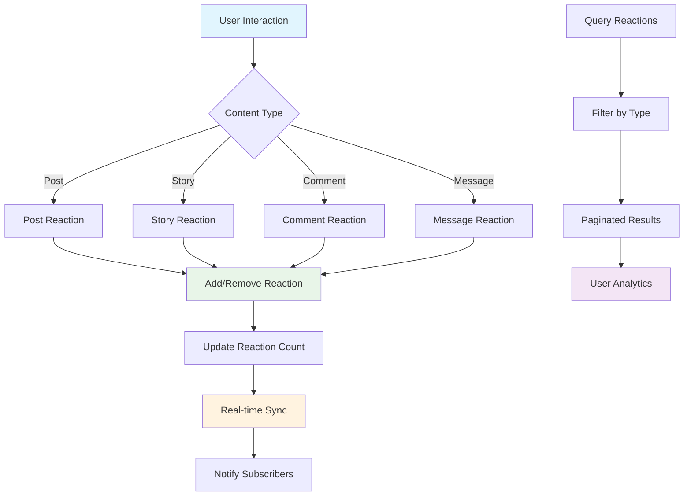

# Reactions

Enable expressive user engagement through comprehensive reaction systems that support posts, stories, comments, and messages. Build interactive communities where users can express emotions and respond to content with customizable reaction types.

## Architecture Overview

## Key Features

<CardGroup cols={2}>
  <Card title="Multi-Content Support" icon="heart">
    React to posts, stories, comments, and messages with unified API
  </Card>
  <Card title="Custom Reaction Types" icon="face-smile">
    Support unlimited reaction types: like, love, wow, laugh, and custom emotions
  </Card>
  <Card title="Real-time Updates" icon="bolt">
    Instant reaction synchronization across all connected clients
  </Card>
  <Card title="Analytics Integration" icon="chart-bar">
    Comprehensive reaction analytics and engagement metrics
  </Card>
</CardGroup>

## Supported Reference Types

<AccordionGroup>
  <Accordion title="Post Reactions">
    **Reference Type:** `POST`
    
    **Description:** Enable users to react to posts within feeds and communities. Perfect for social engagement and content discovery.
    
    **Use Cases:**
    - Social feed interactions
    - Community engagement
    - Content popularity metrics
    - User sentiment analysis
  </Accordion>
  
  <Accordion title="Story Reactions">
    **Reference Type:** `STORY`
    
    **Description:** Allow reactions on ephemeral story content. Ideal for real-time engagement and story analytics.
    
    **Use Cases:**
    - Story engagement tracking
    - Real-time feedback
    - Story performance metrics
    - User interaction patterns
  </Accordion>
  
  <Accordion title="Comment Reactions">
    **Reference Type:** `COMMENT`
    
    **Description:** Enable reactions on comments to facilitate deeper conversation engagement and community building.
    
    **Use Cases:**
    - Comment thread engagement
    - Discussion quality indicators
    - Community moderation
    - Conversation analytics
  </Accordion>
  
  <Accordion title="Message Reactions">
    **Reference Type:** `MESSAGE`
    
    **Description:** Support reactions in chat and messaging contexts for expressive communication.
    
    **Use Cases:**
    - Chat engagement
    - Message acknowledgment
    - Emotional expression
    - Communication analytics
  </Accordion>
</AccordionGroup>

## Reaction Data Model

| Property | Type | Description | Example Values |
|----------|------|-------------|----------------|
| **referenceId** | `String` | Unique identifier of the content | `"post_123"`, `"comment_456"` |
| **referenceType** | `String` | Type of content being reacted to | `"POST"`, `"STORY"`, `"COMMENT"`, `"MESSAGE"` |
| **reactionName** | `String` | Name of the reaction (max 100 chars) | `"like"`, `"love"`, `"wow"`, `"laugh"` |
| **reactionId** | `String` | Unique identifier of the reaction | `"reaction_789"` |
| **reactorId** | `String` | ID of the user who reacted | `"user_101"` |
| **reactorDisplayName** | `String` | Display name of the reactor | `"John Doe"` |
| **createdAt** | `DateTime` | Timestamp when reaction was created | `2025-06-15T10:30:00Z` |
| **updatedAt** | `DateTime` | Timestamp of last reaction update | `2025-06-15T10:35:00Z` |

## Reaction Types

<CardGroup cols={3}>
  <Card title="Standard Reactions" icon="thumbs-up">
    **Common Types:**
    - `like` - General approval
    - `dislike` - Disapproval  
    - `love` - Strong positive emotion
    - `laugh` - Humor and entertainment
    - `wow` - Surprise and amazement
    - `sad` - Empathy and sorrow
    - `angry` - Frustration or disagreement
  </Card>
  
  <Card title="Custom Reactions" icon="star">
    **Business Specific:**
    - `celebrate` - Achievements
    - `support` - Encouragement
    - `question` - Inquiry marker
    - `idea` - Innovation indicator
    - `fire` - Trending content
    - `clap` - Appreciation
  </Card>
  
  <Card title="Contextual Reactions" icon="message">
    **Use Case Specific:**
    - `helpful` - Educational content
    - `inspiring` - Motivational posts
    - `informative` - Knowledge sharing
    - `funny` - Entertainment value
    - `agree` - Opinion alignment
    - `disagree` - Counterpoints
  </Card>
</CardGroup>

<Note>
**Case Sensitivity**: Reaction names are case-sensitive. "like" and "Like" are treated as different reaction types.
</Note>

<Info>
**Character Limit**: Reaction names have a maximum length of 100 characters to ensure database efficiency and UI compatibility.
</Info>