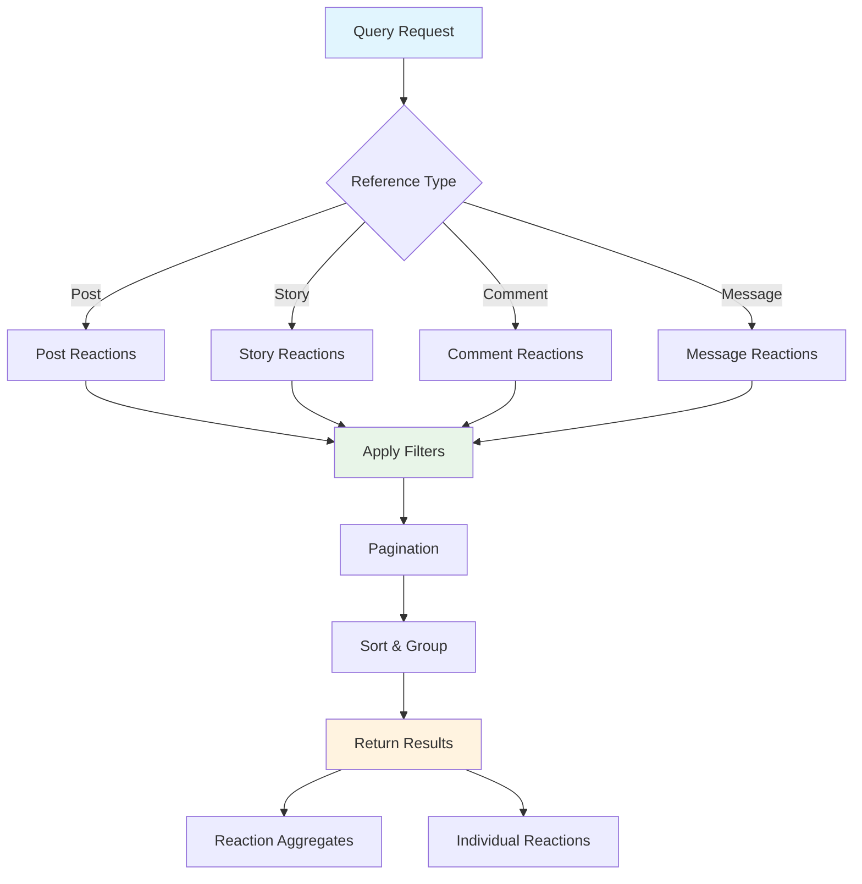

# Query Reactions

Retrieve comprehensive reaction data to analyze user engagement, build analytics dashboards, and understand community sentiment. The `getReactions` method provides detailed information about reactions across all content types with powerful filtering and pagination capabilities.

## Architecture Overview



## Key Features

<CardGroup cols={2}>
  <Card title="Comprehensive Queries" icon="search">
    Query reactions across posts, stories, comments, and messages
  </Card>
  <Card title="Advanced Filtering" icon="filter">
    Filter by reaction type, user, time range, and custom criteria
  </Card>
  <Card title="Real-time Updates" icon="bolt">
    Live reaction data synchronization and automatic updates
  </Card>
  <Card title="Analytics Ready" icon="chart-line">
    Built-in aggregation and analytics for engagement insights
  </Card>
</CardGroup>

## Query Parameters

<AccordionGroup>
  <Accordion title="referenceType">
    **Type:** `ReactionReferenceType`
    
    **Required:** Yes
    
    **Description:** Specifies the type of content to query reactions for.
    
    **Valid Values:**
    - `POST` - Query reactions for posts
    - `STORY` - Query reactions for story content
    - `COMMENT` - Query reactions for comments
    - `MESSAGE` - Query reactions for messages
  </Accordion>
  
  <Accordion title="referenceId">
    **Type:** `string`
    
    **Required:** Yes
    
    **Description:** Unique identifier of the content to query reactions for.
    
    **Example:** `"post_123"`, `"comment_456"`
  </Accordion>
  
  <Accordion title="reactionName">
    **Type:** `string`
    
    **Required:** No
    
    **Description:** Optional filter to query only specific reaction types. If omitted, returns all reaction types.
    
    **Example:** `"like"`, `"love"`, `"angry"`
  </Accordion>
  
  <Accordion title="limit">
    **Type:** `number`
    
    **Required:** No
    
    **Description:** Maximum number of reactions to return. Default varies by platform.
    
    **Range:** 1-100 (platform dependent)
  </Accordion>
  
  <Accordion title="sortOrder">
    **Type:** `SortOrder`
    
    **Required:** No
    
    **Description:** Sort order for returned reactions.
    
    **Options:** `NEWEST_FIRST`, `OLDEST_FIRST`
  </Accordion>
</AccordionGroup>

## Reaction Data Model

Each reaction query returns rich data including:

| Property | Type | Description |
|----------|------|-------------|
| **reactionId** | `string` | Unique reaction identifier |
| **reactionName** | `string` | Type of reaction (e.g., "like", "love") |
| **reactorId** | `string` | ID of the user who reacted |
| **reactorDisplayName** | `string` | Display name of the reactor |
| **createdAt** | `DateTime` | When the reaction was created |
| **metadata** | `object` | Additional reaction metadata |

## Implementation

<Tabs>
  <Tab title="iOS">
    <CodeGroup>
      ```swift Basic Query
      import AmitySDK
      
      class ReactionQueryManager {
          private let reactionRepository: AmityReactionRepository
          
          init(client: AmityClient) {
              self.reactionRepository = AmityReactionRepository(client: client)
          }
          
          func queryReactions(
              referenceType: AmityReactionReferenceType,
              referenceId: String,
              reactionName: String? = nil,
              completion: @escaping (Result<[AmityReaction], Error>) -> Void
          ) {
              let query = reactionRepository.getReactions(
                  referenceType: referenceType,
                  referenceId: referenceId,
                  reactionName: reactionName
              )
              
              query.observe { [weak self] collection, error in
                  if let error = error {
                      completion(.failure(error))
                  } else if let reactions = collection?.object {
                      completion(.success(reactions))
                  }
              }
          }
      }
      ```
      
      ```swift Advanced Query with Analytics
      class AdvancedReactionQueryManager {
          private let reactionRepository: AmityReactionRepository
          
          func queryReactionsWithAnalytics(
              referenceType: AmityReactionReferenceType,
              referenceId: String,
              completion: @escaping (Result<ReactionAnalytics, Error>) -> Void
          ) {
              let query = reactionRepository.getReactions(
                  referenceType: referenceType,
                  referenceId: referenceId
              )
              
              query.observe { [weak self] collection, error in
                  if let error = error {
                      completion(.failure(error))
                  } else if let reactions = collection?.object {
                      let analytics = self?.generateAnalytics(from: reactions)
                      completion(.success(analytics ?? ReactionAnalytics()))
                  }
              }
          }
          
          private func generateAnalytics(from reactions: [AmityReaction]) -> ReactionAnalytics {
              var reactionCounts: [String: Int] = [:]
              var totalReactions = 0
              var uniqueReactors = Set<String>()
              
              for reaction in reactions {
                  // Count reactions by type
                  reactionCounts[reaction.reactionName, default: 0] += 1
                  
                  // Track unique reactors
                  uniqueReactors.insert(reaction.reactorId)
                  
                  totalReactions += 1
              }
              
              return ReactionAnalytics(
                  totalReactions: totalReactions,
                  uniqueReactors: uniqueReactors.count,
                  reactionBreakdown: reactionCounts,
                  mostPopularReaction: reactionCounts.max(by: { $0.value < $1.value })?.key,
                  engagementRate: calculateEngagementRate(totalReactions: totalReactions)
              )
          }
          
          private func calculateEngagementRate(totalReactions: Int) -> Double {
              // Calculate engagement rate based on your business logic
              // This is a simplified example
              return Double(totalReactions) / 100.0 // Assuming 100 is your content reach
          }
      }
      
      struct ReactionAnalytics {
          let totalReactions: Int
          let uniqueReactors: Int
          let reactionBreakdown: [String: Int]
          let mostPopularReaction: String?
          let engagementRate: Double
      }
      ```
    </CodeGroup>
  </Tab>
  
  <Tab title="Android">
    <CodeGroup>
      ```kotlin Basic Query
      import com.amity.socialcloud.sdk.AmityClient
      import com.amity.socialcloud.sdk.model.social.reaction.*
      
      class ReactionQueryManager(private val client: AmityClient) {
          private val reactionRepository = AmityReactionRepository(client)
          
          fun queryReactions(
              referenceType: AmityReactionReferenceType,
              referenceId: String,
              reactionName: String? = null
          ): Flowable<PagingData<AmityReaction>> {
              return reactionRepository.getReactions(
                  referenceType = referenceType,
                  referenceId = referenceId,
                  reactionName = reactionName
              )
              .subscribeOn(Schedulers.io())
              .observeOn(AndroidSchedulers.mainThread())
              .doOnNext { pagingData ->
                  Log.d("ReactionQuery", "Loaded ${pagingData.size} reactions")
              }
          }
          
          fun queryPostReactions(postId: String): Flowable<PagingData<AmityReaction>> {
              return queryReactions(
                  referenceType = AmityReactionReferenceType.POST,
                  referenceId = postId
              )
          }
          
          fun queryCommentReactions(commentId: String): Flowable<PagingData<AmityReaction>> {
              return queryReactions(
                  referenceType = AmityReactionReferenceType.COMMENT,
                  referenceId = commentId
              )
          }
      }
      ```
      
      ```kotlin Advanced Query with Filtering
      class AdvancedReactionQueryManager(private val client: AmityClient) {
          private val reactionRepository = AmityReactionRepository(client)
          
          fun queryReactionsWithFilter(
              referenceType: AmityReactionReferenceType,
              referenceId: String,
              filter: ReactionFilter
          ): Observable<ReactionQueryResult> {
              return reactionRepository.getReactions(
                  referenceType = referenceType,
                  referenceId = referenceId,
                  reactionName = filter.reactionName
              )
              .flatMapSingle { pagingData ->
                  processReactionData(pagingData, filter)
              }
              .subscribeOn(Schedulers.io())
              .observeOn(AndroidSchedulers.mainThread())
          }
          
          private fun processReactionData(
              pagingData: PagingData<AmityReaction>,
              filter: ReactionFilter
          ): Single<ReactionQueryResult> {
              return Single.fromCallable {
                  val reactions = pagingData.toList()
                  
                  val filteredReactions = reactions.filter { reaction ->
                      when {
                          filter.userId != null -> reaction.reactorId == filter.userId
                          filter.dateRange != null -> isWithinDateRange(reaction.createdAt, filter.dateRange)
                          else -> true
                      }
                  }
                  
                  val analytics = generateReactionAnalytics(filteredReactions)
                  
                  ReactionQueryResult(
                      reactions = filteredReactions,
                      analytics = analytics,
                      totalCount = reactions.size,
                      filteredCount = filteredReactions.size
                  )
              }
          }
          
          private fun generateReactionAnalytics(reactions: List<AmityReaction>): ReactionAnalytics {
              val reactionCounts = reactions.groupingBy { it.reactionName }.eachCount()
              val uniqueReactors = reactions.map { it.reactorId }.toSet()
              
              return ReactionAnalytics(
                  totalReactions = reactions.size,
                  uniqueReactors = uniqueReactors.size,
                  reactionBreakdown = reactionCounts,
                  mostPopularReaction = reactionCounts.maxByOrNull { it.value }?.key
              )
          }
          
          private fun isWithinDateRange(date: Date, dateRange: DateRange): Boolean {
              return date.after(dateRange.start) && date.before(dateRange.end)
          }
      }
      
      data class ReactionFilter(
          val reactionName: String? = null,
          val userId: String? = null,
          val dateRange: DateRange? = null
      )
      
      data class DateRange(val start: Date, val end: Date)
      
      data class ReactionQueryResult(
          val reactions: List<AmityReaction>,
          val analytics: ReactionAnalytics,
          val totalCount: Int,
          val filteredCount: Int
      )
      
      data class ReactionAnalytics(
          val totalReactions: Int,
          val uniqueReactors: Int,
          val reactionBreakdown: Map<String, Int>,
          val mostPopularReaction: String?
      )
      ```
    </CodeGroup>
  </Tab>
  
  <Tab title="TypeScript">
    <CodeGroup>
      ```typescript Basic Query
      import { AmityClient, ReactionReferenceType, Reaction } from '@amityco/ts-sdk';
      
      class ReactionQueryManager {
          constructor(private client: AmityClient) {}
          
          async queryReactions(
              referenceType: ReactionReferenceType,
              referenceId: string,
              options?: {
                  reactionName?: string;
                  limit?: number;
                  sortOrder?: 'asc' | 'desc';
              }
          ): Promise<Reaction[]> {
              try {
                  const reactions = await this.client.getReactions({
                      referenceType,
                      referenceId,
                      reactionName: options?.reactionName,
                      limit: options?.limit || 50,
                      sortOrder: options?.sortOrder || 'desc'
                  });
                  
                  console.log(`Loaded ${reactions.length} reactions for ${referenceType}:${referenceId}`);
                  return reactions;
              } catch (error) {
                  console.error('Failed to query reactions:', error);
                  throw error;
              }
          }
          
          async getReactionSummary(
              referenceType: ReactionReferenceType,
              referenceId: string
          ): Promise<ReactionSummary> {
              const reactions = await this.queryReactions(referenceType, referenceId);
              
              const summary = {
                  totalReactions: reactions.length,
                  reactionCounts: this.groupReactionsByType(reactions),
                  topReactors: this.getTopReactors(reactions),
                  myReactions: this.getMyReactions(reactions)
              };
              
              return summary;
          }
          
          private groupReactionsByType(reactions: Reaction[]): Record<string, number> {
              return reactions.reduce((acc, reaction) => {
                  acc[reaction.reactionName] = (acc[reaction.reactionName] || 0) + 1;
                  return acc;
              }, {} as Record<string, number>);
          }
          
          private getTopReactors(reactions: Reaction[], limit: number = 5): Reactor[] {
              const reactorCounts = reactions.reduce((acc, reaction) => {
                  const reactor = acc.find(r => r.userId === reaction.reactorId);
                  if (reactor) {
                      reactor.reactionCount++;
                  } else {
                      acc.push({
                          userId: reaction.reactorId,
                          displayName: reaction.reactorDisplayName,
                          reactionCount: 1
                      });
                  }
                  return acc;
              }, [] as Reactor[]);
              
              return reactorCounts
                  .sort((a, b) => b.reactionCount - a.reactionCount)
                  .slice(0, limit);
          }
          
          private getMyReactions(reactions: Reaction[]): string[] {
              const currentUserId = this.client.getCurrentUser()?.userId;
              return reactions
                  .filter(reaction => reaction.reactorId === currentUserId)
                  .map(reaction => reaction.reactionName);
          }
      }
      
      interface ReactionSummary {
          totalReactions: number;
          reactionCounts: Record<string, number>;
          topReactors: Reactor[];
          myReactions: string[];
      }
      
      interface Reactor {
          userId: string;
          displayName: string;
          reactionCount: number;
      }
      ```
      
      ```typescript React Hook for Reaction Queries
      import { useState, useEffect, useCallback } from 'react';
      import { ReactionReferenceType, Reaction } from '@amityco/ts-sdk';
      
      interface UseReactionQueryResult {
          reactions: Reaction[];
          loading: boolean;
          error: string | null;
          hasMore: boolean;
          loadMore: () => Promise<void>;
          refresh: () => Promise<void>;
          analytics: ReactionAnalytics | null;
      }
      
      export const useReactionQuery = (
          referenceType: ReactionReferenceType,
          referenceId: string,
          options?: {
              reactionName?: string;
              limit?: number;
              autoRefresh?: boolean;
          }
      ): UseReactionQueryResult => {
          const [reactions, setReactions] = useState<Reaction[]>([]);
          const [loading, setLoading] = useState(false);
          const [error, setError] = useState<string | null>(null);
          const [hasMore, setHasMore] = useState(true);
          const [analytics, setAnalytics] = useState<ReactionAnalytics | null>(null);
          
          const queryReactions = useCallback(async (reset: boolean = false) => {
              setLoading(true);
              setError(null);
              
              try {
                  const newReactions = await client.getReactions({
                      referenceType,
                      referenceId,
                      reactionName: options?.reactionName,
                      limit: options?.limit || 20,
                      offset: reset ? 0 : reactions.length
                  });
                  
                  const updatedReactions = reset ? newReactions : [...reactions, ...newReactions];
                  setReactions(updatedReactions);
                  setHasMore(newReactions.length === (options?.limit || 20));
                  
                  // Generate analytics
                  const reactionAnalytics = generateAnalytics(updatedReactions);
                  setAnalytics(reactionAnalytics);
                  
              } catch (err) {
                  const errorMessage = err instanceof Error ? err.message : 'Unknown error';
                  setError(errorMessage);
              } finally {
                  setLoading(false);
              }
          }, [referenceType, referenceId, options, reactions.length]);
          
          const loadMore = useCallback(async () => {
              if (!loading && hasMore) {
                  await queryReactions(false);
              }
          }, [queryReactions, loading, hasMore]);
          
          const refresh = useCallback(async () => {
              await queryReactions(true);
          }, [queryReactions]);
          
          useEffect(() => {
              queryReactions(true);
          }, [referenceType, referenceId, options?.reactionName]);
          
          // Auto-refresh setup
          useEffect(() => {
              if (options?.autoRefresh) {
                  const interval = setInterval(refresh, 30000); // Refresh every 30 seconds
                  return () => clearInterval(interval);
              }
          }, [options?.autoRefresh, refresh]);
          
          return {
              reactions,
              loading,
              error,
              hasMore,
              loadMore,
              refresh,
              analytics
          };
      };
      
      const generateAnalytics = (reactions: Reaction[]): ReactionAnalytics => {
          const reactionCounts = reactions.reduce((acc, reaction) => {
              acc[reaction.reactionName] = (acc[reaction.reactionName] || 0) + 1;
              return acc;
          }, {} as Record<string, number>);
          
          const uniqueReactors = new Set(reactions.map(r => r.reactorId)).size;
          const mostPopular = Object.entries(reactionCounts)
              .sort(([,a], [,b]) => b - a)[0]?.[0];
          
          return {
              totalReactions: reactions.length,
              uniqueReactors,
              reactionBreakdown: reactionCounts,
              mostPopularReaction: mostPopular,
              engagementRate: calculateEngagementRate(reactions.length)
          };
      };
      
      const calculateEngagementRate = (totalReactions: number): number => {
          // Implement your engagement rate calculation logic
          return (totalReactions / 1000) * 100; // Example calculation
      };
      
      interface ReactionAnalytics {
          totalReactions: number;
          uniqueReactors: number;
          reactionBreakdown: Record<string, number>;
          mostPopularReaction?: string;
          engagementRate: number;
      }
      ```
    </CodeGroup>
  </Tab>
  
  <Tab title="Flutter">
    <CodeGroup>
      ```dart Basic Query
      import 'package:amity_sdk/amity_sdk.dart';
      
      class ReactionQueryManager {
          
          Future<List<AmityReaction>> queryReactions({
              required String referenceType,
              required String referenceId,
              String? reactionName,
              int? limit,
          }) async {
              try {
                  // Query reactions based on reference type
                  switch (referenceType.toLowerCase()) {
                      case 'post':
                          return await _queryPostReactions(referenceId, reactionName, limit);
                      case 'comment':
                          return await _queryCommentReactions(referenceId, reactionName, limit);
                      case 'story':
                          return await _queryStoryReactions(referenceId, reactionName, limit);
                      case 'message':
                          return await _queryMessageReactions(referenceId, reactionName, limit);
                      default:
                          throw ArgumentError('Unsupported reference type: $referenceType');
                  }
              } catch (error) {
                  print('Failed to query reactions: $error');
                  rethrow;
              }
          }
          
          Future<List<AmityReaction>> _queryPostReactions(
              String postId, 
              String? reactionName, 
              int? limit
          ) async {
              final query = AmityReactionRepository().getReactions(
                  referenceType: AmityReactionReferenceType.POST,
                  referenceId: postId,
                  reactionName: reactionName,
              );
              
              // Apply limit if specified
              if (limit != null) {
                  query.limit(limit);
              }
              
              final snapshot = await query.get();
              return snapshot.data;
          }
          
          Future<List<AmityReaction>> _queryCommentReactions(
              String commentId, 
              String? reactionName, 
              int? limit
          ) async {
              final query = AmityReactionRepository().getReactions(
                  referenceType: AmityReactionReferenceType.COMMENT,
                  referenceId: commentId,
                  reactionName: reactionName,
              );
              
              if (limit != null) {
                  query.limit(limit);
              }
              
              final snapshot = await query.get();
              return snapshot.data;
          }
          
          Future<ReactionSummary> getReactionSummary({
              required String referenceType,
              required String referenceId,
          }) async {
              final reactions = await queryReactions(
                  referenceType: referenceType,
                  referenceId: referenceId,
              );
              
              return _generateSummary(reactions);
          }
          
          ReactionSummary _generateSummary(List<AmityReaction> reactions) {
              final reactionCounts = <String, int>{};
              final uniqueReactors = <String>{};
              
              for (final reaction in reactions) {
                  // Count reactions by type
                  reactionCounts[reaction.reactionName] = 
                      (reactionCounts[reaction.reactionName] ?? 0) + 1;
                  
                  // Track unique reactors
                  uniqueReactors.add(reaction.reactorId);
              }
              
              // Find most popular reaction
              String? mostPopular;
              int maxCount = 0;
              reactionCounts.forEach((reaction, count) {
                  if (count > maxCount) {
                      maxCount = count;
                      mostPopular = reaction;
                  }
              });
              
              return ReactionSummary(
                  totalReactions: reactions.length,
                  uniqueReactors: uniqueReactors.length,
                  reactionBreakdown: reactionCounts,
                  mostPopularReaction: mostPopular,
              );
          }
      }
      
      class ReactionSummary {
          final int totalReactions;
          final int uniqueReactors;
          final Map<String, int> reactionBreakdown;
          final String? mostPopularReaction;
          
          const ReactionSummary({
              required this.totalReactions,
              required this.uniqueReactors,
              required this.reactionBreakdown,
              this.mostPopularReaction,
          });
          
          @override
          String toString() {
              return 'ReactionSummary(total: $totalReactions, unique: $uniqueReactors, '
                     'popular: $mostPopularReaction, breakdown: $reactionBreakdown)';
          }
      }
      ```
      
      ```dart Provider Example with Live Updates
      import 'package:flutter/material.dart';
      import 'package:amity_sdk/amity_sdk.dart';
      
      class ReactionQueryProvider extends ChangeNotifier {
          List<AmityReaction> _reactions = [];
          bool _isLoading = false;
          String? _error;
          ReactionSummary? _summary;
          
          List<AmityReaction> get reactions => _reactions;
          bool get isLoading => _isLoading;
          String? get error => _error;
          ReactionSummary? get summary => _summary;
          
          Future<void> loadReactions({
              required String referenceType,
              required String referenceId,
              String? reactionName,
              bool refresh = false,
          }) async {
              if (!refresh && _isLoading) return;
              
              _isLoading = true;
              _error = null;
              notifyListeners();
              
              try {
                  final queryManager = ReactionQueryManager();
                  final reactions = await queryManager.queryReactions(
                      referenceType: referenceType,
                      referenceId: referenceId,
                      reactionName: reactionName,
                  );
                  
                  _reactions = reactions;
                  _summary = queryManager._generateSummary(reactions);
                  
                  // Track analytics
                  _trackReactionQuery(referenceType, referenceId, reactions.length);
                  
              } catch (error) {
                  _error = error.toString();
                  print('Failed to load reactions: $error');
              } finally {
                  _isLoading = false;
                  notifyListeners();
              }
          }
          
          Future<void> refreshReactions({
              required String referenceType,
              required String referenceId,
              String? reactionName,
          }) async {
              await loadReactions(
                  referenceType: referenceType,
                  referenceId: referenceId,
                  reactionName: reactionName,
                  refresh: true,
              );
          }
          
          List<AmityReaction> getReactionsByType(String reactionName) {
              return _reactions
                  .where((reaction) => reaction.reactionName == reactionName)
                  .toList();
          }
          
          int getReactionCount(String reactionName) {
              return getReactionsByType(reactionName).length;
          }
          
          bool hasUserReacted(String userId, String reactionName) {
              return _reactions.any((reaction) => 
                  reaction.reactorId == userId && 
                  reaction.reactionName == reactionName
              );
          }
          
          void _trackReactionQuery(String referenceType, String referenceId, int count) {
              AnalyticsManager.track('reaction_query', {
                  'reference_type': referenceType,
                  'reference_id': referenceId,
                  'reaction_count': count,
                  'timestamp': DateTime.now().millisecondsSinceEpoch,
              });
          }
          
          void clearError() {
              _error = null;
              notifyListeners();
          }
      }
      ```
    </CodeGroup>
  </Tab>
</Tabs>

## Reaction Aggregates

Each content item provides built-in reaction aggregate data:

<AccordionGroup>
  <Accordion title="reactionsCount">
    **Type:** `number`
    
    **Description:** Total number of reactions on the content, regardless of type.
    
    **Use Case:** Display overall engagement metrics and popularity indicators.
  </Accordion>
  
  <Accordion title="myReactions">
    **Type:** `string[]`
    
    **Description:** Array of reaction names that the current user has added to the content.
    
    **Use Case:** Highlight user's own reactions in the UI and enable toggling.
  </Accordion>
  
  <Accordion title="reactions">
    **Type:** `Record<string, number>`
    
    **Description:** Map showing count of each reaction type on the content.
    
    **Example:**
    ```json
    {
      "like": 15,
      "love": 8,
      "wow": 3,
      "angry": 1
    }
    ```
  </Accordion>
</AccordionGroup>

## Live Reaction Updates

<Tabs>
  <Tab title="Real-time Subscriptions">
    Subscribe to live reaction updates for real-time UI synchronization:
    
    ```typescript
    // TypeScript example for live reaction updates
    const subscription = client.subscribeToReactions({
        referenceType: 'POST',
        referenceId: 'post_123'
    }, (updatedReactions) => {
        // Update UI with new reaction data
        updateReactionDisplay(updatedReactions);
    });
    
    // Clean up subscription
    subscription.unsubscribe();
    ```
  </Tab>
  
  <Tab title="Event-based Updates">
    Listen for reaction events and update data accordingly:
    
    ```swift
    // iOS example for reaction events
    NotificationCenter.default.addObserver(
        forName: .reactionAdded,
        object: nil,
        queue: .main
    ) { notification in
        if let reaction = notification.object as? AmityReaction {
            handleNewReaction(reaction)
        }
    }
    ```
  </Tab>
  
  <Tab title="Polling Strategy">
    Implement periodic updates for less real-time scenarios:
    
    ```kotlin
    // Android example for periodic updates
    class ReactionPollingManager {
        private val updateInterval = 30_000L // 30 seconds
        
        fun startPolling(referenceType: AmityReactionReferenceType, referenceId: String) {
            Observable.interval(updateInterval, TimeUnit.MILLISECONDS)
                .flatMap { queryReactions(referenceType, referenceId) }
                .subscribe { reactions ->
                    updateReactionDisplay(reactions)
                }
        }
    }
    ```
  </Tab>
</Tabs>

## Analytics & Insights

<CardGroup cols={2}>
  <Card title="Engagement Metrics" icon="chart-line">
    Track reaction rates, popular content, and user engagement patterns
  </Card>
  <Card title="Sentiment Analysis" icon="face-smile">
    Analyze reaction types to understand community sentiment and mood
  </Card>
  <Card title="User Behavior" icon="users">
    Identify most active reactors and engagement leaders
  </Card>
  <Card title="Content Performance" icon="star">
    Measure which content types and topics generate most reactions
  </Card>
</CardGroup>

### Engagement Analytics Example

```typescript
interface EngagementAnalytics {
  totalReactions: number;
  uniqueReactors: number;
  averageReactionsPerUser: number;
  reactionDistribution: Record<string, number>;
  engagementRate: number;
  timeBasedMetrics: {
    peakHours: number[];
    dailyAverages: Record<string, number>;
  };
}

const analytics = generateEngagementAnalytics(reactions);
```

## Best Practices

<AccordionGroup>
  <Accordion title="Performance Optimization">
    - Implement pagination for large reaction lists
    - Use reaction aggregates instead of full queries when possible
    - Cache frequently accessed reaction data
    - Implement efficient filtering and sorting on the client side
  </Accordion>
  
  <Accordion title="User Experience">
    - Show loading states during reaction queries
    - Implement optimistic updates for better responsiveness
    - Display reaction summaries before detailed lists
    - Provide filtering options for different reaction types
  </Accordion>
  
  <Accordion title="Data Management">
    - Regularly refresh reaction data for accuracy
    - Handle real-time updates gracefully
    - Implement proper error handling and retry logic
    - Use appropriate data structures for reaction storage
  </Accordion>
  
  <Accordion title="Analytics Integration">
    - Track reaction query patterns for insights
    - Monitor popular content and engagement trends
    - Analyze reaction velocity and patterns
    - Implement A/B testing for reaction features
  </Accordion>
</AccordionGroup>

## Error Handling

<AccordionGroup>
  <Accordion title="Common Error Scenarios">
    - **Network Failures**: Handle offline scenarios and poor connectivity
    - **Invalid References**: Non-existent content or invalid IDs
    - **Rate Limiting**: Too many queries in a short period
    - **Permission Errors**: Insufficient access to reaction data
  </Accordion>
  
  <Accordion title="Error Recovery Strategies">
    - Implement exponential backoff for failed queries
    - Cache successful results for offline scenarios
    - Provide fallback UI when queries fail
    - Show appropriate error messages based on error type
  </Accordion>
</AccordionGroup>