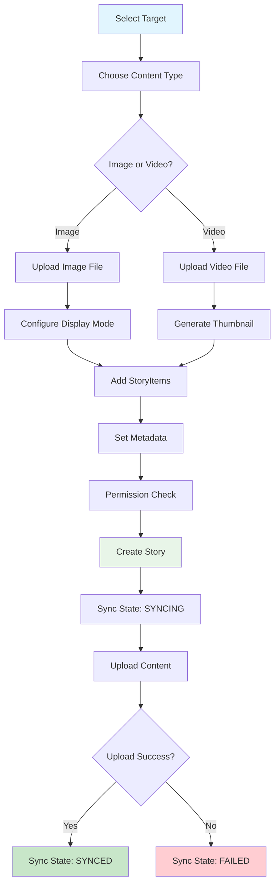

# Create Story

Build engaging ephemeral content with Social Plus Stories supporting images, videos, and interactive elements. Create rich multimedia experiences with hyperlinks, custom overlays, and comprehensive analytics tracking.

## Architecture Overview

<CardGroup>
  <Card title="Multi-Media Content" icon="photo">
    Images up to 1GB and videos up to 2GB with 90-second duration
  </Card>
  <Card title="Interactive Elements" icon="link">
    StoryItems with hyperlinks, overlays, and custom interactions
  </Card>
  <Card title="Optimistic Creation" icon="sync">
    Three-state sync system: SYNCING, SYNCED, FAILED
  </Card>
  <Card title="Real-time Updates" icon="bolt">
    Live object integration with instant synchronization
  </Card>
</CardGroup>

## Content Types & Specifications

| Content Type | Max Size | Duration | Display Modes | Features |
|--------------|----------|----------|---------------|----------|
| **IMAGE** | 1GB | Configurable | FIT, FILL | Overlays, hyperlinks, metadata |
| **VIDEO** | 2GB | 90 seconds | Auto-resize | Thumbnails, interactive elements |

## Story Creation Process



## Create Image Story

Transform your images into engaging stories with interactive elements and custom display options.

### Parameters

| Parameter | Type | Required | Description |
|-----------|------|----------|-------------|
| **targetType** | `Enum` | ✅ | Target type (currently supports 'community') |
| **targetId** | `String` | ✅ | ID of the target community |
| **imageFile** | `File/Data` | ✅ | Image file up to 1GB |
| **storyItems** | `Array<StoryItem>` | ❌ | Interactive elements (hyperlinks, overlays) |
| **imageDisplayMode** | `Enum` | ❌ | Display mode: FIT or FILL |
| **metadata** | `Object` | ❌ | Custom properties and additional data |

### Implementation

<Tabs>
  <Tab title="iOS">
    <CodeGroup>
      ```swift Basic Image Story
      import AmitySDK
      
      class ImageStoryCreator {
          private let storyRepository: AmityStoryRepository
          
          init(client: AmityClient) {
              self.storyRepository = AmityStoryRepository(client: client)
          }
          
          func createImageStory(
              communityId: String,
              imageFile: AmityImageFile,
              displayMode: AmityImageDisplayMode = .fit,
              completion: @escaping (Result<AmityStory, Error>) -> Void
          ) {
              // Create story with basic parameters
              storyRepository.createImageStory(
                  targetType: .community,
                  targetId: communityId,
                  imageFile: imageFile,
                  displayMode: displayMode
              ) { result in
                  switch result {
                  case .success(let story):
                      print("Story created successfully: \(story.storyId)")
                      completion(.success(story))
                  case .failure(let error):
                      print("Failed to create story: \(error)")
                      completion(.failure(error))
                  }
              }
          }
      }
      ```

      ```swift Image Story with StoryItems
      func createImageStoryWithHyperlink(
          communityId: String,
          imageFile: AmityImageFile,
          linkUrl: String,
          linkAlias: String,
          completion: @escaping (Result<AmityStory, Error>) -> Void
      ) {
          // Create hyperlink story item
          let hyperlinkItem = AmityStoryItem.hyperlink(
              url: linkUrl,
              alias: linkAlias,
              position: CGRect(x: 0.2, y: 0.8, width: 0.6, height: 0.1)
          )
          
          // Create story with interactive elements
          storyRepository.createImageStory(
              targetType: .community,
              targetId: communityId,
              imageFile: imageFile,
              storyItems: [hyperlinkItem],
              displayMode: .fill,
              metadata: [
                  "campaign": "summer_promotion",
                  "category": "marketing"
              ]
          ) { result in
              completion(result)
          }
      }
      ```

      ```swift Advanced Image Story Creation
      func createAdvancedImageStory(
          communityId: String,
          imageFile: AmityImageFile,
          options: StoryCreationOptions
      ) {
          // Validate image file
          guard imageFile.fileSize <= 1_000_000_000 else { // 1GB limit
              print("Image file too large")
              return
          }
          
          // Create multiple story items
          var storyItems: [AmityStoryItem] = []
          
          // Add hyperlink if provided
          if let link = options.hyperlink {
              let hyperlinkItem = AmityStoryItem.hyperlink(
                  url: link.url,
                  alias: link.alias,
                  position: link.position
              )
              storyItems.append(hyperlinkItem)
          }
          
          // Add custom metadata
          var metadata = options.metadata ?? [:]
          metadata["created_by"] = "mobile_app"
          metadata["version"] = "2.0"
          
          // Create story with all options
          storyRepository.createImageStory(
              targetType: .community,
              targetId: communityId,
              imageFile: imageFile,
              storyItems: storyItems,
              displayMode: options.displayMode,
              metadata: metadata
          ) { [weak self] result in
              self?.handleStoryCreationResult(result, options: options)
          }
      }
      
      private func handleStoryCreationResult(
          _ result: Result<AmityStory, Error>,
          options: StoryCreationOptions
      ) {
          switch result {
          case .success(let story):
              // Track story creation
              AnalyticsManager.shared.track("story_created", parameters: [
                  "story_id": story.storyId,
                  "content_type": "image",
                  "community_id": story.targetId,
                  "has_hyperlink": !story.storyItems.isEmpty
              ])
              
              // Monitor sync state
              observeStorySyncState(story)
              
          case .failure(let error):
              handleStoryCreationError(error, options: options)
          }
      }
      ```
    </CodeGroup>
  </Tab>
  
  <Tab title="Android">
    <CodeGroup>
      ```kotlin Basic Image Story
      import com.amity.socialcloud.sdk.social.story.*
      
      class ImageStoryCreator(private val client: AmityClient) {
          private val storyRepository = AmityStoryRepository(client)
          
          fun createImageStory(
              communityId: String,
              imageFile: AmityImageFile,
              displayMode: AmityImageDisplayMode = AmityImageDisplayMode.FIT,
              callback: (Result<AmityStory>) -> Unit
          ) {
              // Create story with basic parameters
              storyRepository.createImageStory(
                  targetType = AmityStoryTargetType.COMMUNITY,
                  targetId = communityId,
                  imageFile = imageFile,
                  displayMode = displayMode
              ).observeOn(AndroidSchedulers.mainThread())
              .subscribe(
                  { story ->
                      println("Story created successfully: ${story.storyId}")
                      callback(Result.success(story))
                  },
                  { error ->
                      println("Failed to create story: $error")
                      callback(Result.failure(RuntimeException(error)))
                  }
              )
          }
      }
      ```

      ```kotlin Image Story with StoryItems
      fun createImageStoryWithHyperlink(
          communityId: String,
          imageFile: AmityImageFile,
          linkUrl: String,
          linkAlias: String,
          callback: (Result<AmityStory>) -> Unit
      ) {
          // Create hyperlink story item
          val hyperlinkItem = AmityStoryItem.hyperlink(
              url = linkUrl,
              alias = linkAlias,
              position = AmityStoryItemPosition(0.2f, 0.8f, 0.6f, 0.1f)
          )
          
          // Create story with interactive elements
          storyRepository.createImageStory(
              targetType = AmityStoryTargetType.COMMUNITY,
              targetId = communityId,
              imageFile = imageFile,
              storyItems = listOf(hyperlinkItem),
              displayMode = AmityImageDisplayMode.FILL,
              metadata = mapOf(
                  "campaign" to "summer_promotion",
                  "category" to "marketing"
              )
          ).observeOn(AndroidSchedulers.mainThread())
          .subscribe(
              { story -> callback(Result.success(story)) },
              { error -> callback(Result.failure(RuntimeException(error))) }
          )
      }
      ```

      ```kotlin Advanced Image Story Creation
      fun createAdvancedImageStory(
          communityId: String,
          imageFile: AmityImageFile,
          options: StoryCreationOptions
      ) {
          // Validate image file
          if (imageFile.fileSize > 1_000_000_000L) { // 1GB limit
              println("Image file too large")
              return
          }
          
          // Create multiple story items
          val storyItems = mutableListOf<AmityStoryItem>()
          
          // Add hyperlink if provided
          options.hyperlink?.let { link ->
              val hyperlinkItem = AmityStoryItem.hyperlink(
                  url = link.url,
                  alias = link.alias,
                  position = link.position
              )
              storyItems.add(hyperlinkItem)
          }
          
          // Add custom metadata
          val metadata = (options.metadata ?: emptyMap()).toMutableMap().apply {
              put("created_by", "mobile_app")
              put("version", "2.0")
          }
          
          // Create story with all options
          storyRepository.createImageStory(
              targetType = AmityStoryTargetType.COMMUNITY,
              targetId = communityId,
              imageFile = imageFile,
              storyItems = storyItems,
              displayMode = options.displayMode,
              metadata = metadata
          ).observeOn(AndroidSchedulers.mainThread())
          .subscribe(
              { story -> handleStoryCreationResult(story, options) },
              { error -> handleStoryCreationError(error, options) }
          )
      }
      
      private fun handleStoryCreationResult(
          story: AmityStory,
          options: StoryCreationOptions
      ) {
          // Track story creation
          AnalyticsManager.track("story_created", mapOf(
              "story_id" to story.storyId,
              "content_type" to "image",
              "community_id" to story.targetId,
              "has_hyperlink" to story.storyItems.isNotEmpty()
          ))
          
          // Monitor sync state
          observeStorySyncState(story)
      }
      ```
    </CodeGroup>
  </Tab>

  <Tab title="TypeScript">
    <CodeGroup>
      ```typescript Basic Image Story
      import { SocialPlus, StoryTargetType, ImageDisplayMode } from '@amityco/sdk';

      class ImageStoryCreator {
          private storyRepository = SocialPlus.getStoryRepository();

          async createImageStory(
              communityId: string,
              imageFile: File,
              displayMode: ImageDisplayMode = ImageDisplayMode.FIT
          ): Promise<Story> {
              try {
                  // Create story with basic parameters
                  const story = await this.storyRepository.createImageStory({
                      targetType: StoryTargetType.COMMUNITY,
                      targetId: communityId,
                      imageFile,
                      displayMode
                  });

                  console.log(`Story created successfully: ${story.storyId}`);
                  return story;
              } catch (error) {
                  console.error('Failed to create story:', error);
                  throw error;
              }
          }
      }
      ```

      ```typescript Image Story with StoryItems
      async createImageStoryWithHyperlink(
          communityId: string,
          imageFile: File,
          linkUrl: string,
          linkAlias: string
      ): Promise<Story> {
          // Create hyperlink story item
          const hyperlinkItem = {
              type: 'hyperlink',
              data: {
                  url: linkUrl,
                  alias: linkAlias
              },
              position: {
                  x: 0.2,
                  y: 0.8,
                  width: 0.6,
                  height: 0.1
              }
          };

          // Create story with interactive elements
          return await this.storyRepository.createImageStory({
              targetType: StoryTargetType.COMMUNITY,
              targetId: communityId,
              imageFile,
              storyItems: [hyperlinkItem],
              displayMode: ImageDisplayMode.FILL,
              metadata: {
                  campaign: 'summer_promotion',
                  category: 'marketing'
              }
          });
      }
      ```

      ```typescript Advanced Image Story Creation
      async createAdvancedImageStory(
          communityId: string,
          imageFile: File,
          options: StoryCreationOptions
      ): Promise<Story> {
          // Validate image file
          if (imageFile.size > 1_000_000_000) { // 1GB limit
              throw new Error('Image file too large');
          }

          // Create multiple story items
          const storyItems: StoryItem[] = [];

          // Add hyperlink if provided
          if (options.hyperlink) {
              storyItems.push({
                  type: 'hyperlink',
                  data: {
                      url: options.hyperlink.url,
                      alias: options.hyperlink.alias
                  },
                  position: options.hyperlink.position
              });
          }

          // Add custom metadata
          const metadata = {
              ...options.metadata,
              created_by: 'web_app',
              version: '2.0'
          };

          try {
              // Create story with all options
              const story = await this.storyRepository.createImageStory({
                  targetType: StoryTargetType.COMMUNITY,
                  targetId: communityId,
                  imageFile,
                  storyItems,
                  displayMode: options.displayMode,
                  metadata
              });

              return this.handleStoryCreationResult(story, options);
          } catch (error) {
              this.handleStoryCreationError(error, options);
              throw error;
          }
      }

      private handleStoryCreationResult(
          story: Story,
          options: StoryCreationOptions
      ): Story {
          // Track story creation
          analytics.track('story_created', {
              story_id: story.storyId,
              content_type: 'image',
              community_id: story.targetId,
              has_hyperlink: story.storyItems.length > 0
          });

          // Monitor sync state
          this.observeStorySyncState(story);

          return story;
      }
      ```
    </CodeGroup>
  </Tab>

  <Tab title="Flutter">
    <CodeGroup>
      ```dart Basic Image Story
      import 'package:amity_sdk/amity_sdk.dart';

      class ImageStoryCreator {
        final AmityStoryRepository _storyRepository = AmitySocialClient.newStoryRepository();

        Future<AmityStory> createImageStory(
          String communityId,
          File imageFile, {
          AmityImageDisplayMode displayMode = AmityImageDisplayMode.fit,
        }) async {
          try {
            // Create story with basic parameters
            final story = await _storyRepository.createImageStory(
              targetType: AmityStoryTargetType.COMMUNITY,
              targetId: communityId,
              imageFile: AmityImageFile(imageFile),
              displayMode: displayMode,
            );

            print('Story created successfully: ${story.storyId}');
            return story;
          } catch (error) {
            print('Failed to create story: $error');
            rethrow;
          }
        }
      }
      ```

      ```dart Image Story with StoryItems
      Future<AmityStory> createImageStoryWithHyperlink(
        String communityId,
        File imageFile,
        String linkUrl,
        String linkAlias,
      ) async {
        // Create hyperlink story item
        final hyperlinkItem = AmityStoryItem.hyperlink(
          url: linkUrl,
          alias: linkAlias,
          position: const AmityStoryItemPosition(0.2, 0.8, 0.6, 0.1),
        );

        // Create story with interactive elements
        return await _storyRepository.createImageStory(
          targetType: AmityStoryTargetType.COMMUNITY,
          targetId: communityId,
          imageFile: AmityImageFile(imageFile),
          storyItems: [hyperlinkItem],
          displayMode: AmityImageDisplayMode.fill,
          metadata: {
            'campaign': 'summer_promotion',
            'category': 'marketing',
          },
        );
      }
      ```

      ```dart Advanced Image Story Creation
      Future<AmityStory> createAdvancedImageStory(
        String communityId,
        File imageFile,
        StoryCreationOptions options,
      ) async {
        // Validate image file
        final fileSize = await imageFile.length();
        if (fileSize > 1000000000) { // 1GB limit
          throw Exception('Image file too large');
        }

        // Create multiple story items
        final storyItems = <AmityStoryItem>[];

        // Add hyperlink if provided
        if (options.hyperlink != null) {
          storyItems.add(AmityStoryItem.hyperlink(
            url: options.hyperlink!.url,
            alias: options.hyperlink!.alias,
            position: options.hyperlink!.position,
          ));
        }

        // Add custom metadata
        final metadata = {
          ...?options.metadata,
          'created_by': 'flutter_app',
          'version': '2.0',
        };

        try {
          // Create story with all options
          final story = await _storyRepository.createImageStory(
            targetType: AmityStoryTargetType.COMMUNITY,
            targetId: communityId,
            imageFile: AmityImageFile(imageFile),
            storyItems: storyItems,
            displayMode: options.displayMode,
            metadata: metadata,
          );

          return _handleStoryCreationResult(story, options);
        } catch (error) {
          _handleStoryCreationError(error, options);
          rethrow;
        }
      }

      AmityStory _handleStoryCreationResult(
        AmityStory story,
        StoryCreationOptions options,
      ) {
        // Track story creation
        AnalyticsManager.track('story_created', {
          'story_id': story.storyId,
          'content_type': 'image',
          'community_id': story.targetId,
          'has_hyperlink': story.storyItems.isNotEmpty,
        });

        // Monitor sync state
        _observeStorySyncState(story);

        return story;
      }
    </CodeGroup>
  </Tab>
</Tabs>

## Create Video Story

Transform your video content into engaging stories with automatic thumbnail generation, interactive overlays, and comprehensive duration controls. Perfect for creating immersive multimedia experiences with embedded links and custom interactions.

### Parameters

<AccordionGroup>
  <Accordion title="targetType">
    **Type:** `StoryTargetType`
    
    **Required:** Yes
    
    **Description:** Specifies the target type for the story. Currently supports 'COMMUNITY' for community-based stories.
    
    **Valid Values:**
    - `COMMUNITY` - Create story within a community context
  </Accordion>
  
  <Accordion title="targetId">
    **Type:** `string`
    
    **Required:** Yes
    
    **Description:** Unique identifier of the target community where the video story will be created.
  </Accordion>
  
  <Accordion title="videoFile">
    **Type:** `VideoFile/Data`
    
    **Required:** Yes
    
    **Description:** Video file for the story content. Must be under 2GB and no longer than 90 seconds duration.
    
    **Specifications:**
    - **Max Size:** 2GB
    - **Max Duration:** 90 seconds
    - **Supported Formats:** MP4, MOV, AVI, MKV
    - **Auto-thumbnail:** Generated automatically from video
  </Accordion>
  
  <Accordion title="storyItems">
    **Type:** `Array<StoryItem>`
    
    **Required:** No
    
    **Description:** Interactive elements that can be overlaid on the video story.
    
    **Supported Types:**
    - `hyperlink` - Clickable links with custom positioning
    - `custom` - Custom overlay elements with metadata
  </Accordion>
  
  <Accordion title="metadata">
    **Type:** `Object`
    
    **Required:** No
    
    **Description:** Custom properties and additional data for extended functionality and analytics tracking.
  </Accordion>
</AccordionGroup>

### Implementation

<Tabs>
  <Tab title="iOS">
    <CodeGroup>
      ```swift Basic Video Story
      import AmitySDK
      
      class VideoStoryCreator {
          private let storyRepository: AmityStoryRepository
          
          init(client: AmityClient) {
              self.storyRepository = AmityStoryRepository(client: client)
          }
          
          func createVideoStory(
              communityId: String,
              videoFile: AmityVideoFile,
              completion: @escaping (Result<AmityStory, Error>) -> Void
          ) {
              // Validate video duration (max 90 seconds)
              guard videoFile.duration <= 90.0 else {
                  completion(.failure(StoryError.videoDurationExceeded))
                  return
              }
              
              // Validate file size (max 2GB)
              guard videoFile.fileSize <= 2_000_000_000 else {
                  completion(.failure(StoryError.fileSizeExceeded))
                  return
              }
              
              // Create video story
              storyRepository.createVideoStory(
                  targetType: .community,
                  targetId: communityId,
                  videoFile: videoFile
              ) { result in
                  switch result {
                  case .success(let story):
                      print("Video story created successfully: \(story.storyId)")
                      completion(.success(story))
                  case .failure(let error):
                      print("Failed to create video story: \(error)")
                      completion(.failure(error))
                  }
              }
          }
      }
      ```
      
      ```swift Video Story with Interactive Elements
      func createInteractiveVideoStory(
          communityId: String,
          videoFile: AmityVideoFile,
          callToAction: CallToActionData,
          completion: @escaping (Result<AmityStory, Error>) -> Void
      ) {
          // Create call-to-action button
          let ctaButton = AmityStoryItem.hyperlink(
              url: callToAction.url,
              alias: callToAction.text,
              position: CGRect(x: 0.2, y: 0.85, width: 0.6, height: 0.08)
          )
          
          // Create engagement overlay
          let engagementOverlay = AmityStoryItem.custom(
              type: "engagement_prompt",
              data: [
                  "message": "Swipe up to learn more!",
                  "animation": "pulse",
                  "delay": 2.0
              ],
              position: CGRect(x: 0.1, y: 0.7, width: 0.8, height: 0.1)
          )
          
          // Enhanced metadata for analytics
          let metadata: [String: Any] = [
              "campaign_id": callToAction.campaignId,
              "video_category": "promotional",
              "has_cta": true,
              "expected_duration": videoFile.duration
          ]
          
          storyRepository.createVideoStory(
              targetType: .community,
              targetId: communityId,
              videoFile: videoFile,
              storyItems: [ctaButton, engagementOverlay],
              metadata: metadata
          ) { result in
              self.handleVideoStoryResult(result, callToAction: callToAction)
          }
      }
      
      private func handleVideoStoryResult(
          _ result: Result<AmityStory, Error>,
          callToAction: CallToActionData
      ) {
          switch result {
          case .success(let story):
              // Track video story creation
              AnalyticsManager.shared.track("video_story_created", parameters: [
                  "story_id": story.storyId,
                  "video_duration": story.videoDuration ?? 0,
                  "has_interactive_elements": !story.storyItems.isEmpty,
                  "campaign_id": callToAction.campaignId
              ])
              
              // Monitor video processing status
              monitorVideoProcessing(story)
              
          case .failure(let error):
              handleVideoStoryError(error, callToAction: callToAction)
          }
      }
      ```
      
      ```swift Advanced Video Story with Validation
      func createAdvancedVideoStory(
          communityId: String,
          videoFile: AmityVideoFile,
          options: VideoStoryOptions
      ) {
          // Comprehensive validation
          let validationResult = validateVideoFile(videoFile)
          guard validationResult.isValid else {
              options.onError?(validationResult.error!)
              return
          }
          
          // Process video metadata
          let videoMetadata = extractVideoMetadata(videoFile)
          
          // Create story items based on video content
          var storyItems: [AmityStoryItem] = []
          
          // Add chapter markers for longer videos
          if videoFile.duration > 30.0 {
              let chapterMarkers = createChapterMarkers(videoMetadata)
              storyItems.append(contentsOf: chapterMarkers)
          }
          
          // Add interactive elements
          if let interactions = options.interactiveElements {
              storyItems.append(contentsOf: interactions)
          }
          
          // Enhanced metadata with video analytics
          let metadata: [String: Any] = [
              "video_resolution": videoMetadata.resolution,
              "video_bitrate": videoMetadata.bitrate,
              "video_codec": videoMetadata.codec,
              "auto_generated_thumbnail": true,
              "processing_options": options.processingOptions
          ]
          
          storyRepository.createVideoStory(
              targetType: .community,
              targetId: communityId,
              videoFile: videoFile,
              storyItems: storyItems,
              metadata: metadata
          ) { [weak self] result in
              self?.handleAdvancedVideoStoryResult(result, options: options)
          }
      }
      ```
    </CodeGroup>
  </Tab>
  
  <Tab title="Android">
    <CodeGroup>
      ```kotlin Basic Video Story
      import com.amity.socialcloud.sdk.social.story.*
      
      class VideoStoryCreator(private val client: AmityClient) {
          private val storyRepository = AmityStoryRepository(client)
          
          fun createVideoStory(
              communityId: String,
              videoFile: AmityVideoFile,
              callback: (Result<AmityStory>) -> Unit
          ) {
              // Validate video duration (max 90 seconds)
              if (videoFile.duration > 90000) { // Duration in milliseconds
                  callback(Result.failure(RuntimeException("Video duration exceeds 90 seconds")))
                  return
              }
              
              // Validate file size (max 2GB)
              if (videoFile.fileSize > 2_000_000_000L) {
                  callback(Result.failure(RuntimeException("Video file size exceeds 2GB")))
                  return
              }
              
              // Create video story
              storyRepository.createVideoStory(
                  targetType = AmityStoryTargetType.COMMUNITY,
                  targetId = communityId,
                  videoFile = videoFile
              ).observeOn(AndroidSchedulers.mainThread())
              .subscribe(
                  { story ->
                      println("Video story created successfully: ${story.storyId}")
                      callback(Result.success(story))
                  },
                  { error ->
                      println("Failed to create video story: $error")
                      callback(Result.failure(RuntimeException(error)))
                  }
              )
          }
      }
      ```
      
      ```kotlin Video Story with Interactive Elements
      fun createInteractiveVideoStory(
          communityId: String,
          videoFile: AmityVideoFile,
          callToAction: CallToActionData,
          callback: (Result<AmityStory>) -> Unit
      ) {
          // Create call-to-action button
          val ctaButton = AmityStoryItem.hyperlink(
              url = callToAction.url,
              alias = callToAction.text,
              position = AmityStoryItemPosition(0.2f, 0.85f, 0.6f, 0.08f)
          )
          
          // Create engagement overlay  
          val engagementOverlay = AmityStoryItem.custom(
              type = "engagement_prompt",
              data = mapOf(
                  "message" to "Swipe up to learn more!",
                  "animation" to "pulse",
                  "delay" to 2.0
              ),
              position = AmityStoryItemPosition(0.1f, 0.7f, 0.8f, 0.1f)
          )
          
          // Enhanced metadata for analytics
          val metadata = mapOf(
              "campaign_id" to callToAction.campaignId,
              "video_category" to "promotional",
              "has_cta" to true,
              "expected_duration" to videoFile.duration
          )
          
          storyRepository.createVideoStory(
              targetType = AmityStoryTargetType.COMMUNITY,
              targetId = communityId,
              videoFile = videoFile,
              storyItems = listOf(ctaButton, engagementOverlay),
              metadata = metadata
          ).observeOn(AndroidSchedulers.mainThread())
          .subscribe(
              { story -> handleVideoStoryResult(story, callToAction) },
              { error -> handleVideoStoryError(error, callToAction) }
          )
      }
      
      private fun handleVideoStoryResult(
          story: AmityStory,
          callToAction: CallToActionData
      ) {
          // Track video story creation
          AnalyticsManager.track("video_story_created", mapOf(
              "story_id" to story.storyId,
              "video_duration" to (story.videoDuration ?: 0),
              "has_interactive_elements" to story.storyItems.isNotEmpty(),
              "campaign_id" to callToAction.campaignId
          ))
          
          // Monitor video processing status
          monitorVideoProcessing(story)
      }
      ```
      
      ```kotlin Advanced Video Story with RxJava
      fun createAdvancedVideoStory(
          communityId: String,
          videoFile: AmityVideoFile,
          options: VideoStoryOptions
      ): Disposable {
          return validateVideoFile(videoFile)
              .flatMap { validationResult ->
                  if (validationResult.isValid) {
                      // Process video metadata
                      val videoMetadata = extractVideoMetadata(videoFile)
                      
                      // Create story items
                      val storyItems = buildStoryItems(videoFile, options, videoMetadata)
                      
                      // Enhanced metadata
                      val metadata = buildVideoMetadata(videoMetadata, options)
                      
                      // Create story
                      storyRepository.createVideoStory(
                          targetType = AmityStoryTargetType.COMMUNITY,
                          targetId = communityId,
                          videoFile = videoFile,
                          storyItems = storyItems,
                          metadata = metadata
                      )
                  } else {
                      Single.error(validationResult.error!!)
                  }
              }
              .subscribeOn(Schedulers.io())
              .observeOn(AndroidSchedulers.mainThread())
              .subscribe(
                  { story -> handleAdvancedVideoStoryResult(story, options) },
                  { error -> handleVideoStoryError(error, options) }
              )
      }
      ```
    </CodeGroup>
  </Tab>
  
  <Tab title="TypeScript">
    <CodeGroup>
      ```typescript Basic Video Story
      import { SocialPlus, StoryTargetType } from '@amityco/sdk';
      
      class VideoStoryCreator {
          private storyRepository = SocialPlus.getStoryRepository();
          
          async createVideoStory(
              communityId: string,
              videoFile: File
          ): Promise<Story> {
              // Validate video duration (max 90 seconds)
              const videoDuration = await this.getVideoDuration(videoFile);
              if (videoDuration > 90) {
                  throw new Error('Video duration exceeds 90 seconds');
              }
              
              // Validate file size (max 2GB)
              if (videoFile.size > 2_000_000_000) {
                  throw new Error('Video file size exceeds 2GB');
              }
              
              try {
                  const story = await this.storyRepository.createVideoStory({
                      targetType: StoryTargetType.COMMUNITY,
                      targetId: communityId,
                      videoFile
                  });
                  
                  console.log(`Video story created successfully: ${story.storyId}`);
                  return story;
              } catch (error) {
                  console.error('Failed to create video story:', error);
                  throw error;
              }
          }
          
          private async getVideoDuration(videoFile: File): Promise<number> {
              return new Promise((resolve) => {
                  const video = document.createElement('video');
                  video.preload = 'metadata';
                  video.onloadedmetadata = () => resolve(video.duration);
                  video.src = URL.createObjectURL(videoFile);
              });
          }
      }
      ```
      
      ```typescript Video Story with Interactive Elements
      async createInteractiveVideoStory(
          communityId: string,
          videoFile: File,
          callToAction: CallToActionData
      ): Promise<Story> {
          // Create call-to-action button
          const ctaButton = {
              type: 'hyperlink',
              data: {
                  url: callToAction.url,
                  alias: callToAction.text
              },
              position: {
                  x: 0.2,
                  y: 0.85,
                  width: 0.6,
                  height: 0.08
              }
          };
          
          // Create engagement overlay
          const engagementOverlay = {
              type: 'custom',
              data: {
                  type: 'engagement_prompt',
                  message: 'Swipe up to learn more!',
                  animation: 'pulse',
                  delay: 2.0
              },
              position: {
                  x: 0.1,
                  y: 0.7,
                  width: 0.8,
                  height: 0.1
              }
          };
          
          // Enhanced metadata for analytics
          const metadata = {
              campaign_id: callToAction.campaignId,
              video_category: 'promotional',
              has_cta: true,
              expected_duration: await this.getVideoDuration(videoFile)
          };
          
          try {
              const story = await this.storyRepository.createVideoStory({
                  targetType: StoryTargetType.COMMUNITY,
                  targetId: communityId,
                  videoFile,
                  storyItems: [ctaButton, engagementOverlay],
                  metadata
              });
              
              return this.handleVideoStoryResult(story, callToAction);
          } catch (error) {
              this.handleVideoStoryError(error, callToAction);
              throw error;
          }
      }
      
      private handleVideoStoryResult(
          story: Story,
          callToAction: CallToActionData
      ): Story {
          // Track video story creation
          analytics.track('video_story_created', {
              story_id: story.storyId,
              video_duration: story.videoDuration || 0,
              has_interactive_elements: story.storyItems.length > 0,
              campaign_id: callToAction.campaignId
          });
          
          // Monitor video processing status
          this.monitorVideoProcessing(story);
          
          return story;
      }
      ```
      
      ```typescript React Hook for Video Stories
      import { useState, useCallback } from 'react';
      import { Story, StoryTargetType } from '@amityco/sdk';
      
      interface UseVideoStoryResult {
          createVideoStory: (communityId: string, videoFile: File, options?: VideoStoryOptions) => Promise<Story>;
          isCreating: boolean;
          progress: number;
          error: string | null;
      }
      
      export const useVideoStory = (): UseVideoStoryResult => {
          const [isCreating, setIsCreating] = useState(false);
          const [progress, setProgress] = useState(0);
          const [error, setError] = useState<string | null>(null);
          
          const createVideoStory = useCallback(async (
              communityId: string,
              videoFile: File,
              options: VideoStoryOptions = {}
          ): Promise<Story> => {
              setIsCreating(true);
              setProgress(0);
              setError(null);
              
              try {
                  // Validate video file
                  await validateVideoFile(videoFile);
                  setProgress(20);
                  
                  // Process video if needed
                  const processedVideo = await processVideoIfNeeded(videoFile, options);
                  setProgress(50);
                  
                  // Create story
                  const story = await storyRepository.createVideoStory({
                      targetType: StoryTargetType.COMMUNITY,
                      targetId: communityId,
                      videoFile: processedVideo,
                      storyItems: options.storyItems || [],
                      metadata: options.metadata || {}
                  });
                  
                  setProgress(100);
                  
                  // Track analytics
                  trackVideoStoryCreation(story, options);
                  
                  return story;
                  
              } catch (err) {
                  const errorMessage = err instanceof Error ? err.message : 'Unknown error';
                  setError(errorMessage);
                  throw err;
              } finally {
                  setIsCreating(false);
              }
          }, []);
          
          return {
              createVideoStory,
              isCreating,
              progress,
              error
          };
      };
      ```
    </CodeGroup>
  </Tab>
  
  <Tab title="Flutter">
    <CodeGroup>
      ```dart Basic Video Story
      import 'package:amity_sdk/amity_sdk.dart';
      
      class VideoStoryCreator {
        final AmityStoryRepository _storyRepository = AmitySocialClient.newStoryRepository();
        
        Future<AmityStory> createVideoStory(
          String communityId,
          File videoFile,
        ) async {
          // Validate video duration (max 90 seconds)
          final videoDuration = await _getVideoDuration(videoFile);
          if (videoDuration > const Duration(seconds: 90)) {
            throw Exception('Video duration exceeds 90 seconds');
          }
          
          // Validate file size (max 2GB)
          final fileSize = await videoFile.length();
          if (fileSize > 2000000000) {
            throw Exception('Video file size exceeds 2GB');
          }
          
          try {
            final story = await _storyRepository.createVideoStory(
              targetType: AmityStoryTargetType.COMMUNITY,
              targetId: communityId,
              videoFile: AmityVideoFile(videoFile),
            );
            
            print('Video story created successfully: ${story.storyId}');
            return story;
          } catch (error) {
            print('Failed to create video story: $error');
            rethrow;
          }
        }
        
        Future<Duration> _getVideoDuration(File videoFile) async {
          // Implementation to get video duration
          // This would typically use a video processing library
          return Duration.zero; // Placeholder
        }
      }
      ```
      
      ```dart Video Story with Interactive Elements
      Future<AmityStory> createInteractiveVideoStory(
        String communityId,
        File videoFile,
        CallToActionData callToAction,
      ) async {
        // Create call-to-action button
        final ctaButton = AmityStoryItem.hyperlink(
          url: callToAction.url,
          alias: callToAction.text,
          position: const AmityStoryItemPosition(0.2, 0.85, 0.6, 0.08),
        );
        
        // Create engagement overlay
        final engagementOverlay = AmityStoryItem.custom(
          type: 'engagement_prompt',
          data: {
            'message': 'Swipe up to learn more!',
            'animation': 'pulse',
            'delay': 2.0,
          },
          position: const AmityStoryItemPosition(0.1, 0.7, 0.8, 0.1),
        );
        
        // Enhanced metadata for analytics
        final metadata = {
          'campaign_id': callToAction.campaignId,
          'video_category': 'promotional',
          'has_cta': true,
          'expected_duration': (await _getVideoDuration(videoFile)).inSeconds,
        };
        
        try {
          final story = await _storyRepository.createVideoStory(
            targetType: AmityStoryTargetType.COMMUNITY,
            targetId: communityId,
            videoFile: AmityVideoFile(videoFile),
            storyItems: [ctaButton, engagementOverlay],
            metadata: metadata,
          );
          
          return _handleVideoStoryResult(story, callToAction);
        } catch (error) {
          _handleVideoStoryError(error, callToAction);
          rethrow;
        }
      }
      
      AmityStory _handleVideoStoryResult(
        AmityStory story,
        CallToActionData callToAction,
      ) {
        // Track video story creation
        AnalyticsManager.track('video_story_created', {
          'story_id': story.storyId,
          'video_duration': story.videoDuration ?? 0,
          'has_interactive_elements': story.storyItems.isNotEmpty,
          'campaign_id': callToAction.campaignId,
        });
        
        // Monitor video processing status
        _monitorVideoProcessing(story);
        
        return story;
      }
      ```
      
      ```dart Provider Example for Video Stories
      import 'package:flutter/material.dart';
      import 'package:amity_sdk/amity_sdk.dart';
      
      class VideoStoryProvider extends ChangeNotifier {
        bool _isCreating = false;
        double _progress = 0.0;
        String? _error;
        
        bool get isCreating => _isCreating;
        double get progress => _progress;
        String? get error => _error;
        
        Future<AmityStory> createAdvancedVideoStory(
          String communityId,
          File videoFile,
          VideoStoryOptions options,
        ) async {
          _isCreating = true;
          _progress = 0.0;
          _error = null;
          notifyListeners();
          
          try {
            // Validate video file
            await _validateVideoFile(videoFile);
            _progress = 0.2;
            notifyListeners();
            
            // Process video metadata
            final videoMetadata = await _extractVideoMetadata(videoFile);
            _progress = 0.4;
            notifyListeners();
            
            // Create story items
            final storyItems = _buildStoryItems(videoFile, options, videoMetadata);
            _progress = 0.6;
            notifyListeners();
            
            // Create story
            final story = await _storyRepository.createVideoStory(
              targetType: AmityStoryTargetType.COMMUNITY,
              targetId: communityId,
              videoFile: AmityVideoFile(videoFile),
              storyItems: storyItems,
              metadata: _buildVideoMetadata(videoMetadata, options),
            );
            
            _progress = 1.0;
            notifyListeners();
            
            // Handle success
            _handleAdvancedVideoStoryResult(story, options);
            
            return story;
            
          } catch (error) {
            _error = error.toString();
            throw error;
          } finally {
            _isCreating = false;
            notifyListeners();
          }
        }
        
        void clearError() {
          _error = null;
          notifyListeners();
        }
      }
      ```
    </CodeGroup>
  </Tab>
</Tabs>
<Tab>
          
      ```swift Video Story with Interactive Elements
      func createInteractiveVideoStory(
          communityId: String,
          videoFile: AmityVideoFile,
          callToActionUrl: String,
          callToActionText: String
      ) {
          // Create call-to-action overlay
          let ctaItem = AmityStoryItem.hyperlink(
              url: callToActionUrl,
              alias: callToActionText,
              position: CGRect(x: 0.1, y: 0.85, width: 0.8, height: 0.1)
          )
          
          // Add analytics metadata
          let metadata: [String: Any] = [
              "video_duration": videoFile.duration,
              "video_resolution": "\(videoFile.width)x\(videoFile.height)",
              "has_cta": true,
              "campaign_type": "video_engagement"
          ]
          
          storyRepository.createVideoStory(
              targetType: .community,
              targetId: communityId,
              videoFile: videoFile,
              storyItems: [ctaItem],
              metadata: metadata
          ) { result in
              self.handleVideoStoryResult(result)
          }
      }
      ```
      </Tab>

  
  <Tab title="Android">
    <CodeGroup>
      ```kotlin Basic Video Story
      fun createVideoStory(
          communityId: String,
          videoFile: AmityVideoFile,
          callback: (Result<AmityStory>) -> Unit
      ) {
          // Validate video duration (max 90 seconds)
          if (videoFile.duration > 90.0) {
              callback(Result.failure(Exception("Video duration too long")))
              return
          }
          
          // Create video story
          storyRepository.createVideoStory(
              targetType = AmityStoryTargetType.COMMUNITY,
              targetId = communityId,
              videoFile = videoFile
          ).observeOn(AndroidSchedulers.mainThread())
          .subscribe(
              { story ->
                  println("Video story created: ${story.storyId}")
                  callback(Result.success(story))
              },
              { error ->
                  callback(Result.failure(RuntimeException(error)))
              }
          )
      }
      ```

      ```kotlin Video Story with Interactive Elements
      fun createInteractiveVideoStory(
          communityId: String,
          videoFile: AmityVideoFile,
          callToActionUrl: String,
          callToActionText: String
      ) {
          // Create call-to-action overlay
          val ctaItem = AmityStoryItem.hyperlink(
              url = callToActionUrl,
              alias = callToActionText,
              position = AmityStoryItemPosition(0.1f, 0.85f, 0.8f, 0.1f)
          )
          
          // Add analytics metadata
          val metadata = mapOf(
              "video_duration" to videoFile.duration,
              "video_resolution" to "${videoFile.width}x${videoFile.height}",
              "has_cta" to true,
              "campaign_type" to "video_engagement"
          )
          
          storyRepository.createVideoStory(
              targetType = AmityStoryTargetType.COMMUNITY,
              targetId = communityId,
              videoFile = videoFile,
              storyItems = listOf(ctaItem),
              metadata = metadata
          ).observeOn(AndroidSchedulers.mainThread())
          .subscribe(
              { story -> handleVideoStoryResult(story) },
              { error -> handleVideoStoryError(error) }
          )
      }
      ```
    </CodeGroup>
  </Tab>

  <Tab title="TypeScript">
    <CodeGroup>
      ```typescript Basic Video Story
      async createVideoStory(
          communityId: string,
          videoFile: File
      ): Promise<Story> {
          // Validate video file
          const videoDuration = await this.getVideoDuration(videoFile);
          if (videoDuration > 90) {
              throw new Error('Video duration exceeds 90 seconds');
          }
          
          if (videoFile.size > 2_000_000_000) { // 2GB limit
              throw new Error('Video file too large');
          }
          
          // Create video story
          const story = await this.storyRepository.createVideoStory({
              targetType: StoryTargetType.COMMUNITY,
              targetId: communityId,
              videoFile
          });
          
          console.log(`Video story created: ${story.storyId}`);
          return story;
      }
      ```

      ```typescript Video Story with Interactive Elements
      async createInteractiveVideoStory(
          communityId: string,
          videoFile: File,
          callToActionUrl: string,
          callToActionText: string
      ): Promise<Story> {
          const videoDuration = await this.getVideoDuration(videoFile);
          
          // Create call-to-action overlay
          const ctaItem = {
              type: 'hyperlink',
              data: {
                  url: callToActionUrl,
                  alias: callToActionText
              },
              position: {
                  x: 0.1,
                  y: 0.85,
                  width: 0.8,
                  height: 0.1
              }
          };
          
          // Add analytics metadata
          const metadata = {
              video_duration: videoDuration,
              video_size: videoFile.size,
              has_cta: true,
              campaign_type: 'video_engagement'
          };
          
          return await this.storyRepository.createVideoStory({
              targetType: StoryTargetType.COMMUNITY,
              targetId: communityId,
              videoFile,
              storyItems: [ctaItem],
              metadata
          });
      }
      ```
    </CodeGroup>
  </Tab>

  <Tab title="Flutter">
    <CodeGroup>
      ```dart Basic Video Story
      Future<AmityStory> createVideoStory(
        String communityId,
        File videoFile,
      ) async {
        // Validate video file
        final fileSize = await videoFile.length();
        if (fileSize > 2000000000) { // 2GB limit
          throw Exception('Video file too large');
        }
        
        // Create video story
        final story = await _storyRepository.createVideoStory(
          targetType: AmityStoryTargetType.COMMUNITY,
          targetId: communityId,
          videoFile: AmityVideoFile(videoFile),
        );
        
        print('Video story created: ${story.storyId}');
        return story;
      }
      ```

      ```dart Video Story with Interactive Elements
      Future<AmityStory> createInteractiveVideoStory(
        String communityId,
        File videoFile,
        String callToActionUrl,
        String callToActionText,
      ) async {
        // Create call-to-action overlay
        final ctaItem = AmityStoryItem.hyperlink(
          url: callToActionUrl,
          alias: callToActionText,
          position: const AmityStoryItemPosition(0.1, 0.85, 0.8, 0.1),
        );
        
        // Add analytics metadata
        final metadata = {
          'video_size': await videoFile.length(),
          'has_cta': true,
          'campaign_type': 'video_engagement',
        };
        
        return await _storyRepository.createVideoStory(
          targetType: AmityStoryTargetType.COMMUNITY,
          targetId: communityId,
          videoFile: AmityVideoFile(videoFile),
          storyItems: [ctaItem],
          metadata: metadata,
        );
      }
      ```
    </CodeGroup>
  </Tab>

## Advanced Features

<AccordionGroup>
  <Accordion title="Story Sync State Management">
    Monitor and handle the three-state sync system for optimistic story creation.

    ```swift
    func observeStorySyncState(_ story: AmityStory) {
        // Observe sync state changes
        let token = story.observe { [weak self] liveStory, error in
            guard let story = liveStory.object else { return }
            
            switch story.syncState {
            case .syncing:
                self?.showSyncingIndicator(for: story)
            case .synced:
                self?.hideSyncingIndicator(for: story)
                self?.showSuccessMessage("Story published successfully")
            case .failed:
                self?.showSyncFailureDialog(for: story)
            @unknown default:
                break
            }
        }
        
        // Store token for cleanup
        syncTokens[story.storyId] = token
    }
    
    private func showSyncFailureDialog(for story: AmityStory) {
        let alert = UIAlertController(
            title: "Story Upload Failed",
            message: "Would you like to retry uploading this story?",
            preferredStyle: .alert
        )
        
        alert.addAction(UIAlertAction(title: "Retry", style: .default) { _ in
            self.retryStoryCreation(story)
        })
        
        alert.addAction(UIAlertAction(title: "Delete", style: .destructive) { _ in
            self.deleteFailedStory(story)
        })
        
        present(alert, animated: true)
    }
    ```
  </Accordion>

  <Accordion title="Batch Story Creation">
    Create multiple stories efficiently with proper error handling.

    ```typescript
    class BatchStoryCreator {
        async createMultipleStories(
            communityId: string,
            storyData: StoryCreationData[]
        ): Promise<BatchCreationResult> {
            const results: BatchCreationResult = {
                successful: [],
                failed: [],
                total: storyData.length
            };

            // Process stories in batches to avoid overwhelming the server
            const batchSize = 5;
            for (let i = 0; i < storyData.length; i += batchSize) {
                const batch = storyData.slice(i, i + batchSize);
                const batchPromises = batch.map(data => 
                    this.createSingleStory(communityId, data)
                );

                const batchResults = await Promise.allSettled(batchPromises);
                
                batchResults.forEach((result, index) => {
                    const originalIndex = i + index;
                    if (result.status === 'fulfilled') {
                        results.successful.push({
                            index: originalIndex,
                            story: result.value,
                            data: storyData[originalIndex]
                        });
                    } else {
                        results.failed.push({
                            index: originalIndex,
                            error: result.reason,
                            data: storyData[originalIndex]
                        });
                    }
                });

                // Add delay between batches to avoid rate limiting
                if (i + batchSize < storyData.length) {
                    await new Promise(resolve => setTimeout(resolve, 1000));
                }
            }

            return results;
        }
    }
    ```
  </Accordion>

  <Accordion title="Story Templates">
    Create reusable story templates for consistent branding and layouts.

    ```kotlin
    class StoryTemplateManager {
        private val templates = mutableMapOf<String, StoryTemplate>()
        
        fun createTemplateBasedStory(
            communityId: String,
            templateId: String,
            contentFile: File,
            customData: Map<String, Any> = emptyMap()
        ) {
            val template = templates[templateId] ?: throw Exception("Template not found")
            
            // Apply template configuration
            val storyItems = template.storyItems.map { templateItem ->
                when (templateItem.type) {
                    "hyperlink" -> AmityStoryItem.hyperlink(
                        url = customData["cta_url"] as? String ?: templateItem.defaultUrl,
                        alias = customData["cta_text"] as? String ?: templateItem.defaultAlias,
                        position = templateItem.position
                    )
                    "brand_logo" -> createBrandLogoItem(
                        template.brandConfig,
                        templateItem.position
                    )
                    else -> null
                }
            }.filterNotNull()
            
            // Merge template metadata with custom data
            val metadata = template.metadata.plus(customData).plus(
                mapOf(
                    "template_id" to templateId,
                    "template_version" to template.version,
                    "auto_generated" to true
                )
            )
            
            // Create story based on content type
            when (template.contentType) {
                "image" -> storyRepository.createImageStory(
                    targetType = AmityStoryTargetType.COMMUNITY,
                    targetId = communityId,
                    imageFile = AmityImageFile(contentFile),
                    storyItems = storyItems,
                    displayMode = template.imageDisplayMode,
                    metadata = metadata
                )
                "video" -> storyRepository.createVideoStory(
                    targetType = AmityStoryTargetType.COMMUNITY,
                    targetId = communityId,
                    videoFile = AmityVideoFile(contentFile),
                    storyItems = storyItems,
                    metadata = metadata
                )
            }
        }
        
        fun registerTemplate(template: StoryTemplate) {
            templates[template.id] = template
        }
    }
    ```
  </Accordion>
</AccordionGroup>

## Best Practices

<CardGroup cols={2}>
  <Card title="Content Optimization" icon="image">
    - **Image Quality**: Use high-resolution images optimized for mobile
    - **Video Compression**: Balance quality and file size for faster uploads
    - **Aspect Ratios**: Follow 9:16 (vertical) for optimal mobile viewing
    - **File Validation**: Check file size and format before upload
  </Card>
  <Card title="User Experience" icon="heart">
    - **Progress Indicators**: Show upload progress for large files
    - **Sync State Feedback**: Inform users about story processing status
    - **Error Recovery**: Provide retry options for failed uploads
    - **Offline Support**: Queue stories for upload when connection returns
  </Card>
  <Card title="Performance" icon="gauge-high">
    - **Batch Processing**: Upload multiple stories efficiently
    - **Background Upload**: Continue uploads when app is backgrounded
    - **Memory Management**: Clean up resources after upload
    - **Thumbnail Generation**: Create thumbnails for video stories
  </Card>
  <Card title="Analytics & Tracking" icon="chart-bar">
    - **Creation Metrics**: Track story creation success rates
    - **Content Types**: Monitor which content types perform best
    - **User Engagement**: Measure story completion and interaction rates
    - **A/B Testing**: Test different story formats and CTAs
  </Card>
</CardGroup>

## Error Handling

| Error Type | Description | Recommended Action |
|------------|-------------|-------------------|
| **FILE_TOO_LARGE** | File exceeds size limits | Compress file or show size requirements |
| **INVALID_DURATION** | Video exceeds 90-second limit | Edit video or show duration requirements |
| **PERMISSION_DENIED** | User lacks story creation permission | Check permissions and show appropriate message |
| **NETWORK_ERROR** | Upload failed due to connectivity | Implement retry mechanism with exponential backoff |
| **INVALID_URL** | StoryItem URL not in whitelist | Validate URLs against allowed domains |
| **QUOTA_EXCEEDED** | Community has 100 active stories | Wait for stories to expire or delete old ones |

## Use Cases

<AccordionGroup>
  <Accordion title="Marketing Campaigns">
    Create engaging promotional stories with call-to-action overlays.

    ```typescript
    class MarketingStoryCreator {
        async createPromotionalStory(
            communityId: string,
            campaignData: CampaignData
        ): Promise<Story> {
            const ctaButton = {
                type: 'hyperlink',
                data: {
                    url: campaignData.landingPageUrl,
                    alias: campaignData.ctaText || 'Learn More'
                },
                position: {
                    x: 0.2,
                    y: 0.8,
                    width: 0.6,
                    height: 0.1
                }
            };

            const trackingMetadata = {
                campaign_id: campaignData.id,
                campaign_type: campaignData.type,
                target_audience: campaignData.targetAudience,
                utm_source: 'social_plus_story',
                utm_medium: 'story',
                utm_campaign: campaignData.id
            };

            return await this.createImageStory(
                communityId,
                campaignData.imageFile,
                [ctaButton],
                trackingMetadata
            );
        }
    }
    ```
  </Accordion>

  <Accordion title="Event Promotion">
    Build event stories with RSVP links and countdown timers.

    ```swift
    class EventStoryCreator {
        func createEventStory(
            communityId: String,
            event: Event,
            eventImage: AmityImageFile
        ) {
            // Create RSVP button
            let rsvpButton = AmityStoryItem.hyperlink(
                url: event.rsvpUrl,
                alias: "RSVP Now",
                position: CGRect(x: 0.15, y: 0.75, width: 0.7, height: 0.08)
            )
            
            // Create event details overlay
            let eventDetails = AmityStoryItem.custom(
                type: "event_details",
                data: [
                    "event_name": event.name,
                    "event_date": event.date.iso8601String,
                    "event_location": event.location,
                    "countdown_enabled": true
                ],
                position: CGRect(x: 0.1, y: 0.1, width: 0.8, height: 0.3)
            )
            
            let metadata: [String: Any] = [
                "event_id": event.id,
                "event_type": event.type,
                "has_rsvp": true,
                "auto_expire": event.date // Expire story after event
            ]
            
            storyRepository.createImageStory(
                targetType: .community,
                targetId: communityId,
                imageFile: eventImage,
                storyItems: [rsvpButton, eventDetails],
                displayMode: .fill,
                metadata: metadata
            ) { result in
                self.handleEventStoryResult(result, event: event)
            }
        }
    }
    ```
  </Accordion>

  <Accordion title="User-Generated Content">
    Enable community members to share branded stories with templates.

    ```dart
    class UGCStoryManager {
      Future<AmityStory> createUserGeneratedStory(
        String communityId,
        String userId,
        File contentFile,
        String templateId,
      ) async {
        // Apply community branding template
        final template = await _getStoryTemplate(templateId);
        
        // Create branded overlay
        final brandOverlay = AmityStoryItem.custom(
          type: 'brand_overlay',
          data: {
            'logo_url': template.brandLogoUrl,
            'brand_colors': template.brandColors,
            'watermark_position': 'bottom_right',
          },
          position: const AmityStoryItemPosition(0.7, 0.9, 0.25, 0.08),
        );
        
        // Add community hashtag
        final communityTag = AmityStoryItem.custom(
          type: 'hashtag',
          data: {
            'hashtag': template.communityHashtag,
            'font_size': 16,
            'color': template.brandColors['primary'],
          },
          position: const AmityStoryItemPosition(0.1, 0.9, 0.5, 0.05),
        );
        
        final metadata = {
          'ugc_campaign': template.campaignId,
          'user_generated': true,
          'template_applied': templateId,
          'brand_guidelines_followed': true,
        };
        
        // Determine content type and create appropriate story
        final isVideo = contentFile.path.toLowerCase().endsWith('.mp4');
        
        if (isVideo) {
          return await _storyRepository.createVideoStory(
            targetType: AmityStoryTargetType.COMMUNITY,
            targetId: communityId,
            videoFile: AmityVideoFile(contentFile),
            storyItems: [brandOverlay, communityTag],
            metadata: metadata,
          );
        } else {
          return await _storyRepository.createImageStory(
            targetType: AmityStoryTargetType.COMMUNITY,
            targetId: communityId,
            imageFile: AmityImageFile(contentFile),
            storyItems: [brandOverlay, communityTag],
            displayMode: AmityImageDisplayMode.fill,
            metadata: metadata,
          );
        }
      }
    }
    ```
  </Accordion>
</AccordionGroup>

<Note>
  **URL Validation**: StoryItem hyperlinks are validated against a network-level whitelist. Ensure your URLs are approved before creating stories with interactive elements.
</Note>

## Related Documentation

- [Get Stories](./get-stories.mdx) - Retrieve and display created stories
- [Story Impressions](./story-impressions.mdx) - Track views and engagement
- [Delete Story](./delete-story.mdx) - Remove stories and handle cleanup
- [Story Targets](./get-story-targets.mdx) - Manage story organization
- [User Permissions](../../core-concepts/user/user-permission/) - Story creation permissions