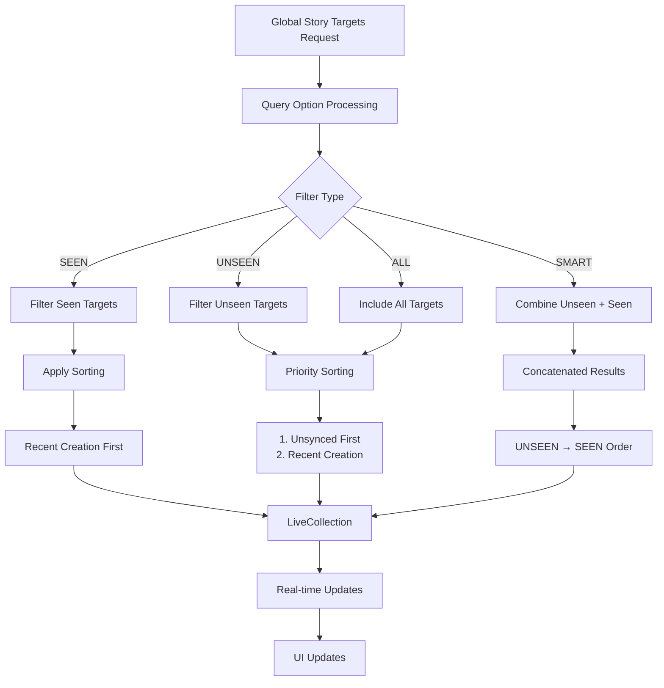

# Get Global Story Targets

Retrieve and observe global story targets with real-time updates, intelligent filtering, and optimized sorting for comprehensive story discovery across your application.

## Architecture Overview



## Feature Summary

<CardGroup cols={2}>
  <Card title="Smart Filtering" icon="filter">
    Filter story targets by seen/unseen status with intelligent prioritization
  </Card>
  <Card title="Real-time Updates" icon="bolt">
    LiveCollection provides instant updates when stories are created or viewed
  </Card>
  <Card title="Priority Sorting" icon="sort">
    Unsynced targets appear first, followed by recency-based sorting
  </Card>
  <Card title="Flexible Querying" icon="search">
    Multiple query options to match different UI requirements
  </Card>
</CardGroup>

## Query Options

The `getGlobalStoryTargets()` function retrieves all active story targets with non-expired stories. The resulting LiveCollection provides real-time updates on story creation per target.

### Query Option Types

<AccordionGroup>
  <Accordion title="SEEN">
    **Description:** Returns only story targets that don't have unseen stories
    
    **Filtering:** Excludes targets with unseen content
    
    **Sorting:** Recent creation first
    
    **Unsynced Targets:** Excluded from results
    
    **Use Case:** Show previously viewed content, "Catch up" sections
  </Accordion>
  
  <Accordion title="UNSEEN">
    **Description:** Returns only story targets that have unseen stories
    
    **Filtering:** Includes only targets with new content
    
    **Sorting:** Unsynced targets first, then recent creation
    
    **Unsynced Targets:** Included and prioritized
    
    **Use Case:** New content notifications, priority feeds
  </Accordion>
  
  <Accordion title="ALL">
    **Description:** Returns all active story targets regardless of seen status
    
    **Filtering:** No filtering applied
    
    **Sorting:** Unsynced targets first, then recent creation
    
    **Unsynced Targets:** Included and prioritized
    
    **Use Case:** Complete story overview, admin panels
  </Accordion>
  
  <Accordion title="SMART">
    **Description:** Intelligent combination of UNSEEN followed by SEEN results
    
    **Filtering:** Concatenated results in priority order
    
    **Sorting:** UNSEEN targets first, then SEEN targets
    
    **Unsynced Targets:** Included in UNSEEN section
    
    **Use Case:** Optimal user experience with new content prioritized
  </Accordion>
</AccordionGroup>

### Query Options Comparison

| Query Option | Filter | Sorting | Unsynced Targets | Best For |
|-------------|---------|---------|------------------|----------|
| **SEEN** | Only seen | Recent creation first | Excluded | Archive/History views |
| **UNSEEN** | Only unseen | 1. Unsynced first<br/>2. Recent creation | Included | New content feeds |
| **ALL** | None | 1. Unsynced first<br/>2. Recent creation | Included | Admin/Debug views |
| **SMART** | Combined | UNSEEN → SEEN order | Included | Main user feeds |

## Implementation

### Parameters

<AccordionGroup>
  <Accordion title="queryOption (required)">
    **Type:** `StoryTargetQueryOption`
    
    **Values:** `SEEN`, `UNSEEN`, `ALL`, `SMART`
    
    **Description:** Determines how the collection should be filtered and sorted
    
    **Default:** No default - must be specified
  </Accordion>
</AccordionGroup>

### Code Examples

<Tabs>
  <Tab title="iOS">
    <CodeGroup>
      ```swift Basic Implementation
      import AmitySDK
      
      class GlobalStoryTargetsManager {
          private var globalStoryTargets: AmityCollection<AmityStoryTarget>?
          private var token: AmityNotificationToken?
          
          func observeGlobalStoryTargets(option: AmityStoryTargetQueryOption) {
              globalStoryTargets = AmityManager.shared.client.getGlobalStoryTargets(queryOption: option)
              
              token = globalStoryTargets?.observe { [weak self] collection, change, error in
                  if let error = error {
                      self?.handleError(error)
                      return
                  }
                  
                  switch change {
                  case .initial:
                      self?.handleInitialLoad(collection)
                  case .update(let deletions, let insertions, let modifications):
                      self?.handleUpdates(deletions: deletions, insertions: insertions, modifications: modifications)
                  case .error(let error):
                      self?.handleError(error)
                  }
              }
          }
          
          private func handleInitialLoad(_ collection: AmityCollection<AmityStoryTarget>) {
              let targets = collection.allObjects()
              print("Loaded \(targets.count) story targets")
              
              // Update UI with initial data
              DispatchQueue.main.async {
                  self.updateUI(with: targets)
              }
          }
          
          private func handleUpdates(deletions: [IndexPath], insertions: [IndexPath], modifications: [IndexPath]) {
              DispatchQueue.main.async {
                  // Update UI with changes
                  self.applyUpdates(deletions: deletions, insertions: insertions, modifications: modifications)
              }
          }
          
          private func handleError(_ error: Error) {
              print("Error observing global story targets: \(error.localizedDescription)")
              // Handle error appropriately
          }
          
          deinit {
              token?.invalidate()
          }
      }
      ```

      ```swift Advanced Usage with UI Integration
      import AmitySDK
      import UIKit
      
      class StoryTargetsViewController: UIViewController {
          @IBOutlet weak var tableView: UITableView!
          @IBOutlet weak var segmentedControl: UISegmentedControl!
          
          private var storyTargetsManager = GlobalStoryTargetsManager()
          private var storyTargets: [AmityStoryTarget] = []
          
          override func viewDidLoad() {
              super.viewDidLoad()
              setupSegmentedControl()
              loadStoryTargets(option: .smart)
          }
          
          private func setupSegmentedControl() {
              segmentedControl.removeAllSegments()
              segmentedControl.insertSegment(withTitle: "Smart", at: 0, animated: false)
              segmentedControl.insertSegment(withTitle: "New", at: 1, animated: false)
              segmentedControl.insertSegment(withTitle: "All", at: 2, animated: false)
              segmentedControl.insertSegment(withTitle: "Seen", at: 3, animated: false)
              segmentedControl.selectedSegmentIndex = 0
          }
          
          @IBAction func segmentChanged(_ sender: UISegmentedControl) {
              let options: [AmityStoryTargetQueryOption] = [.smart, .unseen, .all, .seen]
              loadStoryTargets(option: options[sender.selectedSegmentIndex])
          }
          
          private func loadStoryTargets(option: AmityStoryTargetQueryOption) {
              storyTargetsManager.observeGlobalStoryTargets(option: option) { [weak self] targets in
                  self?.storyTargets = targets
                  self?.tableView.reloadData()
                  
                  // Update badge counts
                  self?.updateBadgeCounts()
              }
          }
          
          private func updateBadgeCounts() {
              let unseenCount = storyTargets.filter { $0.hasUnseenStories }.count
              
              // Update UI badges
              if unseenCount > 0 {
                  segmentedControl.setTitle("New (\(unseenCount))", forSegmentAt: 1)
              } else {
                  segmentedControl.setTitle("New", forSegmentAt: 1)
              }
          }
      }
      
      // MARK: - TableView DataSource
      extension StoryTargetsViewController: UITableViewDataSource {
          func tableView(_ tableView: UITableView, numberOfRowsInSection section: Int) -> Int {
              return storyTargets.count
          }
          
          func tableView(_ tableView: UITableView, cellForRowAt indexPath: IndexPath) -> UITableViewCell {
              let cell = tableView.dequeueReusableCell(withIdentifier: "StoryTargetCell", for: indexPath) as! StoryTargetCell
              
              let target = storyTargets[indexPath.row]
              cell.configure(with: target)
              
              return cell
          }
      }
      ```
    </CodeGroup>
  </Tab>
  
  <Tab title="Android">
    <CodeGroup>
      ```kotlin Basic Implementation
      import com.amity.socialcloud.sdk.AmityCoreClient
      import com.amity.socialcloud.sdk.story.query.AmityStoryTargetQueryOption
      import io.reactivex.rxjava3.disposables.CompositeDisposable
      
      class GlobalStoryTargetsManager {
          private val storyRepository = AmityCoreClient.newStoryRepository()
          private val disposables = CompositeDisposable()
          
          fun observeGlobalStoryTargets(
              option: AmityStoryTargetQueryOption,
              onResult: (List<AmityStoryTarget>) -> Unit,
              onError: (Throwable) -> Unit
          ) {
              val disposable = storyRepository.getGlobalStoryTargets(option)
                  .observeOn(AndroidSchedulers.mainThread())
                  .subscribeOn(Schedulers.io())
                  .subscribe(
                      { liveCollection ->
                          liveCollection.observe { targets ->
                              onResult(targets)
                          }
                      },
                      { error ->
                          onError(error)
                      }
                  )
              
              disposables.add(disposable)
          }
          
          fun cleanup() {
              disposables.clear()
          }
      }
      ```

      ```kotlin Advanced Usage with RecyclerView
      import com.amity.socialcloud.sdk.AmityCoreClient
      import com.amity.socialcloud.sdk.story.query.AmityStoryTargetQueryOption
      import androidx.recyclerview.widget.RecyclerView
      import androidx.lifecycle.ViewModel
      import androidx.lifecycle.MutableLiveData
      
      class StoryTargetsViewModel : ViewModel() {
          private val storyRepository = AmityCoreClient.newStoryRepository()
          private val disposables = CompositeDisposable()
          
          val storyTargets = MutableLiveData<List<AmityStoryTarget>>()
          val loading = MutableLiveData<Boolean>()
          val error = MutableLiveData<String>()
          
          fun loadStoryTargets(option: AmityStoryTargetQueryOption) {
              loading.value = true
              
              val disposable = storyRepository.getGlobalStoryTargets(option)
                  .subscribeOn(Schedulers.io())
                  .observeOn(AndroidSchedulers.mainThread())
                  .subscribe(
                      { liveCollection ->
                          liveCollection.observe { targets ->
                              storyTargets.value = targets
                              loading.value = false
                          }
                      },
                      { throwable ->
                          error.value = throwable.message ?: "Unknown error"
                          loading.value = false
                      }
                  )
              
              disposables.add(disposable)
          }
          
          override fun onCleared() {
              super.onCleared()
              disposables.clear()
          }
      }
      
      class StoryTargetsActivity : AppCompatActivity() {
          private lateinit var viewModel: StoryTargetsViewModel
          private lateinit var adapter: StoryTargetsAdapter
          private lateinit var binding: ActivityStoryTargetsBinding
          
          override fun onCreate(savedInstanceState: Bundle?) {
              super.onCreate(savedInstanceState)
              binding = ActivityStoryTargetsBinding.inflate(layoutInflater)
              setContentView(binding.root)
              
              setupViewModel()
              setupRecyclerView()
              setupSegmentedControl()
              
              // Load smart targets by default
              viewModel.loadStoryTargets(AmityStoryTargetQueryOption.SMART)
          }
          
          private fun setupViewModel() {
              viewModel = ViewModelProvider(this)[StoryTargetsViewModel::class.java]
              
              viewModel.storyTargets.observe(this) { targets ->
                  adapter.submitList(targets)
                  updateBadgeCounts(targets)
              }
              
              viewModel.loading.observe(this) { isLoading ->
                  binding.progressBar.isVisible = isLoading
              }
              
              viewModel.error.observe(this) { errorMessage ->
                  if (errorMessage != null) {
                      showErrorMessage(errorMessage)
                  }
              }
          }
          
          private fun setupSegmentedControl() {
              binding.segmentedControl.setOnCheckedChangeListener { _, checkedId ->
                  val option = when (checkedId) {
                      R.id.btn_smart -> AmityStoryTargetQueryOption.SMART
                      R.id.btn_unseen -> AmityStoryTargetQueryOption.UNSEEN
                      R.id.btn_all -> AmityStoryTargetQueryOption.ALL
                      R.id.btn_seen -> AmityStoryTargetQueryOption.SEEN
                      else -> AmityStoryTargetQueryOption.SMART
                  }
                  
                  viewModel.loadStoryTargets(option)
              }
          }
          
          private fun updateBadgeCounts(targets: List<AmityStoryTarget>) {
              val unseenCount = targets.count { it.hasUnseenStories() }
              
              binding.btnUnseen.text = if (unseenCount > 0) {
                  "New ($unseenCount)"
              } else {
                  "New"
              }
          }
      }
      ```
    </CodeGroup>
  </Tab>
  
  <Tab title="TypeScript">
    <CodeGroup>
      ```typescript Basic Implementation
      import { StoryRepository, StoryTargetQueryOption, StoryTarget } from '@amityco/ts-sdk';
      
      class GlobalStoryTargetsManager {
          private storyRepository: StoryRepository;
          private liveCollection: any;
          
          constructor() {
              this.storyRepository = new StoryRepository();
          }
          
          observeGlobalStoryTargets(
              option: StoryTargetQueryOption,
              onUpdate: (targets: StoryTarget[]) => void,
              onError: (error: Error) => void
          ) {
              try {
                  this.liveCollection = this.storyRepository.getGlobalStoryTargets(option);
                  
                  this.liveCollection.on('dataUpdated', (targets: StoryTarget[]) => {
                      onUpdate(targets);
                  });
                  
                  this.liveCollection.on('error', (error: Error) => {
                      onError(error);
                  });
              } catch (error) {
                  onError(error as Error);
              }
          }
          
          dispose() {
              if (this.liveCollection) {
                  this.liveCollection.dispose();
              }
          }
      }
      ```

      ```typescript React Hook Implementation
      import { useState, useEffect, useCallback } from 'react';
      import { StoryRepository, StoryTargetQueryOption, StoryTarget } from '@amityco/ts-sdk';
      
      interface UseGlobalStoryTargetsResult {
          storyTargets: StoryTarget[];
          loading: boolean;
          error: string | null;
          refetch: (option: StoryTargetQueryOption) => void;
      }
      
      export const useGlobalStoryTargets = (
          initialOption: StoryTargetQueryOption = StoryTargetQueryOption.SMART
      ): UseGlobalStoryTargetsResult => {
          const [storyTargets, setStoryTargets] = useState<StoryTarget[]>([]);
          const [loading, setLoading] = useState(true);
          const [error, setError] = useState<string | null>(null);
          const [manager] = useState(() => new GlobalStoryTargetsManager());
          
          const refetch = useCallback((option: StoryTargetQueryOption) => {
              setLoading(true);
              setError(null);
              
              manager.observeGlobalStoryTargets(
                  option,
                  (targets) => {
                      setStoryTargets(targets);
                      setLoading(false);
                  },
                  (error) => {
                      setError(error.message);
                      setLoading(false);
                  }
              );
          }, [manager]);
          
          useEffect(() => {
              refetch(initialOption);
              
              return () => {
                  manager.dispose();
              };
          }, [initialOption, refetch, manager]);
          
          return { storyTargets, loading, error, refetch };
      };
      
      // Usage in React component
      const StoryTargetsView: React.FC = () => {
          const [selectedOption, setSelectedOption] = useState(StoryTargetQueryOption.SMART);
          const { storyTargets, loading, error, refetch } = useGlobalStoryTargets(selectedOption);
          
          const handleOptionChange = (option: StoryTargetQueryOption) => {
              setSelectedOption(option);
              refetch(option);
          };
          
          const unseenCount = storyTargets.filter(target => target.hasUnseenStories).length;
          
          if (loading) return <div className="loading">Loading story targets...</div>;
          if (error) return <div className="error">Error: {error}</div>;
          
          return (
              <div className="story-targets-view">
                  <div className="filter-tabs">
                      <button 
                          className={selectedOption === StoryTargetQueryOption.SMART ? 'active' : ''}
                          onClick={() => handleOptionChange(StoryTargetQueryOption.SMART)}
                      >
                          Smart
                      </button>
                      <button 
                          className={selectedOption === StoryTargetQueryOption.UNSEEN ? 'active' : ''}
                          onClick={() => handleOptionChange(StoryTargetQueryOption.UNSEEN)}
                      >
                          New {unseenCount > 0 && `(${unseenCount})`}
                      </button>
                      <button 
                          className={selectedOption === StoryTargetQueryOption.ALL ? 'active' : ''}
                          onClick={() => handleOptionChange(StoryTargetQueryOption.ALL)}
                      >
                          All
                      </button>
                      <button 
                          className={selectedOption === StoryTargetQueryOption.SEEN ? 'active' : ''}
                          onClick={() => handleOptionChange(StoryTargetQueryOption.SEEN)}
                      >
                          Seen
                      </button>
                  </div>
                  
                  <div className="story-targets-list">
                      {storyTargets.map(target => (
                          <StoryTargetCard 
                              key={target.id}
                              target={target}
                              showUnseenIndicator={target.hasUnseenStories}
                          />
                      ))}
                  </div>
              </div>
          );
      };
      ```
    </CodeGroup>
  </Tab>
  
  <Tab title="Flutter">
    <CodeGroup>
      ```dart Basic Implementation
      import 'package:amity_sdk/amity_sdk.dart';
      
      class GlobalStoryTargetsManager {
          final AmityStoryRepository _storyRepository = AmityStoryRepository();
          AmityLiveCollection<AmityStoryTarget>? _liveCollection;
          StreamSubscription? _subscription;
          
          void observeGlobalStoryTargets(
              AmityStoryTargetQueryOption option,
              Function(List<AmityStoryTarget>) onUpdate,
              Function(AmityException) onError,
          ) {
              try {
                  _liveCollection = _storyRepository.getGlobalStoryTargets(option);
                  
                  _subscription = _liveCollection!.stream.listen(
                      (targets) => onUpdate(targets),
                      onError: (error) => onError(error as AmityException),
                  );
              } catch (error) {
                  onError(AmityException.fromError(error));
              }
          }
          
          void dispose() {
              _subscription?.cancel();
              _liveCollection?.dispose();
          }
      }
      ```

      ```dart Provider Implementation
      import 'package:flutter/material.dart';
      import 'package:provider/provider.dart';
      import 'package:amity_sdk/amity_sdk.dart';
      
      class GlobalStoryTargetsProvider extends ChangeNotifier {
          final GlobalStoryTargetsManager _manager = GlobalStoryTargetsManager();
          
          List<AmityStoryTarget> _storyTargets = [];
          bool _loading = false;
          String? _error;
          AmityStoryTargetQueryOption _currentOption = AmityStoryTargetQueryOption.SMART;
          
          List<AmityStoryTarget> get storyTargets => _storyTargets;
          bool get loading => _loading;
          String? get error => _error;
          AmityStoryTargetQueryOption get currentOption => _currentOption;
          
          void loadStoryTargets(AmityStoryTargetQueryOption option) {
              _currentOption = option;
              _loading = true;
              _error = null;
              notifyListeners();
              
              _manager.observeGlobalStoryTargets(
                  option,
                  (targets) {
                      _storyTargets = targets;
                      _loading = false;
                      notifyListeners();
                  },
                  (error) {
                      _error = error.message;
                      _loading = false;
                      notifyListeners();
                  },
              );
          }
          
          int get unseenCount => _storyTargets.where((target) => target.hasUnseenStories).length;
          
          @override
          void dispose() {
              _manager.dispose();
              super.dispose();
          }
      }
      
      class StoryTargetsView extends StatefulWidget {
          @override
          _StoryTargetsViewState createState() => _StoryTargetsViewState();
      }
      
      class _StoryTargetsViewState extends State<StoryTargetsView> with SingleTickerProviderStateMixin {
          late TabController _tabController;
          
          final List<AmityStoryTargetQueryOption> _options = [
              AmityStoryTargetQueryOption.SMART,
              AmityStoryTargetQueryOption.UNSEEN,
              AmityStoryTargetQueryOption.ALL,
              AmityStoryTargetQueryOption.SEEN,
          ];
          
          final List<String> _tabTitles = ['Smart', 'New', 'All', 'Seen'];
          
          @override
          void initState() {
              super.initState();
              _tabController = TabController(length: _tabTitles.length, vsync: this);
              
              // Load initial data
              WidgetsBinding.instance.addPostFrameCallback((_) {
                  context.read<GlobalStoryTargetsProvider>().loadStoryTargets(_options[0]);
              });
          }
          
          @override
          Widget build(BuildContext context) {
              return Scaffold(
                  appBar: AppBar(
                      title: const Text('Story Targets'),
                      bottom: TabBar(
                          controller: _tabController,
                          onTap: (index) {
                              context.read<GlobalStoryTargetsProvider>().loadStoryTargets(_options[index]);
                          },
                          tabs: _buildTabs(),
                      ),
                  ),
                  body: Consumer<GlobalStoryTargetsProvider>(
                      builder: (context, provider, child) {
                          if (provider.loading) {
                              return const Center(child: CircularProgressIndicator());
                          }
                          
                          if (provider.error != null) {
                              return Center(
                                  child: Column(
                                      mainAxisAlignment: MainAxisAlignment.center,
                                      children: [
                                          Text('Error: ${provider.error}'),
                                          ElevatedButton(
                                              onPressed: () {
                                                  provider.loadStoryTargets(provider.currentOption);
                                              },
                                              child: const Text('Retry'),
                                          ),
                                      ],
                                  ),
                              );
                          }
                          
                          return ListView.builder(
                              itemCount: provider.storyTargets.length,
                              itemBuilder: (context, index) {
                                  final target = provider.storyTargets[index];
                                  return StoryTargetCard(
                                      target: target,
                                      showUnseenIndicator: target.hasUnseenStories,
                                  );
                              },
                          );
                      },
                  ),
              );
          }
          
          List<Widget> _buildTabs() {
              return _tabTitles.asMap().entries.map((entry) {
                  final index = entry.key;
                  final title = entry.value;
                  
                  return Consumer<GlobalStoryTargetsProvider>(
                      builder: (context, provider, child) {
                          String tabTitle = title;
                          
                          // Add badge count for "New" tab
                          if (index == 1 && provider.unseenCount > 0) {
                              tabTitle = '$title (${provider.unseenCount})';
                          }
                          
                          return Tab(text: tabTitle);
                      },
                  );
              }).toList();
          }
          
          @override
          void dispose() {
              _tabController.dispose();
              super.dispose();
          }
      }
      ```
    </CodeGroup>
  </Tab>
</Tabs>

## Best Practices

<AccordionGroup>
  <Accordion title="Query Option Selection">
    **Choose the Right Option for Your Use Case**
    
    - **SMART**: Best for main feeds where you want to prioritize new content
    - **UNSEEN**: Perfect for notification badges and new content indicators
    - **SEEN**: Ideal for "Previously viewed" or archive sections
    - **ALL**: Useful for admin interfaces or complete overviews
    
    ```typescript
    // Example usage patterns
    class StoryFeedStrategy {
        static getQueryOption(feedType: string): StoryTargetQueryOption {
            switch (feedType) {
                case 'main-feed':
                    return StoryTargetQueryOption.SMART;
                case 'notifications':
                    return StoryTargetQueryOption.UNSEEN;
                case 'archive':
                    return StoryTargetQueryOption.SEEN;
                case 'admin':
                    return StoryTargetQueryOption.ALL;
                default:
                    return StoryTargetQueryOption.SMART;
            }
        }
    }
    ```
  </Accordion>
  
  <Accordion title="Performance Optimization">
    **Efficient Real-time Updates**
    
    - Use LiveCollection for automatic updates instead of polling
    - Implement proper disposal/cleanup to prevent memory leaks
    - Cache frequently accessed data to reduce API calls
    - Use virtualization for large lists
    
    ```typescript
    class OptimizedStoryTargetsManager {
        private cache = new Map<string, StoryTarget[]>();
        private readonly CACHE_DURATION = 5 * 60 * 1000; // 5 minutes
        
        async getStoryTargets(option: StoryTargetQueryOption): Promise<StoryTarget[]> {
            const cacheKey = `targets_${option}`;
            const cached = this.cache.get(cacheKey);
            
            if (cached && this.isCacheValid(cacheKey)) {
                return cached;
            }
            
            // Fetch fresh data and update cache
            const targets = await this.fetchStoryTargets(option);
            this.cache.set(cacheKey, targets);
            
            return targets;
        }
    }
    ```
  </Accordion>
  
  <Accordion title="UI/UX Considerations">
    **Enhance User Experience**
    
    - Show loading states during data fetching
    - Implement pull-to-refresh functionality
    - Display badge counts for unseen content
    - Provide filter options with clear labels
    
    ```typescript
    const StoryTargetsUI: React.FC = () => {
        const [refreshing, setRefreshing] = useState(false);
        const { storyTargets, loading, refetch } = useGlobalStoryTargets();
        
        const handleRefresh = async () => {
            setRefreshing(true);
            try {
                await refetch(StoryTargetQueryOption.SMART);
            } finally {
                setRefreshing(false);
            }
        };
        
        return (
            <div className="story-targets-container">
                {loading && <LoadingSpinner />}
                <PullToRefresh onRefresh={handleRefresh} refreshing={refreshing}>
                    <StoryTargetsList targets={storyTargets} />
                </PullToRefresh>
            </div>
        );
    };
    ```
  </Accordion>
  
  <Accordion title="Error Handling">
    **Robust Error Management**
    
    - Handle network failures gracefully
    - Provide retry mechanisms for failed requests
    - Show meaningful error messages to users
    - Log errors for debugging and monitoring
    
    ```typescript
    class StoryTargetsErrorHandler {
        static handleError(error: Error, context: string): string {
            console.error(`Story targets error in ${context}:`, error);
            
            if (error.message.includes('network')) {
                return 'Network error. Please check your connection and try again.';
            }
            
            if (error.message.includes('unauthorized')) {
                return 'Access denied. Please log in again.';
            }
            
            return 'Something went wrong. Please try again later.';
        }
    }
    ```
  </Accordion>
</AccordionGroup>

## Use Cases

<CardGroup cols={2}>
  <Card title="Main Story Feed" icon="home">
    **Scenario:** Primary story discovery interface
    
    **Approach:** Use SMART option for optimal user experience
    
    **Implementation:** Prioritize new content while showing previously viewed stories
  </Card>
  
  <Card title="Notification System" icon="bell">
    **Scenario:** Alert users to new story content
    
    **Approach:** Use UNSEEN option with badge counts
    
    **Implementation:** Real-time updates with visual indicators
  </Card>
  
  <Card title="Archive/History View" icon="archive">
    **Scenario:** Show previously viewed content
    
    **Approach:** Use SEEN option for clean separation
    
    **Implementation:** Chronological listing with search functionality
  </Card>
  
  <Card title="Admin Dashboard" icon="chart-bar">
    **Scenario:** Content management and analytics
    
    **Approach:** Use ALL option for complete overview
    
    **Implementation:** Comprehensive view with filtering and sorting options
  </Card>
</CardGroup>

## Advanced Features

### Real-time Badge Updates

```typescript
class StoryBadgeManager {
    private unseenCounts = new Map<string, number>();
    
    updateBadges(targets: StoryTarget[]) {
        const totalUnseen = targets.filter(t => t.hasUnseenStories).length;
        
        // Update app badge
        this.updateAppBadge(totalUnseen);
        
        // Update individual target counts
        targets.forEach(target => {
            if (target.hasUnseenStories) {
                this.unseenCounts.set(target.id, target.unseenStoriesCount);
            } else {
                this.unseenCounts.delete(target.id);
            }
        });
        
        // Notify UI components
        this.emit('badgeUpdated', {
            total: totalUnseen,
            targets: this.unseenCounts
        });
    }
}
```

### Smart Prefetching

```typescript
class StoryPrefetchManager {
    async prefetchStoryContent(targets: StoryTarget[]) {
        const unseenTargets = targets.filter(t => t.hasUnseenStories);
        
        // Prefetch stories for unseen targets
        for (const target of unseenTargets.slice(0, 5)) { // Limit prefetch
            try {
                await this.prefetchTargetStories(target.id);
            } catch (error) {
                console.warn(`Failed to prefetch stories for target ${target.id}:`, error);
            }
        }
    }
}
```

<Note>
**Real-time Updates:** The LiveCollection automatically updates when stories are created, viewed, or deleted, ensuring your UI stays synchronized with the latest data.
</Note>

<Info>
**Performance Tip:** Unsynced story targets (those with stories in 'syncing' or 'failed' states) are automatically prioritized in UNSEEN, ALL, and SMART query options to help users manage content that needs attention.
</Info>