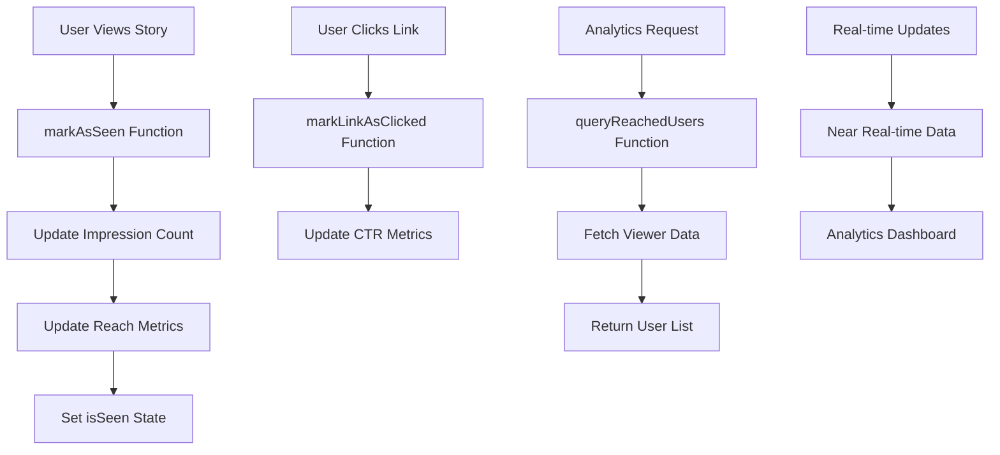

# Story Impressions

The Story Impressions feature provides comprehensive analytics and engagement tracking for story content. This powerful tool enables developers to collect detailed interaction data, track user engagement patterns, and implement sophisticated analytics solutions for story-based features.

## Architecture Overview



## Key Features

<CardGroup cols={2}>
  <Card title="Impression Tracking" icon="eye">
    Track story views and engagement metrics with precise impression counting
  </Card>
  <Card title="Reach Analytics" icon="users">
    Monitor unique user reach and audience engagement patterns
  </Card>
  <Card title="Link Engagement" icon="link">
    Measure click-through rates and link interaction analytics
  </Card>
  <Card title="User Analytics" icon="chart-bar">
    Query detailed viewer data and engagement insights
  </Card>
</CardGroup>

<Info>
**Data Timing**: Story impression data is updated in near real-time rather than real-time. Impressions represent total views, while reach represents unique user views.
</Info>

## Mark Story as Seen

The `markAsSeen()` function increases impression and reach counts for specific stories while immediately updating the story's 'isSeen' state. This function is essential for accurate analytics and user experience tracking.

<Note>
**Sync Requirement**: Stories must be in "SYNCED" state before they can be marked as seen.
</Note>

### Parameters

<AccordionGroup>
  <Accordion title="storyId">
    **Type:** `string`
    
    **Required:** Yes
    
    **Description:** Unique identifier for the story to mark as seen. Must correspond to a story in SYNCED state.
  </Accordion>
  <Accordion title="callback">
    **Type:** `Function`
    
    **Required:** No
    
    **Description:** Optional callback function to handle success/error responses from the impression tracking.
  </Accordion>
</AccordionGroup>

### Implementation

<Tabs>
  <Tab title="iOS">
    <CodeGroup>
      ```swift Basic Example
      import AmitySDK
      
      class StoryImpressionManager {
          func markStoryAsSeen(storyId: String) {
              AmityManager.shared.client.markAsSeen(
                  storyId: storyId
              ) { [weak self] success, error in
                  if success {
                      print("Story marked as seen successfully")
                      // Update UI to reflect seen state
                      self?.updateStoryUI(storyId: storyId, isSeen: true)
                  } else {
                      print("Failed to mark story as seen: \(error?.localizedDescription ?? "Unknown error")")
                  }
              }
          }
          
          private func updateStoryUI(storyId: String, isSeen: Bool) {
              // Update story UI state
              DispatchQueue.main.async {
                  // Implement UI updates
              }
          }
      }
      ```
      
      ```swift Advanced Example with Validation
      import AmitySDK
      
      class AdvancedStoryImpressionManager {
          private var impressionCache: Set<String> = []
          
          func markStoryAsSeenWithValidation(storyId: String, story: AmityStory) {
              // Validate story state before marking as seen
              guard story.syncState == .synced else {
                  print("Story must be in SYNCED state to mark as seen")
                  return
              }
              
              // Prevent duplicate impressions
              guard !impressionCache.contains(storyId) else {
                  print("Story already marked as seen")
                  return
              }
              
              AmityManager.shared.client.markAsSeen(
                  storyId: storyId
              ) { [weak self] success, error in
                  if success {
                      // Cache the impression to prevent duplicates
                      self?.impressionCache.insert(storyId)
                      
                      // Track analytics
                      self?.trackStoryImpression(storyId: storyId)
                      
                      // Update UI
                      DispatchQueue.main.async {
                          self?.updateStorySeenState(storyId: storyId)
                      }
                  } else {
                      self?.handleImpressionError(error: error)
                  }
              }
          }
          
          private func trackStoryImpression(storyId: String) {
              // Custom analytics tracking
              AnalyticsManager.shared.track(event: "story_impression", parameters: [
                  "story_id": storyId,
                  "timestamp": Date().timeIntervalSince1970
              ])
          }
          
          private func handleImpressionError(error: Error?) {
              // Implement error handling and retry logic
              print("Impression tracking failed: \(error?.localizedDescription ?? "Unknown error")")
          }
      }
      ```
    </CodeGroup>
  </Tab>
  <Tab title="Android">
    <CodeGroup>
      ```kotlin Basic Example
      import com.amity.socialcloud.sdk.AmityCoreClient
      
      class StoryImpressionManager {
          fun markStoryAsSeen(storyId: String) {
              AmityCoreClient.newStoryRepository()
                  .markAsSeen(storyId)
                  .subscribe({ success ->
                      if (success) {
                          println("Story marked as seen successfully")
                          // Update UI to reflect seen state
                          updateStoryUI(storyId, true)
                      }
                  }, { error ->
                      println("Failed to mark story as seen: ${error.message}")
                  })
          }
          
          private fun updateStoryUI(storyId: String, isSeen: Boolean) {
              // Update story UI state on main thread
              runOnUiThread {
                  // Implement UI updates
              }
          }
      }
      ```
      
      ```kotlin Advanced Example with RxJava
      import com.amity.socialcloud.sdk.AmityCoreClient
      import io.reactivex.rxjava3.android.schedulers.AndroidSchedulers
      import io.reactivex.rxjava3.schedulers.Schedulers
      import io.reactivex.rxjava3.disposables.CompositeDisposable
      
      class AdvancedStoryImpressionManager {
          private val compositeDisposable = CompositeDisposable()
          private val impressionCache = mutableSetOf<String>()
          
          fun markStoryAsSeenWithValidation(storyId: String, story: AmityStory) {
              // Validate story state
              if (story.syncState != AmitySyncState.SYNCED) {
                  println("Story must be in SYNCED state to mark as seen")
                  return
              }
              
              // Prevent duplicate impressions
              if (impressionCache.contains(storyId)) {
                  println("Story already marked as seen")
                  return
              }
              
              val disposable = AmityCoreClient.newStoryRepository()
                  .markAsSeen(storyId)
                  .subscribeOn(Schedulers.io())
                  .observeOn(AndroidSchedulers.mainThread())
                  .subscribe({ success ->
                      if (success) {
                          // Cache the impression
                          impressionCache.add(storyId)
                          
                          // Track analytics
                          trackStoryImpression(storyId)
                          
                          // Update UI
                          updateStorySeenState(storyId)
                      }
                  }, { error ->
                      handleImpressionError(error)
                  })
              
              compositeDisposable.add(disposable)
          }
          
          private fun trackStoryImpression(storyId: String) {
              // Custom analytics tracking
              AnalyticsManager.track("story_impression", mapOf(
                  "story_id" to storyId,
                  "timestamp" to System.currentTimeMillis()
              ))
          }
          
          private fun handleImpressionError(error: Throwable) {
              println("Impression tracking failed: ${error.message}")
              // Implement retry logic if needed
          }
          
          fun cleanup() {
              compositeDisposable.clear()
          }
      }
      ```
    </CodeGroup>
  </Tab>
  <Tab title="TypeScript">
    <CodeGroup>
      ```typescript Basic Example
      import { StoryRepository } from '@amityco/ts-sdk';
      
      class StoryImpressionManager {
          private storyRepository: StoryRepository;
          
          constructor() {
              this.storyRepository = new StoryRepository();
          }
          
          async markStoryAsSeen(storyId: string): Promise<void> {
              try {
                  const success = await this.storyRepository.markAsSeen(storyId);
                  
                  if (success) {
                      console.log('Story marked as seen successfully');
                      // Update UI to reflect seen state
                      this.updateStoryUI(storyId, true);
                  }
              } catch (error) {
                  console.error('Failed to mark story as seen:', error);
              }
          }
          
          private updateStoryUI(storyId: string, isSeen: boolean): void {
              // Update story UI state
              // Implement UI updates
          }
      }
      ```
      
      ```typescript React Hook Example
      import { useState, useCallback } from 'react';
      import { StoryRepository, Story, SyncState } from '@amityco/ts-sdk';
      
      interface UseStoryImpressionResult {
          markAsSeen: (storyId: string, story: Story) => Promise<void>;
          isProcessing: boolean;
          error: string | null;
      }
      
      export const useStoryImpression = (): UseStoryImpressionResult => {
          const [isProcessing, setIsProcessing] = useState(false);
          const [error, setError] = useState<string | null>(null);
          const [impressionCache] = useState(new Set<string>());
          
          const markAsSeen = useCallback(async (storyId: string, story: Story) => {
              // Validate story state
              if (story.syncState !== SyncState.SYNCED) {
                  setError('Story must be in SYNCED state to mark as seen');
                  return;
              }
              
              // Prevent duplicate impressions
              if (impressionCache.has(storyId)) {
                  console.log('Story already marked as seen');
                  return;
              }
              
              setIsProcessing(true);
              setError(null);
              
              try {
                  const storyRepository = new StoryRepository();
                  const success = await storyRepository.markAsSeen(storyId);
                  
                  if (success) {
                      // Cache the impression
                      impressionCache.add(storyId);
                      
                      // Track analytics
                      trackStoryImpression(storyId);
                      
                      console.log('Story marked as seen successfully');
                  }
              } catch (err) {
                  const errorMessage = err instanceof Error ? err.message : 'Unknown error';
                  setError(errorMessage);
                  console.error('Failed to mark story as seen:', err);
              } finally {
                  setIsProcessing(false);
              }
          }, [impressionCache]);
          
          return {
              markAsSeen,
              isProcessing,
              error
          };
      };
      
      // Helper function for analytics
      const trackStoryImpression = (storyId: string): void => {
          // Custom analytics tracking
          if (typeof window !== 'undefined' && window.analytics) {
              window.analytics.track('Story Impression', {
                  storyId,
                  timestamp: Date.now()
              });
          }
      };
      ```
    </CodeGroup>
  </Tab>
  <Tab title="Flutter">
    <CodeGroup>
      ```dart Basic Example
      import 'package:amity_sdk/amity_sdk.dart';
      
      class StoryImpressionManager {
          Future<void> markStoryAsSeen(String storyId) async {
              try {
                  final success = await AmitySocialClient.newStoryRepository()
                      .markAsSeen(storyId);
                  
                  if (success) {
                      print('Story marked as seen successfully');
                      // Update UI to reflect seen state
                      _updateStoryUI(storyId, true);
                  }
              } catch (error) {
                  print('Failed to mark story as seen: $error');
              }
          }
          
          void _updateStoryUI(String storyId, bool isSeen) {
              // Update story UI state
              // Implement UI updates
          }
      }
      ```
      
      ```dart Provider Example
      import 'package:flutter/material.dart';
      import 'package:amity_sdk/amity_sdk.dart';
      
      class StoryImpressionProvider extends ChangeNotifier {
          final Set<String> _impressionCache = <String>{};
          bool _isProcessing = false;
          String? _error;
          
          bool get isProcessing => _isProcessing;
          String? get error => _error;
          
          Future<void> markStoryAsSeenWithValidation(
              String storyId, 
              AmityStory story
          ) async {
              // Validate story state
              if (story.syncState != AmitySyncState.synced) {
                  _error = 'Story must be in SYNCED state to mark as seen';
                  notifyListeners();
                  return;
              }
              
              // Prevent duplicate impressions
              if (_impressionCache.contains(storyId)) {
                  print('Story already marked as seen');
                  return;
              }
              
              _isProcessing = true;
              _error = null;
              notifyListeners();
              
              try {
                  final success = await AmitySocialClient.newStoryRepository()
                      .markAsSeen(storyId);
                  
                  if (success) {
                      // Cache the impression
                      _impressionCache.add(storyId);
                      
                      // Track analytics
                      _trackStoryImpression(storyId);
                      
                      print('Story marked as seen successfully');
                  }
              } catch (error) {
                  _error = error.toString();
                  print('Failed to mark story as seen: $error');
              } finally {
                  _isProcessing = false;
                  notifyListeners();
              }
          }
          
          void _trackStoryImpression(String storyId) {
              // Custom analytics tracking
              // Implement analytics tracking
          }
          
          void clearError() {
              _error = null;
              notifyListeners();
          }
      }
      ```
    </CodeGroup>
  </Tab>
</Tabs>

## Mark Link as Clicked

The `markLinkAsClicked()` function tracks link engagement within stories, increasing the click-through rate (CTR) metrics for analytics and performance monitoring. This function is essential for measuring story content effectiveness and user engagement with embedded links.

<Note>
**Sync Requirement**: Stories must be in "SYNCED" state before link clicks can be tracked.
</Note>

### Parameters

<AccordionGroup>
  <Accordion title="storyId">
    **Type:** `string`
    
    **Required:** Yes
    
    **Description:** Unique identifier for the story containing the clicked link. Must correspond to a story in SYNCED state.
  </Accordion>
  <Accordion title="linkUrl">
    **Type:** `string`
    
    **Required:** Yes
    
    **Description:** The URL of the link that was clicked within the story content.
  </Accordion>
  <Accordion title="callback">
    **Type:** `Function`
    
    **Required:** No
    
    **Description:** Optional callback function to handle success/error responses from the link tracking.
  </Accordion>
</AccordionGroup>

### Implementation

<Tabs>
  <Tab title="iOS">
    <CodeGroup>
      ```swift Basic Example
      import AmitySDK
      
      class StoryLinkTracker {
          func markLinkAsClicked(storyId: String, linkUrl: String) {
              AmityManager.shared.client.markLinkAsClicked(
                  storyId: storyId,
                  linkUrl: linkUrl
              ) { [weak self] success, error in
                  if success {
                      print("Link click tracked successfully")
                      // Track additional analytics
                      self?.trackLinkEngagement(storyId: storyId, linkUrl: linkUrl)
                  } else {
                      print("Failed to track link click: \(error?.localizedDescription ?? "Unknown error")")
                  }
              }
          }
          
          private func trackLinkEngagement(storyId: String, linkUrl: String) {
              // Custom analytics for link engagement
              AnalyticsManager.shared.track(event: "story_link_click", parameters: [
                  "story_id": storyId,
                  "link_url": linkUrl,
                  "timestamp": Date().timeIntervalSince1970
              ])
          }
      }
      ```
      
      ```swift Advanced Example with URL Validation
      import AmitySDK
      import Foundation
      
      class AdvancedStoryLinkTracker {
          private var clickCache: Set<String> = []
          
          func markLinkAsClickedWithValidation(storyId: String, linkUrl: String, story: AmityStory) {
              // Validate story state
              guard story.syncState == .synced else {
                  print("Story must be in SYNCED state to track link clicks")
                  return
              }
              
              // Validate URL format
              guard isValidURL(linkUrl) else {
                  print("Invalid URL format")
                  return
              }
              
              // Create unique identifier for this click
              let clickId = "\(storyId)_\(linkUrl)"
              
              // Prevent duplicate tracking within short time window
              guard !clickCache.contains(clickId) else {
                  print("Link click already tracked recently")
                  return
              }
              
              AmityManager.shared.client.markLinkAsClicked(
                  storyId: storyId,
                  linkUrl: linkUrl
              ) { [weak self] success, error in
                  if success {
                      // Cache the click to prevent duplicates
                      self?.clickCache.insert(clickId)
                      
                      // Remove from cache after delay
                      DispatchQueue.main.asyncAfter(deadline: .now() + 5.0) {
                          self?.clickCache.remove(clickId)
                      }
                      
                      // Track comprehensive analytics
                      self?.trackDetailedLinkEngagement(storyId: storyId, linkUrl: linkUrl, story: story)
                      
                  } else {
                      self?.handleLinkTrackingError(error: error, storyId: storyId, linkUrl: linkUrl)
                  }
              }
          }
          
          private func isValidURL(_ urlString: String) -> Bool {
              guard let url = URL(string: urlString) else { return false }
              return UIApplication.shared.canOpenURL(url)
          }
          
          private func trackDetailedLinkEngagement(storyId: String, linkUrl: String, story: AmityStory) {
              AnalyticsManager.shared.track(event: "story_link_engagement", parameters: [
                  "story_id": storyId,
                  "link_url": linkUrl,
                  "story_creator": story.creatorId,
                  "story_type": story.dataType.rawValue,
                  "timestamp": Date().timeIntervalSince1970
              ])
          }
      }
      ```
    </CodeGroup>
  </Tab>
  <Tab title="Android">
    <CodeGroup>
      ```kotlin Basic Example
      import com.amity.socialcloud.sdk.AmityCoreClient
      
      class StoryLinkTracker {
          fun markLinkAsClicked(storyId: String, linkUrl: String) {
              AmityCoreClient.newStoryRepository()
                  .markLinkAsClicked(storyId, linkUrl)
                  .subscribe({ success ->
                      if (success) {
                          println("Link click tracked successfully")
                          // Track additional analytics
                          trackLinkEngagement(storyId, linkUrl)
                      }
                  }, { error ->
                      println("Failed to track link click: ${error.message}")
                  })
          }
          
          private fun trackLinkEngagement(storyId: String, linkUrl: String) {
              // Custom analytics for link engagement
              AnalyticsManager.track("story_link_click", mapOf(
                  "story_id" to storyId,
                  "link_url" to linkUrl,
                  "timestamp" to System.currentTimeMillis()
              ))
          }
      }
      ```
      
      ```kotlin Advanced Example with Validation
      import com.amity.socialcloud.sdk.AmityCoreClient
      import android.webkit.URLUtil
      import io.reactivex.rxjava3.android.schedulers.AndroidSchedulers
      import io.reactivex.rxjava3.schedulers.Schedulers
      import io.reactivex.rxjava3.disposables.CompositeDisposable
      
      class AdvancedStoryLinkTracker {
          private val compositeDisposable = CompositeDisposable()
          private val clickCache = mutableSetOf<String>()
          
          fun markLinkAsClickedWithValidation(storyId: String, linkUrl: String, story: AmityStory) {
              // Validate story state
              if (story.syncState != AmitySyncState.SYNCED) {
                  println("Story must be in SYNCED state to track link clicks")
                  return
              }
              
              // Validate URL
              if (!URLUtil.isValidUrl(linkUrl)) {
                  println("Invalid URL format")
                  return
              }
              
              // Create unique identifier
              val clickId = "${storyId}_$linkUrl"
              
              // Prevent duplicate tracking
              if (clickCache.contains(clickId)) {
                  println("Link click already tracked recently")
                  return
              }
              
              val disposable = AmityCoreClient.newStoryRepository()
                  .markLinkAsClicked(storyId, linkUrl)
                  .subscribeOn(Schedulers.io())
                  .observeOn(AndroidSchedulers.mainThread())
                  .subscribe({ success ->
                      if (success) {
                          // Cache the click
                          clickCache.add(clickId)
                          
                          // Remove from cache after delay
                          Handler(Looper.getMainLooper()).postDelayed({
                              clickCache.remove(clickId)
                          }, 5000)
                          
                          // Track comprehensive analytics
                          trackDetailedLinkEngagement(storyId, linkUrl, story)
                      }
                  }, { error ->
                      handleLinkTrackingError(error, storyId, linkUrl)
                  })
              
              compositeDisposable.add(disposable)
          }
          
          private fun trackDetailedLinkEngagement(storyId: String, linkUrl: String, story: AmityStory) {
              AnalyticsManager.track("story_link_engagement", mapOf(
                  "story_id" to storyId,
                  "link_url" to linkUrl,
                  "story_creator" to story.creatorId,
                  "story_type" to story.dataType.name,
                  "timestamp" to System.currentTimeMillis()
              ))
          }
          
          fun cleanup() {
              compositeDisposable.clear()
          }
      }
      ```
    </CodeGroup>
  </Tab>
  <Tab title="TypeScript">
    <CodeGroup>
      ```typescript Basic Example
      import { StoryRepository } from '@amityco/ts-sdk';
      
      class StoryLinkTracker {
          private storyRepository: StoryRepository;
          
          constructor() {
              this.storyRepository = new StoryRepository();
          }
          
          async markLinkAsClicked(storyId: string, linkUrl: string): Promise<void> {
              try {
                  const success = await this.storyRepository.markLinkAsClicked(storyId, linkUrl);
                  
                  if (success) {
                      console.log('Link click tracked successfully');
                      // Track additional analytics
                      this.trackLinkEngagement(storyId, linkUrl);
                  }
              } catch (error) {
                  console.error('Failed to track link click:', error);
              }
          }
          
          private trackLinkEngagement(storyId: string, linkUrl: string): void {
              // Custom analytics for link engagement
              if (typeof window !== 'undefined' && window.analytics) {
                  window.analytics.track('Story Link Click', {
                      storyId,
                      linkUrl,
                      timestamp: Date.now()
                  });
              }
          }
      }
      ```
      
      ```typescript React Hook Example
      import { useState, useCallback } from 'react';
      import { StoryRepository, Story, SyncState } from '@amityco/ts-sdk';
      
      interface UseStoryLinkTrackingResult {
          markLinkAsClicked: (storyId: string, linkUrl: string, story: Story) => Promise<void>;
          isProcessing: boolean;
          error: string | null;
      }
      
      export const useStoryLinkTracking = (): UseStoryLinkTrackingResult => {
          const [isProcessing, setIsProcessing] = useState(false);
          const [error, setError] = useState<string | null>(null);
          const [clickCache] = useState(new Set<string>());
          
          const isValidUrl = (url: string): boolean => {
              try {
                  new URL(url);
                  return true;
              } catch {
                  return false;
              }
          };
          
          const markLinkAsClicked = useCallback(async (
              storyId: string, 
              linkUrl: string, 
              story: Story
          ) => {
              // Validate story state
              if (story.syncState !== SyncState.SYNCED) {
                  setError('Story must be in SYNCED state to track link clicks');
                  return;
              }
              
              // Validate URL
              if (!isValidUrl(linkUrl)) {
                  setError('Invalid URL format');
                  return;
              }
              
              // Create unique identifier
              const clickId = `${storyId}_${linkUrl}`;
              
              // Prevent duplicate tracking
              if (clickCache.has(clickId)) {
                  console.log('Link click already tracked recently');
                  return;
              }
              
              setIsProcessing(true);
              setError(null);
              
              try {
                  const storyRepository = new StoryRepository();
                  const success = await storyRepository.markLinkAsClicked(storyId, linkUrl);
                  
                  if (success) {
                      // Cache the click
                      clickCache.add(clickId);
                      
                      // Remove from cache after delay
                      setTimeout(() => {
                          clickCache.delete(clickId);
                      }, 5000);
                      
                      // Track comprehensive analytics
                      trackDetailedLinkEngagement(storyId, linkUrl, story);
                      
                      console.log('Link click tracked successfully');
                  }
              } catch (err) {
                  const errorMessage = err instanceof Error ? err.message : 'Unknown error';
                  setError(errorMessage);
                  console.error('Failed to track link click:', err);
              } finally {
                  setIsProcessing(false);
              }
          }, [clickCache]);
          
          return {
              markLinkAsClicked,
              isProcessing,
              error
          };
      };
      
      // Helper function for detailed analytics
      const trackDetailedLinkEngagement = (storyId: string, linkUrl: string, story: Story): void => {
          if (typeof window !== 'undefined' && window.analytics) {
              window.analytics.track('Story Link Engagement', {
                  storyId,
                  linkUrl,
                  storyCreator: story.creatorId,
                  storyType: story.dataType,
                  timestamp: Date.now()
              });
          }
      };
      ```
    </CodeGroup>
  </Tab>
  <Tab title="Flutter">
    <CodeGroup>
      ```dart Basic Example
      import 'package:amity_sdk/amity_sdk.dart';
      
      class StoryLinkTracker {
          Future<void> markLinkAsClicked(String storyId, String linkUrl) async {
              try {
                  final success = await AmitySocialClient.newStoryRepository()
                      .markLinkAsClicked(storyId, linkUrl);
                  
                  if (success) {
                      print('Link click tracked successfully');
                      // Track additional analytics
                      _trackLinkEngagement(storyId, linkUrl);
                  }
              } catch (error) {
                  print('Failed to track link click: $error');
              }
          }
          
          void _trackLinkEngagement(String storyId, String linkUrl) {
              // Custom analytics for link engagement
              // Implement analytics tracking
          }
      }
      ```
      
      ```dart Provider Example
      import 'package:flutter/material.dart';
      import 'package:amity_sdk/amity_sdk.dart';
      
      class StoryLinkTrackingProvider extends ChangeNotifier {
          final Set<String> _clickCache = <String>{};
          bool _isProcessing = false;
          String? _error;
          
          bool get isProcessing => _isProcessing;
          String? get error => _error;
          
          bool _isValidUrl(String url) {
              try {
                  Uri.parse(url);
                  return url.startsWith('http://') || url.startsWith('https://');
              } catch (e) {
                  return false;
              }
          }
          
          Future<void> markLinkAsClickedWithValidation(
              String storyId, 
              String linkUrl, 
              AmityStory story
          ) async {
              // Validate story state
              if (story.syncState != AmitySyncState.synced) {
                  _error = 'Story must be in SYNCED state to track link clicks';
                  notifyListeners();
                  return;
              }
              
              // Validate URL
              if (!_isValidUrl(linkUrl)) {
                  _error = 'Invalid URL format';
                  notifyListeners();
                  return;
              }
              
              // Create unique identifier
              final clickId = '${storyId}_$linkUrl';
              
              // Prevent duplicate tracking
              if (_clickCache.contains(clickId)) {
                  print('Link click already tracked recently');
                  return;
              }
              
              _isProcessing = true;
              _error = null;
              notifyListeners();
              
              try {
                  final success = await AmitySocialClient.newStoryRepository()
                      .markLinkAsClicked(storyId, linkUrl);
                  
                  if (success) {
                      // Cache the click
                      _clickCache.add(clickId);
                      
                      // Remove from cache after delay
                      Future.delayed(const Duration(seconds: 5), () {
                          _clickCache.remove(clickId);
                      });
                      
                      // Track comprehensive analytics
                      _trackDetailedLinkEngagement(storyId, linkUrl, story);
                      
                      print('Link click tracked successfully');
                  }
              } catch (error) {
                  _error = error.toString();
                  print('Failed to track link click: $error');
              } finally {
                  _isProcessing = false;
                  notifyListeners();
              }
          }
          
          void _trackDetailedLinkEngagement(String storyId, String linkUrl, AmityStory story) {
              // Implement comprehensive analytics tracking
          }
          
          void clearError() {
              _error = null;
              notifyListeners();
          }
      }
      ```
    </CodeGroup>
  </Tab>
</Tabs>

## Query Story Reached Users

The `queryReachedUsers()` function provides comprehensive analytics by retrieving a list of unique users who have viewed a specific story. This function is essential for understanding audience engagement, reach metrics, and user behavior patterns.

### Parameters

<AccordionGroup>
  <Accordion title="viewedType">
    **Type:** `ViewedType`
    
    **Required:** Yes
    
    **Description:** Specifies the type of content being queried. For stories, use `ViewedType.STORY`.
    
    **Valid Values:**
    - `STORY` - For story content impressions
  </Accordion>
  <Accordion title="viewedId">
    **Type:** `string`
    
    **Required:** Yes
    
    **Description:** The unique identifier of the story for which you want to query reached users. Must be a valid story ID.
  </Accordion>
  <Accordion title="limit">
    **Type:** `number`
    
    **Required:** No
    
    **Default:** 20
    
    **Description:** Maximum number of users to return per request. Recommended range: 10-100.
  </Accordion>
  <Accordion title="token">
    **Type:** `string`
    
    **Required:** No
    
    **Description:** Pagination token for retrieving subsequent pages of results.
  </Accordion>
</AccordionGroup>

### Implementation

<Tabs>
  <Tab title="iOS">
    <CodeGroup>
      ```swift Basic Example
      import AmitySDK
      
      class StoryAnalyticsManager {
          func queryStoryReachedUsers(storyId: String) {
              let userRepository = AmityManager.shared.client.newUserRepository()
              
              userRepository.queryReachedUsers(
                  viewedType: .story,
                  viewedId: storyId
              ) { [weak self] users, error in
                  if let users = users {
                      print("Retrieved \(users.count) users who viewed the story")
                      self?.processReachedUsers(users, for: storyId)
                  } else {
                      print("Failed to query reached users: \(error?.localizedDescription ?? "Unknown error")")
                  }
              }
          }
          
          private func processReachedUsers(_ users: [AmityUser], for storyId: String) {
              // Process the list of users who viewed the story
              for user in users {
                  print("User: \(user.displayName ?? "Unknown") viewed story")
              }
          }
      }
      ```
      
      ```swift Advanced Example with Pagination
      import AmitySDK
      
      class AdvancedStoryAnalyticsManager {
          private var currentToken: String?
          private var allReachedUsers: [AmityUser] = []
          
          func queryAllStoryReachedUsers(storyId: String, completion: @escaping ([AmityUser]) -> Void) {
              allReachedUsers.removeAll()
              currentToken = nil
              
              fetchReachedUsersPage(storyId: storyId, completion: completion)
          }
          
          private func fetchReachedUsersPage(storyId: String, completion: @escaping ([AmityUser]) -> Void) {
              let userRepository = AmityManager.shared.client.newUserRepository()
              
              userRepository.queryReachedUsers(
                  viewedType: .story,
                  viewedId: storyId,
                  limit: 50,
                  token: currentToken
              ) { [weak self] result in
                  switch result {
                  case .success(let response):
                      // Add users to collection
                      self?.allReachedUsers.append(contentsOf: response.users)
                      
                      // Check if there are more pages
                      if let nextToken = response.nextToken, !nextToken.isEmpty {
                          self?.currentToken = nextToken
                          // Fetch next page
                          self?.fetchReachedUsersPage(storyId: storyId, completion: completion)
                      } else {
                          // All pages fetched
                          completion(self?.allReachedUsers ?? [])
                          self?.generateAnalytics(for: storyId)
                      }
                      
                  case .failure(let error):
                      print("Failed to fetch reached users: \(error.localizedDescription)")
                      completion(self?.allReachedUsers ?? [])
                  }
              }
          }
          
          private func generateAnalytics(for storyId: String) {
              let uniqueUsers = Set(allReachedUsers.map { $0.userId })
              
              AnalyticsManager.shared.track(event: "story_reach_analytics", parameters: [
                  "story_id": storyId,
                  "total_reach": uniqueUsers.count,
                  "timestamp": Date().timeIntervalSince1970
              ])
          }
      }
      ```
    </CodeGroup>
  </Tab>
  <Tab title="Android">
    <CodeGroup>
      ```kotlin Basic Example
      import com.amity.socialcloud.sdk.AmityCoreClient
      import com.amity.socialcloud.sdk.model.core.user.AmityUser
      
      class StoryAnalyticsManager {
          fun queryStoryReachedUsers(storyId: String) {
              AmityCoreClient.newUserRepository()
                  .queryReachedUsers(AmityViewedType.STORY, storyId)
                  .subscribe({ users ->
                      println("Retrieved ${users.size} users who viewed the story")
                      processReachedUsers(users, storyId)
                  }, { error ->
                      println("Failed to query reached users: ${error.message}")
                  })
          }
          
          private fun processReachedUsers(users: List<AmityUser>, storyId: String) {
              // Process the list of users who viewed the story
              users.forEach { user ->
                  println("User: ${user.displayName ?: "Unknown"} viewed story")
              }
          }
      }
      ```
      
      ```kotlin Advanced Example with RxJava
      import com.amity.socialcloud.sdk.AmityCoreClient
      import com.amity.socialcloud.sdk.model.core.user.AmityUser
      import io.reactivex.rxjava3.android.schedulers.AndroidSchedulers
      import io.reactivex.rxjava3.schedulers.Schedulers
      import io.reactivex.rxjava3.disposables.CompositeDisposable
      
      class AdvancedStoryAnalyticsManager {
          private val compositeDisposable = CompositeDisposable()
          private val allReachedUsers = mutableListOf<AmityUser>()
          
          fun queryAllStoryReachedUsers(
              storyId: String, 
              callback: (List<AmityUser>) -> Unit
          ) {
              allReachedUsers.clear()
              fetchReachedUsersPage(storyId, null, callback)
          }
          
          private fun fetchReachedUsersPage(
              storyId: String, 
              token: String?, 
              callback: (List<AmityUser>) -> Unit
          ) {
              val disposable = AmityCoreClient.newUserRepository()
                  .queryReachedUsers(
                      viewedType = AmityViewedType.STORY,
                      viewedId = storyId,
                      limit = 50,
                      token = token
                  )
                  .subscribeOn(Schedulers.io())
                  .observeOn(AndroidSchedulers.mainThread())
                  .subscribe({ response ->
                      // Add users to collection
                      allReachedUsers.addAll(response.users)
                      
                      // Check if there are more pages
                      if (!response.nextToken.isNullOrEmpty()) {
                          // Fetch next page
                          fetchReachedUsersPage(storyId, response.nextToken, callback)
                      } else {
                          // All pages fetched
                          callback(allReachedUsers.toList())
                          generateAnalytics(storyId)
                      }
                  }, { error ->
                      println("Failed to fetch reached users: ${error.message}")
                      callback(allReachedUsers.toList())
                  })
              
              compositeDisposable.add(disposable)
          }
          
          private fun generateAnalytics(storyId: String) {
              val uniqueUsers = allReachedUsers.map { it.userId }.toSet()
              
              AnalyticsManager.track("story_reach_analytics", mapOf(
                  "story_id" to storyId,
                  "total_reach" to uniqueUsers.size,
                  "timestamp" to System.currentTimeMillis()
              ))
          }
          
          fun cleanup() {
              compositeDisposable.clear()
          }
      }
      ```
    </CodeGroup>
  </Tab>
  <Tab title="TypeScript">
    <CodeGroup>
      ```typescript Basic Example
      import { UserRepository, ViewedType } from '@amityco/ts-sdk';
      
      class StoryAnalyticsManager {
          private userRepository: UserRepository;
          
          constructor() {
              this.userRepository = new UserRepository();
          }
          
          async queryStoryReachedUsers(storyId: string): Promise<void> {
              try {
                  const response = await this.userRepository.queryReachedUsers({
                      viewedType: ViewedType.STORY,
                      viewedId: storyId
                  });
                  
                  console.log(`Retrieved ${response.users.length} users who viewed the story`);
                  this.processReachedUsers(response.users, storyId);
              } catch (error) {
                  console.error('Failed to query reached users:', error);
              }
          }
          
          private processReachedUsers(users: AmityUser[], storyId: string): void {
              // Process the list of users who viewed the story
              users.forEach(user => {
                  console.log(`User: ${user.displayName || 'Unknown'} viewed story`);
              });
          }
      }
      ```
      
      ```typescript React Hook Example
      import { useState, useCallback } from 'react';
      import { UserRepository, ViewedType, AmityUser } from '@amityco/ts-sdk';
      
      interface UseStoryAnalyticsResult {
          queryReachedUsers: (storyId: string) => Promise<AmityUser[]>;
          reachedUsers: AmityUser[];
          isLoading: boolean;
          error: string | null;
          totalReach: number;
      }
      
      export const useStoryAnalytics = (): UseStoryAnalyticsResult => {
          const [reachedUsers, setReachedUsers] = useState<AmityUser[]>([]);
          const [isLoading, setIsLoading] = useState(false);
          const [error, setError] = useState<string | null>(null);
          
          const queryReachedUsers = useCallback(async (storyId: string): Promise<AmityUser[]> => {
              setIsLoading(true);
              setError(null);
              
              const allUsers: AmityUser[] = [];
              let nextToken: string | undefined;
              
              try {
                  const userRepository = new UserRepository();
                  
                  do {
                      const response = await userRepository.queryReachedUsers({
                          viewedType: ViewedType.STORY,
                          viewedId: storyId,
                          limit: 50,
                          token: nextToken
                      });
                      
                      allUsers.push(...response.users);
                      nextToken = response.nextToken;
                      
                  } while (nextToken);
                  
                  setReachedUsers(allUsers);
                  
                  // Track analytics
                  trackStoryReachAnalytics(storyId, allUsers);
                  
                  return allUsers;
                  
              } catch (err) {
                  const errorMessage = err instanceof Error ? err.message : 'Unknown error';
                  setError(errorMessage);
                  console.error('Failed to query reached users:', err);
                  return [];
              } finally {
                  setIsLoading(false);
              }
          }, []);
          
          const totalReach = reachedUsers.length;
          
          return {
              queryReachedUsers,
              reachedUsers,
              isLoading,
              error,
              totalReach
          };
      };
      
      // Helper function for analytics
      const trackStoryReachAnalytics = (storyId: string, users: AmityUser[]): void => {
          const uniqueUsers = new Set(users.map(user => user.userId));
          
          if (typeof window !== 'undefined' && window.analytics) {
              window.analytics.track('Story Reach Analytics', {
                  storyId,
                  totalReach: uniqueUsers.size,
                  timestamp: Date.now()
              });
          }
      };
      ```
    </CodeGroup>
  </Tab>
  <Tab title="Flutter">
    <CodeGroup>
      ```dart Basic Example
      import 'package:amity_sdk/amity_sdk.dart';
      
      class StoryAnalyticsManager {
          Future<void> queryStoryReachedUsers(String storyId) async {
              try {
                  final response = await AmitySocialClient.newUserRepository()
                      .queryReachedUsers(
                          viewedType: AmityViewedType.STORY,
                          viewedId: storyId,
                      );
                  
                  print('Retrieved ${response.users.length} users who viewed the story');
                  _processReachedUsers(response.users, storyId);
              } catch (error) {
                  print('Failed to query reached users: $error');
              }
          }
          
          void _processReachedUsers(List<AmityUser> users, String storyId) {
              // Process the list of users who viewed the story
              for (final user in users) {
                  print('User: ${user.displayName ?? "Unknown"} viewed story');
              }
          }
      }
      ```
      
      ```dart Provider Example with Pagination
      import 'package:flutter/material.dart';
      import 'package:amity_sdk/amity_sdk.dart';
      
      class StoryAnalyticsProvider extends ChangeNotifier {
          List<AmityUser> _reachedUsers = [];
          bool _isLoading = false;
          String? _error;
          
          List<AmityUser> get reachedUsers => _reachedUsers;
          bool get isLoading => _isLoading;
          String? get error => _error;
          int get totalReach => _reachedUsers.length;
          
          Future<void> queryAllStoryReachedUsers(String storyId) async {
              _isLoading = true;
              _error = null;
              _reachedUsers.clear();
              notifyListeners();
              
              try {
                  await _fetchAllPages(storyId);
                  _generateAnalytics(storyId);
              } catch (error) {
                  _error = error.toString();
                  print('Failed to query reached users: $error');
              } finally {
                  _isLoading = false;
                  notifyListeners();
              }
          }
          
          Future<void> _fetchAllPages(String storyId) async {
              String? nextToken;
              
              do {
                  final response = await AmitySocialClient.newUserRepository()
                      .queryReachedUsers(
                          viewedType: AmityViewedType.STORY,
                          viewedId: storyId,
                          limit: 50,
                          token: nextToken,
                      );
                  
                  _reachedUsers.addAll(response.users);
                  nextToken = response.nextToken;
                  
                  // Notify listeners during pagination for progress updates
                  notifyListeners();
                  
              } while (nextToken != null && nextToken.isNotEmpty);
          }
          
          void _generateAnalytics(String storyId) {
              final uniqueUsers = _reachedUsers.map((user) => user.userId).toSet();
              
              // Track analytics
              // Implement analytics tracking logic
              print('Story reach analytics: $storyId - ${uniqueUsers.length} unique users');
          }
          
          void clearError() {
              _error = null;
              notifyListeners();
          }
          
          void clearData() {
              _reachedUsers.clear();
              _error = null;
              notifyListeners();
          }
      }
      ```
    </CodeGroup>
  </Tab>
</Tabs>

## Best Practices

<AccordionGroup>
  <Accordion title="Performance Optimization">
    **Batch Processing**: When tracking multiple impressions, implement batching to reduce network calls and improve performance.
    
    **Caching Strategy**: Implement local caching to prevent duplicate impression tracking within short time windows.
    
    **Background Processing**: Execute impression tracking on background threads to avoid blocking the UI.
    
    **Rate Limiting**: Implement client-side rate limiting to prevent excessive API calls.
  </Accordion>
  
  <Accordion title="Data Accuracy">
    **State Validation**: Always verify story sync state before tracking impressions or link clicks.
    
    **URL Validation**: Validate URLs before tracking link clicks to ensure data integrity.
    
    **Unique Tracking**: Implement mechanisms to prevent duplicate impressions from the same user.
    
    **Timestamp Accuracy**: Use consistent timestamp formats for accurate analytics correlation.
  </Accordion>
  
  <Accordion title="Error Handling">
    **Graceful Degradation**: Continue normal app functionality even if impression tracking fails.
    
    **Retry Logic**: Implement exponential backoff for failed impression tracking attempts.
    
    **Offline Support**: Queue impressions for offline scenarios and sync when connectivity returns.
    
    **Error Reporting**: Log impression tracking errors for debugging and monitoring.
  </Accordion>
  
  <Accordion title="Privacy & Compliance">
    **User Consent**: Ensure proper user consent for analytics tracking where required.
    
    **Data Retention**: Implement appropriate data retention policies for impression data.
    
    **Anonymous Tracking**: Consider anonymous impression tracking options for privacy-sensitive applications.
    
    **GDPR Compliance**: Ensure impression tracking complies with relevant privacy regulations.
  </Accordion>
</AccordionGroup>

## Use Cases

<CardGroup cols={2}>
  <Card title="Content Performance Analytics" icon="chart-line">
    Track story engagement metrics to understand which content resonates most with your audience. Implement comprehensive analytics dashboards showing impression counts, reach metrics, and engagement patterns.
  </Card>
  
  <Card title="Personalized Content Recommendation" icon="user-check">
    Use impression data to build personalized content recommendation systems. Analyze viewing patterns to suggest relevant stories and improve user engagement through targeted content delivery.
  </Card>
  
  <Card title="Marketing Campaign Tracking" icon="bullseye">
    Monitor marketing campaign effectiveness through story impressions and link click tracking. Measure ROI, engagement rates, and conversion metrics for promotional content and advertisements.
  </Card>
  
  <Card title="User Engagement Insights" icon="users">
    Analyze user behavior patterns, viewing habits, and engagement trends. Identify your most active users, peak engagement times, and content preferences to optimize your content strategy.
  </Card>
  
  <Card title="A/B Testing Framework" icon="flask">
    Implement A/B testing for story content by tracking impressions and engagement metrics. Compare different content formats, posting times, and presentation styles to optimize performance.
  </Card>
  
  <Card title="Monetization Analytics" icon="dollar-sign">
    Track link clicks and engagement for monetized content. Monitor click-through rates for affiliate links, sponsored content, and promotional materials to optimize revenue generation.
  </Card>
</CardGroup>

## Advanced Features

### Real-time Analytics Dashboard

```typescript
class RealTimeStoryAnalytics {
    private impressionBuffer: Map<string, number> = new Map();
    private analyticsInterval: NodeJS.Timeout | null = null;
    
    startRealTimeTracking(storyId: string): void {
        this.analyticsInterval = setInterval(() => {
            this.flushImpressionBuffer();
        }, 10000); // Flush every 10 seconds
    }
    
    private async flushImpressionBuffer(): Promise<void> {
        for (const [storyId, count] of this.impressionBuffer) {
            await this.sendBatchedImpressions(storyId, count);
        }
        this.impressionBuffer.clear();
    }
    
    private async sendBatchedImpressions(storyId: string, count: number): Promise<void> {
        // Implement batched impression sending
        try {
            await this.analyticsService.recordBatchedImpressions(storyId, count);
        } catch (error) {
            console.error('Failed to send batched impressions:', error);
            // Implement retry logic
        }
    }
}
```

### Intelligent Impression Deduplication

```swift
class IntelligentImpressionTracker {
    private var impressionFingerprints: Set<String> = []
    private let fingerprintExpiryTime: TimeInterval = 300 // 5 minutes
    
    func createImpressionFingerprint(storyId: String, userId: String) -> String {
        let timestamp = Date().timeIntervalSince1970
        let roundedTimestamp = Int(timestamp / 60) * 60 // Round to minute
        return "\(storyId)_\(userId)_\(roundedTimestamp)"
    }
    
    func shouldTrackImpression(storyId: String, userId: String) -> Bool {
        let fingerprint = createImpressionFingerprint(storyId: storyId, userId: userId)
        
        if impressionFingerprints.contains(fingerprint) {
            return false
        }
        
        impressionFingerprints.insert(fingerprint)
        cleanupExpiredFingerprints()
        return true
    }
}
```

### Cross-Platform Analytics Synchronization

```kotlin
class CrossPlatformAnalyticsSync {
    private val analyticsQueue = mutableListOf<AnalyticsEvent>()
    
    suspend fun syncAnalyticsAcrossPlatforms(
        storyId: String,
        impressionData: ImpressionData
    ) {
        val syncEvent = AnalyticsEvent(
            eventType = "story_impression_sync",
            storyId = storyId,
            platform = getCurrentPlatform(),
            timestamp = System.currentTimeMillis(),
            data = impressionData
        )
        
        analyticsQueue.add(syncEvent)
        
        if (analyticsQueue.size >= BATCH_SIZE) {
            flushAnalyticsQueue()
        }
    }
    
    private suspend fun flushAnalyticsQueue() {
        try {
            analyticsService.syncBatchedEvents(analyticsQueue.toList())
            analyticsQueue.clear()
        } catch (error: Exception) {
            // Implement retry logic with exponential backoff
            scheduleRetry()
        }
    }
}
```

## Error Handling

### Common Error Scenarios

<AccordionGroup>
  <Accordion title="Story Not in Sync State">
    **Error**: Story must be in "SYNCED" state to track impressions
    
    **Solution**: Wait for story sync completion or implement retry logic
    
    ```typescript
    async function waitForStorySync(storyId: string, maxRetries = 5): Promise<boolean> {
        for (let attempt = 0; attempt < maxRetries; attempt++) {
            const story = await getStory(storyId);
            if (story.syncState === SyncState.SYNCED) {
                return true;
            }
            await delay(Math.pow(2, attempt) * 1000); // Exponential backoff
        }
        return false;
    }
    ```
  </Accordion>
  
  <Accordion title="Network Connectivity Issues">
    **Error**: Failed to track impression due to network issues
    
    **Solution**: Implement offline queuing and retry mechanisms
    
    ```swift
    class OfflineImpressionQueue {
        private var queuedImpressions: [ImpressionEvent] = []
        
        func queueImpression(_ event: ImpressionEvent) {
            queuedImpressions.append(event)
            // Persist to local storage
            persistQueuedImpressions()
        }
        
        func processQueuedImpressions() {
            guard isConnected() else { return }
            
            for impression in queuedImpressions {
                // Attempt to send queued impressions
                sendImpressionWithRetry(impression)
            }
        }
    }
    ```
  </Accordion>
  
  <Accordion title="Rate Limiting">
    **Error**: Too many impression tracking requests
    
    **Solution**: Implement client-side rate limiting and request throttling
    
    ```kotlin
    class ImpressionRateLimiter {
        private val requestTimes = mutableListOf<Long>()
        private val maxRequestsPerMinute = 60
        
        fun canTrackImpression(): Boolean {
            val currentTime = System.currentTimeMillis()
            val oneMinuteAgo = currentTime - 60_000
            
            // Remove old requests
            requestTimes.removeAll { it < oneMinuteAgo }
            
            return requestTimes.size < maxRequestsPerMinute
        }
        
        fun recordRequest() {
            requestTimes.add(System.currentTimeMillis())
        }
    }
    ```
  </Accordion>
  
  <Accordion title="Invalid Story or User Data">
    **Error**: Invalid story ID or user data
    
    **Solution**: Implement comprehensive validation before tracking
    
    ```dart
    class ImpressionValidator {
        bool validateStoryImpression(String storyId, String userId) {
            if (storyId.isEmpty || userId.isEmpty) {
                print('Invalid story ID or user ID');
                return false;
            }
            
            if (!RegExp(r'^[a-zA-Z0-9_-]+$').hasMatch(storyId)) {
                print('Invalid story ID format');
                return false;
            }
            
            return true;
        }
        
        bool validateLinkUrl(String url) {
            try {
                Uri.parse(url);
                return url.startsWith('http://') || url.startsWith('https://');
            } catch (e) {
                print('Invalid URL format: $url');
                return false;
            }
        }
    }
    ```
  </Accordion>
</AccordionGroup>

### Error Recovery Strategies

<Info>
**Graceful Degradation**: Always ensure that impression tracking failures don't impact the core user experience. Implement fallback mechanisms and continue normal app functionality even when analytics fail.
</Info>

<Note>
**Data Consistency**: When implementing retry logic, ensure that impression data remains consistent and doesn't result in duplicate tracking. Use unique identifiers and timestamps to maintain data integrity.
</Note>