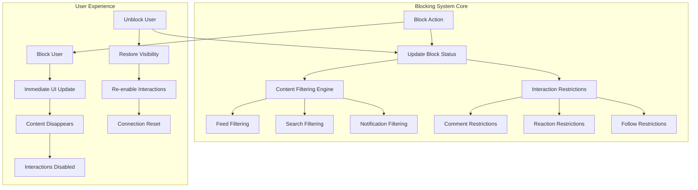

# Blocking System

Implement robust user blocking functionality to create safe social environments. Enable users to control their interactions, filter unwanted content, and maintain privacy with comprehensive blocking and unblocking capabilities.

<CardGroup cols={3}>
  <Card title="User Safety" icon="shield-check">
    Protect users from harassment and unwanted interactions
  </Card>
  <Card title="Content Control" icon="filter">
    Automatically filter blocked user content from all feeds
  </Card>
  <Card title="Privacy Management" icon="lock">
    Granular privacy controls and user management tools
  </Card>
</CardGroup>

## System Architecture



## Core Features

### 🚫 **Blocking Operations**
- **[Block/Unblock Users](block-unblock-user)** - Core blocking functionality with comprehensive controls
- **[Manage Blocked Users](manage-blocked-users)** - View and manage blocked user lists
- **Block Status Tracking** - Monitor blocking relationships and status changes
- **Bulk Block Operations** - Efficiently manage multiple blocks

### 🛡️ **Content Protection**
- **Feed Filtering** - Automatically hide blocked user content from all feeds
- **Interaction Prevention** - Restrict blocked users from commenting, reacting, or following
- **Search Filtering** - Filter blocked users from search results (optional)
- **Notification Blocking** - Prevent notifications from blocked users

### 🔒 **Privacy Controls**
- **Profile Protection** - Control blocked user access to profile information
- **Content Visibility** - Manage what blocked users can see of your content
- **Mutual Blocking** - Handle scenarios where users block each other
- **Privacy Preferences** - Customizable blocking behavior settings

## Implementation Guide

<Tabs>
  <Tab title="Basic Blocking">
    **Essential blocking functionality for user safety**
    
    ```typescript
    // Basic blocking implementation
    class BasicBlockingSystem {
      async blockUser(userId: string): Promise<void> {
        try {
          // Execute block operation
          await AmitySDK.blockUser(userId);
          
          // Update UI immediately
          this.updateBlockStatus(userId, 'blocked');
          
          // Filter content from current views
          this.filterBlockedUserContent(userId);
          
          // Show confirmation
          this.showBlockConfirmation(userId);
          
        } catch (error) {
          this.handleBlockError(error);
        }
      }
      
      async unblockUser(userId: string): Promise<void> {
        try {
          // Execute unblock operation
          await AmitySDK.unblockUser(userId);
          
          // Update UI
          this.updateBlockStatus(userId, 'none');
          
          // Restore content visibility
          this.restoreUserContent(userId);
          
          // Show unblock confirmation
          this.showUnblockConfirmation(userId);
          
        } catch (error) {
          this.handleUnblockError(error);
        }
      }
    }
    ```
  </Tab>
  
  <Tab title="Advanced Content Filtering">
    **Comprehensive content filtering across all app features**
    
    ```swift
    // Advanced content filtering system
    class ContentFilteringSystem {
        private var blockedUsers: Set<String> = []
        
        func setupContentFiltering() {
            // Initialize blocked users list
            loadBlockedUsers()
            
            // Setup real-time filtering
            setupRealtimeFiltering()
            
            // Configure feed filters
            configureFeedFilters()
            
            // Setup search filters
            configureSearchFilters()
        }
        
        func filterContent<T: UserContent>(_ content: [T]) -> [T] {
            return content.filter { item in
                // Filter out blocked user content
                !blockedUsers.contains(item.userId)
            }
        }
        
        func isUserBlocked(_ userId: String) -> Bool {
            return blockedUsers.contains(userId)
        }
        
        private func setupRealtimeFiltering() {
            // Listen for new content and filter in real-time
            AmityRealtimeClient.observe(.newContent) { [weak self] content in
                if let userId = content.userId,
                   self?.isUserBlocked(userId) == true {
                    // Prevent blocked user content from appearing
                    return
                }
                // Allow content through normal flow
                self?.handleNewContent(content)
            }
        }
    }
    ```
  </Tab>
  
  <Tab title="Privacy-First Blocking">
    **Advanced privacy controls with granular permissions**
    
    ```kotlin
    // Privacy-focused blocking system
    class PrivacyBlockingSystem {
        data class BlockingPreferences(
            val hideFromSearch: Boolean = true,
            val preventDirectAccess: Boolean = true,
            val blockCommunityInteractions: Boolean = true,
            val hideSharedContent: Boolean = false
        )
        
        suspend fun blockUserWithPrivacy(
            userId: String, 
            preferences: BlockingPreferences
        ) {
            try {
                // Execute core blocking
                blockUser(userId)
                
                // Apply privacy preferences
                applyPrivacySettings(userId, preferences)
                
                // Update content visibility
                updateContentVisibility(userId, preferences)
                
                // Configure interaction restrictions
                configureInteractionRestrictions(userId, preferences)
                
            } catch (error) {
                handlePrivacyBlockError(error)
            }
        }
        
        private suspend fun applyPrivacySettings(
            userId: String, 
            preferences: BlockingPreferences
        ) {
            if (preferences.hideFromSearch) {
                hideUserFromSearch(userId)
            }
            
            if (preferences.preventDirectAccess) {
                restrictProfileAccess(userId)
            }
            
            if (preferences.blockCommunityInteractions) {
                restrictCommunityInteractions(userId)
            }
            
            if (preferences.hideSharedContent) {
                hideSharedContent(userId)
            }
        }
    }
    ```
  </Tab>
</Tabs>

## Integration Patterns

<AccordionGroup>
  <Accordion title="Feed Integration">
    **Seamlessly integrate blocking with content feeds**
    
    ```typescript
    // Feed integration with blocking
    class BlockingFeedIntegration {
      async getPersonalizedFeed(options: FeedOptions): Promise<Post[]> {
        // Get raw feed data
        const rawFeed = await this.getFeedData(options);
        
        // Filter blocked user content
        const filteredFeed = await this.filterBlockedContent(rawFeed);
        
        // Apply additional privacy filters
        const privacyFilteredFeed = await this.applyPrivacyFilters(filteredFeed);
        
        return privacyFilteredFeed;
      }
      
      private async filterBlockedContent(posts: Post[]): Promise<Post[]> {
        const blockedUsers = await this.getBlockedUsers();
        
        return posts.filter(post => {
          // Filter direct posts from blocked users
          if (blockedUsers.includes(post.userId)) {
            return false;
          }
          
          // Filter posts with blocked user interactions
          post.comments = post.comments?.filter(comment => 
            !blockedUsers.includes(comment.userId)
          );
          
          post.reactions = post.reactions?.filter(reaction =>
            !blockedUsers.includes(reaction.userId)
          );
          
          return true;
        });
      }
    }
    ```
  </Accordion>
  
  <Accordion title="Community Integration">
    **Handle blocking within community contexts**
    
    ```swift
    // Community blocking integration
    class CommunityBlockingIntegration {
        func handleCommunityBlocking() {
            // Block user in community context
            blockUserInCommunity()
            
            // Handle shared community interactions
            handleSharedCommunityContent()
            
            // Manage community moderation
            integrateCommunityModeration()
        }
        
        private func blockUserInCommunity() {
            // Users can still see each other's community posts
            // but cannot directly interact
            configureCommunityInteractionRestrictions()
        }
        
        private func handleSharedCommunityContent() {
            // Handle scenarios where blocked users are in the same community
            // Option 1: Show content but disable interactions
            // Option 2: Hide content completely
            // Option 3: Show with warning/context
        }
    }
    ```
  </Accordion>
  
  <Accordion title="Notification Integration">
    **Prevent blocked user notifications**
    
    ```kotlin
    // Notification filtering for blocked users
    class BlockingNotificationIntegration {
        fun setupNotificationFiltering() {
            // Filter push notifications
            configurePushNotificationFiltering()
            
            // Filter in-app notifications
            configureInAppNotificationFiltering()
            
            // Handle notification history
            filterNotificationHistory()
        }
        
        private fun configurePushNotificationFiltering() {
            NotificationManager.addFilter { notification ->
                val senderId = notification.senderId
                
                // Check if sender is blocked
                if (isUserBlocked(senderId)) {
                    // Block notification
                    return@addFilter false
                }
                
                // Allow notification
                return@addFilter true
            }
        }
    }
    ```
  </Accordion>
</AccordionGroup>

## User Experience Guidelines

<Tabs>
  <Tab title="Blocking UX">
    <CardGroup cols={2}>
      <Card title="Clear Actions" icon="cursor-finger">
        - **Confirmation Dialogs**: Always confirm blocking actions
        - **Visual Feedback**: Show immediate status changes
        - **Context Menus**: Easy access to block options
        - **Undo Options**: Provide quick unblock capabilities
      </Card>
      <Card title="Status Indicators" icon="eye">
        - **Blocked Status**: Clear visual indicators for blocked users
        - **Content Placeholders**: Show when content is filtered
        - **Interaction Disabled**: Gray out unavailable actions
        - **Privacy Badges**: Indicate privacy protection active
      </Card>
    </CardGroup>
  </Tab>
  
  <Tab title="Management UX">
    <CardGroup cols={2}>
      <Card title="Blocked Users List" icon="list">
        - **Search & Filter**: Find specific blocked users
        - **Bulk Actions**: Manage multiple blocks efficiently
        - **User Context**: Show why/when users were blocked
        - **Quick Unblock**: One-tap unblock options
      </Card>
      <Card title="Privacy Settings" icon="sliders">
        - **Granular Controls**: Fine-tune blocking behavior
        - **Privacy Presets**: Common privacy configurations
        - **Import/Export**: Backup and restore block lists
        - **Analytics**: Show blocking impact and statistics
      </Card>
    </CardGroup>
  </Tab>
</Tabs>

## Advanced Features

<AccordionGroup>
  <Accordion title="Smart Blocking">
    **AI-powered blocking suggestions and automation**
    
    - **Harassment Detection**: Automatically suggest blocking for problematic users
    - **Pattern Recognition**: Identify spam or abuse patterns
    - **Proactive Protection**: Suggest blocks based on user behavior
    - **Community Intelligence**: Use community data to improve blocking suggestions
  </Accordion>
  
  <Accordion title="Temporary Blocking">
    **Time-limited blocking for cooling-off periods**
    
    - **Duration Settings**: Set automatic unblock timers
    - **Escalation Paths**: Convert temporary to permanent blocks
    - **Cool-down Periods**: Prevent immediate re-blocking
    - **Review Notifications**: Remind users to review temporary blocks
  </Accordion>
  
  <Accordion title="Collaborative Blocking">
    **Community-driven blocking and shared block lists**
    
    - **Shared Block Lists**: Import community-maintained block lists
    - **Trust Networks**: Use trusted contacts' block recommendations
    - **Reputation Systems**: Consider user reputation in blocking decisions
    - **Community Standards**: Align blocking with community guidelines
  </Accordion>
</AccordionGroup>

## Security & Privacy

<CardGroup cols={2}>
  <Card title="Data Protection" icon="shield-keyhole">
    - **Encrypted Storage**: Secure storage of block relationships
    - **Access Control**: Limit who can see block status
    - **Audit Logging**: Track blocking actions for security
    - **Data Retention**: Manage blocked user data lifecycle
  </Card>
  <Card title="Abuse Prevention" icon="exclamation-shield">
    - **Block Limits**: Prevent abuse of blocking system
    - **Harassment Patterns**: Detect systematic blocking abuse
    - **Appeal Process**: Provide mechanisms for dispute resolution
    - **Moderation Tools**: Enable platform-level block management
  </Card>
</CardGroup>

## Analytics & Monitoring

<Tabs>
  <Tab title="User Metrics">
    ```typescript
    interface BlockingMetrics {
      totalBlockedUsers: number;
      blocksPerDay: number;
      unblocksPerDay: number;
      averageBlockDuration: number;
      mostCommonBlockReasons: string[];
      blockingEffectiveness: {
        harassmentReduction: number;
        contentFilteringAccuracy: number;
        userSatisfaction: number;
      };
    }
    ```
  </Tab>
  
  <Tab title="System Health">
    ```swift
    // Monitor blocking system health
    class BlockingSystemMonitor {
        func trackSystemHealth() {
            // Monitor blocking performance
            trackBlockingLatency()
            
            // Monitor content filtering accuracy
            trackFilteringEffectiveness()
            
            // Monitor user experience impact
            trackUserSatisfaction()
            
            // Monitor abuse patterns
            trackAbusePatterns()
        }
    }
    ```
  </Tab>
</Tabs>

## Troubleshooting

<AccordionGroup>
  <Accordion title="Common Issues">
    **Blocked Content Still Appearing**
    - Check content filtering implementation
    - Verify real-time filtering is active
    - Clear local caches
    - Confirm block status synchronization
    
    **Performance Issues with Large Block Lists**
    - Implement efficient block status checking
    - Use local caching for frequently checked users
    - Optimize database queries
    - Consider pagination for block lists
    
    **Inconsistent Blocking Behavior**
    - Verify block status across all features
    - Check integration completeness
    - Review error handling
    - Confirm real-time updates
  </Accordion>
  
  <Accordion title="Error Recovery">
    ```kotlin
    class BlockingErrorRecovery {
        fun handleBlockingErrors(error: AmityError) {
            when (error.code) {
                AmityErrorCode.USER_NOT_FOUND -> {
                    // Handle deleted user scenarios
                    handleDeletedUser()
                }
                AmityErrorCode.NETWORK_ERROR -> {
                    // Implement retry logic
                    scheduleBlockingRetry()
                }
                AmityErrorCode.PERMISSION_DENIED -> {
                    // Handle permission issues
                    handlePermissionError()
                }
                else -> {
                    // Generic error handling
                    handleGenericBlockingError(error)
                }
            }
        }
    }
    ```
  </Accordion>
</AccordionGroup>

---

## Quick Start Guide

<Steps>
  <Step title="Implement Basic Blocking">
    Start with core [Block/Unblock User](block-unblock-user) functionality.
  </Step>
  <Step title="Setup Content Filtering">
    Integrate blocking with your content feeds and search systems.
  </Step>
  <Step title="Create Management Interface">
    Build a [Blocked Users Management](manage-blocked-users) interface.
  </Step>
  <Step title="Configure Privacy Settings">
    Add granular privacy controls and user preferences.
  </Step>
  <Step title="Monitor & Optimize">
    Track usage patterns and optimize for your use case.
  </Step>
</Steps>

## Related Documentation

<CardGroup cols={3}>
  <Card title="Follow System" icon="user-plus" href="../follow-system/">
    Manage social connections and relationships
  </Card>
  <Card title="Content Moderation" icon="flag" href="../../communities/community-moderation">
    Platform-level content and user moderation
  </Card>
  <Card title="Privacy Settings" icon="lock" href="../../core-concepts/user/">
    User privacy and account settings
  </Card>
</CardGroup>
