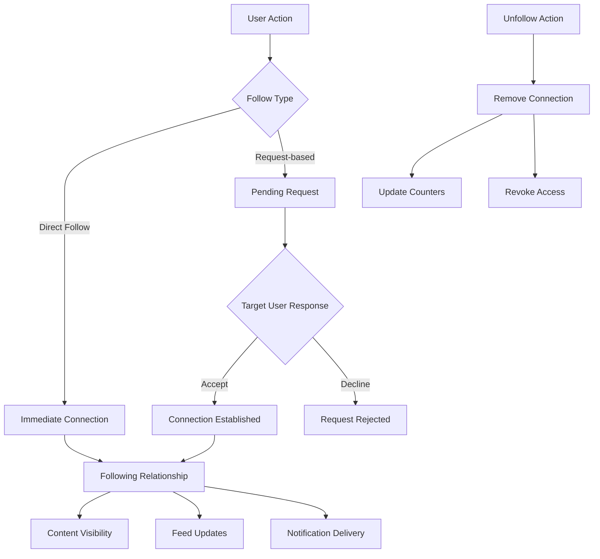

# Follow/Unfollow User

<CardGroup cols={2}>
  <Card title="Instant Connections" icon="user-plus">
    Create meaningful connections between users with simple follow/unfollow actions
  </Card>
  <Card title="Request Management" icon="handshake">
    Support both direct following and request-based workflows
  </Card>
  <Card title="Real-time Updates" icon="arrows-rotate">
    Automatic counter updates and status synchronization across devices
  </Card>
  <Card title="Cross-platform SDK" icon="mobile-screen">
    Consistent following experience across iOS, Android, and Web platforms
  </Card>
</CardGroup>

## Overview

The **Follow/Unfollow User** functionality is the core mechanism for establishing and managing relationships between users in your social platform. This feature enables users to connect with others, creating networks that drive content discovery, engagement, and community building.

## Architecture Overview



## Follow Users

### Implementation

<Tabs>
  <Tab title="iOS">
    <CodeGroup>
      ```swift Basic Follow Implementation
      import AmitySDK
      
      class FollowManager {
          private let userRepository = AmityUserRepository()
          
          func followUser(userId: String) {
              userRepository.followUser(userId: userId) { [weak self] result in
                  DispatchQueue.main.async {
                      switch result {
                      case .success:
                          print("Follow action successful")
                          self?.handleSuccessfulFollow(userId)
                      case .failure(let error):
                          print("Follow failed: \(error)")
                          self?.handleFollowError(error, for: userId)
                      }
                  }
              }
          }
          
          private func handleSuccessfulFollow(_ userId: String) {
              // Update UI
              updateFollowButton(for: userId, isFollowing: true)
              
              // Refresh connection status
              refreshConnectionStatus(for: userId)
              
              // Show success feedback
              showSuccessMessage("User followed successfully")
          }
      }
      ```
      
      ```swift Advanced Follow with Validation
      class AdvancedFollowManager {
          private let userRepository = AmityUserRepository()
          
          func followUserWithValidation(userId: String, completion: @escaping (Bool) -> Void) {
              
              // Check current connection status first
              userRepository.getConnectionStatus(userId: userId) { [weak self] status in
                  DispatchQueue.main.async {
                      switch status {
                      case .following:
                          self?.showMessage("Already following this user")
                          completion(false)
                      case .pending:
                          self?.showMessage("Follow request already sent")
                          completion(false)
                      case .blocked:
                          self?.showMessage("Cannot follow blocked user")
                          completion(false)
                      case .none:
                          self?.performFollowAction(userId: userId, completion: completion)
                      }
                  }
              }
          }
          
          private func performFollowAction(userId: String, completion: @escaping (Bool) -> Void) {
              userRepository.followUser(userId: userId) { result in
                  DispatchQueue.main.async {
                      switch result {
                      case .success:
                          self.handleSuccessfulFollow(userId)
                          completion(true)
                      case .failure(let error):
                          self.handleFollowError(error, for: userId)
                          completion(false)
                      }
                  }
              }
          }
      }
      ```
      
      ```swift SwiftUI Implementation
      import SwiftUI
      import AmitySDK
      
      struct FollowButton: View {
          let userId: String
          @State private var connectionStatus: AmityConnectionStatus = .none
          @State private var isLoading = false
          
          private let userRepository = AmityUserRepository()
          
          var body: some View {
              Button(action: {
                  handleFollowAction()
              }) {
                  HStack {
                      if isLoading {
                          ProgressView()
                              .scaleEffect(0.8)
                      }
                      Text(buttonTitle)
                  }
                  .padding(.horizontal, 16)
                  .padding(.vertical, 8)
                  .background(buttonColor)
                  .foregroundColor(.white)
                  .cornerRadius(8)
              }
              .disabled(isLoading || connectionStatus == .blocked)
              .onAppear {
                  loadConnectionStatus()
              }
          }
          
          private var buttonTitle: String {
              switch connectionStatus {
              case .none:
                  return "Follow"
              case .pending:
                  return "Pending"
              case .following:
                  return "Following"
              case .blocked:
                  return "Blocked"
              }
          }
          
          private var buttonColor: Color {
              switch connectionStatus {
              case .none:
                  return .blue
              case .pending:
                  return .orange
              case .following:
                  return .green
              case .blocked:
                  return .red
              }
          }
          
          private func handleFollowAction() {
              guard !isLoading else { return }
              
              isLoading = true
              
              switch connectionStatus {
              case .none:
                  followUser()
              case .following:
                  unfollowUser()
              default:
                  isLoading = false
              }
          }
          
          private func followUser() {
              userRepository.followUser(userId: userId) { result in
                  DispatchQueue.main.async {
                      isLoading = false
                      switch result {
                      case .success:
                          loadConnectionStatus()
                      case .failure(let error):
                          print("Follow failed: \(error)")
                      }
                  }
              }
          }
          
          private func loadConnectionStatus() {
              userRepository.getConnectionStatus(userId: userId) { status in
                  DispatchQueue.main.async {
                      connectionStatus = status
                  }
              }
          }
      }
      ```
    </CodeGroup>
  </Tab>
  
  <Tab title="Android">
    <CodeGroup>
      ```kotlin Basic Follow Implementation
      import com.amity.socialcloud.sdk.AmityCoreClient
      
      class FollowManager {
          private val userRepository = AmityCoreClient.newUserRepository()
          
          fun followUser(userId: String) {
              userRepository.followUser(userId)
                  .subscribe({ 
                      println("Follow action successful")
                      handleSuccessfulFollow(userId)
                  }, { error ->
                      println("Follow failed: $error")
                      handleFollowError(error, userId)
                  })
          }
          
          private fun handleSuccessfulFollow(userId: String) {
              // Update UI
              updateFollowButton(userId, isFollowing = true)
              
              // Refresh connection status
              refreshConnectionStatus(userId)
              
              // Show success feedback
              showSuccessMessage("User followed successfully")
          }
      }
      ```
      
      ```kotlin Advanced Follow with Validation  
      class AdvancedFollowManager {
          private val userRepository = AmityCoreClient.newUserRepository()
          
          fun followUserWithValidation(userId: String, callback: (Boolean) -> Unit) {
              
              // Check current connection status first
              userRepository.getConnectionStatus(userId)
                  .subscribe({ status ->
                      when (status) {
                          AmityConnectionStatus.FOLLOWING -> {
                              showMessage("Already following this user")
                              callback(false)
                          }
                          AmityConnectionStatus.PENDING -> {
                              showMessage("Follow request already sent")
                              callback(false)
                          }
                          AmityConnectionStatus.BLOCKED -> {
                              showMessage("Cannot follow blocked user")
                              callback(false)
                          }
                          AmityConnectionStatus.NONE -> {
                              performFollowAction(userId, callback)
                          }
                      }
                  }, { error ->
                      handleError(error)
                      callback(false)
                  })
          }
          
          private fun performFollowAction(userId: String, callback: (Boolean) -> Unit) {
              userRepository.followUser(userId)
                  .subscribe({ 
                      handleSuccessfulFollow(userId)
                      callback(true)
                  }, { error ->
                      handleFollowError(error, userId)
                      callback(false)
                  })
          }
      }
      ```
      
      ```kotlin Jetpack Compose Implementation
      import androidx.compose.runtime.*
      import androidx.compose.ui.Modifier
      import androidx.compose.material3.*
      import com.amity.socialcloud.sdk.AmityCoreClient
      
      @Composable
      fun FollowButton(
          userId: String,
          modifier: Modifier = Modifier
      ) {
          var connectionStatus by remember { mutableStateOf(AmityConnectionStatus.NONE) }
          var isLoading by remember { mutableStateOf(false) }
          
          val userRepository = remember { AmityCoreClient.newUserRepository() }
          
          LaunchedEffect(userId) {
              // Load connection status when component mounts
              userRepository.getConnectionStatus(userId)
                  .subscribe({ status ->
                      connectionStatus = status
                  }, { error ->
                      // Handle error
                  })
          }
          
          Button(
              onClick = {
                  when (connectionStatus) {
                      AmityConnectionStatus.NONE -> {
                          isLoading = true
                          userRepository.followUser(userId)
                              .subscribe({ 
                                  isLoading = false
                                  // Refresh status
                              }, { error ->
                                  isLoading = false
                                  // Handle error
                              })
                      }
                      AmityConnectionStatus.FOLLOWING -> {
                          // Handle unfollow
                      }
                      else -> {
                          // Handle other states
                      }
                  }
              },
              enabled = !isLoading && connectionStatus != AmityConnectionStatus.BLOCKED,
              colors = ButtonDefaults.buttonColors(
                  containerColor = when (connectionStatus) {
                      AmityConnectionStatus.NONE -> MaterialTheme.colorScheme.primary
                      AmityConnectionStatus.PENDING -> MaterialTheme.colorScheme.secondary
                      AmityConnectionStatus.FOLLOWING -> MaterialTheme.colorScheme.tertiary
                      AmityConnectionStatus.BLOCKED -> MaterialTheme.colorScheme.error
                  }
              ),
              modifier = modifier
          ) {
              if (isLoading) {
                  CircularProgressIndicator(modifier = Modifier.size(16.dp))
              } else {
                  Text(
                      text = when (connectionStatus) {
                          AmityConnectionStatus.NONE -> "Follow"
                          AmityConnectionStatus.PENDING -> "Pending"
                          AmityConnectionStatus.FOLLOWING -> "Following"
                          AmityConnectionStatus.BLOCKED -> "Blocked"
                      }
                  )
              }
          }
      }
      ```
    </CodeGroup>
  </Tab>
  
  <Tab title="TypeScript">
    <CodeGroup>
      ```typescript Basic Follow Implementation
      import { AmityUserRepository } from '@amityco/ts-sdk';
      
      class FollowManager {
          private userRepository = new AmityUserRepository();
          
          async followUser(userId: string): Promise<void> {
              try {
                  await this.userRepository.followUser(userId);
                  console.log('Follow action successful');
                  this.handleSuccessfulFollow(userId);
              } catch (error) {
                  console.error('Follow failed:', error);
                  this.handleFollowError(error, userId);
              }
          }
          
          private handleSuccessfulFollow(userId: string): void {
              // Update UI
              this.updateFollowButton(userId, true);
              
              // Refresh connection status
              this.refreshConnectionStatus(userId);
              
              // Show success feedback
              this.showSuccessMessage('User followed successfully');
          }
      }
      ```
      
      ```typescript React Hook Implementation
      import { useState, useCallback } from 'react';
      import { AmityUserRepository, AmityConnectionStatus } from '@amityco/ts-sdk';
      
      export const useFollowUser = (userId: string) => {
          const [connectionStatus, setConnectionStatus] = useState<AmityConnectionStatus>('none');
          const [isLoading, setIsLoading] = useState(false);
          const [error, setError] = useState<string | null>(null);
          
          const userRepository = new AmityUserRepository();
          
          const followUser = useCallback(async () => {
              if (isLoading) return;
              
              setIsLoading(true);
              setError(null);
              
              try {
                  await userRepository.followUser(userId);
                  
                  // Refresh connection status
                  const newStatus = await userRepository.getConnectionStatus(userId);
                  setConnectionStatus(newStatus);
                  
                  // Show success message
                  document.dispatchEvent(new CustomEvent('showMessage', {
                      detail: { type: 'success', message: 'User followed successfully' }
                  }));
                  
              } catch (err) {
                  const errorMessage = err instanceof Error ? err.message : 'Failed to follow user';
                  setError(errorMessage);
                  
                  // Show error message
                  document.dispatchEvent(new CustomEvent('showMessage', {
                      detail: { type: 'error', message: errorMessage }
                  }));
                  
              } finally {
                  setIsLoading(false);
              }
          }, [userId, isLoading, userRepository]);
          
          const loadConnectionStatus = useCallback(async () => {
              try {
                  const status = await userRepository.getConnectionStatus(userId);
                  setConnectionStatus(status);
              } catch (err) {
                  console.error('Failed to load connection status:', err);
              }
          }, [userId, userRepository]);
          
          return {
              connectionStatus,
              isLoading,
              error,
              followUser,
              loadConnectionStatus
          };
      };
      
      // Usage Example
      function FollowButton({ userId }: { userId: string }) {
          const { connectionStatus, isLoading, followUser, loadConnectionStatus } = useFollowUser(userId);
          
          React.useEffect(() => {
              loadConnectionStatus();
          }, [loadConnectionStatus]);
          
          const handleClick = () => {
              if (connectionStatus === 'none') {
                  followUser();
              } else if (connectionStatus === 'following') {
                  // Handle unfollow
              }
          };
          
          const getButtonText = () => {
              switch (connectionStatus) {
                  case 'none': return 'Follow';
                  case 'pending': return 'Pending';
                  case 'following': return 'Following';
                  case 'blocked': return 'Blocked';
                  default: return 'Follow';
              }
          };
          
          return (
              <button
                  onClick={handleClick}
                  disabled={isLoading || connectionStatus === 'blocked'}
                  className={`follow-btn ${connectionStatus}`}
              >
                  {isLoading ? 'Loading...' : getButtonText()}
              </button>
          );
      }
      ```
      
      ```typescript Advanced Follow with Validation
      class AdvancedFollowManager {
          private userRepository = new AmityUserRepository();
          
          async followUserWithValidation(userId: string): Promise<boolean> {
              try {
                  // Check current connection status first
                  const status = await this.userRepository.getConnectionStatus(userId);
                  
                  switch (status) {
                      case 'following':
                          this.showMessage('Already following this user');
                          return false;
                      case 'pending':
                          this.showMessage('Follow request already sent');
                          return false;
                      case 'blocked':
                          this.showMessage('Cannot follow blocked user');
                          return false;
                      case 'none':
                          return await this.performFollowAction(userId);
                      default:
                          return false;
                  }
              } catch (error) {
                  this.handleError(error);
                  return false;
              }
          }
          
          private async performFollowAction(userId: string): Promise<boolean> {
              try {
                  await this.userRepository.followUser(userId);
                  this.handleSuccessfulFollow(userId);
                  return true;
              } catch (error) {
                  this.handleFollowError(error, userId);
                  return false;
              }
          }
      }
      ```
    </CodeGroup>
  </Tab>
  
  <Tab title="Flutter">
    <CodeGroup>
      ```dart Basic Follow Implementation
      import 'package:amity_sdk/amity_sdk.dart';
      
      class FollowManager {
        final AmityUserRepository _userRepository = AmityCoreClient.newUserRepository();
        
        Future<void> followUser(String userId) async {
          try {
            await _userRepository.followUser(userId);
            print('Follow action successful');
            _handleSuccessfulFollow(userId);
          } catch (error) {
            print('Follow failed: $error');
            _handleFollowError(error, userId);
          }
        }
        
        void _handleSuccessfulFollow(String userId) {
          // Update UI
          _updateFollowButton(userId, isFollowing: true);
          
          // Refresh connection status
          _refreshConnectionStatus(userId);
          
          // Show success feedback
          _showSuccessMessage('User followed successfully');
        }
      }
      ```
      
      ```dart Provider Pattern Implementation
      import 'package:flutter/foundation.dart';
      import 'package:amity_sdk/amity_sdk.dart';
      
      class FollowProvider extends ChangeNotifier {
        final AmityUserRepository _userRepository = AmityCoreClient.newUserRepository();
        
        Map<String, AmityConnectionStatus> _connectionStatuses = {};
        Map<String, bool> _loadingStates = {};
        
        AmityConnectionStatus getConnectionStatus(String userId) {
          return _connectionStatuses[userId] ?? AmityConnectionStatus.none;
        }
        
        bool isLoading(String userId) {
          return _loadingStates[userId] ?? false;
        }
        
        Future<bool> followUser(String userId) async {
          _loadingStates[userId] = true;
          notifyListeners();
          
          try {
            await _userRepository.followUser(userId);
            
            // Refresh connection status
            await _loadConnectionStatus(userId);
            
            return true;
          } catch (error) {
            print('Follow failed: $error');
            return false;
          } finally {
            _loadingStates[userId] = false;
            notifyListeners();
          }
        }
        
        Future<void> _loadConnectionStatus(String userId) async {
          try {
            final status = await _userRepository.getConnectionStatus(userId);
            _connectionStatuses[userId] = status;
            notifyListeners();
          } catch (error) {
            print('Failed to load connection status: $error');
          }
        }
      }
      
      // Usage in Widget
      class FollowButton extends StatelessWidget {
        final String userId;
        
        const FollowButton({Key? key, required this.userId}) : super(key: key);
        
        @override
        Widget build(BuildContext context) {
          return Consumer<FollowProvider>(
            builder: (context, followProvider, child) {
              final connectionStatus = followProvider.getConnectionStatus(userId);
              final isLoading = followProvider.isLoading(userId);
              
              return ElevatedButton(
                onPressed: isLoading || connectionStatus == AmityConnectionStatus.blocked
                    ? null
                    : () {
                        if (connectionStatus == AmityConnectionStatus.none) {
                          followProvider.followUser(userId);
                        } else if (connectionStatus == AmityConnectionStatus.following) {
                          // Handle unfollow
                        }
                      },
                style: ElevatedButton.styleFrom(
                  backgroundColor: _getButtonColor(connectionStatus),
                ),
                child: isLoading
                    ? SizedBox(
                        width: 16,
                        height: 16,
                        child: CircularProgressIndicator(strokeWidth: 2),
                      )
                    : Text(_getButtonText(connectionStatus)),
              );
            },
          );
        }
        
        String _getButtonText(AmityConnectionStatus status) {
          switch (status) {
            case AmityConnectionStatus.none:
              return 'Follow';
            case AmityConnectionStatus.pending:
              return 'Pending';
            case AmityConnectionStatus.following:
              return 'Following';
            case AmityConnectionStatus.blocked:
              return 'Blocked';
          }
        }
        
        Color _getButtonColor(AmityConnectionStatus status) {
          switch (status) {
            case AmityConnectionStatus.none:
              return Colors.blue;
            case AmityConnectionStatus.pending:
              return Colors.orange;
            case AmityConnectionStatus.following:
              return Colors.green;
            case AmityConnectionStatus.blocked:
              return Colors.red;
          }
        }
      }
      ```
    </CodeGroup>
  </Tab>
</Tabs>

## Unfollow Users

### Implementation

<Tabs>
  <Tab title="iOS">
    <CodeGroup>
      ```swift Basic Unfollow Implementation
      func unfollowUser(userId: String) {
          userRepository.unfollowUser(userId: userId) { [weak self] result in
              DispatchQueue.main.async {
                  switch result {
                  case .success:
                      print("Unfollow action successful")
                      self?.handleSuccessfulUnfollow(userId)
                  case .failure(let error):
                      print("Unfollow failed: \(error)")
                      self?.handleUnfollowError(error, for: userId)
                  }
              }
          }
      }
      
      private func handleSuccessfulUnfollow(_ userId: String) {
          // Update UI
          updateFollowButton(for: userId, isFollowing: false)
          
          // Refresh connection status
          refreshConnectionStatus(for: userId)
          
          // Show success feedback
          showSuccessMessage("User unfollowed successfully")
      }
      ```
      
      ```swift Unfollow with Confirmation
      func unfollowUserWithConfirmation(userId: String, userName: String) {
          let alert = UIAlertController(
              title: "Unfollow User",
              message: "Are you sure you want to unfollow \(userName)?",
              preferredStyle: .alert
          )
          
          alert.addAction(UIAlertAction(title: "Cancel", style: .cancel))
          alert.addAction(UIAlertAction(title: "Unfollow", style: .destructive) { [weak self] _ in
              self?.unfollowUser(userId: userId)
          })
          
          present(alert, animated: true)
      }
      ```
    </CodeGroup>
  </Tab>
  
  <Tab title="Android">
    <CodeGroup>
      ```kotlin Basic Unfollow Implementation
      fun unfollowUser(userId: String) {
          userRepository.unfollowUser(userId)
              .subscribe({ 
                  println("Unfollow action successful")
                  handleSuccessfulUnfollow(userId)
              }, { error ->
                  println("Unfollow failed: $error")
                  handleUnfollowError(error, userId)
              })
      }
      
      private fun handleSuccessfulUnfollow(userId: String) {
          // Update UI
          updateFollowButton(userId, isFollowing = false)
          
          // Refresh connection status
          refreshConnectionStatus(userId)
          
          // Show success feedback
          showSuccessMessage("User unfollowed successfully")
      }
      ```
      
      ```kotlin Unfollow with Confirmation
      fun unfollowUserWithConfirmation(userId: String, userName: String) {
          AlertDialog.Builder(context)
              .setTitle("Unfollow User")
              .setMessage("Are you sure you want to unfollow $userName?")
              .setNegativeButton("Cancel", null)
              .setPositiveButton("Unfollow") { _, _ ->
                  unfollowUser(userId)
              }
              .show()
      }
      ```
    </CodeGroup>
  </Tab>
  
  <Tab title="TypeScript">
    <CodeGroup>
      ```typescript Basic Unfollow Implementation
      async unfollowUser(userId: string): Promise<void> {
          try {
              await this.userRepository.unfollowUser(userId);
              console.log('Unfollow action successful');
              this.handleSuccessfulUnfollow(userId);
          } catch (error) {
              console.error('Unfollow failed:', error);
              this.handleUnfollowError(error, userId);
          }
      }
      
      private handleSuccessfulUnfollow(userId: string): void {
          // Update UI
          this.updateFollowButton(userId, false);
          
          // Refresh connection status
          this.refreshConnectionStatus(userId);
          
          // Show success feedback
          this.showSuccessMessage('User unfollowed successfully');
      }
      ```
      
      ```typescript React Hook Unfollow
      const unfollowUser = useCallback(async () => {
          if (isLoading) return;
          
          setIsLoading(true);
          setError(null);
          
          try {
              await userRepository.unfollowUser(userId);
              
              // Refresh connection status
              const newStatus = await userRepository.getConnectionStatus(userId);
              setConnectionStatus(newStatus);
              
              // Show success message
              document.dispatchEvent(new CustomEvent('showMessage', {
                  detail: { type: 'success', message: 'User unfollowed successfully' }
              }));
              
          } catch (err) {
              const errorMessage = err instanceof Error ? err.message : 'Failed to unfollow user';
              setError(errorMessage);
              
          } finally {
              setIsLoading(false);
          }
      }, [userId, isLoading, userRepository]);
      ```
    </CodeGroup>
  </Tab>
  
  <Tab title="Flutter">
    <CodeGroup>
      ```dart Basic Unfollow Implementation
      Future<void> unfollowUser(String userId) async {
        try {
          await _userRepository.unfollowUser(userId);
          print('Unfollow action successful');
          _handleSuccessfulUnfollow(userId);
        } catch (error) {
          print('Unfollow failed: $error');
          _handleUnfollowError(error, userId);
        }
      }
      
      void _handleSuccessfulUnfollow(String userId) {
        // Update UI
        _updateFollowButton(userId, isFollowing: false);
        
        // Refresh connection status
        _refreshConnectionStatus(userId);
        
        // Show success feedback
        _showSuccessMessage('User unfollowed successfully');
      }
      ```
      
      ```dart Unfollow with Confirmation
      Future<void> unfollowUserWithConfirmation(String userId, String userName) async {
        final bool? confirmed = await showDialog<bool>(
          context: context,
          builder: (BuildContext context) {
            return AlertDialog(
              title: Text('Unfollow User'),
              content: Text('Are you sure you want to unfollow $userName?'),
              actions: [
                TextButton(
                  onPressed: () => Navigator.of(context).pop(false),
                  child: Text('Cancel'),
                ),
                TextButton(
                  onPressed: () => Navigator.of(context).pop(true),
                  child: Text('Unfollow'),
                ),
              ],
            );
          },
        );
        
        if (confirmed == true) {
          await unfollowUser(userId);
        }
      }
      ```
    </CodeGroup>
  </Tab>
</Tabs>

## Best Practices

<AccordionGroup>
  <Accordion title="User Experience Guidelines">
    ### Visual States and Feedback
    
    <CardGroup cols={2}>
      <Card title="Clear Button States" icon="toggle-on">
        Use distinct visual states for Follow, Following, Pending, and Blocked statuses
      </Card>
      <Card title="Loading Indicators" icon="spinner">
        Show loading states during follow/unfollow operations to indicate processing
      </Card>
      <Card title="Confirmation Dialogs" icon="question-circle">
        Use confirmation dialogs for destructive actions like unfollowing
      </Card>
      <Card title="Error Messaging" icon="triangle-exclamation">
        Provide clear, actionable error messages for failed operations
      </Card>
    </CardGroup>
    
    ### Implementation Strategy
    
    - **Immediate UI Updates**: Update button states immediately for better perceived performance
    - **Optimistic Updates**: Show expected state changes before server confirmation
    - **Rollback on Failure**: Revert UI changes if server operations fail
    - **Status Synchronization**: Regularly sync connection statuses with server
  </Accordion>

  <Accordion title="Connection Status Management">
    ### Status Validation
    
    Before performing follow/unfollow actions, always check the current connection status:
    
    <CodeGroup>
      ```swift iOS Status Validation
      func validateAndPerformAction(userId: String, action: ConnectionAction) {
          userRepository.getConnectionStatus(userId: userId) { [weak self] status in
              DispatchQueue.main.async {
                  switch (status, action) {
                  case (.none, .follow):
                      self?.followUser(userId: userId)
                  case (.following, .unfollow):
                      self?.unfollowUser(userId: userId)
                  case (.pending, .follow):
                      self?.showMessage("Follow request already sent")
                  case (.following, .follow):
                      self?.showMessage("Already following this user")
                  case (.blocked, _):
                      self?.showMessage("Cannot interact with blocked user")
                  default:
                      self?.showMessage("Invalid action for current status")
                  }
              }
          }
      }
      ```
    </CodeGroup>
  </Accordion>

  <Accordion title="Error Handling and Recovery">
    ### Common Error Scenarios
    
    **Network Connectivity Issues:**
    - Show retry options for network failures
    - Queue actions for retry when connection restored
    - Display offline indicators when appropriate
    
    **User State Conflicts:**
    - Handle concurrent follow/unfollow actions gracefully
    - Resolve conflicts with server-side state
    - Update UI to reflect actual server state
    
    **Permission and Blocking:**
    - Handle blocked user interactions appropriately
    - Show clear messages for permission denied errors
    - Respect user privacy settings
    
    ### Error Recovery Pattern
    
    <CodeGroup>
      ```swift iOS Error Recovery
      class FollowErrorHandler {
          func handleFollowError(_ error: Error, for userId: String, retryAction: @escaping () -> Void) {
              switch error {
              case AmityError.networkError:
                  showRetryDialog(retryAction)
              case AmityError.userBlocked:
                  showBlockedUserMessage()
                  updateUIForBlockedUser(userId)
              case AmityError.rateLimited:
                  showRateLimitMessage()
                  temporarilyDisableFollowActions()
              case AmityError.userNotFound:
                  showUserNotFoundMessage()
                  removeUserFromUI(userId)
              default:
                  showGenericErrorMessage()
              }
          }
          
          private func showRetryDialog(_ retryAction: @escaping () -> Void) {
              let alert = UIAlertController(
                  title: "Connection Error",
                  message: "Unable to complete follow action. Try again?",
                  preferredStyle: .alert
              )
              
              alert.addAction(UIAlertAction(title: "Retry", style: .default) { _ in
                  retryAction()
              })
              
              alert.addAction(UIAlertAction(title: "Cancel", style: .cancel))
              
              present(alert, animated: true)
          }
      }
      ```
    </CodeGroup>
  </Accordion>

  <Accordion title="Performance Optimization">
    ### Efficient Operations
    
    - **Batch Status Checks**: Check multiple user statuses in single API calls
    - **Caching Strategy**: Cache connection statuses for recently viewed users
    - **Debounced Actions**: Prevent rapid follow/unfollow button spam
    - **Background Sync**: Sync connection states in background when app becomes active
    
    ### Memory Management
    
    - **Proper Cleanup**: Cancel ongoing requests when views are dismissed
    - **Weak References**: Use weak references to prevent retain cycles
    - **Resource Management**: Clean up observers and subscriptions appropriately
    
    <CodeGroup>
      ```swift iOS Performance Optimization
      class OptimizedFollowManager {
          private var pendingRequests: [String: URLSessionTask] = [:]
          private var statusCache: [String: (status: AmityConnectionStatus, timestamp: Date)] = [:]
          private let cacheTimeout: TimeInterval = 300 // 5 minutes
          
          func followUserOptimized(userId: String) {
              // Cancel any pending request for this user
              pendingRequests[userId]?.cancel()
              
              // Check cache first
              if let cachedStatus = getCachedStatus(for: userId),
                 cachedStatus.status == .following {
                  showMessage("Already following this user")
                  return
              }
              
              // Perform optimistic UI update
              updateUIOptimistically(userId: userId, action: .follow)
              
              // Execute actual request
              let task = userRepository.followUser(userId: userId) { [weak self] result in
                  DispatchQueue.main.async {
                      self?.pendingRequests.removeValue(forKey: userId)
                      
                      switch result {
                      case .success:
                          self?.cacheStatus(.following, for: userId)
                          self?.confirmOptimisticUpdate(userId: userId)
                      case .failure(let error):
                          self?.revertOptimisticUpdate(userId: userId)
                          self?.handleError(error)
                      }
                  }
              }
              
              pendingRequests[userId] = task
          }
          
          private func getCachedStatus(for userId: String) -> (status: AmityConnectionStatus, timestamp: Date)? {
              guard let cached = statusCache[userId],
                    Date().timeIntervalSince(cached.timestamp) < cacheTimeout else {
                  return nil
              }
              return cached
          }
      }
      ```
    </CodeGroup>
  </Accordion>
</AccordionGroup>

## Use Cases

<CardGroup cols={2}>
  <Card title="Social Media Platform" icon="users">
    Public social platform with open following
    
    **Configuration:**
    - Disable follow requests for instant connections
    - Show follower counts publicly
    - Enable discovery through mutual connections
  </Card>
  
  <Card title="Professional Network" icon="briefcase">
    Business-focused platform with selective connections
    
    **Configuration:**
    - Enable follow requests for privacy control
    - Show professional information in requests
    - Support connection recommendations
  </Card>
  
  <Card title="Content Creator Platform" icon="video">
    Platform for creators and their audiences
    
    **Configuration:**
    - Flexible follow settings per creator
    - Tiered access based on follower status
    - Analytics for follower growth
  </Card>
  
  <Card title="Community Platform" icon="users-group">
    Interest-based communities with moderated access
    
    **Configuration:**
    - Community-specific follow rules
    - Moderator approval workflows
    - Group-based connection management
  </Card>
</CardGroup>

## Related Topics

<CardGroup cols={3}>
  <Card title="Accept/Decline Requests" href="./accept-decline-follow-request" icon="handshake">
    Handle incoming follow requests with approval workflows
  </Card>
  <Card title="Connection Status" href="./get-connection-status-and-connection-counter" icon="signal">
    Check relationship status and connection counters between users
  </Card>
  <Card title="Follower Lists" href="./get-follower-following-list" icon="list">
    Retrieve and display follower and following lists for users
  </Card>
</CardGroup>