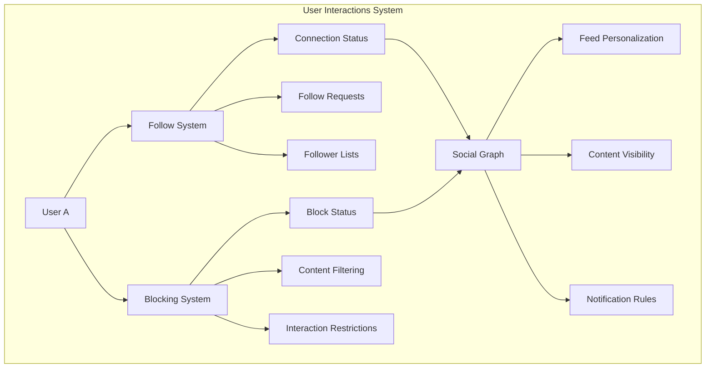

# User Interactions

Enable rich social connections and user relationship management with comprehensive tools for following, blocking, and managing user interactions. Build safe, engaging social experiences with granular privacy controls.

<CardGroup cols={3}>
  <Card title="Social Connections" icon="user-group">
    Follow/unfollow system with connection status tracking
  </Card>
  <Card title="Privacy Controls" icon="shield-check">
    Block/unblock users with comprehensive content filtering
  </Card>
  <Card title="Relationship Management" icon="users-rectangle">
    Social graphs and connection analytics
  </Card>
</CardGroup>

## Architecture Overview



## Core Features

<Tabs>
  <Tab title="Follow System">
    <CardGroup cols={2}>
      <Card title="Connection Management" icon="link" href="follow-system/">
        Comprehensive follow/unfollow functionality with relationship tracking
        - **Follow/Unfollow Users**: Build social connections
        - **Follow Requests**: Handle private account interactions  
        - **Connection Status**: Track relationship states
        - **Follower Management**: Manage follower and following lists
      </Card>
      <Card title="Social Graph Analytics" icon="chart-network">
        Insights into user connections and relationship patterns
        - Connection counters and statistics
        - Relationship history tracking
        - Social influence metrics
        - Connection recommendations
      </Card>
    </CardGroup>
  </Tab>
  
  <Tab title="Blocking System">
    <CardGroup cols={2}>
      <Card title="Privacy Protection" icon="user-shield" href="blocking-system/">
        Advanced blocking system for user safety and content control
        - **Block/Unblock Users**: Comprehensive privacy controls
        - **Content Filtering**: Hide blocked user content from feeds
        - **Interaction Prevention**: Restrict blocked user interactions
        - **Blocked User Management**: View and manage blocked user lists
      </Card>
      <Card title="Safety Features" icon="exclamation-shield">
        Advanced safety and harassment prevention tools
        - Automatic content hiding
        - Interaction restrictions
        - Privacy preference management
        - Abuse prevention mechanisms
      </Card>
    </CardGroup>
  </Tab>
</Tabs>

## Integration Patterns

<AccordionGroup>
  <Accordion title="Social Media App">
    **Essential Features**: Follow system + Content filtering + User discovery
    
    ```typescript
    // Complete social interaction setup
    class SocialInteractions {
      async setupUserInteractions() {
        // 1. Initialize follow system
        await this.setupFollowSystem();
        
        // 2. Configure blocking system
        await this.setupBlockingSystem();
        
        // 3. Setup privacy controls
        await this.setupPrivacyControls();
        
        // 4. Enable user discovery
        await this.setupUserDiscovery();
      }
    }
    ```
  </Accordion>
  
  <Accordion title="Community Platform">
    **Focus**: Member relationships + Community moderation + Safety tools
    
    ```swift
    // Community-focused user interactions
    class CommunityInteractions {
        func setupCommunityUserManagement() {
            // Member following within communities
            setupCommunityFollowing()
            
            // Advanced blocking for safety
            setupCommunityBlocking()
            
            // Moderator tools integration
            setupModerationTools()
        }
    }
    ```
  </Accordion>
  
  <Accordion title="Professional Network">
    **Focus**: Connection requests + Professional relationships + Privacy
    
    ```kotlin
    // Professional networking interactions
    class ProfessionalInteractions {
        fun setupProfessionalNetworking() {
            // Request-based connections
            setupConnectionRequests()
            
            // Professional privacy controls
            setupProfessionalPrivacy()
            
            // Network analytics
            setupNetworkInsights()
        }
    }
    ```
  </Accordion>
</AccordionGroup>

## User Experience Best Practices

<CardGroup cols={2}>
  <Card title="Follow System UX" icon="user-plus">
    - **Clear Status Indicators**: Show connection states visually
    - **Request Management**: Easy approve/decline interfaces
    - **Discovery Tools**: Suggest relevant users to follow
    - **Privacy Respect**: Honor user privacy preferences
  </Card>
  <Card title="Blocking System UX" icon="ban">
    - **Confirmation Dialogs**: Confirm blocking actions
    - **Clear Feedback**: Explain blocking consequences
    - **Easy Management**: Simple blocked user list interface
    - **Unblock Options**: Clear path to unblock users
  </Card>
</CardGroup>

## Getting Started

<Steps>
  <Step title="Choose Your Interaction Model">
    Decide between public following, request-based connections, or hybrid approaches based on your app's social model.
  </Step>
  <Step title="Implement Follow System">
    Start with basic [Follow System](follow-system/) functionality to enable user connections.
  </Step>
  <Step title="Add Privacy Controls">
    Implement [Blocking System](blocking-system/) for user safety and content control.
  </Step>
  <Step title="Configure Feed Integration">
    Connect user interactions with your content feeds for personalized experiences.
  </Step>
  <Step title="Setup Analytics">
    Track interaction patterns to improve user experience and feature adoption.
  </Step>
</Steps>

## Related Features

<CardGroup cols={3}>
  <Card title="Communities" icon="users" href="../communities/">
    Manage community memberships and social structures
  </Card>
  <Card title="Feeds" icon="rss" href="../feed/">
    Personalize content based on user relationships
  </Card>
  <Card title="Notifications" icon="bell" href="../notification-tray/">
    Notify users about follow requests and social interactions
  </Card>
</CardGroup>

---

## Quick Reference

### Common Operations
- **Follow User**: [Follow System](follow-system/) → [Follow/Unfollow User](follow-system/follow-unfollow-user)
- **Manage Requests**: [Follow System](follow-system/) → [Accept/Decline Requests](follow-system/accept-decline-follow-request)
- **Block User**: [Blocking System](blocking-system/) → [Block/Unblock User](blocking-system/block-unblock-user)
- **View Connections**: [Follow System](follow-system/) → [Get Follower/Following Lists](follow-system/get-follower-following-list)

### Integration Guides
- **[Posts Integration](../posts/)** - Show content from followed users
- **[Communities Integration](../communities/)** - Follow community members
- **[Search Integration](../intelligent-search/)** - Discover users to follow
