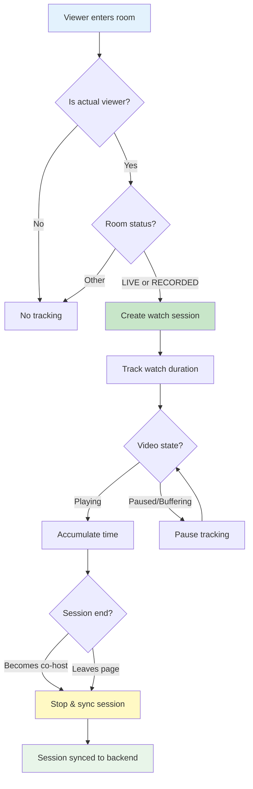

# Livestream Analytics

The social.plus Video SDK provides comprehensive analytics capabilities for tracking viewer engagement and watch time during live and recorded room playback. This feature enables you to collect valuable insights about how users interact with your video content.

## Overview

<CardGroup cols={2}>
  <Card title="Watch Session Tracking" icon="clock">
    **Track viewer watch time**
    - Create watch sessions for viewers
    - Track actual watch duration (excludes paused time)
    - Automatic session management
    - Separate tracking for live and recorded content
  </Card>
  <Card title="Network Resilient Sync" icon="cloud-arrow-up">
    **Reliable data collection**
    - Local persistence of analytics data
    - Automatic sync with jitter delay
    - Network-aware retry logic
    - Guaranteed data delivery
  </Card>
  <Card title="Session State Management" icon="rotate">
    **Intelligent state handling**
    - Automatic pause/resume detection
    - Role transition handling (viewer ↔ co-host)
    - Duplicate session prevention
    - Clean session lifecycle management
  </Card>
  <Card title="Multi-Platform Support" icon="devices">
    **Consistent across platforms**
    - iOS, Android, and Web support
    - Unified API design
    - Platform-specific optimizations
    - Same data format across all platforms
  </Card>
</CardGroup>

## Key Concepts

### Watch Sessions

A watch session represents a period of time during which a viewer is actively watching a room. Key characteristics:

- **Unique Session IDs**: Each session has a unique identifier with prefixes indicating content type
  - `room_` prefix for live room watching
  - `room_playback_` prefix for recorded content
- **Accurate Duration Tracking**: Only counts actual watching time (paused periods are excluded)
- **Role-Aware**: Sessions only track actual viewers (not hosts or co-hosts)

### Session Lifecycle




## Getting Started

<Steps>
  <Step title="Access Room Analytics">
    Get the analytics instance from any `AmityRoom` object.
  </Step>
  <Step title="Create Watch Session">
    Create a session when a viewer starts watching.
  </Step>
  <Step title="Update Watch Duration">
    Update the session periodically with accumulated watch time.
  </Step>
  <Step title="Sync Sessions">
    Sync pending sessions when the viewer stops watching.
  </Step>
</Steps>

## API Reference

### AmityRoom Extension

The `AmityRoom` class is extended with an analytics capability:

<CodeGroup>
```swift iOS
extension AmityRoom {
    /// Get analytics instance for this room
    /// - Returns: AmityRoomAnalytics instance for tracking watch sessions
    func analytics() -> AmityRoomAnalytics
}
```

```kotlin Android
class AmityRoom {
    /**
     * Get analytics instance for this room
     * @return AmityRoomAnalytics instance for tracking watch sessions
     */
    fun analytics(): AmityRoomAnalytics
}
```

```typescript TypeScript
class AmityRoom {
    /**
     * Get analytics instance for this room
     * @returns AmityRoomAnalytics instance for tracking watch sessions
     */
    analytics(): AmityRoomAnalytics;
}
```
</CodeGroup>

### AmityRoomAnalytics

The main class for managing room analytics operations:

<AccordionGroup>
  <Accordion title="createWatchSession" icon="play">
    **Create a new watch session for the current room**
    
    Creates a unique watch session to track viewer engagement. The session ID format depends on the room status:
    - Live rooms: `room_<unique-id>`
    - Recorded rooms: `room_playback_<unique-id>`

    **Parameters:**
    | Parameter | Type | Required | Description |
    |-----------|------|----------|-------------|
    | `startedAt` | `Date` | Yes | The timestamp when watching started |

    **Returns:** `Promise<String>` - Unique session identifier

    **Throws:** `BusinessException` if room is not in watchable state (not LIVE or RECORDED)

    <CodeGroup>
    ```swift iOS
    import AmitySDK

    func startWatchSession(room: AmityRoom) async throws -> String {
        let analytics = room.analytics()
        let sessionId = try await analytics.createWatchSession(startedAt: Date())
        print("Watch session created: \(sessionId)")
        return sessionId
    }
    ```

    ```kotlin Android
    import com.amity.socialcloud.sdk.video.AmityRoom
    import kotlinx.coroutines.Dispatchers
    import kotlinx.coroutines.withContext
    import java.util.Date

    suspend fun startWatchSession(room: AmityRoom): String {
        return withContext(Dispatchers.IO) {
            val analytics = room.analytics()
            val sessionId = analytics.createWatchSession(startedAt = Date())
            println("Watch session created: $sessionId")
            sessionId
        }
    }
    ```

    ```typescript TypeScript
    import { AmityRoom } from '@amityco/ts-sdk';

    async function startWatchSession(room: AmityRoom): Promise<string> {
        const analytics = room.analytics();
        const sessionId = await analytics.createWatchSession(new Date());
        console.log('Watch session created:', sessionId);
        return sessionId;
    }
    ```
    </CodeGroup>
  </Accordion>

  <Accordion title="updateWatchSession" icon="clock-rotate-left">
    **Update an existing watch session with duration**
    
    Updates the watch session with the current accumulated watch time. Call this periodically (recommended: every 1 second) while the viewer is actively watching.

    **Parameters:**
    | Parameter | Type | Required | Description |
    |-----------|------|----------|-------------|
    | `sessionId` | `String` | Yes | The unique identifier of the watch session |
    | `duration` | `Number` | Yes | The total watch duration in seconds |
    | `endedAt` | `Date` | Yes | The timestamp when this update occurred |

    **Returns:** `Promise<void>`

    <CodeGroup>
    ```swift iOS
    import AmitySDK

    func updateSession(
        room: AmityRoom, 
        sessionId: String, 
        watchedSeconds: Int
    ) async throws {
        let analytics = room.analytics()
        try await analytics.updateWatchSession(
            sessionId: sessionId,
            duration: watchedSeconds,
            endedAt: Date()
        )
    }
    ```

    ```kotlin Android
    import com.amity.socialcloud.sdk.video.AmityRoom
    import kotlinx.coroutines.Dispatchers
    import kotlinx.coroutines.withContext
    import java.util.Date

    suspend fun updateSession(
        room: AmityRoom,
        sessionId: String,
        watchedSeconds: Long
    ) {
        withContext(Dispatchers.IO) {
            val analytics = room.analytics()
            analytics.updateWatchSession(
                sessionId = sessionId,
                duration = watchedSeconds,
                endedAt = Date()
            )
        }
    }
    ```

    ```typescript TypeScript
    import { AmityRoom } from '@amityco/ts-sdk';

    async function updateSession(
        room: AmityRoom,
        sessionId: string,
        watchedSeconds: number
    ): Promise<void> {
        const analytics = room.analytics();
        await analytics.updateWatchSession(
            sessionId,
            watchedSeconds,
            new Date()
        );
    }
    ```
    </CodeGroup>
  </Accordion>

  <Accordion title="syncPendingWatchSessions" icon="cloud-arrow-up">
    **Sync all pending watch sessions to backend**
    
    Triggers synchronization of all locally stored watch sessions that haven't been synced yet. This method implements:
    - Jitter delay (5-30 seconds random delay before execution)
    - Network resilience (waits up to 60 seconds for connection)
    - Automatic retry logic (up to 3 attempts)

    **Returns:** `void` (executes asynchronously)

    <CodeGroup>
    ```swift iOS
    import AmitySDK

    func syncAllSessions(room: AmityRoom) {
        let analytics = room.analytics()
        analytics.syncPendingWatchSessions()
        // Sync happens asynchronously with jitter delay
    }
    ```

    ```kotlin Android
    import com.amity.socialcloud.sdk.video.AmityRoom

    fun syncAllSessions(room: AmityRoom) {
        val analytics = room.analytics()
        analytics.syncPendingWatchSessions()
        // Sync happens asynchronously with jitter delay
    }
    ```

    ```typescript TypeScript
    import { AmityRoom } from '@amityco/ts-sdk';

    function syncAllSessions(room: AmityRoom): void {
        const analytics = room.analytics();
        analytics.syncPendingWatchSessions();
        // Sync happens asynchronously with jitter delay
    }
    ```
    </CodeGroup>

    <Warning>
      Only call `syncPendingWatchSessions()` when the user leaves the room or transitions from viewer to co-host. Do not call on every pause event.
    </Warning>
  </Accordion>
</AccordionGroup>

## Implementation Example

### Complete Watch Session Implementation

Here's a complete implementation showing how to properly track watch sessions:

<CodeGroup>
```swift iOS
import AmitySDK
import Combine

class RoomWatchTracker {
    private var room: AmityRoom
    private var sessionId: String?
    private var accumulatedWatchTimeSeconds: Int = 0
    private var lastResumeTime: Date?
    private var isWatchingPaused: Bool = false
    private var watchingRoomId: String?
    private var updateTimer: Timer?
    
    init(room: AmityRoom) {
        self.room = room
    }
    
    // MARK: - Session Management
    
    func startWatchTracking(isStreamerMode: Bool, cohostUserId: String?, currentUserId: String) async {
        // Only track for actual viewers
        let isActualViewer = !isStreamerMode && currentUserId != cohostUserId
        guard isActualViewer else { return }
        
        // Only track for watchable rooms
        guard room.status == .live || room.status == .recorded else { return }
        
        // Prevent duplicate sessions for the same room
        guard watchingRoomId != room.roomId else { return }
        
        // Stop any existing tracking first
        stopWatchTracking(shouldSync: false)
        
        watchingRoomId = room.roomId
        
        do {
            sessionId = try await room.analytics().createWatchSession(startedAt: Date())
            initializeTrackingState()
            startUpdateInterval()
        } catch {
            print("Failed to create watch session: \(error)")
        }
    }
    
    func stopWatchTracking(shouldSync: Bool) {
        updateTimer?.invalidate()
        updateTimer = nil
        
        guard let sessionId = sessionId else { return }
        
        // Calculate final duration
        var finalDuration = accumulatedWatchTimeSeconds
        if let lastResume = lastResumeTime, !isWatchingPaused {
            finalDuration += Int(Date().timeIntervalSince(lastResume))
        }
        
        // Send final update
        Task {
            try? await room.analytics().updateWatchSession(
                sessionId: sessionId,
                duration: finalDuration,
                endedAt: Date()
            )
            
            if shouldSync {
                room.analytics().syncPendingWatchSessions()
            }
        }
        
        // Clear state
        self.sessionId = nil
        accumulatedWatchTimeSeconds = 0
        lastResumeTime = nil
        isWatchingPaused = false
        watchingRoomId = nil
    }
    
    // MARK: - Pause/Resume Handling
    
    func onVideoPaused() {
        guard sessionId != nil, !isWatchingPaused else { return }
        
        // Save elapsed time since last resume
        if let lastResume = lastResumeTime {
            let elapsed = Int(Date().timeIntervalSince(lastResume))
            accumulatedWatchTimeSeconds += elapsed
        }
        
        isWatchingPaused = true
        lastResumeTime = nil
    }
    
    func onVideoResumed() {
        guard sessionId != nil, isWatchingPaused else { return }
        
        isWatchingPaused = false
        lastResumeTime = Date()
    }
    
    // MARK: - Private Helpers
    
    private func initializeTrackingState() {
        accumulatedWatchTimeSeconds = 0
        lastResumeTime = Date()
        isWatchingPaused = false
    }
    
    private func startUpdateInterval() {
        updateTimer = Timer.scheduledTimer(withTimeInterval: 1.0, repeats: true) { [weak self] _ in
            self?.updateCurrentWatchSession()
        }
    }
    
    private func updateCurrentWatchSession() {
        guard let sessionId = sessionId, !isWatchingPaused else { return }
        
        guard let lastResume = lastResumeTime else { return }
        
        let elapsedSinceResume = Int(Date().timeIntervalSince(lastResume))
        let totalDuration = accumulatedWatchTimeSeconds + elapsedSinceResume
        
        Task {
            try? await room.analytics().updateWatchSession(
                sessionId: sessionId,
                duration: totalDuration,
                endedAt: Date()
            )
            
            // Update accumulated time and reset lastResumeTime
            await MainActor.run {
                self.accumulatedWatchTimeSeconds = totalDuration
                self.lastResumeTime = Date()
            }
        }
    }
}
```

```kotlin Android
import com.amity.socialcloud.sdk.video.AmityRoom
import com.amity.socialcloud.sdk.video.AmityRoomStatus
import kotlinx.coroutines.*
import java.util.Date
import java.util.Timer
import kotlin.concurrent.fixedRateTimer

class RoomWatchTracker(private val room: AmityRoom) {
    private var sessionId: String? = null
    private var accumulatedWatchTimeSeconds: Long = 0
    private var lastResumeTime: Date? = null
    private var isWatchingPaused: Boolean = false
    private var watchingRoomId: String? = null
    private var updateTimer: Timer? = null
    private val scope = CoroutineScope(Dispatchers.Main + SupervisorJob())

    // Session Management

    suspend fun startWatchTracking(
        isStreamerMode: Boolean,
        cohostUserId: String?,
        currentUserId: String
    ) {
        // Only track for actual viewers
        val isActualViewer = !isStreamerMode && currentUserId != cohostUserId
        if (!isActualViewer) return

        // Only track for watchable rooms
        if (room.getStatus() != AmityRoomStatus.LIVE && 
            room.getStatus() != AmityRoomStatus.RECORDED) return

        // Prevent duplicate sessions for the same room
        if (watchingRoomId == room.getRoomId()) return

        // Stop any existing tracking first
        stopWatchTracking(shouldSync = false)

        watchingRoomId = room.getRoomId()

        try {
            sessionId = room.analytics().createWatchSession(startedAt = Date())
            initializeTrackingState()
            startUpdateInterval()
        } catch (e: Exception) {
            println("Failed to create watch session: ${e.message}")
        }
    }

    fun stopWatchTracking(shouldSync: Boolean) {
        updateTimer?.cancel()
        updateTimer = null

        val currentSessionId = sessionId ?: return

        // Calculate final duration
        var finalDuration = accumulatedWatchTimeSeconds
        lastResumeTime?.let { lastResume ->
            if (!isWatchingPaused) {
                finalDuration += (Date().time - lastResume.time) / 1000
            }
        }

        // Send final update
        scope.launch {
            try {
                room.analytics().updateWatchSession(
                    sessionId = currentSessionId,
                    duration = finalDuration,
                    endedAt = Date()
                )

                if (shouldSync) {
                    room.analytics().syncPendingWatchSessions()
                }
            } catch (e: Exception) {
                println("Failed to update watch session: ${e.message}")
            }
        }

        // Clear state
        sessionId = null
        accumulatedWatchTimeSeconds = 0
        lastResumeTime = null
        isWatchingPaused = false
        watchingRoomId = null
    }

    // Pause/Resume Handling

    fun onVideoPaused() {
        if (sessionId == null || isWatchingPaused) return

        // Save elapsed time since last resume
        lastResumeTime?.let { lastResume ->
            val elapsed = (Date().time - lastResume.time) / 1000
            accumulatedWatchTimeSeconds += elapsed
        }

        isWatchingPaused = true
        lastResumeTime = null
    }

    fun onVideoResumed() {
        if (sessionId == null || !isWatchingPaused) return

        isWatchingPaused = false
        lastResumeTime = Date()
    }

    // Private Helpers

    private fun initializeTrackingState() {
        accumulatedWatchTimeSeconds = 0
        lastResumeTime = Date()
        isWatchingPaused = false
    }

    private fun startUpdateInterval() {
        updateTimer = fixedRateTimer(period = 1000L) {
            updateCurrentWatchSession()
        }
    }

    private fun updateCurrentWatchSession() {
        val currentSessionId = sessionId ?: return
        if (isWatchingPaused) return

        val lastResume = lastResumeTime ?: return

        val elapsedSinceResume = (Date().time - lastResume.time) / 1000
        val totalDuration = accumulatedWatchTimeSeconds + elapsedSinceResume

        scope.launch {
            try {
                room.analytics().updateWatchSession(
                    sessionId = currentSessionId,
                    duration = totalDuration,
                    endedAt = Date()
                )

                // Update accumulated time and reset lastResumeTime
                accumulatedWatchTimeSeconds = totalDuration
                lastResumeTime = Date()
            } catch (e: Exception) {
                // Handle silently, will retry on next interval
            }
        }
    }

    fun cleanup() {
        scope.cancel()
    }
}
```

```typescript TypeScript
import { AmityRoom, RoomStatus } from '@amityco/ts-sdk';

class RoomWatchTracker {
    private room: AmityRoom;
    private sessionId: string | null = null;
    private accumulatedWatchTimeSeconds: number = 0;
    private lastResumeTime: Date | null = null;
    private isWatchingPaused: boolean = false;
    private watchingRoomId: string | null = null;
    private updateTimer: NodeJS.Timeout | null = null;

    constructor(room: AmityRoom) {
        this.room = room;
    }

    // Session Management

    async startWatchTracking(
        isStreamerMode: boolean,
        cohostUserId: string | null,
        currentUserId: string
    ): Promise<void> {
        // Only track for actual viewers
        const isActualViewer = !isStreamerMode && currentUserId !== cohostUserId;
        if (!isActualViewer) return;

        // Only track for watchable rooms
        if (this.room.status !== RoomStatus.LIVE && 
            this.room.status !== RoomStatus.RECORDED) return;

        // Prevent duplicate sessions for the same room
        if (this.watchingRoomId === this.room.roomId) return;

        // Stop any existing tracking first
        this.stopWatchTracking(false);

        this.watchingRoomId = this.room.roomId;

        try {
            this.sessionId = await this.room.analytics().createWatchSession(new Date());
            this.initializeTrackingState();
            this.startUpdateInterval();
        } catch (error) {
            console.error('Failed to create watch session:', error);
        }
    }

    stopWatchTracking(shouldSync: boolean): void {
        if (this.updateTimer) {
            clearInterval(this.updateTimer);
            this.updateTimer = null;
        }

        if (!this.sessionId) return;

        // Calculate final duration
        let finalDuration = this.accumulatedWatchTimeSeconds;
        if (this.lastResumeTime && !this.isWatchingPaused) {
            finalDuration += Math.floor((Date.now() - this.lastResumeTime.getTime()) / 1000);
        }

        // Send final update
        this.room.analytics().updateWatchSession(
            this.sessionId,
            finalDuration,
            new Date()
        ).then(() => {
            if (shouldSync) {
                this.room.analytics().syncPendingWatchSessions();
            }
        }).catch(error => {
            console.error('Failed to update watch session:', error);
        });

        // Clear state
        this.sessionId = null;
        this.accumulatedWatchTimeSeconds = 0;
        this.lastResumeTime = null;
        this.isWatchingPaused = false;
        this.watchingRoomId = null;
    }

    // Pause/Resume Handling

    onVideoPaused(): void {
        if (!this.sessionId || this.isWatchingPaused) return;

        // Save elapsed time since last resume
        if (this.lastResumeTime) {
            const elapsed = Math.floor((Date.now() - this.lastResumeTime.getTime()) / 1000);
            this.accumulatedWatchTimeSeconds += elapsed;
        }

        this.isWatchingPaused = true;
        this.lastResumeTime = null;
    }

    onVideoResumed(): void {
        if (!this.sessionId || !this.isWatchingPaused) return;

        this.isWatchingPaused = false;
        this.lastResumeTime = new Date();
    }

    // Private Helpers

    private initializeTrackingState(): void {
        this.accumulatedWatchTimeSeconds = 0;
        this.lastResumeTime = new Date();
        this.isWatchingPaused = false;
    }

    private startUpdateInterval(): void {
        this.updateTimer = setInterval(() => {
            this.updateCurrentWatchSession();
        }, 1000);
    }

    private async updateCurrentWatchSession(): Promise<void> {
        if (!this.sessionId || this.isWatchingPaused) return;
        if (!this.lastResumeTime) return;

        const elapsedSinceResume = Math.floor(
            (Date.now() - this.lastResumeTime.getTime()) / 1000
        );
        const totalDuration = this.accumulatedWatchTimeSeconds + elapsedSinceResume;

        try {
            await this.room.analytics().updateWatchSession(
                this.sessionId,
                totalDuration,
                new Date()
            );

            // Update accumulated time and reset lastResumeTime
            this.accumulatedWatchTimeSeconds = totalDuration;
            this.lastResumeTime = new Date();
        } catch (error) {
            // Handle silently, will retry on next interval
        }
    }
}
```
</CodeGroup>

## Best Practices

<AccordionGroup>
  <Accordion title="Session Creation" icon="circle-play">
    **When to create sessions:**
    - Create a session when a viewer enters the room player page
    - Only create for actual viewers (not hosts or co-hosts)
    - Only create for LIVE or RECORDED rooms
    - Prevent duplicate sessions by tracking the current room ID

    ```typescript
    // ✅ Correct: Check all conditions before creating
    if (isActualViewer && (room.status === 'live' || room.status === 'recorded')) {
        if (watchingRoomId !== room.roomId) {
            sessionId = await room.analytics().createWatchSession(new Date());
        }
    }

    // ❌ Incorrect: Creating without checks
    sessionId = await room.analytics().createWatchSession(new Date());
    ```
  </Accordion>

  <Accordion title="Duration Tracking" icon="stopwatch">
    **Accurate time tracking:**
    - Only count time when video is actively playing
    - Pause tracking during buffering states
    - Use accumulated time + elapsed since last resume for accurate totals

    ```typescript
    // ✅ Correct: Calculate total from accumulated + current elapsed
    const totalDuration = accumulatedWatchTimeSeconds + 
        Math.floor((Date.now() - lastResumeTime.getTime()) / 1000);

    // ❌ Incorrect: Using wall clock time
    const totalDuration = Math.floor((Date.now() - sessionStartTime.getTime()) / 1000);
    ```
  </Accordion>

  <Accordion title="Sync Timing" icon="cloud-arrow-up">
    **When to sync:**
    - ✅ When user leaves the room player page
    - ✅ When user transitions from viewer to co-host
    - ❌ Do NOT sync on video pause
    - ❌ Do NOT sync on app background

    ```typescript
    // ✅ Correct: Sync on page exit
    function onPageExit() {
        stopWatchTracking(shouldSync: true);
    }

    // ❌ Incorrect: Syncing on pause
    function onVideoPause() {
        pauseWatchTracking();
        room.analytics().syncPendingWatchSessions(); // Don't do this!
    }
    ```
  </Accordion>

  <Accordion title="Role Transitions" icon="arrow-right-arrow-left">
    **Handle viewer ↔ co-host transitions:**
    - When becoming a co-host: Stop tracking and sync immediately
    - When returning to viewer: Create a fresh new session
    - Never reuse session IDs across role transitions

    ```typescript
    // Viewer → Co-host
    function onBecomeCoHost() {
        stopWatchTracking(shouldSync: true);
    }

    // Co-host → Viewer
    function onReturnToViewer() {
        // Creates a completely new session
        startWatchTracking(isStreamerMode, cohostUserId, currentUserId);
    }
    ```
  </Accordion>
</AccordionGroup>

## Error Handling

### Common Errors

| Error | Cause | Solution |
|-------|-------|----------|
| `BusinessException: room is not in watchable state` | Attempting to create session for room that is not LIVE or RECORDED | Check room status before creating session |

### Handling Network Issues


<Info>
  If a session fails to sync after 3 retries, it is automatically deleted to prevent stale data accumulation.
</Info>

## Related Topics

<CardGroup cols={3}>
  <Card 
    title="Live Room Viewing" 
    href="/social-plus-sdk/video-new/broadcasting/live-viewing" 
    icon="play"
  >
    Learn how to implement live room playback
  </Card>
  <Card 
    title="Recorded Playback" 
    href="/social-plus-sdk/video-new/broadcasting/recorded-playback" 
    icon="video"
  >
    Implement recorded stream playback
  </Card>
  <Card 
    title="Co-Host Management" 
    href="/social-plus-sdk/video-new/broadcasting/co-host-management" 
    icon="users"
  >
    Handle co-host transitions that affect analytics
  </Card>
</CardGroup>
