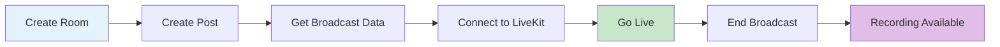

# Broadcasting Overview

The Social Plus Video SDK provides comprehensive room-based broadcasting capabilities that enable interactive live streaming with co-hosting support across all platforms.

## What is Room Broadcasting?

Room broadcasting enables collaborative live streaming where multiple hosts can broadcast together using LiveKit infrastructure. Unlike traditional single-host livestreams, rooms support real-time co-streaming, viewer interaction through live chat, and comprehensive moderation controls.

## Key Features

<CardGroup cols={2}>
  <Card title="Co-Hosting" icon="users">
    **Multiple broadcasters in one stream**
    - Invite co-hosts to join the broadcast
    - Real-time audio/video synchronization
    - Host and co-host role management
  </Card>
  <Card title="LiveKit Integration" icon="signal-stream">
    **Professional streaming infrastructure**
    - Low-latency video transmission
    - Adaptive bitrate streaming
    - Automatic quality optimization
  </Card>
  <Card title="Live Chat" icon="comments">
    **Real-time viewer engagement**
    - Integrated chat channels
    - Host and co-host badges
    - Moderation tools
  </Card>
  <Card title="Recording & Playback" icon="video">
    **Complete content lifecycle**
    - Automatic recording
    - Post-broadcast playback
    - Recording management
  </Card>
</CardGroup>

## Room Lifecycle

### Room States

| Status | Description | Actions Available |
|--------|-------------|-------------------|
| **Idle** | Room created but not broadcasting | Start stream, invite co-hosts |
| **Live** | Room is actively broadcasting | Manage broadcast, invite co-hosts |
| **Waiting Reconnect** | Temporary disconnection | Auto-reconnect, manual stop |
| **Ended** | Broadcast finished | Wait for recording |
| **Recorded** | Recording available | Playback, download |

## Broadcasting Workflow

### 1. Create Room
Set up a room with title, description, and optional configuration.

### 2. Create Room Post
Link the room to a post for social distribution in feeds or communities.

### 3. Get Broadcaster Data
Retrieve LiveKit credentials (`coHostToken`, `coHostUrl`) for streaming.

### 4. Connect to LiveKit
Use the LiveKit SDK to establish the streaming connection.

### 5. Start Broadcasting
Enable camera and microphone to begin the live broadcast.

### 6. Manage Broadcast
Invite co-hosts, monitor connection, interact with viewers.

### 7. End Broadcast
Disconnect from LiveKit and stop the room.

## Platform Support

| Platform | Status | Notes |
|----------|--------|-------|
| **iOS** | ✅ Full Support | AVFoundation + LiveKit SDK |
| **Android** | ✅ Full Support | Camera2 API + LiveKit SDK |
| **TypeScript/Web** | ✅ Full Support | WebRTC + LiveKit SDK |

## Broadcasting Architecture

The room broadcasting system uses LiveKit for real-time video streaming:

- **Host** creates the room and gets broadcaster credentials
- **Co-Hosts** are invited and receive their own credentials
- **Viewers** watch via HLS playback URL (no LiveKit connection needed)
- **Live Chat** runs through integrated chat channels

## Quick Start

<Steps>
  <Step title="Create a Room">
    Use `RoomRepository.createRoom()` to create a new room
  </Step>
  <Step title="Create a Room Post">
    Create a post linked to the room for visibility
  </Step>
  <Step title="Get Broadcaster Data">
    Call `getBroadcastData()` to get LiveKit credentials
  </Step>
  <Step title="Connect & Broadcast">
    Use LiveKit SDK to connect and publish video/audio tracks
  </Step>
</Steps>

## Next Steps

<CardGroup cols={2}>
  <Card title="Create Room" href="./create-room" icon="plus">
    Set up a room for broadcasting
  </Card>
  <Card title="Start Broadcasting" href="./start-broadcasting" icon="play">
    Connect to LiveKit and go live
  </Card>
  <Card title="Co-Host Management" href="./co-host-management" icon="users">
    Invite and manage co-hosts
  </Card>
  <Card title="Live Viewing" href="./live-viewing" icon="eye">
    How viewers watch live broadcasts
  </Card>
  <Card title="Recorded Playback" href="./recorded-playback" icon="video">
    Access recordings after broadcast ends
  </Card>
  <Card title="Manage Rooms" href="./manage-rooms" icon="gear">
    Query, update, and control rooms
  </Card>
</CardGroup>
