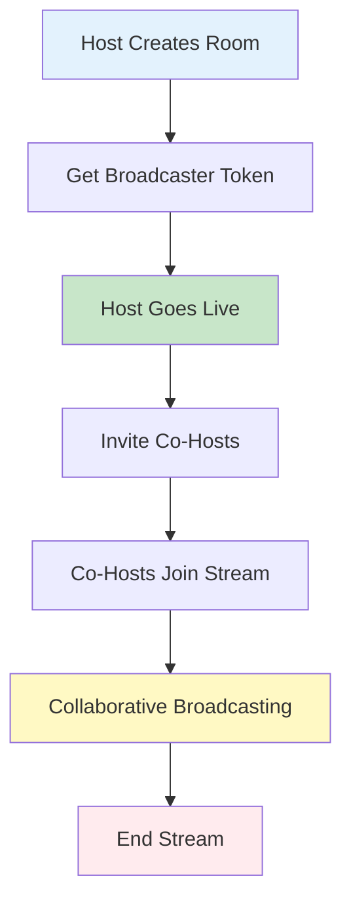
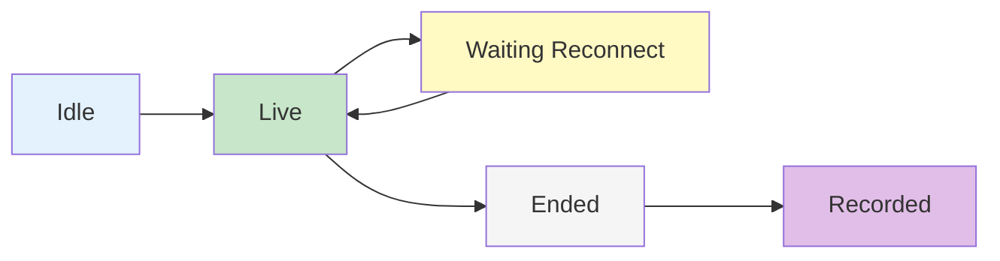

# Rooms Overview

Rooms provide an advanced broadcasting infrastructure that enables interactive live streaming with co-hosting capabilities. This page covers the core concepts, data models, and architecture of the room system.

## Overview

The Room feature extends traditional livestreaming by supporting collaborative broadcasting where multiple users can participate as co-hosts. Rooms handle video/audio synchronization, participant management, and provide comprehensive moderation controls.

## Key Features

<CardGroup cols={2}>
  <Card title="Co-Hosting" icon="users">
    **Multiple broadcasters in one stream**
    - Invite co-hosts to join the broadcast
    - Real-time audio/video synchronization
    - Host and co-host role management
    - Participant limit controls
  </Card>
  <Card title="Room Types" icon="diagram-project">
    **Flexible streaming architectures**
    - Co-Hosts: Multiple broadcasters with LiveKit
    - Parent-child room relationships
    - Isolated or linked chat channels
  </Card>
  <Card title="Lifecycle Management" icon="rotate">
    **Complete room state handling**
    - Idle → Live → Ended lifecycle
    - Waiting for reconnection states
    - Live viewing and recorded playback
    - Automatic cleanup
  </Card>
  <Card title="Moderation & Safety" icon="shield-halved">
    **AI-powered content moderation**
    - Real-time content flagging
    - Automatic termination rules
    - Moderation label tracking
    - Stream safety controls
  </Card>
</CardGroup>

## Room Types

### Co-Hosts Room

Multi-participant broadcasting using LiveKit infrastructure:



**Characteristics:**
- Multiple simultaneous broadcasters
- Real-time audio/video mixing
- Interactive participant management
- Requires LiveKit tokens for each participant

**Use Cases:**
- Panel discussions
- Interviews and Q&A sessions
- Collaborative workshops
- Multi-host shows

## Room Lifecycle



| Status | Description | Actions Available |
|--------|-------------|-------------------|
| **Idle** | Room created but not broadcasting | Start stream, invite co-hosts, delete room |
| **Live** | Room is actively broadcasting | Stop stream, invite/remove co-hosts, moderate content |
| **Waiting Reconnect** | Temporary disconnection | Auto-reconnect, manual stop |
| **Ended** | Broadcast finished | View recording, delete room |
| **Recorded** | Recording available | Playback, download, delete |

### Status Flow

1. **Creation → Idle**: Room created, awaiting first broadcast
2. **Idle → Live**: Broadcaster starts streaming
3. **Live → Waiting Reconnect**: Temporary disconnection (automatic)
4. **Waiting Reconnect → Live**: Reconnection successful
5. **Live → Ended**: Broadcast stopped (manual or automatic)
6. **Ended → Recorded**: Recording processing complete

## Room Participants

Participants represent users who can broadcast in the room:

<CodeGroup>
```swift iOS
// AmityRoomParticipant structure
struct AmityRoomParticipant {
    let type: AmityRoomParticipantType  // .host, .coHost, .unknown
    let userId: String
    let userInternalId: String?
    let user: AmityUser?  // Linked user object
}

enum AmityRoomParticipantType {
    case host      // Creator of the room, full control
    case coHost    // Invited broadcaster, limited controls
    case unknown   // Unknown participant type
}
```

```kotlin Android
// AmityRoomParticipant structure
data class AmityRoomParticipant(
    val type: AmityRoomParticipantType,  // HOST, CO_HOST, UNKNOWN
    val userId: String,
    val userInternalId: String?,
    val user: AmityUser?  // Linked user object
)

enum class AmityRoomParticipantType {
    HOST,      // Creator of the room, full control
    CO_HOST,   // Invited broadcaster, limited controls
    UNKNOWN    // Unknown participant type
}
```

```typescript TypeScript
interface AmityRoomParticipant {
  type: ParticipantType;
  userId: string;
  userInternalId?: string;
  user?: AmityUser; // Linked user object
}

enum ParticipantType {
  HOST = "host",      // Creator of the room, full control
  CO_HOST = "coHost", // Invited broadcaster, limited controls
  UNKNOWN = "unknown" // Unknown participant type
}
```
</CodeGroup>

**Participant Roles:**

| Role | Description | Permissions |
|------|-------------|-------------|
| **Host** | Creator of the room | Full control, invite/remove co-hosts, end stream |
| **Co-Host** | Invited broadcaster | Broadcast audio/video, leave stream |
| **Viewer** | Watching the stream | View only (not a room participant) |

<Info>
For detailed co-host invitation and management workflows, see [Co-Host Management](./co-host-management).
</Info>

## Room Targets

Rooms can be created for different contexts:

### Community Room

<CodeGroup>
```swift iOS
// Community target
let target = AmityRoomTarget(
    type: .community,
    communityId: "community-123",
    community: community  // Linked AmityCommunity object
)
```

```kotlin Android
// Community target
val target = AmityRoomTarget(
    type = AmityRoomTargetType.COMMUNITY,
    communityId = "community-123",
    community = community  // Linked AmityCommunity object
)
```

```typescript TypeScript
// Community target
{
  type: "community",
  communityId: "community-123",
  community: AmityCommunity // Linked object
}
```
</CodeGroup>

Broadcast to a specific community's audience.

### User Room

<CodeGroup>
```swift iOS
// User target
let target = AmityRoomTarget(
    type: .user,
    userId: "user-123",
    user: user  // Linked AmityUser object
)
```

```kotlin Android
// User target
val target = AmityRoomTarget(
    type = AmityRoomTargetType.USER,
    userId = "user-123",
    user = user  // Linked AmityUser object
)
```

```typescript TypeScript
// User target
{
  type: "user",
  userId: "user-123",
  user: AmityUser // Linked object
}
```
</CodeGroup>

Broadcast to user's timeline followers.

## Room References

Link rooms to other content types:

**Supported References:**
- **Community**: Room associated with community content
- **User**: Room on user's timeline
- **Event**: Room linked to a scheduled event

<CodeGroup>
```swift iOS
struct AmityRoomReference {
    let referenceType: AmityRoomReferenceType  // .community, .user, .event
    let referenceId: String
}
```

```kotlin Android
data class AmityRoomReference(
    val referenceType: AmityRoomReferenceType,  // COMMUNITY, USER, EVENT
    val referenceId: String
)
```

```typescript TypeScript
interface AmityRoomReference {
  referenceType: string; // "community" | "user" | "event"
  referenceId: string;
}
```
</CodeGroup>

## Channel Integration

Rooms can have integrated live chat channels for viewer interaction. Channels must be manually created after the livestream post is created.

<CodeGroup>
```swift iOS
// Channel properties on AmityRoom
let channelEnabled: Bool      // Indicates room supports live chat
let channelId: String?        // Set after channel is created
let channel: AmityChannel?    // Linked channel object
```

```kotlin Android
// Channel properties on AmityRoom
val channelEnabled: Boolean      // Indicates room supports live chat
val channelId: String?           // Set after channel is created
val channel: AmityChannel?       // Linked channel object
```

```typescript TypeScript
// Channel properties on AmityRoom
{
  channelEnabled: boolean, // Indicates room supports live chat
  channelId: string,       // Set after channel is created
  channel: AmityChannel    // Linked channel object
}
```
</CodeGroup>

**Channel Features:**
- Live chat during broadcast
- Host/Co-host badges
- Moderation tools
- Message history

<Warning>
**Manual Channel Creation Required**: Channels are **not** automatically created. You must create the channel after the post is created, passing both `postId` and `roomId`. See [Create Room - Room with Live Chat Channel](./create-room#room-with-live-chat-channel) for the complete workflow.
</Warning>

## Moderation System

AI-powered moderation monitors room content in real-time:

<CodeGroup>
```swift iOS
struct AmityRoomModeration {
    let moderationId: String
    let roomId: String
    let flagLabels: [AmityRoomModerationLabel]
    let terminateLabels: [AmityRoomModerationLabel]
    let createdAt: Date
    let updatedAt: Date
}

struct AmityRoomModerationLabel {
    let category: String  // e.g., "violence", "nudity", "hate_speech"
    let detectedAt: Date
}
```

```kotlin Android
data class AmityRoomModeration(
    val moderationId: String,
    val roomId: String,
    val flagLabels: List<AmityRoomModerationLabel>,
    val terminateLabels: List<AmityRoomModerationLabel>,
    val createdAt: DateTime,
    val updatedAt: DateTime
)

data class AmityRoomModerationLabel(
    val category: String,  // e.g., "violence", "nudity", "hate_speech"
    val detectedAt: DateTime
)
```

```typescript TypeScript
interface AmityRoomModeration {
  moderationId: string;
  roomId: string;
  flagLabels: AmityRoomModerationLabel[];
  terminateLabels: AmityRoomModerationLabel[];
  createdAt: string;
  updatedAt: string;
}

interface AmityRoomModerationLabel {
  category: string; // e.g., "violence", "nudity", "hate_speech"
  detectedAt: string;
}
```
</CodeGroup>

**Flag Labels**: Content detected but stream continues
**Terminate Labels**: Content causes automatic stream termination

<Warning>
**Automatic Termination**: When terminate-level content is detected, the room status changes to "ended" automatically and cannot be restarted.
</Warning>

## Parent-Child Room Relationships

Rooms can have hierarchical relationships for complex streaming scenarios:

<CodeGroup>
```swift iOS
// Parent-child properties on AmityRoom
let parentRoomId: String?
let parentRoom: AmityRoom?       // Linked parent room
let childRoomIds: [String]       // Array of child room IDs
```

```kotlin Android
// Parent-child properties on AmityRoom
val parentRoomId: String?
val parentRoom: AmityRoom?           // Linked parent room
val childRoomIds: List<String>       // Array of child room IDs
```

```typescript TypeScript
// Parent-child properties on AmityRoom
{
  parentRoomId: string,
  parentRoom: AmityRoom, // Linked parent room
  childRoomIds: string[] // Array of child room IDs
}
```
</CodeGroup>

**Use Cases:**
- Breakout sessions from main room
- Multi-language streams
- Regional broadcasts

## Room Data Model

Complete room object structure:

```typescript
interface AmityRoom {
  roomId: string;
  type: AmityRoomType; // "coHosts"
  
  // Target
  targetType: string;
  targetId: string;
  target: AmityRoomTarget;
  
  // Reference
  referenceType: string;
  referenceId: string;
  reference: AmityRoomReference;
  
  // Content
  title: string;
  description?: string;
  thumbnailFileId?: string;
  
  // Status
  status: AmityRoomStatus;
  
  // Participants
  participants: AmityRoomParticipant[];
  
  // Channel
  channelEnabled: boolean;
  channelId?: string;
  channel?: AmityChannel;
  
  // Streaming
  livePlaybackUrl?: string;
  durationSeconds?: number;
  
  // Relationships
  parentRoomId?: string;
  parentRoom?: AmityRoom;
  childRoomIds: string[];
  
  // Creator
  creatorId: string;
  creator?: AmityUser;
  
  // Timestamps
  createdAt: string;
  updatedAt?: string;
  liveAt?: string;
  endedAt?: string;
  recordedAt?: string;
  
  // Deletion
  isDeleted: boolean;
  deletedAt?: string;
  deletedById?: string;
  deletedBy?: AmityUser;
  
  // Moderation
  moderation?: AmityRoomModeration;
  
  // Custom data
  metadata?: Record<string, any>;
}
```

## Integration with Posts

Rooms are linked to posts for social distribution. See [Room Posts](/social-plus-sdk/social/content-management/posts/creation/room-post) for detailed post creation.

```typescript
// Create room post
const post = await postRepository.createPost({
  dataType: PostContentType.ROOM,
  targetType: 'community',
  targetId: 'community-123',
  data: {
    text: 'Join us live!',
    roomId: room.roomId,
    title: room.title
  }
});

// Access room from post
console.log(post.data.room.status); // "live"
console.log(post.data.room.livePlaybackUrl);
```

## Best Practices

<AccordionGroup>
  <Accordion title="Room Setup" icon="gear">
    Configure rooms appropriately for your use case:
    
    - Use Co-Hosts type for interactive sessions
    - Enable channels for viewer interaction
    - Set clear titles and descriptions
    - Upload thumbnails before going live
    - Configure participant limits
  </Accordion>
  
  <Accordion title="Co-Host Coordination" icon="users-gear">
    Manage co-hosts effectively:
    
    - Invite co-hosts before going live
    - Set clear moderation rules
    - Monitor participant count
    - Have backup hosts ready
    - Test audio/video before live
  </Accordion>
  
  <Accordion title="Moderation" icon="shield">
    Implement safety measures:
    
    - Review moderation labels regularly
    - Have moderation guidelines
    - Monitor flag labels proactively
    - Respond to violations quickly
    - Keep logs of moderation events
  </Accordion>
  
  <Accordion title="Performance" icon="gauge-high">
    Optimize streaming performance:
    
    - Test network bandwidth
    - Use appropriate video quality
    - Monitor connection stability
    - Have reconnection strategies
    - Clean up ended rooms
  </Accordion>
</AccordionGroup>

## Next Steps

<CardGroup cols={2}>
  <Card title="Create Room" href="./create-room" icon="plus">
    Set up new rooms for broadcasting
  </Card>
  <Card title="Start Broadcasting" href="./start-broadcasting" icon="play">
    Connect to LiveKit and go live
  </Card>
  <Card title="Co-Host Management" href="./co-host-management" icon="users">
    Invite and manage co-hosts
  </Card>
  <Card title="Live Viewing" href="./live-viewing" icon="eye">
    Watch live streams in real-time
  </Card>
  <Card title="Recorded Playback" href="./recorded-playback" icon="video">
    Play back recorded streams
  </Card>
  <Card title="Manage Rooms" href="./manage-rooms" icon="gear">
    Query, update, and control rooms
  </Card>
</CardGroup>
