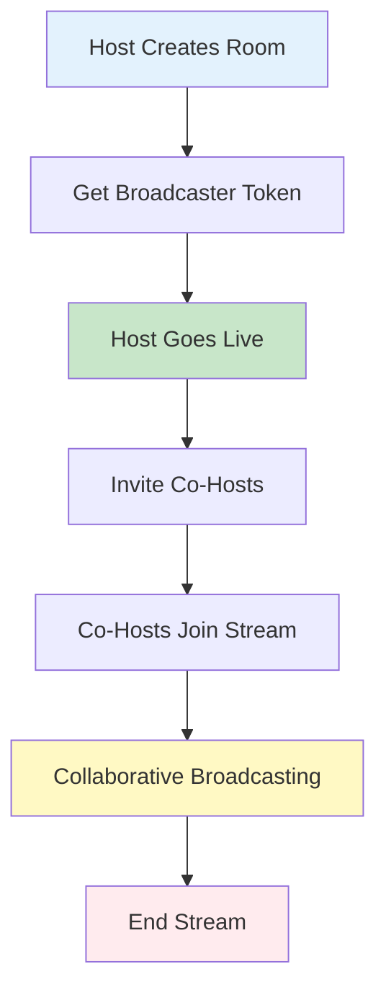
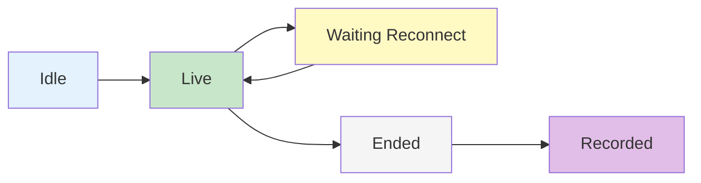

# Rooms Overview

Rooms provide an advanced broadcasting infrastructure that enables interactive live streaming with co-hosting capabilities, allowing multiple participants to broadcast together in real-time.

## Overview

The Room feature extends traditional livestreaming by supporting collaborative broadcasting where multiple users can participate as co-hosts. Rooms handle video/audio synchronization, participant management, and provide comprehensive moderation controls.

## Key Features

<CardGroup cols={2}>
  <Card title="Co-Hosting" icon="users">
    **Multiple broadcasters in one stream**
    - Invite co-hosts to join the broadcast
    - Real-time audio/video synchronization
    - Host and co-host role management
    - Participant limit controls
  </Card>
  <Card title="Room Types" icon="diagram-project">
    **Flexible streaming architectures**
    - Co-Hosts: Multiple broadcasters with LiveKit
    - Direct Streaming: Single broadcaster RTMP
    - Parent-child room relationships
    - Isolated or linked chat channels
  </Card>
  <Card title="Lifecycle Management" icon="rotate">
    **Complete room state handling**
    - Idle → Live → Ended lifecycle
    - Waiting for reconnection states
    - Recording and playback
    - Automatic cleanup
  </Card>
  <Card title="Moderation & Safety" icon="shield-halved">
    **AI-powered content moderation**
    - Real-time content flagging
    - Automatic termination rules
    - Moderation label tracking
    - Stream safety controls
  </Card>
</CardGroup>

## Room Types

### Co-Hosts Room

Multi-participant broadcasting using LiveKit infrastructure:



**Characteristics:**
- Multiple simultaneous broadcasters
- Real-time audio/video mixing
- Interactive participant management
- Requires LiveKit tokens for each participant

**Use Cases:**
- Panel discussions
- Interviews and Q&A sessions
- Collaborative workshops
- Multi-host shows

### Direct Streaming Room

Single broadcaster using RTMP streaming:

**Characteristics:**
- Single broadcaster only
- RTMP URL for streaming
- Traditional livestream model
- Lower latency for single host

**Use Cases:**
- Solo broadcasts
- Presentations
- Tutorials
- Simple livestreams

## Room Lifecycle



| Status | Description | Actions Available |
|--------|-------------|-------------------|
| **Idle** | Room created but not broadcasting | Start stream, invite co-hosts, delete room |
| **Live** | Room is actively broadcasting | Stop stream, invite/remove co-hosts, moderate content |
| **Waiting Reconnect** | Temporary disconnection | Auto-reconnect, manual stop |
| **Ended** | Broadcast finished | View recording, delete room |
| **Recorded** | Recording available | Playback, download, delete |

## Room Participants

Participants represent users who can broadcast in the room:

```typescript
interface AmityRoomParticipant {
  type: ParticipantType;
  userId: string;
  userInternalId?: string;
  user?: AmityUser; // Linked user object
}

enum ParticipantType {
  HOST = "host",      // Creator of the room, full control
  CO_HOST = "coHost", // Invited broadcaster, limited controls
  UNKNOWN = "unknown" // Unknown participant type
}
```

**Participant Roles:**

| Role | Description | Permissions |
|------|-------------|-------------|
| **Host** | Creator of the room | Full control, invite/remove co-hosts, end stream |
| **Co-Host** | Invited broadcaster | Broadcast audio/video, leave stream |
| **Viewer** | Watching the stream | View only (not a room participant) |

## Room Targets

Rooms can be created for different contexts:

### Community Room

```typescript
{
  type: "community",
  communityId: "community-123",
  community: AmityCommunity // Linked object
}
```

Broadcast to a specific community's audience.

### User Room

```typescript
{
  type: "user",
  userId: "user-123",
  user: AmityUser // Linked object
}
```

Broadcast to user's timeline followers.

## Room References

Link rooms to other content types:

**Supported References:**
- **Community**: Room associated with community content
- **User**: Room on user's timeline
- **Event**: Room linked to a scheduled event

```typescript
interface AmityRoomReference {
  referenceType: string; // "community" | "user" | "event"
  referenceId: string;
}
```

## Channel Integration

Rooms can have integrated chat channels for viewer interaction:

```typescript
{
  channelEnabled: boolean,
  channelId: string,
  channel: AmityChannel // Linked channel object
}
```

**Channel Features:**
- Live chat during broadcast
- Host/Co-host badges
- Moderation tools
- Message history

<Info>
**Automatic Channel Creation**: When `channelEnabled: true`, a chat channel is automatically created and linked to the room.
</Info>

## Moderation System

AI-powered moderation monitors room content in real-time:

```typescript
interface AmityRoomModeration {
  moderationId: string;
  roomId: string;
  flagLabels: AmityRoomModerationLabel[];
  terminateLabels: AmityRoomModerationLabel[];
  createdAt: string;
  updatedAt: string;
}

interface AmityRoomModerationLabel {
  category: string; // e.g., "violence", "nudity", "hate_speech"
  detectedAt: string;
}
```

**Flag Labels**: Content detected but stream continues
**Terminate Labels**: Content causes automatic stream termination

<Warning>
**Automatic Termination**: When terminate-level content is detected, the room status changes to "ended" automatically and cannot be restarted.
</Warning>

## Parent-Child Room Relationships

Rooms can have hierarchical relationships for complex streaming scenarios:

```typescript
{
  parentRoomId: string,
  parentRoom: AmityRoom, // Linked parent room
  childRoomIds: string[] // Array of child room IDs
}
```

**Use Cases:**
- Breakout sessions from main room
- Multi-language streams
- Regional broadcasts

## Room Data Model

Complete room object structure:

```typescript
interface AmityRoom {
  roomId: string;
  type: AmityRoomType; // "coHosts" | "directStreaming"
  
  // Target
  targetType: string;
  targetId: string;
  target: AmityRoomTarget;
  
  // Reference
  referenceType: string;
  referenceId: string;
  reference: AmityRoomReference;
  
  // Content
  title: string;
  description?: string;
  thumbnailFileId?: string;
  
  // Status
  status: AmityRoomStatus;
  
  // Participants
  participants: AmityRoomParticipant[];
  
  // Channel
  channelEnabled: boolean;
  channelId?: string;
  channel?: AmityChannel;
  
  // Streaming
  livePlaybackUrl?: string;
  durationSeconds?: number;
  
  // Relationships
  parentRoomId?: string;
  parentRoom?: AmityRoom;
  childRoomIds: string[];
  
  // Creator
  creatorId: string;
  creator?: AmityUser;
  
  // Timestamps
  createdAt: string;
  updatedAt?: string;
  liveAt?: string;
  endedAt?: string;
  recordedAt?: string;
  
  // Deletion
  isDeleted: boolean;
  deletedAt?: string;
  deletedById?: string;
  deletedBy?: AmityUser;
  
  // Moderation
  moderation?: AmityRoomModeration;
  
  // Custom data
  metadata?: Record<string, any>;
}
```

## Room Status Flow

Understanding room transitions:

1. **Creation → Idle**: Room created, awaiting first broadcast
2. **Idle → Live**: Broadcaster starts streaming
3. **Live → Waiting Reconnect**: Temporary disconnection (automatic)
4. **Waiting Reconnect → Live**: Reconnection successful
5. **Live → Ended**: Broadcast stopped (manual or automatic)
6. **Ended → Recorded**: Recording processing complete

## Co-Host Management

The co-host system allows hosts to invite users to broadcast together in real-time. Co-hosts can join the stream, broadcast their audio/video, and interact with viewers.

### Co-Host Invitations

Hosts can invite users to join as co-hosts. The invitation system supports accepting, rejecting, and cancelling invitations.

<Note>
Co-host invitations are sent one user at a time. To invite multiple co-hosts, call the invitation function for each user.
</Note>

#### Send Co-Host Invitation

<CodeGroup>

```swift iOS
do {
    try await room.createInvitation("<user_id>")
    print("Co-host invitation sent successfully.")
} catch {
    print("Failed to send co-host invitation: \(error.localizedDescription)")
}
```

```kotlin Android
fun inviteCoHost(
    room: AmityRoom,
    userId: String
) {
    room.createInvitation(userId)
        .doOnComplete {
            // Co-host invitation sent successfully
        }
        .doOnError { error ->
            // Handle error
        }
        .subscribe()
}
```

```typescript TypeScript
async function inviteCoHost(room: Amity.Room, userId: string) {
  try {
    await room.createInvitation(userId);
    // Handle successful invitation
  } catch (error) {
    // Handle error
  }
}
```

```dart Flutter
Future<void> inviteCoHost(AmityRoom room, String userId) async {
  try {
    await room.createInvitation(userId);
    print("Co-host invitation sent successfully.");
  } catch (error) {
    print("Failed to send co-host invitation: $error");
  }
}
```

</CodeGroup>

#### Get Room Invitations

Retrieve all invitations sent for a specific room.

<CodeGroup>

```swift iOS
var token: AmityNotificationToken?
let repository = AmityInvitationRepository(client: client)
token = repository.getInvitations(
    targetId: room.roomId,
    targetType: .room
).observe({ collection, change, error in
    // Observe changes in the invitation collection
})
```

```kotlin Android
fun getCoHostInvitations(roomId: String) {
    AmityVideoClient.newInvitationRepository()
        .getInvitations(
            targetId = roomId,
            targetType = AmityInvitation.TargetType.ROOM.value
        )
        .doOnNext { invitations ->
            // PagingData<AmityInvitation>
        }
        .doOnError { error ->
            // Handle error
        }
        .subscribe()
}
```

```typescript TypeScript
import { InvitationRepository, InvitationTargetType } from '@amityco/ts-sdk';

function getCoHostInvitations(roomId: string) {
  const unsubscribe = InvitationRepository.getInvitations(
    {
      targetId: roomId,
      targetType: InvitationTargetType.Room,
      limit: 20,
    },
    ({ data, loading, error }) => {
      if (data) {
        // Process the invitations
      }
    },
  );
  return unsubscribe;
}
```

```dart Flutter
void getCoHostInvitations(String roomId) {
  final invitationRepository = AmityInvitationRepository();
  
  invitationRepository.getInvitations(
    targetId: roomId,
    targetType: AmityInvitationTargetType.room,
  ).listen((invitations) {
    // Process the invitations
    for (final invitation in invitations) {
      print("Invitation: ${invitation.invitedUserId}");
    }
  });
}
```

</CodeGroup>

#### Accept/Reject Co-Host Invitation

<CodeGroup>

```swift iOS
// Accept invitation
if let invitation = await room.getInvitation() {
    do {
        try await invitation.accept()
        print("Co-host invitation accepted.")
    } catch {
        print("Failed to accept: \(error.localizedDescription)")
    }
}

// Reject invitation
if let invitation = await room.getInvitation() {
    do {
        try await invitation.reject()
        print("Co-host invitation rejected.")
    } catch {
        print("Failed to reject: \(error.localizedDescription)")
    }
}
```

```kotlin Android
// Accept invitation
fun acceptCoHostInvitation(invitation: AmityInvitation) {
    invitation.accept()
        .doOnComplete {
            // Co-host invitation accepted
        }
        .doOnError { error ->
            // Handle error
        }
        .subscribe()
}

// Reject invitation
fun rejectCoHostInvitation(invitation: AmityInvitation) {
    invitation.reject()
        .doOnComplete {
            // Co-host invitation rejected
        }
        .doOnError { error ->
            // Handle error
        }
        .subscribe()
}
```

```typescript TypeScript
// Accept invitation
async function acceptCoHostInvitation(invitation: Amity.Invitation) {
  try {
    await invitation.accept();
    // Handle successful acceptance
  } catch (error) {
    // Handle error
  }
}

// Reject invitation
async function rejectCoHostInvitation(invitation: Amity.Invitation) {
  try {
    await invitation.reject();
    // Handle successful rejection
  } catch (error) {
    // Handle error
  }
}
```

```dart Flutter
// Accept invitation
Future<void> acceptCoHostInvitation(AmityInvitation invitation) async {
  try {
    await invitation.accept();
    print("Co-host invitation accepted.");
  } catch (error) {
    print("Failed to accept: $error");
  }
}

// Reject invitation
Future<void> rejectCoHostInvitation(AmityInvitation invitation) async {
  try {
    await invitation.reject();
    print("Co-host invitation rejected.");
  } catch (error) {
    print("Failed to reject: $error");
  }
}
```

</CodeGroup>

### Co-Host Events

Monitor real-time co-host activity by subscribing to co-host events. These events notify you when invitations are sent, accepted, rejected, cancelled, or when co-hosts join, leave, or are removed from the room.

#### Event Types

| Event | Description | Triggered When |
|-------|-------------|----------------|
| `CoHostInvited` | New invitation sent | Host invites a user to co-host |
| `CoHostInviteAccepted` | Invitation accepted | Invited user accepts the invitation |
| `CoHostInviteRejected` | Invitation rejected | Invited user declines the invitation |
| `CoHostInviteCancelled` | Invitation cancelled | Host cancels a pending invitation |
| `CoHostJoined` | Co-host joined stream | Co-host connects and starts broadcasting |
| `CoHostLeft` | Co-host left stream | Co-host voluntarily leaves the broadcast |
| `CoHostRemoved` | Co-host removed | Host removes a co-host from the stream |

#### Subscribing to Co-Host Events

<CodeGroup>

```swift iOS
var token: AmityNotificationToken?

func observeCoHostEvents(roomId: String) {
    let repository = AmityVideoClient.shared.roomRepository
    token = repository.getCoHostEvent(roomId: roomId).observe { event in
        switch event {
        case .coHostInvited(let invitation):
            if invitation.invitedUserId == AmityClient.currentUserId {
                // Current user was invited as co-host
                handleInvitation(invitation)
            }
            
        case .coHostInviteAccepted(let invitation):
            if invitation.invitedUserId == AmityClient.currentUserId {
                // Current user's invitation was accepted
                handleAccepted(invitation)
            }
            
        case .coHostJoined(let room, let actorId):
            // A co-host joined the stream
            if let cohost = room.participants.first(where: { $0.type == .coHost }) {
                updateCoHostUI(cohost)
            }
            
        case .coHostLeft(let room, let actorId):
            // Co-host voluntarily left
            clearCoHostUI()
            
        case .coHostRemoved(let room, let actorId):
            // Co-host was removed by host
            clearCoHostUI()
            
        case .coHostInviteCancelled(let invitation):
            // Invitation was cancelled
            clearInvitationUI()
            
        case .coHostInviteRejected(let invitation):
            // Invitation was rejected
            clearInvitationUI()
        }
    }
}
```

```kotlin Android
fun observeCoHostEvents(roomId: String) {
    AmityVideoClient.newRoomRepository()
        .getCoHostEvent(roomId)
        .doOnNext { event ->
            when (event) {
                is AmityCoHostEvent.CoHostInvited -> {
                    // Check if current user was invited
                    if (event.invitation.getInvitedUserId() == AmityCoreClient.getUserId()) {
                        // Show invitation UI
                        updateState(
                            invitation = event.invitation
                        )
                    }
                }

                is AmityCoHostEvent.CoHostInviteAccepted -> {
                    // Invitation was accepted
                    if (event.invitation.getInvitedUserId() == AmityCoreClient.getUserId()) {
                        updateState(
                            cohostUserId = event.invitation.getInvitedUserId(),
                            cohostUser = event.invitation.getInvitedUser()
                        )
                    }
                }

                is AmityCoHostEvent.CoHostJoined -> {
                    // Co-host joined the stream
                    event.room
                        .getParticipants()
                        .firstOrNull { it.type == AmityRoom.ParticipantType.CoHost }
                        ?.let { cohostParticipant ->
                            updateState(
                                cohostUserId = cohostParticipant.userId,
                                cohostUser = cohostParticipant.user
                            )
                        }
                }

                is AmityCoHostEvent.CoHostRemoved,
                is AmityCoHostEvent.CoHostLeft,
                is AmityCoHostEvent.CoHostInviteCancelled,
                is AmityCoHostEvent.CoHostInviteRejected -> {
                    // Clear co-host state
                    updateState(
                        invitation = null,
                        cohostUserId = null,
                        cohostUser = null
                    )
                }
            }
        }
        .onErrorComplete()
        .subscribeOn(Schedulers.io())
        .subscribe()
}
```

```typescript TypeScript
import { RoomRepository, CoHostEvent } from '@amityco/ts-sdk';

function observeCoHostEvents(roomId: string) {
  const unsubscribe = RoomRepository.getCoHostEvent(roomId, (event) => {
    switch (event.type) {
      case CoHostEvent.CoHostInvited:
        // Check if current user was invited
        if (event.invitation.invitedUserId === currentUserId) {
          setInvitation(event.invitation);
        }
        break;

      case CoHostEvent.CoHostInviteAccepted:
        // Invitation was accepted
        setCoHost({
          userId: event.invitation.invitedUserId,
          user: event.invitation.invitedUser,
        });
        break;

      case CoHostEvent.CoHostJoined:
        // Co-host joined the stream
        const cohost = event.room.participants.find(
          (p) => p.type === 'coHost'
        );
        if (cohost) {
          setCoHost({ userId: cohost.userId, user: cohost.user });
        }
        break;

      case CoHostEvent.CoHostLeft:
      case CoHostEvent.CoHostRemoved:
      case CoHostEvent.CoHostInviteCancelled:
      case CoHostEvent.CoHostInviteRejected:
        // Clear co-host state
        setInvitation(null);
        setCoHost(null);
        break;
    }
  });

  return unsubscribe;
}
```

```dart Flutter
void observeCoHostEvents(String roomId) {
  final roomRepository = AmityVideoClient.newRoomRepository();
  
  roomRepository.getCoHostEvent(roomId).listen((event) {
    if (event is AmityCoHostInvited) {
      // Check if current user was invited
      if (event.invitation.invitedUserId == AmityCoreClient.userId) {
        setState(() {
          invitation = event.invitation;
        });
      }
    } else if (event is AmityCoHostInviteAccepted) {
      // Invitation was accepted
      setState(() {
        coHostUserId = event.invitation.invitedUserId;
        coHostUser = event.invitation.invitedUser;
      });
    } else if (event is AmityCoHostJoined) {
      // Co-host joined the stream
      final cohost = event.room.participants.firstWhere(
        (p) => p.type == ParticipantType.coHost,
        orElse: () => null,
      );
      if (cohost != null) {
        setState(() {
          coHostUserId = cohost.userId;
          coHostUser = cohost.user;
        });
      }
    } else if (event is AmityCoHostLeft ||
               event is AmityCoHostRemoved ||
               event is AmityCoHostInviteCancelled ||
               event is AmityCoHostInviteRejected) {
      // Clear co-host state
      setState(() {
        invitation = null;
        coHostUserId = null;
        coHostUser = null;
      });
    }
  });
}
```

</CodeGroup>

#### Event Data Structure

```typescript
// Base event structure
interface AmityCoHostEvent {
  roomId: string;
}

// Invitation-based events
interface CoHostInvited extends AmityCoHostEvent {
  invitationId: string;
  invitation: AmityInvitation;
}

interface CoHostInviteAccepted extends AmityCoHostEvent {
  invitationId: string;
  invitation: AmityInvitation;
}

interface CoHostInviteCancelled extends AmityCoHostEvent {
  invitationId: string;
  invitation: AmityInvitation;
}

interface CoHostInviteRejected extends AmityCoHostEvent {
  invitationId: string;
  invitation: AmityInvitation;
}

// Room-based events
interface CoHostJoined extends AmityCoHostEvent {
  room: AmityRoom;
  actorInternalId?: string;
}

interface CoHostLeft extends AmityCoHostEvent {
  room: AmityRoom;
  actorInternalId?: string;
}

interface CoHostRemoved extends AmityCoHostEvent {
  room: AmityRoom;
  actorInternalId?: string;
}
```

### Getting Broadcaster Data

After accepting a co-host invitation, retrieve the broadcaster data to connect to the streaming service.

**Broadcast Data Types**

| Type | Description | Properties |
|------|-------------|------------|
| `CoHosts` | Multi-host co-streaming | `coHostToken`, `coHostUrl` |
| `DirectStreaming` | Single-host streaming | `directStreamUrl` |

<CodeGroup>

```swift iOS
func getBroadcasterData(roomId: String) async {
    do {
        let broadcastData = try await roomRepository.getBroadcastData(roomId: roomId)
        
        switch broadcastData {
        case .coHosts(let data):
            // Use coHostToken and coHostUrl for multi-host streaming
            let token = data.coHostToken
            let url = data.coHostUrl
            // Connect to LiveKit with these credentials
        case .directStreaming(let data):
            // Use directStreamUrl for single-host streaming
            let streamUrl = data.directStreamUrl
        }
    } catch {
        // Handle error
    }
}
```

```kotlin Android
fun getBroadcasterData(
    roomRepository: AmityRoomRepository,
    roomId: String
) {
    roomRepository.getBroadcastData(roomId = roomId)
        .doOnSuccess { broadcastData: AmityRoomBroadcastData ->
            when (broadcastData) {
                is AmityRoomBroadcastData.CoHosts -> {
                    // Use coHostToken and coHostUrl for multi-host streaming
                    val token = broadcastData.getCoHostToken()
                    val url = broadcastData.getCoHostUrl()
                    // Connect to LiveKit with these credentials
                }
                is AmityRoomBroadcastData.DirectStreaming -> {
                    // Use directStreamUrl for single-host streaming
                    val streamUrl = broadcastData.getDirectStreamUrl()
                }
            }
        }
        .subscribe()
}
```

```typescript TypeScript
import { RoomRepository } from '@amityco/ts-sdk';

async function getBroadcasterData(roomId: string) {
  const broadcastData = await RoomRepository.getBroadcastData(roomId);

  if (broadcastData.type === 'coHosts') {
    // Use coHostToken and coHostUrl for multi-host streaming
    const token = broadcastData.coHostToken;
    const url = broadcastData.coHostUrl;
    // Connect to LiveKit with these credentials
  } else if (broadcastData.type === 'directStreaming') {
    // Use directStreamUrl for single-host streaming
    const streamUrl = broadcastData.directStreamUrl;
  }

  return broadcastData;
}
```

```dart Flutter
Future<void> getBroadcasterData(String roomId) async {
  try {
    final broadcastData = await AmityRoomRepository().getBroadcastData(
      roomId: roomId,
    );
    
    if (broadcastData is AmityCoHostsBroadcastData) {
      // Use coHostToken and coHostUrl for multi-host streaming
      final token = broadcastData.coHostToken;
      final url = broadcastData.coHostUrl;
      // Connect to LiveKit with these credentials
    } else if (broadcastData is AmityDirectStreamingBroadcastData) {
      // Use directStreamUrl for single-host streaming
      final streamUrl = broadcastData.directStreamUrl;
    }
  } catch (error) {
    print("Failed to get broadcaster data: $error");
  }
}
```

</CodeGroup>

### Connecting to LiveKit

After retrieving the co-host broadcast data, use the LiveKit client library to connect to the streaming server.

<CodeGroup>

```swift iOS
import LiveKit

func connectToLiveKit(coHostUrl: String, coHostToken: String) async {
    // Create LiveKit Room instance (not to be confused with AmityRoom)
    let liveKitRoom = Room()
    
    do {
        try await liveKitRoom.connect(url: coHostUrl, token: coHostToken)
        print("Connected to LiveKit room successfully")
        
        // Start publishing audio/video tracks
        let localParticipant = liveKitRoom.localParticipant
        try await localParticipant.setCamera(enabled: true)
        try await localParticipant.setMicrophone(enabled: true)
    } catch {
        print("Failed to connect: \(error.localizedDescription)")
    }
}
```

```kotlin Android
import io.livekit.android.room.Room as LiveKitRoom
import io.livekit.android.LiveKit

fun connectToLiveKit(
    broadcastData: AmityRoomBroadcastData.CoHosts
) {
    // Create LiveKit Room instance (not to be confused with AmityRoom)
    val liveKitRoom: LiveKitRoom = LiveKit.create(applicationContext)
    
    liveKitRoom.connect(
        url = broadcastData.getCoHostUrl(),
        token = broadcastData.getCoHostToken()
    )
    
    // Start publishing audio/video tracks
    val localParticipant = liveKitRoom.localParticipant
    localParticipant.setCameraEnabled(true)
    localParticipant.setMicrophoneEnabled(true)
}
```

```typescript TypeScript
import { Room as LiveKitRoom, RoomEvent } from 'livekit-client';

async function connectToLiveKit(coHostUrl: string, coHostToken: string) {
  // Create LiveKit Room instance (not to be confused with Amity.Room)
  const liveKitRoom = new LiveKitRoom();

  liveKitRoom.on(RoomEvent.Connected, () => {
    console.log('Connected to LiveKit room successfully');
  });

  try {
    await liveKitRoom.connect(coHostUrl, coHostToken);
    
    // Start publishing audio/video tracks
    const localParticipant = liveKitRoom.localParticipant;
    await localParticipant.setCameraEnabled(true);
    await localParticipant.setMicrophoneEnabled(true);
  } catch (error) {
    console.error('Failed to connect:', error);
  }

  return liveKitRoom;
}
```

```dart Flutter
import 'package:livekit_client/livekit_client.dart';

Future<Room> connectToLiveKit(String coHostUrl, String coHostToken) async {
  // Create LiveKit Room instance (not to be confused with AmityRoom)
  final liveKitRoom = Room();
  
  liveKitRoom.addListener(() {
    if (liveKitRoom.connectionState == ConnectionState.connected) {
      print('Connected to LiveKit room successfully');
    }
  });
  
  try {
    await liveKitRoom.connect(coHostUrl, coHostToken);
    
    // Start publishing audio/video tracks
    final localParticipant = liveKitRoom.localParticipant;
    await localParticipant?.setCameraEnabled(true);
    await localParticipant?.setMicrophoneEnabled(true);
  } catch (error) {
    print('Failed to connect: $error');
  }
  
  return liveKitRoom;
}
```

</CodeGroup>

<Note>
For detailed LiveKit setup instructions, event handling, and advanced features, refer to the official [LiveKit documentation](https://docs.livekit.io/intro/basics/connect/).
</Note>

### Room Playback

Retrieve playback URLs based on the room status for live or recorded content.

<CodeGroup>

```swift iOS
func getRoomPlaybackUrls(room: AmityRoom) -> [String] {
    var playbackUrls: [String] = []
    
    switch room.status {
    case .live:
        // Get live playback URL for active broadcast
        if let liveUrl = room.getLivePlaybackUrl() {
            playbackUrls.append(liveUrl)
        }
    case .recorded:
        // Get recorded playback URLs after broadcast ends
        let recordedInfos = room.getRecordedPlaybackInfos()
        playbackUrls = recordedInfos.compactMap { $0.url }
    default:
        // Room is idle or ended, no playback available
        break
    }
    
    return playbackUrls
}
```

```kotlin Android
fun getRoomPlaybackUrls(room: AmityRoom): List<String> {
    val liveUrl = room.getLivePlaybackUrl()
    
    return if (room.getStatus() != AmityRoomStatus.RECORDED && !liveUrl.isNullOrBlank()) {
        // Room is live, use live playback URL
        listOf(liveUrl)
    } else if (room.getStatus() == AmityRoomStatus.RECORDED) {
        // Room has ended and recording is available
        room.getRecordedPlaybackInfos()
            ?.mapNotNull { it.url }
            ?: emptyList()
    } else {
        // Room is idle or ended without recording
        emptyList()
    }
}
```

```typescript TypeScript
import { RoomRepository } from '@amityco/ts-sdk';

async function getRoomPlaybackUrls(room: Amity.Room): Promise<string[]> {
  let playbackUrls: string[] = [];
  
  if (room.status === 'live') {
    // Get live playback URL for active broadcast
    const liveUrl = room.livePlaybackUrl;
    if (liveUrl) {
      playbackUrls.push(liveUrl);
    }
  } else if (room.status === 'recorded') {
    // Get recorded playback URLs after broadcast ends
    const recordedInfos = room.recordedPlaybackInfos || [];
    playbackUrls = recordedInfos
      .map(info => info.url)
      .filter((url): url is string => !!url);
  }
  
  return playbackUrls;
}
```

```dart Flutter
List<String> getRoomPlaybackUrls(AmityRoom room) {
  List<String> playbackUrls = [];
  
  switch (room.status) {
    case AmityRoomStatus.live:
      // Get live playback URL for active broadcast
      final liveUrl = room.livePlaybackUrl;
      if (liveUrl != null && liveUrl.isNotEmpty) {
        playbackUrls.add(liveUrl);
      }
      break;
    case AmityRoomStatus.recorded:
      // Get recorded playback URLs after broadcast ends
      final recordedInfos = room.recordedPlaybackInfos ?? [];
      playbackUrls = recordedInfos
          .map((info) => info.url)
          .whereType<String>()
          .toList();
      break;
    default:
      // Room is idle or ended, no playback available
      break;
  }
  
  return playbackUrls;
}
```

</CodeGroup>

## Best Practices

<AccordionGroup>
  <Accordion title="Room Setup" icon="gear">
    Configure rooms appropriately for your use case:
    
    - Use Co-Hosts type for interactive sessions
    - Enable channels for viewer interaction
    - Set clear titles and descriptions
    - Upload thumbnails before going live
    - Configure participant limits
  </Accordion>
  
  <Accordion title="Co-Host Management" icon="users-gear">
    Manage co-hosts effectively:
    
    - Invite co-hosts before going live
    - Set clear moderation rules
    - Monitor participant count
    - Have backup hosts ready
    - Test audio/video before live
  </Accordion>
  
  <Accordion title="Moderation" icon="shield">
    Implement safety measures:
    
    - Review moderation labels regularly
    - Have moderation guidelines
    - Monitor flag labels proactively
    - Respond to violations quickly
    - Keep logs of moderation events
  </Accordion>
  
  <Accordion title="Performance" icon="gauge-high">
    Optimize streaming performance:
    
    - Test network bandwidth
    - Use appropriate video quality
    - Monitor connection stability
    - Have reconnection strategies
    - Clean up ended rooms
  </Accordion>
</AccordionGroup>

## Common Use Cases

### Panel Discussion Room

```typescript
// Create a room for panel discussion with multiple co-hosts
const room = await roomRepository.createRoom({
  title: "Product Roadmap Panel",
  description: "Q4 roadmap discussion with product team",
  type: AmityRoomType.CO_HOSTS,
  targetType: "community",
  targetId: "community-123",
  channelEnabled: true,
  participants: [
    { type: "user", userId: "host-id" },
    { type: "user", userId: "panelist-1-id" },
    { type: "user", userId: "panelist-2-id" }
  ]
});
```

### Event Livestream

```typescript
// Create a room linked to a scheduled event
const room = await roomRepository.createRoom({
  title: event.title,
  description: event.description,
  type: AmityRoomType.CO_HOSTS,
  referenceType: "event",
  referenceId: event.eventId,
  targetType: "community",
  targetId: event.originId,
  channelEnabled: true,
  thumbnailFileId: event.coverImageFileId
});
```

### Solo Broadcast

```typescript
// Simple single-host livestream
const room = await roomRepository.createRoom({
  title: "Weekly Update",
  description: "This week's highlights and announcements",
  type: AmityRoomType.DIRECT_STREAMING,
  targetType: "user",
  targetId: currentUserId,
  channelEnabled: true
});
```

## Integration with Posts

Rooms are linked to posts for social distribution:

```typescript
// Create livestream post with room
const post = await postRepository.createLiveStreamPost({
  targetType: AmityPostTargetType.COMMUNITY,
  targetId: "community-123",
  roomId: room.roomId,
  text: "Join us live!",
  title: room.title
});

// Access room from post
console.log(post.data.room.status); // "live"
console.log(post.data.room.livePlaybackUrl);
```

## Next Steps

<CardGroup cols={3}>
  <Card title="Create Room" href="./create-room" icon="plus">
    Set up new rooms and start broadcasting
  </Card>
  <Card title="Manage Rooms" href="./manage-rooms" icon="gear">
    Query, update, and control rooms
  </Card>
  <Card title="Livestream Posts" href="/social-plus-sdk/social/posts/livestream-posts" icon="video">
    Create posts with room integration
  </Card>
</CardGroup>
