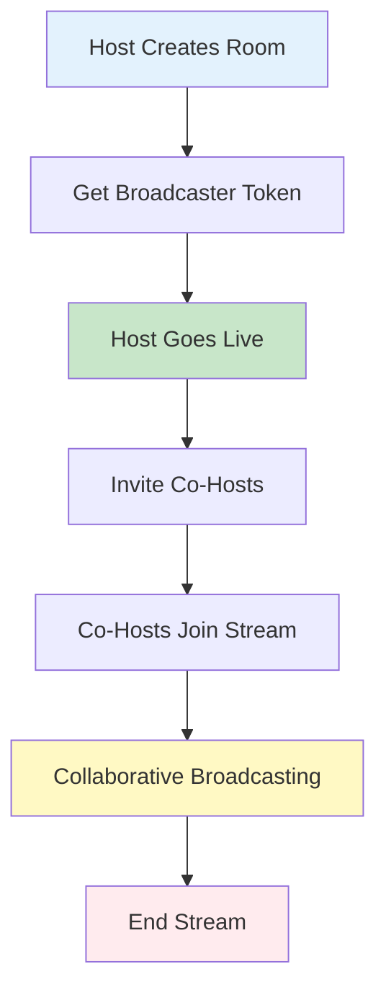
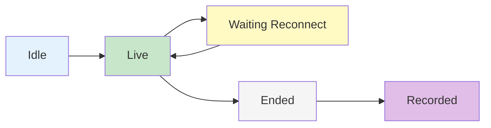

# Rooms Overview

Rooms provide an advanced broadcasting infrastructure that enables interactive live streaming with co-hosting capabilities, allowing multiple participants to broadcast together in real-time.

## Overview

The Room feature extends traditional livestreaming by supporting collaborative broadcasting where multiple users can participate as co-hosts. Rooms handle video/audio synchronization, participant management, and provide comprehensive moderation controls.

## Key Features

<CardGroup cols={2}>
  <Card title="Co-Hosting" icon="users">
    **Multiple broadcasters in one stream**
    - Invite co-hosts to join the broadcast
    - Real-time audio/video synchronization
    - Host and co-host role management
    - Participant limit controls
  </Card>
  <Card title="Room Types" icon="diagram-project">
    **Flexible streaming architectures**
    - Co-Hosts: Multiple broadcasters with LiveKit
    - Direct Streaming: Single broadcaster RTMP
    - Parent-child room relationships
    - Isolated or linked chat channels
  </Card>
  <Card title="Lifecycle Management" icon="rotate">
    **Complete room state handling**
    - Idle → Live → Ended lifecycle
    - Waiting for reconnection states
    - Recording and playback
    - Automatic cleanup
  </Card>
  <Card title="Moderation & Safety" icon="shield-halved">
    **AI-powered content moderation**
    - Real-time content flagging
    - Automatic termination rules
    - Moderation label tracking
    - Stream safety controls
  </Card>
</CardGroup>

## Room Types

### Co-Hosts Room

Multi-participant broadcasting using LiveKit infrastructure:



**Characteristics:**
- Multiple simultaneous broadcasters
- Real-time audio/video mixing
- Interactive participant management
- Requires LiveKit tokens for each participant

**Use Cases:**
- Panel discussions
- Interviews and Q&A sessions
- Collaborative workshops
- Multi-host shows

### Direct Streaming Room

Single broadcaster using RTMP streaming:

**Characteristics:**
- Single broadcaster only
- RTMP URL for streaming
- Traditional livestream model
- Lower latency for single host

**Use Cases:**
- Solo broadcasts
- Presentations
- Tutorials
- Simple livestreams

## Room Lifecycle



| Status | Description | Actions Available |
|--------|-------------|-------------------|
| **Idle** | Room created but not broadcasting | Start stream, invite co-hosts, delete room |
| **Live** | Room is actively broadcasting | Stop stream, invite/remove co-hosts, moderate content |
| **Waiting Reconnect** | Temporary disconnection | Auto-reconnect, manual stop |
| **Ended** | Broadcast finished | View recording, delete room |
| **Recorded** | Recording available | Playback, download, delete |

## Room Participants

Participants represent users who can broadcast in the room:

```typescript
interface AmityRoomParticipant {
  type: "user";
  userId: string;
  user: AmityUser; // Linked user object
}
```

**Participant Roles:**
- **Host**: Creator of the room, full control
- **Co-Host**: Invited broadcaster, limited controls
- **Viewer**: Watching the stream (not a participant)

## Room Targets

Rooms can be created for different contexts:

### Community Room

```typescript
{
  type: "community",
  communityId: "community-123",
  community: AmityCommunity // Linked object
}
```

Broadcast to a specific community's audience.

### User Room

```typescript
{
  type: "user",
  userId: "user-123",
  user: AmityUser // Linked object
}
```

Broadcast to user's timeline followers.

## Room References

Link rooms to other content types:

**Supported References:**
- **Community**: Room associated with community content
- **User**: Room on user's timeline
- **Event**: Room linked to a scheduled event

```typescript
interface AmityRoomReference {
  referenceType: string; // "community" | "user" | "event"
  referenceId: string;
}
```

## Channel Integration

Rooms can have integrated chat channels for viewer interaction:

```typescript
{
  channelEnabled: boolean,
  channelId: string,
  channel: AmityChannel // Linked channel object
}
```

**Channel Features:**
- Live chat during broadcast
- Host/Co-host badges
- Moderation tools
- Message history

<Info>
**Automatic Channel Creation**: When `channelEnabled: true`, a chat channel is automatically created and linked to the room.
</Info>

## Moderation System

AI-powered moderation monitors room content in real-time:

```typescript
interface AmityRoomModeration {
  moderationId: string;
  roomId: string;
  flagLabels: AmityRoomModerationLabel[];
  terminateLabels: AmityRoomModerationLabel[];
  createdAt: string;
  updatedAt: string;
}

interface AmityRoomModerationLabel {
  category: string; // e.g., "violence", "nudity", "hate_speech"
  detectedAt: string;
}
```

**Flag Labels**: Content detected but stream continues
**Terminate Labels**: Content causes automatic stream termination

<Warning>
**Automatic Termination**: When terminate-level content is detected, the room status changes to "ended" automatically and cannot be restarted.
</Warning>

## Parent-Child Room Relationships

Rooms can have hierarchical relationships for complex streaming scenarios:

```typescript
{
  parentRoomId: string,
  parentRoom: AmityRoom, // Linked parent room
  childRoomIds: string[] // Array of child room IDs
}
```

**Use Cases:**
- Breakout sessions from main room
- Multi-language streams
- Regional broadcasts

## Room Data Model

Complete room object structure:

```typescript
interface AmityRoom {
  roomId: string;
  type: AmityRoomType; // "coHosts" | "directStreaming"
  
  // Target
  targetType: string;
  targetId: string;
  target: AmityRoomTarget;
  
  // Reference
  referenceType: string;
  referenceId: string;
  reference: AmityRoomReference;
  
  // Content
  title: string;
  description?: string;
  thumbnailFileId?: string;
  
  // Status
  status: AmityRoomStatus;
  
  // Participants
  participants: AmityRoomParticipant[];
  
  // Channel
  channelEnabled: boolean;
  channelId?: string;
  channel?: AmityChannel;
  
  // Streaming
  livePlaybackUrl?: string;
  durationSeconds?: number;
  
  // Relationships
  parentRoomId?: string;
  parentRoom?: AmityRoom;
  childRoomIds: string[];
  
  // Creator
  creatorId: string;
  creator?: AmityUser;
  
  // Timestamps
  createdAt: string;
  updatedAt?: string;
  liveAt?: string;
  endedAt?: string;
  recordedAt?: string;
  
  // Deletion
  isDeleted: boolean;
  deletedAt?: string;
  deletedById?: string;
  deletedBy?: AmityUser;
  
  // Moderation
  moderation?: AmityRoomModeration;
  
  // Custom data
  metadata?: Record<string, any>;
}
```

## Room Status Flow

Understanding room transitions:

1. **Creation → Idle**: Room created, awaiting first broadcast
2. **Idle → Live**: Broadcaster starts streaming
3. **Live → Waiting Reconnect**: Temporary disconnection (automatic)
4. **Waiting Reconnect → Live**: Reconnection successful
5. **Live → Ended**: Broadcast stopped (manual or automatic)
6. **Ended → Recorded**: Recording processing complete

## Best Practices

<AccordionGroup>
  <Accordion title="Room Setup" icon="gear">
    Configure rooms appropriately for your use case:
    
    - Use Co-Hosts type for interactive sessions
    - Enable channels for viewer interaction
    - Set clear titles and descriptions
    - Upload thumbnails before going live
    - Configure participant limits
  </Accordion>
  
  <Accordion title="Co-Host Management" icon="users-gear">
    Manage co-hosts effectively:
    
    - Invite co-hosts before going live
    - Set clear moderation rules
    - Monitor participant count
    - Have backup hosts ready
    - Test audio/video before live
  </Accordion>
  
  <Accordion title="Moderation" icon="shield">
    Implement safety measures:
    
    - Review moderation labels regularly
    - Have moderation guidelines
    - Monitor flag labels proactively
    - Respond to violations quickly
    - Keep logs of moderation events
  </Accordion>
  
  <Accordion title="Performance" icon="gauge-high">
    Optimize streaming performance:
    
    - Test network bandwidth
    - Use appropriate video quality
    - Monitor connection stability
    - Have reconnection strategies
    - Clean up ended rooms
  </Accordion>
</AccordionGroup>

## Common Use Cases

### Panel Discussion Room

```typescript
// Create a room for panel discussion with multiple co-hosts
const room = await roomRepository.createRoom({
  title: "Product Roadmap Panel",
  description: "Q4 roadmap discussion with product team",
  type: AmityRoomType.CO_HOSTS,
  targetType: "community",
  targetId: "community-123",
  channelEnabled: true,
  participants: [
    { type: "user", userId: "host-id" },
    { type: "user", userId: "panelist-1-id" },
    { type: "user", userId: "panelist-2-id" }
  ]
});
```

### Event Livestream

```typescript
// Create a room linked to a scheduled event
const room = await roomRepository.createRoom({
  title: event.title,
  description: event.description,
  type: AmityRoomType.CO_HOSTS,
  referenceType: "event",
  referenceId: event.eventId,
  targetType: "community",
  targetId: event.originId,
  channelEnabled: true,
  thumbnailFileId: event.coverImageFileId
});
```

### Solo Broadcast

```typescript
// Simple single-host livestream
const room = await roomRepository.createRoom({
  title: "Weekly Update",
  description: "This week's highlights and announcements",
  type: AmityRoomType.DIRECT_STREAMING,
  targetType: "user",
  targetId: currentUserId,
  channelEnabled: true
});
```

## Integration with Posts

Rooms are linked to posts for social distribution:

```typescript
// Create livestream post with room
const post = await postRepository.createLiveStreamPost({
  targetType: AmityPostTargetType.COMMUNITY,
  targetId: "community-123",
  roomId: room.roomId,
  text: "Join us live!",
  title: room.title
});

// Access room from post
console.log(post.data.room.status); // "live"
console.log(post.data.room.livePlaybackUrl);
```

## Next Steps

<CardGroup cols={3}>
  <Card title="Create Room" href="./create-room" icon="plus">
    Set up new rooms and start broadcasting
  </Card>
  <Card title="Manage Rooms" href="./manage-rooms" icon="gear">
    Query, update, and control rooms
  </Card>
  <Card title="Livestream Posts" href="/social-plus-sdk/social/posts/livestream-posts" icon="video">
    Create posts with room integration
  </Card>
</CardGroup>
