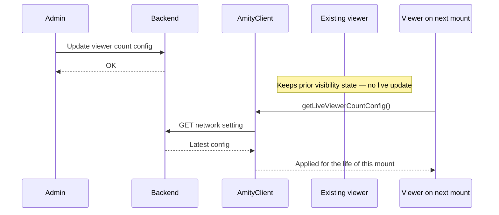

`AmityClient.getLiveViewerCountConfig()` returns the network-level configuration that governs whether the live viewer count is shown to viewers on a livestream. Admins pick one of three modes (always show, hide entirely, or show above a minimum) at the network level; the SDK reads it as a one-shot cold read and the UIKit's viewer-count element applies the rule.

<Note>
  This page covers the SDK read API. The write path is admin-only and served by the Console — the SDK does not update this setting. Console UI and permissions are documented separately in [Network Settings](/analytics-and-moderation/social+-apis-and-services/network-settings).
</Note>

## Platform Surface

| Platform | Entry point | Return type | Signature |
| --- | --- | --- | --- |
| TypeScript | `client.getLiveViewerCountConfig()` | `Promise<AmityLiveViewerCountConfig>` | Zero-argument, async |
| iOS | `client.getLiveViewerCountConfig()` | `AmityLiveViewerCountConfig` | `async throws` on `AmityClient` |
| Android | `AmityCoreClient.getLiveViewerCountConfig()` | `Single<AmityLiveViewerCountConfig>` | Zero-argument, RxJava |

## Modes

Three modes are available. They apply to viewers only — **hosts and co-hosts always see the actual count regardless of mode**.

| Mode | Wire value | Threshold applied | Viewer behavior |
| --- | --- | --- | --- |
| `alwaysShow` | `"always"` | No | Count is always visible. Default for never-configured networks. Matches the previous behavior. |
| `hideEntirely` | `"hidden"` | No | Viewers never see the count. Hosts and co-hosts still see it. |
| `showAboveMinimum` | `"above-minimum"` | Yes (inclusive) | Viewers see the count only when `count >= threshold`. |

## Config Model

| Field | Type | Description |
| --- | --- | --- |
| `mode` | `AmityLiveViewerCountMode` | Selected display mode. |
| `threshold` | `Int` | Positive integer in `[1, 1000]`. **Always present**, default `50`. Applied only under `showAboveMinimum`; retained (but not applied) under `alwaysShow` / `hideEntirely` so admins can flip modes without losing the value. |

## Read the Config

Read the config at each livestream mount. The API is a cold read — there is no observable and no real-time channel. Admin changes made mid-stream do not propagate to already-connected viewers; they take effect only on a subsequent mount (leave and rejoin).

<CodeGroup>

```typescript TypeScript
import { Client, AmityLiveViewerCountMode } from "@amityco/ts-sdk";

async function shouldShowViewerCount(
  client: Amity.Client,
  currentCount: number,
  isHostOrCoHost: boolean,
): Promise<boolean> {
  if (isHostOrCoHost) {
    return true;
  }

  const config = await client.getLiveViewerCountConfig();

  switch (config.mode) {
    case AmityLiveViewerCountMode.ALWAYS_SHOW:
      return true;
    case AmityLiveViewerCountMode.HIDE_ENTIRELY:
      return false;
    case AmityLiveViewerCountMode.SHOW_ABOVE_MINIMUM:
      return currentCount >= config.threshold;
  }
}
```

```kotlin Android
import com.amity.socialcloud.sdk.api.core.AmityCoreClient
import com.amity.socialcloud.sdk.model.core.livestream.AmityLiveViewerCountMode

fun observeShouldShowCount(
    currentCount: Int,
    isHostOrCoHost: Boolean,
) {
    if (isHostOrCoHost) {
        showSuccessMessage(true)
        return
    }

    AmityCoreClient.getLiveViewerCountConfig()
        .subscribe(
            { config ->
                val visible = when (config.mode) {
                    AmityLiveViewerCountMode.ALWAYS_SHOW -> true
                    AmityLiveViewerCountMode.HIDE_ENTIRELY -> false
                    AmityLiveViewerCountMode.SHOW_ABOVE_MINIMUM ->
                        currentCount >= config.threshold
                }
                showSuccessMessage(visible)
            },
            { error -> handleGeneralError(error) }
        )
}
```

```swift iOS
import AmitySDK

func shouldShowViewerCount(
    client: AmityClient,
    currentCount: Int,
    isHostOrCoHost: Bool
) async throws -> Bool {
    if isHostOrCoHost {
        return true
    }

    let config = try await client.getLiveViewerCountConfig()

    switch config.mode {
    case .alwaysShow:
        return true
    case .hideEntirely:
        return false
    case .showAboveMinimum:
        return currentCount >= config.threshold
    }
}
```

</CodeGroup>

## Visibility Rule

The rule is evaluated in a fixed order — the first match wins.

1. **Role check first.** If the current user is a **host** or **co-host**, show the actual count. All mode-based hiding applies to viewers only.
2. **Mode branch** (viewer role):
   - `alwaysShow` — show.
   - `hideEntirely` — hide.
   - `showAboveMinimum` — show iff `count >= threshold` (inclusive).

The comparison is inclusive: at exactly `count == threshold`, the count is shown.

## Propagation Model

The SDK reads the config once when the viewer joins a stream. Changes made by an admin while the viewer is already watching **do not** update the visibility state — the viewer keeps the rule that applied at join. To pick up a new config, the viewer must leave and rejoin the stream.

Within a single mount, the visibility state still reacts to two things:

- **Count ticks.** Under `showAboveMinimum`, if the viewer count crosses the threshold naturally, the count appears or disappears without a rejoin.
- **Role changes.** A viewer promoted to co-host mid-stream immediately sees the actual count — no rejoin needed.



## Threshold Constraints

| Constraint | Value |
| --- | --- |
| Type | Positive integer |
| Minimum | `1` |
| Default | `50` |
| Maximum | `1000` |
| Comparison | Inclusive (`count >= threshold`) |
| Retention across mode changes | The threshold is retained under `alwaysShow` / `hideEntirely`. Admins can flip back to `showAboveMinimum` without re-entering the value. |

<Info>
  The Console clamps admin-entered values on save: values above `1000` are clamped to `1000`; values below `1` (or empty) reset to `1`. Zero is explicitly rejected — use `alwaysShow` for "always visible" instead.
</Info>

## Defaults

- Never-configured networks read as `{ mode: alwaysShow, threshold: 50 }` — the backend merges defaults at read time.
- Tenants previously hidden via a support ticket migrate to `hideEntirely`.
- No client-side fallback is required for absent fields.

## Caching

No client-side cache is required. Writes evict the network-setting cache on the backend, so every read after a write returns the current value. The SDK may keep an in-memory session cache as a network-cost optimization, but every livestream mount must observe the value that was current at mount time.

## Error Handling

The element that consumes this API (the UIKit `LiveViewerCountElement`) fails open — on any error, it behaves as `alwaysShow` so today's behavior is never silently regressed.

| Situation | SDK behavior | Effective config |
| --- | --- | --- |
| Network error on cold read | Rejects with the platform's standard network error | Fail open to `{ alwaysShow, 50 }` |
| Server error (5xx) | Rejects with the platform's standard server error | Fail open to `{ alwaysShow, 50 }` |
| Unknown mode | Falls back to `alwaysShow` and logs a warning; a valid threshold in `[1, 1000]` is retained, otherwise `50` | `{ alwaysShow, <threshold or 50> }` |
| `showAboveMinimum` with a missing or out-of-range threshold | Returns default and logs a warning | `{ alwaysShow, 50 }` |
| Out-of-range threshold under `alwaysShow` / `hideEntirely` | Keeps the selected mode; resets the threshold to `50` (the threshold is ignored in these modes anyway) | `{ <selected mode>, 50 }` |
| Never-configured network | Returns `{ alwaysShow, 50 }` — defaults are backend-merged | `{ alwaysShow, 50 }` |

<Warning>
  Never treat a config error as a reason to hide the count. If the admin never selected `hideEntirely`, viewers should still see it. Fail open, always.
</Warning>

## UIKit Integration

If you use UIKit, no wiring is needed — the [Livestream Player Page](/uikit/components/social/livestream) reads this config automatically through the built-in `LiveViewerCountElement`. Use this API only when you build a custom viewer surface and need to enforce the same visibility rule yourself.

## Related Topics

<CardGroup cols={3}>
  <Card title="Live Room Viewing" icon="signal-stream" href="./live-viewing">
    Observe room playback state and hand playback URLs to your player.
  </Card>
  <Card title="Co-Host Management" icon="users" href="./co-host-management">
    Manage co-host participants — co-hosts are exempt from the visibility rule.
  </Card>
  <Card title="Livestream UIKit" icon="tv" href="/uikit/components/social/livestream">
    Ready-to-use livestream components that apply the visibility rule automatically.
  </Card>
</CardGroup>
