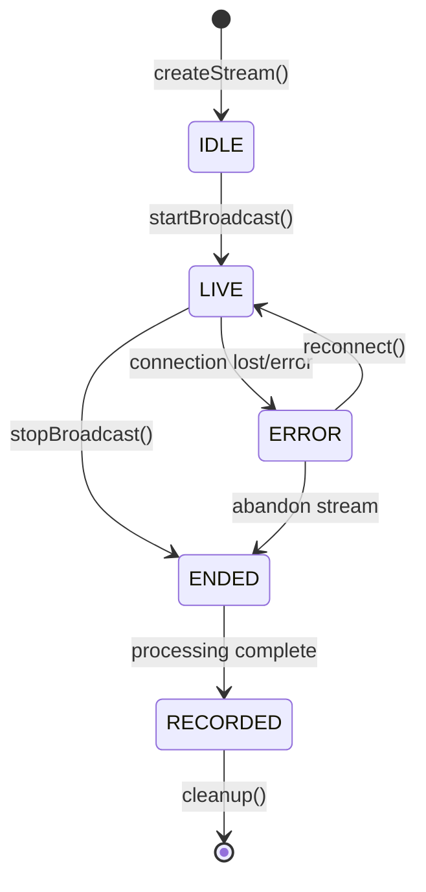

# Lifecycle Management

Proper lifecycle management ensures optimal performance, resource efficiency, and a smooth user experience. This guide covers stream lifecycle, application state management, and resource cleanup strategies across all platforms.

## Stream Lifecycle Overview

### Stream States and Transitions

Understanding stream states is crucial for proper lifecycle management:



<Tabs>
<Tab title="Stream State Management">
```typescript
enum StreamState {
    IDLE = 'idle',           // Created but not started
    CONNECTING = 'connecting', // Establishing connection
    LIVE = 'live',           // Currently broadcasting
    RECONNECTING = 'reconnecting', // Attempting to reconnect
    ENDED = 'ended',         // Broadcast stopped
    RECORDED = 'recorded',   // Available for playback
    ERROR = 'error',         // Error state
    CLEANUP = 'cleanup'      // Resources being cleaned up
}

class StreamLifecycleManager {
    private streamState: StreamState = StreamState.IDLE;
    private stateListeners: ((state: StreamState) => void)[] = [];
    private resources: Map<string, any> = new Map();
    
    async createStream(config: StreamConfig): Promise<Stream> {
        this.setState(StreamState.IDLE);
        
        const stream = await this.streamRepository.createStream(config);
        this.allocateResources(stream.streamId);
        
        return stream;
    }
    
    async startBroadcast(streamId: string): Promise<void> {
        this.setState(StreamState.CONNECTING);
        
        try {
            await this.establishConnection(streamId);
            await this.initializeBroadcast(streamId);
            this.setState(StreamState.LIVE);
            this.startHeartbeat(streamId);
        } catch (error) {
            this.setState(StreamState.ERROR);
            throw error;
        }
    }
    
    async stopBroadcast(streamId: string): Promise<void> {
        this.setState(StreamState.ENDED);
        
        await this.stopHeartbeat();
        await this.finalizeBroadcast(streamId);
        
        // Wait for processing to complete
        await this.waitForProcessing(streamId);
        this.setState(StreamState.RECORDED);
    }
    
    async cleanup(streamId: string): Promise<void> {
        this.setState(StreamState.CLEANUP);
        
        await this.releaseResources(streamId);
        await this.clearCache(streamId);
        
        this.setState(StreamState.IDLE);
    }
    
    private setState(newState: StreamState) {
        const previousState = this.streamState;
        this.streamState = newState;
        
        console.log(`Stream state: ${previousState} → ${newState}`);
        this.notifyStateListeners(newState);
    }
}
```
</Tab>
<Tab title="State Monitoring">
```typescript
class StreamStateMonitor {
    private monitoringInterval?: NodeJS.Timeout;
    private healthCheckInterval?: NodeJS.Timeout;
    
    startMonitoring(streamId: string) {
        this.monitoringInterval = setInterval(() => {
            this.checkStreamHealth(streamId);
        }, 5000); // Check every 5 seconds
        
        this.healthCheckInterval = setInterval(() => {
            this.performDeepHealthCheck(streamId);
        }, 30000); // Deep check every 30 seconds
    }
    
    stopMonitoring() {
        if (this.monitoringInterval) {
            clearInterval(this.monitoringInterval);
            this.monitoringInterval = undefined;
        }
        
        if (this.healthCheckInterval) {
            clearInterval(this.healthCheckInterval);
            this.healthCheckInterval = undefined;
        }
    }
    
    private async checkStreamHealth(streamId: string) {
        const metrics = await this.getStreamMetrics(streamId);
        
        if (metrics.connectionLost) {
            this.handleConnectionLoss(streamId);
        }
        
        if (metrics.qualityDegraded) {
            this.handleQualityDegradation(streamId);
        }
        
        if (metrics.resourceExhaustion) {
            this.handleResourceExhaustion(streamId);
        }
    }
    
    private async handleConnectionLoss(streamId: string) {
        console.log('Connection lost, attempting reconnection...');
        
        const maxRetries = 3;
        let retryCount = 0;
        
        while (retryCount < maxRetries) {
            try {
                await this.reconnectStream(streamId);
                console.log('Reconnection successful');
                return;
            } catch (error) {
                retryCount++;
                await this.wait(Math.pow(2, retryCount) * 1000); // Exponential backoff
            }
        }
        
        // All retries failed
        this.onReconnectionFailed(streamId);
    }
}
```
</Tab>
</Tabs>

## Application Lifecycle Integration

### Platform-Specific Lifecycle Handling

<Tabs>
<Tab title="iOS Lifecycle">
```swift
import UIKit

class StreamLifecycleManager: NSObject {
    private var activeStreams: [String: StreamSession] = [:]
    
    override init() {
        super.init()
        setupAppLifecycleObservers()
    }
    
    private func setupAppLifecycleObservers() {
        NotificationCenter.default.addObserver(
            self,
            selector: #selector(appWillResignActive),
            name: UIApplication.willResignActiveNotification,
            object: nil
        )
        
        NotificationCenter.default.addObserver(
            self,
            selector: #selector(appDidEnterBackground),
            name: UIApplication.didEnterBackgroundNotification,
            object: nil
        )
        
        NotificationCenter.default.addObserver(
            self,
            selector: #selector(appWillEnterForeground),
            name: UIApplication.willEnterForegroundNotification,
            object: nil
        )
        
        NotificationCenter.default.addObserver(
            self,
            selector: #selector(appDidBecomeActive),
            name: UIApplication.didBecomeActiveNotification,
            object: nil
        )
    }
    
    @objc private func appWillResignActive() {
        // Prepare for transition to background
        for (streamId, session) in activeStreams {
            session.prepareForBackground()
        }
    }
    
    @objc private func appDidEnterBackground() {
        // Handle background transition
        for (streamId, session) in activeStreams {
            if session.isLive {
                session.enableBackgroundMode()
            } else {
                session.pause()
            }
        }
    }
    
    @objc private func appWillEnterForeground() {
        // Prepare for foreground return
        for (streamId, session) in activeStreams {
            session.prepareForForeground()
        }
    }
    
    @objc private func appDidBecomeActive() {
        // Resume normal operation
        for (streamId, session) in activeStreams {
            session.resume()
        }
    }
}

class StreamSession {
    var isLive: Bool = false
    private var backgroundTask: UIBackgroundTaskIdentifier = .invalid
    
    func prepareForBackground() {
        // Reduce resource usage
        reduceQuality()
        
        // Start background task if streaming
        if isLive {
            backgroundTask = UIApplication.shared.beginBackgroundTask { [weak self] in
                self?.endBackgroundTask()
            }
        }
    }
    
    func enableBackgroundMode() {
        // Enable background streaming
        let backgroundConfig = StreamConfig(
            quality: .low,
            frameRate: 15,
            enableBackgroundOptimizations: true
        )
        
        applyConfiguration(backgroundConfig)
    }
    
    private func endBackgroundTask() {
        if backgroundTask != .invalid {
            UIApplication.shared.endBackgroundTask(backgroundTask)
            backgroundTask = .invalid
        }
    }
}
```
</Tab>
<Tab title="Android Lifecycle">
```kotlin
import androidx.lifecycle.*

class StreamLifecycleManager : LifecycleObserver {
    private val activeStreams = mutableMapOf<String, StreamSession>()
    
    @OnLifecycleEvent(Lifecycle.Event.ON_PAUSE)
    fun onAppPaused() {
        activeStreams.values.forEach { session ->
            session.onAppPaused()
        }
    }
    
    @OnLifecycleEvent(Lifecycle.Event.ON_RESUME)
    fun onAppResumed() {
        activeStreams.values.forEach { session ->
            session.onAppResumed()
        }
    }
    
    @OnLifecycleEvent(Lifecycle.Event.ON_STOP)
    fun onAppStopped() {
        activeStreams.values.forEach { session ->
            session.onAppStopped()
        }
    }
    
    @OnLifecycleEvent(Lifecycle.Event.ON_DESTROY)
    fun onAppDestroyed() {
        cleanupAllStreams()
    }
    
    private fun cleanupAllStreams() {
        activeStreams.values.forEach { session ->
            session.cleanup()
        }
        activeStreams.clear()
    }
}

class StreamSession(private val streamId: String) {
    private var isInBackground = false
    private var originalQuality: StreamQuality? = null
    
    fun onAppPaused() {
        if (isStreaming()) {
            // Reduce quality for background streaming
            originalQuality = getCurrentQuality()
            setQuality(StreamQuality.LOW)
        }
    }
    
    fun onAppResumed() {
        if (isStreaming() && originalQuality != null) {
            // Restore original quality
            setQuality(originalQuality!!)
            originalQuality = null
        }
    }
    
    fun onAppStopped() {
        isInBackground = true
        
        if (isStreaming()) {
            // Enable foreground service for background streaming
            startForegroundService()
        } else {
            // Pause non-streaming operations
            pauseOperations()
        }
    }
    
    private fun startForegroundService() {
        val intent = Intent(context, StreamingForegroundService::class.java)
        intent.putExtra("streamId", streamId)
        context.startForegroundService(intent)
    }
}
```
</Tab>
<Tab title="Web Lifecycle">
```typescript
class WebLifecycleManager {
    private activeStreams = new Map<string, StreamSession>();
    private isPageVisible = true;
    
    constructor() {
        this.setupPageVisibilityHandlers();
        this.setupBeforeUnloadHandler();
        this.setupPerformanceObserver();
    }
    
    private setupPageVisibilityHandlers() {
        document.addEventListener('visibilitychange', () => {
            this.isPageVisible = !document.hidden;
            
            if (document.hidden) {
                this.onPageHidden();
            } else {
                this.onPageVisible();
            }
        });
        
        // Handle page focus/blur
        window.addEventListener('focus', () => this.onPageFocused());
        window.addEventListener('blur', () => this.onPageBlurred());
    }
    
    private setupBeforeUnloadHandler() {
        window.addEventListener('beforeunload', (event) => {
            this.onPageUnloading(event);
        });
        
        // Modern page lifecycle API
        if ('onpagehide' in window) {
            window.addEventListener('pagehide', (event) => {
                this.onPageHide(event);
            });
        }
    }
    
    private onPageHidden() {
        console.log('Page hidden, adjusting stream quality');
        
        this.activeStreams.forEach((session, streamId) => {
            if (session.isLive) {
                session.enableLowPowerMode();
            } else {
                session.pause();
            }
        });
    }
    
    private onPageVisible() {
        console.log('Page visible, restoring stream quality');
        
        this.activeStreams.forEach((session, streamId) => {
            session.resume();
        });
    }
    
    private onPageUnloading(event: BeforeUnloadEvent) {
        // Clean shutdown of active streams
        const hasActiveStreams = Array.from(this.activeStreams.values())
            .some(session => session.isLive);
        
        if (hasActiveStreams) {
            event.preventDefault();
            event.returnValue = 'You have active streams. Are you sure you want to leave?';
        }
        
        // Attempt graceful cleanup
        this.performEmergencyCleanup();
    }
    
    private performEmergencyCleanup() {
        // Quick cleanup before page unload
        this.activeStreams.forEach((session, streamId) => {
            session.emergencyStop();
        });
    }
}
```
</Tab>
<Tab title="React Native Lifecycle">
```typescript
import { AppState, AppStateStatus } from 'react-native';

class ReactNativeLifecycleManager {
    private appStateSubscription?: any;
    private currentAppState: AppStateStatus = AppState.currentState;
    private activeStreams = new Map<string, StreamSession>();
    
    initialize() {
        this.appStateSubscription = AppState.addEventListener(
            'change',
            this.handleAppStateChange.bind(this)
        );
    }
    
    cleanup() {
        if (this.appStateSubscription) {
            this.appStateSubscription.remove();
        }
    }
    
    private handleAppStateChange(nextAppState: AppStateStatus) {
        console.log(`App state: ${this.currentAppState} → ${nextAppState}`);
        
        if (this.currentAppState.match(/inactive|background/) && nextAppState === 'active') {
            this.onAppForegrounded();
        } else if (this.currentAppState === 'active' && nextAppState.match(/inactive|background/)) {
            this.onAppBackgrounded();
        }
        
        this.currentAppState = nextAppState;
    }
    
    private onAppForegrounded() {
        console.log('App foregrounded');
        
        this.activeStreams.forEach((session, streamId) => {
            session.onForeground();
        });
    }
    
    private onAppBackgrounded() {
        console.log('App backgrounded');
        
        this.activeStreams.forEach((session, streamId) => {
            session.onBackground();
        });
    }
}

class StreamSession {
    private backgroundStartTime?: Date;
    private originalConfig?: StreamConfig;
    
    onBackground() {
        this.backgroundStartTime = new Date();
        
        if (this.isStreaming()) {
            // Store original config
            this.originalConfig = this.getCurrentConfig();
            
            // Apply background optimizations
            const backgroundConfig = {
                ...this.originalConfig,
                quality: 'low',
                frameRate: 15,
                enableBackgroundOptimizations: true
            };
            
            this.applyConfiguration(backgroundConfig);
        }
    }
    
    onForeground() {
        if (this.backgroundStartTime) {
            const backgroundDuration = Date.now() - this.backgroundStartTime.getTime();
            console.log(`App was backgrounded for ${backgroundDuration}ms`);
        }
        
        if (this.isStreaming() && this.originalConfig) {
            // Restore original configuration
            this.applyConfiguration(this.originalConfig);
            this.originalConfig = undefined;
        }
        
        this.backgroundStartTime = undefined;
    }
}
```
</Tab>
</Tabs>

## Resource Management

### Memory and Resource Cleanup

<Tabs>
<Tab title="Memory Management">
```typescript
class StreamResourceManager {
    private resourcePool = new Map<string, ResourceInfo>();
    private memoryThreshold = 150; // MB
    private cleanupInterval?: NodeJS.Timeout;
    
    initialize() {
        this.startMemoryMonitoring();
        this.setupPeriodicCleanup();
    }
    
    private startMemoryMonitoring() {
        setInterval(() => {
            const memoryUsage = this.getCurrentMemoryUsage();
            
            if (memoryUsage > this.memoryThreshold) {
                console.warn(`High memory usage: ${memoryUsage}MB`);
                this.performMemoryCleanup();
            }
        }, 10000); // Check every 10 seconds
    }
    
    allocateResources(streamId: string, config: StreamConfig): ResourceAllocation {
        const resources: ResourceAllocation = {
            videoBuffer: this.allocateVideoBuffer(config.resolution),
            audioBuffer: this.allocateAudioBuffer(config.audioConfig),
            encoderContext: this.allocateEncoder(config),
            networkBuffers: this.allocateNetworkBuffers(),
            tempFiles: this.allocateTempFiles(streamId)
        };
        
        this.resourcePool.set(streamId, {
            allocation: resources,
            allocatedAt: new Date(),
            lastUsed: new Date()
        });
        
        return resources;
    }
    
    releaseResources(streamId: string): void {
        const resourceInfo = this.resourcePool.get(streamId);
        if (!resourceInfo) return;
        
        const { allocation } = resourceInfo;
        
        // Release video resources
        allocation.videoBuffer?.release();
        allocation.audioBuffer?.release();
        allocation.encoderContext?.dispose();
        
        // Clean up network buffers
        allocation.networkBuffers.forEach(buffer => buffer.release());
        
        // Delete temporary files
        allocation.tempFiles.forEach(file => this.deleteFile(file));
        
        this.resourcePool.delete(streamId);
        
        // Force garbage collection hint
        this.requestGarbageCollection();
    }
    
    private performMemoryCleanup(): void {
        console.log('Performing memory cleanup...');
        
        // Clean up unused resources
        this.cleanupUnusedResources();
        
        // Optimize active resources
        this.optimizeActiveResources();
        
        // Clear caches
        this.clearCaches();
        
        // Request garbage collection
        this.requestGarbageCollection();
    }
    
    private cleanupUnusedResources(): void {
        const now = new Date();
        const unusedThreshold = 5 * 60 * 1000; // 5 minutes
        
        this.resourcePool.forEach((resourceInfo, streamId) => {
            const timeSinceLastUse = now.getTime() - resourceInfo.lastUsed.getTime();
            
            if (timeSinceLastUse > unusedThreshold) {
                console.log(`Cleaning up unused resources for stream ${streamId}`);
                this.releaseResources(streamId);
            }
        });
    }
}
```
</Tab>
<Tab title="Cache Management">
```typescript
class StreamCacheManager {
    private readonly maxCacheSize = 100 * 1024 * 1024; // 100MB
    private readonly cacheExpiryTime = 24 * 60 * 60 * 1000; // 24 hours
    private cache = new Map<string, CacheEntry>();
    
    async cacheStreamData(streamId: string, data: ArrayBuffer, type: CacheType): Promise<void> {
        // Check if we need to free space
        if (this.getCurrentCacheSize() + data.byteLength > this.maxCacheSize) {
            await this.evictOldEntries();
        }
        
        const entry: CacheEntry = {
            data,
            type,
            createdAt: new Date(),
            lastAccessed: new Date(),
            size: data.byteLength
        };
        
        this.cache.set(streamId, entry);
    }
    
    getCachedData(streamId: string): ArrayBuffer | null {
        const entry = this.cache.get(streamId);
        if (!entry) return null;
        
        // Check expiry
        if (this.isExpired(entry)) {
            this.cache.delete(streamId);
            return null;
        }
        
        entry.lastAccessed = new Date();
        return entry.data;
    }
    
    private async evictOldEntries(): Promise<void> {
        const entries = Array.from(this.cache.entries());
        
        // Sort by last accessed time (oldest first)
        entries.sort(([, a], [, b]) => 
            a.lastAccessed.getTime() - b.lastAccessed.getTime()
        );
        
        // Remove oldest entries until we have enough space
        const targetSize = this.maxCacheSize * 0.7; // Keep 70% of max size
        let currentSize = this.getCurrentCacheSize();
        
        for (const [streamId, entry] of entries) {
            if (currentSize <= targetSize) break;
            
            this.cache.delete(streamId);
            currentSize -= entry.size;
        }
    }
    
    clearExpiredEntries(): void {
        this.cache.forEach((entry, streamId) => {
            if (this.isExpired(entry)) {
                this.cache.delete(streamId);
            }
        });
    }
    
    clearAll(): void {
        this.cache.clear();
    }
    
    private getCurrentCacheSize(): number {
        return Array.from(this.cache.values())
            .reduce((total, entry) => total + entry.size, 0);
    }
    
    private isExpired(entry: CacheEntry): boolean {
        const now = Date.now();
        return (now - entry.createdAt.getTime()) > this.cacheExpiryTime;
    }
}
```
</Tab>
</Tabs>

### Connection Management

<Tabs>
<Tab title="Connection Lifecycle">
```typescript
class ConnectionLifecycleManager {
    private connections = new Map<string, Connection>();
    private heartbeatInterval?: NodeJS.Timeout;
    private reconnectAttempts = new Map<string, number>();
    
    async createConnection(streamId: string, config: ConnectionConfig): Promise<Connection> {
        const connection = new Connection(streamId, config);
        
        connection.onDisconnect(() => this.handleDisconnection(streamId));
        connection.onError((error) => this.handleConnectionError(streamId, error));
        
        await connection.connect();
        this.connections.set(streamId, connection);
        
        this.startHeartbeat(streamId);
        return connection;
    }
    
    async closeConnection(streamId: string): Promise<void> {
        const connection = this.connections.get(streamId);
        if (!connection) return;
        
        this.stopHeartbeat(streamId);
        await connection.gracefulDisconnect();
        this.connections.delete(streamId);
        this.reconnectAttempts.delete(streamId);
    }
    
    private startHeartbeat(streamId: string): void {
        const connection = this.connections.get(streamId);
        if (!connection) return;
        
        const heartbeatId = setInterval(async () => {
            try {
                await connection.sendHeartbeat();
            } catch (error) {
                console.warn(`Heartbeat failed for ${streamId}:`, error);
                this.handleConnectionError(streamId, error);
            }
        }, 30000); // 30 second heartbeat
        
        connection.setHeartbeatId(heartbeatId);
    }
    
    private stopHeartbeat(streamId: string): void {
        const connection = this.connections.get(streamId);
        if (connection) {
            connection.clearHeartbeat();
        }
    }
    
    private async handleDisconnection(streamId: string): Promise<void> {
        console.log(`Connection lost for stream ${streamId}`);
        
        const maxReconnectAttempts = 5;
        const currentAttempts = this.reconnectAttempts.get(streamId) || 0;
        
        if (currentAttempts < maxReconnectAttempts) {
            await this.attemptReconnection(streamId);
        } else {
            console.error(`Max reconnection attempts reached for ${streamId}`);
            this.onReconnectionFailed(streamId);
        }
    }
    
    private async attemptReconnection(streamId: string): Promise<void> {
        const attempts = this.reconnectAttempts.get(streamId) || 0;
        this.reconnectAttempts.set(streamId, attempts + 1);
        
        const delay = Math.min(1000 * Math.pow(2, attempts), 30000); // Exponential backoff, max 30s
        
        console.log(`Reconnecting ${streamId} in ${delay}ms (attempt ${attempts + 1})`);
        
        setTimeout(async () => {
            try {
                const connection = this.connections.get(streamId);
                if (connection) {
                    await connection.reconnect();
                    this.reconnectAttempts.set(streamId, 0); // Reset on success
                    console.log(`Reconnection successful for ${streamId}`);
                }
            } catch (error) {
                console.error(`Reconnection failed for ${streamId}:`, error);
                this.handleDisconnection(streamId); // Try again
            }
        }, delay);
    }
}
```
</Tab>
<Tab title="Connection Pool">
```typescript
class ConnectionPool {
    private pool: Connection[] = [];
    private readonly maxPoolSize = 10;
    private readonly minPoolSize = 2;
    private activeConnections = new Set<Connection>();
    
    async initialize(): Promise<void> {
        // Pre-create minimum connections
        for (let i = 0; i < this.minPoolSize; i++) {
            const connection = await this.createNewConnection();
            this.pool.push(connection);
        }
    }
    
    async getConnection(): Promise<Connection> {
        // Try to get from pool first
        if (this.pool.length > 0) {
            const connection = this.pool.pop()!;
            this.activeConnections.add(connection);
            return connection;
        }
        
        // Create new connection if pool is empty
        if (this.activeConnections.size < this.maxPoolSize) {
            const connection = await this.createNewConnection();
            this.activeConnections.add(connection);
            return connection;
        }
        
        throw new Error('Connection pool exhausted');
    }
    
    releaseConnection(connection: Connection): void {
        this.activeConnections.delete(connection);
        
        if (connection.isHealthy() && this.pool.length < this.maxPoolSize) {
            // Return to pool
            this.pool.push(connection);
        } else {
            // Dispose unhealthy or excess connections
            connection.dispose();
        }
    }
    
    async maintainPool(): Promise<void> {
        // Remove unhealthy connections
        this.pool = this.pool.filter(connection => {
            if (!connection.isHealthy()) {
                connection.dispose();
                return false;
            }
            return true;
        });
        
        // Ensure minimum pool size
        while (this.pool.length < this.minPoolSize) {
            try {
                const connection = await this.createNewConnection();
                this.pool.push(connection);
            } catch (error) {
                console.error('Failed to maintain connection pool:', error);
                break;
            }
        }
    }
    
    async shutdown(): Promise<void> {
        // Close all pooled connections
        await Promise.all(this.pool.map(connection => connection.close()));
        this.pool.clear();
        
        // Close all active connections
        await Promise.all(
            Array.from(this.activeConnections).map(connection => connection.close())
        );
        this.activeConnections.clear();
    }
}
```
</Tab>
</Tabs>

## Error Recovery and Resilience

### Graceful Degradation

<Tabs>
<Tab title="Failure Recovery">
```typescript
class FailureRecoveryManager {
    private recoveryStrategies = new Map<string, RecoveryStrategy>();
    private failureHistory = new Map<string, FailureInfo[]>();
    
    registerRecoveryStrategy(errorType: string, strategy: RecoveryStrategy): void {
        this.recoveryStrategies.set(errorType, strategy);
    }
    
    async handleFailure(streamId: string, error: StreamError): Promise<boolean> {
        this.recordFailure(streamId, error);
        
        const strategy = this.recoveryStrategies.get(error.type);
        if (!strategy) {
            console.error(`No recovery strategy for error type: ${error.type}`);
            return false;
        }
        
        const maxAttempts = this.getMaxRecoveryAttempts(streamId, error.type);
        let attempt = 0;
        
        while (attempt < maxAttempts) {
            try {
                await this.wait(this.getRetryDelay(attempt));
                
                const recovered = await strategy.execute(streamId, error, attempt);
                if (recovered) {
                    console.log(`Recovery successful for ${streamId} after ${attempt + 1} attempts`);
                    this.clearFailureHistory(streamId, error.type);
                    return true;
                }
                
                attempt++;
            } catch (recoveryError) {
                console.error(`Recovery attempt ${attempt + 1} failed:`, recoveryError);
                attempt++;
            }
        }
        
        console.error(`Recovery failed for ${streamId} after ${maxAttempts} attempts`);
        return false;
    }
    
    private recordFailure(streamId: string, error: StreamError): void {
        const failures = this.failureHistory.get(streamId) || [];
        failures.push({
            error,
            timestamp: new Date(),
            recoveryAttempted: false
        });
        
        // Keep only recent failures (last hour)
        const oneHourAgo = Date.now() - 60 * 60 * 1000;
        const recentFailures = failures.filter(f => f.timestamp.getTime() > oneHourAgo);
        
        this.failureHistory.set(streamId, recentFailures);
    }
    
    private getMaxRecoveryAttempts(streamId: string, errorType: string): number {
        const failures = this.failureHistory.get(streamId) || [];
        const recentFailuresOfType = failures.filter(f => f.error.type === errorType);
        
        // Reduce attempts for repeated failures
        if (recentFailuresOfType.length > 3) {
            return 1; // Only one attempt for frequently failing streams
        }
        
        return 3; // Default attempts
    }
    
    private getRetryDelay(attempt: number): number {
        // Exponential backoff with jitter
        const baseDelay = 1000; // 1 second
        const maxDelay = 30000; // 30 seconds
        const exponentialDelay = baseDelay * Math.pow(2, attempt);
        const jitter = Math.random() * 1000; // Add up to 1 second jitter
        
        return Math.min(exponentialDelay + jitter, maxDelay);
    }
}

// Recovery strategies for different error types
class NetworkRecoveryStrategy implements RecoveryStrategy {
    async execute(streamId: string, error: StreamError, attempt: number): Promise<boolean> {
        console.log(`Attempting network recovery for ${streamId} (attempt ${attempt + 1})`);
        
        // Step 1: Check network connectivity
        const isConnected = await this.checkNetworkConnectivity();
        if (!isConnected) {
            throw new Error('No network connectivity');
        }
        
        // Step 2: Test connection to streaming server
        const serverReachable = await this.testServerConnectivity();
        if (!serverReachable) {
            throw new Error('Streaming server unreachable');
        }
        
        // Step 3: Attempt to reestablish stream
        return await this.reestablishStream(streamId);
    }
    
    private async checkNetworkConnectivity(): Promise<boolean> {
        try {
            const response = await fetch('https://httpbin.org/get', { 
                method: 'HEAD',
                timeout: 5000 
            });
            return response.ok;
        } catch {
            return false;
        }
    }
    
    private async reestablishStream(streamId: string): Promise<boolean> {
        // Implementation specific to your streaming setup
        // This would reconnect to the streaming service
        return true; // Placeholder
    }
}
```
</Tab>
<Tab title="Circuit Breaker">
```typescript
class CircuitBreaker {
    private state: 'CLOSED' | 'OPEN' | 'HALF_OPEN' = 'CLOSED';
    private failureCount = 0;
    private lastFailureTime?: Date;
    private successCount = 0;
    
    constructor(
        private failureThreshold: number = 5,
        private recoveryTimeout: number = 60000, // 1 minute
        private successThreshold: number = 3
    ) {}
    
    async execute<T>(operation: () => Promise<T>): Promise<T> {
        if (this.state === 'OPEN') {
            if (this.shouldAttemptReset()) {
                this.state = 'HALF_OPEN';
                this.successCount = 0;
            } else {
                throw new Error('Circuit breaker is OPEN');
            }
        }
        
        try {
            const result = await operation();
            this.onSuccess();
            return result;
        } catch (error) {
            this.onFailure();
            throw error;
        }
    }
    
    private onSuccess(): void {
        this.failureCount = 0;
        
        if (this.state === 'HALF_OPEN') {
            this.successCount++;
            if (this.successCount >= this.successThreshold) {
                this.state = 'CLOSED';
            }
        }
    }
    
    private onFailure(): void {
        this.failureCount++;
        this.lastFailureTime = new Date();
        
        if (this.failureCount >= this.failureThreshold) {
            this.state = 'OPEN';
        }
    }
    
    private shouldAttemptReset(): boolean {
        if (!this.lastFailureTime) return false;
        
        const timeSinceLastFailure = Date.now() - this.lastFailureTime.getTime();
        return timeSinceLastFailure >= this.recoveryTimeout;
    }
    
    getState(): string {
        return this.state;
    }
}
```
</Tab>
</Tabs>

## Performance Optimization

### Resource Optimization

```typescript
class PerformanceOptimizer {
    private performanceMetrics = new Map<string, PerformanceMetric[]>();
    
    async optimizeStream(streamId: string): Promise<void> {
        const metrics = await this.gatherMetrics(streamId);
        const optimizations = this.analyzeMetrics(metrics);
        
        await this.applyOptimizations(streamId, optimizations);
    }
    
    private analyzeMetrics(metrics: PerformanceMetrics): Optimization[] {
        const optimizations: Optimization[] = [];
        
        // CPU optimization
        if (metrics.cpuUsage > 70) {
            optimizations.push({
                type: 'cpu',
                action: 'reduce_quality',
                priority: 'high'
            });
        }
        
        // Memory optimization
        if (metrics.memoryUsage > 150) {
            optimizations.push({
                type: 'memory',
                action: 'cleanup_resources',
                priority: 'high'
            });
        }
        
        // Network optimization
        if (metrics.packetLoss > 5) {
            optimizations.push({
                type: 'network',
                action: 'reduce_bitrate',
                priority: 'medium'
            });
        }
        
        return optimizations;
    }
    
    private async applyOptimizations(streamId: string, optimizations: Optimization[]): Promise<void> {
        // Sort by priority
        optimizations.sort((a, b) => this.getPriorityValue(b.priority) - this.getPriorityValue(a.priority));
        
        for (const optimization of optimizations) {
            try {
                await this.executeOptimization(streamId, optimization);
            } catch (error) {
                console.error(`Failed to apply optimization ${optimization.type}:`, error);
            }
        }
    }
}
```

## Next Steps

Now that you understand lifecycle management, explore these advanced topics:

- **[Broadcasting Setup](../broadcasting/setup)** - Configure broadcasting with proper lifecycle management
- **[Playback Implementation](../playback/overview)** - Implement playback with lifecycle awareness
- **[Platform-Specific Guides](../platform-specific/platform-comparison)** - Platform-specific lifecycle considerations
- **[Troubleshooting](../troubleshooting/overview)** - Debug lifecycle and resource issues

For lifecycle-related troubleshooting, see our [Platform Issues Guide](../troubleshooting/platform-issues).
