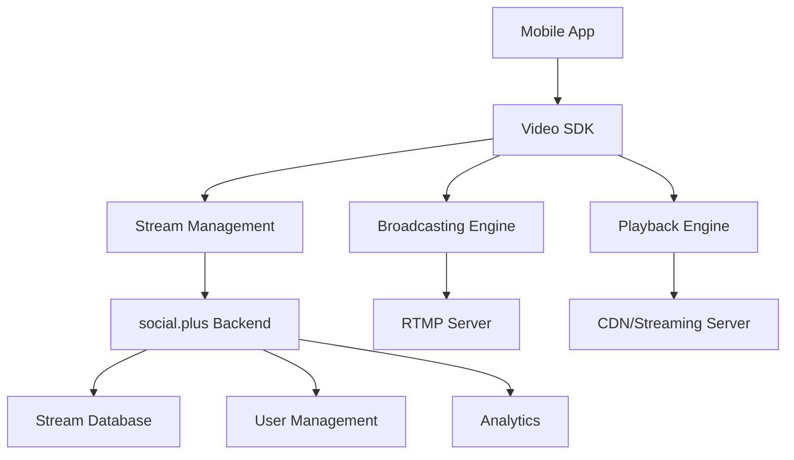

# Core Concepts

Understanding these fundamental concepts will help you build better video experiences and troubleshoot issues more effectively.

## Overview

The social.plus Video SDK is built around several key concepts that work together to provide comprehensive live streaming capabilities:

- **[Streaming Basics](./streaming-basics.mdx)** - How live streaming works and key terminology
- **[Video Quality](./video-quality.mdx)** - Resolution, bitrates, and adaptive streaming
- **[Permissions](./permissions.mdx)** - Managing camera and microphone access
- **[Lifecycle Management](./lifecycle-management.mdx)** - Stream states and transitions

## Key Components

### Stream Objects
Every live stream is represented by a **Stream Object** that contains:
- **Stream ID**: Unique identifier
- **Metadata**: Title, description, thumbnail
- **Status**: Current state (idle, live, ended)
- **URLs**: Streaming and playback endpoints
- **Configuration**: Quality settings, security options

### Broadcaster
The **Broadcaster** handles the capture and transmission of audio/video:
- Camera and microphone management
- Video encoding and compression
- Network transmission
- State monitoring and error handling

### Player/Viewer
The **Player** manages stream playback and viewing:
- Stream discovery and loading
- Adaptive bitrate streaming
- Playback controls and UI
- Network optimization

### Session Management
**Sessions** track user interactions with streams:
- User authentication and permissions
- Viewer counts and analytics
- Stream access control
- Connection management

## Architecture Overview

## Data Flow

### Broadcasting Flow
1. **Initialize** broadcaster with camera access
2. **Create** stream object on backend
3. **Configure** video quality and settings
4. **Start** preview and encoding
5. **Connect** to streaming server
6. **Transmit** live audio/video data
7. **Monitor** connection and quality
8. **Stop** and cleanup resources

### Viewing Flow  
1. **Discover** available streams
2. **Load** stream metadata
3. **Initialize** video player
4. **Connect** to streaming server
5. **Buffer** and decode video
6. **Render** to display
7. **Handle** network changes
8. **Cleanup** when done

## Security Model

### Authentication
- Users must be authenticated to create streams
- Viewing permissions can be configured per stream
- API keys and tokens secure backend communication

### Content Protection
- Stream URLs are secured and time-limited
- HTTPS/SSL encryption for all communications
- Optional stream encryption for sensitive content

### Privacy Controls
- User permission management for camera/microphone
- Stream visibility controls (public/private)
- Content moderation and reporting tools

## Performance Considerations

### Network Requirements
- **Minimum**: 1 Mbps upload for 480p streaming
- **Recommended**: 3+ Mbps for 720p, 6+ Mbps for 1080p
- **Latency**: Optimize for 2-5 second delay
- **Stability**: Handle network fluctuations gracefully

### Device Requirements
- **CPU**: Hardware encoding preferred for efficiency
- **Memory**: Adequate RAM for video processing
- **Battery**: Streaming is power-intensive
- **Temperature**: Monitor device heating

### Optimization Strategies
- **Adaptive Bitrate**: Automatically adjust quality based on network
- **Hardware Acceleration**: Use device GPU when available
- **Connection Management**: Implement reconnection logic
- **Resource Management**: Properly cleanup when not streaming

## Error Handling Patterns

### Network Errors
- Connection timeouts
- Bandwidth limitations  
- Server unavailability
- Protocol errors

### Device Errors
- Camera/microphone access denied
- Hardware limitations
- Resource conflicts
- Power management issues

### Application Errors
- Authentication failures
- Permission denied
- Configuration errors
- State management issues

## Best Practices

### User Experience
- Always show connection status
- Provide clear error messages
- Handle permissions gracefully
- Optimize for different screen sizes

### Performance
- Use appropriate video quality for network conditions
- Implement proper resource management
- Monitor and log performance metrics
- Test on various devices and networks

### Security
- Never hardcode API keys in client code
- Validate user permissions server-side
- Use secure token management
- Implement content moderation

### Reliability
- Implement robust error recovery
- Handle network interruptions gracefully
- Provide offline fallback options
- Monitor service health

## Platform Differences

While the core concepts remain consistent, implementation details vary by platform:

| Concept | Android | iOS | Web | React Native |
|---------|---------|-----|-----|--------------|
| Camera Access | Camera2 API | AVFoundation | WebRTC | Native modules |
| Encoding | MediaCodec | VideoToolbox | WebCodecs | Platform-specific |
| Networking | OkHttp | NSURLSession | Fetch/WebSocket | Native networking |
| UI Components | Views/Fragments | UIKit/SwiftUI | DOM/Canvas | React components |

## Development Workflow

### Planning Phase
1. Define streaming requirements
2. Choose target platforms
3. Plan user experience flow
4. Design architecture

### Implementation Phase  
1. Set up development environment
2. Implement authentication
3. Build broadcasting features
4. Add viewing capabilities
5. Integrate with app UI

### Testing Phase
1. Test core functionality
2. Validate on multiple devices
3. Test network conditions
4. Load testing and optimization

### Deployment Phase
1. Configure production settings
2. Set up monitoring and analytics
3. Deploy and monitor
4. Gather user feedback

---

Ready to dive deeper? Start with **[Streaming Basics](./streaming-basics.mdx)** to understand the fundamentals of live streaming technology.
