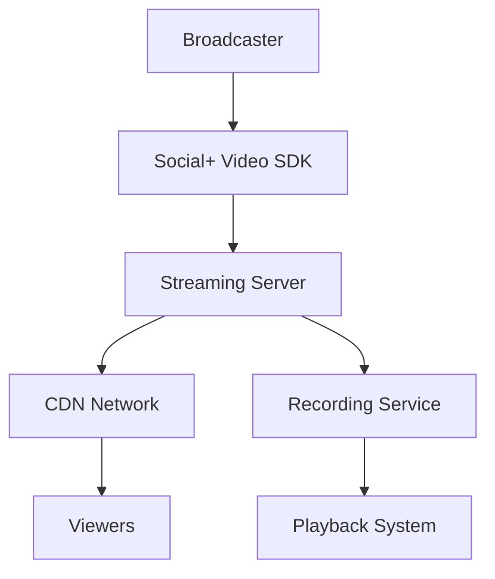

# Streaming Basics

Understanding the fundamentals of live streaming is essential for effectively implementing Social+ Video SDK. This guide covers core concepts, stream lifecycle, and basic principles that apply across all platforms.

## What is Live Streaming?

Live streaming is the real-time transmission of video and audio content over the internet. With Social+ Video SDK, you can:

- **Broadcast**: Create and transmit live video content
- **View**: Watch live streams in real-time
- **Interact**: Engage with streams through comments and reactions
- **Record**: Automatically save streams for later playback

## Stream Architecture

### Basic Components



**Key Components:**
- **Broadcaster**: The user creating and transmitting the stream
- **Streaming Server**: Social+ infrastructure that processes the stream
- **CDN Network**: Content delivery network for global distribution
- **Viewers**: Users watching the live stream
- **Recording Service**: Automatic recording for playback

## Stream Lifecycle

Understanding the stream lifecycle is crucial for proper implementation:

<Tabs>
<Tab title="Stream States">
### Stream States

Every stream goes through these states:

```typescript
enum StreamStatus {
    IDLE = "idle",           // Stream created but not started
    LIVE = "live",           // Currently broadcasting
    ENDED = "ended",         // Broadcasting stopped, processing
    RECORDED = "recorded"    // Available for playback
}
```

**State Transitions:**

1. **IDLE** → **LIVE**: When broadcasting starts
2. **LIVE** → **ENDED**: When broadcasting stops
3. **ENDED** → **RECORDED**: When processing completes

### State Management

```typescript
// Monitor stream state changes
streamRepository.getStreamById(streamId).listen((stream) => {
    switch (stream.status) {
        case StreamStatus.IDLE:
            console.log('Stream ready to start');
            break;
        case StreamStatus.LIVE:
            console.log('Stream is live');
            notifyViewers();
            break;
        case StreamStatus.ENDED:
            console.log('Stream ended, processing...');
            showProcessingMessage();
            break;
        case StreamStatus.RECORDED:
            console.log('Stream available for playback');
            enablePlayback();
            break;
    }
});
```
</Tab>
<Tab title="Lifecycle Events">
### Key Lifecycle Events

Monitor these events for proper stream management:

```typescript
interface StreamEvents {
    onStreamCreated: (stream: Stream) => void;
    onStreamStarted: (stream: Stream) => void;
    onStreamEnded: (stream: Stream) => void;
    onStreamRecorded: (stream: Stream) => void;
    onStreamError: (error: StreamError) => void;
}

// Event handling example
const handleStreamEvents = {
    onStreamCreated: (stream) => {
        console.log(`Stream created: ${stream.streamId}`);
        // Initialize UI, prepare resources
    },
    
    onStreamStarted: (stream) => {
        console.log(`Stream started: ${stream.title}`);
        // Notify viewers, update UI
    },
    
    onStreamEnded: (stream) => {
        console.log(`Stream ended: ${stream.streamId}`);
        // Clean up resources, show end screen
    },
    
    onStreamRecorded: (stream) => {
        console.log(`Stream recorded: ${stream.playbackUrl}`);
        // Enable playback, notify users
    },
    
    onStreamError: (error) => {
        console.error(`Stream error: ${error.message}`);
        // Handle errors, show fallback UI
    }
};
```
</Tab>
</Tabs>

## Core Streaming Concepts

### Resolution and Quality

<Tabs>
<Tab title="Standard Resolutions">
**Supported Resolutions:**

| Quality | Resolution | Aspect Ratio | Bitrate | Use Case |
|---------|------------|--------------|---------|----------|
| **SD** | 480 × 854 | 9:16 | 1.2 Mbps | Mobile, low bandwidth |
| **HD** | 720 × 1280 | 9:16 | 2.5 Mbps | Balanced quality |
| **FHD** | 1080 × 1920 | 9:16 | 5.0 Mbps | High quality |

```typescript
// Set video quality
const videoConfig = {
    resolution: {
        width: 1080,
        height: 1920
    },
    bitrate: 5000000, // 5 Mbps
    frameRate: 30
};
```
</Tab>
<Tab title="Adaptive Streaming">
**Adaptive Bitrate Streaming:**

The SDK automatically adjusts quality based on:
- Network conditions
- Device capabilities
- Viewer preferences

```typescript
// Enable adaptive streaming
const adaptiveConfig = {
    enableAdaptiveBitrate: true,
    qualityLevels: [
        { resolution: { width: 480, height: 854 }, bitrate: 1200000 },
        { resolution: { width: 720, height: 1280 }, bitrate: 2500000 },
        { resolution: { width: 1080, height: 1920 }, bitrate: 5000000 }
    ]
};
```
</Tab>
</Tabs>

### Latency and Performance

<Tabs>
<Tab title="Latency Types">
**Understanding Latency:**

- **Glass-to-Glass**: Complete end-to-end delay (5-15 seconds typical)
- **Network Latency**: Time for data transmission (1-3 seconds)
- **Processing Latency**: Encoding/decoding time (1-2 seconds)
- **Buffer Latency**: Playback buffering (2-10 seconds)

```typescript
// Optimize for low latency
const lowLatencyConfig = {
    bufferSize: 'small',
    keyFrameInterval: 1, // 1 second
    enableFastStart: true,
    prioritizeLatency: true
};
```
</Tab>
<Tab title="Performance Optimization">
**Performance Best Practices:**

```typescript
class StreamOptimizer {
    optimizeForDevice() {
        const deviceCapabilities = this.getDeviceCapabilities();
        
        return {
            resolution: this.selectOptimalResolution(deviceCapabilities),
            bitrate: this.calculateOptimalBitrate(deviceCapabilities),
            frameRate: deviceCapabilities.supportsHighFrameRate ? 30 : 24
        };
    }
    
    private getDeviceCapabilities() {
        return {
            processingPower: this.assessProcessingPower(),
            networkSpeed: this.measureNetworkSpeed(),
            batteryLevel: this.getBatteryLevel(),
            supportsHardwareEncoding: this.checkHardwareSupport()
        };
    }
}
```
</Tab>
</Tabs>

## Stream Management

### Creating Streams

<Tabs>
<Tab title="Basic Stream Creation">
```typescript
// Create a basic stream
const createBasicStream = async () => {
    try {
        const stream = await streamRepository.createStream({
            title: 'My Live Stream',
            description: 'Broadcasting live from my app',
            isSecure: false
        });
        
        console.log('Stream created:', stream.streamId);
        return stream;
    } catch (error) {
        console.error('Failed to create stream:', error);
        throw error;
    }
};
```
</Tab>
<Tab title="Advanced Stream Configuration">
```typescript
// Create stream with advanced configuration
const createAdvancedStream = async () => {
    const streamConfig = {
        title: 'Professional Broadcast',
        description: 'High-quality live streaming event',
        
        // Security settings
        isSecure: true,
        allowedViewers: ['user1', 'user2'], // Optional viewer restriction
        
        // Quality settings
        maxResolution: { width: 1920, height: 1080 },
        targetBitrate: 4000000,
        
        // Recording settings
        enableRecording: true,
        recordingQuality: 'high',
        
        // Metadata
        tags: ['live', 'professional', 'event'],
        category: 'education',
        
        // Scheduling (optional)
        scheduledStartTime: new Date('2024-12-01T10:00:00Z'),
        estimatedDuration: 3600 // 1 hour in seconds
    };
    
    const stream = await streamRepository.createStream(streamConfig);
    return stream;
};
```
</Tab>
</Tabs>

### Stream Discovery

<Tabs>
<Tab title="Querying Streams">
```typescript
// Get streams by status
const getLiveStreams = () => {
    return streamRepository.getStreams()
        .status([StreamStatus.LIVE])
        .sortBy('createdAt', 'desc')
        .limit(20)
        .build();
};

// Get recorded streams
const getRecordedStreams = () => {
    return streamRepository.getStreams()
        .status([StreamStatus.RECORDED])
        .sortBy('viewCount', 'desc')
        .build();
};
```
</Tab>
<Tab title="Search and Filtering">
```typescript
// Advanced stream search
const searchStreams = (query: string, filters: StreamFilters) => {
    return streamRepository.getStreams()
        .search(query)
        .tags(filters.tags)
        .category(filters.category)
        .dateRange(filters.startDate, filters.endDate)
        .minViewCount(filters.minViewers)
        .sortBy(filters.sortBy, filters.sortOrder)
        .build();
};

// Usage example
const popularEducationStreams = searchStreams('tutorial', {
    category: 'education',
    tags: ['tutorial', 'learning'],
    minViewers: 100,
    sortBy: 'viewCount',
    sortOrder: 'desc'
});
```
</Tab>
</Tabs>

## Best Practices

### 1. Resource Management

```typescript
class StreamResourceManager {
    private activeStreams = new Map<string, Stream>();
    
    startStream(streamId: string) {
        // Check device resources before starting
        if (this.checkResourceAvailability()) {
            this.activeStreams.set(streamId, stream);
            return this.initializeStream(streamId);
        } else {
            throw new Error('Insufficient resources for streaming');
        }
    }
    
    stopStream(streamId: string) {
        // Clean up resources properly
        const stream = this.activeStreams.get(streamId);
        if (stream) {
            stream.cleanup();
            this.activeStreams.delete(streamId);
        }
    }
    
    private checkResourceAvailability() {
        return {
            memory: this.getAvailableMemory() > 100, // MB
            cpu: this.getCpuUsage() < 80, // percent
            network: this.getNetworkSpeed() > 1, // Mbps
            battery: this.getBatteryLevel() > 20 // percent
        };
    }
}
```

### 2. Error Handling

```typescript
class StreamErrorHandler {
    handleStreamError(error: StreamError) {
        switch (error.code) {
            case 'NETWORK_ERROR':
                return this.handleNetworkError(error);
            case 'PERMISSION_DENIED':
                return this.handlePermissionError(error);
            case 'RESOURCE_EXHAUSTED':
                return this.handleResourceError(error);
            case 'INVALID_CONFIGURATION':
                return this.handleConfigError(error);
            default:
                return this.handleUnknownError(error);
        }
    }
    
    private async handleNetworkError(error: StreamError) {
        // Implement retry logic with exponential backoff
        const retryDelays = [1000, 2000, 4000, 8000]; // ms
        
        for (const delay of retryDelays) {
            await this.wait(delay);
            try {
                return await this.retryOperation();
            } catch (retryError) {
                console.log(`Retry failed, waiting ${delay}ms...`);
            }
        }
        
        throw new Error('Network error: Unable to establish connection after retries');
    }
}
```

### 3. Performance Monitoring

```typescript
class StreamPerformanceMonitor {
    private metrics = {
        frameRate: 0,
        bitrate: 0,
        latency: 0,
        droppedFrames: 0,
        bufferHealth: 0
    };
    
    startMonitoring(streamId: string) {
        setInterval(() => {
            this.collectMetrics(streamId);
            this.analyzePerformance();
        }, 5000); // Monitor every 5 seconds
    }
    
    private analyzePerformance() {
        if (this.metrics.frameRate < 15) {
            console.warn('Low frame rate detected');
            this.suggestOptimizations('reduce_quality');
        }
        
        if (this.metrics.latency > 10000) {
            console.warn('High latency detected');
            this.suggestOptimizations('optimize_network');
        }
    }
}
```

## Common Patterns

### 1. Stream State Management

```typescript
// Redux-style state management for streams
interface StreamState {
    activeStreams: Record<string, Stream>;
    viewingStream: string | null;
    broadcastingStream: string | null;
    loading: boolean;
    error: string | null;
}

const streamReducer = (state: StreamState, action: StreamAction) => {
    switch (action.type) {
        case 'START_STREAM':
            return {
                ...state,
                broadcastingStream: action.streamId,
                loading: false
            };
        case 'JOIN_STREAM':
            return {
                ...state,
                viewingStream: action.streamId,
                loading: false
            };
        case 'STREAM_ERROR':
            return {
                ...state,
                error: action.error,
                loading: false
            };
        default:
            return state;
    }
};
```

### 2. Observer Pattern for Stream Events

```typescript
class StreamEventEmitter {
    private listeners = new Map<string, Function[]>();
    
    on(event: string, callback: Function) {
        if (!this.listeners.has(event)) {
            this.listeners.set(event, []);
        }
        this.listeners.get(event)!.push(callback);
    }
    
    emit(event: string, data: any) {
        const callbacks = this.listeners.get(event) || [];
        callbacks.forEach(callback => callback(data));
    }
    
    off(event: string, callback: Function) {
        const callbacks = this.listeners.get(event) || [];
        const index = callbacks.indexOf(callback);
        if (index > -1) {
            callbacks.splice(index, 1);
        }
    }
}

// Usage
const streamEvents = new StreamEventEmitter();
streamEvents.on('stream:started', (stream) => {
    console.log('Stream started:', stream.title);
});
```

## Next Steps

Now that you understand streaming basics, explore these related topics:

- **[Video Quality](./video-quality)** - Learn about resolution, bitrates, and quality optimization
- **[Permissions](./permissions)** - Understand camera and microphone permission handling
- **[Lifecycle Management](./lifecycle-management)** - Master stream lifecycle and state management
- **[Broadcasting Setup](../broadcasting/setup)** - Set up broadcasting in your application
- **[Platform-Specific Guides](../platform-specific/platform-comparison)** - Choose the right platform for your needs

## Troubleshooting

Common streaming issues and solutions:

1. **Stream won't start**: Check permissions and network connectivity
2. **Poor quality**: Verify device capabilities and network speed
3. **High latency**: Optimize network settings and reduce buffer size
4. **Dropped frames**: Lower resolution or bitrate settings

For detailed troubleshooting, see our [Troubleshooting Guide](../troubleshooting/overview).
