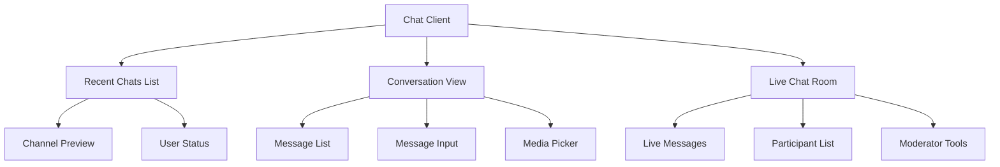

# Chat Components

social.plus UIKit provides a comprehensive set of chat components for building modern messaging experiences. These components are designed to work seamlessly across all platforms with consistent functionality and customizable styling.

<CardGroup cols={2}>
  <Card title="Chat Search" icon="magnifying-glass" href="/uikit/components/chat/search-chat">
    Powerful search across channels and messages
  </Card>
  <Card title="Recent Chats" icon="list" href="/uikit/components/chat/recent-chats">
    Chat list and channel management
  </Card>
  <Card title="Conversation Chat" icon="comments" href="/uikit/components/chat/conversation-chat">
    One-on-one and group messaging interface
  </Card>
  <Card title="Live Chat" icon="broadcast-tower" href="/uikit/components/chat/live-chat">
    Real-time chat for live events and streaming
  </Card>
</CardGroup>

## Key Features

<AccordionGroup>
  <Accordion title="Real-Time Messaging">
    - Instant message delivery and receipt
    - Typing indicators and read receipts
    - Online presence and status
    - Message synchronization across devices
  </Accordion>
  
  <Accordion title="Rich Media Support">
    - Text messages with formatting
    - Image and video sharing
    - File attachments
    - Voice messages
    - Location sharing
  </Accordion>
  
  <Accordion title="Advanced Features">
    - Message reactions and replies
    - Message editing and deletion
    - Message search and filtering
    - Push notifications
    - Offline message caching
  </Accordion>
  
  <Accordion title="Moderation Tools">
    - Message reporting
    - User blocking and muting
    - Profanity filtering
    - Admin moderation controls
  </Accordion>
</AccordionGroup>

## Platform Support

All chat components are available across platforms with platform-specific optimizations:

<CardGroup cols={2}>
  <Card title="Mobile Native" icon="mobile">
    **iOS & Android**
    - Native performance and animations
    - Platform-specific UI patterns
    - Keyboard handling and input optimization
    - Push notification integration
  </Card>
  <Card title="Web & Cross-Platform" icon="globe">
    **React Web & React Native**
    - Progressive Web App support
    - Responsive design for all screen sizes
    - WebRTC integration for voice/video
    - Service worker for offline support
  </Card>
</CardGroup>

## Getting Started

### Basic Implementation

<Steps>
  <Step title="Initialize Chat">
    Set up the chat client with your social.plus credentials
  </Step>
  <Step title="Choose Components">
    Select the chat components that fit your use case
  </Step>
  <Step title="Customize Appearance">
    Apply your brand colors and styling
  </Step>
  <Step title="Configure Features">
    Enable or disable specific chat features
  </Step>
</Steps>

### Quick Start Example

<CodeGroup>
```swift iOS
import AmityUIKit

// Initialize chat view controller
let chatVC = AmityChatViewController()
chatVC.channelId = "your_channel_id"

// Present chat interface
navigationController?.pushViewController(chatVC, animated: true)
```

```kotlin Android
import com.amity.socialcloud.uikit.chat.AmityChatFragment

// Create chat fragment
val chatFragment = AmityChatFragment.newInstance("your_channel_id")

// Add to container
supportFragmentManager.beginTransaction()
    .replace(R.id.container, chatFragment)
    .commit()
```

```javascript React
import { AmityChatRoom } from '@amityco/ui-kit';

function MyApp() {
  return (
    <AmityChatRoom
      channelId="your_channel_id"
      theme="light"
      onMessageSent={(message) => console.log('Message sent:', message)}
    />
  );
}
```

```javascript React Native
import { AmityChatScreen } from '@amityco/react-native-ui-kit';

function ChatScreen({ route }) {
  const { channelId } = route.params;
  
  return (
    <AmityChatScreen
      channelId={channelId}
      customization={{
        primaryColor: '#007AFF',
        secondaryColor: '#5856D6'
      }}
    />
  );
}
```
</CodeGroup>

## Component Architecture

### Chat System Overview



### Data Flow

<Steps>
  <Step title="Authentication">
    User authenticates with social.plus credentials
  </Step>
  <Step title="Channel Connection">
    Connect to specific chat channels or rooms
  </Step>
  <Step title="Real-Time Sync">
    Establish WebSocket connection for live updates
  </Step>
  <Step title="Message Handling">
    Send, receive, and display messages in real-time
  </Step>
</Steps>

## Customization Options

### Theme Configuration

```json
{
  "chat_theme": {
    "light": {
      "message_bubble_sent": "#007AFF",
      "message_bubble_received": "#E5E5EA",
      "text_color_sent": "#FFFFFF",
      "text_color_received": "#000000",
      "timestamp_color": "#8E8E93",
      "background_color": "#FFFFFF"
    },
    "dark": {
      "message_bubble_sent": "#0A84FF",
      "message_bubble_received": "#38383A",
      "text_color_sent": "#FFFFFF",
      "text_color_received": "#FFFFFF",
      "timestamp_color": "#8E8E93",
      "background_color": "#000000"
    }
  }
}
```

### Feature Configuration

```json
{
  "chat_features": {
    "message_reactions": true,
    "message_replies": true,
    "message_editing": true,
    "message_deletion": true,
    "file_sharing": true,
    "image_sharing": true,
    "voice_messages": true,
    "typing_indicators": true,
    "read_receipts": true,
    "push_notifications": true
  }
}
```

## Performance Considerations

<CardGroup cols={2}>
  <Card title="Message Pagination" icon="page">
    Efficiently load message history with pagination
  </Card>
  <Card title="Image Optimization" icon="image">
    Automatic image compression and caching
  </Card>
  <Card title="Offline Support" icon="wifi-slash">
    Queue messages when offline, sync when online
  </Card>
  <Card title="Memory Management" icon="microchip">
    Optimize memory usage for long conversations
  </Card>
</CardGroup>

### Best Practices

<AccordionGroup>
  <Accordion title="Message Loading">
    - Implement pagination for message history
    - Use virtual scrolling for large conversations
    - Cache recent messages locally
    - Preload critical attachments
  </Accordion>
  
  <Accordion title="Real-Time Updates">
    - Use WebSocket connections efficiently
    - Implement proper reconnection logic
    - Handle connection state changes gracefully
    - Optimize update frequency
  </Accordion>
  
  <Accordion title="User Experience">
    - Show loading states and progress indicators
    - Implement smooth animations and transitions
    - Handle errors gracefully with user feedback
    - Support keyboard shortcuts and accessibility
  </Accordion>
</AccordionGroup>

## Security Features

<Info>
All chat components include built-in security features to protect user communications and prevent abuse.
</Info>

<CardGroup cols={2}>
  <Card title="Message Encryption" icon="lock">
    End-to-end encryption for secure messaging
  </Card>
  <Card title="Content Moderation" icon="shield">
    AI-powered profanity and content filtering
  </Card>
  <Card title="User Controls" icon="user-shield">
    Block, mute, and report functionality
  </Card>
  <Card title="Admin Tools" icon="gavel">
    Comprehensive moderation and management tools
  </Card>
</CardGroup>

## Integration Examples

### Simple Chat Integration

For basic one-on-one or group messaging:

1. **Recent Chats List** - Show user's active conversations
2. **Conversation Chat** - Full messaging interface
3. **Basic customization** - Apply brand colors and styling

### Live Event Chat

For live streaming or event chat:

1. **Live Chat Room** - Real-time community messaging
2. **Moderation tools** - Admin controls for large audiences
3. **Custom reactions** - Event-specific reactions and features

### Customer Support Chat

For customer service integration:

1. **Conversation Chat** - Agent-customer messaging
2. **File sharing** - Document and image support
3. **Admin features** - Supervisor tools and analytics

## Next Steps

<CardGroup cols={2}>
  <Card title="Chat Search" href="/uikit/components/chat/search-chat">
    Add powerful search capabilities to your chat
  </Card>
  <Card title="Recent Chats" href="/uikit/components/chat/recent-chats">
    Create a comprehensive chat list interface
  </Card>
  <Card title="Conversation Chat" href="/uikit/components/chat/conversation-chat">
    Implement one-on-one and group messaging
  </Card>
  <Card title="Live Chat" href="/uikit/components/chat/live-chat">
    Build real-time community chat features
  </Card>
</CardGroup>
