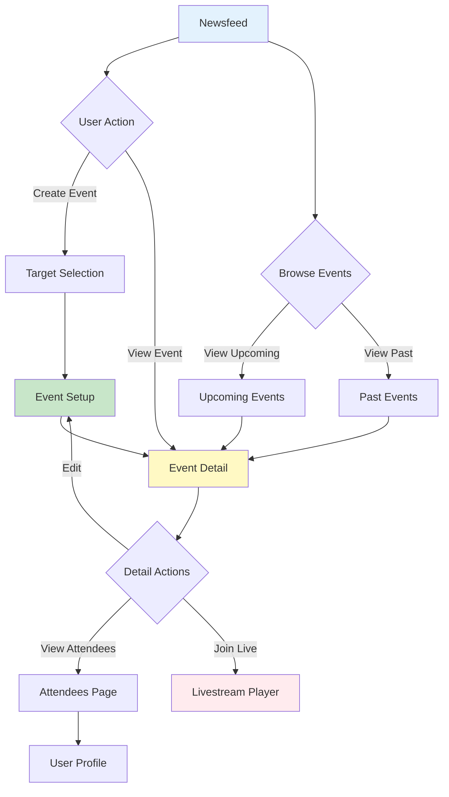

# Event Component

The Event component provides a complete UI solution for scheduling, discovering, and managing events within your application. It includes pages for event creation, event details, attendee management, and event discovery with calendar integration.

## Overview

The Event component suite enables rich event functionality including:

<CardGroup cols={2}>
  <Card title="Event Creation" icon="calendar-plus">
    **Full-featured event setup**
    - Target selection (community/user)
    - Event details configuration
    - In-person or virtual events
    - Cover image upload
    - Schedule management
  </Card>
  <Card title="Event Discovery" icon="magnifying-glass">
    **Find and explore events**
    - Upcoming events list
    - Past events history
    - Filter by community
    - Search and sort
    - Calendar views
  </Card>
  <Card title="Event Management" icon="gear">
    **Comprehensive event controls**
    - View event details
    - Edit event information
    - Manage attendees
    - RSVP tracking
    - Delete events
  </Card>
  <Card title="RSVP System" icon="hand">
    **Attendee management**
    - Going/Interested/Not Going
    - Attendee lists by status
    - Real-time updates
    - Notification triggers
    - Status switching
  </Card>
</CardGroup>

## Components

<Tabs>
  <Tab title="Target Selection">
    ### AmityEventTargetSelectionPage

    Target selection page for choosing where to create an event (community or user profile).

    **Platform Availability:**
    - ✅ iOS
    - ✅ Android

    **Usage:**

    <CodeGroup>
    ```swift iOS
    let targetSelectionPage = AmityEventTargetSelectionPageBehavior(
        onTargetSelected: { targetType, targetId in
            // Navigate to event setup
            let setupPage = AmityEventSetupPageBehavior(
                mode: .create,
                targetType: targetType,
                targetId: targetId
            )
            navigationController?.pushViewController(setupPage, animated: true)
        },
        onBackPressed: {
            navigationController?.popViewController(animated: true)
        }
    )
    
    navigationController?.pushViewController(targetSelectionPage, animated: true)
    ```

    ```kotlin Android
    val targetSelectionPage = AmityEventTargetSelectionPageBehavior(
        onTargetSelected = { targetType, targetId ->
            // Navigate to event setup
            val setupPage = AmityEventSetupPageBehavior(
                mode = AmityEventSetupMode.CREATE,
                targetType = targetType,
                targetId = targetId
            )
            findNavController().navigate(setupPage)
        },
        onBackPressed = {
            findNavController().popBackStack()
        }
    )
    
    findNavController().navigate(targetSelectionPage)
    ```
    </CodeGroup>

    **UI Elements:**
    - Community selection list
    - User profile option
    - Search bar for communities
    - Selected target indicator

    **Navigation:**
    - Entry: From create event button
    - Exit: On target selected → Event Setup Page
    - Cancel: On back pressed → Previous screen

    **Behavior:**
    1. User taps "Create Event" from newsfeed or profile
    2. Page displays communities user can create events in
    3. User selects community or chooses user profile
    4. OnTargetSelected callback fires with target details
    5. Navigate to Event Setup Page with target

    **Permissions:**
    - Shows only communities where user has event creation permission
    - Always shows user's own profile as option

  </Tab>
  
  <Tab title="Event Setup">
    ### AmityEventSetupPage

    Event creation and editing page with full configuration options.

    **Platform Availability:**
    - ✅ iOS
    - ✅ Android

    **Usage:**

    <CodeGroup>
    ```swift iOS
    // Create new event
    let createPage = AmityEventSetupPageBehavior(
        mode: .create,
        targetType: .community,
        targetId: "community-123",
        onEventCreated: { event in
            // Navigate to event detail page
            let detailPage = AmityEventDetailPageBehavior(eventId: event.eventId)
            navigationController?.pushViewController(detailPage, animated: true)
        },
        onBackPressed: {
            navigationController?.popViewController(animated: true)
        }
    )
    
    // Edit existing event
    let editPage = AmityEventSetupPageBehavior(
        mode: .edit,
        eventId: "event-456",
        onEventUpdated: { event in
            navigationController?.popViewController(animated: true)
        },
        onBackPressed: {
            navigationController?.popViewController(animated: true)
        }
    )
    ```

    ```kotlin Android
    // Create new event
    val createPage = AmityEventSetupPageBehavior(
        mode = AmityEventSetupMode.CREATE,
        targetType = AmityEventTargetType.COMMUNITY,
        targetId = "community-123",
        onEventCreated = { event ->
            // Navigate to event detail page
            val detailPage = AmityEventDetailPageBehavior(eventId = event.eventId)
            findNavController().navigate(detailPage)
        },
        onBackPressed = {
            findNavController().popBackStack()
        }
    )
    
    // Edit existing event
    val editPage = AmityEventSetupPageBehavior(
        mode = AmityEventSetupMode.EDIT,
        eventId = "event-456",
        onEventUpdated = { event ->
            findNavController().popBackStack()
        },
        onBackPressed = {
            findNavController().popBackStack()
        }
    )
    ```
    </CodeGroup>

    **UI Elements:**

    | Element | Description | Required |
    |---------|-------------|----------|
    | Event Title | Text input for event name | Yes |
    | Description | Multi-line text for event details | No |
    | Cover Image | Photo picker/camera for event image | No |
    | Start Date/Time | Date and time picker for event start | Yes |
    | End Date/Time | Date and time picker for event end | No |
    | Event Type | Toggle: In-Person / Virtual | Yes |
    | Location | Address input (in-person events) | Conditional |
    | External URL | URL input (virtual events) | Conditional |
    | Save Button | Create/Update event action | - |
    | Cancel Button | Discard changes action | - |

    **Event Types:**

    **In-Person Events:**
    - Location field required
    - Address search/autocomplete
    - Map preview (optional)
    - External URL disabled

    **Virtual Events:**
    - External URL field required
    - URL validation
    - Location disabled
    - Clickable link preview

    **Validation:**

    ```swift
    // Required fields validation
    func validateEventForm() -> Bool {
        guard !titleTextField.text.isEmpty else {
            showError("Event title is required")
            return false
        }
        
        guard startDatePicker.date > Date() else {
            showError("Start date must be in the future")
            return false
        }
        
        if let endDate = endDatePicker.date {
            guard endDate > startDatePicker.date else {
                showError("End date must be after start date")
                return false
            }
        }
        
        if eventType == .inPerson {
            guard !locationTextField.text.isEmpty else {
                showError("Location is required for in-person events")
                return false
            }
        } else if eventType == .virtual {
            guard !externalUrlTextField.text.isEmpty else {
                showError("External URL is required for virtual events")
                return false
            }
            guard isValidURL(externalUrlTextField.text) else {
                showError("Invalid URL format")
                return false
            }
        }
        
        return true
    }
    ```

    **Navigation:**
    - Entry: From target selection or edit button
    - Exit: On save → Event Detail Page
    - Cancel: On back → Confirmation dialog if changes exist

    **Behavior:**
    1. User fills event details form
    2. Selects event type (in-person/virtual)
    3. Adds optional cover image
    4. Sets date/time schedule
    5. Taps "Create Event" or "Save Changes"
    6. Validation runs
    7. OnEventCreated/OnEventUpdated callback fires
    8. Navigate to event detail page

  </Tab>
  
  <Tab title="Event Detail">
    ### AmityEventDetailPage

    Display comprehensive event information with RSVP options.

    **Platform Availability:**
    - ✅ iOS
    - ✅ Android

    **Usage:**

    <CodeGroup>
    ```swift iOS
    let eventDetailPage = AmityEventDetailPageBehavior(
        eventId: "event-123",
        onEditEvent: { event in
            // Navigate to edit page
            let editPage = AmityEventSetupPageBehavior(
                mode: .edit,
                eventId: event.eventId
            )
            navigationController?.pushViewController(editPage, animated: true)
        },
        onDeleteEvent: { event in
            showDeleteConfirmation(event: event)
        },
        onViewAttendees: { event, status in
            // Navigate to attendees page
            let attendeesPage = AmityEventAttendeesPageBehavior(
                eventId: event.eventId,
                initialFilter: status
            )
            navigationController?.pushViewController(attendeesPage, animated: true)
        },
        onJoinLivestream: { event in
            // Launch livestream player if event is live
            if let roomId = event.liveRoomId {
                launchLivestreamPlayer(roomId: roomId)
            }
        },
        onBackPressed: {
            navigationController?.popViewController(animated: true)
        }
    )
    
    navigationController?.pushViewController(eventDetailPage, animated: true)
    ```

    ```kotlin Android
    val eventDetailPage = AmityEventDetailPageBehavior(
        eventId = "event-123",
        onEditEvent = { event ->
            // Navigate to edit page
            val editPage = AmityEventSetupPageBehavior(
                mode = AmityEventSetupMode.EDIT,
                eventId = event.eventId
            )
            findNavController().navigate(editPage)
        },
        onDeleteEvent = { event ->
            showDeleteConfirmation(event)
        },
        onViewAttendees = { event, status ->
            // Navigate to attendees page
            val attendeesPage = AmityEventAttendeesPageBehavior(
                eventId = event.eventId,
                initialFilter = status
            )
            findNavController().navigate(attendeesPage)
        },
        onJoinLivestream = { event ->
            // Launch livestream player if event is live
            event.liveRoomId?.let { roomId ->
                launchLivestreamPlayer(roomId)
            }
        },
        onBackPressed = {
            findNavController().popBackStack()
        }
    )
    
    findNavController().navigate(eventDetailPage)
    ```
    </CodeGroup>

    **UI Sections:**

    **Header Section:**
    - Cover image (if available)
    - Event title
    - Host avatar and name
    - Edit/Delete menu (creator only)

    **Event Info Section:**
    - 📅 Start date and time
    - 📅 End date and time (if set)
    - 📍 Location (in-person events)
    - 🔗 External URL (virtual events)
    - 📝 Description

    **RSVP Section:**
    - Going count (tappable → attendees list)
    - Interested count (tappable → attendees list)
    - RSVP buttons: Going / Interested / Not Going
    - Current user's RSVP status highlighted

    **Livestream Section (if linked):**
    - "Event is Live" indicator
    - Join livestream button
    - Viewer count

    **Elements:**

    | Element | Visibility | Action |
    |---------|------------|--------|
    | Edit Button | Creator only | Navigate to edit page |
    | Delete Button | Creator only | Show delete confirmation |
    | Going Count | Always | Navigate to attendees (Going) |
    | Interested Count | Always | Navigate to attendees (Interested) |
    | RSVP Buttons | Always | Update user RSVP |
    | Join Livestream | When live | Launch livestream player |
    | External URL | Virtual events | Open in browser |
    | Location | In-person events | Open in maps |

    **RSVP Interaction:**

    ```swift
    func handleRSVPAction(_ status: AmityEventRSVPStatus) {
        AmityEventRepository.shared.createOrUpdateRSVP(
            eventId: event.eventId,
            status: status
        ) { result in
            switch result {
            case .success(let rsvp):
                updateRSVPUI(rsvp.status)
                updateAttendeeCounts()
            case .failure(let error):
                showError("Failed to update RSVP: \(error)")
            }
        }
    }
    ```

    **Real-Time Updates:**
    - Attendee counts update automatically
    - RSVP status syncs across sessions
    - Livestream status shows/hides based on room state
    - Event edits reflect immediately

  </Tab>
  
  <Tab title="Attendees">
    ### AmityEventAttendeesPage

    View and manage event attendees filtered by RSVP status.

    **Platform Availability:**
    - ✅ iOS
    - ✅ Android

    **Usage:**

    <CodeGroup>
    ```swift iOS
    let attendeesPage = AmityEventAttendeesPageBehavior(
        eventId: "event-123",
        initialFilter: .going,
        onUserSelected: { user in
            // Navigate to user profile
            let profilePage = AmityUserProfilePageBehavior(userId: user.userId)
            navigationController?.pushViewController(profilePage, animated: true)
        },
        onBackPressed: {
            navigationController?.popViewController(animated: true)
        }
    )
    
    navigationController?.pushViewController(attendeesPage, animated: true)
    ```

    ```kotlin Android
    val attendeesPage = AmityEventAttendeesPageBehavior(
        eventId = "event-123",
        initialFilter = AmityEventRSVPStatus.GOING,
        onUserSelected = { user ->
            // Navigate to user profile
            val profilePage = AmityUserProfilePageBehavior(userId = user.userId)
            findNavController().navigate(profilePage)
        },
        onBackPressed = {
            findNavController().popBackStack()
        }
    )
    
    findNavController().navigate(attendeesPage)
    ```
    </CodeGroup>

    **UI Elements:**

    **Filter Tabs:**
    - Going (count)
    - Interested (count)

    **Attendee List:**
    - User avatar
    - Display name
    - RSVP timestamp
    - Infinite scroll pagination

    **Empty States:**
    - No attendees going: "No one is going yet"
    - No attendees interested: "No one is interested yet"

    **Behavior:**

    ```swift
    class AttendeeListViewController {
        var currentFilter: AmityEventRSVPStatus = .going
        var attendeeLiveCollection: AmityCollection<AmityEventRSVP>?
        
        func loadAttendees(filter: AmityEventRSVPStatus) {
            currentFilter = filter
            
            attendeeLiveCollection = AmityEventRepository.shared.getAttendees(
                eventId: eventId,
                status: filter
            )
            
            attendeeLiveCollection?.observe { [weak self] attendees in
                self?.updateAttendeeList(attendees)
                self?.updateTabCounts()
            }
        }
        
        func didSelectTab(_ status: AmityEventRSVPStatus) {
            loadAttendees(filter: status)
        }
        
        func didSelectAttendee(_ rsvp: AmityEventRSVP) {
            onUserSelected?(rsvp.user)
        }
    }
    ```

    **Navigation:**
    - Entry: From event detail attendee counts
    - Exit: On back → Event detail page
    - User tap → User profile page

    **Real-Time Updates:**
    - Attendee list updates as users RSVP
    - Counts update automatically
    - List refreshes when switching tabs

  </Tab>
  
  <Tab title="Upcoming Events">
    ### AmityUpcomingEventsPage

    Display list of upcoming events the user can discover.

    **Platform Availability:**
    - ✅ iOS
    - ✅ Android

    **Usage:**

    <CodeGroup>
    ```swift iOS
    let upcomingEventsPage = AmityUpcomingEventsPageBehavior(
        filterByCommunityId: nil, // nil for all communities
        onEventSelected: { event in
            let detailPage = AmityEventDetailPageBehavior(eventId: event.eventId)
            navigationController?.pushViewController(detailPage, animated: true)
        },
        onCreateEvent: {
            let targetSelectionPage = AmityEventTargetSelectionPageBehavior()
            navigationController?.pushViewController(targetSelectionPage, animated: true)
        },
        onBackPressed: {
            navigationController?.popViewController(animated: true)
        }
    )
    
    navigationController?.pushViewController(upcomingEventsPage, animated: true)
    ```

    ```kotlin Android
    val upcomingEventsPage = AmityUpcomingEventsPageBehavior(
        filterByCommunityId = null, // null for all communities
        onEventSelected = { event ->
            val detailPage = AmityEventDetailPageBehavior(eventId = event.eventId)
            findNavController().navigate(detailPage)
        },
        onCreateEvent = {
            val targetSelectionPage = AmityEventTargetSelectionPageBehavior()
            findNavController().navigate(targetSelectionPage)
        },
        onBackPressed = {
            findNavController().popBackStack()
        }
    )
    
    findNavController().navigate(upcomingEventsPage)
    ```
    </CodeGroup>

    **UI Elements:**

    **Header:**
    - Page title: "Upcoming Events"
    - Create event button (if user has permission)

    **Event List:**
    - Event card with:
      - Cover image
      - Event title
      - Date/time
      - Location or "Virtual"
      - Going count
      - Interested count
      - User's RSVP status indicator

    **Filtering:**
    - All communities (default)
    - Specific community (if filterByCommunityId set)
    - Sort by start date (earliest first)

    **Behavior:**

    ```swift
    class UpcomingEventsViewController {
        var eventsLiveCollection: AmityCollection<AmityEvent>?
        
        func loadUpcomingEvents(communityId: String? = nil) {
            let query = AmityEventQuery()
            query.status = .upcoming
            query.sortBy = .startTime
            
            if let communityId = communityId {
                query.targetId = communityId
                query.targetType = .community
            }
            
            eventsLiveCollection = AmityEventRepository.shared.getEvents(query: query)
            
            eventsLiveCollection?.observe { [weak self] events in
                self?.updateEventList(events)
                self?.updateEmptyState(isEmpty: events.isEmpty)
            }
        }
        
        func didSelectEvent(_ event: AmityEvent) {
            onEventSelected?(event)
        }
        
        func didTapCreateEvent() {
            onCreateEvent?()
        }
    }
    ```

    **Empty State:**
    - No upcoming events: "No upcoming events"
    - Create event button (if permitted)

    **Pagination:**
    - Infinite scroll
    - Load more on scroll to bottom
    - Pull to refresh

  </Tab>
  
  <Tab title="Past Events">
    ### AmityPastEventsPage

    Display list of past events for historical reference.

    **Platform Availability:**
    - ✅ iOS
    - ✅ Android

    **Usage:**

    <CodeGroup>
    ```swift iOS
    let pastEventsPage = AmityPastEventsPageBehavior(
        filterByCommunityId: nil, // nil for all communities
        onEventSelected: { event in
            let detailPage = AmityEventDetailPageBehavior(eventId: event.eventId)
            navigationController?.pushViewController(detailPage, animated: true)
        },
        onBackPressed: {
            navigationController?.popViewController(animated: true)
        }
    )
    
    navigationController?.pushViewController(pastEventsPage, animated: true)
    ```

    ```kotlin Android
    val pastEventsPage = AmityPastEventsPageBehavior(
        filterByCommunityId = null, // null for all communities
        onEventSelected = { event ->
            val detailPage = AmityEventDetailPageBehavior(eventId = event.eventId)
            findNavController().navigate(detailPage)
        },
        onBackPressed = {
            findNavController().popBackStack()
        }
    )
    
    findNavController().navigate(pastEventsPage)
    ```
    </CodeGroup>

    **UI Elements:**

    **Header:**
    - Page title: "Past Events"

    **Event List:**
    - Event card with:
      - Cover image (grayed/dimmed)
      - Event title
      - Date/time
      - "Ended" label
      - Final attendee counts

    **Filtering:**
    - All communities (default)
    - Specific community (if filterByCommunityId set)
    - Sort by start date (most recent first)

    **Behavior:**

    ```swift
    class PastEventsViewController {
        var eventsLiveCollection: AmityCollection<AmityEvent>?
        
        func loadPastEvents(communityId: String? = nil) {
            let query = AmityEventQuery()
            query.status = .ended
            query.sortBy = .startTime
            query.sortDirection = .descending // Most recent first
            
            if let communityId = communityId {
                query.targetId = communityId
                query.targetType = .community
            }
            
            eventsLiveCollection = AmityEventRepository.shared.getEvents(query: query)
            
            eventsLiveCollection?.observe { [weak self] events in
                self?.updateEventList(events)
                self?.updateEmptyState(isEmpty: events.isEmpty)
            }
        }
        
        func didSelectEvent(_ event: AmityEvent) {
            onEventSelected?(event)
        }
    }
    ```

    **Empty State:**
    - No past events: "No past events"

    **Pagination:**
    - Infinite scroll
    - Load more on scroll to bottom
    - Pull to refresh

    **Interaction:**
    - Tap event → Event detail page (read-only for ended events)
    - No RSVP buttons for past events
    - Can view final attendee lists

  </Tab>
</Tabs>

## Feed Integration

### Event Post Display

Events appear in community and user feeds as special post cards:

**Feed Event Card Elements:**
- Event cover image
- Event title
- Date/time
- Location/Virtual indicator
- Going/Interested counts
- RSVP buttons (Quick RSVP)
- "View Details" button

**Quick RSVP:**
Users can RSVP directly from feed without navigating to event detail page:

```swift
func handleQuickRSVP(eventId: String, status: AmityEventRSVPStatus, in feedCell: EventFeedCell) {
    AmityEventRepository.shared.createOrUpdateRSVP(
        eventId: eventId,
        status: status
    ) { result in
        switch result {
        case .success(let rsvp):
            feedCell.updateRSVPStatus(rsvp.status)
            feedCell.refreshAttendeeCounts()
        case .failure(let error):
            feedCell.showError("Failed to RSVP")
        }
    }
}
```

### Event Post Actions

| Action | Description | Navigation |
|--------|-------------|------------|
| View Details | Open event detail page | → Event Detail Page |
| Going | Quick RSVP as going | Update in-place |
| Interested | Quick RSVP as interested | Update in-place |
| Going Count | View going attendees | → Attendees Page (Going) |
| Interested Count | View interested attendees | → Attendees Page (Interested) |
| Share | Share event | Share sheet |
| Report | Report event | Report flow |

## Navigation Flow



## Customization

### Theme Configuration

```json
{
  "theme": {
    "eventComponents": {
      "eventCard": {
        "backgroundColor": "#FFFFFF",
        "borderColor": "#E0E0E0",
        "borderRadius": 12,
        "coverImageAspectRatio": "16:9"
      },
      "rsvpButtons": {
        "going": {
          "selectedBackgroundColor": "#4CAF50",
          "unselectedBackgroundColor": "#FFFFFF",
          "selectedTextColor": "#FFFFFF",
          "unselectedTextColor": "#4CAF50",
          "borderColor": "#4CAF50"
        },
        "interested": {
          "selectedBackgroundColor": "#2196F3",
          "unselectedBackgroundColor": "#FFFFFF",
          "selectedTextColor": "#FFFFFF",
          "unselectedTextColor": "#2196F3",
          "borderColor": "#2196F3"
        },
        "notGoing": {
          "selectedBackgroundColor": "#F44336",
          "unselectedBackgroundColor": "#FFFFFF",
          "selectedTextColor": "#FFFFFF",
          "unselectedTextColor": "#F44336",
          "borderColor": "#F44336"
        }
      },
      "eventDetail": {
        "headerHeight": 200,
        "sectionSpacing": 16,
        "iconColor": "#757575"
      },
      "eventList": {
        "cardSpacing": 12,
        "showCoverImage": true,
        "showRSVPCounts": true
      }
    }
  }
}
```

### String Localization

```json
{
  "strings": {
    "events": {
      "createEvent": "Create Event",
      "eventDetails": "Event Details",
      "editEvent": "Edit Event",
      "deleteEvent": "Delete Event",
      "deleteEventConfirm": "Are you sure you want to delete this event?",
      "eventTitle": "Event Title",
      "eventDescription": "Description",
      "startDateTime": "Start Date & Time",
      "endDateTime": "End Date & Time",
      "location": "Location",
      "externalUrl": "External URL",
      "inPerson": "In-Person",
      "virtual": "Virtual",
      "going": "Going",
      "interested": "Interested",
      "notGoing": "Not Going",
      "goingCount": "{count} going",
      "interestedCount": "{count} interested",
      "viewAttendees": "View Attendees",
      "upcomingEvents": "Upcoming Events",
      "pastEvents": "Past Events",
      "noUpcomingEvents": "No upcoming events",
      "noPastEvents": "No past events",
      "noAttendeesGoing": "No one is going yet",
      "noAttendeesInterested": "No one is interested yet",
      "eventIsLive": "Event is Live",
      "joinLivestream": "Join Livestream",
      "selectTarget": "Select where to create event",
      "community": "Community",
      "userProfile": "My Profile",
      "requiredField": "This field is required",
      "invalidUrl": "Invalid URL format",
      "startDateMustBeFuture": "Start date must be in the future",
      "endDateMustBeAfterStart": "End date must be after start date"
    }
  }
}
```

### Permissions

Configure event creation permissions per community:

```json
{
  "permissions": {
    "event": {
      "create": {
        "roles": ["admin", "moderator", "member"],
        "requireApproval": false
      },
      "edit": {
        "ownOnly": true,
        "roles": ["admin", "moderator"]
      },
      "delete": {
        "ownOnly": true,
        "roles": ["admin", "moderator"]
      }
    }
  }
}
```

## Best Practices

<AccordionGroup>
  <Accordion title="Event Scheduling" icon="calendar">
    Optimize event scheduling workflow:
    
    - Validate dates before submission
    - Show timezone information clearly
    - Allow flexible end time (optional)
    - Provide calendar integration options
    - Send reminder notifications
  </Accordion>
  
  <Accordion title="RSVP Management" icon="hand">
    Enhance RSVP experience:
    
    - Make RSVP buttons prominent
    - Show real-time attendee updates
    - Allow easy status switching
    - Display user's current RSVP clearly
    - Send notifications on RSVP changes
  </Accordion>
  
  <Accordion title="Event Discovery" icon="magnifying-glass">
    Improve event discoverability:
    
    - Show upcoming events prominently in feed
    - Provide filtering options
    - Enable search by title/location
    - Group events by date
    - Highlight events user is attending
  </Accordion>
  
  <Accordion title="Livestream Integration" icon="video">
    Connect events with livestreams:
    
    - Link events to rooms during creation
    - Show live indicator when event starts
    - Provide easy join button
    - Update event status when stream ends
    - Save recordings to event
  </Accordion>
  
  <Accordion title="Performance" icon="bolt">
    Maintain good performance:
    
    - Lazy load event lists
    - Cache event details
    - Optimize image loading
    - Use pagination for attendees
    - Debounce RSVP actions
  </Accordion>
</AccordionGroup>

## Integration Examples

### Create Event from Community

```swift
func createEventFromCommunity(communityId: String) {
    // Direct to event setup with pre-selected community
    let setupPage = AmityEventSetupPageBehavior(
        mode: .create,
        targetType: .community,
        targetId: communityId,
        onEventCreated: { event in
            // Show success and navigate to event detail
            self.showToast("Event created successfully")
            self.navigateToEventDetail(eventId: event.eventId)
        }
    )
    
    navigationController?.pushViewController(setupPage, animated: true)
}
```

### Display Events in Community Profile

```swift
func showCommunityEvents(communityId: String) {
    // Show upcoming events for this community
    let upcomingPage = AmityUpcomingEventsPageBehavior(
        filterByCommunityId: communityId,
        onEventSelected: { event in
            self.navigateToEventDetail(eventId: event.eventId)
        }
    )
    
    navigationController?.pushViewController(upcomingPage, animated: true)
}
```

### Handle Event with Livestream

```swift
func handleEventLivestream(event: AmityEvent) {
    if event.status == .live, let roomId = event.liveRoomId {
        // Event is currently live, join the stream
        launchLivestreamPlayer(roomId: roomId)
    } else if event.status == .upcoming {
        // Event hasn't started yet, show countdown
        showCountdown(to: event.startTime)
    } else if event.status == .ended, let recordedUrl = event.recordedUrl {
        // Event ended, show recording
        playRecording(url: recordedUrl)
    }
}
```

### Quick RSVP from Notification

```swift
func handleEventNotification(eventId: String, action: String) {
    switch action {
    case "rsvp_going":
        AmityEventRepository.shared.createOrUpdateRSVP(
            eventId: eventId,
            status: .going
        ) { result in
            if case .success = result {
                self.showToast("You're going to this event!")
            }
        }
    case "view_event":
        navigateToEventDetail(eventId: eventId)
    default:
        break
    }
}
```

## Platform-Specific Notes

### iOS

- Uses native `UIDatePicker` for date/time selection
- Supports iOS 13+ system colors
- Integrates with Calendar app for reminders
- Uses `MKMapView` for location display

### Android

- Uses Material Design date/time pickers
- Supports Android 5.0+ (API 21+)
- Integrates with Google Calendar
- Uses Google Maps for location display

## Accessibility

- All buttons have accessibility labels
- Date/time pickers support VoiceOver/TalkBack
- RSVP status announced to screen readers
- Image descriptions for cover photos
- High contrast mode support

## Error Handling

Common error scenarios and handling:

| Error | Scenario | Handling |
|-------|----------|----------|
| Permission Denied | User can't create event in community | Show error message, hide create button |
| Invalid Date | End date before start date | Show validation error inline |
| Network Error | Failed to create/update event | Show retry option |
| Event Not Found | Event deleted or inaccessible | Show not found message, navigate back |
| RSVP Failed | Network issue during RSVP | Show error, keep previous state |

## Related Topics

<CardGroup cols={3}>
  <Card title="Events SDK" href="/social-plus-sdk/social/events/overview" icon="code">
    SDK event APIs and data models
  </Card>
  <Card title="Community" href="/uikit/components/social/community" icon="users">
    Community UI components
  </Card>
  <Card title="Livestream" href="/uikit/components/social/livestream" icon="video">
    Livestream UI components
  </Card>
</CardGroup>
