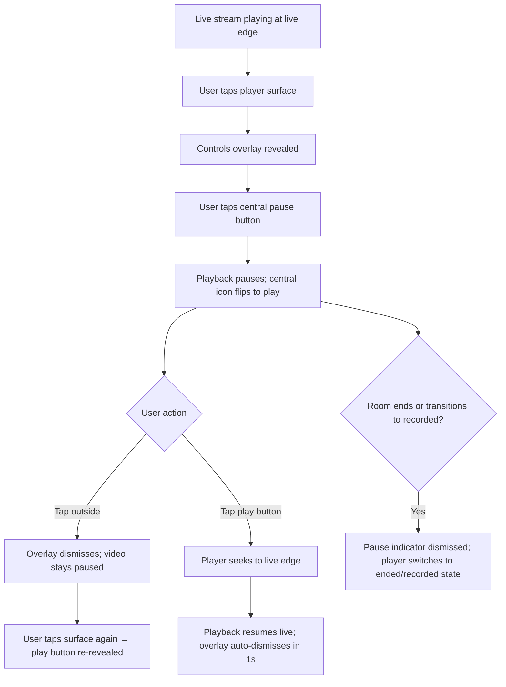

<Info>
  **UIKit Component**: Livestream components are built on top of the social.plus
  SDK, providing ready-to-use live video broadcasting and viewing UI with full
  data management handled automatically.
</Info>

<Frame>
  
</Frame>

## Feature Overview

The **Livestream** feature in social.plus UIKit v4 empowers users to broadcast and engage with live video content seamlessly. It provides a suite of components designed to facilitate the creation, viewing, and management of live streams within your application, offering comprehensive tools for both content creators and viewers.

### Key Features

<CardGroup cols={2}>
  <Card title="Stream Creation" icon="video">
    **Live stream setup and broadcasting**

    - Target audience selection (community or timeline)
    - Stream title, description, and thumbnail setup
    - Real-time broadcasting controls
    - Camera switching and stream management

  </Card>

  <Card title="Co-Streaming" icon="users-viewfinder">
    **Multi-broadcaster collaboration**\
    **(community only)**

    - Invite co-hosts to join your stream
    - Co-host management and controls
    - Real-time multi-broadcaster stage
    - Audio/video controls for each broadcaster
    - AI-powered content moderation

  </Card>

  <Card title="Stream Viewing" icon="play">
    **Live and recorded stream playback**

    - Real-time live stream viewing
    - Recorded stream playback for ended streams
    - Automatic thumbnail display from backend
    - Interactive viewer interface
    - Stream status and engagement features
    - Live Chat (community only)

  </Card>

  <Card title="Stream Management" icon="gears">
    **Broadcast control and administration**

    - Stream termination handling
    - Moderation and safety controls
    - Stream status management
    - Co-host permission management

  </Card>

  <Card title="Audience Targeting" icon="users">
    **Flexible content distribution**

    - Community-specific broadcasting
    - Personal timeline streaming
    - Audience selection workflows

  </Card>

  <Card title="Co-hosting" icon="user-group">
    **Multi-host broadcasting**

    - Invite co-hosts to join the stream
    - Real-time co-host participant streaming
    - Co-host permission controls
    - Collaborative stream management

  </Card>

  <Card title="Viewer Insights" icon="eye">
    **Real-time audience visibility**

    - Real-time viewer count display
    - Who's watching list to see active viewers
    - Live audience engagement tracking
    - Viewer presence monitoring

  </Card>

  <Card title="Built-in Analytics" icon="chart-line">
    **Automatic watch time tracking**

    - Watch minutes collection for viewers
    - Pause/resume aware tracking
    - No additional implementation required

  </Card>

  <Card title="Playback Controls" icon="circle-play">
    **Tap-to-reveal player controls**

    - Tap-to-reveal controls overlay on mobile
    - Pause a live stream and resume at the live edge
    - Chat keeps updating while video is paused
    - 10-second skip on video posts and recorded livestreams

  </Card>
</CardGroup>

### Livestream Analytics

<Tip>
  **Zero Implementation Required**: Livestream analytics is automatically built
  into UIKit's livestream viewing components. When users watch live or recorded
  streams through the Room Player Page, watch minutes are automatically tracked
  and synced to the backend—no additional code needed.
</Tip>

UIKit automatically handles all analytics tracking including:

- **Watch Session Creation**: Sessions are created when viewers enter the room player page
- **Accurate Duration Tracking**: Only counts actual watching time (paused/buffering time is excluded)
- **Role Transition Handling**: Automatically stops tracking when a viewer becomes a co-host
- **Network Resilient Sync**: Data is stored locally and synced with retry logic

For developers who want to understand the underlying analytics capabilities or implement custom tracking in non-UIKit applications, see the [SDK Livestream Analytics documentation](/social-plus-sdk/video-new/analytics/overview).

### Platform Support

| Feature                                                      | iOS | Android | Web         | Flutter | React Native |
| ------------------------------------------------------------ | --- | ------- | ----------- | ------- | ------------ |
| Create Live Stream Post                                      | ✅  | ✅      | ✅(desktop) | -       | ✅           |
| Stream Viewing                                               | ✅  | ✅      | ✅          | -       | ✅           |
| Co-Streaming<br />(Community)                                | ✅  | ✅      | ✅          | -       | -            |
| Live Stream Chat & Moderation<br />(Community)               | ✅  | ✅      | ✅          | -       | -            |
| Watching Now Viewer Count<br />                              | ✅  | ✅      | ✅          | -       | -            |
| Livestream Analytics<br />(Watch Minutes)                    | ✅  | ✅      | ✅          | -       | -            |
| Playback Controls<br />(tap-to-reveal, pause live, 10s skip) | ✅  | ✅      | ✅          | 🚧      | 🚧           |

<Note>
  Livestream creation and co-host streaming on web is supported only on desktop
  view. On mobile web, only viewing livestreams is supported.
</Note>

## Implementation Guide

<Tabs>
  <Tab title="Stream Creation">
    **Live stream creation and broadcasting setup**

    Stream Creation components enable users to set up and broadcast live video content with comprehensive controls for targeting, customization, and real-time management.

    ### Livestream Target Selection Page

    The target selection page allows users to choose where their live stream will be broadcasted - either to a specific community or their personal timeline.

    #### Features

    | Feature | Description |
    | --- | --- |
    | Target Selection | Choose between community or personal timeline broadcasting |
    | Community Browsing | Browse and select specific communities for broadcasting |

    #### Required Properties

    | Property | Type | Description |
    | --- | --- | --- |
    | None | - | Page requires no mandatory properties |

    #### Customization Options

    | Config ID | Type | Description |
    | --- | --- | --- |
    | `livestream_post_target_selection_page/*/*` | Page | Customize page theme |
    | `livestream_post_target_selection_page/*/close_button` | Element | Customize close button image |
    | `livestream_post_target_selection_page/*/my_timeline_text` | Element | Customize timeline option text |
    | `livestream_post_target_selection_page/*/title` | Element | Customize page title text |

    #### Code Examples

    <CodeGroup>

    ```swift iOS
    let page = AmityLivestreamPostTargetSelectionPage()
    let viewController = AmitySwiftUIHostingController(rootView: page)
    navigationController?.pushViewController(viewController, animated: true)
    ```

    ```kotlin Android
    @Composable
    fun composeLivestreamTargetSelection() {
        AmityLivestreamPostTargetSelectionPage()
    }

    // Using Activity
    fun startTargetSelectionActivity(context: Context) {
        val intent = AmityLivestreamPostTargetSelectionPageActivity.newIntent(
            context = context,
        )
        context.startActivity(intent)
    }
    ```

    ```typescript React
    <AmityUiKitProvider
        apiKey="API_KEY"
        apiRegion="API_REGION"
        userId="userId"
        displayName="displayName"
        configs={{}}
    >
        <LivestreamTargetSelectionPage />
    </AmityUiKitProvider>
    ```

    </CodeGroup>

    ### Livestream Creation Page

    The creation page enables users to set up their live stream by adding title, description, and thumbnail before starting the broadcast. Supports both solo broadcasting and co-streaming with invited co-hosts.

    <Tip>
    **Optional Thumbnail Upload**: Adding a thumbnail during stream creation is optional. The backend automatically generates a live thumbnail once the stream starts (`liveThumbnailUrl`), and a recorded thumbnail after the stream ends. If the creator does upload a cover image, it will take priority over the auto-generated thumbnails.
    </Tip>

    #### Features

    | Feature | Description |
    | --- | --- |
    | Stream Setup | Add title, description, and thumbnail for the live stream |
    | Camera Controls | Switch between front and back cameras |
    | Broadcasting Controls | Start, pause, and end live stream broadcasting |
    | Co-Host Management | Invite co-hosts to join your stream |
    | Co-Host Stage | View and manage active co-hosts during broadcast |
    | Real-time Preview | Live preview of stream content before broadcasting |
    | Viewer Count | Real-time display of total number of users currently watching the stream |
    | Who's Watching List | View the list of users currently watching the live stream |

    #### Required Properties

    | Property | Type | Description |
    | --- | --- | --- |
    | `targetId` | `String` | The ID of the target (community ID or user ID) |
    | `targetType` | `AmityPost.TargetType` | Type of target (community or user) |
    | `community` | `AmityCommunity?` | Community object (optional, for community streams) |

    #### Customization Options

    | Config ID | Type | Description |
    | --- | --- | --- |
    | `create_livestream_page/*/*` | Page | Customize page theme |
    | `create_livestream_page/*/start_livestream_button` | Element | Customize start stream button |
    | `create_livestream_page/*/add_thumbnail_button` | Element | Customize thumbnail selection button |
    | `create_livestream_page/*/switch_camera_button` | Element | Customize camera switch button |
    | `create_livestream_page/*/invite_co_host_button` | Element | Customize invite co-host button |
    | `create_livestream_page/*/microphone_button` | Element | Customize microphone toggle button |
    | `create_livestream_page/*/camera_toggle_button` | Element | Customize camera on/off toggle button |
    | `create_livestream_page/*/moderation_menu_button` | Element | Customize moderation menu access button |
    | `create_livestream_page/*/co_host_stage` | Component | Customize co-host video stage layout |
    | `create_livestream_page/*/end_live_stream_button` | Element | Customize end stream button |
    | `create_livestream_page/*/live_timer_status` | Element | Customize live timer display |
    | `create_livestream_page/*/invite_co_host_button` | Element | Customize invite co-host button |

    #### Code Examples

    <CodeGroup>

    ```swift iOS
    // For community stream
    let creationPage = AmityCreateLivestreamPage(
        targetId: "community-id",
        targetType: .community
    )
    let viewController = AmitySwiftUIHostingController(rootView: creationPage)
    navigationController?.pushViewController(viewController, animated: true)

    // For user timeline stream
    let timelineStream = AmityCreateLivestreamPage(
        targetId: "user-id",
        targetType: .user
    )
    ```

    ```kotlin Android
    @Composable
    fun composeCreateLivestreamPage(
        targetId: String,
        targetType: AmityPost.TargetType,
        community: AmityCommunity? = null,
    ) {
        AmityCreateLivestreamPage(
            targetId = targetId,
            targetType = targetType,
            targetCommunity = community
        )
    }

    // Using Activity
    fun startCreateLivestreamActivity(
        context: Context,
        targetId: String,
        targetType: AmityPost.TargetType,
        community: AmityCommunity? = null,
    ) {
        val intent = AmityCreateLivestreamPageActivity.newIntent(
            context = context,
            targetId = targetId,
            targetType = targetType,
            community = community,
        )
        context.startActivity(intent)
    }
    ```

    ```typescript React
    <AmityUiKitProvider
        apiKey="API_KEY"
        apiRegion="API_REGION"
        userId="userId"
        displayName="displayName"
        configs={{}}
    >
        <CreateLivestreamPage
            targetType="community"
            targetId="communityId"
            event={{}}
        />
    </AmityUiKitProvider>
    ```

    </CodeGroup>

    ### Navigation Behavior

    <CodeGroup>

    ```swift iOS
    // Livestream Target Selection Navigation
    class CustomLivestreamPostTargetSelectionPageBehavior: AmityLivestreamPostTargetSelectionPageBehavior {
        override func goToLiveStreamComposerPage(context: AmityLivestreamPostTargetSelectionPageBehavior.Context) {
            // Navigate to livestream creation page
            let creationPage = AmityCreateLivestreamPage(
                targetId: context.targetId,
                targetType: context.targetType
            )
            let viewController = AmitySwiftUIHostingController(rootView: creationPage)
            navigationController?.pushViewController(viewController, animated: true)
        }
    }

    // Setup custom behavior
    func setupLivestreamTargetSelectionBehavior() {
        let customBehavior = CustomLivestreamPostTargetSelectionPageBehavior()
        AmityUIKit4Manager.behaviour.liveStreamPostTargetSelectionPageBehavior = customBehavior
    }
    ```

    ```kotlin Android
    // Custom Livestream Target Selection Behavior
    class CustomLivestreamPostTargetSelectionPageBehavior : AmityLivestreamPostTargetSelectionPageBehavior() {
        override fun goToLivestreamPostComposerPage(
            context: Context,
            launcher: ActivityResultLauncher<Intent>,
            targetId: String,
            targetType: AmityPost.TargetType,
            community: AmityCommunity?,
        ) {
            // Custom navigation to livestream creation
            val intent = AmityCreateLivestreamPageActivity.newIntent(
                context = context,
                targetId = targetId,
                targetType = targetType,
                community = community,
            )
            launcher.launch(intent)
        }
    }

    // Setup custom behavior
    fun setCustomLivestreamBehavior() {
        val customBehaviour = CustomLivestreamPostTargetSelectionPageBehavior()
        AmityUIKit4Manager.behavior.livestreamTargetSelectionPageBehavior = customBehaviour
    }
    ```

    ```typescript React
        // Custom behavior override for livestream post target selection is not currently supported in React. This functionality will be available in a future release.
    ```

    </CodeGroup>

  </Tab>
  <Tab title="Co-Streaming">
    **Multi-broadcaster collaboration with co-hosting**

    Co-streaming components enable hosts to invite other users to join their livestream as co-hosts, creating collaborative broadcasting experiences with multiple broadcasters on a shared stage.

    ### Co-Host Invitation Page

    The co-host invitation page allows the host to invite other users to join their livestream as co-broadcasters.

    #### Features

    | Feature | Description |
    | --- | --- |
    | User Search | Search for users to invite as co-hosts |
    | User Selection | Select multiple users to invite |
    | Invitation Sending | Send co-host invitations to selected users |
    | Invitation Status | Track invitation status (pending/accepted/declined) |

    #### Required Properties

    | Property | Type | Description |
    | --- | --- | --- |
    | `roomId` | `String` | The ID of the livestream room |

    #### Customization Options

    | Config ID | Type | Description | |-----------|------|-------------|| | `livestream_invite_co_host_page/*/*` | Page | Customize invitation page theme | | `livestream_invite_co_host_page/*/search_bar` | Element | Customize user search input | | `livestream_invite_co_host_page/*/invite_button` | Element | Customize invite button | | `livestream_invite_co_host_page/*/user_list_item` | Component | Customize user list item display | | `livestream_invite_co_host_page/*/title` | Element | Customize page title text |

    #### Code Examples

    <CodeGroup>

    ```swift iOS
    let invitePage = AmityLivestreamInviteCoHostPage(roomId: "room-123")
    let viewController = AmitySwiftUIHostingController(rootView: invitePage)
    navigationController?.pushViewController(viewController, animated: true)
    ```

    ```kotlin Android
    @Composable
    fun composeInviteCoHostPage(roomId: String) {
        AmityLivestreamInviteCoHostPage(
            roomId = roomId
        )
    }

    // Using Activity
    fun startInviteCoHostActivity(context: Context, roomId: String) {
        val intent = AmityLivestreamInviteCoHostPageActivity.newIntent(
            context = context,
            roomId = roomId
        )
        context.startActivity(intent)
    }
    ```

    </CodeGroup>

    ### Co-Host Stage Component

    The co-host stage displays all active broadcasters (host \+ co-hosts) with their video feeds and audio/video controls.

    #### Features

    | Feature | Description |
    | --- | --- |
    | Multi-Video Layout | Display video feeds for host and co-hosts |
    | Audio/Video Controls | Mute/unmute audio, enable/disable video for each broadcaster |
    | Co-Host Management | Remove co-hosts (host only) |
    | Role Indicators | Visual badges showing host vs co-host roles |
    | Moderation Menu | Access moderation actions for the stream |

    #### Required Properties

    | Property | Type | Description |
    | --- | --- | --- |
    | `roomId` | `String` | The ID of the livestream room |
    | `participants` | `[AmityRoomParticipant]` | Array of room participants (host \+ co-hosts) |

    #### Customization Options

    | Config ID | Type | Description | |-----------|------|-------------|| | `livestream_co_host_stage/*/*` | Component | Customize co-host stage theme | | `livestream_co_host_stage/*/video_tile` | Element | Customize individual video tile | | `livestream_co_host_stage/*/host_badge` | Element | Customize host role badge | | `livestream_co_host_stage/*/co_host_badge` | Element | Customize co-host role badge | | `livestream_co_host_stage/*/microphone_button` | Element | Customize microphone toggle button | | `livestream_co_host_stage/*/camera_button` | Element | Customize camera toggle button | | `livestream_co_host_stage/*/remove_co_host_button` | Element | Customize remove co-host button |

    #### Code Examples

    <CodeGroup>

    ```swift iOS
    let coHostStage = AmityLivestreamCoHostStage(
        roomId: "room-123",
        participants: room.participants
    )
    // Embedded in livestream creation page
    ```

    ```kotlin Android
    @Composable
    fun composeCoHostStage(
        roomId: String,
        participants: List<AmityRoomParticipant>
    ) {
        AmityLivestreamCoHostStage(
            roomId = roomId,
            participants = participants
        )
    }
    ```

    </CodeGroup>

    ### Navigation Behavior

    <CodeGroup>

    ```swift iOS
    // Custom Co-Host Invitation Behavior
    class CustomLivestreamInviteCoHostPageBehavior: AmityLivestreamInviteCoHostPageBehavior {
        override func onInvitationsSent(context: AmityLivestreamInviteCoHostPageBehavior.Context) {
            // Navigate back to livestream page
            navigationController?.popViewController(animated: true)
            showToast("Invitations sent successfully")
        }

        override func onBackPressed() {
            navigationController?.popViewController(animated: true)
        }
    }

    // Setup custom behavior
    func setupInviteCoHostBehavior() {
        let customBehavior = CustomLivestreamInviteCoHostPageBehavior()
        AmityUIKit4Manager.behaviour.livestreamInviteCoHostPageBehavior = customBehavior
    }
    ```

    ```kotlin Android
    // Custom Co-Host Invitation Behavior
    class CustomLivestreamInviteCoHostPageBehavior : AmityLivestreamInviteCoHostPageBehavior() {
        override fun onInvitationsSent(
            context: Context,
            roomId: String,
            invitedUserIds: List<String>
        ) {
            // Navigate back to livestream page
            (context as? Activity)?.finish()
            Toast.makeText(context, "Invitations sent successfully", Toast.LENGTH_SHORT).show()
        }

        override fun onBackPressed(context: Context) {
            (context as? Activity)?.finish()
        }
    }

    // Setup custom behavior
    fun setupInviteCoHostBehavior() {
        val customBehaviour = CustomLivestreamInviteCoHostPageBehavior()
        AmityUIKit4Manager.behavior.livestreamInviteCoHostPageBehavior = customBehaviour
    }
    ```

    </CodeGroup>

    ### Co-Streaming Workflow

    ```mermaid
    graph TD
        A[Host Creates Stream] --> B[Stream Goes Live]
        B --> C{Host Action}
        C -->|Invite Co-Hosts| D[Open Invite Page]
        D --> E[Select Users]
        E --> F[Send Invitations]
        F --> G{Co-Host Response}
        G -->|Accepts| H[Co-Host Joins Stage]
        G -->|Declines| I[Invitation Declined]
        H --> J[Multi-Broadcaster Stage]
        J --> K{Stream Actions}
        K -->|Mute/Unmute| L[Toggle Audio]
        K -->|Camera On/Off| M[Toggle Video]
        K -->|Remove Co-Host| N[Co-Host Removed]
        K -->|End Stream| O[Stream Ends]

        style A fill:#e3f2fd
        style H fill:#c8e6c9
        style J fill:#fff9c4
        style O fill:#ffebee
    ```

    ### AI Content Moderation

    Co-streaming includes built-in AI moderation for safety:

    | Moderation Action | Trigger | Result |
    | --- | --- | --- |
    | Flag Stream | AI detects inappropriate content | Warning shown to host |
    | Terminate Stream | Severe policy violation | Stream automatically ended |
    | Remove Co-Host | Co-host violates policies | Co-host removed from stream |

    **Moderation Menu Access:**

    - Host only: Full moderation controls
    - Co-hosts: Cannot access moderation menu
    - Viewers: Can report stream

  </Tab>
  <Tab title="Stream Viewing">
    **Live stream viewing and playback interfaces**

    Stream Viewing components provide comprehensive interfaces for watching live broadcasts and playing back recorded streams with interactive features and controls.

    ### Livestream Player Page

    The player page provides viewers with the interface to watch live or recorded streams, supporting real-time viewing and playback of previously ended streams.

    #### Features

    | Feature | Description |
    | --- | --- |
    | Live Viewing | Real-time live stream viewing with minimal latency |
    | Recorded Playback | Playback of previously ended live streams |
    | Interactive Controls | Stream controls, volume, and playback options |
    | Stream Information | Display stream title, description, and metadata |
    | Co-host Display | View active co-hosts in the live stream |
    | Viewer Count | Real-time display of total number of users currently watching the stream |
    | Who's Watching List | View the list of users currently watching the live stream |
    | Tap-to-Reveal Controls (mobile) | Tap the player to reveal controls; only the central button toggles playback |
    | Pause Live Stream (mobile) | Pause playback locally while the broadcast continues; resume jumps to the live edge |
    | Live Chat During Pause | Chat keeps receiving messages in real time while the video is paused |
    | 10-Second Skip (recorded playback) | ±10s skip buttons on recorded livestreams; hidden on live |

    <Info>
    **Automatic Thumbnail**: The backend automatically generates a live thumbnail for the room session once the stream goes live (available via `liveThumbnailUrl` on the room model). After the stream ends and recording is processed, a recorded thumbnail is also auto-generated. UIKit uses these thumbnails automatically when displaying livestream posts in feeds -- no additional configuration is needed. If the creator uploaded a custom cover image, it takes priority over the auto-generated thumbnails.
    </Info>

    #### Required Properties

    | Property | Type | Description |
    | --- | --- | --- |
    | `post` | `AmityPost` | The livestream post object to display |

    #### Customization Options

    | Config ID | Type | Description |
    | --- | --- | --- |
    | `livestream_player_page/*/*` | Page | Customize player page theme |
    | `livestream_player_page/*/play_button` | Element | Customize play/pause button |
    | `livestream_player_page/*/volume_control` | Element | Customize volume controls |
    | `livestream_player_page/*/fullscreen_button` | Element | Customize fullscreen toggle |
    | `livestream_player_page/*/stream_info` | Component | Customize stream information display |
    | `livestream_player_page/*/inivte_co_host_list` | Component | Customize who's watching list display |

    #### Code Examples

    <CodeGroup>

    ```swift iOS
    let livestreamPlayer = AmityLivestreamPlayerPage(post: post)
    let viewController = AmitySwiftUIHostingController(rootView: livestreamPlayer)
    navigationController?.pushViewController(viewController, animated: true)
    ```

    ```kotlin Android
    @Composable
    fun composeLivestreamPlayerPage(post: AmityPost) {
        AmityLivestreamPlayerPage(
            post = post,
        )
    }

    // Using Activity
    fun startLivestreamPlayerActivity(context: Context, post: AmityPost) {
        val intent = AmityLivestreamPlayerPageActivity.newIntent(
            context = context,
            post = post,
        )
        context.startActivity(intent)
    }
    ```

    ```typescript React
    import React from 'react';
    import { AmityUiKitProvider, AmityLiveStreamPlayerPage } from '@amityco/ui-kit';

    const LiveStreamPlayer = ({ post }) => {
      return (
        <AmityUiKitProvider
          apiKey="API_KEY"
          apiRegion="API_REGION"
          userId="userId"
          displayName="displayName"
          configs={{}}
        >
          <AmityLiveStreamPlayerPage
            post={post}
            onStreamEnd={() => {
              // Handle stream end
            }}
            onError={(error) => {
              // Handle playback errors
            }}
          />
        </AmityUiKitProvider>
      );
    };
    ```

    </CodeGroup>

    ### Navigation Behavior

    <CodeGroup>

    ```swift iOS
    // Handle livestream player navigation
    func handleLivestreamPlayerNavigation() {
        // Player navigation typically handled internally
        // Custom actions can be implemented for stream end, errors, etc.
    }

    func handleStreamEnd() {
        // Navigate back or to stream summary
        navigationController?.popViewController(animated: true)
    }

    func handleStreamError(error: Error) {
        // Show error alert and navigate back
        let alert = UIAlertController(
            title: "Stream Error",
            message: error.localizedDescription,
            preferredStyle: .alert
        )
        alert.addAction(UIAlertAction(title: "OK", style: .default) { _ in
            self.navigationController?.popViewController(animated: true)
        })
        present(alert, animated: true)
    }
    ```

    ```kotlin Android
    // Handle livestream player navigation
    fun handleLivestreamPlayerNavigation(context: Context) {
        // Player navigation typically handled internally
        // Custom actions can be implemented for stream end, errors, etc.
    }

    fun handleStreamEnd(context: Context) {
        // Navigate back or to stream summary
        (context as? Activity)?.finish()
    }

    fun handleStreamError(context: Context, error: String) {
        // Show error message and navigate back
        Toast.makeText(context, "Stream error: $error", Toast.LENGTH_LONG).show()
        (context as? Activity)?.finish()
    }
    ```

    ```typescript React
    // Handle livestream player navigation
    const handleLivestreamPlayerNavigation = {
        onStreamEnd: () => {
            // Navigate back or to stream summary
            navigate(-1);
            showNotification('Live stream has ended');
        },
        onError: (error) => {
            // Handle playback errors
            showError(`Stream playback error: ${error.message}`);
            navigate(-1);
        },
        onFullscreen: (isFullscreen) => {
            // Handle fullscreen toggle
            if (isFullscreen) {
                enterFullscreen();
            } else {
                exitFullscreen();
            }
        }
    };
    ```

    </CodeGroup>

  </Tab>
  <Tab title="Stream Management">
    **Stream termination, moderation, and administrative controls**

    Stream Management components handle the administrative aspects of live streaming, including stream termination, moderation actions, and post-stream workflows.

    ### Livestream Terminated Page

    The terminated page is displayed when a live stream ends, either by the host or due to moderation actions, providing appropriate messaging and next steps.

    #### Features

    | Feature | Description |
    | --- | --- |
    | Termination Messaging | Display appropriate messages for different termination reasons |
    | Action Options | Provide relevant actions post-termination (restart, view recording, etc.) |
    | Stream Summary | Show stream statistics and performance metrics |
    | Navigation Controls | Options to return to feed or create new stream |

    #### Required Properties

    | Property | Type | Description |
    | --- | --- | --- |
    | `livestreamScreenType` | `LivestreamScreenType` | Type of termination screen to display |

    #### Customization Options

    | Config ID | Type | Description |
    | --- | --- | --- |
    | `livestream_terminated_page/*/*` | Page | Customize terminated page theme |
    | `livestream_terminated_page/*/livestream_terminated_action_button` | Element | Customize action button appearance |
    | `livestream_terminated_page/*/termination_message` | Element | Customize termination message text |
    | `livestream_terminated_page/*/stream_summary` | Component | Customize stream summary display |

    #### Code Examples

    <CodeGroup>

    ```swift iOS
    let terminatedPage = AmityLivestreamTerminatedPage()
    let viewController = AmitySwiftUIHostingController(rootView: terminatedPage)
    navigationController?.pushViewController(viewController, animated: true)
    ```

    ```kotlin Android
    @Composable
    fun composeLivestreamTerminatedPage(livestreamScreenType: LivestreamScreenType) {
        AmityLivestreamTerminatedPage(
            livestreamScreenType = livestreamScreenType,
        )
    }

    // Using Activity
    fun startLivestreamTerminatedActivity(
        context: Context,
        livestreamScreenType: LivestreamScreenType
    ) {
        val intent = AmityLivestreamTerminatedPageActivity.newIntent(
            context = context,
            screenType = livestreamScreenType,
        )
        context.startActivity(intent)
    }
    ```

    ```typescript React
    import React from 'react';
    import { AmityUiKitProvider, AmityLivestreamTerminatedPage } from '@amityco/ui-kit';

    const LiveStreamTerminated = ({ terminationReason, streamData }) => {
      return (
        <AmityUiKitProvider
          apiKey="API_KEY"
          apiRegion="API_REGION"
          userId="userId"
          displayName="displayName"
          configs={{}}
        >
          <AmityLivestreamTerminatedPage
            terminationReason={terminationReason}
            streamData={streamData}
            onActionButtonClick={(action) => {
              // Handle post-termination actions
              switch(action) {
                case 'restart':
                  // Navigate to new stream creation
                  break;
                case 'viewRecording':
                  // Navigate to recorded stream
                  break;
                case 'returnToFeed':
                  // Navigate back to main feed
                  break;
              }
            }}
          />
        </AmityUiKitProvider>
      );
    };
    ```

    </CodeGroup>

    ### Navigation Behavior

    <CodeGroup>

    ```swift iOS
    // Handle post-termination navigation
    func handleStreamTerminationActions(action: StreamTerminationAction) {
        switch action {
        case .restart:
            // Navigate to new stream creation
            let targetSelectionPage = AmityLivestreamPostTargetSelectionPage()
            let viewController = AmitySwiftUIHostingController(rootView: targetSelectionPage)
            navigationController?.pushViewController(viewController, animated: true)
        case .viewRecording:
            // Navigate to recorded stream if available
            if let recordedPost = getRecordedStream() {
                let playerPage = AmityLivestreamPlayerPage(post: recordedPost)
                let viewController = AmitySwiftUIHostingController(rootView: playerPage)
                navigationController?.pushViewController(viewController, animated: true)
            }
        case .returnToFeed:
            // Navigate back to main feed
            navigationController?.popToRootViewController(animated: true)
        }
    }
    ```

    ```kotlin Android
    // Handle post-termination navigation
    fun handleStreamTerminationActions(context: Context, action: StreamTerminationAction) {
        when (action) {
            StreamTerminationAction.RESTART -> {
                // Navigate to new stream creation
                val intent = AmityLivestreamPostTargetSelectionPageActivity.newIntent(context)
                context.startActivity(intent)
            }
            StreamTerminationAction.VIEW_RECORDING -> {
                // Navigate to recorded stream if available
                getRecordedStream()?.let { recordedPost ->
                    val intent = AmityLivestreamPlayerPageActivity.newIntent(context, recordedPost)
                    context.startActivity(intent)
                }
            }
            StreamTerminationAction.RETURN_TO_FEED -> {
                // Navigate back to main feed
                (context as? Activity)?.finish()
            }
        }
    }
    ```

    ```typescript React
    // Handle post-termination navigation
    const handleStreamTerminationNavigation = {
        restart: () => {
            // Navigate to new stream creation
            navigate('/livestream/create');
        },
        viewRecording: (streamId) => {
            // Navigate to recorded stream
            navigate(`/livestream/watch/${streamId}`);
        },
        returnToFeed: () => {
            // Navigate back to main feed
            navigate('/feed');
        },
        shareStream: (streamData) => {
            // Share stream functionality
            shareContent({
                title: streamData.title,
                url: streamData.shareUrl,
                description: streamData.description
            });
        }
    };
    ```

    </CodeGroup>

  </Tab>
</Tabs>

## Product Tagging

Product tagging in livestreams allows hosts and authorized co-hosts to showcase products to viewers during live broadcasts. Viewers can browse tagged products and open product links without leaving the stream.

<Frame>
  
</Frame>

<Info>
  Product tagging requires the Product Catalog to be configured and enabled for
  your network in the console. Available on iOS, Android, and Web only.
</Info>

### Tagging Phases

Product tagging is available across all livestream phases, with different access levels at each stage:

| Phase                           | Who can tag                             | Who can pin                             |
| ------------------------------- | --------------------------------------- | --------------------------------------- |
| **Pre-live** (backstage)        | Host only                               | Host only                               |
| **During livestream**           | Host \+ co-host (if permission granted) | Host \+ co-host (if permission granted) |
| **Post-live** (host management) | Host only                               | —                                       |

Viewers can browse and open tagged products during all phases, including replay.

### Product Pinning

A host or authorized co-host can pin one product at a time to display it as a prominent overlay card for all viewers.

- Only **one** product can be pinned at a time — pinning a new product automatically replaces the previous pin
- The pinned product always appears at the top of the product list
- If the pinned product is removed from the tag list, it is automatically unpinned
- When the livestream ends, the pin overlay is removed; the product list remains accessible to replay viewers

### Co-host Product Permissions

The host controls whether a co-host can manage products. This permission can be toggled from the backstage after the co-host accepts an invite, or from the co-host name menu during the stream.

- **Enabled**: Co-host can tag, remove, pin, and unpin products
- **Disabled**: Co-host cannot see or interact with any product management controls
- Permission changes apply immediately in real-time

### Viewer Experience

- The tag icon is only visible when at least one product is tagged
- A count badge on the tag icon updates in real-time as products are added or removed
- Tapping the tag icon opens a scrollable product list overlay
- Tapping a product opens its link in an in-app browser — the livestream continues playing behind the browser

### Limits & Constraints

| Limit                        | Value |
| ---------------------------- | ----- |
| Max products per livestream  | 20    |
| Simultaneous pinned products | 1     |

### Components Used in Livestreams

Product tagging in livestreams uses two shared UIKit components. See [Product Tagging Components](/uikit/components/social/product-tagging) for full parameter reference and code examples.

| Component                       | Used for                                                                                                                                         |
| ------------------------------- | ------------------------------------------------------------------------------------------------------------------------------------------------ |
| `ProductTagSelectionComponent`  | Searching and selecting products to tag (via `livestream` mode)                                                                                  |
| `ManageProductTagListComponent` | Managing tagged products with pin/unpin and remove controls (host/co-host view); browsing products in read-only overlay (viewer and replay view) |

The `ProductTagSelectionComponent` in `livestream` mode has a higher product limit (up to 20 total) and a different header label ("Add products") compared to post mode. The `ManageProductTagListComponent` in `playback` render mode disables pin controls for the post-live replay experience.

## Playback Controls

Playback Controls standardize the tap and pause behavior of the video player across the UIKit — for both video posts and livestreams. On mobile, tapping the player reveals a controls overlay (instead of toggling playback), pausing a live stream is a real state with a visible pause indicator, and recorded content offers ±10s skip.

<Info>
  Playback Controls apply to the livestream viewer and the shared video player
  used by video posts, media gallery, community video feeds, and recorded
  livestream playback. Live streams do not show skip controls.
</Info>

### Tap-to-Reveal Controls (Mobile)

On mobile clients, tapping the player surface reveals a controls overlay — it no longer toggles pause/play directly. Only the central pause/play button changes playback state.

| Behavior                      | Detail                                                                                                    |
| ----------------------------- | --------------------------------------------------------------------------------------------------------- |
| Tap surface while playing     | Reveals the controls overlay; playback continues                                                          |
| Auto-dismiss while playing    | Overlay hides after ~1 second of inactivity                                                               |
| Tap central pause/play button | Toggles playback (the only affordance for pause/play on mobile)                                           |
| Tap outside while paused      | Dismisses the overlay; the video stays paused. Tap the surface again to re-reveal the central play button |
| Auto-dismiss while paused     | Disabled — the overlay only dismisses on an explicit tap-outside                                          |

<Note>
  **Desktop web player:** One-step click-to-toggle is retained. Clicking the
  video pauses or resumes it directly; the central play icon persists while
  paused, the central pause icon appears briefly when resuming. Hover-to-reveal,
  mute, and fullscreen behavior are unchanged.
</Note>

### Pause a Live Stream

Viewers can pause a live stream locally. The broadcast continues on the sender's side; only the viewer's playback is frozen. On mobile, pause/resume goes through the central button in the tap-to-reveal overlay. On desktop, a single click on the video surface toggles play/pause directly.

| Behavior                 | Detail                                                                                                                                                                                         |
| ------------------------ | ---------------------------------------------------------------------------------------------------------------------------------------------------------------------------------------------- |
| How to pause / resume    | **Mobile:** tap the surface to reveal the overlay, then tap the central pause/play button. **Desktop:** single-click anywhere on the video surface to toggle play/pause                        |
| Pause indicator          | The central `play` icon shown while paused communicates the paused state — no separate badge is added                                                                                          |
| Resume behavior          | On resume, playback **jumps to the current live edge** — the viewer catches up to live rather than replaying from the paused position                                                          |
| Chat during pause        | Chat continues to receive and render new messages in real time; **no messages are missed or replayed** on resume                                                                               |
| `LIVE` badge             | Not repurposed — the badge continues to reflect broadcast status, not viewer playback state                                                                                                    |
| Stream ends while paused | If the room transitions to `ended` or `recorded` while the viewer is paused, that state **takes priority** — the pause indicator dismisses and the player moves to the ended or recorded state |

<Info>
  **Live edge resolution:** On resume, the player seeks to the HLS live-sync
  position when available, or to the end of the seekable range otherwise. No
  paused offset is tracked or restored.
</Info>

### 10-Second Skip (Video Posts & Recorded Livestreams)

Viewers can jump backward or forward 10 seconds while watching a video post or a recorded livestream. On mobile, skip buttons appear in the controls overlay next to the central pause/play button. On desktop, they sit in the existing web-player control bar.

| Behavior                   | Detail                                                                                                                                                                                       |
| -------------------------- | -------------------------------------------------------------------------------------------------------------------------------------------------------------------------------------------- |
| Availability               | Video posts and recorded livestreams (VOD-of-live), on **mobile and desktop**. **Hidden on live streams.**                                                                                   |
| −10s at start              | Seeking below `0:00` clamps to `0:00`; the current play state is preserved (playing stays playing, paused stays paused)                                                                      |
| +10s near end              | Clamps to the final frame **and pauses (end state)** — it does not loop or error                                                                                                            |
| Rapid repeated taps        | Each tap adds or subtracts 10 seconds to the target position (e.g. three quick `+10s` taps at `1:00` seek to `1:30`). The icon always shows `+10` / `−10` — it does not accumulate on-screen |
| Boundary during rapid taps | Boundary clamps apply mid-burst — back clamps to `0:00` (keeps the current play state), forward clamps to the final frame (pauses)                                                           |
| Desktop                    | The existing skip controls now use `−10s` / `+10s` (previously 15s). No other desktop behavior changes                                                                                       |

### Flow — Pause and Resume to Live (Mobile)



### Platform Support

| Feature                                        | iOS | Android | Web (mobile) | Web (desktop) | Flutter | React Native |
| ---------------------------------------------- | --- | ------- | ------------ | ------------- | ------- | ------------ |
| Tap-to-reveal controls overlay                 | ✅  | ✅      | ✅           | —             | 🚧      | 🚧           |
| 1s auto-dismiss while playing                  | ✅  | ✅      | ✅           | —             | 🚧      | 🚧           |
| Pause live stream + resume-to-live             | ✅  | ✅      | ✅           | ✅            | 🚧      | 🚧           |
| Chat continues during pause                    | ✅  | ✅      | ✅           | ✅            | 🚧      | 🚧           |
| Ended-while-paused hand-off                    | ✅  | ✅      | ✅           | ✅            | 🚧      | 🚧           |
| ±10s skip (video posts + recorded livestreams) | ✅  | ✅      | ✅           | ✅            | 🚧      | 🚧           |
| ±10s skip hidden on live                       | ✅  | ✅      | ✅           | ✅            | 🚧      | 🚧           |

**Legend:** ✅ Supported | 🚧 Planned | — Not applicable

<Note>
  On desktop web, playback controls are a **UI refresh only** — icons are
  updated and the skip amount changes from 15s to 10s. Click-to-toggle,
  hover-to-reveal, mute, and fullscreen behavior are unchanged.
</Note>

## Related Components

<CardGroup cols={3}>
  <Card title="Posts & Media" icon="file" href="/uikit/components/social/posts">
    **Post Components** Post creation and media management for livestream posts
  </Card>

<Card
  title="Social Feeds"
  icon="newspaper"
  href="/uikit/components/social/feeds"
>
  **Feed Components** Livestream post display and interaction in social feeds
</Card>

<Card
  title="Communities"
  icon="building"
  href="/uikit/components/social/communities"
>
  **Community Features** Community-based livestream broadcasting and management
</Card>

<Card
  title="Users & Profiles"
  icon="user"
  href="/uikit/components/social/users"
>
  **User Management** User profile integration with livestream content
</Card>

<Card
  title="Comments & Reactions"
  icon="heart"
  href="/uikit/components/social/comments-reactions"
>
  **Interaction Components** Real-time engagement during live streams
</Card>

<Card
  title="Content Moderation"
  icon="shield"
  href="/uikit/components/social/moderation"
>
  **Moderation Tools** Livestream content moderation and safety controls
</Card>

  <Card title="Product Tagging Components" icon="tag" href="/uikit/components/social/product-tagging">
    **Commerce Integration** Shared UIKit components for product tagging and management
  </Card>
</CardGroup>
