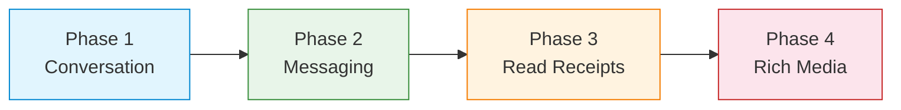

<Info>**SDK v7.x** · Last verified March 2026 · iOS · Android · Web · Flutter</Info>

This trail chains 4 feature guides for private, intimate messaging — the kind you build in dating apps, customer support tools, marketplace buyer-seller chats, or social app DMs.

<Note>
**After completing this trail you'll have:**
- Private Conversation channels auto-created between two users
- Full message history with pagination
- Delivery and read receipts ("Seen" indicators)
- Rich media — images, audio, and file attachments
</Note>

---

## Phase 1: Create the Conversation · `~20 min` · `Beginner`

**Goal:** Create a private Conversation channel between two users and display a chat list.

**What you'll build:**
- Conversation channel created on first DM (auto-created or explicit)
- Chat list showing the user's active conversations, sorted by last message
- Last message preview and timestamp in the conversation list
- Channel archiving for old or ended conversations

<Card
  title="Open the full guide →"
  icon="message"
  href="/use-cases/chat/channels-and-conversations"
>
  Channel creation (Conversation type), channel list, member management, last message preview.
</Card>

**When you're done:** The user has a list of their private conversations, each showing the last message. Now let's open one.

---

## Phase 2: Messaging · `~20 min` · `Beginner`

**Goal:** Build the message thread — send, receive, and load history.

**What you'll build:**
- Text message sending with optimistic rendering (appears instantly)
- Message history with pagination (infinite scroll upwards for older messages)
- Real-time subscription — new messages appear without polling
- Message edit and delete with "message was deleted" placeholder

<Card
  title="Open the full guide →"
  icon="paper-plane"
  href="/use-cases/chat/sending-messages"
>
  Send text, query message history, real-time subscription, edit and delete.
</Card>

**When you're done:** Both users can exchange messages in real-time. But the other person doesn't know if you've seen their message — let's fix that.

---

## Phase 3: Read Receipts & Delivery Status · `~15 min` · `Beginner`

**Goal:** Show the sender when their message was delivered and when the recipient read it.

**What you'll build:**
- Delivery status indicators (sent → delivered → read)
- Per-channel unread count badge on the conversation list
- "Seen by" indicator in the message thread
- Receipt sync for users on multiple devices

<Card
  title="Open the full guide →"
  icon="envelope-open"
  href="/use-cases/chat/unread-counts-and-read-receipts"
>
  Channel unread count, message delivery status, read receipts, receipt sync.
</Card>

**When you're done:** Both users see delivery and read indicators. The experience now feels like a polished, professional messenger.

---

## Phase 4: Rich Media · `~20 min` · `Intermediate`

**Goal:** Let users share more than text — photos, voice notes, files, and custom content.

**What you'll build:**
- Image messages with upload and preview
- Audio messages (voice notes) with record + send
- File attachments (PDF, documents)
- Custom message types for structured content (location pins, contact cards, etc.)

<Card
  title="Open the full guide →"
  icon="photo-film"
  href="/use-cases/chat/rich-media-messages"
>
  Image, audio, video, file messages. Custom message types with structured JSON data.
</Card>

**When you're done:** Your 1:1 chat supports the full range of content users expect from a modern messenger.

---

## What You've Built

A production-ready 1:1 messaging experience:

- ✅ Private Conversation channels auto-created on first DM
- ✅ Real-time messaging with history and pagination
- ✅ Delivery + read receipt indicators
- ✅ Images, audio, files, and custom message types

---

## Common Pitfalls

<Warning>
**Creating duplicate Conversation channels** — Always pass both `userIds` when creating a conversation. The SDK returns the existing channel if one already exists between the two users.
</Warning>

<Warning>
**Not disposing Live Collections** — Call `liveCollection.dispose()` when the chat screen unmounts. Forgetting this causes memory leaks and stale callbacks.
</Warning>

<Warning>
**Marking messages as read too early** — Only call `markAsRead` when the message is actually visible on screen, not when the channel is opened. Premature marking defeats the purpose of read receipts.
</Warning>

---

## Next Steps

<CardGroup cols={2}>
  <Card title="Message Reactions" icon="reply" href="/use-cases/chat/message-reactions-and-replies">
    Add emoji reactions and threaded replies to private conversations.
  </Card>
  <Card title="Chat Moderation" icon="shield-check" href="/use-cases/chat/chat-moderation">
    Add block/report/flag capabilities so users can protect themselves in DMs.
  </Card>
  <Card title="Group Chat" icon="users" href="/use-cases/chat/build-a-group-chat">
    Add group conversations that go beyond 1:1 — team rooms and community channels.
  </Card>
  <Card title="User Profiles & Social Graph" icon="user-group" href="/use-cases/social/user-profiles-and-social-graph">
    Connect your DM flow to the follow/friend system so users can initiate chats from profiles.
  </Card>
</CardGroup>
