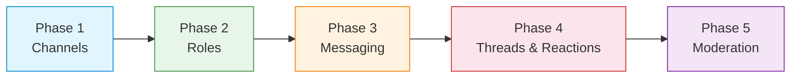

<Info>**SDK v7.x** · Last verified March 2026 · iOS · Android · Web · Flutter</Info>

This trail chains 5 feature guides into one linear path. Follow them in order to build a fully working group chat — persistent channels, rich media, threaded replies, role-based moderation.

<Note>
**After completing this trail you'll have:**
- Channels users can join, leave, and discover
- Full messaging — text, images, files, and voice notes
- Threaded replies so conversations stay organized
- Role-based moderation with per-community permissions
</Note>

---

## Phase 1: Channels & Members · `~20 min` · `Beginner`

**Goal:** Create a Community channel, invite members, and display a real-time channel list.

**What you'll build:**
- Community channel (public or private) with display name, avatar, and tags
- Member join/leave with member list query
- Real-time channel list with Live Collections — new channels appear automatically
- Channel archiving for old rooms

<Card
  title="Open the full guide →"
  icon="message"
  href="/use-cases/chat/channels-and-conversations"
>
  All channel types, create/update/archive, join/leave, member query, real-time channel list.
</Card>

**When you're done:** You have channels users can join. Next — give them roles before they start talking.

---

## Phase 2: Channel Roles & Permissions · `~20 min` · `Intermediate`

**Goal:** Establish who can do what before the first message is sent.

**What you'll build:**
- Channel owner and moderator roles
- Permission checks before sensitive actions (delete message, ban user)
- Role assignment for trusted community members
- Per-channel permission configuration

<Card
  title="Open the full guide →"
  icon="user-shield"
  href="/use-cases/chat/channel-roles-and-permissions"
>
  Role types, permission checks in SDK, assigning roles, configuring governance settings.
</Card>

**When you're done:** Roles are set up. Now let members actually talk.

---

## Phase 3: Messaging & Rich Media · `~20 min` · `Beginner`

**Goal:** Let members send every message type your group chat needs — text, images, audio, files, and custom cards.

**What you'll build:**
- Text messages with real-time delivery
- Image and file sharing
- Voice note messages (audio)
- Custom message types for structured content (polls, pinned notices, etc.)
- Message history with infinite scroll / pagination

<CardGroup cols={2}>
  <Card
    title="Sending Messages →"
    icon="paper-plane"
    href="/use-cases/chat/sending-messages"
  >
    Text, query history, real-time subscription, edit/delete.
  </Card>
  <Card
    title="Rich Media Messages →"
    icon="photo-film"
    href="/use-cases/chat/rich-media-messages"
  >
    Image, audio, video, file, custom message types.
  </Card>
</CardGroup>

**When you're done:** Members can share everything. Let's make conversations easier to follow with threads and reactions.

---

## Phase 4: Threads & Reactions · `~15 min` · `Beginner`

**Goal:** Let members reply in-thread to specific messages and react with emoji so the main chat stays clean.

**What you'll build:**
- Reply-to-a-message threading (nested conversation in a sidebar or inline)
- Emoji reactions on any message
- Real-time reaction count updates
- Reaction summary display (top 3 reactions + overflow count)

<Card
  title="Open the full guide →"
  icon="reply"
  href="/use-cases/chat/message-reactions-and-replies"
>
  Reply threading, reactions, real-time counts, removing reactions.
</Card>

**When you're done:** Conversations are organized and expressive. Now let's keep the community safe.

---

## Phase 5: Chat Moderation · `~25 min` · `Advanced`

**Goal:** Give moderators tools to maintain a healthy group — muting, banning, and AI content screening.

**What you'll build:**
- Mute/unmute members for a duration
- Ban disruptive members (removes from channel, deletes messages)
- AI content moderation to auto-flag rule violations
- Webhook events to alert your backend when serious violations occur

<Card
  title="Open the full guide →"
  icon="shield-check"
  href="/use-cases/chat/chat-moderation"
>
  Mute/ban members, rate limiting, AI moderation, webhook events.
</Card>

**When you're done:** Your group chat is safe and well-governed. Your community can grow.

---

## What You've Built

A production-ready group chat:

- ✅ Persistent channels with member management
- ✅ Role-based permissions (owner, moderator, member)
- ✅ Full message types — text, images, audio, files, custom
- ✅ Threaded replies and emoji reactions
- ✅ Mute, ban, AI moderation tools

---

## Common Pitfalls

<Warning>
**Skipping role setup before launch** — Set up moderator roles *before* opening the channel to members. Retroactively adding moderation to an active channel is chaotic.
</Warning>

<Warning>
**Not paginating message history** — Loading the entire message history at once will lag on channels with thousands of messages. Always use pagination with a reasonable page size (20-50).
</Warning>

<Warning>
**Forgetting `subChannelId`** — Community channels use a `subChannelId` for messaging. Passing only `channelId` to message queries returns nothing.
</Warning>

---

## Next Steps

<CardGroup cols={2}>
  <Card title="Unread Badges" icon="envelope-open" href="/use-cases/chat/unread-counts-and-read-receipts">
    Add unread count badges to your channel list so users know where new messages are.
  </Card>
  <Card title="Real-time Presence" icon="signal" href="/use-cases/social/realtime-presence-and-activity">
    Show who's online in your community rooms using the presence system.
  </Card>
  <Card title="Live Chat" icon="tower-broadcast" href="/use-cases/chat/build-a-live-chat">
    Add a broadcast-style Live channel for events and announcements.
  </Card>
  <Card title="1:1 Chat" icon="comment" href="/use-cases/chat/build-a-1on1-chat">
    Add private direct messaging between members alongside your group channels.
  </Card>
</CardGroup>
