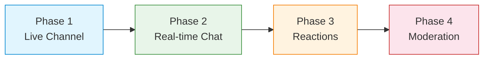

<Info>**SDK v7.x** · Last verified March 2026 · iOS · Android · Web · Flutter</Info>

This trail chains 4 feature guides into one linear path. Follow them in order to build a fully working live chat experience — the kind you see during Twitch streams, sports events, or live Q&As.

<Note>
**After completing this trail you'll have:**
- A live channel that activates when an event starts
- Real-time message sending and querying with automatic rate limiting
- Message reactions so viewers can express themselves without flooding the chat
- Moderation tools to keep high-volume chat safe
</Note>

---

## Phase 1: Create the Live Channel · `~20 min` · `Beginner`

**Goal:** Create a Live-type channel that persists across broadcast sessions and connects to your stream.

**What you'll build:**
- A Live channel tied to your broadcast event
- Channel metadata storing the stream ID and event details
- Channel list so users can find and join the stream chat
- Real-time member count display

<Card
  title="Open the full guide →"
  icon="message"
  href="/use-cases/chat/channels-and-conversations"
>
  Channel creation, types (Community / Live / Conversation), member join/leave, real-time channel list.
</Card>

**When you're done:** You have a live channel ready to receive messages. Now let's connect it to real-time messaging.

---

## Phase 2: Real-time Messaging · `~20 min` · `Beginner`

**Goal:** Let viewers send and receive messages instantly as the stream plays.

**What you'll build:**
- Message sending with optimistic UI (shows instantly before server confirmation)
- Live message subscription — new messages auto-append to the chat list
- Message history query for users who join mid-stream
- Rate limiting awareness so heavy users don't flood the channel

<Card
  title="Open the full guide →"
  icon="paper-plane"
  href="/use-cases/chat/sending-messages"
>
  Text message sending, real-time subscription, query and filter, edit and delete.
</Card>

**When you're done:** Viewers can send and receive messages in real-time. But chat is more than just text — let's add reactions.

---

## Phase 3: Message Reactions · `~15 min` · `Beginner`

**Goal:** Let viewers express themselves with emoji reactions without flooding the chat with "🔥🔥🔥" text messages.

**What you'll build:**
- Emoji reactions on any message
- Real-time reaction count updates (fire, heart, clap — or custom set)
- Quick-reaction overlay on the chat UI
- Remove reaction support

<Card
  title="Open the full guide →"
  icon="reply"
  href="/use-cases/chat/message-reactions-and-replies"
>
  Message reactions, reply threading, real-time counts, custom reaction names.
</Card>

**When you're done:** Viewers can react to messages and to each other. Last step — keep it all safe.

---

## Phase 4: Chat Moderation · `~25 min` · `Advanced`

**Goal:** For high-volume live chat, you need automated and manual tools to keep the experience good for everyone.

**What you'll build:**
- Rate limiting to prevent spam flooding
- Mute individual viewers temporarily
- Ban disruptive users from the channel
- Webhook events to route serious incidents to your moderation team

<Card
  title="Open the full guide →"
  icon="shield-check"
  href="/use-cases/chat/chat-moderation"
>
  Mute/ban members, rate limiting, AI content moderation, webhook automation.
</Card>

**When you're done:** Your live chat handles high volume safely. viewers can engage freely while you have tools to deal with bad actors.

---

## What You've Built

A production-ready live chat experience:

- ✅ Live channel connected to your broadcast
- ✅ Real-time messages with optimistic rendering
- ✅ Emoji reactions that scale without flooding
- ✅ Rate limiting + mute/ban moderation

---

## Common Pitfalls

<Warning>
**No rate limiting on send** — In high-volume live chat, implement client-side throttling (e.g. max 1 message per 2 seconds) before the SDK's server-side rate limit kicks in with an error.
</Warning>

<Warning>
**Rendering every message in a massive list** — Use a virtualized/windowed list for live chat. Rendering thousands of DOM nodes simultaneously will freeze the UI.
</Warning>

<Warning>
**Not disposing the channel after the event** — Archive or close the live channel when the broadcast ends. Leaving it open accumulates stale data and confuses returning viewers.
</Warning>

---

## Next Steps

<CardGroup cols={2}>
  <Card title="Add Rich Media" icon="photo-film" href="/use-cases/chat/rich-media-messages">
    Let moderators or hosts send images and videos into the live chat for interactive segments.
  </Card>
  <Card title="Channel Roles" icon="user-shield" href="/use-cases/chat/channel-roles-and-permissions">
    Assign co-host and moderator roles so community members can help manage the chat.
  </Card>
  <Card title="Group Chat" icon="users" href="/use-cases/chat/build-a-group-chat">
    Build persistent team or community channels that live beyond a single event.
  </Card>
  <Card title="Livestream & Video Posts" icon="tower-broadcast" href="/use-cases/social/livestream-and-video-posts">
    Connect your live chat to the full livestream post flow in the social feed.
  </Card>
</CardGroup>
