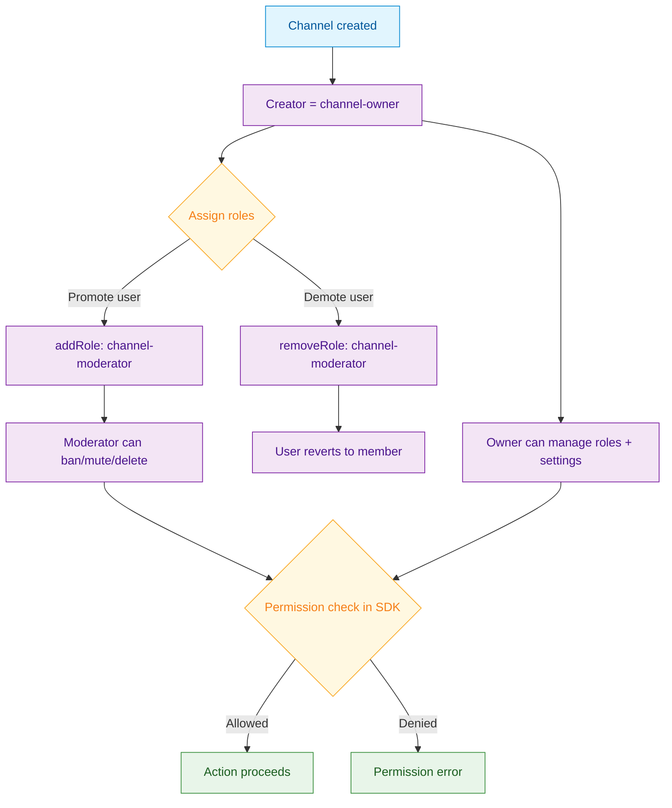

<Info>**SDK v7.x** · Last verified March 2026 · iOS · Android · Web · Flutter</Info>

<Accordion title="Speed run — just the code" icon="forward">
```typescript
import { ChannelRepository } from '@amityco/ts-sdk';

// Add a moderator role
await ChannelRepository.addRole(channelId, 'channel-moderator', [userId]);

// Remove a moderator role
await ChannelRepository.removeRole(channelId, 'channel-moderator', [userId]);

// Query members by role
const mods = ChannelRepository.getMembers({
  channelId,
  roles: ['channel-moderator'],
});
mods.on('dataUpdated', (members) => renderModeratorList(members));
```
Full walkthrough below ↓
</Accordion>

<Tip>
**Platform note** — code samples below use TypeScript. Every method has an equivalent in the iOS (Swift), Android (Kotlin), and Flutter (Dart) SDKs — see the linked SDK reference in each step.
</Tip>

Channel roles let you delegate community management without giving users platform-wide admin access. A **moderator** can mute, ban, and delete messages. A **channel owner** (automatically assigned on creation) can manage roles and channel settings. Regular **members** can read and write, but nothing more.



<Info>
**Prerequisites**: Community channel with at least a few members → [Channels & Conversations](/use-cases/chat/channels-and-conversations)
</Info>

## Quick Start: Promote a Member to Moderator

```typescript
import { ChannelRepository } from '@amityco/ts-sdk';

try {
  // Grant moderator privileges to a user
  await ChannelRepository.addRole(channelId, 'channel-moderator', [userId]);
} catch (error) {
  console.error('Failed to assign role:', error);
}
```

## Step-by-Step Implementation

<Steps>
  <Step title="Understand built-in roles">
    | Role | Permissions |
    |---|---|
    | `channel-owner` | Manage roles, update channel, archive, all moderator permissions |
    | `channel-moderator` | Ban/unban members, mute/unmute, delete any message |
    | *(member — default)* | Send messages, react, view members |

    <Note>The channel creator is automatically assigned `channel-owner`. There can only be one owner. To transfer ownership, remove the owner role from yourself and add it to another user.</Note>

    → [Roles and Permissions Reference](/social-plus-sdk/chat/moderation-safety/member-management/roles-and-permission)
  </Step>
  <Step title="Assign and remove roles">
    ```typescript
    import { ChannelRepository } from '@amityco/ts-sdk';

    // Add moderator
    await ChannelRepository.addRole(channelId, 'channel-moderator', [userId]);

    // Remove moderator
    await ChannelRepository.removeRole(channelId, 'channel-moderator', [userId]);

    // Transfer ownership (remove from self, add to other)
    await ChannelRepository.removeRole(channelId, 'channel-owner', [myUserId]);
    await ChannelRepository.addRole(channelId, 'channel-owner', [newOwnerId]);
    ```
  </Step>
  <Step title="Query members and filter by role">
    ```typescript
    // All members
    const members = ChannelRepository.getMembers({ channelId });
    members.on('dataUpdated', (list) =>
      list.forEach(m => console.log(m.userId, m.roles))
    );

    // Only moderators
    const mods = ChannelRepository.getMembers({
      channelId,
      roles: ['channel-moderator', 'channel-owner'],
    });
    ```

    → [Query Channel Members](/social-plus-sdk/chat/conversation-management/members/query-channel-members)
  </Step>
  <Step title="Gate moderation UI behind role checks">
    Check the current user's roles before showing ban/mute buttons:

    ```typescript
    import { ChannelRepository } from '@amityco/ts-sdk';

    const { data: membership } = await ChannelRepository.getMember(channelId, currentUserId);
    const canModerate = membership.roles.some(
      r => r === 'channel-moderator' || r === 'channel-owner'
    );

    if (canModerate) {
      showModerationControls();
    }
    ```

    <Note>The SDK also enforces permissions server-side — the role check in your UI is purely for UX, not security. Non-moderators receive a permission error if they somehow trigger a moderation action.</Note>
  </Step>
  <Step title="Create custom roles (Admin Console)">
    Beyond the built-in roles, you can define custom roles (e.g., `vip`, `verified-seller`) with specific permission sets in **Admin Console → Roles & Permissions**. Custom roles appear in `member.roles` exactly like built-in ones.

    → [Custom Roles](/analytics-and-moderation/console/management/)
  </Step>
</Steps>

## Connect to Moderation & Analytics

<AccordionGroup>
  <Accordion title="Role events in webhooks" icon="webhook">
    `member.roles_added` and `member.roles_removed` webhook events let you sync role changes with your own database or trigger downstream workflows (e.g., granting a user access to a private board after becoming a moderator).

    → [Webhook Events](/analytics-and-moderation/social+-apis-and-services/webhook-event)
  </Accordion>
  <Accordion title="Audit log for role changes" icon="clipboard-list">
    All role assignments are logged in **Admin Console → Audit Log**. Use this to review who granted moderator access and when.
  </Accordion>
</AccordionGroup>

## Common Mistakes

<Warning>
**Forgetting to remove the owner role before transferring** — Calling `addRole` for `channel-owner` on a new user without removing it from the current owner results in two owners, which may cause unexpected permission behavior. Always remove before adding for ownership transfer.
</Warning>

<Warning>
**Checking roles only on the client** — Roles are enforced server-side. Client-side checks are only for UI gating. A user who has been demoted but still has a cached role object in memory will receive a server error on their next moderation action.
</Warning>

## Best Practices

<AccordionGroup>
  <Accordion title="Assign moderators before channels go public" icon="clock">
    Promote at least one moderator immediately after creating a channel, especially for public Community channels. Unmoderated channels fill up with spam within hours of gaining traction.
  </Accordion>
  <Accordion title="Use custom roles for tiered benefits" icon="star">
    Create roles like `vip` or `premium` to give paying users or power members special UI treatment (highlighted names, extended media limits) without granting full moderation powers.
  </Accordion>
  <Accordion title="Audit role changes regularly" icon="magnifying-glass">
    Review moderator lists quarterly. Former moderators who no longer actively participate should be demoted — stale moderator accounts are a common attack vector.
  </Accordion>
</AccordionGroup>

<Tip>
**Dive deeper**: [Moderation & Safety API Reference](/social-plus-sdk/chat/moderation-safety/overview) has full parameter tables, method signatures, and platform-specific details for every API used in this guide.
</Tip>

## Next Steps

<CardGroup cols={3}>
  <Card title="Chat Moderation" href="/use-cases/chat/chat-moderation" icon="shield">
    Use your new moderators to ban, mute, and remove content.
  </Card>
  <Card title="Group Chat Path" href="/use-cases/choose-your-path#group-chat" icon="users">
    Full group chat build path where roles and permissions matter most.
  </Card>
  <Card title="Channels & Conversations" href="/use-cases/chat/channels-and-conversations" icon="comments">
    Back to channel management fundamentals.
  </Card>
</CardGroup>
