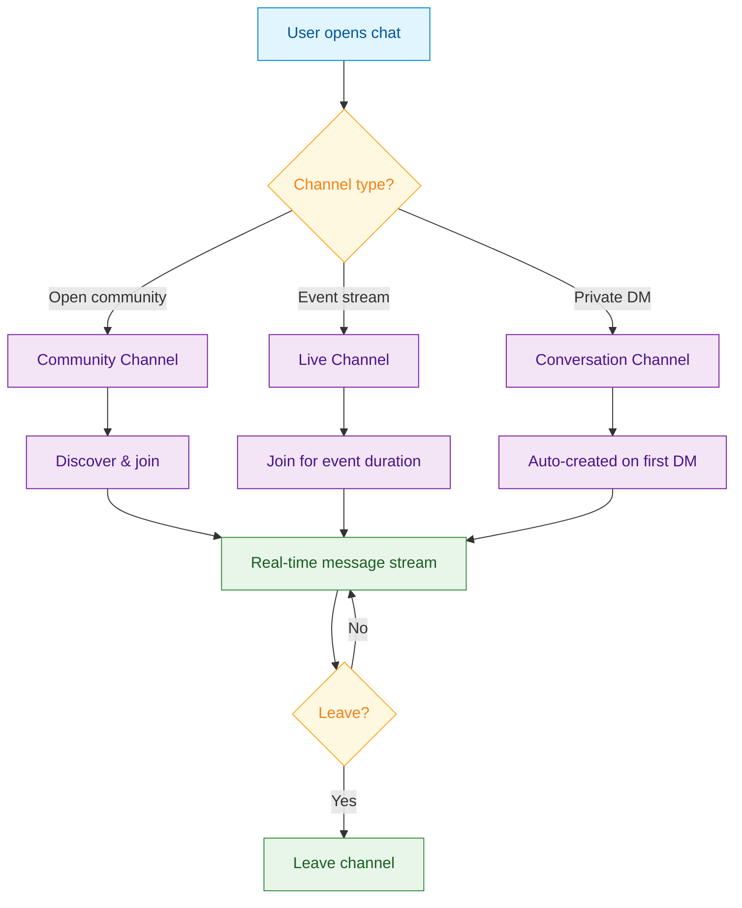
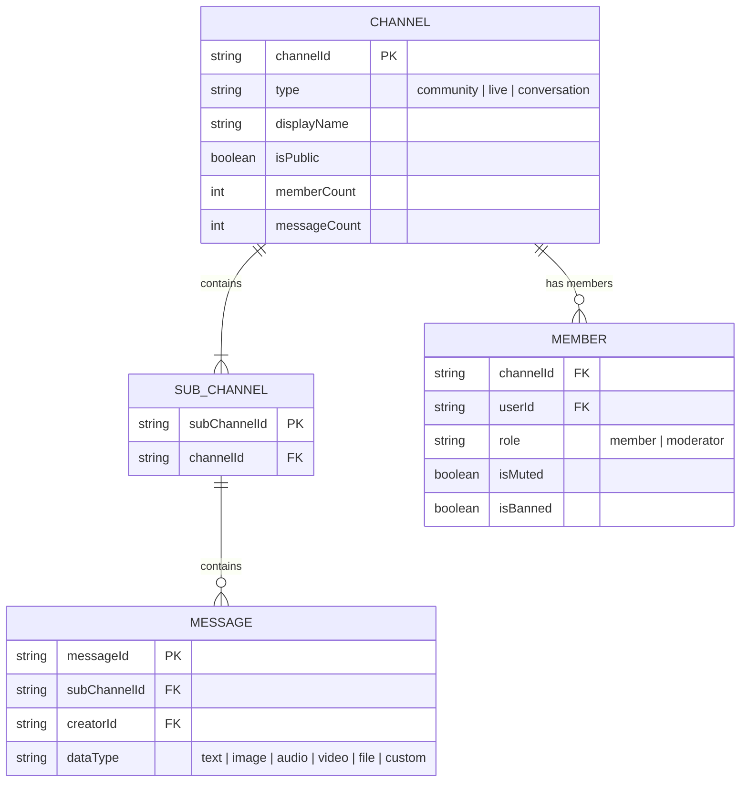

<Info>**SDK v7.x** · Last verified March 2026 · iOS · Android · Web · Flutter</Info>

<Accordion title="Speed run — just the code" icon="forward">
```typescript
// Create a Community channel
const channel = await ChannelRepository.createChannel({
  type: 'community',
  displayName: 'General',
  isPublic: true,
  tags: ['team', 'general'],
});

// Query channels the current user is in
const liveCollection = ChannelRepository.getChannels({
  sortBy: 'lastActivity',
  includeDeleted: false,
});
liveCollection.on('dataUpdated', (channels) => renderChannelList(channels));

// Join a channel
await ChannelRepository.joinChannel(channelId);
```
Full walkthrough below ↓
</Accordion>

<Tip>
**Platform note** — code samples below use TypeScript. Every method has an equivalent in the iOS (Swift), Android (Kotlin), and Flutter (Dart) SDKs — see the linked SDK reference in each step.
</Tip>

Channels are the container for every chat conversation in social.plus. There are three types — **Community** (public/discoverable), **Live** (broadcast events), and **Conversation** (private 1:1 or small group). This guide covers creating and managing all three.



## What You'll Build



- Community, Live, and Conversation channel creation
- Channel list with real-time updates via Live Collections
- Join/leave with member list query
- Channel update and archive

**Prerequisites**: SDK installed with authenticated users → [SDK Setup](/social-plus-sdk/getting-started/overview)

## Quick Start: Create and Join a Channel

```typescript
import { ChannelRepository } from '@amityco/ts-sdk';

try {
  // Create a public Community channel
  const { data: channel } = await ChannelRepository.createChannel({
    type: 'community',
    displayName: 'General',
    isPublic: true,
  });

  // Join it
  await ChannelRepository.joinChannel(channel.channelId);
} catch (error) {
  console.error('Channel operation failed:', error);
}
```

## Step-by-Step Implementation

<Steps>
  <Step title="Choose the right channel type">
    | Type | Use case | Visibility |
    |---|---|---|
    | `community` | Team rooms, Discord-style, community chat | Public or Private |
    | `live` | Livestream chat, event commentary | Public |
    | `conversation` | 1:1 DMs, customer support | Private |

    → [Channel Types](/social-plus-sdk/chat/conversation-management/channels/overview)
  </Step>
  <Step title="Create the channel">
    ```typescript
    import { ChannelRepository } from '@amityco/ts-sdk';

    // Community channel
    const { data: channel } = await ChannelRepository.createChannel({
      type: 'community',
      displayName: 'Product Feedback',
      isPublic: true,
      tags: ['feedback', 'product'],
      metadata: { category: 'support' },
    });

    // Conversation (1:1 DM) — use the other user's ID as channel ID
    const { data: dm } = await ChannelRepository.createChannel({
      type: 'conversation',
      userIds: ['user-123', 'user-456'],
    });
    ```

    → [Create Channel](/social-plus-sdk/chat/conversation-management/channels/create-channel)
  </Step>
  <Step title="Query the channel list with Live Collections">
    ```typescript
    import { ChannelRepository } from '@amityco/ts-sdk';

    const liveCollection = ChannelRepository.getChannels({
      filter: 'member',       // channels the current user is in
      sortBy: 'lastActivity', // most recently active first
    });

    // Re-renders whenever a new message arrives or channel is added
    liveCollection.on('dataUpdated', (channels) => {
      channels.forEach(channel => {
        console.log(channel.displayName, channel.lastActivity);
      });
    });
    ```

    → [Query Channels](/social-plus-sdk/chat/conversation-management/channels/query-channels)
  </Step>
  <Step title="Join and leave channels">
    ```typescript
    // Join
    await ChannelRepository.joinChannel(channelId);

    // Leave
    await ChannelRepository.leaveChannel(channelId);

    // Query members
    const members = ChannelRepository.getMembers({ channelId, limit: 20 });
    ```

    → [Join/Leave Channel](/social-plus-sdk/chat/conversation-management/members/join-leave-channel)
  </Step>
  <Step title="Update and archive channels">
    ```typescript
    // Update display name and metadata
    await ChannelRepository.updateChannel(channelId, {
      displayName: 'New Name',
      metadata: { archived_reason: null },
    });

    // Archive (hides from list but keeps message history)
    await ChannelRepository.archiveChannel(channelId);
    ```

    → [Update Channel](/social-plus-sdk/chat/conversation-management/channels/update-channel) · [Archive Channels](/social-plus-sdk/chat/conversation-management/channels/archive-channels)
  </Step>
</Steps>

## Connect to Moderation & Analytics

<AccordionGroup>
  <Accordion title="Channel moderation from Admin Console" icon="shield">
    Community channels and their members can be reviewed and managed from **Admin Console → Channels**. Moderators can view message history, ban members, and close channels.

    → [Channel Moderation](/social-plus-sdk/chat/moderation-safety/content-moderation/channel-moderation)
  </Accordion>
  <Accordion title="Webhook: channel events" icon="webhook">
    Subscribe to `channel.created`, `channel.updated`, and `channel.deleted` webhook events to sync channel data with your own backend or trigger automations.

    → [Webhook Events](/analytics-and-moderation/social+-apis-and-services/webhook-event)
  </Accordion>
</AccordionGroup>

## Common Mistakes

<Warning>
**Creating duplicate Conversation channels** — For 1:1 DMs, always check if a conversation already exists between two users before creating a new one. Pass both userIds and the SDK will return the existing channel if one exists.
</Warning>

<Warning>
**Not handling the Live Collection's dispose** — Always call `liveCollection.dispose()` when your UI component unmounts to avoid memory leaks and stale update callbacks.
</Warning>

## Best Practices

<AccordionGroup>
  <Accordion title="Use Live Collections for the channel list" icon="bolt">
    Don't poll for channel updates. Live Collections push updates automatically — new messages, new channels, and member changes all arrive without any extra requests.
  </Accordion>
  <Accordion title="Store custom data in metadata" icon="database">
    Use the `metadata` field to attach any application-specific data to a channel (event ID, category, feature flags). Keep it under 500KB.
  </Accordion>
  <Accordion title="Archive instead of delete" icon="archive">
    Archiving preserves message history — users who rejoin can read old messages. Hard deletion is permanent. Default to archive unless regulatory requirements mandate deletion.
  </Accordion>
</AccordionGroup>

## Next Steps

<CardGroup cols={3}>
  <Card title="Sending Messages" href="/use-cases/chat/sending-messages" icon="paper-plane">
    Start sending and receiving messages in the channels you just created.
  </Card>
  <Card title="Channel Roles & Permissions" href="/use-cases/chat/channel-roles-and-permissions" icon="user-shield">
    Set up moderator roles before your community grows.
  </Card>
  <Card title="Unread Counts" href="/use-cases/chat/unread-counts-and-read-receipts" icon="envelope-open">
    Add unread badges to your channel list.
  </Card>
</CardGroup>
