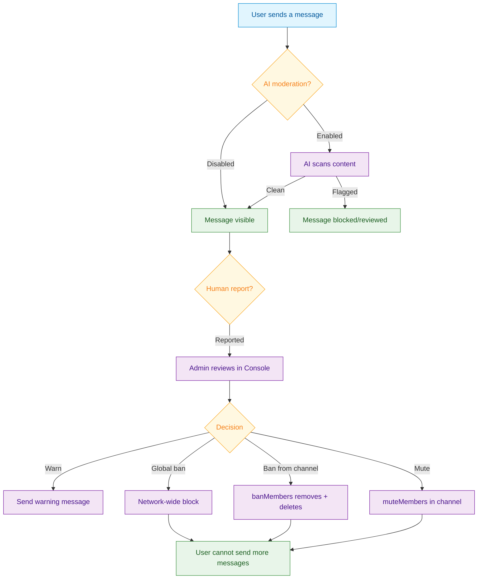

<Info>**SDK v7.x** · Last verified March 2026 · iOS · Android · Web · Flutter</Info>

<Accordion title="Speed run — just the code" icon="forward">
```typescript
import { ChannelRepository } from '@amityco/ts-sdk';

// Mute a user in a channel (temporarily silence them)
await ChannelRepository.muteMembers(channelId, [userId], 60); // 60 seconds

// Ban a user from a channel (removes them + deletes their messages)
await ChannelRepository.banMembers(channelId, [userId]);

// Unban
await ChannelRepository.unbanMembers(channelId, [userId]);

// Delete a specific message
import { MessageRepository } from '@amityco/ts-sdk';
await MessageRepository.deleteMessage(messageId);
```
Full walkthrough below ↓
</Accordion>

<Tip>
**Platform note** — code samples below use TypeScript. Every method has an equivalent in the iOS (Swift), Android (Kotlin), and Flutter (Dart) SDKs — see the linked SDK reference in each step.
</Tip>

Effective moderation is what separates thriving communities from abandoned ones. This guide covers the full moderation toolkit: temporary mutes for friction, channel bans for violations, network-wide global bans for bad actors, AI moderation for scale, and webhooks for custom workflows.



<Info>
**Prerequisites**: Channel with member roles configured → [Channel Roles & Permissions](/use-cases/chat/channel-roles-and-permissions)
</Info>

## Quick Start: Ban a User

```typescript
import { ChannelRepository } from '@amityco/ts-sdk';

try {
  // Ban removes the user from the channel and deletes their messages
  await ChannelRepository.banMembers(channelId, [userId]);
} catch (error) {
  console.error('Failed to ban member:', error);
}
```

## Step-by-Step Implementation

<Steps>
  <Step title="Mute a user temporarily">
    Muting silences a user for a fixed duration without removing them from the channel. Use this for first offenses or to de-escalate a heated argument.

    ```typescript
    import { ChannelRepository } from '@amityco/ts-sdk';

    // Mute for 5 minutes (300 seconds)
    await ChannelRepository.muteMembers(channelId, [userId], 300);

    // Mute indefinitely
    await ChannelRepository.muteMembers(channelId, [userId]);

    // Unmute
    await ChannelRepository.unmuteMembers(channelId, [userId]);
    ```

    → [Mute / Unmute](/social-plus-sdk/chat/moderation-safety/member-management/mute-unmute-a-list-of-channel-members)
  </Step>
  <Step title="Ban and unban users from a channel">
    Banning removes the user from the channel and deletes their messages in one operation. Unbanning restores access but does not restore deleted messages.

    ```typescript
    // Ban
    await ChannelRepository.banMembers(channelId, [userId]);

    // Unban
    await ChannelRepository.unbanMembers(channelId, [userId]);

    // Query banned users
    const banned = ChannelRepository.getMembers({
      channelId,
      filter: 'bannedMember',
    });
    banned.on('dataUpdated', (list) => renderBannedList(list));
    ```

    <Warning>Banning is **destructive** — the user's messages are permanently deleted. If you need to preserve message history (e.g., for evidence in a dispute), record the messages before banning.</Warning>

    → [Ban / Unban](/social-plus-sdk/chat/moderation-safety/member-management/ban-unban-a-list-of-channel-members)
  </Step>
  <Step title="Delete individual messages">
    When a specific message (not the user) needs to be removed:

    ```typescript
    import { MessageRepository } from '@amityco/ts-sdk';

    // Any channel moderator or admin can delete any message
    await MessageRepository.deleteMessage(messageId);
    ```

    Deleted messages are soft-deleted — a placeholder "Message was deleted" remains visible in the thread so the conversation history stays coherent.
  </Step>
  <Step title="Apply a global ban across your network">
    For users who violate your terms of service across multiple channels, use the Global Ban API to block them at the network level. This is typically done from the Admin Console or via the server-side API.

    **From Admin Console**: **User Management → Find User → Ban**

    **Via API (server-side)**:
    ```bash
    curl -X POST 'https://apix.<region>.amity.co/api/v3/users/<userId>/ban' \
      -H 'x-admin-token: <your-admin-token>'
    ```

    → [Global Ban API](/analytics-and-moderation/social+-apis-and-services/README)
  </Step>
  <Step title="Enable AI content moderation">
    social.plus AI Moderation automatically analyzes messages before they're published and can block, flag, or allow content based on configurable policies.

    1. Go to **Admin Console → AI Content Moderation**
    2. Enable text and/or image moderation
    3. Configure severity thresholds (block vs. review vs. allow)
    4. Review flagged items in **Moderation → Flagged Items**

    → [AI Content Moderation](/analytics-and-moderation/console/ai-content-moderation)
  </Step>
  <Step title="Receive moderation events via webhooks">
    Use webhook events to trigger custom workflows when moderation actions occur:

    | Event | Trigger |
    |---|---|
    | `user.banned` | User banned (channel or global) |
    | `user.unbanned` | Ban lifted |
    | `message.flagged` | User reported a message |
    | `message.deleted` | Message deleted by moderator |

    ```javascript
    // Webhook handler example
    app.post('/webhook', (req, res) => {
      const { event, data } = req.body;

      if (event === 'user.banned') {
        notifyUserOfBan(data.userId, data.reason);
        logModerationAction(data);
      }

      res.status(200).json({ status: 'received' });
    });
    ```

    → [Webhook Events](/analytics-and-moderation/social+-apis-and-services/webhook-event)
  </Step>
</Steps>

## Connect to Moderation & Analytics

<AccordionGroup>
  <Accordion title="Moderation dashboard" icon="shield">
    **Admin Console → Moderation** gives your trust & safety team a centralized view of flagged content, user reports, and pending review items across all channels.

    → [Moderation Overview](/analytics-and-moderation/console/moderation/)
  </Accordion>
  <Accordion title="Rate limiting to prevent spam floods" icon="gauge">
    Configure per-user message rate limits in **Admin Console → Network Settings** to automatically throttle users who send messages too quickly — without requiring manual moderator action.

    → [Network Settings](/analytics-and-moderation/social+-apis-and-services/network-settings)
  </Accordion>
  <Accordion title="Pre-hook events for custom policy" icon="webhook">
    Pre-hook webhooks let your server inspect and optionally block messages *before* they are accepted by social.plus. Use this for custom profanity filters, link blocking, or compliance workflows.

    → [Pre-Hook Events](/analytics-and-moderation/social+-apis-and-services/pre-hook-event)
  </Accordion>
</AccordionGroup>

## Common Mistakes

<Warning>
**Using ban instead of mute for minor rule breaks** — Banning is irreversible in the sense that it deletes messages. Reserve bans for serious violations. Use mutes for temporary timeouts — they're adjustable and reversible without data loss.
</Warning>

<Warning>
**Not informing users why they were moderated** — Unexplained bans drive users away permanently. Always send a `custom` system message to the channel or a direct notification explaining the reason. This also reduces false positive appeals.
</Warning>

## Best Practices

<AccordionGroup>
  <Accordion title="Build a moderation escalation ladder" icon="stairs">
    Define a progression: (1) verbose content warning → (2) temporary mute → (3) channel ban → (4) global ban. Using the most severe option first for minor violations destroys community trust and drives false appeal volume.
  </Accordion>
  <Accordion title="Empower community moderators early" icon="people-group">
    Grant `channel-moderator` roles to trusted community members before the channel grows. Reactive moderator assignment (after problems start) means violations compound faster than you can respond. See [Channel Roles & Permissions](/use-cases/chat/channel-roles-and-permissions).
  </Accordion>
  <Accordion title="Use AI moderation as a first line, not a complete solution" icon="robot">
    AI moderation catches spam and NSFW content reliably, but misses context-specific violations. Pair it with a human review queue for flagged items and empower community members to report edge cases.
  </Accordion>
</AccordionGroup>

<Tip>
**Dive deeper**: [Moderation & Safety API Reference](/social-plus-sdk/chat/moderation-safety/overview) has full parameter tables, method signatures, and platform-specific details for every API used in this guide.
</Tip>

## Next Steps

<CardGroup cols={3}>
  <Card title="Channel Roles & Permissions" href="/use-cases/chat/channel-roles-and-permissions" icon="user-shield">
    Who to promote before channels need moderation.
  </Card>
  <Card title="Group Chat Path" href="/use-cases/choose-your-path#group-chat" icon="users">
    Complete group chat build path from creation to moderation.
  </Card>
  <Card title="Admin Console Moderation" href="/analytics-and-moderation/console/moderation/" icon="shield-halved">
    Review flagged items from a trust & safety dashboard.
  </Card>
</CardGroup>
