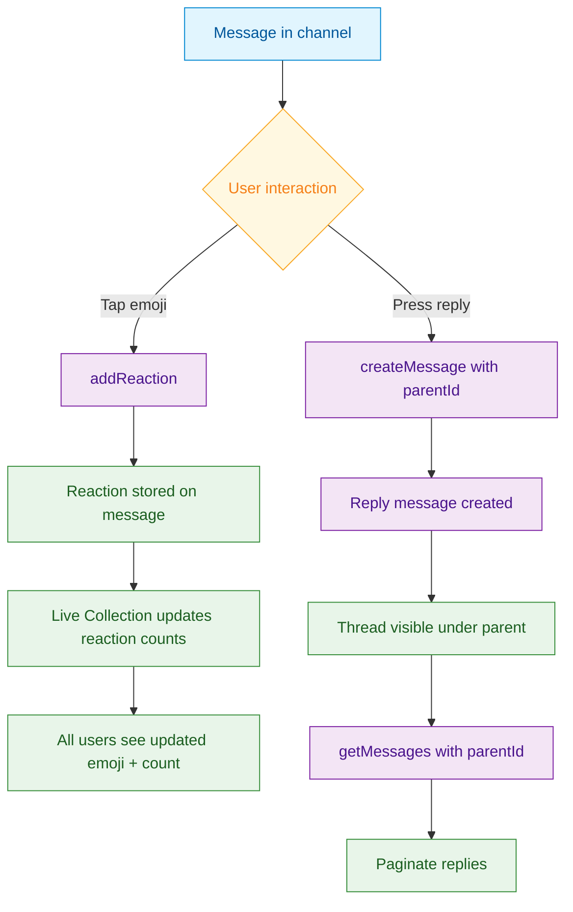

<Info>**SDK v7.x** · Last verified March 2026 · iOS · Android · Web · Flutter</Info>

<Accordion title="Speed run — just the code" icon="forward">
```typescript
// React to a message
await ReactionRepository.addReaction({
  referenceType: 'message',
  referenceId: messageId,
  reactionName: '👍',
});

// Reply to a message (parentId creates a thread)
await MessageRepository.createMessage({
  subChannelId: channelId,
  parentId: parentMessageId,    // ← this is what makes it a reply
  data: { text: 'Great point!' },
  dataType: 'text',
});

// Query replies for a message
const replies = MessageRepository.getMessages({
  subChannelId: channelId,
  parentId: parentMessageId,
});
```
Full walkthrough below ↓
</Accordion>

<Tip>
**Platform note** — code samples below use TypeScript. Every method has an equivalent in the iOS (Swift), Android (Kotlin), and Flutter (Dart) SDKs — see the linked SDK reference in each step.
</Tip>

Reactions turn passive reading into participation. Threaded replies keep side conversations organized without cluttering the main feed. Together they're the core engagement layer of any chat experience.



<Info>
**Prerequisites**: Messages are being sent and received → [Sending Messages](/use-cases/chat/sending-messages)
</Info>

## Quick Start: React to a Message

```typescript
import { ReactionRepository } from '@amityco/ts-sdk';

try {
  await ReactionRepository.addReaction({
    referenceType: 'message',
    referenceId: messageId,
    reactionName: '❤️',
  });
} catch (error) {
  console.error('Failed to add reaction:', error);
}
```

## Step-by-Step Implementation

<Steps>
  <Step title="Add and remove reactions">
    ```typescript
    import { ReactionRepository } from '@amityco/ts-sdk';

    // Add
    await ReactionRepository.addReaction({
      referenceType: 'message',
      referenceId: messageId,
      reactionName: '👍',
    });

    // Remove
    await ReactionRepository.removeReaction({
      referenceType: 'message',
      referenceId: messageId,
      reactionName: '👍',
    });
    ```

    → [Message Reactions](/social-plus-sdk/chat/engagement-features/message-reactions)
  </Step>
  <Step title="Display reaction counts">
    Reaction data is available directly on the message object. The Live Collection automatically pushes updates when another user reacts.

    ```typescript
    // Message object from Live Collection
    liveCollection.on('dataUpdated', (messages) => {
      messages.forEach(msg => {
        // reactions is a map of reactionName → count
        const hearts = msg.reactions?.['❤️'] ?? 0;
        const thumbsUp = msg.reactions?.['👍'] ?? 0;
        console.log(`❤️ ${hearts}, 👍 ${thumbsUp}`);
      });
    });
    ```

    For a detailed breakdown (who reacted), query the reaction list:

    ```typescript
    const reactors = ReactionRepository.getReactions({
      referenceType: 'message',
      referenceId: messageId,
      reactionName: '❤️',        // Optional: filter to one reaction
    });

    reactors.on('dataUpdated', (items) => {
      const userIds = items.map(r => r.userId);
    });
    ```
  </Step>
  <Step title="Reply to a message (threading)">
    Replies use the same `createMessage` call with an additional `parentId`. This links the reply to its parent without a separate thread API.

    ```typescript
    import { MessageRepository } from '@amityco/ts-sdk';

    await MessageRepository.createMessage({
      subChannelId: channelId,
      parentId: parentMessageId,   // ← Creates a reply thread
      data: { text: 'I agree with this!' },
      dataType: 'text',
    });
    ```

    → [Reply to a Message](/social-plus-sdk/chat/messaging-features/message-creation/reply-to-a-message)
  </Step>
  <Step title="Query replies for a parent message">
    Pass `parentId` to `getMessages` to retrieve only the replies in a thread.

    ```typescript
    const thread = MessageRepository.getMessages({
      subChannelId: channelId,
      parentId: parentMessageId,   // Only replies to this message
      limit: 10,
    });

    thread.on('dataUpdated', (replies) => {
      console.log(`${replies.length} replies in thread`);
    });
    ```

    The parent message itself contains a `replyCount` property that you can use to display a "View N replies" button without loading the full thread.
  </Step>
</Steps>

## Connect to Moderation & Analytics

<AccordionGroup>
  <Accordion title="Flag inappropriate reactions" icon="flag">
    Users can report messages that have received reactions containing offensive content. Reports appear in **Admin Console → Content Moderation → Flagged Items**.
  </Accordion>
  <Accordion title="Webhook: reaction events" icon="webhook">
    `reaction.added` and `reaction.removed` webhook events let you track engagement patterns or sync reaction data to your analytics pipeline.

    → [Webhook Events](/analytics-and-moderation/social+-apis-and-services/webhook-event)
  </Accordion>
</AccordionGroup>

## Common Mistakes

<Warning>
**Duplicating reactions** — A user can add the same `reactionName` only once per message. Calling `addReaction` a second time with the same name is a no-op (not an error). Track local state to style the "active" reaction button correctly.
</Warning>

<Warning>
**Querying root messages with parentId set** — When querying the main channel feed, always set `parentId: null` (or omit it). Otherwise you'll get only replies and miss all top-level messages.
</Warning>

## Best Practices

<AccordionGroup>
  <Accordion title="Limit your reaction emoji set" icon="smile">
    Curate a small emoji picker (6–8 options) rather than exposing the full Unicode emoji keyboard. This speeds up rendering and keeps reaction data cleaner. Store allowed reactions in your app's config or in the channel's `metadata`.
  </Accordion>
  <Accordion title="Show reply count before expanding" icon="comments">
    Use the `replyCount` field on the parent message to render a "View 3 replies" button. Only query the thread on demand — lazy loading keeps the initial message feed fast.
  </Accordion>
  <Accordion title="Nest replies only one level deep" icon="indent">
    social.plus supports single-level threading (replies to a message). Deeply nested threads hurt UX on mobile. Flatten all replies to one level even if your users try to reply-to-a-reply.
  </Accordion>
</AccordionGroup>

<Tip>
**Dive deeper**: [Messaging API Reference](/social-plus-sdk/chat/messaging-features/overview) has full parameter tables, method signatures, and platform-specific details for every API used in this guide.
</Tip>

## Next Steps

<CardGroup cols={3}>
  <Card title="Unread Counts" href="/use-cases/chat/unread-counts-and-read-receipts" icon="envelope-open">
    Surface unread message and mention badges across channels.
  </Card>
  <Card title="Rich Media Messages" href="/use-cases/chat/rich-media-messages" icon="image">
    Let users share images, files, and audio in addition to reactions.
  </Card>
  <Card title="Chat Moderation" href="/use-cases/chat/chat-moderation" icon="shield">
    Moderate inappropriate reactions and replies from the admin console.
  </Card>
</CardGroup>
