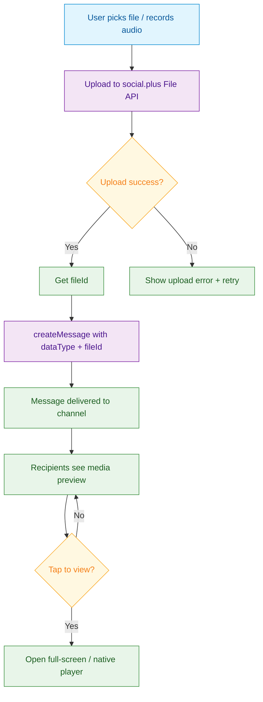

<Info>**SDK v7.x** · Last verified March 2026 · iOS · Android · Web · Flutter</Info>

<Accordion title="Speed run — just the code" icon="forward">
```typescript
import { MessageRepository } from '@amityco/ts-sdk';

// Send an image
await MessageRepository.createMessage({
  subChannelId: channelId,
  dataType: 'image',
  data: { fileId: uploadedFileId },  // Upload file first, then attach
  caption: 'Check this out!',
});

// Send a file
await MessageRepository.createMessage({
  subChannelId: channelId,
  dataType: 'file',
  data: { fileId: uploadedFileId },
});

// Send a custom message (link previews, polls, etc.)
await MessageRepository.createMessage({
  subChannelId: channelId,
  dataType: 'custom',
  data: { type: 'link_preview', url: 'https://example.com', title: 'Example' },
});
```
Full walkthrough below ↓
</Accordion>

<Tip>
**Platform note** — code samples below use TypeScript. Every method has an equivalent in the iOS (Swift), Android (Kotlin), and Flutter (Dart) SDKs — see the linked SDK reference in each step.
</Tip>

Rich media messages—images, voice clips, videos, and file attachments—dramatically increase engagement and are expected in any modern chat UI. social.plus handles uploading, storage, and delivery so you only need to manage the user's file picker and the message creation call.



<Info>
**Prerequisites**: Basic message sending is working → [Sending Messages](/use-cases/chat/sending-messages)
</Info>

## Limits at a Glance

| Property | Limit |
|---|---|
| Max image file size | 1 GB |
| Max video file size | 1 GB |
| Max file attachment | 1 GB |
| Supported image formats | jpg, png, gif, webp |
| Supported video formats | mp4, mov, 3gp, avi, webm |
| Custom data field | 100 KB JSON |

## Quick Start: Send an Image

```typescript
import { FileRepository, MessageRepository } from '@amityco/ts-sdk';

try {
  // 1. Upload
  const { data: file } = await FileRepository.uploadImage(imageBlob);

  // 2. Attach to message
  await MessageRepository.createMessage({
    subChannelId: channelId,
    dataType: 'image',
    data: { fileId: file.fileId },
    caption: 'Screenshot of the bug',
  });
} catch (error) {
  console.error('Failed to send image:', error);
}
```

## Step-by-Step Implementation

<Steps>
  <Step title="Upload the file first">
    All media in social.plus follows an upload-then-send pattern. Upload the raw file to get a `fileId`, then reference that ID in the message.

    ```typescript
    import { FileRepository } from '@amityco/ts-sdk';

    const { data: uploadedFile } = await FileRepository.uploadImage(imageBlob);
    const fileId = uploadedFile.fileId;
    ```

    → [File Upload](/social-plus-sdk/core-concepts/content-handling/files-images-and-videos/file)
  </Step>
  <Step title="Send image and video messages">
    ```typescript
    // Image
    await MessageRepository.createMessage({
      subChannelId: channelId,
      dataType: 'image',
      data: { fileId: imageFileId },
      caption: 'Optional caption text',  // Rendered below the image
    });

    // Video
    await MessageRepository.createMessage({
      subChannelId: channelId,
      dataType: 'video',
      data: { fileId: videoFileId },
    });
    ```
  </Step>
  <Step title="Send audio and file messages">
    ```typescript
    // Audio (e.g. voice note)
    const { data: audio } = await FileRepository.uploadFile(audioBlob);
    await MessageRepository.createMessage({
      subChannelId: channelId,
      dataType: 'audio',
      data: { fileId: audio.fileId },
    });

    // Generic file (PDF, doc, zip, etc.)
    const { data: doc } = await FileRepository.uploadFile(pdfBlob);
    await MessageRepository.createMessage({
      subChannelId: channelId,
      dataType: 'file',
      data: { fileId: doc.fileId },
    });
    ```
  </Step>
  <Step title="Send custom messages">
    The `custom` dataType lets you send any JSON payload. Use it for link previews, poll cards, system events, or any structured message type your app needs.

    ```typescript
    // Link preview
    await MessageRepository.createMessage({
      subChannelId: channelId,
      dataType: 'custom',
      data: {
        type: 'link_preview',
        url: 'https://amity.co',
        title: 'Amity — Build Social Features',
        description: 'The platform for adding social features to your app.',
        thumbnailFileId: thumbnailId,
      },
    });

    // Poll
    await MessageRepository.createMessage({
      subChannelId: channelId,
      dataType: 'custom',
      data: {
        type: 'poll',
        question: 'What feature do you want next?',
        options: ['Dark mode', 'Voice chat', 'Threads'],
      },
    });
    ```

    <Note>Your client app must know how to render each custom `type`. The social.plus SDK delivers the raw JSON — the UI rendering is your responsibility.</Note>

    → [Custom Messages](/social-plus-sdk/chat/messaging-features/message-creation/custom-message)
  </Step>
  <Step title="Render media thumbnails in the message list">
    When querying messages, each media message includes pre-generated thumbnail URLs:

    ```typescript
    liveCollection.on('dataUpdated', (messages) => {
      messages.forEach(msg => {
        switch (msg.dataType) {
          case 'image':
            renderImage(msg.data.fileUrl, msg.caption);
            break;
          case 'audio':
            renderAudioPlayer(msg.data.fileUrl, msg.data.duration);
            break;
          case 'file':
            renderFileAttachment(msg.data.fileName, msg.data.fileSize, msg.data.fileUrl);
            break;
          case 'custom':
            renderCustomMessage(msg.data);
            break;
        }
      });
    });
    ```
  </Step>
</Steps>

## Connect to Moderation & Analytics

<AccordionGroup>
  <Accordion title="AI moderation on image content" icon="robot">
    Enable AI image moderation in **Admin Console → AI Content Moderation** to automatically flag or block NSFW images in chat before other users see them.

    → [AI Content Moderation](/analytics-and-moderation/console/ai-content-moderation)
  </Accordion>
  <Accordion title="File size and type policy" icon="shield">
    Configure allowed file types and maximum file sizes in **Admin Console → Network Settings**. The SDK enforces these limits client-side before uploading.

    → [Network Settings](/analytics-and-moderation/social+-apis-and-services/network-settings)
  </Accordion>
</AccordionGroup>

## Common Mistakes

<Warning>
**Sending `fileId` before the upload completes** — Always `await` the upload call and check for errors before calling `createMessage`. A partially-uploaded file will produce a broken message that can't be recovered.
</Warning>

<Warning>
**Storing file URLs directly** — File URLs from the social.plus CDN are signed and expire. Always store the `fileId` in your database, not the URL. Regenerate download URLs on demand.
</Warning>

## Best Practices

<AccordionGroup>
  <Accordion title="Show upload progress" icon="arrow-up">
    For videos and large files, display a progress bar during upload. This prevents the user from thinking the send button is broken on slow connections. The file upload callback provides a `progress` percentage (0–100).
  </Accordion>
  <Accordion title="Compress images before upload" icon="image">
    Compress images to ≤ 2MB before uploading. High-res photos degrade channel load times for all members and increase storage costs. Apply client-side compression in the file picker.
  </Accordion>
  <Accordion title="Use custom type for rich cards" icon="rectangle-list">
    For complex UI elements (polls, product cards, event invites), use the `custom` dataType with a versioned `type` field. This lets you iterate on card designs server-side without forcing app updates.
  </Accordion>
</AccordionGroup>

<Tip>
**Dive deeper**: [Messaging API Reference](/social-plus-sdk/chat/messaging-features/overview) has full parameter tables, method signatures, and platform-specific details for every API used in this guide.
</Tip>

## Next Steps

<CardGroup cols={3}>
  <Card title="Message Reactions & Replies" href="/use-cases/chat/message-reactions-and-replies" icon="heart">
    Let users react to and thread on your rich media messages.
  </Card>
  <Card title="Chat Moderation" href="/use-cases/chat/chat-moderation" icon="shield">
    Moderate images and files before they reach other members.
  </Card>
  <Card title="Direct Messages Path" href="/use-cases/choose-your-path#direct-messages" icon="comments">
    Full DM build path showing where rich media fits in the flow.
  </Card>
</CardGroup>
