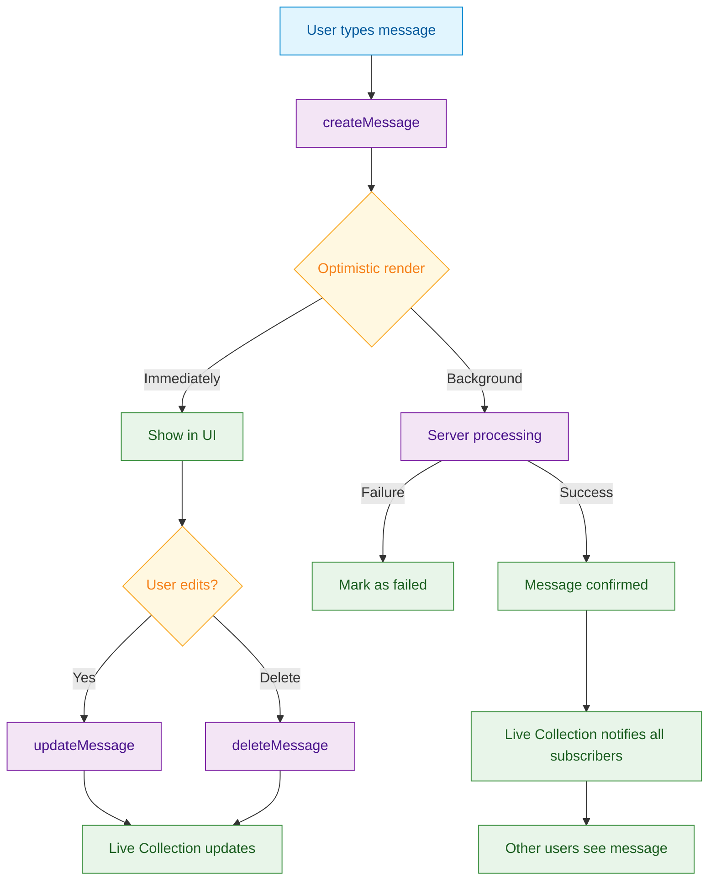

<Info>**SDK v7.x** · Last verified March 2026 · iOS · Android · Web · Flutter</Info>

<Accordion title="Speed run — just the code" icon="forward">
```typescript
// Send a text message
await MessageRepository.createMessage({
  subChannelId: channelId,
  data: { text: 'Hello world!' },
  dataType: 'text',
});

// Query 20 most recent messages
const liveCollection = MessageRepository.getMessages({
  subChannelId: channelId,
  limit: 20,
});
liveCollection.on('dataUpdated', (messages) => renderMessages(messages));

// Edit a message
await MessageRepository.updateMessage(messageId, {
  data: { text: 'Hello, corrected world!' },
});

// Delete
await MessageRepository.deleteMessage(messageId);
```
Full walkthrough below ↓
</Accordion>

<Tip>
**Platform note** — code samples below use TypeScript. Every method has an equivalent in the iOS (Swift), Android (Kotlin), and Flutter (Dart) SDKs — see the linked SDK reference in each step.
</Tip>

Messages are the core of every chat experience. This guide covers the full send-read-edit-delete lifecycle, plus real-time subscriptions so your UI stays in sync without polling.



<Info>
**Prerequisites**: Channel created and user is a member → [Channels & Conversations](/use-cases/chat/channels-and-conversations)
</Info>

## Limits at a Glance

| Property | Limit |
|---|---|
| Max text length | 20,000 characters |
| Max tags per message | 5 |
| Max metadata size | 100 KB JSON |
| Max mentions per message | 30 |
| Soft-delete behavior | Placeholder remains visible |

## Quick Start: Send and Receive Messages

```typescript
import { MessageRepository } from '@amityco/ts-sdk';

try {
  // Send
  await MessageRepository.createMessage({
    subChannelId: channelId,
    data: { text: 'Hey everyone! 👋' },
    dataType: 'text',
  });
} catch (error) {
  console.error('Failed to send message:', error);
}

// Receive (Live Collection — no try/catch needed)
const feed = MessageRepository.getMessages({ subChannelId: channelId });
feed.on('dataUpdated', (msgs) => console.log(msgs.length, 'messages'));
```

## Step-by-Step Implementation

<Steps>
  <Step title="Send a text message">
    ```typescript
    import { MessageRepository } from '@amityco/ts-sdk';

    await MessageRepository.createMessage({
      subChannelId: channelId,   // Target channel
      data: { text: 'Hello from TypeScript!' },
      dataType: 'text',
      tags: ['greeting'],        // Optional tags for filtering
      metadata: { source: 'web' }, // Optional custom metadata
    });
    ```

    → [Send Message](/social-plus-sdk/chat/messaging-features/message-creation/send-a-message)
  </Step>
  <Step title="Query message history with pagination">
    ```typescript
    const liveCollection = MessageRepository.getMessages({
      subChannelId: channelId,
      limit: 20,           // Load 20 messages per page
      reverse: true,       // Newest first (typical chat layout)
    });

    // Initial render + any future updates
    liveCollection.on('dataUpdated', (messages) => {
      setMessages(messages);
    });

    // Load older messages
    if (liveCollection.hasPrevPage) {
      liveCollection.prevPage();
    }
    ```

    → [Query Messages](/social-plus-sdk/chat/messaging-features/messages/query-and-filter-messages)
  </Step>
  <Step title="Subscribe to real-time updates">
    The Live Collection already handles real-time updates — new messages, edits, and deletions all trigger `dataUpdated`. No extra setup required.

    For advanced use cases (e.g., detecting when other users are typing), subscribe to the raw event stream:

    ```typescript
    import { ChannelRepository } from '@amityco/ts-sdk';

    // Subscribe to the channel for typing indicators / presence
    const sub = ChannelRepository.subscribeChannel(channelId);

    // Dispose when component unmounts
    return () => sub.dispose();
    ```

    → [Real-time Events](/social-plus-sdk/core-concepts/realtime-communication/realtime-events)
  </Step>
  <Step title="Edit and delete messages">
    ```typescript
    // Edit
    await MessageRepository.updateMessage(messageId, {
      data: { text: 'Edited message text' },
    });

    // Soft delete (message placeholder remains, content removed)
    await MessageRepository.deleteMessage(messageId);
    ```

    <Note>Only the message author (or a moderator) can edit or delete a message.</Note>

    → [Edit & Delete Messages](/social-plus-sdk/chat/messaging-features/messages/edit-and-delete-messages)
  </Step>
</Steps>

## Connect to Moderation & Analytics

<AccordionGroup>
  <Accordion title="AI content moderation on messages" icon="robot">
    social.plus AI Moderation automatically scans message text and flags violations before they're visible to other users. Enable it in **Admin Console → AI Content Moderation**.

    → [AI Content Moderation](/analytics-and-moderation/console/ai-content-moderation)
  </Accordion>
  <Accordion title="Webhook: message events" icon="webhook">
    Subscribe to `message.created`, `message.updated`, and `message.deleted` webhook events to sync message data or trigger business logic in your backend.

    → [Webhook Events](/analytics-and-moderation/social+-apis-and-services/webhook-event)
  </Accordion>
</AccordionGroup>

## Common Mistakes

<Warning>
**Sending to the wrong subChannelId** — For Community and Live channels, `subChannelId` is the same as `channelId`. For Conversation channels (1:1), use the channel's `defaultSubChannelId`. Double-check which ID you're using when switching channel types.
</Warning>

<Warning>
**Forgetting to dispose Live Collections** — Every `liveCollection.on('dataUpdated', …)` subscription holds an open connection. Always call `liveCollection.dispose()` when your component unmounts to prevent memory leaks and ghost re-renders.
</Warning>

## Best Practices

<AccordionGroup>
  <Accordion title="Optimistic rendering for send" icon="bolt">
    - Show the message instantly in the UI **before** the server confirms it
    - Mark it with a `sending` state indicator (spinner or dim text)
    - Replace with the confirmed message on success, or show a **retry button** on failure
    - This is the standard pattern for all major chat apps
  </Accordion>
  <Accordion title="Limit history to what's visible" icon="list">
    - Start with 20–30 messages on first load
    - Paginate backwards only when the user scrolls to the top
    - Fetching large histories upfront increases load time and memory use, especially on mobile
  </Accordion>
  <Accordion title="Use tags for search and filtering" icon="tag">
    - The optional `tags` field on messages supports full-text search
    - Tag system messages (join/leave events, announcements) so you can filter them out of the main feed
    - Useful for building filtered views like "only show media messages" or "only announcements"
  </Accordion>
</AccordionGroup>

<Tip>
**Dive deeper**: [Messaging API Reference](/social-plus-sdk/chat/messaging-features/overview) has full parameter tables, method signatures, and platform-specific details for every API used in this guide.
</Tip>

## Next Steps

<CardGroup cols={3}>
  <Card title="Reactions & Replies" href="/use-cases/chat/message-reactions-and-replies" icon="reply">
    Add emoji reactions and threaded replies to messages.
  </Card>
  <Card title="Rich Media Messages" href="/use-cases/chat/rich-media-messages" icon="image">
    Send images, audio, video, and file attachments.
  </Card>
  <Card title="Unread Counts" href="/use-cases/chat/unread-counts-and-read-receipts" icon="envelope-open">
    Surface unread badges and per-message read receipts.
  </Card>
</CardGroup>
