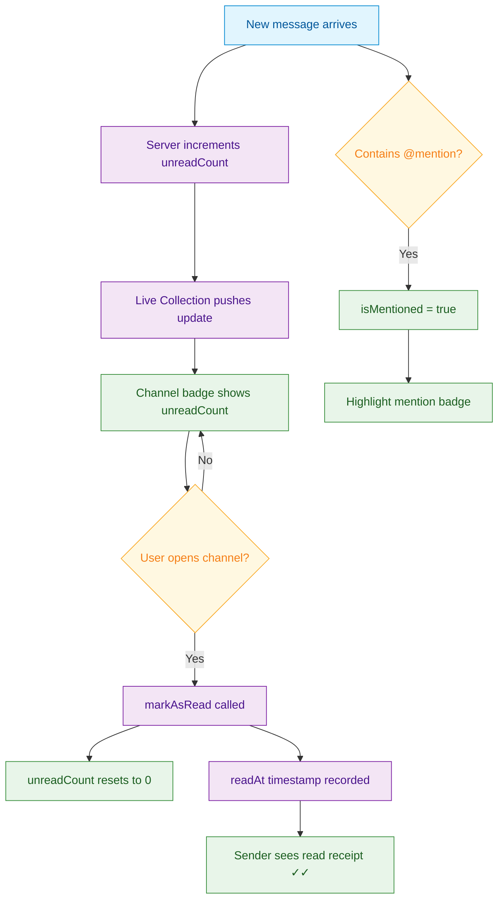

<Info>**SDK v7.x** · Last verified March 2026 · iOS · Android · Web · Flutter</Info>

<Accordion title="Speed run — just the code" icon="forward">
```typescript
// Get unread count for a single channel
const channel = await ChannelRepository.getChannel(channelId);
console.log(channel.unreadCount);      // unread messages
console.log(channel.isMentioned);      // @-mentioned in this channel

// List all channels sorted by unread
const list = ChannelRepository.getChannels({
  filter: 'member',
  sortBy: 'lastActivity',
});
list.on('dataUpdated', (channels) => {
  channels.forEach(c => console.log(c.displayName, c.unreadCount));
});

// Mark channel as read (resets unread count to 0)
await ChannelRepository.markAsRead(channelId);
```
Full walkthrough below ↓
</Accordion>

<Tip>
**Platform note** — code samples below use TypeScript. Every method has an equivalent in the iOS (Swift), Android (Kotlin), and Flutter (Dart) SDKs — see the linked SDK reference in each step.
</Tip>

Unread counts and read receipts are often the first thing users look at when opening a chat app. A clean badge system drives re-engagement; missing badges feel like a broken product. This guide covers both the per-channel unread count and per-message delivered/read status.



<Info>
**Prerequisites**: User is a member of channels with messages → [Channels & Conversations](/use-cases/chat/channels-and-conversations)
</Info>

## Quick Start

```typescript
import { ChannelRepository } from '@amityco/ts-sdk';

try {
  const channel = await ChannelRepository.getChannel(channelId);
  console.log(`${channel.unreadCount} unread, mentioned: ${channel.isMentioned}`);

  // After the user opens the channel view
  await ChannelRepository.markAsRead(channelId);
} catch (error) {
  console.error('Failed to read channel status:', error);
}
```

## Step-by-Step Implementation

<Steps>
  <Step title="Display per-channel unread badges">
    Pull `unreadCount` and `isMentioned` from the channel list Live Collection for a real-time inbox view:

    ```typescript
    import { ChannelRepository } from '@amityco/ts-sdk';

    const list = ChannelRepository.getChannels({
      filter: 'member',
      sortBy: 'lastActivity',
    });

    list.on('dataUpdated', (channels) => {
      channels.forEach(channel => {
        const badge = channel.isMentioned
          ? '@'                          // Mention badge takes priority
          : channel.unreadCount > 0
            ? String(channel.unreadCount) // Numeric badge
            : '';
        updateChannelRow(channel.channelId, badge);
      });
    });
    ```

    → [Channel Unread Count](/social-plus-sdk/chat/engagement-features/unread-status/channel-unread-count)
  </Step>
  <Step title="Check if unreadCount is supported">
    Some channel configurations do not support unread counts (e.g., channels joined before unread tracking was enabled). Always check `isUnreadCountSupported` before rendering the badge:

    ```typescript
    channels.forEach(channel => {
      if (!channel.isUnreadCountSupported) {
        // Hide badge UI for this channel
        return;
      }
      renderBadge(channel.unreadCount);
    });
    ```

    → [Unread Count Support](/social-plus-sdk/chat/engagement-features/unread-status/channel-unread-count)
  </Step>
  <Step title="Reset unread count when the channel opens">
    Call `markAsRead` as soon as the user views the channel. Deferring this call creates a confusing experience where the user has already read messages but still sees a badge.

    ```typescript
    // Call when the channel view mounts or becomes active
    async function onChannelOpen(channelId: string) {
      await ChannelRepository.markAsRead(channelId);
    }
    ```
  </Step>
  <Step title="Show per-message read receipts">
    For 1:1 Conversation channels, show individual message delivery and read status (the ✓ / ✓✓ pattern):

    ```typescript
    liveCollection.on('dataUpdated', (messages) => {
      messages.forEach(msg => {
        let status = '⏱ Sending';
        if (msg.syncState === 'synced') status = '✓ Sent';
        if (msg.readByCount > 0)        status = '✓✓ Read';
        renderMessageStatus(msg.messageId, status);
      });
    });
    ```

    | Property | Meaning |
    |---|---|
    | `syncState === 'synced'` | Message delivered to server |
    | `readByCount > 0` | At least one member has read it |
    | `deliveredToMemberCount` | How many members received it |

    → [Message Read Status](/social-plus-sdk/chat/engagement-features/unread-status/message-read-status)
  </Step>
</Steps>

## Connect to Moderation & Analytics

<AccordionGroup>
  <Accordion title="Push notifications on unread" icon="bell">
    Pair unread counts with push notifications so users re-engage even when the app is backgrounded. Configure notification templates in **Admin Console → Push Notifications**.

    → [Push Notifications Setup](/social-plus-sdk/core-concepts/realtime-communication/push-notifications/overview)
  </Accordion>
  <Accordion title="Mention analytics" icon="at">
    Track how often users @mention each other using the Analytics API to surface power users for community health reporting.

    → [Analytics Overview](/analytics-and-moderation/console/analytics/)
  </Accordion>
</AccordionGroup>

## Common Mistakes

<Warning>
**Calling `markAsRead` too early** — If you call `markAsRead` when the channel row is tapped rather than when the message list is visible, messages might be marked read before the user sees them. Call it inside the component that shows the message list (`componentDidMount` / `onResume` / `viewDidAppear`).
</Warning>

<Warning>
**Rendering unread counts on unsupported channels** — Always check `isUnreadCountSupported`. Rendering a badge of `0` (not null) from an unsupported channel is misleading — it implies tracking is working when it isn't.
</Warning>

## Best Practices

<AccordionGroup>
  <Accordion title="Prioritize mention badges over unread counts" icon="at">
    Display `@` when `isMentioned` is true, even if `unreadCount` is low. A direct mention requires attention regardless of total message volume.
  </Accordion>
  <Accordion title="Cap badge display at 99+" icon="hashtag">
    Channels with hundreds of unread messages are likely muted or archived. Show `99+` to avoid layout overflow and signal to the user that they should mute or catch up.
  </Accordion>
  <Accordion title="Pair with push for re-engagement" icon="bell">
    Unread counts only help users already in the app. Configure push notifications in the Admin Console to bring users back when they have unread messages. The two systems share the same underlying unread data.
  </Accordion>
</AccordionGroup>

<Tip>
**Dive deeper**: [Messaging API Reference](/social-plus-sdk/chat/messaging-features/overview) has full parameter tables, method signatures, and platform-specific details for every API used in this guide.
</Tip>

## Next Steps

<CardGroup cols={3}>
  <Card title="Sending Messages" href="/use-cases/chat/sending-messages" icon="paper-plane">
    Core message send/receive implementation.
  </Card>
  <Card title="Channel Roles & Permissions" href="/use-cases/chat/channel-roles-and-permissions" icon="user-shield">
    Control who can post and who can moderate unread/read state.
  </Card>
  <Card title="Direct Messages Path" href="/use-cases/choose-your-path#direct-messages" icon="comments">
    Full DM build path where read receipts matter most.
  </Card>
</CardGroup>
