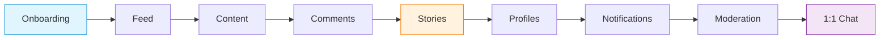
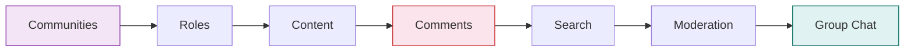
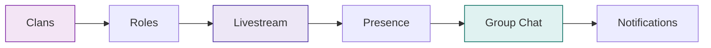
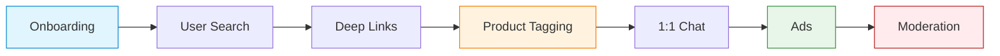
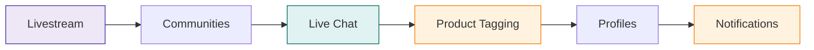
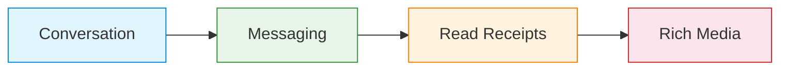
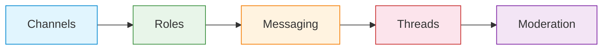
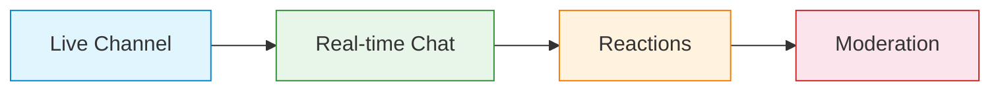

Not sure where to start? Pick the app type closest to what you're building. Each path is an ordered sequence of guides — follow them in order for the smoothest build, or jump to any step directly.

<CardGroup cols={4}>
  <Card title="Social" icon="camera-retro" href="#social">
    Instagram, BeReal, Strava
  </Card>
  <Card title="Community" icon="people-group" href="#community">
    Reddit, Discord, Facebook Groups
  </Card>
  <Card title="Gaming" icon="gamepad" href="#gaming">
    Clans, streams, presence
  </Card>
  <Card title="Marketplace" icon="store" href="#marketplace">
    Depop, Etsy, social commerce
  </Card>
  <Card title="Livestream" icon="tower-broadcast" href="#livestream">
    Twitch, YouTube Live
  </Card>
  <Card title="Direct Messages" icon="comment" href="#direct-messages">
    Dating, support, DMs
  </Card>
  <Card title="Group Chat" icon="users" href="#group-chat">
    Discord, Slack, team rooms
  </Card>
  <Card title="Live Chat" icon="messages" href="#live-chat">
    Twitch chat, events, Q&A
  </Card>
</CardGroup>

---

## Social

> **Instagram, BeReal, Strava** — content sharing with profiles, stories, and a social graph.
>
> 9 guides · ~3 hours total

<Steps>
  <Step title="User Onboarding & Visitor Mode" icon="door-open">
    Let users explore content before signing up, then transition to authenticated sessions with profile setup.

    → [Open guide](/use-cases/social/user-onboarding-and-visitor-mode) · `~20 min` · Beginner
  </Step>
  <Step title="Build a Social Feed" icon="rectangle-list">
    The core loop — home timeline, community feeds, and a global discovery feed with real-time updates.

    → [Open guide](/use-cases/social/build-a-social-feed) · `~20 min` · Beginner
  </Step>
  <Step title="Rich Content Creation" icon="pen-to-square">
    Text, image, video, and poll posts with @mentions, hashtags, and media uploads.

    → [Open guide](/use-cases/social/rich-content-creation) · `~25 min` · Intermediate
  </Step>
  <Step title="Comments & Reactions" icon="comments">
    Threaded comments and emoji reactions on posts — the engagement layer.

    → [Open guide](/use-cases/social/comments-and-reactions) · `~15 min` · Beginner
  </Step>
  <Step title="Stories & Ephemeral Content" icon="circle-play">
    24-hour stories with story rings, view counts, and impression analytics.

    → [Open guide](/use-cases/social/stories-and-ephemeral-content) · `~20 min` · Intermediate
  </Step>
  <Step title="User Profiles & Social Graph" icon="user-group">
    Follow/unfollow, connection requests, profile pages, and follower lists.

    → [Open guide](/use-cases/social/user-profiles-and-social-graph) · `~20 min` · Beginner
  </Step>
  <Step title="Notifications & Engagement" icon="bell">
    In-app notification tray and push notifications to drive retention.

    → [Open guide](/use-cases/social/notifications-and-engagement) · `~30 min` · Advanced
  </Step>
  <Step title="Content Moderation Pipeline" icon="shield-check">
    User flagging → admin review → AI moderation → webhook automation.

    → [Open guide](/use-cases/social/content-moderation-pipeline) · `~30 min` · Advanced
  </Step>
  <Step title="1:1 Chat & DMs" icon="comment">
    Private direct messaging between users.

    → [See Direct Messages path](#direct-messages) · `~1.5 hrs` · All levels
  </Step>
</Steps>

---

## Community

> **Reddit, Discord, Facebook Groups** — discussions, moderation, and discovery.
>
> 7 guides · ~2.5 hours total

<Steps>
  <Step title="Community Platform" icon="users">
    Create public and private communities with categories, membership, and governance settings.

    → [Open guide](/use-cases/social/community-platform) · `~25 min` · Intermediate
  </Step>
  <Step title="Roles, Permissions & Governance" icon="user-shield">
    Moderator roles, post review queues, and ban management.

    → [Open guide](/use-cases/social/roles-permissions-and-governance) · `~20 min` · Intermediate
  </Step>
  <Step title="Rich Content Creation" icon="pen-to-square">
    Posts and polls inside community feeds.

    → [Open guide](/use-cases/social/rich-content-creation) · `~25 min` · Intermediate
  </Step>
  <Step title="Comments & Reactions" icon="comments">
    Threaded discussions and emoji reactions.

    → [Open guide](/use-cases/social/comments-and-reactions) · `~15 min` · Beginner
  </Step>
  <Step title="Search & Discovery" icon="magnifying-glass">
    Find communities, trending topics, and category browsing.

    → [Open guide](/use-cases/social/search-and-discovery) · `~15 min` · Beginner
  </Step>
  <Step title="Content Moderation Pipeline" icon="shield-check">
    Rules enforcement — flagging, AI screening, webhook automation.

    → [Open guide](/use-cases/social/content-moderation-pipeline) · `~30 min` · Advanced
  </Step>
  <Step title="Group Chat" icon="message">
    Persistent chat rooms for community members.

    → [See Group Chat path](#group-chat) · `~1.5 hrs` · All levels
  </Step>
</Steps>

---

## Gaming

> **Discord, Twitch** — clans, livestreams, and real-time presence.
>
> 6 guides · ~2.5 hours total

<Steps>
  <Step title="Community Platform" icon="users">
    Clan and team spaces with membership and privacy settings.

    → [Open guide](/use-cases/social/community-platform) · `~25 min` · Intermediate
  </Step>
  <Step title="Roles, Permissions & Governance" icon="user-shield">
    Clan leadership roles, mod tools, and member management.

    → [Open guide](/use-cases/social/roles-permissions-and-governance) · `~20 min` · Intermediate
  </Step>
  <Step title="Livestream & Video Posts" icon="tower-broadcast">
    In-game streams, co-hosting, VOD playback, and live chat.

    → [Open guide](/use-cases/social/livestream-and-video-posts) · `~30 min` · Advanced
  </Step>
  <Step title="Real-time Presence & Activity" icon="signal">
    "Online now" indicators and channel presence tracking.

    → [Open guide](/use-cases/social/realtime-presence-and-activity) · `~25 min` · Intermediate
  </Step>
  <Step title="Group Chat" icon="message">
    Text channels for clans and teams.

    → [See Group Chat path](#group-chat) · `~1.5 hrs` · All levels
  </Step>
  <Step title="Notifications & Engagement" icon="bell">
    Match alerts, tournament updates, and push notifications.

    → [Open guide](/use-cases/social/notifications-and-engagement) · `~30 min` · Advanced
  </Step>
</Steps>

---

## Marketplace

> **Depop, Etsy** — social commerce with buyer-seller messaging and shoppable content.
>
> 7 guides · ~2.5 hours total

<Steps>
  <Step title="User Onboarding & Visitor Mode" icon="door-open">
    Let browsers explore listings before signing up.

    → [Open guide](/use-cases/social/user-onboarding-and-visitor-mode) · `~20 min` · Beginner
  </Step>
  <Step title="User Search & People Discovery" icon="user-magnifying-glass">
    Find sellers, creators, and shops.

    → [Open guide](/use-cases/social/user-search-and-people-discovery) · `~15 min` · Beginner
  </Step>
  <Step title="Content Sharing & Deep Links" icon="share-nodes">
    Shareable product pages and deep-link routing.

    → [Open guide](/use-cases/social/content-sharing-and-deep-links) · `~15 min` · Beginner
  </Step>
  <Step title="Product Tagging & Social Commerce" icon="tags">
    Turn posts and livestreams into shoppable storefronts with product tagging, catalogues, and engagement analytics.

    → [Open guide](/use-cases/social/product-tagging-and-social-commerce) · `~20 min` · Intermediate
  </Step>
  <Step title="1:1 Chat" icon="comment">
    Buyer-seller messaging with read receipts.

    → [See Direct Messages path](#direct-messages) · `~1.5 hrs` · All levels
  </Step>
  <Step title="Advertising & Monetization" icon="rectangle-ad">
    Native ads in feeds with console-driven config and impression tracking.

    → [Open guide](/use-cases/social/advertising-and-monetization) · `~15 min` · Beginner
  </Step>
  <Step title="Content Moderation Pipeline" icon="shield-check">
    Keep listings safe — flagging, AI screening, and admin review.

    → [Open guide](/use-cases/social/content-moderation-pipeline) · `~30 min` · Advanced
  </Step>
</Steps>

---

## Livestream

> **Twitch, YouTube Live** — broadcast with interactive chat, streamer profiles, and shoppable streams.
>
> 6 guides · ~3.5 hours total

<Steps>
  <Step title="Livestream & Video Posts" icon="tower-broadcast">
    Broadcast rooms, co-hosting, live chat overlay, and recorded playback.

    → [Open guide](/use-cases/social/livestream-and-video-posts) · `~30 min` · Advanced
  </Step>
  <Step title="Community Platform" icon="users">
    Stream communities where followers gather and discover content.

    → [Open guide](/use-cases/social/community-platform) · `~25 min` · Intermediate
  </Step>
  <Step title="Live Chat" icon="message">
    Real-time stream chat with high-volume message handling.

    → [See Live Chat path](#live-chat) · `~1.5 hrs` · All levels
  </Step>
  <Step title="Product Tagging & Social Commerce" icon="tags">
    Pin products during a stream, let viewers browse and buy — turn broadcasts into revenue.

    → [Open guide](/use-cases/social/product-tagging-and-social-commerce) · `~20 min` · Intermediate
  </Step>
  <Step title="User Profiles & Social Graph" icon="user-group">
    Follow streamers, view streamer profiles, and build an audience.

    → [Open guide](/use-cases/social/user-profiles-and-social-graph) · `~20 min` · Beginner
  </Step>
  <Step title="Notifications & Engagement" icon="bell">
    "X just went live" push alerts and activity notifications.

    → [Open guide](/use-cases/social/notifications-and-engagement) · `~30 min` · Advanced
  </Step>
</Steps>

---

## Direct Messages

> **Dating apps, customer support, marketplace DMs** — private 1:1 messaging with read receipts and rich media.
>
> 4 guides · ~1.5 hours total

<Steps>
  <Step title="Channels & Conversations" icon="message">
    Create a private Conversation channel between two users and display a chat list.

    → [Open guide](/use-cases/chat/channels-and-conversations) · `~20 min` · Beginner
  </Step>
  <Step title="Sending Messages" icon="paper-plane">
    Build the message thread — send, receive, and load history.

    → [Open guide](/use-cases/chat/sending-messages) · `~20 min` · Beginner
  </Step>
  <Step title="Unread Counts & Read Receipts" icon="envelope-open">
    Show the sender when their message was delivered and read.

    → [Open guide](/use-cases/chat/unread-counts-and-read-receipts) · `~15 min` · Beginner
  </Step>
  <Step title="Rich Media Messages" icon="photo-film">
    Photos, voice notes, files, and custom content types.

    → [Open guide](/use-cases/chat/rich-media-messages) · `~20 min` · Intermediate
  </Step>
</Steps>

---

## Group Chat

> **Discord, Slack, team rooms** — persistent channels with roles, media, threaded replies, and moderation.
>
> 5 guides · ~1.5 hours total

<Steps>
  <Step title="Channels & Conversations" icon="message">
    Create a Community channel, invite members, and display a real-time channel list.

    → [Open guide](/use-cases/chat/channels-and-conversations) · `~20 min` · Beginner
  </Step>
  <Step title="Channel Roles & Permissions" icon="user-shield">
    Establish who can do what before the first message is sent.

    → [Open guide](/use-cases/chat/channel-roles-and-permissions) · `~20 min` · Intermediate
  </Step>
  <Step title="Messaging & Rich Media" icon="paper-plane">
    Text, images, audio, files, and custom message types.

    → [Open guide](/use-cases/chat/sending-messages) · `~20 min` · Beginner
  </Step>
  <Step title="Threads & Reactions" icon="reply">
    Threaded replies and emoji reactions to keep the main chat clean.

    → [Open guide](/use-cases/chat/message-reactions-and-replies) · `~15 min` · Beginner
  </Step>
  <Step title="Chat Moderation" icon="shield-check">
    Muting, banning, AI content screening, and webhook automation.

    → [Open guide](/use-cases/chat/chat-moderation) · `~25 min` · Advanced
  </Step>
</Steps>

---

## Live Chat

> **Twitch chat, sports events, live Q&A** — high-volume, many-to-many commentary alongside live content.
>
> 4 guides · ~1.5 hours total

<Steps>
  <Step title="Channels & Conversations" icon="message">
    Create a Live-type channel that persists across broadcast sessions.

    → [Open guide](/use-cases/chat/channels-and-conversations) · `~20 min` · Beginner
  </Step>
  <Step title="Sending Messages" icon="paper-plane">
    Real-time message sending and querying with automatic rate limiting.

    → [Open guide](/use-cases/chat/sending-messages) · `~20 min` · Beginner
  </Step>
  <Step title="Message Reactions" icon="reply">
    Emoji reactions without flooding the chat with text messages.

    → [Open guide](/use-cases/chat/message-reactions-and-replies) · `~15 min` · Beginner
  </Step>
  <Step title="Chat Moderation" icon="shield-check">
    Automated and manual tools for high-volume chat — mute, ban, AI screening.

    → [Open guide](/use-cases/chat/chat-moderation) · `~25 min` · Advanced
  </Step>
</Steps>
