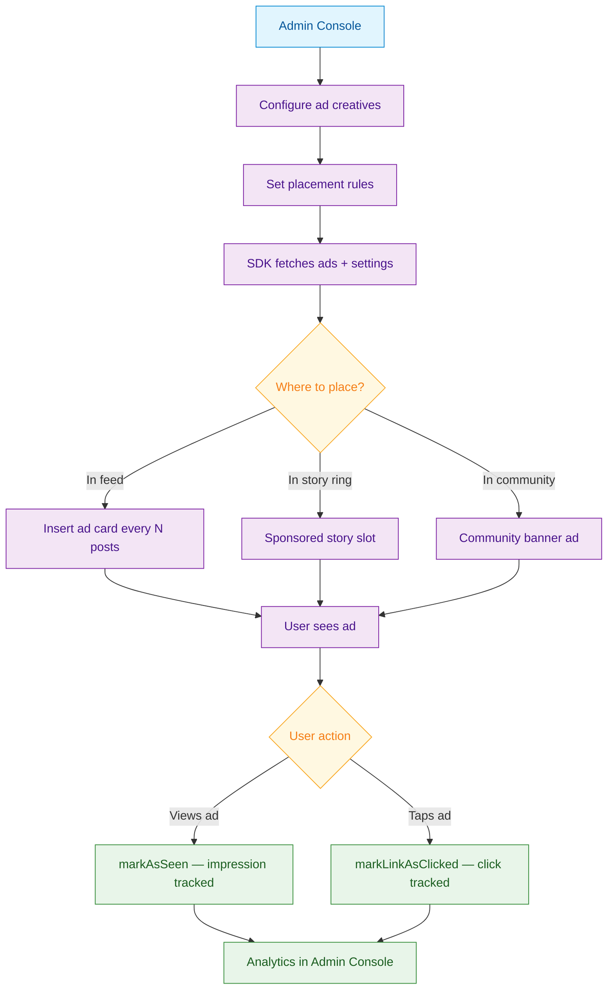

<Info>**SDK v7.x** · Last verified March 2026 · iOS · Android · Web · Flutter</Info>

<Accordion title="Speed run — just the code" icon="forward">
```typescript
// 1. Fetch network ads
const { data: ads } = await AdRepository.getNetworkAds({ placement: 'feed' });

// 2. Track an impression
await AdRepository.markAdSeen(ads[0].adId);

// 3. Track a click
await AdRepository.markAdClicked(ads[0].adId);
```
Full walkthrough below ↓
</Accordion>

<Tip>
**Platform note** — code samples below use TypeScript. Every method has an equivalent in the iOS (Swift), Android (Kotlin), and Flutter (Dart) SDKs — see the linked SDK reference in each step.
</Tip>

Native ads blend into your social feed, generating revenue without disrupting the user experience. social.plus provides a console-driven ad system — configure ad placements and creatives in the Admin Console, then fetch and render them in your app using the SDK. This guide covers fetching ads, tracking impressions and clicks, and placing ads within feeds.



<Info>
**Prerequisites**: SDK installed and authenticated → [SDK Setup](/social-plus-sdk/getting-started/overview). Ads must be configured in **Admin Console → Settings → Premium Ads** with at least one active creative uploaded.

**Also recommended:** Complete [Build a Social Feed](/use-cases/social/build-a-social-feed) first — ads render inline within feed content.
</Info>

<Note>
**After completing this guide you'll have:**
- Native ad units rendering in the feed at configured intervals
- Impression and click events tracked and sent to the Admin Console
- Ad frequency and targeting rules configured via the Admin Console
</Note>

---

## Quick Start: Fetch and Display Ads

```typescript TypeScript
import { AdRepository } from '@amityco/ts-sdk';

try {
  const { ads, settings } = await AdRepository.getNetworkAds();
  // ads: Array of Ad objects with creative URLs, CTAs, and metadata
  // settings: placement configuration (frequency, positions)
} catch (error) {
  console.error('Failed to fetch ads:', error);
}
```

Full reference → [Ads](/social-plus-sdk/core-concepts/content-handling/ads)

---

## Step-by-Step Implementation

<Steps>
  <Step title="Fetch ads and placement settings">
    Call `getNetworkAds()` on app launch and cache the result. The response includes the ad creatives (images, text, CTAs) and settings that define where and how often to show them.

    ```typescript TypeScript
    import { AdRepository } from '@amityco/ts-sdk';

    const { ads, settings } = await AdRepository.getNetworkAds();
    console.log(`${ads.length} ads available`);
    console.log('Placement frequency:', settings.frequency);
    ```

    Full reference → [Ads](/social-plus-sdk/core-concepts/content-handling/ads)
  </Step>
  <Step title="Insert ads into the feed">
    Use the placement settings to insert ad cards at the right intervals in your social feed. A common pattern is to insert an ad every N posts.

    ```typescript TypeScript
    const buildFeedWithAds = (posts: any[], ads: Amity.Ad[], frequency: number) => {
      const feedItems: any[] = [];
      let adIndex = 0;

      posts.forEach((post, i) => {
        feedItems.push({ type: 'post', data: post });

        // Insert ad every `frequency` posts
        if ((i + 1) % frequency === 0 && adIndex < ads.length) {
          feedItems.push({ type: 'ad', data: ads[adIndex] });
          adIndex++;
        }
      });

      return feedItems;
    };
    ```
  </Step>
  <Step title="Track impressions">
    When an ad enters the viewport, mark it as seen. This records an impression for analytics. Use an Intersection Observer (web) or equivalent visibility detection on mobile.

    ```typescript TypeScript
    // When ad card becomes visible in the viewport
    ad.analytics.markAsSeen(Amity.AdPlacement.FEED);
    ```

    Full reference → [Ads](/social-plus-sdk/core-concepts/content-handling/ads)
  </Step>
  <Step title="Track link clicks">
    When a user taps an ad's call-to-action, record the click before opening the destination URL.

    ```typescript TypeScript
    const handleAdClick = (ad: Amity.Ad) => {
      // Record the click
      ad.analytics.markLinkAsClicked(Amity.AdPlacement.FEED);

      // Open the destination
      window.open(ad.callToActionUrl, '_blank');
    };
    ```

    Full reference → [Ads](/social-plus-sdk/core-concepts/content-handling/ads)
  </Step>
  <Step title="Configure ads in the Admin Console">
    Set up ad creatives, targeting, and placement rules in **Admin Console → Settings → Premium Ads**:
    - **Creative**: Upload ad image/video, set headline text and CTA button text
    - **Targeting**: Choose which communities or content categories to show the ad in
    - **Frequency**: How often ads appear in the feed (every N posts)
    - **Schedule**: Start/end dates for the campaign

    → [Admin Console: Premium Ads](/analytics-and-moderation/console/premium-ads/)
  </Step>
</Steps>

---

## Connect to Moderation & Analytics

<AccordionGroup>
  <Accordion title="Ad performance analytics" icon="chart-bar">
    View impression counts, click-through rates, and conversion metrics per ad creative in **Admin Console → Analytics → Ads Performance**. Use this to optimize creative and placement.
  </Accordion>
  <Accordion title="Ad moderation" icon="shield">
    Community moderators can flag ads that don't fit their community's tone. Flagged ads are reviewed in the Admin Console moderation queue.
  </Accordion>
  <Accordion title="Webhook: ad events" icon="webhook">
    Receive ad impression and click events via webhooks to sync with your ad server or analytics pipeline.

    → [Webhook Events](/analytics-and-moderation/social+-apis-and-services/webhook-event)
  </Accordion>
</AccordionGroup>

---

## Common Mistakes

<Warning>
**Rendering ads without tracking impressions** — If you display an ad but don't call `markAdSeen()`, the impression isn't counted and revenue isn't attributed. Always track when the ad enters the viewport.

```typescript
// ❌ Bad — ad shown but no tracking
return <AdBanner ad={ad} />;

// ✅ Good — track on visibility
const onVisible = () => AdRepository.markAdSeen(ad.adId);
return <AdBanner ad={ad} onVisible={onVisible} />;
```
</Warning>

<Warning>
**Caching ads for too long** — Ad creatives and targeting change frequently. Fetch fresh ads on each feed load instead of caching them across sessions.
</Warning>

<Warning>
**Placing ads too frequently in the feed** — Ads every 3–4 posts degrade user experience. A ratio of 1 ad per 8–10 organic posts maintains engagement while generating revenue.
</Warning>

## Best Practices

<AccordionGroup>
  <Accordion title="Ad placement UX" icon="rectangle-ad">
    - Don't show ads in the first 3 positions of the feed — let users see content first
    - Match the ad card styling to your post card styling for a native feel
    - Label ads clearly with an "Ad" or "Sponsored" tag — transparency builds trust
    - Don't show more than 1 ad per 5 posts — higher density drives users away
    - Hide ads from the feed when ad count is 0 — never show a broken ad placeholder
  </Accordion>
  <Accordion title="Impression accuracy" icon="eye">
    - Only call `markAsSeen()` when the ad is at least 50% visible for 1+ seconds — this matches industry standards
    - Don't track impressions when the app is backgrounded or the screen is off
    - De-duplicate impressions client-side — only track the first impression per ad per session
    - Use `Amity.AdPlacement.FEED` for in-feed ads and the appropriate placement enum for other positions
  </Accordion>
  <Accordion title="Performance" icon="gauge">
    - Cache `getNetworkAds()` for the session — ads change infrequently
    - Pre-load ad images while the user is scrolling through content
    - Lazy-load ad video creatives — only start playback when the ad is in view
    - Keep ad card rendering lightweight — heavy ad views slow down feed scrolling
  </Accordion>
</AccordionGroup>

---

<Tip>
**Dive deeper**: [Posts API Reference](/social-plus-sdk/social/content-management/posts/overview) has full parameter tables, method signatures, and platform-specific details for every API used in this guide.
</Tip>

## Next Steps

<Card
  title="Your next step → Post Impressions & Creator Analytics"
  icon="arrow-right"
  href="/use-cases/social/post-impressions-and-creator-analytics"
>
  Ads are running — now track organic content performance alongside ad metrics.
</Card>

Or explore related guides:

<CardGroup cols={3}>
  <Card title="Build a Social Feed" href="/use-cases/social/build-a-social-feed" icon="rectangle-list">
    Build the feed where ads are placed
  </Card>
  <Card title="Stories & Ephemeral Content" href="/use-cases/social/stories-and-ephemeral-content" icon="circle-play">
    Integrate sponsored stories alongside user stories
  </Card>
  <Card title="Content Moderation Pipeline" href="/use-cases/social/content-moderation-pipeline" icon="shield-check">
    Handle flagged ad content
  </Card>
</CardGroup>
