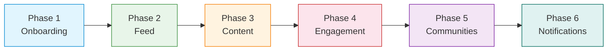

<Info>**SDK v7.x** · Last verified March 2026 · iOS · Android · Web · Flutter</Info>

This is not a single guide — it's a **guided trail** that chains 6 existing guides into building one real app from scratch. Each phase links to a standalone guide. Follow them in order and you'll end up with a working social app with feeds, content creation, engagement, communities, and notifications.

<Note>
**After completing this trail you'll have:**
- A full social app with user onboarding, feeds, posts, comments, reactions, communities, and notifications
- Real-time updates across all features via Live Collections
- Moderation and analytics connected through the Admin Console
</Note>

---

## Phase 1: User Onboarding & Visitor Mode · `~20 min` · `Beginner`

**Goal:** Let users explore your app before signing up, then smoothly transition them to authenticated sessions.

**What you'll build:**
- Visitor mode so unauthenticated users can browse content
- Visitor → authenticated transition with session continuity
- Profile setup flow (display name, avatar) at first login

<Card
  title="Open the full guide →"
  icon="door-open"
  href="/use-cases/social/user-onboarding-and-visitor-mode"
>
  Complete implementation with SDK code, auth flow diagrams, and session handling patterns.
</Card>

**When you're done:** Users can sign in, set up their profile, and you have an authenticated session ready for the next phase.

---

## Phase 2: Build a Social Feed · `~20 min` · `Beginner`

**Goal:** Give authenticated users a feed full of content — their own posts, community posts, and a global discovery feed.

**What you'll build:**
- User feed (personal timeline)
- Community feed (posts within a group)
- Global feed (aggregated across all communities)
- Real-time updates via Live Collections

<Card
  title="Open the full guide →"
  icon="rectangle-list"
  href="/use-cases/social/build-a-social-feed"
>
  Feed queries, Live Collection subscriptions, pagination, and custom ranking configuration.
</Card>

**When you're done:** Your app has three working feeds that update in real-time. But they're empty — next, let's create content.

---

## Phase 3: Rich Content Creation · `~25 min` · `Intermediate`

**Goal:** Let users create posts that populate the feeds you just built.

**What you'll build:**
- Text, image, video, and poll post creation
- Media upload with progress tracking
- @mentions, hashtags, and link previews
- Post targeting (to a user profile or community)

<Card
  title="Open the full guide →"
  icon="pen-to-square"
  href="/use-cases/social/rich-content-creation"
>
  All 11 post types, media upload API, mention/hashtag parsing, and metadata attachment.
</Card>

**When you're done:** Feeds are filling up with content. Users can post but can't interact with each other's content yet.

---

## Phase 4: Comments & Reactions · `~15 min` · `Beginner`

**Goal:** Turn passive content consumption into active engagement.

**What you'll build:**
- Threaded comments (top-level + replies) on posts
- Emoji reactions (like, love, clap — or any custom set)
- Real-time comment and reaction count updates
- Comment and reaction removal

<Card
  title="Open the full guide →"
  icon="comments"
  href="/use-cases/social/comments-and-reactions"
>
  Comment CRUD, reaction add/remove/query, real-time updates, and @mentions in comments.
</Card>

**When you're done:** Users are engaging with each other's content. Now let's give them organized spaces.

---

## Phase 5: Community Platform · `~25 min` · `Intermediate`

**Goal:** Create group spaces where users can gather, share content, and build identity.

**What you'll build:**
- Public and private community creation
- Member join/leave and role assignment (member, moderator)
- Community categories for organization
- Trending and recommended community discovery

<Card
  title="Open the full guide →"
  icon="users"
  href="/use-cases/social/community-platform"
>
  Community lifecycle, governance, membership management, and discovery features.
</Card>

**When you're done:** Your app has structured communities with moderation capabilities. One more step to complete the loop.

---

## Phase 6: Notifications & Engagement · `~30 min` · `Advanced`

**Goal:** Keep users coming back with in-app notifications and push alerts.

**What you'll build:**
- In-app notification tray with seen/unseen state
- Push notification setup (APNs + FCM)
- Real-time delivery of new notifications
- Event-based triggers (new post, new follower, new comment)

<Card
  title="Open the full guide →"
  icon="bell"
  href="/use-cases/social/notifications-and-engagement"
>
  Notification tray queries, push registration, real-time event subscriptions, and webhook triggers.
</Card>

**When you're done:** Users get notified about new activity, driving them back into the app. 🎉

---

## What You've Built

<Note>
**Your app now has:**
- ✅ User authentication with visitor mode and profile setup
- ✅ Three feed types (user, community, global) with real-time updates
- ✅ Rich content creation with 11 post types and media upload
- ✅ Threaded comments and freeform emoji reactions
- ✅ Public and private communities with roles and discovery
- ✅ In-app and push notifications for user engagement

**Total implementation time:** ~2.5 hours following the guides end-to-end.
</Note>

---

## Common Pitfalls

<Warning>
**Skipping authentication setup** — Every guide assumes a valid authenticated session. If login isn't working, nothing else will. Start with [SDK Getting Started](/social-plus-sdk/getting-started/overview) before entering Phase 1.
</Warning>

<Warning>
**Not disposing Live Collections between screens** — Each feed, channel list, and comment thread uses a Live Collection. Dispose them when navigating away or you'll accumulate stale listeners and memory leaks.
</Warning>

<Warning>
**Publishing posts without awaiting media upload** — If you create image/video posts, always `await` the upload before calling `createPost`. Publishing with a pending upload results in broken media.
</Warning>

---

## Next Steps

Now that you have a complete social app, extend it with these guides:

<CardGroup cols={3}>
  <Card title="Stories & Ephemeral Content" icon="circle-play" href="/use-cases/social/stories-and-ephemeral-content">
    Add 24-hour stories with story rings and view counts
  </Card>
  <Card title="User Profiles & Social Graph" icon="user-group" href="/use-cases/social/user-profiles-and-social-graph">
    Build profile pages with follow/unfollow and blocking
  </Card>
  <Card title="Content Moderation Pipeline" icon="shield-check" href="/use-cases/social/content-moderation-pipeline">
    Wire up flagging, AI moderation, and admin review
  </Card>
  <Card title="Search & Discovery" icon="magnifying-glass" href="/use-cases/social/search-and-discovery">
    Full-text search, trending communities, and category browsing
  </Card>
  <Card title="Livestream & Video Posts" icon="tower-broadcast" href="/use-cases/social/livestream-and-video-posts">
    Go live in communities with broadcast rooms and recordings
  </Card>
  <Card title="Roles, Permissions & Governance" icon="user-shield" href="/use-cases/social/roles-permissions-and-governance">
    Set up moderator roles, post review, and ban management
  </Card>
</CardGroup>
