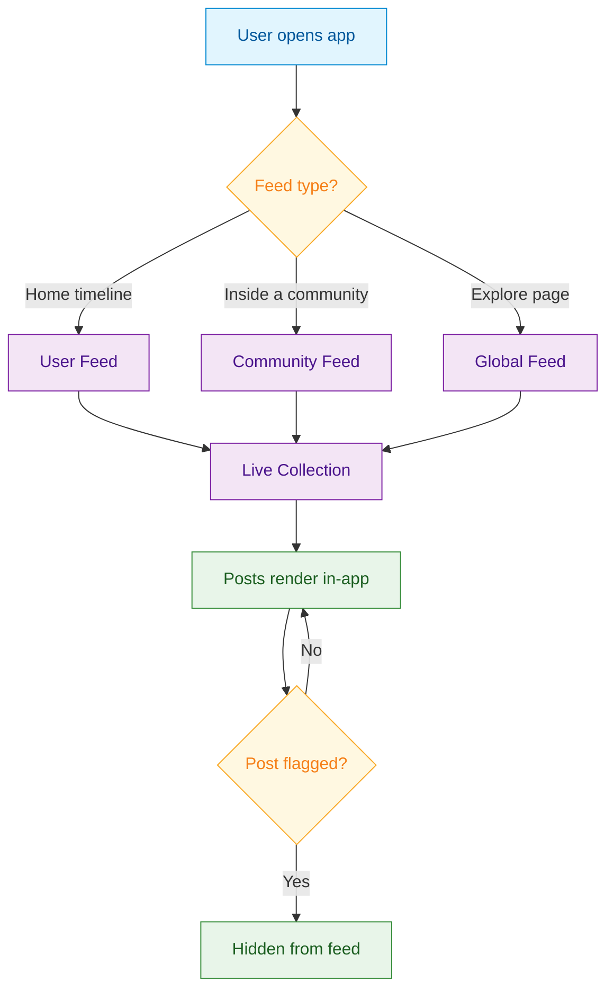

import GetUserFeed from '/snippets/social/feeds/get-user-feed.mdx';

<Info>**SDK v7.x** · Last verified March 2026 · iOS · Android · Web · Flutter</Info>

<Accordion title="Speed run — just the code" icon="forward">
```typescript
// 1. Query a user feed
const posts = await repository.getUserFeed(
  'user-123',
  ['user', 'community'],
  undefined,
  'lastCreated',
  false,
  true
);

// 2. Query a community feed
const communityPosts = await repository.getCommunityFeed('community-123');

// 3. Subscribe to real-time updates via Live Collections
const unsubscribe = FeedRepository.observeUserFeed('user-123', ({ data }) => {
  renderFeed(data); // auto-updates on new posts or deletions
});
```
Full walkthrough below ↓
</Accordion>

A social feed is the heart of any social app. This guide walks through querying the right feed for each context, subscribing to real-time updates, and controlling post ranking.



## What You'll Build

<CardGroup cols={4}>
  <Card title="User Feed" icon="user">
    A personalized timeline of the current user's posts and community posts they authored
  </Card>
  <Card title="Community Feed" icon="users">
    All posts within a specific community, filtered by type and sorted by recency
  </Card>
  <Card title="Global Feed" icon="globe">
    An aggregated feed across all communities and users with configurable ranking
  </Card>
  <Card title="Real-time Updates" icon="bolt">
    Live Collections that automatically push new posts and deletions to your UI
  </Card>
</CardGroup>

<Info>
**Prerequisites**: SDK installed and authenticated → [SDK Setup](/social-plus-sdk/getting-started/overview). You'll need a valid `userId` for the current user and optionally a `communityId` for community-scoped feeds.
</Info>

<Note>
**After completing this guide you'll have:**
- A live-updating user feed, community feed, and global feed rendering in your app
- Real-time post additions and deletions via Live Collections
- Post ranking configured and connected to the Admin Console
</Note>

---

## Quick Start: Query a User Feed

Use `AmityFeedRepository` to query a user's combined feed (their own posts + community posts they authored):

<GetUserFeed />

Full reference → [Get User Feed](/social-plus-sdk/social/feed/get-user-feed)

---

## Step-by-Step Implementation

<Steps>
  <Step title="Query a community feed">
    Use `PostRepository.getPosts()` to query all posts within a specific community. Filter by post type, sort order, and deletion status.

    ```typescript TypeScript
    import { PostRepository } from '@amityco/ts-sdk';

    const unsubscribe = PostRepository.getPosts(
      { targetId: 'communityId', targetType: 'community', sortBy: 'lastCreated' },
      ({ data: posts, onNextPage, hasNextPage, loading }) => {
        if (posts) { /* render posts */ }
      },
    );
    ```

    Full reference → [Query Posts](/social-plus-sdk/social/content-management/posts/retrieval/query-posts)
  </Step>
  <Step title="Query the global feed">
    The global feed aggregates posts across all communities. The SDK provides both chronological ordering and custom-ranked feeds based on engagement metrics.

    ```typescript TypeScript
    import { FeedRepository } from '@amityco/ts-sdk';

    const unsubscribe = FeedRepository.getGlobalFeed(
      { limit: 20, includeDeleted: false },
      ({ data: posts, onNextPage, hasNextPage, loading }) => {
        if (posts) { /* render global feed */ }
      },
    );
    ```

    Full reference → [Query Global Feed](/social-plus-sdk/social/feed/query-global-feed)
  </Step>
  <Step title="Subscribe to real-time updates">
    All feed queries return **Live Collections** that automatically push new posts and deletions to your UI. The `unsubscribe` function returned by each query controls the subscription lifecycle — call it when the view unmounts.

    ```typescript TypeScript
    // Live Collection is already active from the getPosts() call above.
    // New posts and deletions push to your callback automatically.
    // Unsubscribe when the screen unmounts:
    unsubscribe();
    ```

    Full reference → [Live Objects & Collections](/social-plus-sdk/core-concepts/realtime-communication/live-objects-collections/overview)
  </Step>
  <Step title="Implement pagination">
    Live Collections provide `onNextPage` and `hasNextPage` in the callback. Trigger load-more when the user scrolls near the bottom.

    ```typescript TypeScript
    // Inside your callback, capture the pagination helpers:
    let nextPageFn: (() => void) | undefined;
    let hasMore: boolean | undefined;

    // In the callback:
    hasMore = hasNextPage;
    nextPageFn = onNextPage;

    // When user scrolls to bottom:
    if (hasMore) nextPageFn?.();
    ```

    Full reference → [Live Objects & Collections](/social-plus-sdk/core-concepts/realtime-communication/live-objects-collections/overview)
  </Step>
  <Step title="Apply custom post ranking (optional)">
    Pin specific posts to the top of a community feed or enable the engagement-based ranking algorithm that factors in comments, reactions, and time decay.

    Full reference → [Custom Post Ranking](/social-plus-sdk/social/feed/custom-post-ranking)
  </Step>
</Steps>

---

## 🔗 Connect to Moderation & Analytics

<AccordionGroup>
  <Accordion title="Flagged content in feeds" icon="flag">
    When a user flags a post via the SDK, the post is submitted for moderator review. By default, flagged posts remain visible until a moderator takes action. You can configure automatic hiding of reported content in the **Admin Console → Content Moderation → Settings**.

    - SDK flagging → [Content Flagging](/social-plus-sdk/social/content-management/moderation/content-flagging)
    - Console review → [Admin Console Moderation](/analytics-and-moderation/console/moderation/overview)
  </Accordion>
  <Accordion title="Post impression analytics" icon="chart-bar">
    Track how many users viewed posts in the feed using impression analytics.

    View aggregated impression data in **Admin Console → Social Management → Post Analytics**.

    Full reference → [Post Impressions](/social-plus-sdk/social/content-management/posts/analytics/post-impressions)
  </Accordion>
  <Accordion title="Webhook: new post in feed" icon="webhook">
    Receive a webhook event whenever a post is created in a community your server monitors. Use this to send push notifications or trigger downstream workflows.

    Reference → [Webhook Events](/analytics-and-moderation/social+-apis-and-services/webhook-event)
  </Accordion>
</AccordionGroup>

---

## Common Mistakes

<Warning>
**Fetching the entire feed at once** — Loading all posts without pagination causes memory spikes and slow initial renders. Always use `limit` and paginate with cursors.

```typescript
// ❌ Bad — fetches everything
const posts = await FeedRepository.getUserFeed('user-123');

// ✅ Good — paginate
const posts = await FeedRepository.getUserFeed('user-123', { limit: 20 });
```
</Warning>

<Warning>
**Ignoring real-time updates** — If you only fetch on mount, users miss new posts and deletions. Subscribe to Live Collections so the feed stays current without manual refreshes.
</Warning>

<Warning>
**Not handling deleted or flagged posts** — Posts can be removed by moderators between fetches. Always check `post.isDeleted` before rendering to avoid showing blank cards.
</Warning>

## Best Practices

<AccordionGroup>
  <Accordion title="Performance" icon="gauge">
    - Use `dataTypes` filtering to limit payload size when you only need specific post types
    - Avoid observing the global feed on low-memory devices — use paginated queries instead
    - Unsubscribe Live Collection observers when the screen goes off-screen (lifecycle-aware)
    - Use `untilAt` (iOS/Android) for time-bounded pagination to prevent content jumping when new posts arrive
  </Accordion>
  <Accordion title="User Experience" icon="heart">
    - Always show a skeleton/placeholder while the first page loads
    - Show a "New posts" banner (like Twitter) rather than auto-scrolling to the top when live updates arrive
    - Preserve scroll position when the user navigates away and returns
    - Cache the first page of the feed for offline display
  </Accordion>
  <Accordion title="Security" icon="shield">
    - Never expose the raw API key in client-side code — use the SDK's built-in auth flow
    - Respect `isPublic: false` communities — the SDK automatically filters private communities from feeds
    - Don't cache deleted posts — observe deletions via Live Collections and remove them immediately
  </Accordion>
</AccordionGroup>

---

## Next Steps

<Card
  title="Your next step → Rich Content Creation"
  icon="arrow-right"
  href="/use-cases/social/rich-content-creation"
>
  Now that you have a working feed, give users something to post — text, images, videos, polls, and file posts.
</Card>

Or explore related guides:

<CardGroup cols={3}>
  <Card title="Rich Content Creation" href="/use-cases/social/rich-content-creation" icon="pen-to-square">
    Create the posts that appear in the feed
  </Card>
  <Card title="Comments & Reactions" href="/use-cases/social/comments-and-reactions" icon="comments">
    Add engagement features to feed posts
  </Card>
  <Card title="Community Platform" href="/use-cases/social/community-platform" icon="users">
    Build the communities that power community feeds
  </Card>
</CardGroup>
