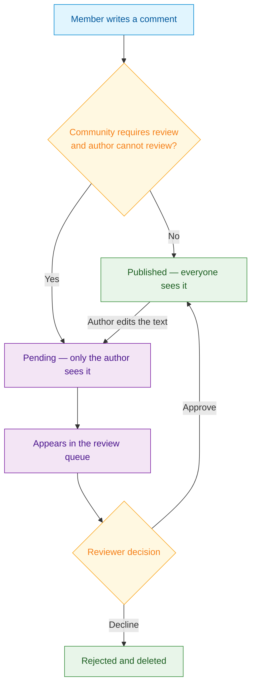

<Info>**SDK** TypeScript v7.28.0+ · iOS 8.8.0+ · Android 7.27.0+ · Last verified September 2026 · Not available on Flutter</Info>

<Accordion title="Speed run — just the code" icon="forward">
```typescript
import { Client, CommentRepository, CommunityRepository } from '@amityco/ts-sdk';

// 1. Require review for a community's comments
await CommunityRepository.updateCommunity(communityId, {
  needApprovalOnCommentCreation: true,
});

// 2. Create a comment and wait for the server's approval status
const { data: comment } = await CommentRepository.createComment(
  { referenceType: 'post', referenceId: postId, data: { text: 'Hello!' } },
  false, // isOptimistic
);
if (comment.approvalStatus === 'pending') showAwaitingReview(comment);

// 3. Reviewer: list the queue, then approve or decline
const canReview = Client.getActiveClient()
  .hasPermission(Amity.Permission.ReviewCommunityCommentPermission)
  .community(communityId);

CommentRepository.getCommentReviewQueue({ communityId }, ({ data }) => renderQueue(data));
await CommentRepository.approveComment(commentId);
await CommentRepository.declineComment(commentId, 'Off-topic');
```
Full walkthrough below ↓
</Accordion>

<Tip>
**Platform note** — code samples below use TypeScript. Every method has an equivalent in the iOS (Swift) and Android (Kotlin) SDKs — see [Comment Review](/social-plus-sdk/social/content-management/comments/moderation/comment-review) for all three. Flutter does not ship comment review.
</Tip>

Some communities need a moderator to read a comment before anyone else does: a brand community during a product launch, a support forum, a group for younger members. Comment review holds a member's comment until a moderator approves it, while the author still sees their own comment as "awaiting review" rather than watching it vanish. This guide wires the whole loop: the community setting, the author's experience, and the reviewer's queue.



<Info>
**Prerequisites**: SDK installed and authenticated, a community whose settings you can change, and a user who holds `REVIEW_COMMUNITY_COMMENT` on it (community moderators do by default).

**Also recommended:** [Comments & Reactions](/use-cases/social/comments-and-reactions) for the comment thread this guide builds on.
</Info>

<Note>
**After completing this guide you'll have:**
- A community that holds members' comments for review
- An author experience that shows a pending comment as "awaiting review"
- Comment threads and counts that stay correct as comments are approved
- A reviewer screen that lists pending comments and approves or declines them
</Note>

---

## How Comment Review Works

A comment is held only when three things are true: it is on a post in a community, that community requires comment review, and its author cannot review the community's comments. The community's creator and its moderators publish immediately. Comments on stories, on user-feed posts, and on your own content IDs are never held.

A held comment is `pending`. A reviewer approves it (`approved`, visible to everyone) or declines it (`rejected`, and deleted). Editing an approved comment's content sends it back to `pending`. The full rules, with every transition and what it changes, are in the [Approval Lifecycle](/social-plus-sdk/social/content-management/comments/moderation/comment-review#approval-lifecycle).

## Step-by-Step Implementation

<Steps>
  <Step title="Turn on review for a community">
    Set `needApprovalOnCommentCreation` when you create or update the community. From then on, new comments by members who cannot review are held.

    ```typescript TypeScript
    import { CommunityRepository } from '@amityco/ts-sdk';

    await CommunityRepository.updateCommunity(communityId, {
      needApprovalOnCommentCreation: true,
    });
    ```

    Moderators can also turn it on from the Admin Console: the community's **Permissions** tab → **Approve member comments**. The Android SDK does not expose this setting, so turn it on from the Console, a Web or iOS client, or the server API.

    Full reference → [Require Review for Community Comments](/social-plus-sdk/social/content-management/comments/moderation/comment-review#require-review-for-community-comments)
  </Step>

  <Step title="Create comments and show the author an awaiting-review state">
    Create with optimistic creation turned off. An optimistic create shows a local comment before the server answers, and its approval status is only the SDK's guess; with it off, the comment you receive carries the server's decision.

    ```typescript TypeScript
    import { CommentRepository } from '@amityco/ts-sdk';

    const { data: comment } = await CommentRepository.createComment(
      {
        referenceType: 'post',
        referenceId: postId,
        data: { text: commentText },
      },
      false, // isOptimistic
    );

    if (comment.approvalStatus === 'pending') {
      // Not in the thread yet — show it to the author only
      showAwaitingReviewCard(comment);
    }
    ```

    Keep that returned comment and render it yourself. A pending comment never appears in a comment query, not even its author's, so the thread alone would make it look as if the comment disappeared.

    Full reference → [Read Approval Status on a Comment](/social-plus-sdk/social/content-management/comments/moderation/comment-review#read-approval-status-on-a-comment)
  </Step>

  <Step title="Keep the thread and counts correct">
    Subscribe to the post's comment topic so approvals reach the client. The comment query then inserts an approved comment into the thread on its own, in the position where it was written, and moves the count.

    ```typescript TypeScript
    import {
      CommentRepository,
      getPostTopic,
      subscribeTopic,
      SubscriptionLevels,
    } from '@amityco/ts-sdk';

    const unsubscribeTopic = subscribeTopic(getPostTopic(post, SubscriptionLevels.COMMENT));

    const unsubscribeComments = CommentRepository.getComments(
      { referenceType: 'post', referenceId: post.postId, parentId: null, sortBy: 'lastCreated' },
      ({ data: comments, loading }) => {
        if (!loading) renderThread(comments); // approved comments only
      },
    );

    // Remove the author's awaiting-review card once the comment is approved
    const disposeApproved = CommentRepository.onCommentApproved((approved) => {
      removeAwaitingReviewCard(approved.commentId);
    });
    ```

    For the post's comment count, `post.commentsCount` counts approved comments for everyone, the author included. Use `post.getLocalCommentCount(true)` when the author should see their own pending comment counted.

    Full reference → [Social Realtime Events](/social-plus-sdk/core-concepts/realtime-communication/realtime-events/social-realtime-events) · [What Approving or Declining Changes](/social-plus-sdk/social/content-management/comments/moderation/comment-review#what-approving-or-declining-changes)
  </Step>

  <Step title="Build the reviewer screen">
    Show review controls only to users who hold `REVIEW_COMMUNITY_COMMENT` on the community. The server enforces the permission on every call; the client check is for hiding controls.

    ```typescript TypeScript
    import { Client, CommentRepository } from '@amityco/ts-sdk';

    const canReview = Client.getActiveClient()
      .hasPermission(Amity.Permission.ReviewCommunityCommentPermission)
      .community(communityId);

    if (canReview) {
      const unsubscribeQueue = CommentRepository.getCommentReviewQueue(
        { communityId, limit: 10 },
        ({ data: pending, loading, hasNextPage, onNextPage }) => {
          if (loading) return;
          renderQueue(pending); // newest first
          if (hasNextPage) showLoadMore(onNextPage);
        },
      );
    }
    ```

    Approve or decline by comment ID. Approving publishes the comment; declining rejects and deletes it.

    ```typescript TypeScript
    import { CommentRepository } from '@amityco/ts-sdk';

    async function decide(commentId: string, approve: boolean) {
      try {
        if (approve) {
          await CommentRepository.approveComment(commentId);
        } else {
          await CommentRepository.declineComment(commentId, 'Off-topic');
        }
      } catch (error) {
        // 400300: another reviewer decided first — refresh the queue, don't retry
        handleReviewError(error);
      }
    }
    ```

    Full reference → [Query the Review Queue](/social-plus-sdk/social/content-management/comments/moderation/comment-review#query-the-review-queue) · [Approve or Decline a Comment](/social-plus-sdk/social/content-management/comments/moderation/comment-review#approve-or-decline-a-comment)
  </Step>

  <Step title="Handle edits">
    An effective edit by the author sends an approved comment back to review, so read the status on the edited comment too. Whether an author may edit a comment that is still pending is a network setting; read it before you show an edit control on a pending comment.

    ```typescript TypeScript
    import { Client, CommentRepository } from '@amityco/ts-sdk';

    const { isAllowEditCommentWhenReviewingEnabled } = await Client.getSocialSettings();
    const canEdit = comment.approvalStatus !== 'pending' || isAllowEditCommentWhenReviewingEnabled;

    if (canEdit) {
      const { data: edited } = await CommentRepository.updateComment(comment.commentId, {
        data: { text: newText },
      });

      if (edited.approvalStatus === 'pending') showAwaitingReviewCard(edited);
    }
    ```

    Full reference → [How the Status Changes](/social-plus-sdk/social/content-management/comments/moderation/comment-review#how-the-status-changes)
  </Step>
</Steps>

---

## Admin Console: Review Comments Without Building a Screen

Moderators can work the same queue from the Admin Console instead of an in-app screen: the **Requires approval** queue on the Comments page lists pending comments, with approve and decline actions. Both surfaces act on the same comments, so a decision in one is reflected in the other.

→ [Comment Approval in the Console](/analytics-and-moderation/console/social-management/social-management/comments#comment-approval)

## Common Mistakes

<Warning>
**Showing the optimistic comment as published** — With optimistic creation on, a local comment appears before the server decides whether it needs review. Create with `isOptimistic` set to `false` and read `approvalStatus` on the result.

```typescript
// ❌ Bad — renders before the server's decision
const { data } = await CommentRepository.createComment(bundle);
appendToThread(data);

// ✅ Good — wait for the server, then branch on status
const { data: comment } = await CommentRepository.createComment(bundle, false);
comment.approvalStatus === 'pending' ? showAwaitingReviewCard(comment) : appendToThread(comment);
```
</Warning>

<Warning>
**Waiting for a pending comment to show up in the thread** — Comment queries return approved comments only, for the author too. Render the author's pending comment from the create or edit result.
</Warning>

<Warning>
**Telling the author why their comment was declined** — The decline `reason` is kept for the moderation record only and is never returned to the author or anyone else through the SDK. There is also no `comment.declined` event: a decline arrives as a deletion.
</Warning>

<Warning>
**Retrying a `400300` on approve or decline** — It means the comment was already decided, usually by another reviewer. Refresh the queue instead of retrying.
</Warning>

<Warning>
**Building an "N awaiting review" badge** — The review queue returns no total. Page through it instead.
</Warning>

## Best Practices

<AccordionGroup>
  <Accordion title="Author experience" icon="user-pen">
    - Label a pending comment clearly, for example "Awaiting review — only you can see this", so the author does not post it twice
    - Keep the author's pending card below the thread rather than mixing it into approved comments
    - Disable reply, reaction, and flag controls on a pending comment; the server refuses all three
  </Accordion>
  <Accordion title="Reviewer experience" icon="gavel">
    - Filter the queue by `postId` or a date range when a community is busy
    - Treat a `404` on a pending comment as "not visible to you", not as "deleted"
    - Remember that turning review off does not clear the queue; pending comments still need a decision
  </Accordion>
</AccordionGroup>

---

<Tip>
**Dive deeper**: [Comment Review](/social-plus-sdk/social/content-management/comments/moderation/comment-review) has the full lifecycle, parameter tables, errors, and iOS and Android examples for every API in this guide.
</Tip>

## Next Steps

<Card
  title="Your next step → Content Moderation Pipeline"
  icon="arrow-right"
  href="/use-cases/social/content-moderation-pipeline"
>
  Comments are reviewed before they go live — now add flagging, AI moderation, and webhook automation.
</Card>

Or explore related guides:

<CardGroup cols={3}>
  <Card title="Comments & Reactions" href="/use-cases/social/comments-and-reactions" icon="comments">
    Build the comment threads that review applies to
  </Card>
  <Card title="Roles, Permissions & Governance" href="/use-cases/social/roles-permissions-and-governance" icon="shield-halved">
    Decide who can review a community's comments
  </Card>
  <Card title="Community Platform" href="/use-cases/social/community-platform" icon="users">
    Set up the communities that carry the review setting
  </Card>
</CardGroup>
