import AddReaction from '/snippets/social/reactions/add-reaction.mdx';
import RemoveReaction from '/snippets/social/reactions/remove-reaction.mdx';

# Comments & Reactions

Comments and reactions turn passive content consumption into active engagement. This guide covers creating threaded comments, adding reactions to any content object, querying both in real-time, and surfacing them in your UI.

```mermaid
graph TD
    A[Post / Story / Message] --> B[Add Reaction]
    A --> C[Add Comment]
    B --> D[Reaction stored on content]
    C --> E[Top-level comment]
    E --> F[Reply comment]
    F --> G[Nested thread]
    D & E & G --> H[Live Collection update]
    H --> I[UI updates in real-time]
```



## What You'll Build

<CardGroup cols={2}>
  <Card title="Threaded Comments" icon="comments">
    Top-level comments and nested replies with full CRUD operations and real-time updates
  </Card>
  <Card title="Reactions System" icon="face-smile">
    Emoji reactions (like, love, wow, laugh, sad, angry + custom types) on posts, comments, and stories
  </Card>
  <Card title="@Mentions in Comments" icon="at">
    Tag users in comments to trigger mention notifications
  </Card>
  <Card title="Real-time Engagement" icon="bolt">
    Live counts and instant delivery of new comments and reactions via Live Collections
  </Card>
</CardGroup>

## Prerequisites

- SDK installed and authenticated
- A `referenceId` (post ID, comment ID, or story ID) and `referenceType` to attach comments/reactions to

---

## Quick Start: Add a Reaction

Use the reactions API to add emoji reactions to posts, comments, stories, and messages:

<AddReaction />

Full reference → [Reactions](/social-plus-sdk/core-concepts/content-handling/reactions)

---

## Step-by-Step Implementation

<Steps>
  <Step title="Create a text comment">
    Use `referenceType: .post` for post comments. Other valid values: `.content` (stories), `.message` (chat).

    ```typescript TypeScript
    import { CommentRepository } from '@amityco/ts-sdk';

    const { data: comment } = await CommentRepository.createComment({
      data: { text: 'hello!' },
      referenceId: 'postId',
      referenceType: 'post' as Amity.CommentReferenceType,
    });
    ```

    Full reference → [Text Comment](/social-plus-sdk/social/content-management/comments/creation/text-comment)
  </Step>
  <Step title="Create a reply (threaded comment)">
    Pass the parent comment's ID as `parentId` to create a nested reply.

    ```typescript TypeScript
    const { data: reply } = await CommentRepository.createComment({
      data: { text: 'I agree!' },
      referenceId: 'postId',
      referenceType: 'post' as Amity.CommentReferenceType,
      parentId: 'parent-comment-id', // makes this a reply
    });
    ```

    Full reference → [Text Comment](/social-plus-sdk/social/content-management/comments/creation/text-comment)
  </Step>
  <Step title="Query comments with real-time updates">
    Use a Live Collection to get comments and subscribe to new additions. Filter by `filterByParentId` to get top-level comments only or a flat list.

    ```typescript TypeScript
    import { CommentRepository } from '@amityco/ts-sdk';

    const unsubscribe = CommentRepository.getComments(
      { referenceType: 'post', referenceId: 'postId', dataTypes: { values: ['text'], matchType: 'exact' } },
      ({ data: comments, onNextPage, hasNextPage, loading }) => {
        if (comments) { /* render comment thread */ }
      },
    );
    ```

    Full reference → [Query Comments](/social-plus-sdk/social/content-management/comments/retrieval/query-comments)
  </Step>
  <Step title="Add a reaction">
    Reactions use a single `addReaction()` call. Built-in types: `like`, `love`, `wow`, `laugh`, `sad`, `angry`. Custom types are also supported.

    <AddReaction />
  </Step>
  <Step title="Remove a reaction">
    <RemoveReaction />

    Full reference → [Reactions](/social-plus-sdk/core-concepts/content-handling/reactions)
  </Step>
  <Step title="Mention a user in a comment">
    Pass user IDs and their positions in the comment text to trigger mention notifications.

    ```typescript TypeScript
    const { data: comment } = await CommentRepository.createComment({
      data: { text: 'great point @userId1!' },
      referenceId: 'postId',
      referenceType: 'post' as Amity.CommentReferenceType,
      mentionees: [{ type: 'user', userIds: ['userId1'] }] as Amity.UserMention[],
    });
    ```

    Full reference → [Mentions](/social-plus-sdk/core-concepts/content-handling/mentions)
  </Step>
</Steps>

---

## Connect to Moderation & Analytics

<AccordionGroup>
  <Accordion title="Flagging abusive comments" icon="flag">
    Users can flag comments for moderator review using the same flagging system as posts. Flagged comments appear in the Admin Console moderation queue.

    → [Content Flagging](/social-plus-sdk/social/content-management/moderation/content-flagging) · [Admin Console Moderation](/analytics-and-moderation/console/moderation/overview)
  </Accordion>
  <Accordion title="Reaction data & analytics" icon="chart-bar">
    Query aggregated reaction counts and per-user reaction data via the SDK. View engagement metrics in the Admin Console analytics dashboard.

    → [Reactions](/social-plus-sdk/core-concepts/content-handling/reactions) · [Admin Console Social Analytics](/analytics-and-moderation/console/analytics/)
  </Accordion>
  <Accordion title="Webhook: new comment" icon="webhook">
    Receive `comment.created` webhook events to build notification workflows or sync comment data to your own backend.

    → [Webhook Events](/analytics-and-moderation/social+-apis-and-services/webhook-event)
  </Accordion>
</AccordionGroup>

---

## Best Practices

<AccordionGroup>
  <Accordion title="Threading UX" icon="sitemap">
    - Limit visible nesting depth to 2-3 levels in the UI — deeper nesting is confusing to users
    - Show a "View X replies" collapsed state instead of rendering all replies upfront
    - Use `getLatestComment()` to show a preview of the most recent comment in feed cards without loading the full comment thread
    - Sort by `lastCreated` (newest first) for fast-moving communities; `firstCreated` for long-form discussion
  </Accordion>
  <Accordion title="Reactions UX" icon="face-smile">
    - Display a compact reaction pill with the top 3 reactions and total count
    - Show the user's own reaction as highlighted/selected so they can tap to remove it
    - Animate reaction additions — a small bounce or pop goes a long way
    - For communities that want positivity-only, restrict available reactions to a custom subset
  </Accordion>
  <Accordion title="Performance" icon="gauge">
    - Paginate comments — load 20 at a time and use `loadMore()` on scroll
    - Unsubscribe comment Live Collections when the user navigates away
    - Cache reaction counts client-side and reconcile with server state on resume
  </Accordion>
</AccordionGroup>

---

## Next Steps

<CardGroup cols={3}>
  <Card title="Rich Content Creation" href="/use-cases/social/rich-content-creation" icon="pen-to-square">
    Create the posts that comments attach to
  </Card>
  <Card title="Notifications & Engagement" href="/use-cases/social/notifications-and-engagement" icon="bell">
    Notify users of new comments and reactions
  </Card>
  <Card title="Content Moderation Pipeline" href="/use-cases/social/content-moderation-pipeline" icon="shield-check">
    Handle flagged comments and abusive content
  </Card>
</CardGroup>
