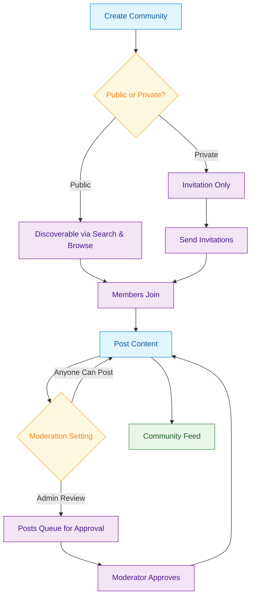

import CreateCommunity from '/snippets/social/communities/create-community.mdx';

<Info>**SDK v7.x** · Last verified March 2026 · iOS · Android · Web · Flutter</Info>

<Accordion title="Speed run — just the code" icon="forward">
```typescript
// 1. Create a community
const { data: community } = await CommunityRepository.createCommunity({
  displayName: 'Gaming Hub', isPublic: true,
  postSetting: CommunityPostSettings.ANYONE_CAN_POST,
});

// 2. Join a community
await CommunityRepository.joinCommunity('communityId');

// 3. Query trending communities
CommunityRepository.getTrendingCommunities(
  { limit: 10 },
  ({ data }) => { /* render */ }
);
```
Full walkthrough below ↓
</Accordion>

Communities are the organizational backbone of social apps. This guide walks through the full lifecycle: create a community, grow its membership, set governance rules, and help users discover it.



## What You'll Build

<CardGroup cols={4}>
  <Card title="Community Lifecycle" icon="circle-plus">
    Create, update, and delete communities with privacy settings, categories, and custom metadata
  </Card>
  <Card title="Membership & Roles" icon="user-gear">
    Join/leave flows, invitation system, role-based permissions (admin, moderator, member)
  </Card>
  <Card title="Content Governance" icon="gavel">
    Post moderation settings, community guidelines, member management
  </Card>
  <Card title="Discovery" icon="compass">
    Trending communities, category browsing, community search
  </Card>
</CardGroup>

<Info>
**Prerequisites**: SDK installed and authenticated → [SDK Setup](/social-plus-sdk/getting-started/overview). By default, all authenticated users can create communities.
</Info>

<Note>
**After completing this guide you'll have:**
- Community creation flow (public and private) with categories
- Member join/leave and role assignment wired up
- Trending and recommended communities discoverable in-app
</Note>

---

## Quick Start: Create a Community

Use `AmityCommunityRepository` to create a community with privacy and moderation settings:

<CreateCommunity />

Full reference → [Create Community](/social-plus-sdk/social/communities-spaces/community-lifecycle/create-community)

---

## Step-by-Step Implementation

<Steps>
  <Step title="Choose community settings">
    Pick the right `postSettings` for your community type before creating it. This controls the entire content governance model.

    | `postSettings` | Who can post | Best for |
    |---|---|---|
    | `ANYONE_CAN_POST` | All members | Open communities |
    | `ADMIN_REVIEW_POST_REQUIRED` | All members, but posts need approval | Curated communities |
    | `ONLY_ADMIN_CAN_POST` | Admins/moderators only | Announcement channels |

    ```typescript TypeScript
    import { CommunityRepository } from '@amityco/ts-sdk';

    const { data: community } = await CommunityRepository.createCommunity({
      displayName: 'My Community',
      isPublic: true,
      postSetting: 'ANYONE_CAN_POST',   // or 'ADMIN_REVIEW_POST_REQUIRED'
    });
    ```

    Full reference → [Create Community](/social-plus-sdk/social/communities-spaces/community-lifecycle/create-community)
  </Step>
  <Step title="Add categories">
    Categorizing communities improves discoverability. Fetch available categories, then set category IDs on creation.

    ```typescript TypeScript
    import { CategoryRepository } from '@amityco/ts-sdk';

    const unsubscriber = CategoryRepository.getCategories(
      {},
      ({ data: categories, loading }) => {
        if (categories) { /* render category picker */ }
      },
    );
    ```

    Full reference → [Community Categories](/social-plus-sdk/social/communities-spaces/organization/community-categories)
  </Step>
  <Step title="Handle membership — join and leave">
    For public communities, join is immediate. For private communities, joining sends a request that moderators can accept or reject.

    ```typescript TypeScript
    import { CommunityRepository } from '@amityco/ts-sdk';

    const unsub = CommunityRepository.getCommunity(communityId, async (response) => {
      const community = response.data;
      await community.join();
      unsub();
    });
    ```

    Full reference → [Join / Leave Community](/social-plus-sdk/social/communities-spaces/organization/join-leave-community)
  </Step>
  <Step title="Manage member roles">
    Promote members to moderator or admin, ban members, or remove them from the community.

    ```typescript TypeScript
    import { CommunityRepository } from '@amityco/ts-sdk';

    await CommunityRepository.Membership.addMembers(communityId, ['userId1', 'userId2']);
    ```

    Full reference → [Member Management](/social-plus-sdk/social/communities-spaces/organization/member-management)
  </Step>
  <Step title="Invite members (private communities)">
    For private communities, invite specific users by their user IDs. Invitees receive a notification and can accept or decline.

    ```typescript TypeScript
    // Send invitations to users
    await community.createInvitations(['userId1', 'userId2']);
    ```

    Full reference → [Community Invitation](/social-plus-sdk/social/communities-spaces/organization/community-invitation)
  </Step>
  <Step title="Discover communities">
    Query trending and recommended communities for an explore page, or browse by category.

    ```typescript TypeScript
    import { CommunityRepository } from '@amityco/ts-sdk';

    const unsubscriber = CommunityRepository.getTrendingCommunities(
      { limit: 5 },
      ({ data: communities, loading }) => {
        if (communities) { /* render trending section */ }
      },
    );
    ```

    Full reference → [Trending & Recommended Communities](/social-plus-sdk/social/communities-spaces/discovery/trending-and-recommended-communities) · [Query Communities](/social-plus-sdk/social/communities-spaces/discovery/query-communities)
  </Step>
</Steps>

---

## 🔗 Connect to Moderation & Analytics

<AccordionGroup>
  <Accordion title="Admin Console: community management" icon="shield">
    The Admin Console gives moderators a full view of every community: member lists, post queues (when `ADMIN_REVIEW_POST_REQUIRED` is set), banned users, and community settings.

    → [Admin Console: Social Management](/analytics-and-moderation/console/management/overview)
  </Accordion>
  <Accordion title="Webhook: community events" icon="webhook">
    Subscribe to `community.created`, `member.joined`, `member.left`, and `post.flagged` webhook events to sync community state with your own backend or trigger automation.

    → [Webhook Events](/analytics-and-moderation/social+-apis-and-services/webhook-event)
  </Accordion>
  <Accordion title="Push notifications: community activity" icon="bell">
    Subscribe users to community push notifications so they're alerted when new posts are approved or when they're mentioned.

    → [Community Notification Settings](/social-plus-sdk/core-concepts/realtime-communication/push-notifications/settings/community-settings)
  </Accordion>
</AccordionGroup>

---

## Common Mistakes

<Warning>
**Creating communities without setting `postSetting`** — If you omit `postSetting`, the default may prevent regular members from posting. Always specify `ANYONE_CAN_POST` or `ADMIN_REVIEW_POST_REQUIRED` explicitly.
</Warning>

<Warning>
**Joining private communities without handling the pending state** — `joinCommunity` on a private community returns a pending request, not immediate membership. Your UI should show a "Request Sent" state instead of community content.
</Warning>

<Warning>
**Querying communities without `filter`** — Without a filter, `getCommunities` returns all communities including ones the user isn't a member of. Use `filter: 'member'` when building "My Communities" views.
</Warning>

## Best Practices

<AccordionGroup>
  <Accordion title="Privacy & governance" icon="shield-check">
    - Default new communities to **public** unless your use case requires private — discoverability drives growth
    - Use `ADMIN_REVIEW_POST_REQUIRED` for communities with compliance requirements (e.g., healthcare, finance)
    - Define clear community guidelines and surface them during the join flow
    - Assign at least two moderators per community to avoid single-point-of-failure moderation
  </Accordion>
  <Accordion title="Performance" icon="gauge">
    - Cache category lists — they change infrequently
    - Paginate member queries (`queryMembers`) with a reasonable page size (20-50)
    - Use Live Collections for member counts so they update in real-time without manual refresh
  </Accordion>
  <Accordion title="User experience" icon="heart">
    - Show the member count and post count on community cards to signal activity level
    - Surface trending communities on the home screen to drive initial engagement
    - Send an in-app notification when a private community approves a join request
  </Accordion>
</AccordionGroup>

---

## Next Steps

<Card
  title="Your next step → Roles, Permissions & Governance"
  icon="arrow-right"
  href="/use-cases/social/roles-permissions-and-governance"
>
  Communities are live — now set up moderator roles, post review gating, and ban management.
</Card>

Or explore related guides:

<CardGroup cols={3}>
  <Card title="Build a Social Feed" href="/use-cases/social/build-a-social-feed" icon="rectangle-list">
    Query and render the community feed
  </Card>
  <Card title="Rich Content Creation" href="/use-cases/social/rich-content-creation" icon="pen-to-square">
    Let community members create posts
  </Card>
  <Card title="Content Moderation Pipeline" href="/use-cases/social/content-moderation-pipeline" icon="shield-check">
    Set up moderation for community content
  </Card>
</CardGroup>
