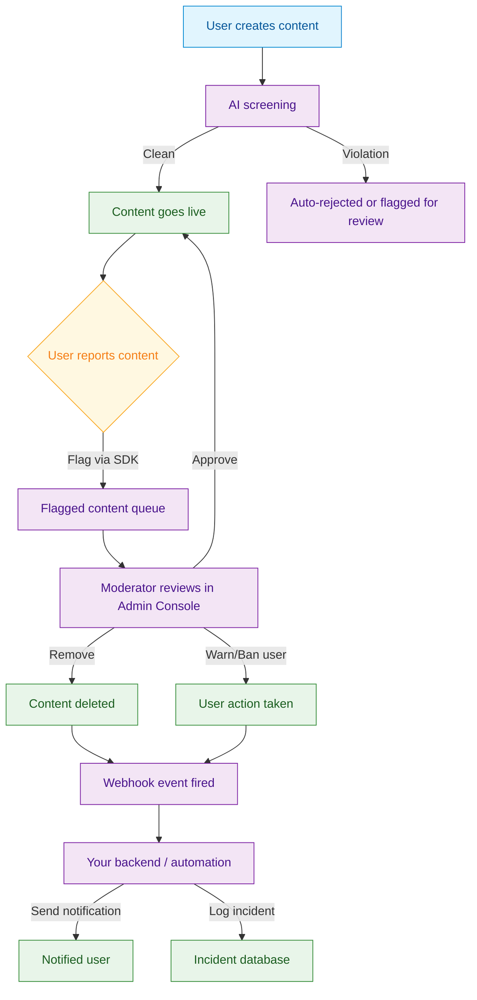
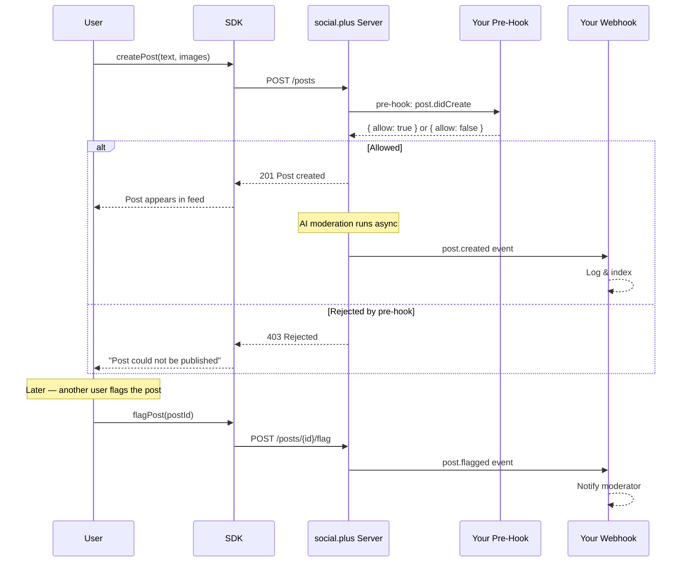

<Info>**SDK v7.x** · Last verified March 2026 · iOS · Android · Web · Flutter</Info>

<Accordion title="Speed run — just the code" icon="forward">
```typescript
// 1. Flag a post
await PostRepository.flagPost('postId', 'spam');

// 2. Unflag a post
await PostRepository.unflagPost('postId');

// 3. Flag a comment
await CommentRepository.flagComment('commentId', 'harassment');

// 4. Flag a user
await UserRepository.flagUser('userId', 'impersonation');
```
Full walkthrough below ↓
</Accordion>

<Tip>
**Platform note** — code samples below use TypeScript. Every method has an equivalent in the iOS (Swift), Android (Kotlin), and Flutter (Dart) SDKs — see the linked SDK reference in each step.
</Tip>

At scale, manual moderation doesn't work. This guide shows how all the moderation pieces connect — from users flagging content in the SDK, to AI auto-screening, to moderators reviewing in the Admin Console, to webhooks triggering automated responses.



## What You'll Connect

<CardGroup cols={4}>
  <Card title="SDK Flagging" icon="flag">
    Users report posts, comments, and other users directly from the SDK
  </Card>
  <Card title="Admin Console Review" icon="shield-check">
    Moderators review flagged content, user reports, and post queues in the console
  </Card>
  <Card title="AI Content Moderation" icon="robot">
    Automatic text and image screening with configurable policy enforcement
  </Card>
  <Card title="Webhooks & Automation" icon="webhook">
    Receive real-time events when content is flagged or actioned to trigger your backend
  </Card>
</CardGroup>

<Info>
**Prerequisites**: SDK installed with authenticated users, Admin Console access for moderator configuration, and a server endpoint to receive webhook events.

**Also recommended:** Complete [Rich Content Creation](/use-cases/social/rich-content-creation) and [Community Platform](/use-cases/social/community-platform) first — you need content and communities to moderate.
</Info>

<Note>
**After completing this guide you'll have:**
- User-side flag/unflag implemented for posts and comments
- Admin Console moderation review queue receiving flagged content
- An AI moderation rule set configured with at least one auto-action
- A webhook handler receiving moderation events for downstream automation
</Note>

import FlagPost from '/snippets/social/moderation/flag-post.mdx';

---

## Layer 1: SDK — User Flagging

Let users flag content they find inappropriate. Flagged content enters a moderation queue. The SDK provides methods to flag posts, comments, and users.

### Quick Start: Flag a Post

<FlagPost />

Full reference → [Content Flagging](/social-plus-sdk/social/content-management/moderation/content-flagging)

---

## Layer 2: AI Content Moderation

Configure automatic content screening in the Admin Console. AI moderation runs before content goes live.

<Steps>
  <Step title="Enable AI moderation in the Admin Console">
    Navigate to **Admin Console → Settings → AI Content Moderation**.

    - **Text moderation**: Screen post text and comments for policy violations (hate speech, spam, explicit content, etc.)
    - **Image moderation**: Screen uploaded images for nudity, violence, and other violations
    - **Auto-action**: Configure whether violations are auto-rejected or flagged for human review

    → [AI Content Moderation](/analytics-and-moderation/console/ai-content-moderation)
  </Step>
  <Step title="Configure pre-hook events (optional)">
    Pre-hook events let your server intercept content before it's published. Your endpoint receives the content, evaluates it, and returns an allow/deny decision.

    ```javascript Node.js pre-hook handler
    const express = require('express');
    const app = express();
    app.use(express.json());

    app.post('/pre-hook', (req, res) => {
      const { event, data } = req.body;

      if (event === 'post.didCreate') {
        const { text } = data;
        const isAllowed = runCustomContentPolicy(text);

        if (!isAllowed) {
          // Reject the post
          return res.status(200).json({ allow: false });
        }
      }

      // Allow all other content
      res.status(200).json({ allow: true });
    });
    ```

    → [Pre-Hook Events](/analytics-and-moderation/social+-apis-and-services/pre-hook-event)
  </Step>
</Steps>

---

## Layer 3: Admin Console — Human Review

Flagged content and AI-held content lands in the Admin Console review queues. The **Posts and comments management** page shows every post with its AI moderation status inline — making it fast to spot, review, and action flagged content.

<Frame caption="Admin Console — Posts & comments management page with inline AI moderation status badges">
  
</Frame>

<Steps>
  <Step title="Review flagged content">
    - **Admin Console → Content Moderation → Flagged Content**: Posts, comments, and stories flagged by users
    - Each item shows: content, reporter, flag reason, and action buttons (approve, remove, warn user)
    - Bulk actions available for high-volume queues

    → [Admin Console: Content Moderation](/analytics-and-moderation/console/moderation/overview)
  </Step>
  <Step title="Manage post review queues">
    For communities using `ADMIN_REVIEW_POST_REQUIRED`, new posts land in a review queue:
    - **Admin Console → Social Management → Posts**: Review pending posts
    - Approve → post goes live; Reject → post removed

    → [Post Review](/social-plus-sdk/social/content-management/posts/moderation/post-review)
  </Step>
  <Step title="Assign moderator roles">
    Give community moderators access to their community's moderation queue without granting full admin access:

    - **Admin Console → Admin Access Control → Roles**: Create community moderator roles
    - Assign users to roles per community

    → [Roles & Privileges](/analytics-and-moderation/console/moderation/roles-and-privileges)
  </Step>
</Steps>

---

## Layer 4: Webhooks — Automation

Receive real-time events when content is actioned to trigger downstream workflows.



<Steps>
  <Step title="Register your webhook endpoint">
    In **Admin Console → Settings → Integrations → Webhooks**, register your endpoint URL and select which events to subscribe to.

    → [Admin Console: Integrations](/analytics-and-moderation/console/settings/)
  </Step>
  <Step title="Implement secure webhook handling">
    Always verify the webhook signature before processing:

    ```javascript Node.js
    const crypto = require('crypto');
    const express = require('express');
    const app = express();

    app.use('/webhook', express.raw({ type: 'application/json' }));

    app.post('/webhook', (req, res) => {
      const signature = req.headers['x-amity-signature'];
      const secret = process.env.WEBHOOK_SECRET;

      const expectedSig = crypto
        .createHmac('sha256', secret)
        .update(req.body)
        .digest('hex');

      if (!crypto.timingSafeEqual(
        Buffer.from(signature, 'hex'),
        Buffer.from(expectedSig, 'hex')
      )) {
        return res.status(401).json({ error: 'Invalid signature' });
      }

      const event = JSON.parse(req.body);
      handleModerationEvent(event);

      res.status(200).json({ received: true });
    });
    ```
  </Step>
  <Step title="Handle moderation events">
    Key moderation webhook events to subscribe to:

    | Event | Trigger | Common action |
    |---|---|---|
    | `post.flagged` | User flags a post | Notify moderator, log incident |
    | `post.deleted` | Post removed by moderator | Notify author, log |
    | `comment.flagged` | User flags a comment | Notify moderator |
    | `user.banned` | User banned from community | Revoke access in your system |
    | `community.post.approved` | Post approved in review queue | Notify author |

    ```javascript Node.js
    function handleModerationEvent(event) {
      switch (event.event) {
        case 'post.flagged':
          notifyModerationTeam(event.data);
          logIncident({ type: 'flag', content: event.data });
          break;
        case 'user.banned':
          revokeUserAccess(event.data.userId);
          notifyUser(event.data.userId, 'community-ban');
          break;
        case 'post.deleted':
          notifyAuthor(event.data.userId, 'post-removed');
          break;
      }
    }
    ```

    → [Webhook Events Reference](/analytics-and-moderation/social+-apis-and-services/webhook-event)
  </Step>
</Steps>

---

## Common Mistakes

<Warning>
**Exposing moderation status to content authors** — Telling a user their post was "flagged" or "under review" can encourage them to create alt accounts. Show the content normally to the author while hiding it from others (shadow moderation).
</Warning>

<Warning>
**Skipping webhook signature verification** — Moderation webhooks trigger automated actions (bans, deletions). Without signature verification, an attacker could send fake webhook payloads to your endpoint.
</Warning>

<Warning>
**Auto-deleting all AI-flagged content** — AI moderation produces false positives. Use AI to queue content for human review, not to delete automatically. Reserve auto-actions only for high-confidence categories like CSAM.
</Warning>

## Best Practices

<AccordionGroup>
  <Accordion title="Tiered moderation strategy" icon="layer-group">
    Run three complementary layers for best coverage:
    1. **Pre-publish AI screening** — catches obvious violations before content is visible
    2. **Community self-moderation** — users flag what AI misses
    3. **Human moderator review** — maintains context and handles edge cases
    
    Avoid relying on any single layer alone.
  </Accordion>
  <Accordion title="Webhook reliability" icon="rotate">
    - Return `200 OK` quickly and process events asynchronously — slow responses cause webhook retries
    - Implement idempotent handlers — webhooks may be delivered more than once
    - Log all received events before processing so you can replay them if your handler fails
    - Set up a dead-letter queue for events that fail processing
  </Accordion>
  <Accordion title="Moderator experience" icon="shield">
    - Set up role-based access so community moderators only see their community's queue
    - Define clear escalation paths: community moderator → admin → legal
    - Log all moderator actions with reason codes for audit trails
    - Provide moderators with appeal management tools for banned users
  </Accordion>
  <Accordion title="User communication" icon="comment">
    - Always notify users when their content is removed — explain why and link to guidelines
    - Provide an appeal process for content removal decisions
    - Show a submission confirmation to users who flag content so they know it was received
  </Accordion>
</AccordionGroup>

---

## Next Steps

<Card
  title="Your next step → Roles, Permissions & Governance"
  icon="arrow-right"
  href="/use-cases/social/roles-permissions-and-governance"
>
  Moderation is active — now set up community roles and permission gates for fine-grained governance.
</Card>

Or explore related guides:

<CardGroup cols={3}>
  <Card title="Rich Content Creation" href="/use-cases/social/rich-content-creation" icon="pen-to-square">
    Understand how posts feed into the moderation pipeline
  </Card>
  <Card title="Community Platform" href="/use-cases/social/community-platform" icon="users">
    Configure post moderation settings per community
  </Card>
  <Card title="Notifications & Engagement" href="/use-cases/social/notifications-and-engagement" icon="bell">
    Notify users of moderation actions via push or in-app
  </Card>
</CardGroup>
