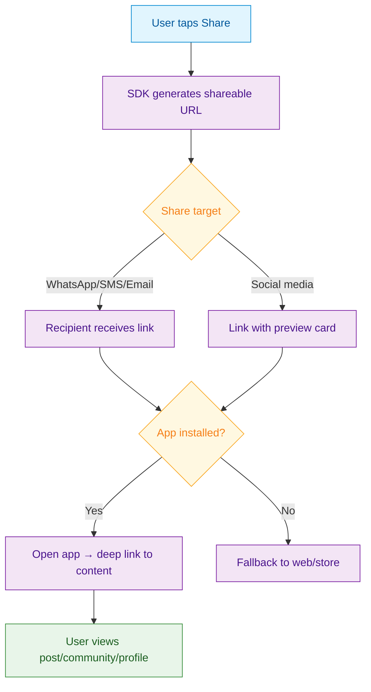

<Info>**SDK v7.x** · Last verified March 2026 · iOS · Android · Web · Flutter</Info>

<Accordion title="Speed run — just the code" icon="forward">
```typescript
// 1. Get share link configuration
const config = await Client.getShareableLinkConfiguration();

// 2. Build a share URL for a post
const shareUrl = `${config.baseUrl}/post/${postId}`;

// 3. Handle incoming deep link
Client.handleDeepLink(incomingUrl, (resolved) => {
  if (resolved.type === 'post') navigateToPost(resolved.postId);
  if (resolved.type === 'community') navigateToCommunity(resolved.communityId);
});
```
Full walkthrough below ↓
</Accordion>

Shareable links turn your users into a growth engine. When a user shares a post or community to WhatsApp, Twitter, or SMS, the recipient can tap straight into your app. This guide covers generating share URLs from the SDK, configuring link patterns in the console, and handling incoming deep links.



## What You'll Build

<CardGroup cols={4}>
  <Card title="Shareable Link Generation" icon="link">
    Generate platform-aware share URLs for posts, communities, user profiles, and livestreams
  </Card>
  <Card title="Link Configuration" icon="gear">
    Configure custom domain and URL patterns from the Admin Console
  </Card>
  <Card title="Deep Link Handling" icon="arrow-up-right-from-square">
    Parse incoming links to navigate users to the correct content in your app
  </Card>
  <Card title="Share Sheet Integration" icon="share-from-square">
    Wire up native share sheets on iOS, Android, and web with the generated URLs
  </Card>
</CardGroup>

<Info>
**Prerequisites**: SDK installed and authenticated → [SDK Setup](/social-plus-sdk/getting-started/overview). Shareable links must be configured in **Admin Console → Settings → Shareable Links** (custom domain is optional).
</Info>

<Note>
**After completing this guide you'll have:**
- Shareable URLs generated for posts, communities, and user profiles
- Deep link routing that opens your app directly to the target content
- Share sheet integration for native OS sharing on iOS, Android, and Web
</Note>

---

## Quick Start: Generate a Shareable Link

```typescript TypeScript
import { Client } from '@amityco/ts-sdk';

const getPostShareLink = async (postId: string) => {
  const config = await Client.getShareableLinkConfiguration();
  const { domain, patterns } = config;
  const postLink = domain + patterns.post.replace('{postId}', postId);
  return postLink;
};

// Returns: "https://your-domain.com/posts/post-123"
```

Full reference → [Content Sharing](/social-plus-sdk/social/content-management/content-sharing)

<Note>
**Shareable links vs. in-app reposts**: This guide covers *external* shareable links — URLs for WhatsApp, SMS, or social media that open your app via deep link. social.plus also has a distinct *in-app repost* mechanism: when a user reshares a post inside the app, the new post stores the original's ID in `sharedPostId` and increments `sharedCount` on the original post. Use shareable links for viral distribution outside the app; use the repost API for in-feed resharing within the app.
</Note>

---

## Step-by-Step Implementation

<Steps>
  <Step title="Get the shareable link configuration">
    The SDK fetches your configured domain and URL patterns from the server. Call this once and cache the result — it rarely changes.

    ```typescript TypeScript
    import { Client } from '@amityco/ts-sdk';

    const config = await Client.getShareableLinkConfiguration();
    // config.domain = "https://your-app.com"
    // config.patterns.post = "/posts/{postId}"
    // config.patterns.community = "/communities/{communityId}"
    ```

    Full reference → [Content Sharing](/social-plus-sdk/social/content-management/content-sharing)
  </Step>
  <Step title="Generate links for different content types">
    Use the pattern templates to construct URLs for posts, communities, and user profiles.

    ```typescript TypeScript
    const { domain, patterns } = config;

    // Post link
    const postLink = domain + patterns.post.replace('{postId}', postId);

    // Community link
    const communityLink = domain + patterns.community.replace('{communityId}', communityId);

    // User profile link
    const userLink = domain + patterns.user.replace('{userId}', userId);
    ```

    Full reference → [Content Sharing](/social-plus-sdk/social/content-management/content-sharing)
  </Step>
  <Step title="Wire up the native share sheet">
    Pass the generated URL to the platform's native share API. On web, use the Web Share API with a clipboard fallback.

    ```typescript TypeScript
    // Web Share API
    if (navigator.share) {
      await navigator.share({
        title: post.data.text?.substring(0, 50),
        url: postLink,
      });
    } else {
      // Fallback: copy to clipboard
      await navigator.clipboard.writeText(postLink);
      showToast('Link copied!');
    }
    ```
  </Step>
  <Step title="Handle incoming deep links">
    When your app opens from a shared link, parse the URL and navigate to the right screen. Match against the same patterns from the configuration.

    ```typescript TypeScript
    const handleDeepLink = (url: string) => {
      const postMatch = url.match(/\/posts\/([^/]+)/);
      if (postMatch) {
        navigateToPost(postMatch[1]);
        return;
      }
      const communityMatch = url.match(/\/communities\/([^/]+)/);
      if (communityMatch) {
        navigateToCommunity(communityMatch[1]);
        return;
      }
    };
    ```
  </Step>
  <Step title="Configure shareable links in the Admin Console">
    Set up your custom domain and URL patterns in **Admin Console → Settings → Shareable Links**:
    - **Domain**: Your app's domain (e.g., `https://your-app.com`)
    - **Post pattern**: `/posts/{postId}`
    - **Community pattern**: `/communities/{communityId}`
    - **User pattern**: `/users/{userId}`

    These patterns are served to the SDK via `getShareableLinkConfiguration()`.
  </Step>
</Steps>

---

## 🔗 Connect to Moderation & Analytics

<AccordionGroup>
  <Accordion title="Share analytics" icon="chart-bar">
    Track which posts and communities generate the most shares. Combine share events with impression data in **Admin Console → Analytics Dashboard** to measure viral coefficient.
  </Accordion>
  <Accordion title="Private content protection" icon="lock">
    Links to private community content should only work for authenticated users who are members. Visitors landing on a private community link should see a "Request to join" prompt, not the content.
  </Accordion>
  <Accordion title="Flagged content links" icon="flag">
    If a shared post is later removed by moderators, the link should show a "Content unavailable" message rather than a 404. Handle this gracefully in your deep link handler.
  </Accordion>
</AccordionGroup>

---

## Common Mistakes

<Warning>
**Exposing internal object IDs in share URLs** — Use the SDK's shareable link configuration to generate safe, user-facing URLs instead of constructing them manually with raw IDs.
</Warning>

<Warning>
**Not testing deep links on all platforms** — iOS Universal Links, Android App Links, and web fallbacks all have different requirements. Test the full flow on each platform — especially the "app not installed" case.
</Warning>

<Warning>
**Skipping deep link verification** — Always validate the incoming deep link format before navigating. Malformed or tampered URLs should redirect to a safe fallback, not crash the app.
</Warning>

## Best Practices

<AccordionGroup>
  <Accordion title="Growth optimization" icon="chart-line">
    - Add Open Graph meta tags to your web fallback pages so shared links show rich previews on social media
    - Use UTM parameters on share links to track which channels drive the most installs
    - Cache `getShareableLinkConfiguration()` at app startup — it only needs to refresh once per session
    - Show a share count on posts to create social proof and encourage more sharing
  </Accordion>
  <Accordion title="Deep link reliability" icon="link">
    - Always implement a web fallback for users who don't have the app installed
    - Handle edge cases: deleted content, private content the user can't access, expired links
    - Test deep links on both iOS Universal Links and Android App Links — each platform has different setup requirements
    - Log failed deep link navigations to catch broken patterns early
  </Accordion>
  <Accordion title="User experience" icon="heart">
    - Pre-compose the share text with the post's first 50 characters + the link
    - Show a "Copied!" toast when the clipboard fallback fires
    - On mobile, use the native share sheet (iOS `UIActivityViewController`, Android `Intent.createChooser`) for the best experience
  </Accordion>
</AccordionGroup>

---

## Next Steps

<Card
  title="Your next step → Post Impressions & Creator Analytics"
  icon="arrow-right"
  href="/use-cases/social/post-impressions-and-creator-analytics"
>
  Content is shareable — now track who's viewing it with impression analytics and reach metrics.
</Card>

Or explore related guides:

<CardGroup cols={3}>
  <Card title="User Onboarding & Visitor Mode" href="/use-cases/social/user-onboarding-and-visitor-mode" icon="right-to-bracket">
    Handle visitors who arrive via shared links
  </Card>
  <Card title="Build a Social Feed" href="/use-cases/social/build-a-social-feed" icon="rectangle-list">
    Build the feed that shared links navigate to
  </Card>
  <Card title="Community Platform" href="/use-cases/social/community-platform" icon="users">
    Create the communities that users share
  </Card>
</CardGroup>
