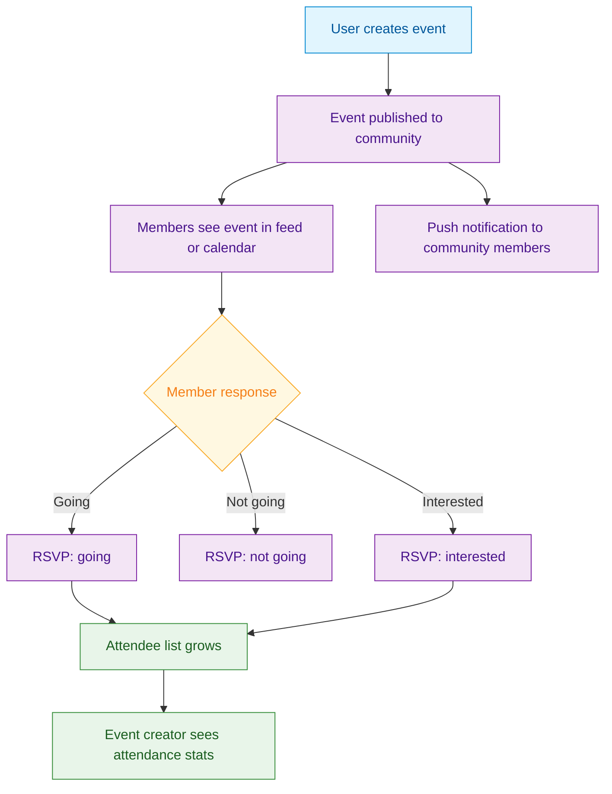

<Info>**SDK v7.x** · Last verified March 2026 · iOS · Android · Web · Flutter</Info>

<Accordion title="Speed run — just the code" icon="forward">
```typescript
// 1. Create an event
const { data: event } = await EventRepository.createEvent({
  title: 'Community Meetup', description: 'Monthly gathering',
  startDate: '2026-04-01T18:00:00Z', endDate: '2026-04-01T20:00:00Z',
  targetType: 'community', targetId: 'communityId',
});

// 2. RSVP
await EventRepository.rsvpEvent(event.eventId, 'going');

// 3. Query upcoming events
EventRepository.getEvents({ status: 'upcoming', limit: 10 },
  ({ data }) => { /* render */ }
);
```
Full walkthrough below ↓
</Accordion>

<Tip>
**Platform note** — code samples below use TypeScript. Every method has an equivalent in the iOS (Swift), Android (Kotlin), and Flutter (Dart) SDKs — see the linked SDK reference in each step.
</Tip>

Events give communities and users a way to organize real-world and virtual activities. This guide covers creating events, managing RSVPs, querying attendees, and building an event discovery experience.



<Info>
**Prerequisites**: SDK installed and authenticated. A `communityId` is required — events are always attached to a community.

**Also recommended:** Complete [Community Platform](/use-cases/social/community-platform) first — events live inside communities.
</Info>

<Note>
**After completing this guide you'll have:**
- Event creation with title, description, date/time, and location
- RSVP (going / not going) flow with attendee list
- Events discoverable in community feeds and a dedicated events list
</Note>

import CreateEvent from '/snippets/social/events/create-event.mdx';

---

## Quick Start: Create an Event

<CreateEvent />

---

## Step-by-Step Implementation

<Steps>
  <Step title="Query events in a community">
    Query events for a specific community, filtered by status and sort order. Results are returned as a live collection.

    ```typescript TypeScript
    import { EventRepository, AmityEventOriginType, AmityEventSortOption, AmityEventOrderOption } from '@amityco/ts-sdk';

    const unsubscribe = EventRepository.getEvents(
      {
        originType: AmityEventOriginType.Community,
        originId: 'community-123',
        sortBy: AmityEventSortOption.StartTime,
        orderBy: AmityEventOrderOption.Ascending,
      },
      ({ data: events, loading }) => {
        if (events) {
          events.forEach(event => console.log(event.title, event.startTime));
        }
      },
    );
    ```

    Full reference → [Manage Events](/social-plus-sdk/social/events/manage-events)
  </Step>
  <Step title="RSVP to an event">
    Let users respond with `going`, `not_going`, or `interested`. Users can change their RSVP at any time before the event starts.

    ```typescript TypeScript
    import { EventRepository, AmityEventResponseStatus } from '@amityco/ts-sdk';

    const unsubscribe = EventRepository.getEvent(
      'event-123',
      async ({ data: event }) => {
        if (event) {
          const rsvp = await event.createRSVP(AmityEventResponseStatus.Going);
          console.log('RSVP:', rsvp?.status);
        }
      },
    );
    ```

    Full reference → [Event RSVP](/social-plus-sdk/social/events/event-rsvp)
  </Step>
  <Step title="Query event attendees">
    Query the list of attendees filtered by RSVP status. Use this to show who's going, display an attendee count, or build an attendee list screen.

    ```typescript TypeScript
    import { EventRepository, AmityEventResponseStatus } from '@amityco/ts-sdk';

    const unsubscribe = EventRepository.getEvent('event-123', ({ data: event }) => {
      if (event) {
        event.getRSVPs(
          { status: AmityEventResponseStatus.Going },
          ({ data: responses }) => {
            if (responses) {
              responses.forEach(rsvp => console.log('Attendee:', rsvp.user?.displayName));
            }
          },
        );
      }
    });
    ```

    Full reference → [Event RSVP](/social-plus-sdk/social/events/event-rsvp)
  </Step>
  <Step title="Update and delete events">
    Event creators and community moderators can update event details (title, description, time, location) or delete events entirely.

    ```typescript TypeScript
    import { EventRepository } from '@amityco/ts-sdk';

    // Update an event
    const { data: updated } = await EventRepository.updateEvent('event-123', {
      title: 'Updated Event Title',
      description: 'New details for the event',
      startTime: '2025-04-20T15:00:00Z',
    });

    // Delete an event
    await EventRepository.deleteEvent('event-123');
    ```

    Full reference → [Manage Events](/social-plus-sdk/social/events/manage-events)
  </Step>
</Steps>

---

## Connect to Moderation & Analytics

<Frame caption="Admin Console — Events management page with event list and status overview">
  
</Frame>

<AccordionGroup>
  <Accordion title="Event management in Admin Console" icon="shield">
    Moderators can view and manage all events across communities in **Admin Console → Management → Events**. This includes editing event details, cancelling events, and removing inappropriate events.

    → [Admin Console: Events Management](/analytics-and-moderation/console/management/overview)
  </Accordion>
  <Accordion title="Webhook: event RSVPs" icon="webhook">
    Receive `event.rsvp.created` and `event.rsvp.updated` webhook events to sync attendance data with an external calendar system or CRM.

    → [Webhook Events](/analytics-and-moderation/social+-apis-and-services/webhook-event)
  </Accordion>
  <Accordion title="Push notification: event reminders" icon="bell">
    Use webhooks to send reminder push notifications to RSVP'd attendees before an event starts. Trigger this from your backend when `event.startAt - 24h` is reached.
  </Accordion>
</AccordionGroup>

---

## Common Mistakes

<Warning>
**Creating events without an end date** — Events without `endDate` appear as ongoing indefinitely. Always set both `startDate` and `endDate` for a clear timeline.
</Warning>

<Warning>
**Displaying event times without timezone conversion** — The API stores dates in UTC. Always convert to the user's local timezone before rendering, or display the timezone label.

```typescript
// ❌ Bad — raw UTC string
<span>{event.startDate}</span>

// ✅ Good — localized
<span>{new Date(event.startDate).toLocaleString()}</span>
```
</Warning>

<Warning>
**Not refreshing RSVP counts after changes** — After a user RSVPs, other attendees' counts are stale. Use Live Collections or re-query after RSVP actions to keep counts accurate.
</Warning>

## Best Practices

<AccordionGroup>
  <Accordion title="Event discovery UX" icon="calendar-days">
    - Show upcoming events prominently in the community feed — pin an event post in the week before it starts
    - Add filtering: "This week", "This month", "Past events"
    - Show a map preview for in-person events with a location field
    - Display the RSVP counts prominently ("42 going · 18 interested") to create social proof
  </Accordion>
  <Accordion title="RSVP workflow" icon="circle-check">
    - Send a confirmation in-app notification when a user RSVPs to an event
    - Allow users to change their RSVP up until the event starts
    - Send a reminder push notification 24h and 1h before the event to "going" attendees
    - After the event ends, ask attendees to leave a review or reaction
  </Accordion>
  <Accordion title="Timezone handling" icon="clock">
    - Always store event times in UTC and convert to local time for display
    - Show the timezone explicitly on event details (e.g., "3:00 PM PDT") to avoid confusion
    - For virtual events, show the time in both the creator's and viewer's timezone
  </Accordion>
</AccordionGroup>

---

<Tip>
**Dive deeper**: [Events API Reference](/social-plus-sdk/social/events/overview) has full parameter tables, method signatures, and platform-specific details for every API used in this guide.
</Tip>

## Next Steps

<Card
  title="Your next step → Notifications & Engagement"
  icon="arrow-right"
  href="/use-cases/social/notifications-and-engagement"
>
  Events are live — now set up notifications so members get alerted about new events and RSVP reminders.
</Card>

Or explore related guides:

<CardGroup cols={3}>
  <Card title="Community Platform" href="/use-cases/social/community-platform" icon="users">
    Events are typically hosted within communities
  </Card>
  <Card title="Notifications & Engagement" href="/use-cases/social/notifications-and-engagement" icon="bell">
    Send event reminders and RSVP notifications
  </Card>
  <Card title="Build a Social Feed" href="/use-cases/social/build-a-social-feed" icon="rectangle-list">
    Surface upcoming events in the community feed
  </Card>
</CardGroup>
