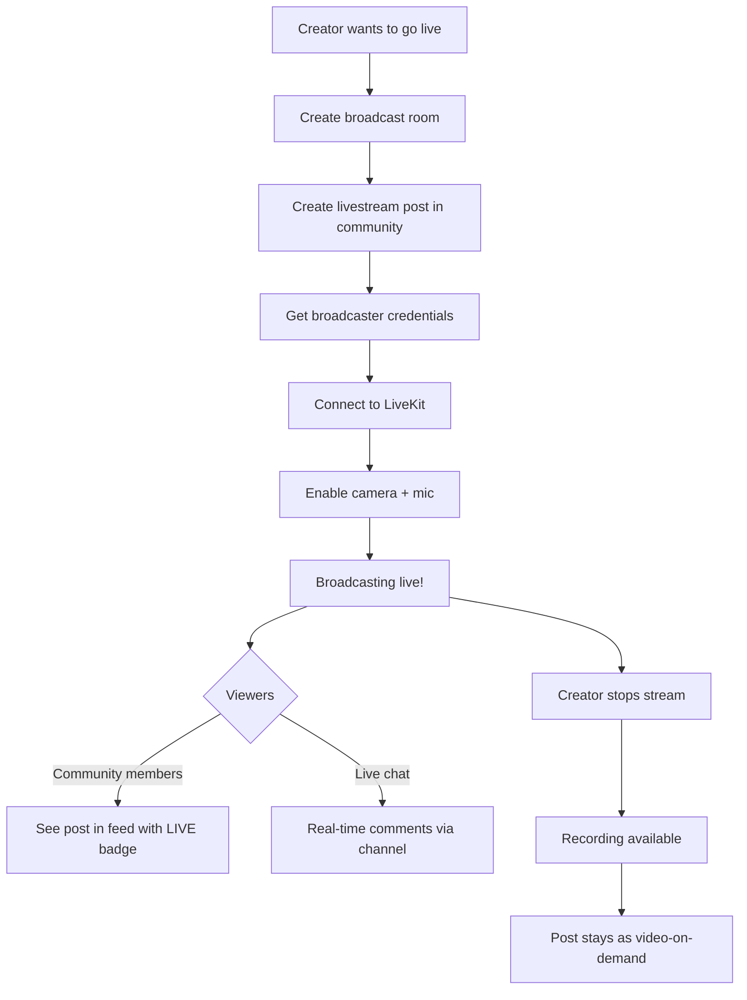

# Livestream & Video Posts

<Info>**SDK v6.x** · Last verified March 2026 · iOS · Android · Web · Flutter</Info>

<Accordion title="Speed run — just the code" icon="forward">
```typescript
// 1. Create a broadcast room
const { data: room } = await roomRepository.createRoom({
  displayName: 'Friday AMA',
  targetType: 'community', targetId: 'communityId',
  channelEnabled: true, // auto-creates live chat
});

// 2. Publish a livestream post
await PostRepository.createPost({
  targetType: 'community', targetId: 'communityId',
  dataType: 'livestream',
  data: { streamId: room.roomId },
});

// 3. Query live rooms
roomRepository.getRooms({ statuses: ['live'], limit: 10 },
  ({ data }) => { renderLiveNow(data); }
);

// 4. End the broadcast
await roomRepository.endRoom(room.roomId);
```
Full walkthrough below ↓
</Accordion>

Livestreaming turns passive content consumers into real-time participants. social.plus provides a full livestream stack: create broadcast rooms, connect to LiveKit for video, publish livestream posts to community feeds, and manage recordings. This guide walks through the end-to-end flow.



## What You'll Build

<CardGroup cols={4}>
  <Card title="Broadcast Rooms" icon="video">
    Create and manage broadcast rooms with co-hosting support and live chat channels
  </Card>
  <Card title="Livestream Posts" icon="tower-broadcast">
    Publish live video to community feeds with a "LIVE" badge and real-time viewer count
  </Card>
  <Card title="Broadcasting" icon="camera">
    Connect to LiveKit, enable camera/mic, and manage the broadcast lifecycle
  </Card>
  <Card title="Recordings" icon="circle-play">
    Access recorded streams for video-on-demand playback after the broadcast ends
  </Card>
</CardGroup>

<Info>
**Prerequisites**: SDK installed and authenticated → [SDK Setup](/social-plus-sdk/getting-started/overview). Also required: Video SDK configured → [Video Getting Started](/social-plus-sdk/video-new/getting-started/), `livekit-client` npm package installed, and a `communityId` to host the broadcast room.

**Also recommended:** Complete [Community Platform](/use-cases/social/community-platform) first — broadcast rooms are hosted inside communities.
</Info>

<Warning>
**Rooms are community-only.** Broadcast rooms can only target communities — `Room.targetType` is always `"community"`. You cannot create a room directly on a user profile. If you want to surface a livestream on a user's profile feed, create the room inside a community and then publish the livestream post to the user feed separately.
</Warning>

<Note>
**After completing this guide you'll have:**
- A live broadcast room created inside a community with host and viewer flows
- Co-host invitation and live chat running during the stream
- Recordings accessible after the stream ends with playback wired up
</Note>

---

## Quick Start: Create a Broadcast Room

```typescript TypeScript
const room = await roomRepository.createRoom({
  title: 'Product Launch Event',
  description: 'Join us for the unveiling of our latest features',
  thumbnailFileId: null,
  metadata: null,
  channelEnabled: true,
  parentRoomId: null,
});
console.log('Room created:', room.roomId);
```

Full reference → [Create Room](/social-plus-sdk/video-new/broadcasting/create-room)

---

## Step-by-Step Implementation

<Steps>
  <Step title="Create a broadcast room">
    A room is the container for a livestream session. Set `channelEnabled: true` to automatically create a live chat channel for viewer comments.

    ```typescript TypeScript
    const room = await roomRepository.createRoom({
      title: 'Weekly Q&A Session',
      description: 'Ask us anything about our product',
      thumbnailFileId: null,
      metadata: { category: 'education' },
      channelEnabled: true,
      parentRoomId: null,
    });
    ```

    Full reference → [Create Room](/social-plus-sdk/video-new/broadcasting/create-room)
  </Step>
  <Step title="Create a livestream post in the community">
    Publish a livestream post that appears in the community feed with a "LIVE" badge. Link it to the broadcast room.

    ```typescript TypeScript
    import { PostRepository, PostContentType } from '@amityco/ts-sdk';

    const { data: post } = await PostRepository.createPost({
      dataType: PostContentType.LIVESTREAM,
      targetType: 'community',
      targetId: communityId,
      data: { text: 'We are live! Join the Q&A session', streamId: room.roomId },
    });
    ```

    Full reference → [Live Stream Post](/social-plus-sdk/social/content-management/posts/creation/live-stream-post)
  </Step>
  <Step title="Get broadcaster credentials">
    Fetch the LiveKit connection credentials (URL + token) from the room. These are needed to connect the broadcaster's camera and microphone.

    ```typescript TypeScript
    import { RoomRepository } from '@amityco/ts-sdk';

    const broadcastData = await RoomRepository.getBroadcastData(room.roomId);
    // broadcastData.coHostUrl — LiveKit server URL
    // broadcastData.coHostToken — Authentication token
    ```

    Full reference → [Start Broadcasting](/social-plus-sdk/video-new/broadcasting/start-broadcasting)
  </Step>
  <Step title="Connect to LiveKit and go live">
    Use the LiveKit client SDK to connect, then enable camera and microphone to start broadcasting.

    ```typescript TypeScript
    import { Room as LiveKitRoom, RoomEvent } from 'livekit-client';

    const liveKitRoom = new LiveKitRoom();

    liveKitRoom.on(RoomEvent.Connected, () => console.log('Connected!'));
    liveKitRoom.on(RoomEvent.Disconnected, (reason) => console.log('Disconnected:', reason));

    await liveKitRoom.connect(broadcastData.coHostUrl, broadcastData.coHostToken);
    await liveKitRoom.localParticipant.setCameraEnabled(true);
    await liveKitRoom.localParticipant.setMicrophoneEnabled(true);
    ```

    Full reference → [Start Broadcasting](/social-plus-sdk/video-new/broadcasting/start-broadcasting)
  </Step>
  <Step title="Query live rooms for a 'Live Now' section">
    Show active livestreams in a "Live Now" section of your app. Filter rooms by `LIVE` status.

    ```typescript TypeScript
    const liveRooms = roomRepository.getRooms({
      statuses: [AmityRoomStatus.LIVE],
      types: [AmityRoomType.CO_HOSTS],
      isDeleted: false,
      sortBy: AmityRoomSortOption.LAST_CREATED,
    });

    liveRooms.on('dataUpdated', (rooms) => {
      console.log('Currently live:', rooms.length, 'rooms');
    });
    ```

    Full reference → [Manage Rooms](/social-plus-sdk/video-new/broadcasting/manage-rooms)
  </Step>
  <Step title="Stop broadcasting and access recordings">
    When the broadcast ends, stop the LiveKit connection and the room. Recordings become available shortly after.

    ```typescript TypeScript
    // Stop LiveKit
    await liveKitRoom.disconnect();

    // Stop the room
    await roomRepository.stop(room.roomId);

    // Later, get recorded URLs
    const recordedUrls = await roomRepository.getRecordedUrls(room.roomId);
    recordedUrls.forEach(url => console.log('Recording:', url));
    ```

    Full reference → [Manage Rooms](/social-plus-sdk/video-new/broadcasting/manage-rooms)
  </Step>
  <Step title="Monitor room status">
    Observe the room lifecycle to update your UI: idle → live → reconnecting → ended → recorded.

    ```typescript TypeScript
    const roomLiveObject = roomRepository.getRoom(room.roomId);

    roomLiveObject.on('dataUpdated', (room) => {
      switch (room.status) {
        case AmityRoomStatus.IDLE:
          showStatus('Ready to start');
          break;
        case AmityRoomStatus.LIVE:
          showStatus('Broadcasting live');
          break;
        case AmityRoomStatus.ENDED:
          showStatus('Stream ended');
          break;
        case AmityRoomStatus.RECORDED:
          showStatus('Recording available');
          break;
      }
    });
    ```

    Full reference → [Manage Rooms](/social-plus-sdk/video-new/broadcasting/manage-rooms)
  </Step>
</Steps>

---

## 🔗 Connect to Moderation & Analytics

<AccordionGroup>
  <Accordion title="Stream analytics" icon="chart-bar">
    Track peak concurrent viewers, total watch time, and engagement metrics per stream in **Admin Console → Analytics → Video**.

    → [Stream Analytics](/social-plus-sdk/video-new/analytics/)
  </Accordion>
  <Accordion title="Live chat moderation" icon="shield">
    The live chat channel associated with the room uses the same moderation tools as regular channels. Moderators can mute or ban disruptive viewers in real-time.
  </Accordion>
  <Accordion title="Webhook: stream events" icon="webhook">
    Receive `stream.started`, `stream.ended`, and `stream.recorded` webhook events to trigger notifications, start/stop recording pipelines, or sync with external systems.

    → [Webhook Events](/analytics-and-moderation/social+-apis-and-services/webhook-event)
  </Accordion>
</AccordionGroup>

---

## Common Mistakes

<Warning>
**Forgetting to end rooms when the stream stops** — If the broadcaster disconnects without calling `endRoom()`, the room stays in `live` status and appears in "Live Now" feeds as a ghost stream. Always call `endRoom` in your cleanup logic.

```typescript
// ❌ Bad — broadcaster crashes, room stays live
window.onbeforeunload = () => { /* nothing */ };

// ✅ Good — end room on disconnect
window.onbeforeunload = () => {
  roomRepository.endRoom(roomId);
};
```
</Warning>

<Warning>
**Not refreshing the LiveKit token** — LiveKit tokens expire. If you don't handle token refresh, the video connection drops mid-stream. Implement a token renewal callback.
</Warning>

<Warning>
**Creating rooms without `channelEnabled: true`** — Without this flag, no live chat channel is created and viewers can't comment during the stream. Almost all livestream UIs need live chat.
</Warning>

## Best Practices

<AccordionGroup>
  <Accordion title="Broadcasting UX" icon="video">
    - Show a 3-second countdown before going live so the broadcaster can prepare
    - Display a "LIVE" badge with a pulsing animation on the post card in the feed
    - Show concurrent viewer count in real-time using the room's participant data
    - Provide camera flip, mute, and end-stream controls in a floating overlay
  </Accordion>
  <Accordion title="Viewer experience" icon="eye">
    - Auto-play the livestream on mute when the post enters the viewport — require a tap for audio
    - Show the live chat alongside the video in a split-screen layout
    - Allow viewers to send reactions (emoji) that float across the video
    - When the stream ends, show a "Stream ended" card with a link to the recording when available
  </Accordion>
  <Accordion title="Performance" icon="gauge">
    - LiveKit handles adaptive bitrate automatically — don't override quality settings unless you have a specific reason
    - Pre-fetch broadcast data (`getBroadcastData`) before the user taps "Go Live" to reduce startup latency
    - For "Live Now" sections, cache the room list for 30 seconds — polling every second is unnecessary
    - Stop the LiveKit connection before stopping the room to ensure a clean disconnect
  </Accordion>
  <Accordion title="Recordings" icon="circle-play">
    - Recordings are available within a few minutes of the stream ending — poll the room status for `RECORDED`
    - The livestream post stays in the feed after the stream ends — update it to show the recording thumbnail
    - Store recording URLs in your backend for long-term access; social.plus URLs may have retention policies
  </Accordion>
</AccordionGroup>

---

## Next Steps

<Card
  title="Your next step → Short-Form Video Clips"
  icon="arrow-right"
  href="/use-cases/social/short-form-video-clips"
>
  Livestreams are running — now add TikTok-style clip posts for shorter, snackable video content.
</Card>

Or explore related guides:

<CardGroup cols={3}>
  <Card title="Rich Content Creation" href="/use-cases/social/rich-content-creation" icon="pen-to-square">
    Create other post types alongside livestream posts
  </Card>
  <Card title="Community Platform" href="/use-cases/social/community-platform" icon="users">
    Host livestreams within communities
  </Card>
  <Card title="Notifications & Engagement" href="/use-cases/social/notifications-and-engagement" icon="bell">
    Notify community members when someone goes live
  </Card>
</CardGroup>
