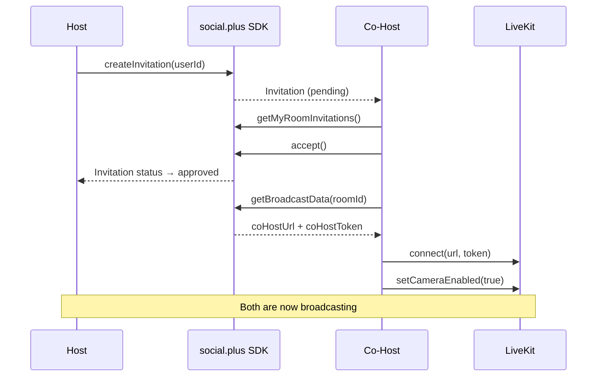

<Info>**SDK v7.x** · Last verified March 2026 · iOS · Android · Web</Info>

<Tip>
**Platform note** — code samples below use TypeScript. Every method has an equivalent in the iOS (Swift) and Android (Kotlin) SDKs — see the linked SDK reference in each step.
</Tip>

<Accordion title="Speed run — just the code" icon="forward">
```typescript
import { RoomRepository, InvitationRepository } from '@amityco/ts-sdk';
import { Room as LiveKitRoom } from 'livekit-client';

// HOST: invite a co-host
await room.createInvitation('co-host-user-id');

// CO-HOST: poll for invitation & accept
const invitation = await room.getInvitation();
if (invitation?.status === 'pending') await invitation.accept();

// CO-HOST: get credentials & go live
const bd = await RoomRepository.getBroadcastData(room.roomId);
const lk = new LiveKitRoom();
await lk.connect(bd.coHostUrl, bd.coHostToken);
await lk.localParticipant.setCameraEnabled(true);
await lk.localParticipant.setMicrophoneEnabled(true);
```
Full walkthrough below ↓
</Accordion>

<Frame caption="Co-host stage — host and co-host broadcasting together with live chat">
  
</Frame>

Co-hosting lets multiple broadcasters share the stage during a live session. This guide covers both sides of the flow — the **host** sending and managing invitations, and the **co-host** accepting and joining the broadcast.



<Info>
**Prerequisites**: A room must already exist and the host must be connected to LiveKit. See [Go Live & Room Management](/use-cases/social/livestream/go-live-and-room-management) first.
</Info>

---

## How Co-Hosting Works

| Role | Can do | Can't do |
|------|--------|----------|
| **Host** | Send / cancel invitations, remove co-hosts, stop room | — |
| **Co-Host** | Broadcast audio + video, interact in chat | Stop room, send invitations |

Invitation statuses:

| Status | Meaning |
|--------|---------|
| `pending` | Awaiting the invitee's response |
| `approved` | Invitee accepted — ready to join broadcast |
| `rejected` | Invitee declined |
| `cancelled` | Host cancelled before invitee responded |

---

## Host Side

<Steps>
  <Step title="Send a co-host invitation">
    Invitations are sent one user at a time. The host must already have a room.

    ```typescript
    await room.createInvitation(userId);
    ```

    To invite multiple co-hosts, call `createInvitation` once per user.
  </Step>
  <Step title="Track invitation status">
    Observe all invitations you've sent to show pending / accepted / declined states in your UI.

    ```typescript
    const unsubscribe = InvitationRepository.getInvitations(
      {
        targetId: roomId,
        targetType: InvitationTargetType.Room,
        limit: 20,
      },
      ({ data, loading, error }) => {
        if (data) {
          data.forEach(inv => console.log(inv.userId, inv.status));
        }
      },
    );
    ```
  </Step>
  <Step title="Cancel a pending invitation">
    Cancel before the invitee responds — e.g., if you sent the wrong user.

    ```typescript
    await invitation.cancel();
    ```
  </Step>
</Steps>

---

## Co-Host Side

<Steps>
  <Step title="Retrieve your invitations">
    Poll or observe your pending room invitations. Show them as an in-app notification or banner.

    ```typescript
    const unsubscribe = InvitationRepository.getMyRoomInvitations(
      { limit: 20 },
      ({ data }) => {
        const pending = data?.filter(inv => inv.status === 'pending');
        // Show pending invitations to the user
      },
    );
    ```
  </Step>
  <Step title="Accept or decline">
    Present an "Accept / Decline" UI. Both operations are one-liners.

    ```typescript
    // Accept
    await invitation.accept();

    // Decline
    await invitation.reject();
    ```
  </Step>
  <Step title="Join the broadcast">
    After accepting, fetch broadcast credentials and connect to LiveKit — same flow as the host.

    ```typescript
    const broadcastData = await RoomRepository.getBroadcastData(roomId);
    const liveKitRoom = new LiveKitRoom();
    await liveKitRoom.connect(broadcastData.coHostUrl, broadcastData.coHostToken);
    await liveKitRoom.localParticipant.setCameraEnabled(true);
    await liveKitRoom.localParticipant.setMicrophoneEnabled(true);
    ```
  </Step>
</Steps>

---

## UIKit: Pre-Built Co-Host Components

If you're using UIKit, the co-hosting UI is handled for you:

| Component | What it does | Platforms |
|-----------|-------------|-----------|
| `AmityLivestreamInviteCoHostPage` | Full-screen invite picker for the host | iOS, Android, Web |
| `AmityLivestreamCoHostStage` | Grid layout showing all active co-hosts | iOS, Android, Web |

<Tip>
See the component reference → [Livestream Components](/uikit/components/social/livestream)
</Tip>

---

## Common Mistakes

<Warning>
**Calling `getBroadcastData` before accepting** — The co-host must accept the invitation first. Calling `getBroadcastData` while the invitation is still `pending` or `rejected` will fail.
</Warning>

<Warning>
**Not listening for invitation status changes** — Use the live collection (`getInvitations` / `getMyRoomInvitations`) instead of a one-shot fetch. Statuses update in real-time (e.g., host cancels while you're looking at the invite).
</Warning>

<Warning>
**Assuming the room is still live** — Between the invitation and the accept, the host may have stopped the stream. Always check `room.status === 'live'` before calling `getBroadcastData`.
</Warning>

## Best Practices

<AccordionGroup>
  <Accordion title="UX for invitation flow" icon="bell">
    - Show pending invitations as a prominent banner or bottom-sheet, not a buried list
    - Include the host's display name and room title in the invitation UI
    - After accepting, navigate directly to a "Preparing to go live…" screen
  </Accordion>
  <Accordion title="Handling disconnections" icon="plug">
    - If a co-host's LiveKit connection drops, listen for `RoomEvent.Disconnected` and show a "Reconnecting" state
    - Give co-hosts a "Leave stage" button that disconnects from LiveKit without ending the room
    - The host should see a visual indicator when a co-host goes offline
  </Accordion>
  <Accordion title="Scaling to many co-hosts" icon="users">
    - Each co-host adds a video track — bandwidth and layout get complex above 4–6 hosts
    - Consider a grid layout that caps visible tiles and puts overflow in a scrollable strip
    - Test on lower-end devices to verify performance with multiple video tracks
  </Accordion>
</AccordionGroup>

---

## Next Steps

<CardGroup cols={3}>
  <Card title="Go Live & Room Management" href="/use-cases/social/livestream/go-live-and-room-management" icon="tower-broadcast">
    Room creation, broadcast setup, and lifecycle management.
  </Card>
  <Card title="Live Chat & Engagement" href="/use-cases/social/livestream/live-chat-and-engagement" icon="comments">
    Wire up chat, reactions, and viewer count alongside the video.
  </Card>
  <Card title="Product Tagging" href="/use-cases/social/livestream/product-tagging" icon="tags">
    Pin products to the stream for live commerce.
  </Card>
</CardGroup>
