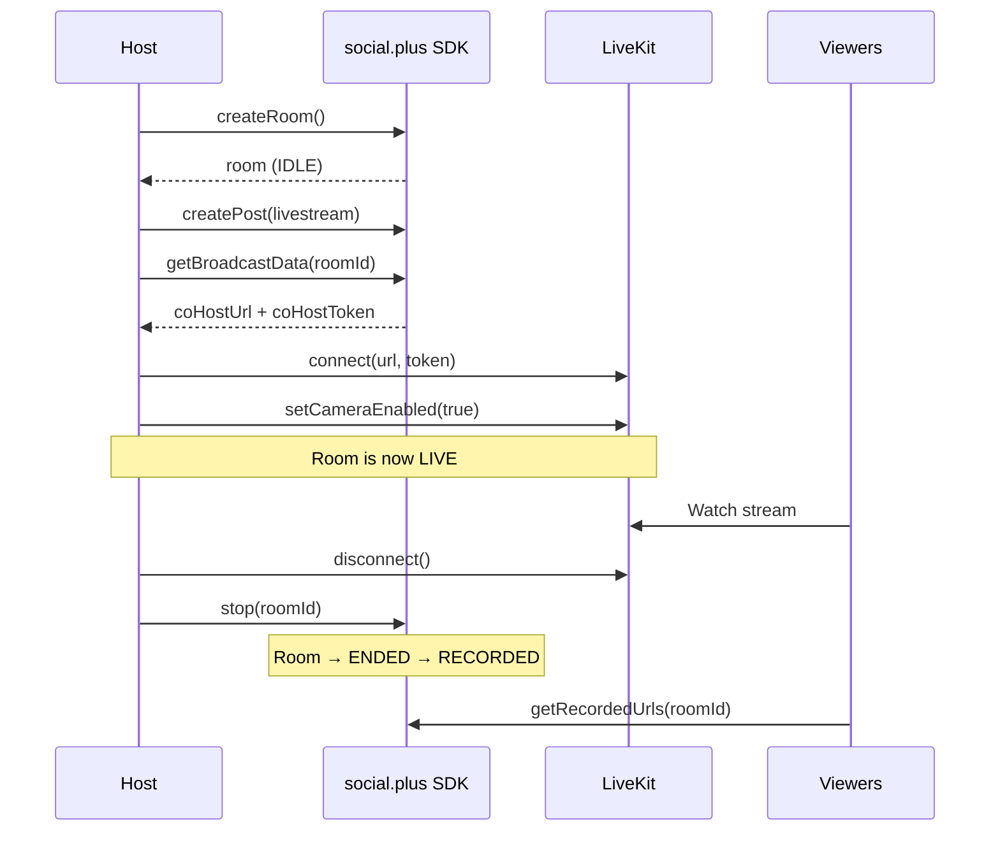

<Info>**SDK v7.x** · Last verified March 2026 · iOS · Android · Web</Info>

<Accordion title="Speed run — just the code" icon="forward">
```typescript
import { RoomRepository, PostRepository } from '@amityco/ts-sdk';
import { Room as LiveKitRoom } from 'livekit-client';

// 1. Create a room with live chat enabled
const room = await RoomRepository.createRoom({
  title: 'Friday AMA', channelEnabled: true,
});

// 2. Publish a livestream post
await PostRepository.createPost({
  targetType: 'community', targetId: communityId,
  dataType: 'livestream', data: { streamId: room.roomId },
});

// 3. Get broadcaster credentials & connect
const bd = await RoomRepository.getBroadcastData(room.roomId);
const lk = new LiveKitRoom();
await lk.connect(bd.coHostUrl, bd.coHostToken);
await lk.localParticipant.setCameraEnabled(true);
await lk.localParticipant.setMicrophoneEnabled(true);

// 4. Stop & get recording
await lk.disconnect();
await RoomRepository.stop(room.roomId);
```
Full walkthrough below ↓
</Accordion>

<Tip>
**Platform note** — code samples below use TypeScript. Every method has an equivalent in the iOS (Swift) and Android (Kotlin) SDKs — see the linked SDK reference in each step.
</Tip>

<Frame caption="Host broadcasting with live chat overlay">
  
</Frame>

This guide covers the host's journey: create a room, wire up the broadcast, monitor lifecycle transitions, query live rooms for a "Live Now" section, and access recordings after the stream ends.



<Info>
**Prerequisites**: SDK + Video SDK installed and authenticated → [Video Getting Started](/social-plus-sdk/video-new/getting-started/overview). A `communityId` is required — rooms are community-only.
</Info>

---

## Quick Start: Create a Room and Go Live

```typescript TypeScript
const room = await RoomRepository.createRoom({
  title: 'Product Launch Event',
  description: 'Join us for the unveiling',
  channelEnabled: true,  // auto-creates a live chat channel
});
console.log('Room created:', room.roomId, '— status:', room.status); // IDLE
```

Full reference → [Create Room](/social-plus-sdk/video-new/broadcasting/create-room)

---

## Step-by-Step Implementation

<Steps>
  <Step title="Create a broadcast room">
    A room is the container for a livestream session. Set `channelEnabled: true` to automatically create a live chat channel for viewer comments.

    ```typescript TypeScript
    import { RoomRepository } from '@amityco/ts-sdk';

    const room = await RoomRepository.createRoom({
      title: 'Weekly Q&A Session',
      description: 'Ask us anything',
      thumbnailFileId: null,
      metadata: { category: 'education' },
      channelEnabled: true,
      parentRoomId: null,
    });
    ```

    Full reference → [Create Room](/social-plus-sdk/video-new/broadcasting/create-room)
  </Step>
  <Step title="Publish a livestream post">
    Create a post in the community feed that links to the room. This shows a "LIVE" badge in the feed while the room is broadcasting.

    ```typescript TypeScript
    import { PostRepository, PostContentType } from '@amityco/ts-sdk';

    const { data: post } = await PostRepository.createPost({
      dataType: PostContentType.LIVESTREAM,
      targetType: 'community',
      targetId: communityId,
      data: { text: 'We are live!', streamId: room.roomId },
    });
    ```

    Full reference → [Live Stream Post](/social-plus-sdk/social/content-management/posts/creation/live-stream-post)
  </Step>
  <Step title="Get broadcaster credentials and connect to LiveKit">
    Fetch the LiveKit URL and token, then connect the host's camera and microphone.

    ```typescript TypeScript
    import { Room as LiveKitRoom, RoomEvent } from 'livekit-client';

    const broadcastData = await RoomRepository.getBroadcastData(room.roomId);

    const liveKitRoom = new LiveKitRoom();
    liveKitRoom.on(RoomEvent.Connected, () => console.log('Connected!'));
    liveKitRoom.on(RoomEvent.Disconnected, (reason) => console.log('Disconnected:', reason));

    await liveKitRoom.connect(broadcastData.coHostUrl, broadcastData.coHostToken);
    await liveKitRoom.localParticipant.setCameraEnabled(true);
    await liveKitRoom.localParticipant.setMicrophoneEnabled(true);
    // Room status is now LIVE
    ```

    Full reference → [Start Broadcasting](/social-plus-sdk/video-new/broadcasting/start-broadcasting)
  </Step>
  <Step title="Monitor room lifecycle">
    Observe the room to update your UI for each status transition.

    ```typescript TypeScript
    const roomLiveObject = RoomRepository.getRoom(room.roomId);

    roomLiveObject.on('dataUpdated', (room) => {
      switch (room.status) {
        case 'idle':     showUI('Ready to start'); break;
        case 'live':     showUI('Broadcasting'); break;
        case 'ended':    showUI('Stream ended — processing recording…'); break;
        case 'recorded': showUI('Recording available'); break;
      }
    });
    ```

    Full reference → [Manage Rooms](/social-plus-sdk/video-new/broadcasting/manage-rooms)
  </Step>
  <Step title="Query live rooms for a 'Live Now' section">
    Show currently-active livestreams in your app.

    ```typescript TypeScript
    const liveRooms = RoomRepository.getRooms({
      statuses: ['live'],
      types: ['co_hosts'],
      isDeleted: false,
      sortBy: 'lastCreated',
    });

    liveRooms.on('dataUpdated', (rooms) => {
      console.log('Currently live:', rooms.length, 'rooms');
    });
    ```

    Full reference → [Manage Rooms](/social-plus-sdk/video-new/broadcasting/manage-rooms)
  </Step>
  <Step title="Stop broadcasting and access recordings">
    Disconnect LiveKit first, then stop the room. Recordings become available within a few minutes.

    ```typescript TypeScript
    // 1. Disconnect from LiveKit
    await liveKitRoom.disconnect();

    // 2. Stop the room
    await RoomRepository.stop(room.roomId);

    // 3. Poll for recording (room status transitions: ENDED → RECORDED)
    const recordedUrls = await RoomRepository.getRecordedUrls(room.roomId);
    recordedUrls.forEach(url => console.log('Recording:', url));
    ```

    Full reference → [Recorded Playback](/social-plus-sdk/video-new/broadcasting/recorded-playback)
  </Step>
</Steps>

---

## Admin Console: Manage & Monitor Streams

After streams are created, you can manage them from **Admin Console → Live stream**.

<Frame caption="Live stream management — view all streams with status, type, and moderation flags">
  
</Frame>

Click any stream to see its detail page with recording playback, metadata, and moderation status.

<Frame caption="Stream detail — recording playback, stream ID, creator info, and moderation status">
  
</Frame>

To review stream performance, go to **Admin Console → Video Analytics → Live stream**.

<Frame caption="Livestream analytics dashboard — total streams, views, unique viewers, and watch time">
  
</Frame>

Click any row in the stream table to see per-stream metrics including concurrent viewers over time and chat messages.

<Frame caption="Per-stream analytics — unique viewers, chat messages, and reactions over time">
  
</Frame>

---

## Connect to Moderation & Analytics

<AccordionGroup>
  <Accordion title="Stream analytics in Admin Console" icon="chart-bar">
    Track peak concurrent viewers, total watch time, and engagement per stream in **Admin Console → Analytics → Video**.

    → [Video Analytics](/social-plus-sdk/video-new/analytics/overview)
  </Accordion>
  <Accordion title="Livestream moderation" icon="shield">
    Moderators can view and manage all active and past livestreams in **Admin Console → Moderation → Livestream Moderation**.

    → [Livestream Moderation](/analytics-and-moderation/console/moderation/livestream-moderation)
  </Accordion>
  <Accordion title="Webhook: stream lifecycle events" icon="webhook">
    Receive `stream.started`, `stream.ended`, `recording.completed` webhook events for backend automation (e.g., notify followers, archive recordings).

    → [Stream Events](/social-plus-sdk/video-new/notifications/stream-events) · [Webhooks](/analytics-and-moderation/social+-apis-and-services/webhook-event)
  </Accordion>
</AccordionGroup>

---

## Common Mistakes

<Warning>
**Stopping the room before disconnecting LiveKit** — Always call `liveKitRoom.disconnect()` first, then `RoomRepository.stop(roomId)`. Reversing the order can leave orphaned media tracks.
</Warning>

<Warning>
**Not observing the room lifecycle** — The status transitions (`idle → live → ended → recorded`) are asynchronous. Hardcoding delays instead of observing the room live object results in brittle UI states.
</Warning>

<Warning>
**Polling for recordings too aggressively** — Recordings take a few minutes to process. Use the room's live object with a `dataUpdated` listener to detect when `status === 'recorded'` rather than polling every second.
</Warning>

## Best Practices

<AccordionGroup>
  <Accordion title="Startup latency" icon="bolt">
    - Pre-fetch `getBroadcastData()` before the user taps "Go Live" to cut startup time
    - Request camera and microphone permissions during the room creation step, not at connect time
    - Show a preview of the camera feed while the LiveKit connection is establishing
  </Accordion>
  <Accordion title="Reconnection handling" icon="rotate">
    - Listen for `RoomEvent.Reconnecting` and `RoomEvent.Reconnected` from LiveKit
    - Show a "Reconnecting…" banner to the host — don't silently drop to ended
    - Configure LiveKit's `autoSubscribe` and `reconnectPolicy` for aggressive retry
  </Accordion>
  <Accordion title="Recordings" icon="circle-play">
    - The livestream post stays in the feed after the stream ends — update it to show the recording thumbnail
    - Store recording URLs in your backend; platform URLs may have retention policies
    - Offer a "Watch replay" CTA on the post once `status === 'recorded'`
  </Accordion>
</AccordionGroup>

---

## Next Steps

<CardGroup cols={3}>
  <Card title="Co-Hosting" href="/use-cases/social/livestream/co-hosting" icon="users-viewfinder">
    Invite co-hosts to share the stage during a broadcast.
  </Card>
  <Card title="Live Chat & Engagement" href="/use-cases/social/livestream/live-chat-and-engagement" icon="comments">
    Wire up chat, reactions, and viewer count alongside the video.
  </Card>
  <Card title="Product Tagging" href="/use-cases/social/livestream/product-tagging" icon="tags">
    Pin products to the stream for live commerce.
  </Card>
</CardGroup>
