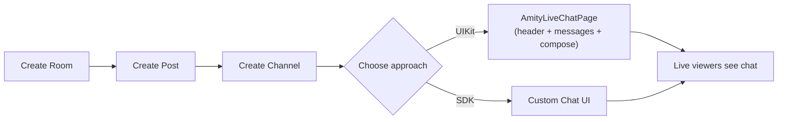

<Info>**SDK v7.x** · Last verified March 2026 · iOS · Android · Web</Info>

<Tip>
**Platform note** — code samples below use TypeScript. Every method has an equivalent in the iOS (Swift) and Android (Kotlin) SDKs — see the linked SDK reference in each step.
</Tip>

<Accordion title="Speed run — just the code" icon="forward">
```typescript
import { ChannelRepository } from '@amityco/ts-sdk';

// 1. Create the live chat channel (after room + post exist)
const channel = await ChannelRepository.createChannel({
  displayName: room.title,
  type: 'live',
  postId: post.postId,
  roomId: room.roomId,
});

// 2. Drop in the UIKit component — that's it
// React: <AmityLiveChatPage channelId={channel.channelId} />
// iOS:   AmityLiveChatPage(channelId: channel.channelId)
// Android: AmityLiveChatPage(channelId = channel.channelId)
```
Full walkthrough below ↓
</Accordion>

<Frame caption="Live chat with host badge, viewer messages, and reaction button">
  
</Frame>

Every livestream needs a chat. This guide walks through creating the live chat channel, wiring up the UIKit chat components (or building with the SDK directly), adding reactions, and tracking viewer engagement.



<Info>
**Prerequisites**:
- A room and livestream post already exist → [Go Live & Room Management](/use-cases/social/livestream/go-live-and-room-management)
- UIKit installed if using the pre-built components → [UIKit Getting Started](/uikit/getting-started/ios)
</Info>

<Warning>
**Channels are NOT auto-created.** Setting `channelEnabled: true` on the room only flags that a channel is supported. You must manually create the live channel after the post is created, passing both `postId` and `roomId`.
</Warning>

---

## Step 1: Create the Live Chat Channel

Create the channel after the room and livestream post exist. The channel needs both the `postId` and `roomId` to be properly linked.

```typescript
const channel = await ChannelRepository.createChannel({
    displayName: room.title,
    type: 'live',
    postId: post.postId,
    roomId: room.roomId,
});

console.log('Live chat channel created:', channel.channelId);
```

Once created, the channel ID is also available on the room object as `room.channelId`.

---

## Step 2: Add the Chat UI

### Option A: UIKit (recommended)

Drop in a single component for a full chat experience — header with channel name + member count, scrolling message list, and compose bar with mentions and reactions.

<Tabs>
  <Tab title="iOS">
    ```swift
    import AmityUIKit

    let liveChatPage = AmityLiveChatPage(channelId: channel.channelId)

    // Use in SwiftUI directly, or wrap for UIKit:
    let viewController = AmitySwiftUIHostingController(rootView: liveChatPage)
    present(viewController, animated: true)
    ```
  </Tab>
  <Tab title="Android">
    ```kotlin
    import co.amity.socialplus.uikit.AmityLiveChatPage

    @Composable
    fun LiveChatScreen(channelId: String) {
        AmityLiveChatPage(channelId = channelId)
    }
    ```
  </Tab>
  <Tab title="Web / React">
    ```tsx
    import { AmityLiveChatPage } from '@amityco/ui-kit';

    function LiveChat({ channelId }: { channelId: string }) {
      return <AmityLiveChatPage channelId={channelId} />;
    }
    ```
  </Tab>
</Tabs>

`AmityLiveChatPage` bundles three sub-components you can also use individually:

| Component | What it does |
|-----------|-------------|
| `AmityLiveChatHeader` | Channel name, avatar, live member count |
| `AmityLiveChatMessageList` | Scrolling messages with copy, reply, delete, and flag actions |
| `AmityLiveChatMessageComposeBar` | Text input with `@mention` suggestions, reply, and character limit |

<Tip>
Full component reference → [Live Chat Components](/uikit/components/chat/live-chat)
</Tip>

### Option B: Build with the SDK

If you need a fully custom UI, use the Chat SDK to send and observe messages directly.

```typescript
import { MessageRepository, ChannelRepository } from '@amityco/ts-sdk';

// Send a message
await MessageRepository.createMessage({
  subChannelId: channel.channelId,
  dataType: 'text',
  data: { text: 'Hello from the stream!' },
});

// Observe messages in real time
const unsubscribe = MessageRepository.getMessages(
  { subChannelId: channel.channelId, limit: 50 },
  ({ data, loading, error }) => {
    if (data) renderMessages(data);
  },
);
```

Full reference → [Chat SDK](/social-plus-sdk/chat/overview)

---

## Step 3: Reactions

Live chat messages support emoji reactions to drive engagement during the stream.

### UIKit

The `AmityReactionList` component renders reaction counts and user lists out of the box:

```typescript
const reactionList = AmityReactionList({
  referenceId: message.messageId,
  referenceType: 'message',
});
```

### SDK

Add and remove reactions programmatically:

```typescript
// Add a reaction
await MessageRepository.addReaction(message.messageId, 'fire');

// Remove a reaction
await MessageRepository.removeReaction(message.messageId, 'fire');
```

---

## Step 4: Viewer Count & Channel Info

The live chat channel exposes real-time metadata you can display alongside the stream:

| Property | What it tells you |
|----------|-------------------|
| `channel.memberCount` | Total members who joined the channel |
| `channel.metadata` | Custom data (e.g., pinned announcement) |
| Room `watcherCount` (via analytics) | Active viewers watching the stream |

The `AmityLiveChatHeader` UIKit component renders member count automatically.

---

## Step 5: Moderation

<AccordionGroup>
  <Accordion title="Flag messages" icon="flag">
    Any user can flag an inappropriate message. Flagged messages appear in the Admin Console for moderator review.

    ```typescript TypeScript
    await MessageRepository.flagMessage(message.messageId);
    ```
  </Accordion>
  <Accordion title="Delete messages (moderator)" icon="trash">
    Community moderators and admins can hard-delete messages:

    ```typescript TypeScript
    await MessageRepository.deleteMessage(message.messageId);
    ```
  </Accordion>
  <Accordion title="Ban users from chat" icon="ban">
    Remove disruptive users from the live chat channel:

    ```typescript TypeScript
    await ChannelRepository.banMembers(channel.channelId, ['user-id']);
    ```
  </Accordion>
  <Accordion title="AI content moderation" icon="robot">
    Enable AI moderation in **Admin Console → AI Content Moderation** to auto-flag or auto-remove messages matching your policy. Works in real-time for live chat.

    → [AI Content Moderation](/analytics-and-moderation/console/ai-content-moderation)
  </Accordion>
</AccordionGroup>

---

## Common Mistakes

<Warning>
**Forgetting to create the channel** — `channelEnabled: true` does NOT auto-create the channel. You must call `createChannel()` with the `postId` and `roomId` after both exist. Without this step, `room.channelId` is null and the chat UI renders nothing.
</Warning>

<Warning>
**Creating the channel before the post** — The channel needs the `postId` to be linked properly. Always create in order: room → post → channel.
</Warning>

<Warning>
**Not handling high message volume** — Live streams can generate hundreds of messages per second. Use UIKit's built-in virtualization, or if building custom, limit the visible message window and batch DOM updates.
</Warning>

## Best Practices

<AccordionGroup>
  <Accordion title="Layout: video + chat side by side" icon="columns">
    - On desktop/tablet, show chat in a right panel alongside the video player
    - On mobile, use a bottom sheet or overlay that can be swiped away
    - Keep the compose bar always visible — don't hide it behind a tap
  </Accordion>
  <Accordion title="Performance at scale" icon="gauge">
    - Use UIKit's `AmityLiveChatPage` which is optimized for high-volume streams
    - If building custom, debounce re-renders and virtualize the message list
    - Consider showing only the last 100 messages and lazy-loading history on scroll-up
  </Accordion>
  <Accordion title="Engagement features" icon="heart">
    - Pin an announcement message at the top of chat (use channel `metadata`)
    - Show host and co-host messages with a distinct badge color
    - Add a "slow mode" (rate limit) during peak moments to keep chat readable
  </Accordion>
</AccordionGroup>

---

## Next Steps

<CardGroup cols={3}>
  <Card title="Go Live & Room Management" href="/use-cases/social/livestream/go-live-and-room-management" icon="tower-broadcast">
    Room creation, broadcast setup, and lifecycle management.
  </Card>
  <Card title="Co-Hosting" href="/use-cases/social/livestream/co-hosting" icon="users-viewfinder">
    Invite co-hosts to share the stage during a broadcast.
  </Card>
  <Card title="Product Tagging" href="/use-cases/social/livestream/product-tagging" icon="tags">
    Pin products to the stream for live commerce.
  </Card>
</CardGroup>
