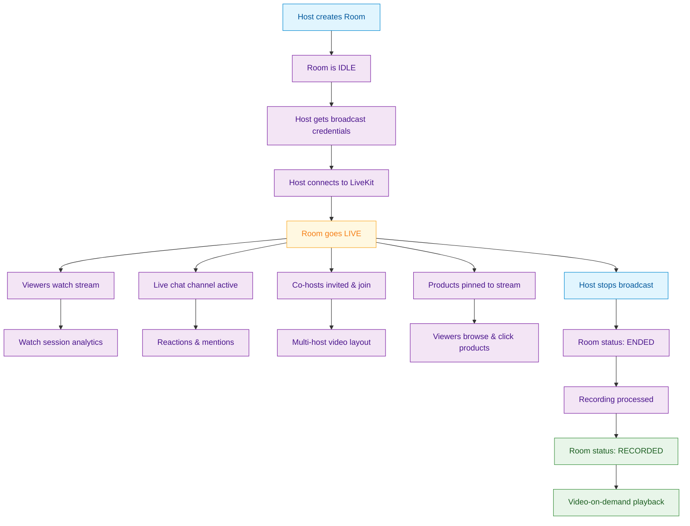
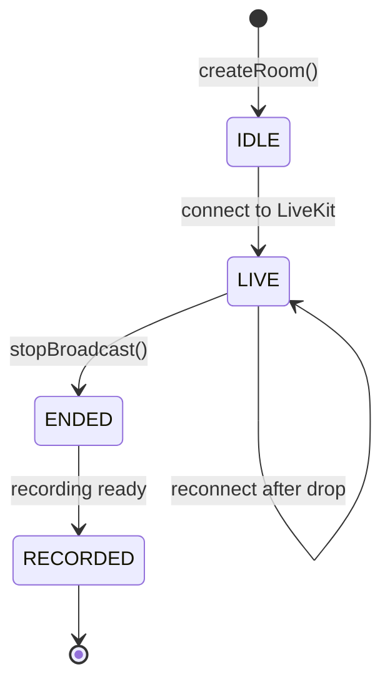

<Info>**SDK v7.x** · Last verified March 2026 · iOS · Android · Web</Info>

<Frame caption="Livestream with co-host, live chat, reactions, and host badge">
  
</Frame>

social.plus provides a full livestream stack built on top of LiveKit. A broadcast lives inside a **Room**, which owns a live chat channel, co-host invitations, product tags, and recordings. This section breaks the livestream workflow into focused guides.

## Architecture

## Room Lifecycle

Every livestream session is a **Room**. A Room transitions through these states:

| State | Meaning | Available actions |
|---|---|---|
| `IDLE` | Room created, not yet broadcasting | Start broadcast, invite co-hosts, delete |
| `LIVE` | Currently broadcasting | Stream, invite co-hosts, pin products, live chat |
| `ENDED` | Broadcast stopped, recording processing | Wait for recording |
| `RECORDED` | Recording available for playback | Video-on-demand playback |

## Choose Your Approach

<CardGroup cols={2}>
  <Card title="UIKit — Out of the Box" icon="palette" href="/uikit/components/social/livestream">
    Pre-built UI for stream creation, co-hosting, viewing, live chat, and product tagging. Drop in and go — no LiveKit wiring needed. → iOS · Android · Web
  </Card>
  <Card title="SDK — Full Control" icon="code">
    Build a custom livestream experience with the APIs covered in the guides below. You manage the LiveKit connection, UI layout, and player.
  </Card>
</CardGroup>

## Guides

<CardGroup cols={2}>
  <Card title="Go Live & Room Management" icon="tower-broadcast" href="/use-cases/social/livestream/go-live-and-room-management">
    Create a room, get broadcaster credentials, connect to LiveKit, monitor room status, and access recordings.
  </Card>
  <Card title="Co-Hosting" icon="users-viewfinder" href="/use-cases/social/livestream/co-hosting">
    Invite co-hosts, accept/decline invitations, manage the multi-host stage, and handle co-host events.
  </Card>
  <Card title="Live Chat & Engagement" icon="comments" href="/use-cases/social/livestream/live-chat-and-engagement">
    Wire up real-time chat alongside the video, show viewer count, reactions, mentions, and moderation controls.
  </Card>
  <Card title="Product Tagging" icon="tags" href="/use-cases/social/livestream/product-tagging">
    Tag products to a livestream post, pin/unpin featured products, and track viewer clicks and impressions.
  </Card>
</CardGroup>

<Info>
The original [Livestream & Video Posts](/use-cases/social/livestream-and-video-posts) guide covers the end-to-end basics in a single page. The guides above break each topic into deeper, standalone walkthroughs.
</Info>

## Prerequisites

All guides in this section assume:
- SDK installed and authenticated → [SDK Setup](/social-plus-sdk/getting-started/overview)
- Video SDK configured → [Video Getting Started](/social-plus-sdk/video-new/getting-started/overview)
- A `communityId` to host the room (rooms are community-only)
- `livekit-client` package installed (for SDK approach)

<Tip>
**Dive deeper**: [Video SDK Reference](/social-plus-sdk/video-new/overview) has full parameter tables, method signatures, and platform-specific details for every API used in these guides.
</Tip>
