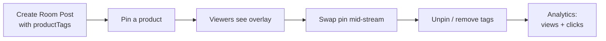

<Info>**SDK v7.x** · Last verified March 2026 · iOS · Android · Web</Info>

<Tip>
**Platform note** — code samples below use TypeScript. Every method has an equivalent in the iOS (Swift) and Android (Kotlin) SDKs — see the linked SDK reference in each step.
</Tip>

<Accordion title="Speed run — just the code" icon="forward">
```typescript
import { PostRepository } from '@amityco/ts-sdk';

// 1. Create a room post with product tags + pinned product
const post = await PostRepository.createRoomPost({
  targetType: 'community', targetId: communityId,
  data: { roomId: room.roomId, title: 'Flash Sale Live!' },
  productTags: [
    { productId: 'prod_001', text: 'Nike Air Max', index: 0, length: 12 },
    { productId: 'prod_002', text: 'Adidas Ultra', index: 13, length: 12 },
  ],
  pinnedProductId: 'prod_001',
});

// 2. Swap pinned product mid-stream (uses CHILD post ID)
await PostRepository.pinProduct(childPostId, 'prod_002');

// 3. Unpin when done showcasing
await PostRepository.unpinProduct(childPostId);
```
Full walkthrough below ↓
</Accordion>

<Frame caption="Pinned product overlay during a live broadcast with chat and viewer count">
  
</Frame>

Product tagging turns a livestream into a shoppable experience. Hosts tag products from the catalog, pin one at a time as a prominent overlay, and viewers can browse and click through — all without leaving the stream.



<Info>
**Prerequisites**:
- A room and livestream post already exist → [Go Live & Room Management](/use-cases/social/livestream/go-live-and-room-management)
- **Product Catalog** is configured and enabled in your Admin Console
- Available on **iOS, Android, and Web** only (Flutter / React Native not yet supported)
</Info>

<Warning>
**Child Post ID** — `pinProduct`, `unpinProduct`, and `updateProductTags` all operate on the **child** room post, not the parent. Use the child post ID returned at creation.
</Warning>

---

## How Product Tagging Works

| Phase | Who can tag | Who can pin |
|-------|-----------|-------------|
| **Pre-live** (backstage) | Host only | Host only |
| **During livestream** | Host + co-host (if granted) | Host + co-host (if granted) |
| **Post-live** (management) | Host only | — |

Viewers can browse and open tagged products during all phases, including replay.

| Limit | Value |
|-------|-------|
| Max products per livestream | 20 |
| Simultaneously pinned products | 1 |

---

## Admin Console: Set Up Your Product Catalogue

Before you can tag products in a livestream, your catalogue must be populated in **Admin Console → Product catalogue**.

<Steps>
  <Step title="Open the Product Catalogue">
    Navigate to **Product catalogue** in the Admin Console sidebar.

    <Frame caption="Product Catalogue dashboard — search, filter, import, and manage products">
      
    </Frame>
  </Step>
  <Step title="Add products">
    Click **+ Add product** to create products individually, or use **Import** to upload a CSV for bulk creation. Each product needs an ID, name, URL, and status set to **Active**.

    <Frame caption="Add product form — product ID, name, URL, price, and thumbnail image">
      
    </Frame>
  </Step>
  <Step title="Verify products are Active">
    Only products with **Active** status show up in the tag-product search on the app side. Archived products are hidden from tagging.
  </Step>
</Steps>

<Tip>
Full Admin Console guide → [Product Catalogue](/analytics-and-moderation/console/product-management/overview)
</Tip>

---

## In-App: Tag & Pin Products

Once products exist in the catalogue, hosts (and co-hosts with permission) can tag and pin them during the stream.

<CardGroup cols={2}>
  <Card title="Tag products" icon="search">
    <Frame caption="Search and select products from the catalogue">
      
    </Frame>
  </Card>
  <Card title="Manage tagged products" icon="list-check">
    <Frame caption="Pin, unpin, and remove tagged products">
      
    </Frame>
  </Card>
</CardGroup>

### Viewer experience

Viewers see a tag icon with a badge count. Tapping opens a scrollable product list with prices and "View" buttons.

<Frame caption="Viewer's product list — browse tagged products without leaving the stream">
  
</Frame>

---

## Step-by-Step Implementation

<Steps>
  <Step title="Create a room post with product tags">
    Attach products at creation time. Optionally pre-pin one.

    ```typescript
    const post = await PostRepository.createRoomPost({
      targetType: 'community',
      targetId: communityId,
      data: {
        roomId: room.roomId,
        title: 'Flash Sale',
        text: 'Flash Sale Live! Check out Nike Air Max!',
      },
      productTags: [
        { productId: 'prod_001', text: 'Nike Air Max', index: 38, length: 12 },
      ],
      pinnedProductId: 'prod_001',
    });
    ```

    Full reference → [Product Tagging SDK](/social-plus-sdk/video-new/broadcasting/product-tagging)
  </Step>
  <Step title="Pin and swap products mid-stream">
    Only one product can be pinned at a time. Pinning a new product automatically replaces the previous one — no need to unpin first.

    ```typescript
    // Pin a product (uses CHILD post ID)
    await PostRepository.pinProduct(childPostId, 'prod_002');

    // Unpin the current product
    await PostRepository.unpinProduct(childPostId);
    ```
  </Step>
  <Step title="Update the tag list during the stream">
    `updateProductTags` does a full replacement. To add a product, merge it with the existing array. If the currently pinned product is not in the new array, it is automatically unpinned.

    ```typescript
    await PostRepository.updateProductTags(childPostId, [
      { productId: 'prod_001' },
      { productId: 'prod_002' },
      { productId: 'prod_003' },
    ]);
    ```
  </Step>
  <Step title="Grant co-host product permissions">
    By default co-hosts cannot manage products. The host must explicitly grant permission.

    ```typescript
    await RoomRepository.updateCohostPermission(
      room.roomId,
      'cohost_456',
      true, // canManageProductTags
    );
    ```

    Full reference → [Co-Host Management](/social-plus-sdk/video-new/broadcasting/co-host-management)
  </Step>
  <Step title="Track product engagement">
    Fire view and click analytics to measure which products drive the most interest.

    ```typescript
    // When a product card becomes visible
    product.analytics.markAsViewed(
      'livestream_page/product_list/product_item',
      AnalyticsSourceTypeEnum.ROOM,
      roomId,
    );

    // When a viewer taps the product link
    product.analytics.markAsClicked(
      'livestream_page/product_list/product_item',
      AnalyticsSourceTypeEnum.ROOM,
      roomId,
    );
    ```

    Events are fire-and-forget and automatically deduplicated per product per source.
  </Step>
</Steps>

---

## UIKit: Pre-Built Product Tagging Components

If you're using UIKit, the product tagging UI is handled with two shared components:

| Component | Used for | Platforms |
|-----------|---------|-----------|
| `ProductTagSelectionComponent` | Searching and selecting products to tag (up to 20 in livestream mode) | iOS, Android, Web |
| `ManageProductTagListComponent` | Managing tagged products with pin/unpin/remove (host view); browsable read-only list (viewer view) | iOS, Android, Web |

The viewer sees a tag icon with a badge count. Tapping it opens a scrollable product list overlay. Tapping a product opens its link in an in-app browser while the stream continues playing.

<Tip>
Full component reference → [Product Tagging Components](/uikit/components/social/product-tagging) · [Livestream Components](/uikit/components/social/livestream)
</Tip>

---

## Common Mistakes

<Warning>
**Using the parent post ID instead of the child post ID** — `pinProduct`, `unpinProduct`, and `updateProductTags` all require the **child** room post ID. Using the parent ID silently fails or throws an error.
</Warning>

<Warning>
**Calling `updateProductTags` with just the new product** — This is a full replacement, not an append. If you pass only the new product, all existing tags are removed. Always merge with the existing array first.
</Warning>

<Warning>
**Pinning a product that isn't in `productTags`** — The product must already exist in the tag list. Pin it after adding it via `createRoomPost` or `updateProductTags`.
</Warning>

## Best Practices

<AccordionGroup>
  <Accordion title="Merchandising strategy" icon="store">
    - Pre-tag all products before going live so they're ready immediately
    - Pin the highest-margin or most-relevant product first
    - Swap the pinned product every 3–5 minutes to keep the showcase fresh
    - Remove sold-out products from the tag list in real-time
  </Accordion>
  <Accordion title="Co-host coordination" icon="users">
    - Grant product permissions to a dedicated "product manager" co-host
    - Have the host focus on presenting while the co-host manages pin swaps
    - Revoke permissions if a co-host leaves mid-stream
  </Accordion>
  <Accordion title="Analytics & optimization" icon="chart-line">
    - Call `markAsViewed` when the product card enters the viewport (use intersection observer on Web)
    - Call `markAsClicked` on tap/click before opening the product URL
    - Review view-to-click ratios in the Admin Console to optimize product placement
    - A/B test pin timing to find the optimal pin duration per product category
  </Accordion>
</AccordionGroup>

---

## Next Steps

<CardGroup cols={3}>
  <Card title="Go Live & Room Management" href="/use-cases/social/livestream/go-live-and-room-management" icon="tower-broadcast">
    Room creation, broadcast setup, and lifecycle management.
  </Card>
  <Card title="Co-Hosting" href="/use-cases/social/livestream/co-hosting" icon="users-viewfinder">
    Invite co-hosts to share the stage during a broadcast.
  </Card>
  <Card title="Live Chat & Engagement" href="/use-cases/social/livestream/live-chat-and-engagement" icon="comments">
    Wire up chat, reactions, and viewer count alongside the video.
  </Card>
</CardGroup>
